# SPIR-V 架构与使用文档（结合 Vulkan）

## 目录
1. [SPIR-V 概述](#spir-v-概述)
2. [SPIR-V 架构](#spir-v-架构)
3. [SPIR-V 的作用与优势](#spir-v-的作用与优势)
4. [SPIR-V 编译流程](#spir-v-编译流程)
5. [SPIR-V 在 Vulkan 中的使用](#spir-v-在-vulkan-中的使用)
6. [SPIR-V 二进制格式](#spir-v-二进制格式)
7. [实际应用示例](#实际应用示例)
8. [工具链与调试](#工具链与调试)

---

## SPIR-V 概述

### 什么是 SPIR-V？

**SPIR-V** (Standard Portable Intermediate Representation - Version) 是 Khronos Group 开发的中间表示（IR）格式，用于表示 GPU 着色器程序。它是 Vulkan、OpenCL 和 OpenGL 4.6+ 的着色器标准格式。

### SPIR-V 的核心特点

- **二进制格式**: 紧凑的二进制表示，加载速度快
- **跨平台**: 独立于硬件和驱动，可在不同 GPU 上运行
- **离线编译**: 着色器在构建时编译，运行时无需编译
- **标准化**: 统一的中间表示，避免不同驱动实现差异
- **可验证**: 可以在运行时验证着色器的正确性

### SPIR-V 在图形管线中的位置

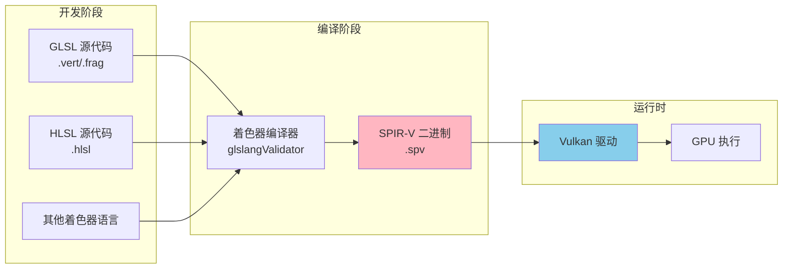

---

## SPIR-V 架构

### 整体架构层次

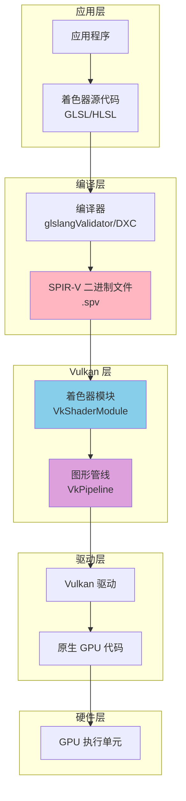

### SPIR-V 模块结构

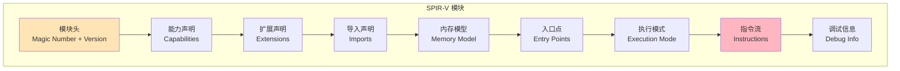

### SPIR-V 指令格式

SPIR-V 使用基于指令的格式，每条指令包含：

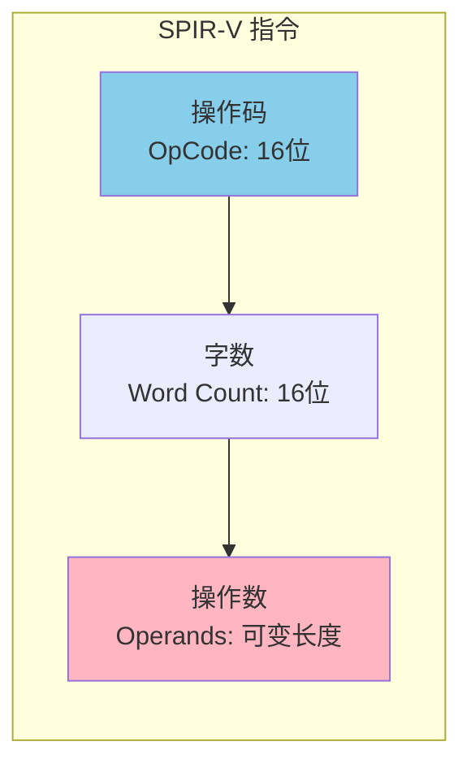

**指令结构示例**:
```
+--------+--------+--------+--------+
| Word Count | OpCode | Operand 1 | Operand 2 | ...
+--------+--------+--------+--------+
   16位      16位      32位        32位
```

---

## SPIR-V 的作用与优势

### 为什么需要 SPIR-V？

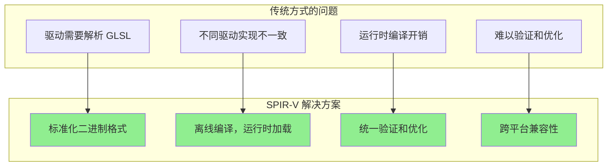

### SPIR-V 的主要优势

| 优势 | 说明 | 影响 |
|------|------|------|
| **性能** | 离线编译，运行时无需解析 | 减少启动时间和运行时开销 |
| **标准化** | 统一的中间表示格式 | 避免驱动实现差异 |
| **安全性** | 可验证的二进制格式 | 防止恶意代码注入 |
| **跨平台** | 独立于硬件和驱动 | 同一 SPIR-V 可在不同 GPU 上运行 |
| **工具支持** | 丰富的工具链支持 | 调试、优化、分析更容易 |
| **版本控制** | 二进制格式易于版本管理 | 着色器版本控制更简单 |

### SPIR-V vs 传统方式对比

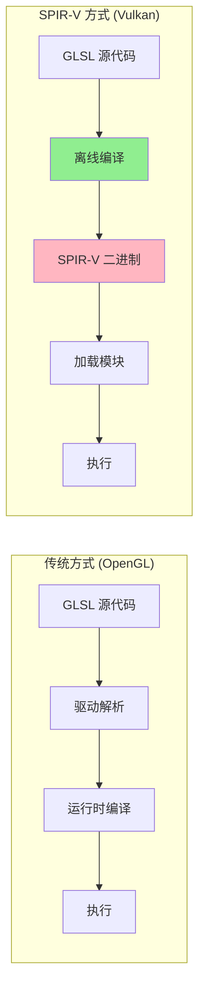

---

## SPIR-V 编译流程

### 完整编译流程

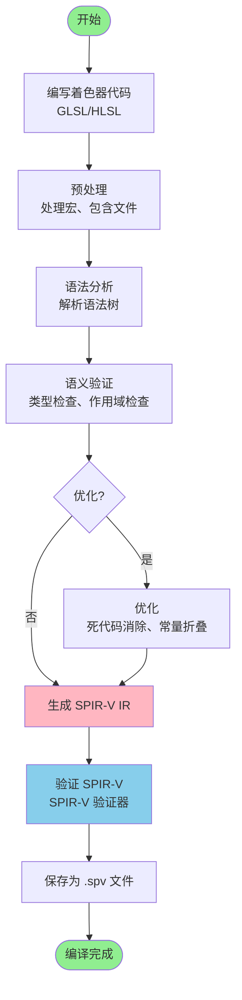

### GLSL 到 SPIR-V 编译示例

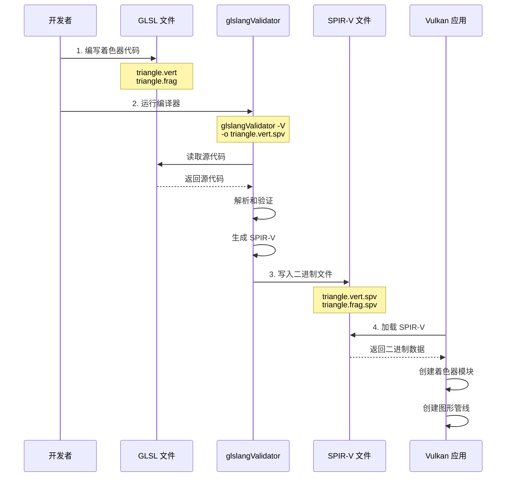

### 编译命令示例

```bash
# 编译顶点着色器
glslangValidator -V triangle.vert -o triangle.vert.spv

# 编译片段着色器
glslangValidator -V triangle.frag -o triangle.frag.spv

# 编译多个着色器
glslangValidator -V shader.vert shader.frag -o shaders.spv

# 启用优化
glslangValidator -V -Os triangle.vert -o triangle.vert.spv

# 生成调试信息
glslangValidator -V -g triangle.vert -o triangle.vert.spv
```

### 着色器源代码示例

**顶点着色器 (triangle.vert)**:
```glsl
#version 450

layout (location = 0) in vec3 inPos;
layout (location = 1) in vec3 inColor;

layout (binding = 0) uniform UBO 
{
    mat4 projectionMatrix;
    mat4 modelMatrix;
    mat4 viewMatrix;
} ubo;

layout (location = 0) out vec3 outColor;

out gl_PerVertex 
{
    vec4 gl_Position;   
};

void main() 
{
    outColor = inColor;
    gl_Position = ubo.projectionMatrix * ubo.viewMatrix * ubo.modelMatrix * vec4(inPos.xyz, 1.0);
}
```

**片段着色器 (triangle.frag)**:
```glsl
#version 450

layout (location = 0) in vec3 inColor;

layout (location = 0) out vec4 outFragColor;

void main() 
{
    outFragColor = vec4(inColor, 1.0);
}
```

---

## SPIR-V 在 Vulkan 中的使用

### Vulkan 中使用 SPIR-V 的完整流程

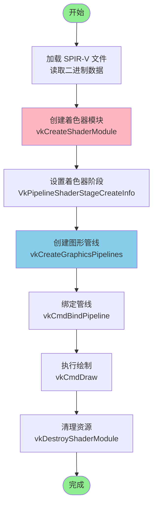

### 代码实现流程

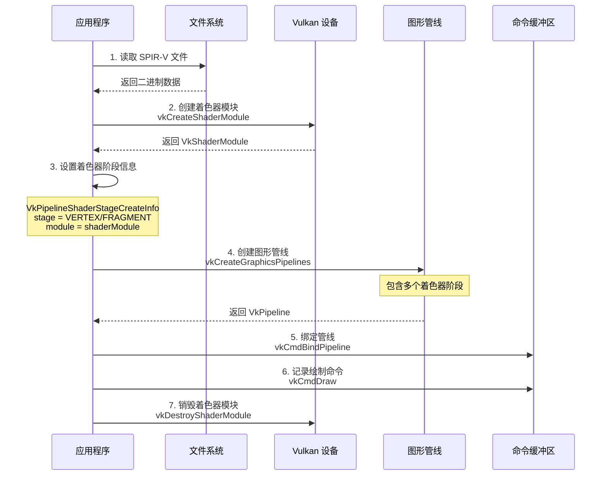

### 实际代码示例

#### 1. 加载 SPIR-V 文件

```cpp
/**
 * @brief 加载 SPIR-V 着色器
 * @param filename 着色器文件路径（SPIR-V 二进制文件）
 * @return 着色器模块句柄，失败时返回 VK_NULL_HANDLE
 */
VkShaderModule loadSPIRVShader(const std::string& filename)
{
    size_t shaderSize;  // 着色器代码大小
    char* shaderCode{ nullptr };  // 着色器代码缓冲区

    // 从文件系统加载着色器（二进制模式）
    std::ifstream is(filename, std::ios::binary | std::ios::in | std::ios::ate);

    if (is.is_open()) {
        shaderSize = is.tellg();  // 获取文件大小
        is.seekg(0, std::ios::beg);  // 定位到文件开头
        shaderCode = new char[shaderSize];  // 分配缓冲区
        is.read(shaderCode, shaderSize);  // 读取文件内容
        is.close();
        assert(shaderSize > 0);
    }

    if (shaderCode) {
        // 创建着色器模块
        VkShaderModuleCreateInfo shaderModuleCI{ 
            VK_STRUCTURE_TYPE_SHADER_MODULE_CREATE_INFO 
        };
        shaderModuleCI.codeSize = shaderSize;  // 代码大小（字节数）
        // SPIR-V 代码按 32 位字对齐
        shaderModuleCI.pCode = (uint32_t*)shaderCode;

        VkShaderModule shaderModule;
        VK_CHECK_RESULT(vkCreateShaderModule(
            device, &shaderModuleCI, nullptr, &shaderModule
        ));

        delete[] shaderCode;  // 释放缓冲区
        return shaderModule;
    } else {
        std::cerr << "Error: Could not open shader file \"" 
                  << filename << "\"" << std::endl;
        return VK_NULL_HANDLE;
    }
}
```

#### 2. 创建着色器阶段

```cpp
// 顶点着色器阶段
VkPipelineShaderStageCreateInfo vertexShaderStageCI{};
vertexShaderStageCI.sType = VK_STRUCTURE_TYPE_PIPELINE_SHADER_STAGE_CREATE_INFO;
vertexShaderStageCI.stage = VK_SHADER_STAGE_VERTEX_BIT;  // 顶点着色器阶段
vertexShaderStageCI.module = loadSPIRVShader("triangle.vert.spv");
vertexShaderStageCI.pName = "main";  // 入口函数名

// 片段着色器阶段
VkPipelineShaderStageCreateInfo fragmentShaderStageCI{};
fragmentShaderStageCI.sType = VK_STRUCTURE_TYPE_PIPELINE_SHADER_STAGE_CREATE_INFO;
fragmentShaderStageCI.stage = VK_SHADER_STAGE_FRAGMENT_BIT;  // 片段着色器阶段
fragmentShaderStageCI.module = loadSPIRVShader("triangle.frag.spv");
fragmentShaderStageCI.pName = "main";  // 入口函数名

// 着色器阶段数组
std::array<VkPipelineShaderStageCreateInfo, 2> shaderStages = {
    vertexShaderStageCI,
    fragmentShaderStageCI
};
```

#### 3. 创建图形管线

```cpp
VkGraphicsPipelineCreateInfo pipelineCI{};
pipelineCI.sType = VK_STRUCTURE_TYPE_GRAPHICS_PIPELINE_CREATE_INFO;
pipelineCI.stageCount = static_cast<uint32_t>(shaderStages.size());  // 着色器阶段数量
pipelineCI.pStages = shaderStages.data();  // 着色器阶段数组
// ... 其他管线状态设置 ...

VkPipeline pipeline;
VK_CHECK_RESULT(vkCreateGraphicsPipelines(
    device, pipelineCache, 1, &pipelineCI, nullptr, &pipeline
));
```

### 着色器模块生命周期

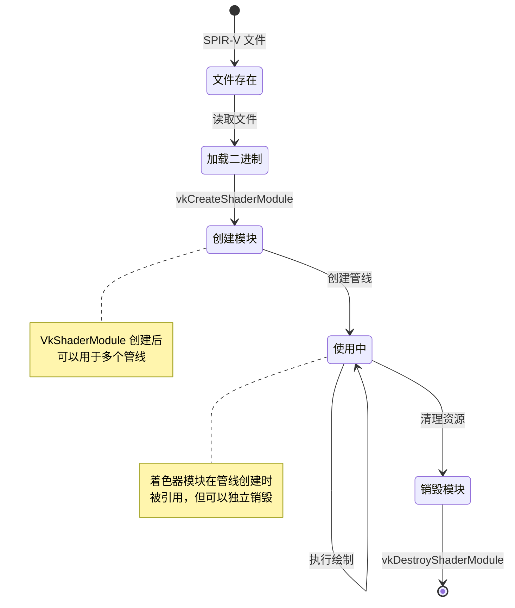

---

## SPIR-V 二进制格式

### SPIR-V 文件结构

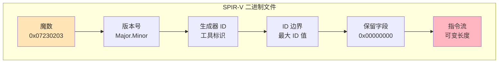

### SPIR-V 头部格式

```
+--------+--------+--------+--------+
| Magic Number    | Version         |
+--------+--------+--------+--------+
| Generator ID    | Bound           |
+--------+--------+--------+--------+
| Reserved (0)                      |
+--------+--------+--------+--------+
| Instructions...                   |
+--------+--------+--------+--------+
```

**头部字段说明**:
- **Magic Number**: `0x07230203` (SPIR-V 标识)
- **Version**: 主版本.次版本 (例如: 0x00010000 = 1.0)
- **Generator**: 生成器工具 ID (例如: glslang = 8)
- **Bound**: 最大结果 ID 值
- **Reserved**: 保留字段，必须为 0

### SPIR-V 指令示例

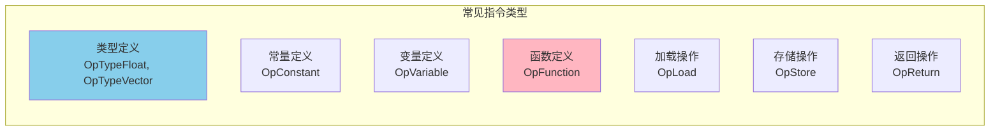

### SPIR-V 指令流示例

```
OpCapability Shader
OpMemoryModel Logical GLSL450
OpEntryPoint Vertex %main "main" %outColor %gl_Position
OpExecutionMode %main OriginUpperLeft
%float = OpTypeFloat 32
%v3float = OpTypeVector %float 3
%void = OpTypeVoid
%func = OpTypeFunction %void
%main = OpFunction %void None %func
  %label = OpLabel
  OpReturn
OpFunctionEnd
```

---

## 实际应用示例

### 完整的着色器加载和使用流程

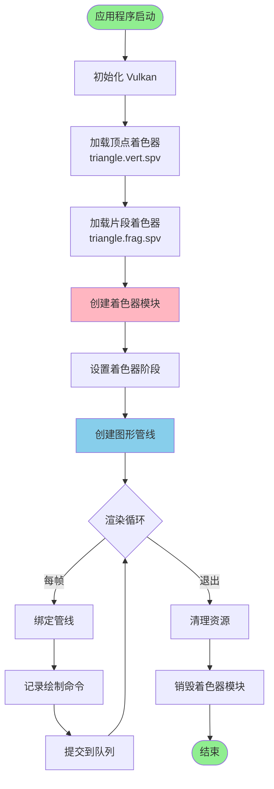

### 多着色器阶段示例

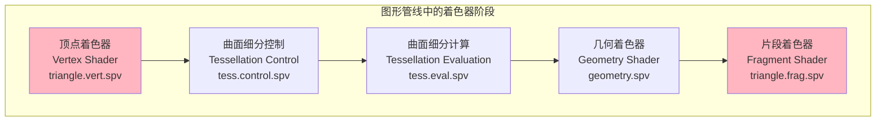

### 计算着色器示例

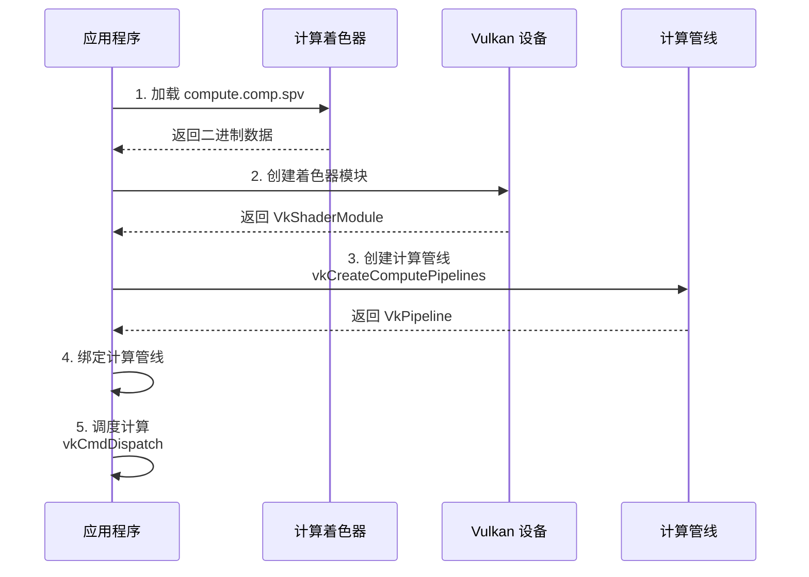

---

## 工具链与调试

### SPIR-V 工具链

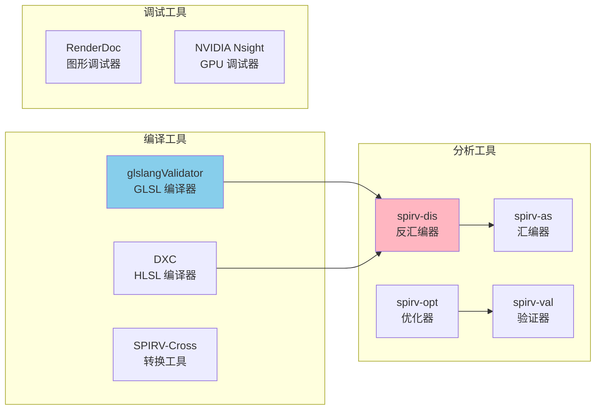

### 常用工具命令

```bash
# 1. 编译 GLSL 到 SPIR-V
glslangValidator -V shader.vert -o shader.vert.spv

# 2. 反汇编 SPIR-V (查看可读格式)
spirv-dis shader.vert.spv -o shader.vert.asm

# 3. 验证 SPIR-V
spirv-val shader.vert.spv

# 4. 优化 SPIR-V
spirv-opt -O shader.vert.spv -o shader.vert.opt.spv

# 5. 将 SPIR-V 转换回 GLSL (用于调试)
spirv-cross shader.vert.spv --output shader.vert.glsl
```

### 调试流程

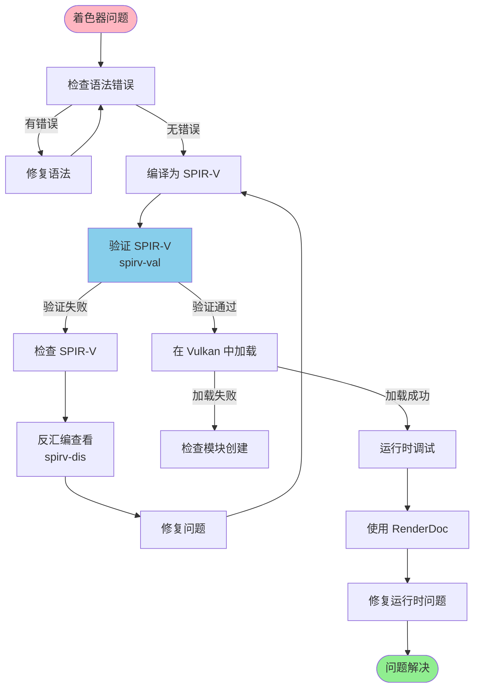

### SPIR-V 验证流程

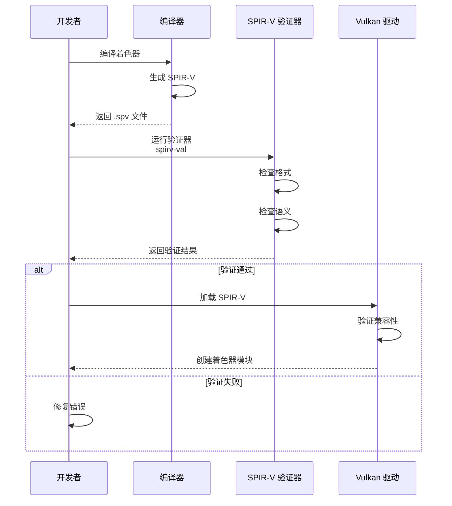

---

## 总结

### SPIR-V 核心要点

1. **标准化格式**: SPIR-V 是 Vulkan 的标准化着色器格式
2. **离线编译**: 着色器在构建时编译，运行时直接加载
3. **跨平台兼容**: 同一 SPIR-V 可在不同 GPU 上运行
4. **性能优势**: 减少运行时开销，提高启动速度
5. **工具支持**: 丰富的工具链支持编译、验证、调试

### SPIR-V 在 Vulkan 中的使用步骤

1. **编写着色器**: 使用 GLSL 或 HLSL 编写着色器代码
2. **编译为 SPIR-V**: 使用 glslangValidator 或 DXC 编译
3. **加载二进制**: 读取 .spv 文件到内存
4. **创建模块**: 使用 `vkCreateShaderModule` 创建着色器模块
5. **创建管线**: 将着色器模块用于创建图形或计算管线
6. **执行绘制**: 绑定管线并执行绘制或计算命令

### 最佳实践

- ✅ **离线编译**: 在构建时编译着色器，不要运行时编译
- ✅ **验证 SPIR-V**: 使用 spirv-val 验证着色器
- ✅ **版本控制**: 将 .spv 文件纳入版本控制
- ✅ **调试信息**: 开发时启用调试信息 (`-g` 选项)
- ✅ **优化**: 发布版本使用优化选项 (`-Os`)
- ✅ **错误处理**: 检查着色器加载和模块创建的错误

### 相关资源

- [SPIR-V 规范](https://www.khronos.org/spir/)
- [SPIR-V 工具](https://github.com/KhronosGroup/SPIRV-Tools)
- [glslang 编译器](https://github.com/KhronosGroup/glslang)
- [Vulkan 着色器文档](https://www.khronos.org/vulkan/)

---

*文档版本: 1.0*  
*最后更新: 2024*


