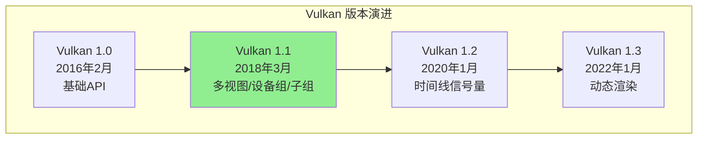
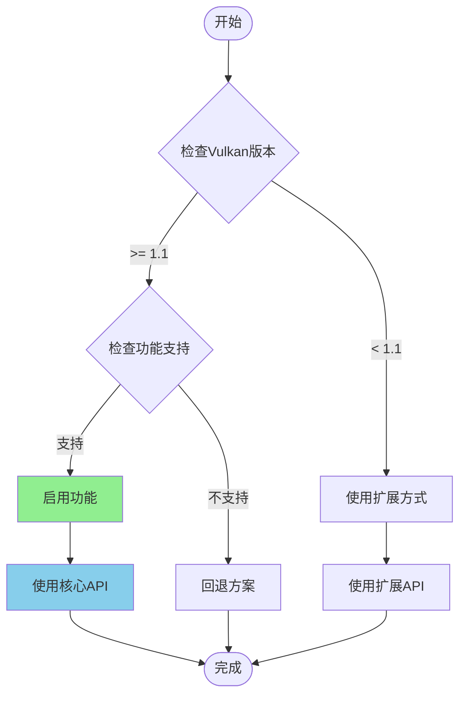
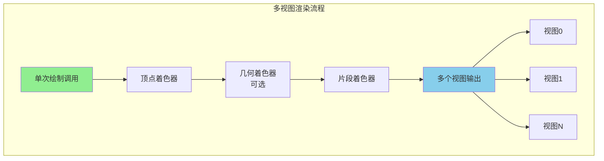
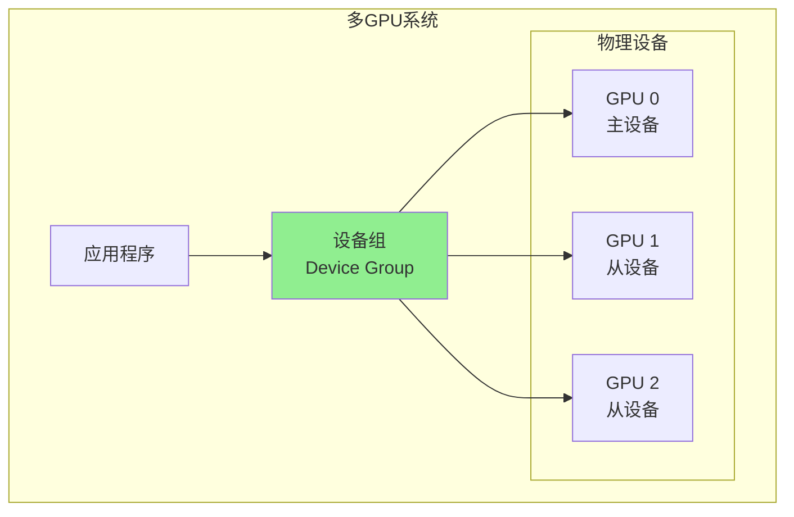
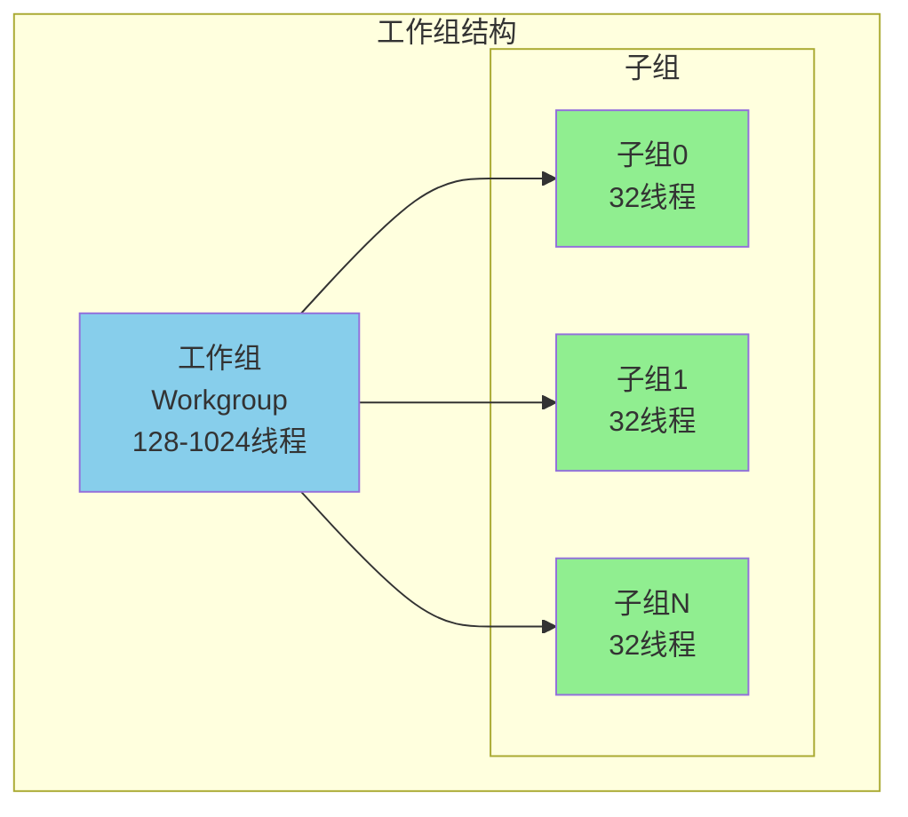
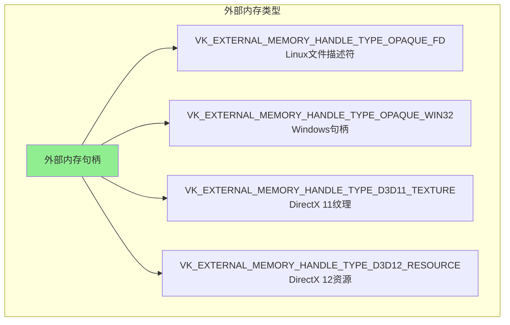

# Vulkan 1.1 详细介绍文档

## 目录
1. [概述](#概述)
2. [版本信息](#版本信息)
3. [核心新功能](#核心新功能)
4. [API 详解](#api-详解)
5. [多视图渲染](#多视图渲染)
6. [设备组和多GPU](#设备组和多gpu)
7. [子组操作](#子组操作)
8. [保护内存](#保护内存)
9. [跨进程资源共享](#跨进程资源共享)
10. [代码示例](#代码示例)
11. [最佳实践](#最佳实践)
12. [迁移指南](#迁移指南)

---

## 概述

### Vulkan 1.1 简介

**Vulkan 1.1** 是 Vulkan API 的第一个次要版本更新，于 **2018年3月7日** 发布。该版本将多个经过验证的扩展功能集成到核心规范中，并引入了新的特性以增强图形和计算能力。

### 主要目标

- **标准化扩展功能**: 将成熟的扩展功能提升为核心功能
- **增强多GPU支持**: 改进多GPU系统的支持和管理
- **提升计算能力**: 引入子组操作等高级计算功能
- **改进互操作性**: 增强与其他图形API的互操作性
- **简化开发流程**: 减少对扩展的依赖，简化应用程序开发

### Vulkan 1.1 在 Vulkan 架构中的位置



---

## 版本信息

### 版本号

- **API 版本**: 1.1.0
- **发布日期**: 2018年3月7日
- **规范版本**: 1.1.x

### 版本查询

```cpp
// 查询实例支持的版本
uint32_t apiVersion;
vkEnumerateInstanceVersion(&apiVersion);

uint32_t major = VK_VERSION_MAJOR(apiVersion);
uint32_t minor = VK_VERSION_MINOR(apiVersion);
uint32_t patch = VK_VERSION_PATCH(apiVersion);

if (major > 1 || (major == 1 && minor >= 1)) {
    // 支持 Vulkan 1.1 或更高版本
}
```

### 向后兼容性

Vulkan 1.1 完全向后兼容 Vulkan 1.0：
- 所有 Vulkan 1.0 的 API 和功能仍然可用
- 新功能通过版本检查启用
- 可以安全地升级现有应用程序

---

## 核心新功能

### 功能概览

Vulkan 1.1 将以下扩展提升为核心功能：

| 功能 | 原扩展名称 | 核心功能 |
|------|-----------|---------|
| 多视图渲染 | VK_KHR_multiview | VK_VERSION_1_1 |
| 设备组 | VK_KHR_device_group | VK_VERSION_1_1 |
| 子组操作 | VK_KHR_shader_subgroup | VK_VERSION_1_1 |
| 保护内存 | VK_KHR_protected_memory | VK_VERSION_1_1 |
| 跨进程资源 | VK_KHR_external_memory | VK_VERSION_1_1 |
| YCbCr 支持 | VK_KHR_sampler_ycbcr_conversion | VK_VERSION_1_1 |
| 16位存储 | VK_KHR_16bit_storage | VK_VERSION_1_1 |
| 绑定稀疏内存 | VK_KHR_bind_memory2 | VK_VERSION_1_1 |

### 功能启用流程图



---

## API 详解

### API 分类

根据 Vulkan 官方规范，Vulkan 1.1 新增的 API 分为两类：

#### 实例级 API（Instance-level APIs）

| API名称 | 类型 | 作用 |
|--------|------|------|
| `vkEnumerateInstanceVersion` | 实例级 | 查询实例支持的 Vulkan 版本 |
| `vkGetPhysicalDeviceFeatures2` | 实例级 | 查询物理设备特性（包括1.1新功能） |
| `vkGetPhysicalDeviceProperties2` | 实例级 | 查询物理设备属性（包括1.1新属性） |
| `vkGetPhysicalDeviceMemoryProperties2` | 实例级 | 查询物理设备内存属性（包括1.1新属性） |

#### 设备级 API（Device-level APIs）

| API名称 | 类型 | 作用 |
|--------|------|------|
| `vkCreateDevice` | 设备级 | 创建设备时启用1.1功能 |
| `vkBindBufferMemory2` | 设备级 | 绑定缓冲区内存（1.1版本） |
| `vkBindImageMemory2` | 设备级 | 绑定图像内存（1.1版本） |
| `vkGetDeviceGroupPeerMemoryFeatures` | 设备级 | 查询设备组对等内存特性 |
| `vkCmdSetDeviceMask` | 设备级 | 设置命令缓冲区的设备掩码 |
| `vkCmdDispatchBase` | 设备级 | 带基础偏移的计算调度 |

### 1. 版本查询 API

#### vkEnumerateInstanceVersion（实例级 API）

```cpp
// 查询实例支持的 Vulkan 版本
uint32_t apiVersion;
VkResult result = vkEnumerateInstanceVersion(&apiVersion);

if (result == VK_SUCCESS) {
    uint32_t major = VK_VERSION_MAJOR(apiVersion);
    uint32_t minor = VK_VERSION_MINOR(apiVersion);
    
    if (major > 1 || (major == 1 && minor >= 1)) {
        // 支持 Vulkan 1.1 或更高版本
    }
}
```

### 2. 功能查询 API

#### vkGetPhysicalDeviceFeatures2（实例级 API）

```cpp
// 查询物理设备特性（包括 Vulkan 1.1 新功能）
VkPhysicalDeviceFeatures2 features2{};
features2.sType = VK_STRUCTURE_TYPE_PHYSICAL_DEVICE_FEATURES_2;

// 多视图特性
VkPhysicalDeviceMultiviewFeatures multiviewFeatures{};
multiviewFeatures.sType = VK_STRUCTURE_TYPE_PHYSICAL_DEVICE_MULTIVIEW_FEATURES;
features2.pNext = &multiviewFeatures;

// 子组特性
VkPhysicalDeviceSubgroupProperties subgroupProperties{};
subgroupProperties.sType = VK_STRUCTURE_TYPE_PHYSICAL_DEVICE_SUBGROUP_PROPERTIES;

VkPhysicalDeviceProperties2 properties2{};
properties2.sType = VK_STRUCTURE_TYPE_PHYSICAL_DEVICE_PROPERTIES_2;
properties2.pNext = &subgroupProperties;

vkGetPhysicalDeviceFeatures2(physicalDevice, &features2);
vkGetPhysicalDeviceProperties2(physicalDevice, &properties2);

if (multiviewFeatures.multiview) {
    // 支持多视图渲染
}

if (subgroupProperties.subgroupSize >= 32) {
    // 支持子组操作
}
```

### 3. 设备组 API

#### vkGetDeviceGroupPeerMemoryFeatures（设备级 API）

```cpp
// 查询设备组中对等设备的内存特性
VkPeerMemoryFeatureFlags peerMemoryFeatures;
vkGetDeviceGroupPeerMemoryFeatures(
    device,
    heapIndex,
    localDeviceIndex,
    remoteDeviceIndex,
    &peerMemoryFeatures
);

if (peerMemoryFeatures & VK_PEER_MEMORY_FEATURE_COPY_SRC_BIT) {
    // 可以从远程设备复制
}
```

#### vkCmdSetDeviceMask（设备级 API）

```cpp
// 设置命令缓冲区的设备掩码（多GPU）
void recordCommandBuffer(VkCommandBuffer commandBuffer) {
    vkBeginCommandBuffer(commandBuffer, &beginInfo);
    
    // 设置设备掩码，指定命令在哪些设备上执行
    uint32_t deviceMask = 0b11; // 在设备0和设备1上执行
    vkCmdSetDeviceMask(commandBuffer, deviceMask);
    
    // 后续命令将在指定的设备上执行
    vkCmdBindPipeline(commandBuffer, VK_PIPELINE_BIND_POINT_GRAPHICS, pipeline);
    vkCmdDraw(commandBuffer, vertexCount, 1, 0, 0);
    
    vkEndCommandBuffer(commandBuffer);
}
```

---

## 多视图渲染

### 概述

多视图渲染（Multiview Rendering）允许在单次渲染过程中生成多个视图，适用于虚拟现实（VR）和立体渲染等应用场景。

### 核心概念



### API 使用

#### 启用多视图功能

```cpp
// 检查多视图支持
VkPhysicalDeviceMultiviewFeatures multiviewFeatures{};
multiviewFeatures.sType = VK_STRUCTURE_TYPE_PHYSICAL_DEVICE_MULTIVIEW_FEATURES;

VkPhysicalDeviceFeatures2 features2{};
features2.sType = VK_STRUCTURE_TYPE_PHYSICAL_DEVICE_FEATURES_2;
features2.pNext = &multiviewFeatures;

vkGetPhysicalDeviceFeatures2(physicalDevice, &features2);

if (!multiviewFeatures.multiview) {
    // 设备不支持多视图
    return false;
}
```

#### 创建多视图 RenderPass

```cpp
// 创建支持多视图的 RenderPass
VkRenderPassMultiviewCreateInfo multiviewInfo{};
multiviewInfo.sType = VK_STRUCTURE_TYPE_RENDER_PASS_MULTIVIEW_CREATE_INFO;
multiviewInfo.subpassCount = 1;
uint32_t viewMasks[] = {0b11}; // 视图0和视图1
multiviewInfo.pViewMasks = viewMasks;
multiviewInfo.dependencyCount = 0;

VkRenderPassCreateInfo renderPassInfo{};
renderPassInfo.sType = VK_STRUCTURE_TYPE_RENDER_PASS_CREATE_INFO;
renderPassInfo.pNext = &multiviewInfo;
// ... 其他设置

vkCreateRenderPass(device, &renderPassInfo, nullptr, &renderPass);
```

#### 多视图着色器

```glsl
#version 450
#extension GL_EXT_multiview : require

layout(location = 0) in vec3 position;
layout(location = 1) in vec2 texCoord;

layout(location = 0) out vec2 fragTexCoord;

// 多视图索引
layout(set = 0, binding = 0) uniform ViewMatrices {
    mat4 view[2];  // 两个视图的视图矩阵
    mat4 proj[2];  // 两个视图的投影矩阵
} ubo;

void main() {
    // 使用 gl_ViewIndex 获取当前视图索引
    int viewIndex = gl_ViewIndex;
    
    mat4 mvp = ubo.proj[viewIndex] * ubo.view[viewIndex] * model;
    gl_Position = mvp * vec4(position, 1.0);
    fragTexCoord = texCoord;
}
```

---

## 设备组和多GPU

### 概述

设备组（Device Groups）功能允许应用程序在多个物理GPU之间分配工作负载，提高性能和资源利用率。

### 设备组架构



### API 使用

#### 查询设备组

```cpp
// 查询设备组信息
uint32_t deviceGroupCount = 0;
vkEnumeratePhysicalDeviceGroups(instance, &deviceGroupCount, nullptr);

std::vector<VkPhysicalDeviceGroupProperties> deviceGroups(deviceGroupCount);
for (auto& group : deviceGroups) {
    group.sType = VK_STRUCTURE_TYPE_PHYSICAL_DEVICE_GROUP_PROPERTIES;
}

vkEnumeratePhysicalDeviceGroups(instance, &deviceGroupCount, deviceGroups.data());

// 使用第一个设备组
const auto& deviceGroup = deviceGroups[0];
uint32_t deviceCount = deviceGroup.physicalDeviceCount;

// 创建设备组设备
VkDeviceGroupDeviceCreateInfo deviceGroupInfo{};
deviceGroupInfo.sType = VK_STRUCTURE_TYPE_DEVICE_GROUP_DEVICE_CREATE_INFO;
deviceGroupInfo.physicalDeviceCount = deviceCount;
deviceGroupInfo.pPhysicalDevices = deviceGroup.physicalDevices;

VkDeviceCreateInfo deviceCreateInfo{};
deviceCreateInfo.sType = VK_STRUCTURE_TYPE_DEVICE_CREATE_INFO;
deviceCreateInfo.pNext = &deviceGroupInfo;
// ... 其他设置

vkCreateDevice(deviceGroup.physicalDevices[0], &deviceCreateInfo, nullptr, &device);
```

#### 多GPU渲染示例

```cpp
// 在多GPU系统上渲染
void renderOnMultipleGPUs(VkCommandBuffer commandBuffer) {
    vkBeginCommandBuffer(commandBuffer, &beginInfo);
    
    // 在设备0上渲染左眼
    vkCmdSetDeviceMask(commandBuffer, 0b01);
    renderEye(commandBuffer, LEFT_EYE);
    
    // 在设备1上渲染右眼
    vkCmdSetDeviceMask(commandBuffer, 0b10);
    renderEye(commandBuffer, RIGHT_EYE);
    
    // 在所有设备上执行后处理
    vkCmdSetDeviceMask(commandBuffer, 0b11);
    postProcess(commandBuffer);
    
    vkEndCommandBuffer(commandBuffer);
}
```

---

## 子组操作

### 概述

子组操作（Subgroup Operations）允许在同一工作组内的线程高效地进行数据交换和计算，提升计算着色器的性能。

### 子组架构



### 查询子组属性

```cpp
// 查询子组属性
VkPhysicalDeviceSubgroupProperties subgroupProperties{};
subgroupProperties.sType = VK_STRUCTURE_TYPE_PHYSICAL_DEVICE_SUBGROUP_PROPERTIES;

VkPhysicalDeviceProperties2 properties2{};
properties2.sType = VK_STRUCTURE_TYPE_PHYSICAL_DEVICE_PROPERTIES_2;
properties2.pNext = &subgroupProperties;

vkGetPhysicalDeviceProperties2(physicalDevice, &properties2);

uint32_t subgroupSize = subgroupProperties.subgroupSize; // 通常为32或64
VkShaderStageFlags supportedStages = subgroupProperties.supportedStages;
VkSubgroupFeatureFlags supportedOperations = subgroupProperties.supportedOperations;
```

### 子组操作示例

#### 计算着色器中的子组操作

```glsl
#version 450
#extension GL_KHR_shader_subgroup_arithmetic : require
#extension GL_KHR_shader_subgroup_ballot : require

layout(local_size_x = 128) in;

layout(set = 0, binding = 0) buffer DataBuffer {
    float data[];
};

void main() {
    uint index = gl_GlobalInvocationID.x;
    
    // 子组内求和
    float localValue = data[index];
    float subgroupSum = subgroupAdd(localValue);
    
    // 子组内最大值
    float subgroupMax = subgroupMax(localValue);
    
    // 子组内投票
    bool condition = localValue > 0.5;
    uvec4 ballot = subgroupBallot(condition);
    uint activeCount = subgroupBallotBitCount(ballot);
    
    // 使用结果
    if (subgroupElect()) {
        // 只有子组中的第一个线程执行
        data[index] = subgroupSum / float(subgroupSize());
    }
}
```

---

## 保护内存

### 概述

保护内存（Protected Memory）功能提供了对受保护内容的支持，确保敏感数据在 GPU 上的安全处理。

### 使用场景

- **DRM 内容保护**: 保护受版权保护的内容
- **安全渲染**: 确保敏感数据不被未授权访问
- **安全计算**: 保护计算过程中的敏感数据

### API 使用

#### 检查保护内存支持

```cpp
// 检查保护内存支持
VkPhysicalDeviceProtectedMemoryFeatures protectedMemoryFeatures{};
protectedMemoryFeatures.sType = VK_STRUCTURE_TYPE_PHYSICAL_DEVICE_PROTECTED_MEMORY_FEATURES;

VkPhysicalDeviceFeatures2 features2{};
features2.sType = VK_STRUCTURE_TYPE_PHYSICAL_DEVICE_FEATURES_2;
features2.pNext = &protectedMemoryFeatures;

vkGetPhysicalDeviceFeatures2(physicalDevice, &features2);

if (!protectedMemoryFeatures.protectedMemory) {
    // 设备不支持保护内存
    return false;
}
```

#### 创建保护设备

```cpp
// 创建保护设备
VkPhysicalDeviceProtectedMemoryFeatures protectedMemoryFeatures{};
protectedMemoryFeatures.sType = VK_STRUCTURE_TYPE_PHYSICAL_DEVICE_PROTECTED_MEMORY_FEATURES;
protectedMemoryFeatures.protectedMemory = VK_TRUE;

VkDeviceCreateInfo deviceCreateInfo{};
deviceCreateInfo.sType = VK_STRUCTURE_TYPE_DEVICE_CREATE_INFO;
deviceCreateInfo.pNext = &protectedMemoryFeatures;
deviceCreateInfo.flags = VK_DEVICE_CREATE_PROTECTED_MEMORY_BIT;
// ... 其他设置

vkCreateDevice(physicalDevice, &deviceCreateInfo, nullptr, &device);
```

#### 分配保护内存

```cpp
// 分配保护内存
VkMemoryAllocateInfo allocInfo{};
allocInfo.sType = VK_STRUCTURE_TYPE_MEMORY_ALLOCATE_INFO;
allocInfo.allocationSize = size;
allocInfo.memoryTypeIndex = memoryTypeIndex;
allocInfo.flags = VK_MEMORY_ALLOCATE_PROTECTED_BIT;

VkDeviceMemory memory;
vkAllocateMemory(device, &allocInfo, nullptr, &memory);
```

---

## 跨进程资源共享

### 概述

Vulkan 1.1 增强了跨进程和跨 API 的资源共享能力，支持与其他图形API（如 OpenGL）之间的互操作性。

### 外部内存类型



### API 使用

#### 查询外部内存支持

```cpp
// 查询外部内存支持
VkExternalMemoryProperties externalMemoryProperties{};
VkPhysicalDeviceExternalImageFormatInfo externalImageFormatInfo{};
externalImageFormatInfo.sType = VK_STRUCTURE_TYPE_PHYSICAL_DEVICE_EXTERNAL_IMAGE_FORMAT_INFO;
externalImageFormatInfo.handleType = VK_EXTERNAL_MEMORY_HANDLE_TYPE_OPAQUE_FD_BIT;

VkPhysicalDeviceImageFormatInfo2 imageFormatInfo{};
imageFormatInfo.sType = VK_STRUCTURE_TYPE_PHYSICAL_DEVICE_IMAGE_FORMAT_INFO_2;
imageFormatInfo.pNext = &externalImageFormatInfo;
imageFormatInfo.format = VK_FORMAT_R8G8B8A8_UNORM;
imageFormatInfo.type = VK_IMAGE_TYPE_2D;
imageFormatInfo.tiling = VK_IMAGE_TILING_OPTIMAL;
imageFormatInfo.usage = VK_IMAGE_USAGE_COLOR_ATTACHMENT_BIT;

VkImageFormatProperties2 imageFormatProperties{};
imageFormatProperties.sType = VK_STRUCTURE_TYPE_IMAGE_FORMAT_PROPERTIES_2;

VkResult result = vkGetPhysicalDeviceImageFormatProperties2(
    physicalDevice,
    &imageFormatInfo,
    &imageFormatProperties
);
```

---

## 代码示例

### 完整示例：启用 Vulkan 1.1 功能

```cpp
#include <vulkan/vulkan.h>
#include <iostream>
#include <vector>

class Vulkan11Application {
public:
    bool initialize() {
        // 1. 查询 Vulkan 版本
        uint32_t apiVersion;
        vkEnumerateInstanceVersion(&apiVersion);
        
        uint32_t major = VK_VERSION_MAJOR(apiVersion);
        uint32_t minor = VK_VERSION_MINOR(apiVersion);
        
        std::cout << "Vulkan Version: " << major << "." << minor << std::endl;
        
        if (major < 1 || (major == 1 && minor < 1)) {
            std::cerr << "Vulkan 1.1 not supported" << std::endl;
            return false;
        }
        
        // 2. 创建实例
        VkApplicationInfo appInfo{};
        appInfo.sType = VK_STRUCTURE_TYPE_APPLICATION_INFO;
        appInfo.apiVersion = VK_API_VERSION_1_1;
        
        VkInstanceCreateInfo instanceInfo{};
        instanceInfo.sType = VK_STRUCTURE_TYPE_INSTANCE_CREATE_INFO;
        instanceInfo.pApplicationInfo = &appInfo;
        
        vkCreateInstance(&instanceInfo, nullptr, &instance);
        
        // 3. 查询物理设备
        uint32_t deviceCount = 0;
        vkEnumeratePhysicalDevices(instance, &deviceCount, nullptr);
        std::vector<VkPhysicalDevice> devices(deviceCount);
        vkEnumeratePhysicalDevices(instance, &deviceCount, devices.data());
        
        physicalDevice = devices[0];
        
        // 4. 查询 Vulkan 1.1 功能
        VkPhysicalDeviceMultiviewFeatures multiviewFeatures{};
        multiviewFeatures.sType = VK_STRUCTURE_TYPE_PHYSICAL_DEVICE_MULTIVIEW_FEATURES;
        
        VkPhysicalDeviceSubgroupProperties subgroupProperties{};
        subgroupProperties.sType = VK_STRUCTURE_TYPE_PHYSICAL_DEVICE_SUBGROUP_PROPERTIES;
        
        VkPhysicalDeviceFeatures2 features2{};
        features2.sType = VK_STRUCTURE_TYPE_PHYSICAL_DEVICE_FEATURES_2;
        features2.pNext = &multiviewFeatures;
        
        VkPhysicalDeviceProperties2 properties2{};
        properties2.sType = VK_STRUCTURE_TYPE_PHYSICAL_DEVICE_PROPERTIES_2;
        properties2.pNext = &subgroupProperties;
        
        vkGetPhysicalDeviceFeatures2(physicalDevice, &features2);
        vkGetPhysicalDeviceProperties2(physicalDevice, &properties2);
        
        // 5. 创建设备（启用 Vulkan 1.1 功能）
        VkDeviceCreateInfo deviceCreateInfo{};
        deviceCreateInfo.sType = VK_STRUCTURE_TYPE_DEVICE_CREATE_INFO;
        deviceCreateInfo.pNext = &multiviewFeatures;
        
        if (multiviewFeatures.multiview) {
            multiviewFeatures.multiview = VK_TRUE;
        }
        
        vkCreateDevice(physicalDevice, &deviceCreateInfo, nullptr, &device);
        
        return true;
    }
    
private:
    VkInstance instance;
    VkPhysicalDevice physicalDevice;
    VkDevice device;
};
```

---

## 最佳实践

### 1. 版本检查

```cpp
// 始终检查 Vulkan 版本
uint32_t apiVersion;
vkEnumerateInstanceVersion(&apiVersion);

if (VK_VERSION_MAJOR(apiVersion) < 1 || 
    (VK_VERSION_MAJOR(apiVersion) == 1 && VK_VERSION_MINOR(apiVersion) < 1)) {
    // 回退到 Vulkan 1.0 或使用扩展
}
```

### 2. 功能查询

```cpp
// 使用 vkGetPhysicalDeviceFeatures2 查询所有功能
VkPhysicalDeviceFeatures2 features2{};
features2.sType = VK_STRUCTURE_TYPE_PHYSICAL_DEVICE_FEATURES_2;

// 链式添加需要查询的功能结构
VkPhysicalDeviceMultiviewFeatures multiviewFeatures{};
multiviewFeatures.sType = VK_STRUCTURE_TYPE_PHYSICAL_DEVICE_MULTIVIEW_FEATURES;
features2.pNext = &multiviewFeatures;

vkGetPhysicalDeviceFeatures2(physicalDevice, &features2);
```

### 3. 多GPU 使用建议

- **负载均衡**: 合理分配工作负载到不同GPU
- **内存管理**: 注意设备组间的内存访问特性
- **同步**: 正确使用设备掩码和同步原语

---

## 迁移指南

### 从 Vulkan 1.0 迁移到 1.1

#### 步骤 1: 更新版本号

```cpp
// Vulkan 1.0
VkApplicationInfo appInfo{};
appInfo.apiVersion = VK_API_VERSION_1_0;

// Vulkan 1.1
VkApplicationInfo appInfo{};
appInfo.apiVersion = VK_API_VERSION_1_1;
```

#### 步骤 2: 使用新的查询API

```cpp
// Vulkan 1.0
VkPhysicalDeviceFeatures features;
vkGetPhysicalDeviceFeatures(physicalDevice, &features);

// Vulkan 1.1
VkPhysicalDeviceFeatures2 features2{};
features2.sType = VK_STRUCTURE_TYPE_PHYSICAL_DEVICE_FEATURES_2;
vkGetPhysicalDeviceFeatures2(physicalDevice, &features2);
```

#### 步骤 3: 启用新功能

```cpp
// 在创建设备时启用 Vulkan 1.1 功能
VkPhysicalDeviceMultiviewFeatures multiviewFeatures{};
multiviewFeatures.sType = VK_STRUCTURE_TYPE_PHYSICAL_DEVICE_MULTIVIEW_FEATURES;
multiviewFeatures.multiview = VK_TRUE;

VkDeviceCreateInfo deviceCreateInfo{};
deviceCreateInfo.sType = VK_STRUCTURE_TYPE_DEVICE_CREATE_INFO;
deviceCreateInfo.pNext = &multiviewFeatures;
```

---

## 总结

Vulkan 1.1 是 Vulkan API 的重要更新，引入了多视图渲染、设备组、子组操作等核心功能，显著提升了 API 的功能性和易用性。

### 关键要点

1. ✅ **版本查询**: 使用 `vkEnumerateInstanceVersion` 查询版本
2. ✅ **功能查询**: 使用 `vkGetPhysicalDeviceFeatures2` 查询功能
3. ✅ **多视图渲染**: 适用于 VR 和立体渲染
4. ✅ **设备组**: 支持多GPU系统
5. ✅ **子组操作**: 提升计算着色器性能
6. ✅ **向后兼容**: 完全兼容 Vulkan 1.0

---

## 参考资料

- [Vulkan 1.1 Specification](https://registry.khronos.org/vulkan/specs/1.1/html/)
- [Vulkan 1.1 Release Notes](https://www.khronos.org/news/press/khronos-releases-vulkan-1-1)
- [Vulkan API Documentation](https://www.khronos.org/vulkan/)

---

*文档版本: 1.0*  
*最后更新: 2024*

