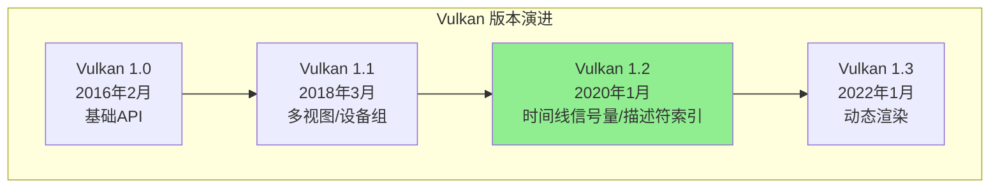
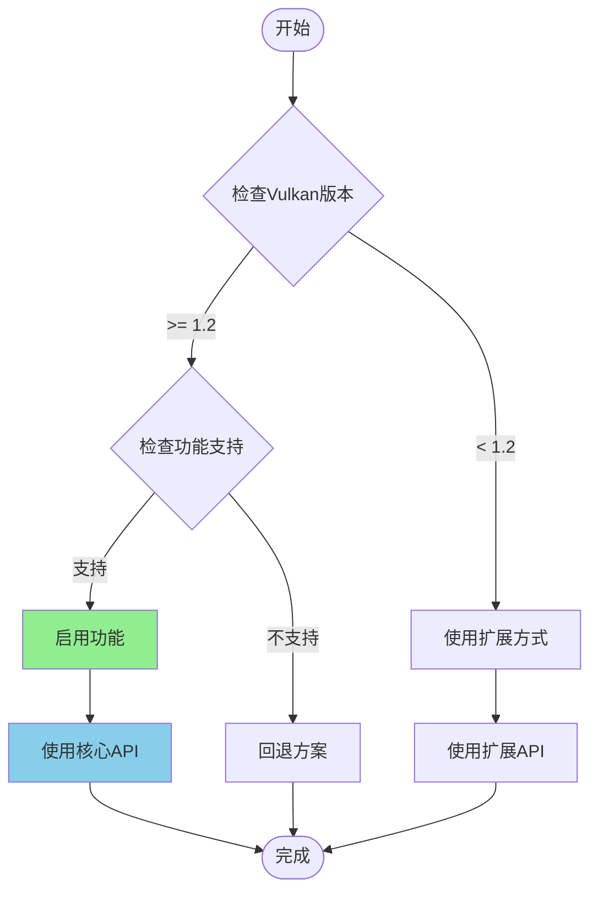
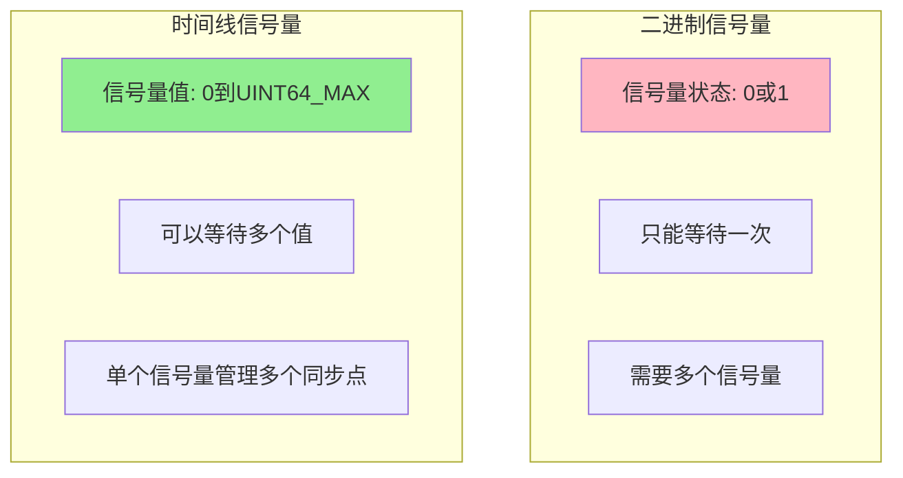

# Vulkan 1.2 详细介绍文档

## 目录
1. [概述](#概述)
2. [版本信息](#版本信息)
3. [核心新功能](#核心新功能)
4. [API 详解](#api-详解)
5. [时间线信号量](#时间线信号量)
6. [描述符索引](#描述符索引)
7. [浮点控制](#浮点控制)
8. [深度裁剪](#深度裁剪)
9. [时间戳查询](#时间戳查询)
10. [代码示例](#代码示例)
11. [最佳实践](#最佳实践)
12. [迁移指南](#迁移指南)

---

## 概述

### Vulkan 1.2 简介

**Vulkan 1.2** 是 Vulkan API 的第二个次要版本更新，于 **2020年1月15日** 发布。该版本将 23 个经过验证的扩展功能集成到核心规范中，显著增强了 API 的功能性、易用性和跨平台兼容性。

### 主要目标

- **统一扩展功能**: 将成熟的扩展提升为核心功能
- **改进同步机制**: 引入时间线信号量等更灵活的同步原语
- **增强着色器能力**: 改进描述符索引和浮点控制
- **简化开发流程**: 减少对扩展的依赖
- **提升性能**: 优化资源管理和同步机制

### Vulkan 1.2 在 Vulkan 架构中的位置



---

## 版本信息

### 版本号

- **API 版本**: 1.2.0
- **发布日期**: 2020年1月15日
- **规范版本**: 1.2.x

### 版本查询

```cpp
// 查询实例支持的版本
uint32_t apiVersion;
vkEnumerateInstanceVersion(&apiVersion);

uint32_t major = VK_VERSION_MAJOR(apiVersion);
uint32_t minor = VK_VERSION_MINOR(apiVersion);
uint32_t patch = VK_VERSION_PATCH(apiVersion);

if (major > 1 || (major == 1 && minor >= 2)) {
    // 支持 Vulkan 1.2 或更高版本
}
```

### 向后兼容性

Vulkan 1.2 完全向后兼容 Vulkan 1.0 和 1.1：
- 所有之前的 API 和功能仍然可用
- 新功能通过版本检查启用
- 可以安全地升级现有应用程序

---

## 核心新功能

### 功能概览

Vulkan 1.2 将以下扩展提升为核心功能：

| 功能 | 原扩展名称 | 核心功能 |
|------|-----------|---------|
| 时间线信号量 | VK_KHR_timeline_semaphore | VK_VERSION_1_2 |
| 描述符索引 | VK_EXT_descriptor_indexing | VK_VERSION_1_2 |
| 浮点控制 | VK_KHR_shader_float_controls | VK_VERSION_1_2 |
| 深度裁剪 | VK_EXT_depth_clip_enable | VK_VERSION_1_2 |
| 独立深度模板 | VK_EXT_separate_stencil_usage | VK_VERSION_1_2 |
| 主机查询重置 | VK_EXT_host_query_reset | VK_VERSION_1_2 |
| 统一描述符集布局 | VK_KHR_uniform_buffer_standard_layout | VK_VERSION_1_2 |
| 着色器子组统一控制流 | VK_KHR_shader_subgroup_uniform_control_flow | VK_VERSION_1_2 |
| 时间戳查询 | VK_KHR_timeline_semaphore | VK_VERSION_1_2 |

### 功能启用流程图



---

## API 详解

### API 分类

根据 Vulkan 官方规范，Vulkan 1.2 新增的 API 分为两类：

#### 实例级 API（Instance-level APIs）

| API名称 | 类型 | 作用 |
|--------|------|------|
| `vkGetPhysicalDeviceFeatures2` | 实例级 | 查询物理设备特性（包括1.2新功能） |
| `vkGetPhysicalDeviceProperties2` | 实例级 | 查询物理设备属性（包括1.2新属性） |
| `vkGetPhysicalDeviceFormatProperties2` | 实例级 | 查询格式属性（包括1.2新属性） |

#### 设备级 API（Device-level APIs）

| API名称 | 类型 | 作用 |
|--------|------|------|
| `vkCreateSemaphore` | 设备级 | 创建信号量（支持时间线信号量） |
| `vkGetSemaphoreCounterValue` | 设备级 | 获取时间线信号量的当前值 |
| `vkWaitSemaphores` | 设备级 | 等待时间线信号量 |
| `vkSignalSemaphore` | 设备级 | 信号时间线信号量 |
| `vkResetQueryPool` | 设备级 | 重置查询池（主机端） |
| `vkCmdDrawIndirectCount` | 设备级 | 间接绘制（带计数缓冲区） |
| `vkCmdDrawIndexedIndirectCount` | 设备级 | 间接索引绘制（带计数缓冲区） |

### 1. 功能查询 API

#### vkGetPhysicalDeviceFeatures2（实例级 API）

```cpp
// 查询物理设备特性（包括 Vulkan 1.2 新功能）
VkPhysicalDeviceFeatures2 features2{};
features2.sType = VK_STRUCTURE_TYPE_PHYSICAL_DEVICE_FEATURES_2;

// 时间线信号量特性
VkPhysicalDeviceTimelineSemaphoreFeatures timelineSemaphoreFeatures{};
timelineSemaphoreFeatures.sType = VK_STRUCTURE_TYPE_PHYSICAL_DEVICE_TIMELINE_SEMAPHORE_FEATURES;
features2.pNext = &timelineSemaphoreFeatures;

// 描述符索引特性
VkPhysicalDeviceDescriptorIndexingFeatures descriptorIndexingFeatures{};
descriptorIndexingFeatures.sType = VK_STRUCTURE_TYPE_PHYSICAL_DEVICE_DESCRIPTOR_INDEXING_FEATURES;
timelineSemaphoreFeatures.pNext = &descriptorIndexingFeatures;

// 浮点控制特性
VkPhysicalDeviceShaderFloatControlsProperties floatControlsProperties{};
floatControlsProperties.sType = VK_STRUCTURE_TYPE_PHYSICAL_DEVICE_SHADER_FLOAT_CONTROLS_PROPERTIES;

VkPhysicalDeviceProperties2 properties2{};
properties2.sType = VK_STRUCTURE_TYPE_PHYSICAL_DEVICE_PROPERTIES_2;
properties2.pNext = &floatControlsProperties;

vkGetPhysicalDeviceFeatures2(physicalDevice, &features2);
vkGetPhysicalDeviceProperties2(physicalDevice, &properties2);

if (timelineSemaphoreFeatures.timelineSemaphore) {
    // 支持时间线信号量
}

if (descriptorIndexingFeatures.runtimeDescriptorArray) {
    // 支持运行时描述符数组
}
```

---

## 时间线信号量

### 概述

时间线信号量（Timeline Semaphores）是 Vulkan 1.2 引入的重要同步原语，提供了比传统二进制信号量更灵活的同步机制。

### 时间线信号量 vs 二进制信号量



### 核心概念

- **时间线值**: 单调递增的64位无符号整数
- **等待操作**: 可以等待信号量达到特定值
- **信号操作**: 可以设置信号量的值
- **多等待点**: 单个信号量可以管理多个同步点

### API 使用

#### 创建时间线信号量

```cpp
// 创建时间线信号量
VkSemaphoreTypeCreateInfo timelineCreateInfo{};
timelineCreateInfo.sType = VK_STRUCTURE_TYPE_SEMAPHORE_TYPE_CREATE_INFO;
timelineCreateInfo.semaphoreType = VK_SEMAPHORE_TYPE_TIMELINE;
timelineCreateInfo.initialValue = 0;

VkSemaphoreCreateInfo semaphoreInfo{};
semaphoreInfo.sType = VK_STRUCTURE_TYPE_SEMAPHORE_CREATE_INFO;
semaphoreInfo.pNext = &timelineCreateInfo;

VkSemaphore timelineSemaphore;
vkCreateSemaphore(device, &semaphoreInfo, nullptr, &timelineSemaphore);
```

#### 等待时间线信号量

```cpp
// 等待时间线信号量达到特定值
VkSemaphoreWaitInfo waitInfo{};
waitInfo.sType = VK_STRUCTURE_TYPE_SEMAPHORE_WAIT_INFO;
waitInfo.semaphoreCount = 1;
waitInfo.pSemaphores = &timelineSemaphore;
uint64_t waitValue = 5;
waitInfo.pValues = &waitValue;
waitInfo.timeout = UINT64_MAX; // 无限等待

VkResult result = vkWaitSemaphores(device, &waitInfo, timeout);
```

#### 信号时间线信号量

```cpp
// 设置时间线信号量的值
VkSemaphoreSignalInfo signalInfo{};
signalInfo.sType = VK_STRUCTURE_TYPE_SEMAPHORE_SIGNAL_INFO;
signalInfo.semaphore = timelineSemaphore;
signalInfo.value = 5; // 设置值为5

vkSignalSemaphore(device, &signalInfo);
```

#### 获取时间线信号量值

```cpp
// 获取当前时间线信号量的值
uint64_t value;
vkGetSemaphoreCounterValue(device, timelineSemaphore, &value);
```

### 使用示例

```cpp
// 使用时间线信号量同步多个操作
void useTimelineSemaphore(VkDevice device, VkQueue queue, VkCommandBuffer cmdBuf) {
    // 创建时间线信号量
    VkSemaphoreTypeCreateInfo timelineInfo{};
    timelineInfo.sType = VK_STRUCTURE_TYPE_SEMAPHORE_TYPE_CREATE_INFO;
    timelineInfo.semaphoreType = VK_SEMAPHORE_TYPE_TIMELINE;
    timelineInfo.initialValue = 0;
    
    VkSemaphoreCreateInfo semaphoreInfo{};
    semaphoreInfo.sType = VK_STRUCTURE_TYPE_SEMAPHORE_CREATE_INFO;
    semaphoreInfo.pNext = &timelineInfo;
    
    VkSemaphore timelineSemaphore;
    vkCreateSemaphore(device, &semaphoreInfo, nullptr, &timelineSemaphore);
    
    // 提交命令，等待值0，信号值1
    VkTimelineSemaphoreSubmitInfo timelineSubmitInfo{};
    timelineSubmitInfo.sType = VK_STRUCTURE_TYPE_TIMELINE_SEMAPHORE_SUBMIT_INFO;
    uint64_t waitValue = 0;
    uint64_t signalValue = 1;
    timelineSubmitInfo.waitSemaphoreValueCount = 1;
    timelineSubmitInfo.pWaitSemaphoreValues = &waitValue;
    timelineSubmitInfo.signalSemaphoreValueCount = 1;
    timelineSubmitInfo.pSignalSemaphoreValues = &signalValue;
    
    VkSubmitInfo submitInfo{};
    submitInfo.sType = VK_STRUCTURE_TYPE_SUBMIT_INFO;
    submitInfo.pNext = &timelineSubmitInfo;
    submitInfo.waitSemaphoreCount = 1;
    submitInfo.pWaitSemaphores = &timelineSemaphore;
    submitInfo.signalSemaphoreCount = 1;
    submitInfo.pSignalSemaphores = &timelineSemaphore;
    submitInfo.commandBufferCount = 1;
    submitInfo.pCommandBuffers = &cmdBuf;
    
    vkQueueSubmit(queue, 1, &submitInfo, VK_NULL_HANDLE);
    
    // 等待值达到1
    VkSemaphoreWaitInfo waitInfo{};
    waitInfo.sType = VK_STRUCTURE_TYPE_SEMAPHORE_WAIT_INFO;
    waitInfo.semaphoreCount = 1;
    waitInfo.pSemaphores = &timelineSemaphore;
    waitInfo.pValues = &signalValue;
    
    vkWaitSemaphores(device, &waitInfo, UINT64_MAX);
}
```

---

## 描述符索引

### 概述

描述符索引（Descriptor Indexing）功能允许在着色器中使用非静态索引访问描述符数组，增强了资源管理的灵活性。

### 核心特性

- **运行时描述符数组**: 可以在运行时动态索引描述符数组
- **部分绑定**: 允许描述符集的部分绑定
- **非统一描述符索引**: 支持非统一索引访问
- **更新后绑定**: 允许在更新后绑定描述符

### API 使用

#### 启用描述符索引功能

```cpp
// 检查描述符索引支持
VkPhysicalDeviceDescriptorIndexingFeatures descriptorIndexingFeatures{};
descriptorIndexingFeatures.sType = VK_STRUCTURE_TYPE_PHYSICAL_DEVICE_DESCRIPTOR_INDEXING_FEATURES;

VkPhysicalDeviceFeatures2 features2{};
features2.sType = VK_STRUCTURE_TYPE_PHYSICAL_DEVICE_FEATURES_2;
features2.pNext = &descriptorIndexingFeatures;

vkGetPhysicalDeviceFeatures2(physicalDevice, &features2);

if (descriptorIndexingFeatures.runtimeDescriptorArray) {
    // 支持运行时描述符数组
}
```

#### 创建描述符集布局

```cpp
// 创建支持动态索引的描述符集布局
VkDescriptorSetLayoutBinding binding{};
binding.binding = 0;
binding.descriptorType = VK_DESCRIPTOR_TYPE_COMBINED_IMAGE_SAMPLER;
binding.descriptorCount = 100; // 数组大小
binding.stageFlags = VK_SHADER_STAGE_FRAGMENT_BIT;

VkDescriptorSetLayoutBindingFlagsCreateInfo bindingFlags{};
bindingFlags.sType = VK_STRUCTURE_TYPE_DESCRIPTOR_SET_LAYOUT_BINDING_FLAGS_CREATE_INFO;
bindingFlags.bindingCount = 1;
VkDescriptorBindingFlags flags = VK_DESCRIPTOR_BINDING_PARTIALLY_BOUND_BIT |
                                  VK_DESCRIPTOR_BINDING_UPDATE_AFTER_BIND_BIT;
bindingFlags.pBindingFlags = &flags;

VkDescriptorSetLayoutCreateInfo layoutInfo{};
layoutInfo.sType = VK_STRUCTURE_TYPE_DESCRIPTOR_SET_LAYOUT_CREATE_INFO;
layoutInfo.pNext = &bindingFlags;
layoutInfo.bindingCount = 1;
layoutInfo.pBindings = &binding;
layoutInfo.flags = VK_DESCRIPTOR_SET_LAYOUT_CREATE_UPDATE_AFTER_BIND_POOL_BIT;

VkDescriptorSetLayout descriptorSetLayout;
vkCreateDescriptorSetLayout(device, &layoutInfo, nullptr, &descriptorSetLayout);
```

#### 着色器中的使用

```glsl
#version 450

layout(set = 0, binding = 0) uniform sampler2D textures[100];

layout(location = 0) in vec2 texCoord;
layout(location = 0) out vec4 fragColor;

void main() {
    // 运行时索引（需要描述符索引功能）
    int textureIndex = int(gl_FragCoord.x) % 100;
    fragColor = texture(textures[textureIndex], texCoord);
}
```

---

## 浮点控制

### 概述

浮点控制（Floating Point Controls）功能提供了对浮点计算的精度和舍入模式的控制，满足不同应用对计算精度的需求。

### 核心特性

- **舍入模式控制**: 控制浮点运算的舍入模式
- **精度控制**: 控制浮点运算的精度
- **着色器阶段控制**: 可以为不同着色器阶段设置不同的浮点控制

### API 使用

#### 查询浮点控制属性

```cpp
// 查询浮点控制属性
VkPhysicalDeviceShaderFloatControlsProperties floatControlsProperties{};
floatControlsProperties.sType = VK_STRUCTURE_TYPE_PHYSICAL_DEVICE_SHADER_FLOAT_CONTROLS_PROPERTIES;

VkPhysicalDeviceProperties2 properties2{};
properties2.sType = VK_STRUCTURE_TYPE_PHYSICAL_DEVICE_PROPERTIES_2;
properties2.pNext = &floatControlsProperties;

vkGetPhysicalDeviceProperties2(physicalDevice, &properties2);

// 检查支持的舍入模式
VkShaderFloatControlsIndependence roundingModeIndependence = 
    floatControlsProperties.denormBehaviorIndependence;
```

#### 在管线中设置浮点控制

```cpp
// 创建管线时设置浮点控制
VkPipelineShaderStageCreateInfo shaderStageInfo{};
shaderStageInfo.sType = VK_STRUCTURE_TYPE_PIPELINE_SHADER_STAGE_CREATE_INFO;
shaderStageInfo.stage = VK_SHADER_STAGE_FRAGMENT_BIT;
shaderStageInfo.module = shaderModule;
shaderStageInfo.pName = "main";

VkShaderFloatControlsCreateInfoEXT floatControls{};
floatControls.sType = VK_STRUCTURE_TYPE_SHADER_FLOAT_CONTROLS_CREATE_INFO;
floatControls.denormBehavior = VK_SHADER_FLOAT_CONTROLS_INDEPENDENCE_ALL;
floatControls.roundingModeRTE = VK_SHADER_FLOAT_CONTROLS_INDEPENDENCE_ALL;
floatControls.roundingModeRTZ = VK_SHADER_FLOAT_CONTROLS_INDEPENDENCE_ALL;

shaderStageInfo.pNext = &floatControls;
```

---

## 深度裁剪

### 概述

深度裁剪（Depth Clip Enable）功能允许控制是否在裁剪空间进行深度裁剪，提供了更灵活的深度处理方式。

### API 使用

#### 启用深度裁剪功能

```cpp
// 检查深度裁剪支持
VkPhysicalDeviceFeatures2 features2{};
features2.sType = VK_STRUCTURE_TYPE_PHYSICAL_DEVICE_FEATURES_2;

VkPhysicalDeviceDepthClipEnableFeaturesEXT depthClipFeatures{};
depthClipFeatures.sType = VK_STRUCTURE_TYPE_PHYSICAL_DEVICE_DEPTH_CLIP_ENABLE_FEATURES_EXT;
features2.pNext = &depthClipFeatures;

vkGetPhysicalDeviceFeatures2(physicalDevice, &features2);

if (depthClipFeatures.depthClipEnable) {
    // 支持深度裁剪控制
}
```

#### 在管线中设置深度裁剪

```cpp
// 创建管线时设置深度裁剪
VkPipelineRasterizationDepthClipStateCreateInfoEXT depthClipState{};
depthClipState.sType = VK_STRUCTURE_TYPE_PIPELINE_RASTERIZATION_DEPTH_CLIP_STATE_CREATE_INFO_EXT;
depthClipState.depthClipEnable = VK_TRUE;

VkPipelineRasterizationStateCreateInfo rasterizationState{};
rasterizationState.sType = VK_STRUCTURE_TYPE_PIPELINE_RASTERIZATION_STATE_CREATE_INFO;
rasterizationState.pNext = &depthClipState;
rasterizationState.depthClampEnable = VK_FALSE;
// ... 其他设置
```

---

## 时间戳查询

### 概述

Vulkan 1.2 改进了时间戳查询功能，提供了更精确的性能测量能力。

### API 使用

#### 记录时间戳

```cpp
// 在命令缓冲区中记录时间戳
vkCmdWriteTimestamp(
    commandBuffer,
    VK_PIPELINE_STAGE_TOP_OF_PIPE_BIT,
    queryPool,
    0  // 查询索引
);
```

#### 重置查询池（主机端）

```cpp
// Vulkan 1.2 新增：主机端重置查询池
vkResetQueryPool(device, queryPool, 0, queryCount);
```

---

## 代码示例

### 完整示例：使用 Vulkan 1.2 功能

```cpp
#include <vulkan/vulkan.h>
#include <iostream>
#include <vector>

class Vulkan12Application {
public:
    bool initialize() {
        // 1. 查询 Vulkan 版本
        uint32_t apiVersion;
        vkEnumerateInstanceVersion(&apiVersion);
        
        uint32_t major = VK_VERSION_MAJOR(apiVersion);
        uint32_t minor = VK_VERSION_MINOR(apiVersion);
        
        std::cout << "Vulkan Version: " << major << "." << minor << std::endl;
        
        if (major < 1 || (major == 1 && minor < 2)) {
            std::cerr << "Vulkan 1.2 not supported" << std::endl;
            return false;
        }
        
        // 2. 创建实例
        VkApplicationInfo appInfo{};
        appInfo.sType = VK_STRUCTURE_TYPE_APPLICATION_INFO;
        appInfo.apiVersion = VK_API_VERSION_1_2;
        
        VkInstanceCreateInfo instanceInfo{};
        instanceInfo.sType = VK_STRUCTURE_TYPE_INSTANCE_CREATE_INFO;
        instanceInfo.pApplicationInfo = &appInfo;
        
        vkCreateInstance(&instanceInfo, nullptr, &instance);
        
        // 3. 查询物理设备
        uint32_t deviceCount = 0;
        vkEnumeratePhysicalDevices(instance, &deviceCount, nullptr);
        std::vector<VkPhysicalDevice> devices(deviceCount);
        vkEnumeratePhysicalDevices(instance, &deviceCount, devices.data());
        
        physicalDevice = devices[0];
        
        // 4. 查询 Vulkan 1.2 功能
        VkPhysicalDeviceTimelineSemaphoreFeatures timelineSemaphoreFeatures{};
        timelineSemaphoreFeatures.sType = VK_STRUCTURE_TYPE_PHYSICAL_DEVICE_TIMELINE_SEMAPHORE_FEATURES;
        
        VkPhysicalDeviceDescriptorIndexingFeatures descriptorIndexingFeatures{};
        descriptorIndexingFeatures.sType = VK_STRUCTURE_TYPE_PHYSICAL_DEVICE_DESCRIPTOR_INDEXING_FEATURES;
        timelineSemaphoreFeatures.pNext = &descriptorIndexingFeatures;
        
        VkPhysicalDeviceFeatures2 features2{};
        features2.sType = VK_STRUCTURE_TYPE_PHYSICAL_DEVICE_FEATURES_2;
        features2.pNext = &timelineSemaphoreFeatures;
        
        vkGetPhysicalDeviceFeatures2(physicalDevice, &features2);
        
        // 5. 创建设备（启用 Vulkan 1.2 功能）
        VkDeviceCreateInfo deviceCreateInfo{};
        deviceCreateInfo.sType = VK_STRUCTURE_TYPE_DEVICE_CREATE_INFO;
        deviceCreateInfo.pNext = &timelineSemaphoreFeatures;
        
        if (timelineSemaphoreFeatures.timelineSemaphore) {
            timelineSemaphoreFeatures.timelineSemaphore = VK_TRUE;
        }
        
        if (descriptorIndexingFeatures.runtimeDescriptorArray) {
            descriptorIndexingFeatures.runtimeDescriptorArray = VK_TRUE;
        }
        
        vkCreateDevice(physicalDevice, &deviceCreateInfo, nullptr, &device);
        
        // 6. 创建时间线信号量
        createTimelineSemaphore();
        
        return true;
    }
    
    void createTimelineSemaphore() {
        VkSemaphoreTypeCreateInfo timelineInfo{};
        timelineInfo.sType = VK_STRUCTURE_TYPE_SEMAPHORE_TYPE_CREATE_INFO;
        timelineInfo.semaphoreType = VK_SEMAPHORE_TYPE_TIMELINE;
        timelineInfo.initialValue = 0;
        
        VkSemaphoreCreateInfo semaphoreInfo{};
        semaphoreInfo.sType = VK_STRUCTURE_TYPE_SEMAPHORE_CREATE_INFO;
        semaphoreInfo.pNext = &timelineInfo;
        
        vkCreateSemaphore(device, &semaphoreInfo, nullptr, &timelineSemaphore);
    }
    
private:
    VkInstance instance;
    VkPhysicalDevice physicalDevice;
    VkDevice device;
    VkSemaphore timelineSemaphore;
};
```

---

## 最佳实践

### 1. 时间线信号量使用建议

- **值管理**: 确保时间线值单调递增
- **等待策略**: 使用合适的超时时间
- **性能考虑**: 时间线信号量比二进制信号量更灵活，但可能有轻微性能开销

### 2. 描述符索引使用建议

- **部分绑定**: 利用部分绑定减少描述符更新
- **更新后绑定**: 使用更新后绑定提高灵活性
- **性能优化**: 避免频繁的动态索引访问

### 3. 浮点控制使用建议

- **精度要求**: 根据应用需求选择合适的精度
- **性能平衡**: 高精度可能影响性能
- **一致性**: 在不同着色器阶段保持一致的浮点控制

---

## 迁移指南

### 从 Vulkan 1.1 迁移到 1.2

#### 步骤 1: 更新版本号

```cpp
// Vulkan 1.1
VkApplicationInfo appInfo{};
appInfo.apiVersion = VK_API_VERSION_1_1;

// Vulkan 1.2
VkApplicationInfo appInfo{};
appInfo.apiVersion = VK_API_VERSION_1_2;
```

#### 步骤 2: 使用时间线信号量

```cpp
// 创建时间线信号量替代多个二进制信号量
VkSemaphoreTypeCreateInfo timelineInfo{};
timelineInfo.sType = VK_STRUCTURE_TYPE_SEMAPHORE_TYPE_CREATE_INFO;
timelineInfo.semaphoreType = VK_SEMAPHORE_TYPE_TIMELINE;
timelineInfo.initialValue = 0;

VkSemaphoreCreateInfo semaphoreInfo{};
semaphoreInfo.sType = VK_STRUCTURE_TYPE_SEMAPHORE_CREATE_INFO;
semaphoreInfo.pNext = &timelineInfo;

vkCreateSemaphore(device, &semaphoreInfo, nullptr, &semaphore);
```

#### 步骤 3: 启用描述符索引

```cpp
// 在描述符集布局中启用描述符索引功能
VkDescriptorSetLayoutBindingFlagsCreateInfo bindingFlags{};
bindingFlags.sType = VK_STRUCTURE_TYPE_DESCRIPTOR_SET_LAYOUT_BINDING_FLAGS_CREATE_INFO;
bindingFlags.bindingCount = 1;
VkDescriptorBindingFlags flags = VK_DESCRIPTOR_BINDING_PARTIALLY_BOUND_BIT;
bindingFlags.pBindingFlags = &flags;
```

---

## 总结

Vulkan 1.2 是 Vulkan API 的重要更新，引入了时间线信号量、描述符索引、浮点控制等核心功能，显著提升了 API 的功能性和易用性。

### 关键要点

1. ✅ **时间线信号量**: 提供更灵活的同步机制
2. ✅ **描述符索引**: 支持运行时动态索引
3. ✅ **浮点控制**: 精确控制浮点运算精度
4. ✅ **深度裁剪**: 灵活的深度处理控制
5. ✅ **主机查询重置**: 简化查询池管理
6. ✅ **向后兼容**: 完全兼容 Vulkan 1.0 和 1.1

---

## 参考资料

- [Vulkan 1.2 Specification](https://registry.khronos.org/vulkan/specs/1.2/html/)
- [Vulkan 1.2 Release Notes](https://www.khronos.org/news/press/khronos-releases-vulkan-1-2)
- [Vulkan API Documentation](https://www.khronos.org/vulkan/)

---

*文档版本: 1.0*  
*最后更新: 2024*


