# Vulkan 1.3 详细介绍文档

## 目录
1. [概述](#概述)
2. [动态渲染（Dynamic Rendering）](#动态渲染dynamic-rendering)
   - [为什么需要动态渲染](#为什么需要动态渲染)
   - [核心概念](#核心概念)
   - [API 详解](#api-详解)
   - [传统渲染 vs 动态渲染](#传统渲染-vs-动态渲染)
   - [使用流程](#使用流程)
   - [代码示例](#代码示例)
3. [同步2（Synchronization2）](#同步2synchronization2)
4. [扩展动态状态（Extended Dynamic State）](#扩展动态状态extended-dynamic-state)
5. [其他 Vulkan 1.3 新功能](#其他-vulkan-13-新功能)
6. [最佳实践](#最佳实践)
7. [常见问题](#常见问题)

---

## 概述

### Vulkan 1.3 版本概览

Vulkan 1.3 在 1.2 的基础上，将多项常用扩展正式并入核心规范，并对同步、动态状态、内存模型等方面做了重要增强。

#### Vulkan 1.3 核心新内容总览（官方主要变化）

- **动态渲染（Dynamic Rendering）**  
  - 将 `VK_KHR_dynamic_rendering` 并入核心  
  - 使用 `vkCmdBeginRendering` / `vkCmdEndRendering` 取代固定的 `RenderPass + Framebuffer` 流程  

- **同步2（Synchronization2）**  
  - 将 `VK_KHR_synchronization2` 并入核心  
  - 新的同步 API：`vkQueueSubmit2`、`vkCmdPipelineBarrier2`、`vkCmdWaitEvents2` 等  
  - 更细粒度、结构化的 `Vk*DependencyInfo` / `Vk*Barrier2` 结构，简化原始 pipeline barrier 的使用  

- **扩展动态状态（Extended Dynamic State）**  
  - 将 `VK_EXT_extended_dynamic_state` 等扩展的能力纳入核心的一部分  
  - 更多原本在 `VkPipeline*StateCreateInfo` 中固定的状态可以在命令缓冲中动态设置，例如：  
    - 图元拓扑、裁剪和填充模式  
    - 深度测试相关状态（深度比较、深度写入启用等）  
    - 混合常量、颜色写入掩码等  

- **子组与着色器能力增强**  
  - 将部分子组 / 着色器相关扩展整理进核心（如整数点积 `shaderIntegerDotProduct` 等能力通过特性结构暴露）  
  - 配合更新后的 SPIR-V 版本（1.6），提供更丰富的着色器指令与更精确的内存模型控制  

- **Maintenance 与行为澄清（Maintenance4 等）**  
  - 将 `VK_KHR_maintenance4` 等维护性扩展纳入核心  
  - 补充新的查询 / 内存需求获取 API，澄清一些边界行为，改善驱动与应用的一致性  

> **说明**：Vulkan 1.3 涵盖 API 版本、特性结构（`VkPhysicalDeviceVulkan13Features` 等）、属性结构以及大量扩展合并。  
> 本文档中 **重点深挖“动态渲染（Dynamic Rendering）”的设计与用法**，同步2、扩展动态状态等内容在上面做版本级概览，后续可以根据需要单独展开为专门文档。

### 什么是动态渲染？

**动态渲染（Dynamic Rendering）** 是 Vulkan 1.3 引入的一个核心功能，它允许在没有创建 `VkRenderPass` 和 `VkFramebuffer` 对象的情况下进行渲染操作。

### Vulkan 版本和扩展支持

- **Vulkan 1.3+**: 动态渲染是核心功能，结构体名称不带 `KHR` 后缀
  - `VkRenderingInfo`
  - `VkRenderingAttachmentInfo`
  - `VkPipelineRenderingCreateInfo`
  - `VkPhysicalDeviceDynamicRenderingFeatures`

- **Vulkan 1.2 及更早版本**: 需要通过 `VK_KHR_dynamic_rendering` 扩展使用，结构体名称带 `KHR` 后缀
  - `VkRenderingInfoKHR`
  - `VkRenderingAttachmentInfoKHR`
  - `VkPipelineRenderingCreateInfoKHR`
  - `VkPhysicalDeviceDynamicRenderingFeaturesKHR`

本文档基于 **Vulkan 1.3** 核心功能编写。

### 动态渲染的核心特点

- **简化渲染流程**: 无需预先创建 RenderPass 和 Framebuffer
- **运行时灵活性**: 可以在命令缓冲区记录时动态指定渲染目标
- **减少对象管理**: 减少需要管理的 Vulkan 对象数量
- **更好的性能**: 减少驱动开销和对象创建成本
- **向后兼容**: 可以与传统的 RenderPass 方式共存

### 动态渲染在 Vulkan 架构中的位置

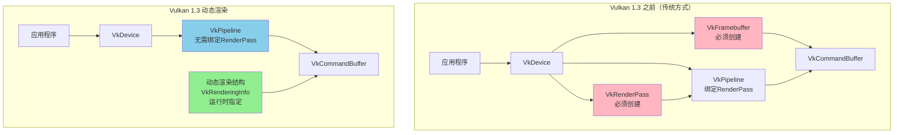

---

## 为什么需要动态渲染

### 传统渲染方式的问题

#### 1. 对象创建开销

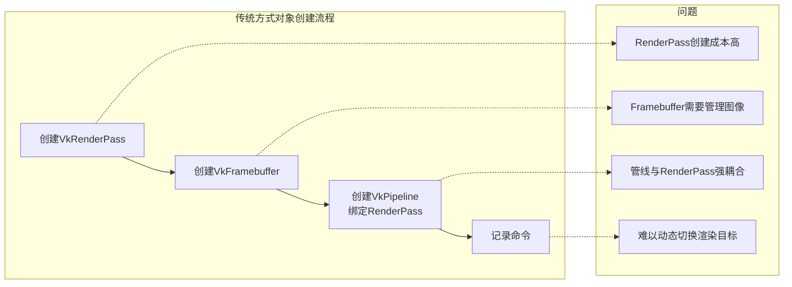

#### 2. 灵活性限制

- **RenderPass 必须预先创建**: 无法在运行时动态改变渲染目标
- **Framebuffer 与图像绑定**: 切换渲染目标需要创建新的 Framebuffer
- **管线与 RenderPass 耦合**: 不同的 RenderPass 需要不同的管线

#### 3. 代码复杂度

传统方式需要管理大量对象：

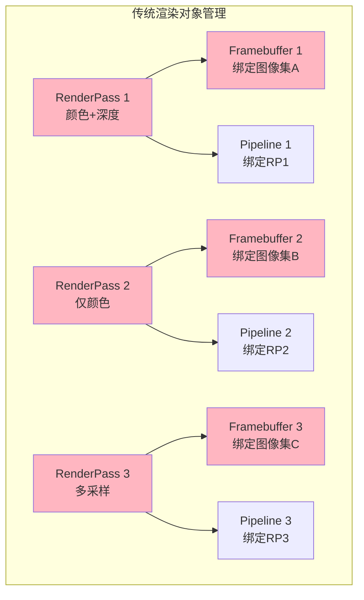

### 动态渲染的优势

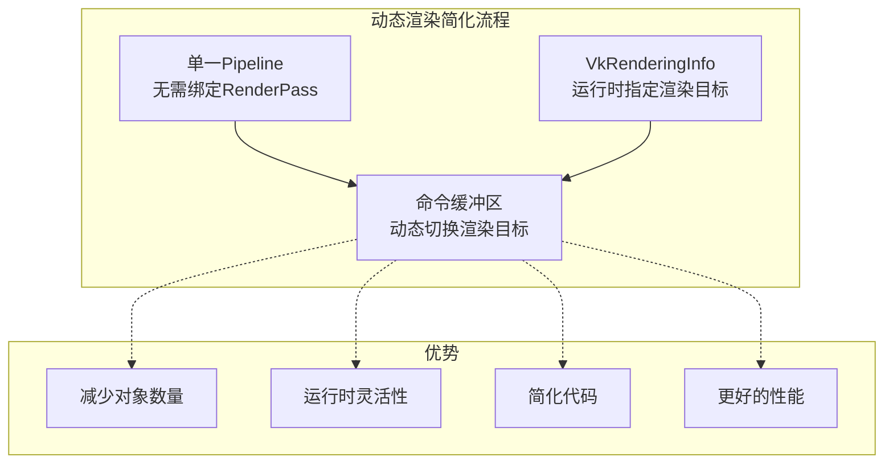

---

## 核心概念

### 1. VkRenderingInfo 结构

`VkRenderingInfo` 是动态渲染的核心结构，它包含了所有渲染所需的信息：

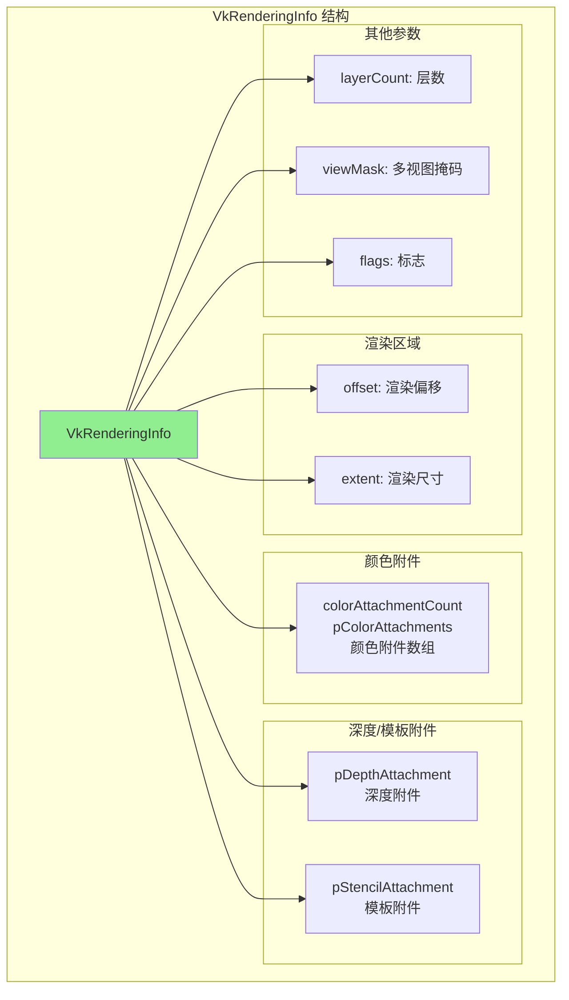

### 2. VkRenderingAttachmentInfo 结构

每个颜色、深度或模板附件都使用 `VkRenderingAttachmentInfo` 描述：

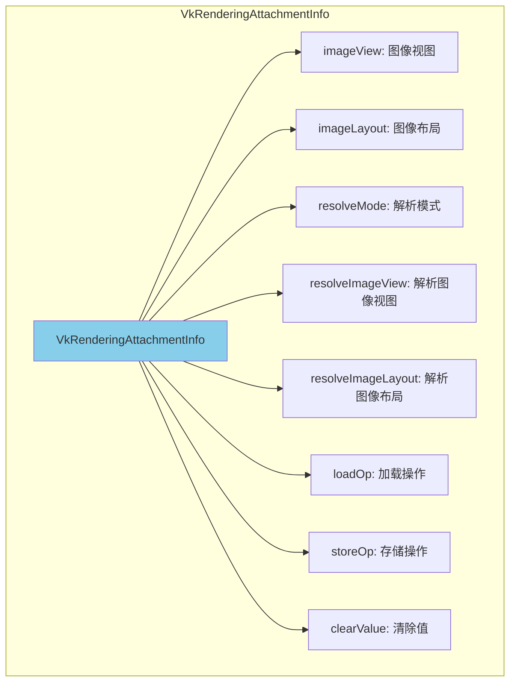

### 3. 动态渲染流程

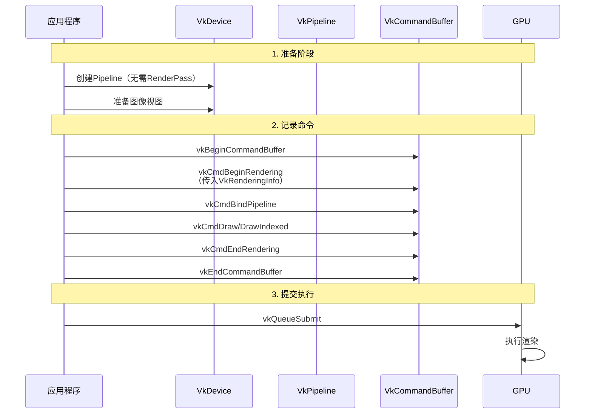

---

## API 详解

### API 分类

根据 Vulkan 官方规范，动态渲染相关的 API 分为两类：

#### 实例级 API（Instance-level APIs）

这些 API 使用 `VkInstance` 或 `VkPhysicalDevice` 作为第一个参数：

| API名称 | 类型 | 作用 |
|--------|------|------|
| `vkGetPhysicalDeviceFeatures2` | 实例级 | 查询物理设备是否支持动态渲染功能 |
| `vkGetPhysicalDeviceProperties2` | 实例级 | 查询物理设备属性（包括动态渲染相关） |

#### 设备级 API（Device-level APIs）

这些 API 使用 `VkDevice` 或 `VkCommandBuffer` 作为第一个参数：

| API名称 | 类型 | 作用 |
|--------|------|------|
| `vkCreateDevice` | 设备级 | 创建设备时启用动态渲染功能 |
| `vkCreateGraphicsPipelines` | 设备级 | 创建图形管线（使用 `VkPipelineRenderingCreateInfo`） |
| `vkCmdBeginRendering` | 设备级 | 开始动态渲染 |
| `vkCmdEndRendering` | 设备级 | 结束动态渲染 |

### 1. 启用动态渲染功能

#### 检查设备支持（实例级 API）

```cpp
// 使用实例级 API 查询物理设备是否支持动态渲染
VkPhysicalDeviceDynamicRenderingFeatures dynamicRenderingFeatures{};
dynamicRenderingFeatures.sType = VK_STRUCTURE_TYPE_PHYSICAL_DEVICE_DYNAMIC_RENDERING_FEATURES;

VkPhysicalDeviceFeatures2 features2{};
features2.sType = VK_STRUCTURE_TYPE_PHYSICAL_DEVICE_FEATURES_2;
features2.pNext = &dynamicRenderingFeatures;

// 实例级 API：查询物理设备特性
vkGetPhysicalDeviceFeatures2(physicalDevice, &features2);

if (dynamicRenderingFeatures.dynamicRendering) {
    // 设备支持动态渲染
}
```

#### 设备创建时启用（设备级 API）

```cpp
// 在创建 VkDevice 时启用动态渲染功能
VkPhysicalDeviceDynamicRenderingFeatures dynamicRenderingFeatures{};
dynamicRenderingFeatures.sType = VK_STRUCTURE_TYPE_PHYSICAL_DEVICE_DYNAMIC_RENDERING_FEATURES;
dynamicRenderingFeatures.dynamicRendering = VK_TRUE;

VkDeviceCreateInfo deviceCreateInfo{};
deviceCreateInfo.sType = VK_STRUCTURE_TYPE_DEVICE_CREATE_INFO;
deviceCreateInfo.pNext = &dynamicRenderingFeatures;
// ... 其他设置

// 设备级 API：创建设备
vkCreateDevice(physicalDevice, &deviceCreateInfo, nullptr, &device);
```

#### 检查支持情况

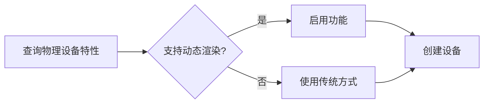

### 2. 创建管线（无需 RenderPass）

#### 图形管线创建（设备级 API）

```cpp
// 关键：使用 VkPipelineRenderingCreateInfo 替代 RenderPass
// Vulkan 1.3 核心功能，结构体名称不带 KHR 后缀
VkPipelineRenderingCreateInfo pipelineRenderingInfo{};
pipelineRenderingInfo.sType = VK_STRUCTURE_TYPE_PIPELINE_RENDERING_CREATE_INFO;
pipelineRenderingInfo.colorAttachmentCount = 1;
pipelineRenderingInfo.pColorAttachmentFormats = &colorFormat;  // 颜色格式
pipelineRenderingInfo.depthAttachmentFormat = depthFormat;     // 深度格式（可选）
pipelineRenderingInfo.stencilAttachmentFormat = stencilFormat; // 模板格式（可选）

VkGraphicsPipelineCreateInfo pipelineInfo{};
pipelineInfo.sType = VK_STRUCTURE_TYPE_GRAPHICS_PIPELINE_CREATE_INFO;
pipelineInfo.pNext = &pipelineRenderingInfo;
pipelineInfo.renderPass = VK_NULL_HANDLE;  // 不再需要 RenderPass！

// ... 其他管线设置

// 设备级 API：创建图形管线
vkCreateGraphicsPipelines(device, VK_NULL_HANDLE, 1, &pipelineInfo, nullptr, &pipeline);
```

#### 管线创建对比

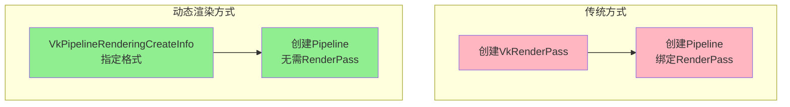

### 3. 开始动态渲染

#### vkCmdBeginRendering（设备级 API）

```cpp
// Vulkan 1.3 核心功能，结构体名称不带 KHR 后缀
VkRenderingInfo renderingInfo{};
renderingInfo.sType = VK_STRUCTURE_TYPE_RENDERING_INFO;
renderingInfo.renderArea.offset = {0, 0};
renderingInfo.renderArea.extent = {width, height};
renderingInfo.layerCount = 1;

// 颜色附件
VkRenderingAttachmentInfo colorAttachment{};
colorAttachment.sType = VK_STRUCTURE_TYPE_RENDERING_ATTACHMENT_INFO;
colorAttachment.imageView = colorImageView;
colorAttachment.imageLayout = VK_IMAGE_LAYOUT_COLOR_ATTACHMENT_OPTIMAL;
colorAttachment.loadOp = VK_ATTACHMENT_LOAD_OP_CLEAR;
colorAttachment.storeOp = VK_ATTACHMENT_STORE_OP_STORE;
colorAttachment.clearValue.color = {{0.0f, 0.0f, 0.0f, 1.0f}};

renderingInfo.colorAttachmentCount = 1;
renderingInfo.pColorAttachments = &colorAttachment;

// 深度附件（可选）
VkRenderingAttachmentInfo depthAttachment{};
depthAttachment.sType = VK_STRUCTURE_TYPE_RENDERING_ATTACHMENT_INFO;
depthAttachment.imageView = depthImageView;
depthAttachment.imageLayout = VK_IMAGE_LAYOUT_DEPTH_STENCIL_ATTACHMENT_OPTIMAL;
depthAttachment.loadOp = VK_ATTACHMENT_LOAD_OP_CLEAR;
depthAttachment.storeOp = VK_ATTACHMENT_STORE_OP_STORE;
depthAttachment.clearValue.depthStencil = {1.0f, 0};

renderingInfo.pDepthAttachment = &depthAttachment;

// 设备级 API：开始动态渲染
vkCmdBeginRendering(commandBuffer, &renderingInfo);
```

#### 渲染状态图

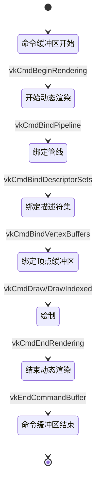

### 4. 结束动态渲染

#### vkCmdEndRendering（设备级 API）

```cpp
// 设备级 API：结束动态渲染
vkCmdEndRendering(commandBuffer);
```

---

## 传统渲染 vs 动态渲染

### 对象创建对比

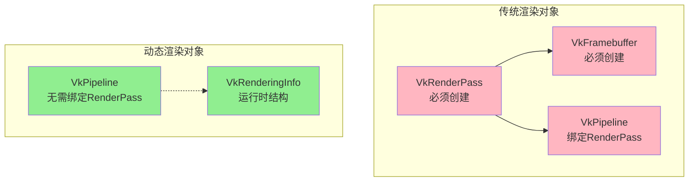

### 代码复杂度对比

#### 传统方式代码流程


#### 动态渲染代码流程

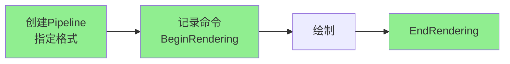

### 功能对比表

| 特性 | 传统渲染 | 动态渲染 |
|------|---------|---------|
| **RenderPass 对象** | 必须创建 | 不需要 |
| **Framebuffer 对象** | 必须创建 | 不需要 |
| **管线创建** | 绑定 RenderPass | 指定格式即可 |
| **渲染目标切换** | 需要新 Framebuffer | 运行时动态指定 |
| **对象数量** | 多（RP + FB + P） | 少（仅 P） |
| **代码复杂度** | 高 | 低 |
| **运行时灵活性** | 低 | 高 |
| **Vulkan 版本** | 1.0+ | 1.3+ |

---

## 使用流程

### 完整使用流程图

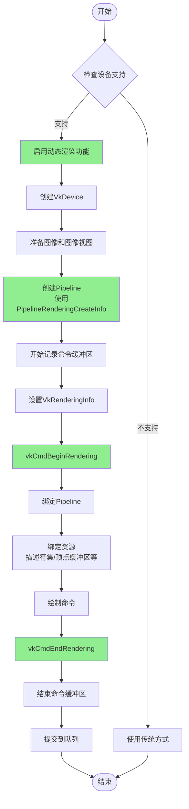

### 关键步骤详解

#### 步骤 1: 启用功能

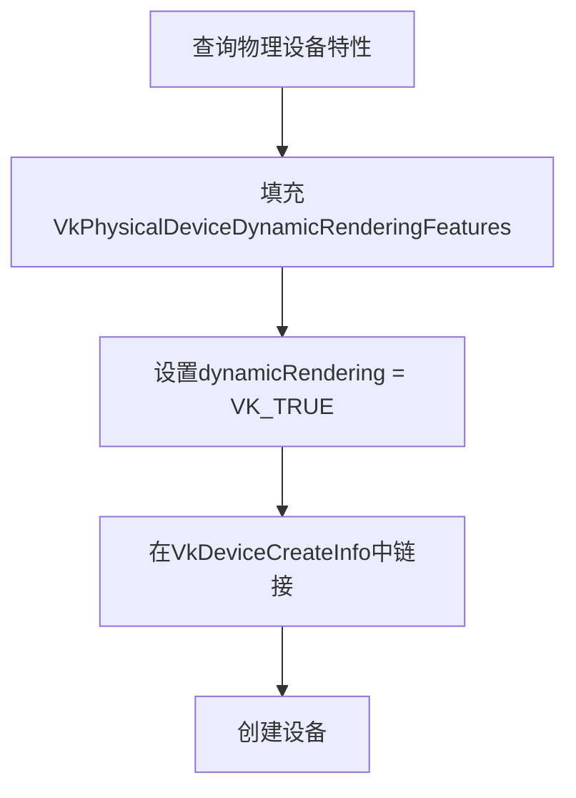

#### 步骤 2: 创建管线

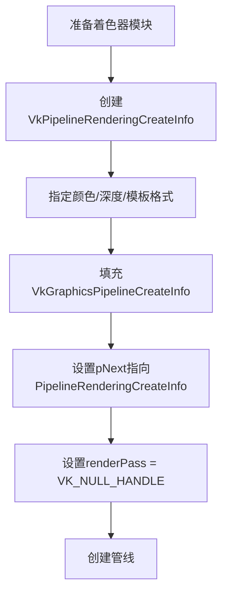

#### 步骤 3: 记录渲染命令

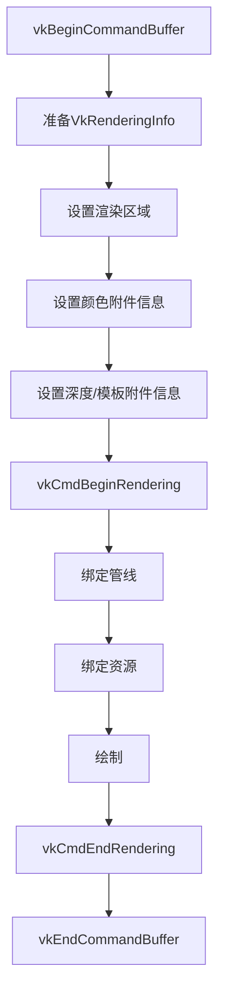

---

## 代码示例

### 完整示例：使用动态渲染绘制三角形

#### 1. 启用动态渲染功能

```cpp
// 步骤1：使用实例级 API 检查设备支持
VkPhysicalDeviceDynamicRenderingFeatures dynamicRenderingFeatures{};
dynamicRenderingFeatures.sType = VK_STRUCTURE_TYPE_PHYSICAL_DEVICE_DYNAMIC_RENDERING_FEATURES;

VkPhysicalDeviceFeatures2 features2{};
features2.sType = VK_STRUCTURE_TYPE_PHYSICAL_DEVICE_FEATURES_2;
features2.pNext = &dynamicRenderingFeatures;

vkGetPhysicalDeviceFeatures2(physicalDevice, &features2);

if (!dynamicRenderingFeatures.dynamicRendering) {
    // 设备不支持动态渲染，回退到传统方式
    return false;
}

// 步骤2：使用设备级 API 创建设备并启用功能
dynamicRenderingFeatures.dynamicRendering = VK_TRUE;

VkDeviceCreateInfo deviceCreateInfo{};
deviceCreateInfo.sType = VK_STRUCTURE_TYPE_DEVICE_CREATE_INFO;
deviceCreateInfo.pNext = &dynamicRenderingFeatures;
// ... 其他设置

vkCreateDevice(physicalDevice, &deviceCreateInfo, nullptr, &device);
```

#### 2. 创建图形管线（设备级 API）

```cpp
// 创建管线时指定渲染格式
// Vulkan 1.3 核心功能，结构体名称不带 KHR 后缀
VkPipelineRenderingCreateInfo pipelineRenderingInfo{};
pipelineRenderingInfo.sType = VK_STRUCTURE_TYPE_PIPELINE_RENDERING_CREATE_INFO;
pipelineRenderingInfo.colorAttachmentCount = 1;
VkFormat colorFormat = VK_FORMAT_B8G8R8A8_UNORM;
pipelineRenderingInfo.pColorAttachmentFormats = &colorFormat;
pipelineRenderingInfo.depthAttachmentFormat = VK_FORMAT_D32_SFLOAT;

VkGraphicsPipelineCreateInfo pipelineInfo{};
pipelineInfo.sType = VK_STRUCTURE_TYPE_GRAPHICS_PIPELINE_CREATE_INFO;
pipelineInfo.pNext = &pipelineRenderingInfo;
pipelineInfo.renderPass = VK_NULL_HANDLE;  // 关键：不需要 RenderPass

// 设置着色器阶段
VkPipelineShaderStageCreateInfo vertShaderStageInfo{};
vertShaderStageInfo.sType = VK_STRUCTURE_TYPE_PIPELINE_SHADER_STAGE_CREATE_INFO;
vertShaderStageInfo.stage = VK_SHADER_STAGE_VERTEX_BIT;
vertShaderStageInfo.module = vertShaderModule;
vertShaderStageInfo.pName = "main";

VkPipelineShaderStageCreateInfo fragShaderStageInfo{};
fragShaderStageInfo.sType = VK_STRUCTURE_TYPE_PIPELINE_SHADER_STAGE_CREATE_INFO;
fragShaderStageInfo.stage = VK_SHADER_STAGE_FRAGMENT_BIT;
fragShaderStageInfo.module = fragShaderModule;
fragShaderStageInfo.pName = "main";

VkPipelineShaderStageCreateInfo shaderStages[] = {vertShaderStageInfo, fragShaderStageInfo};
pipelineInfo.stageCount = 2;
pipelineInfo.pStages = shaderStages;

// 设置顶点输入
VkPipelineVertexInputStateCreateInfo vertexInputInfo{};
vertexInputInfo.sType = VK_STRUCTURE_TYPE_PIPELINE_VERTEX_INPUT_STATE_CREATE_INFO;
// ... 顶点输入设置
pipelineInfo.pVertexInputState = &vertexInputInfo;

// 设置输入装配
VkPipelineInputAssemblyStateCreateInfo inputAssembly{};
inputAssembly.sType = VK_STRUCTURE_TYPE_PIPELINE_INPUT_ASSEMBLY_STATE_CREATE_INFO;
inputAssembly.topology = VK_PRIMITIVE_TOPOLOGY_TRIANGLE_LIST;
pipelineInfo.pInputAssemblyState = &inputAssembly;

// 设置视口和裁剪
VkPipelineViewportStateCreateInfo viewportState{};
viewportState.sType = VK_STRUCTURE_TYPE_PIPELINE_VIEWPORT_STATE_CREATE_INFO;
viewportState.viewportCount = 1;
viewportState.scissorCount = 1;
pipelineInfo.pViewportState = &viewportState;

// 设置光栅化
VkPipelineRasterizationStateCreateInfo rasterizer{};
rasterizer.sType = VK_STRUCTURE_TYPE_PIPELINE_RASTERIZATION_STATE_CREATE_INFO;
rasterizer.polygonMode = VK_POLYGON_MODE_FILL;
rasterizer.lineWidth = 1.0f;
rasterizer.cullMode = VK_CULL_MODE_BACK_BIT;
rasterizer.frontFace = VK_FRONT_FACE_CLOCKWISE;
pipelineInfo.pRasterizationState = &rasterizer;

// 设置多重采样
VkPipelineMultisampleStateCreateInfo multisampling{};
multisampling.sType = VK_STRUCTURE_TYPE_PIPELINE_MULTISAMPLE_STATE_CREATE_INFO;
multisampling.sampleShadingEnable = VK_FALSE;
multisampling.rasterizationSamples = VK_SAMPLE_COUNT_1_BIT;
pipelineInfo.pMultisampleState = &multisampling;

// 设置深度模板
VkPipelineDepthStencilStateCreateInfo depthStencil{};
depthStencil.sType = VK_STRUCTURE_TYPE_PIPELINE_DEPTH_STENCIL_STATE_CREATE_INFO;
depthStencil.depthTestEnable = VK_TRUE;
depthStencil.depthWriteEnable = VK_TRUE;
depthStencil.depthCompareOp = VK_COMPARE_OP_LESS;
pipelineInfo.pDepthStencilState = &depthStencil;

// 设置颜色混合
VkPipelineColorBlendStateCreateInfo colorBlending{};
colorBlending.sType = VK_STRUCTURE_TYPE_PIPELINE_COLOR_BLEND_STATE_CREATE_INFO;
colorBlending.logicOpEnable = VK_FALSE;
colorBlending.attachmentCount = 1;
VkPipelineColorBlendAttachmentState colorBlendAttachment{};
colorBlendAttachment.colorWriteMask = VK_COLOR_COMPONENT_R_BIT | VK_COLOR_COMPONENT_G_BIT | 
                                      VK_COLOR_COMPONENT_B_BIT | VK_COLOR_COMPONENT_A_BIT;
colorBlending.pAttachments = &colorBlendAttachment;
pipelineInfo.pColorBlendState = &colorBlending;

// 设置动态状态
VkPipelineDynamicStateCreateInfo dynamicState{};
dynamicState.sType = VK_STRUCTURE_TYPE_PIPELINE_DYNAMIC_STATE_CREATE_INFO;
VkDynamicState dynamicStates[] = {VK_DYNAMIC_STATE_VIEWPORT, VK_DYNAMIC_STATE_SCISSOR};
dynamicState.dynamicStateCount = 2;
dynamicState.pDynamicStates = dynamicStates;
pipelineInfo.pDynamicState = &dynamicState;

// 设置管线布局
pipelineInfo.layout = pipelineLayout;

// 创建管线
vkCreateGraphicsPipelines(device, VK_NULL_HANDLE, 1, &pipelineInfo, nullptr, &graphicsPipeline);
```

#### 3. 记录渲染命令（设备级 API）

```cpp
void recordCommandBuffer(VkCommandBuffer commandBuffer, uint32_t imageIndex) {
    VkCommandBufferBeginInfo beginInfo{};
    beginInfo.sType = VK_STRUCTURE_TYPE_COMMAND_BUFFER_BEGIN_INFO;
    vkBeginCommandBuffer(commandBuffer, &beginInfo);

    // 设置渲染区域
    // Vulkan 1.3 核心功能，结构体名称不带 KHR 后缀
    VkRenderingInfo renderingInfo{};
    renderingInfo.sType = VK_STRUCTURE_TYPE_RENDERING_INFO;
    renderingInfo.renderArea.offset = {0, 0};
    renderingInfo.renderArea.extent = swapChainExtent;
    renderingInfo.layerCount = 1;

    // 设置颜色附件
    VkRenderingAttachmentInfo colorAttachment{};
    colorAttachment.sType = VK_STRUCTURE_TYPE_RENDERING_ATTACHMENT_INFO;
    colorAttachment.imageView = swapChainImageViews[imageIndex];
    colorAttachment.imageLayout = VK_IMAGE_LAYOUT_COLOR_ATTACHMENT_OPTIMAL;
    colorAttachment.loadOp = VK_ATTACHMENT_LOAD_OP_CLEAR;
    colorAttachment.storeOp = VK_ATTACHMENT_STORE_OP_STORE;
    colorAttachment.clearValue.color = {{0.0f, 0.0f, 0.0f, 1.0f}};

    renderingInfo.colorAttachmentCount = 1;
    renderingInfo.pColorAttachments = &colorAttachment;

    // 设置深度附件
    VkRenderingAttachmentInfo depthAttachment{};
    depthAttachment.sType = VK_STRUCTURE_TYPE_RENDERING_ATTACHMENT_INFO;
    depthAttachment.imageView = depthImageView;
    depthAttachment.imageLayout = VK_IMAGE_LAYOUT_DEPTH_STENCIL_ATTACHMENT_OPTIMAL;
    depthAttachment.loadOp = VK_ATTACHMENT_LOAD_OP_CLEAR;
    depthAttachment.storeOp = VK_ATTACHMENT_STORE_OP_STORE;
    depthAttachment.clearValue.depthStencil = {1.0f, 0};

    renderingInfo.pDepthAttachment = &depthAttachment;

    // 设备级 API：开始动态渲染
    vkCmdBeginRendering(commandBuffer, &renderingInfo);

    // 设置视口和裁剪
    VkViewport viewport{};
    viewport.x = 0.0f;
    viewport.y = 0.0f;
    viewport.width = static_cast<float>(swapChainExtent.width);
    viewport.height = static_cast<float>(swapChainExtent.height);
    viewport.minDepth = 0.0f;
    viewport.maxDepth = 1.0f;
    vkCmdSetViewport(commandBuffer, 0, 1, &viewport);

    VkRect2D scissor{};
    scissor.offset = {0, 0};
    scissor.extent = swapChainExtent;
    vkCmdSetScissor(commandBuffer, 0, 1, &scissor);

    // 绑定管线
    vkCmdBindPipeline(commandBuffer, VK_PIPELINE_BIND_POINT_GRAPHICS, graphicsPipeline);

    // 绑定顶点缓冲区
    VkBuffer vertexBuffers[] = {vertexBuffer};
    VkDeviceSize offsets[] = {0};
    vkCmdBindVertexBuffers(commandBuffer, 0, 1, vertexBuffers, offsets);

    // 绑定索引缓冲区
    vkCmdBindIndexBuffer(commandBuffer, indexBuffer, 0, VK_INDEX_TYPE_UINT16);

    // 绑定描述符集
    vkCmdBindDescriptorSets(commandBuffer, VK_PIPELINE_BIND_POINT_GRAPHICS, 
                           pipelineLayout, 0, 1, &descriptorSets[currentFrame], 0, nullptr);

    // 绘制
    vkCmdDrawIndexed(commandBuffer, static_cast<uint32_t>(indices.size()), 1, 0, 0, 0);

    // 设备级 API：结束动态渲染
    vkCmdEndRendering(commandBuffer);

    vkEndCommandBuffer(commandBuffer);
}
```

### 多渲染目标示例

```cpp
// 使用多个颜色附件的动态渲染
void recordCommandBufferWithMRT(VkCommandBuffer commandBuffer) {
    vkBeginCommandBuffer(commandBuffer, &beginInfo);

    VkRenderingInfo renderingInfo{};
    renderingInfo.sType = VK_STRUCTURE_TYPE_RENDERING_INFO;
    renderingInfo.renderArea = {{0, 0}, {width, height}};
    renderingInfo.layerCount = 1;

    // 多个颜色附件
    std::vector<VkRenderingAttachmentInfo> colorAttachments(3);
    
    // 颜色附件 0: 反照率
    colorAttachments[0].sType = VK_STRUCTURE_TYPE_RENDERING_ATTACHMENT_INFO;
    colorAttachments[0].imageView = albedoImageView;
    colorAttachments[0].imageLayout = VK_IMAGE_LAYOUT_COLOR_ATTACHMENT_OPTIMAL;
    colorAttachments[0].loadOp = VK_ATTACHMENT_LOAD_OP_CLEAR;
    colorAttachments[0].storeOp = VK_ATTACHMENT_STORE_OP_STORE;
    colorAttachments[0].clearValue.color = {{0.0f, 0.0f, 0.0f, 1.0f}};

    // 颜色附件 1: 法线
    colorAttachments[1].sType = VK_STRUCTURE_TYPE_RENDERING_ATTACHMENT_INFO;
    colorAttachments[1].imageView = normalImageView;
    colorAttachments[1].imageLayout = VK_IMAGE_LAYOUT_COLOR_ATTACHMENT_OPTIMAL;
    colorAttachments[1].loadOp = VK_ATTACHMENT_LOAD_OP_CLEAR;
    colorAttachments[1].storeOp = VK_ATTACHMENT_STORE_OP_STORE;
    colorAttachments[1].clearValue.color = {{0.5f, 0.5f, 1.0f, 1.0f}};

    // 颜色附件 2: 粗糙度/金属度
    colorAttachments[2].sType = VK_STRUCTURE_TYPE_RENDERING_ATTACHMENT_INFO;
    colorAttachments[2].imageView = roughnessMetallicImageView;
    colorAttachments[2].imageLayout = VK_IMAGE_LAYOUT_COLOR_ATTACHMENT_OPTIMAL;
    colorAttachments[2].loadOp = VK_ATTACHMENT_LOAD_OP_CLEAR;
    colorAttachments[2].storeOp = VK_ATTACHMENT_STORE_OP_STORE;
    colorAttachments[2].clearValue.color = {{0.0f, 0.0f, 0.0f, 1.0f}};

    renderingInfo.colorAttachmentCount = colorAttachments.size();
    renderingInfo.pColorAttachments = colorAttachments.data();

    // 深度附件
    VkRenderingAttachmentInfo depthAttachment{};
    depthAttachment.sType = VK_STRUCTURE_TYPE_RENDERING_ATTACHMENT_INFO;
    depthAttachment.imageView = depthImageView;
    depthAttachment.imageLayout = VK_IMAGE_LAYOUT_DEPTH_STENCIL_ATTACHMENT_OPTIMAL;
    depthAttachment.loadOp = VK_ATTACHMENT_LOAD_OP_CLEAR;
    depthAttachment.storeOp = VK_ATTACHMENT_STORE_OP_STORE;
    depthAttachment.clearValue.depthStencil = {1.0f, 0};

    renderingInfo.pDepthAttachment = &depthAttachment;

    vkCmdBeginRendering(commandBuffer, &renderingInfo);

    // ... 绑定管线和绘制 ...

    vkCmdEndRendering(commandBuffer);
    vkEndCommandBuffer(commandBuffer);
}
```

### 多采样抗锯齿（MSAA）示例

```cpp
// 使用 MSAA 的动态渲染
void recordCommandBufferWithMSAA(VkCommandBuffer commandBuffer) {
    vkBeginCommandBuffer(commandBuffer, &beginInfo);

    VkRenderingInfo renderingInfo{};
    renderingInfo.sType = VK_STRUCTURE_TYPE_RENDERING_INFO;
    renderingInfo.renderArea = {{0, 0}, {width, height}};
    renderingInfo.layerCount = 1;

    // 颜色附件（多采样）
    VkRenderingAttachmentInfo colorAttachment{};
    colorAttachment.sType = VK_STRUCTURE_TYPE_RENDERING_ATTACHMENT_INFO;
    colorAttachment.imageView = msaaColorImageView;  // 多采样图像视图
    colorAttachment.imageLayout = VK_IMAGE_LAYOUT_COLOR_ATTACHMENT_OPTIMAL;
    colorAttachment.loadOp = VK_ATTACHMENT_LOAD_OP_CLEAR;
    colorAttachment.storeOp = VK_ATTACHMENT_STORE_OP_STORE;
    colorAttachment.clearValue.color = {{0.0f, 0.0f, 0.0f, 1.0f}};

    // 解析附件（解析到交换链图像）
    colorAttachment.resolveMode = VK_RESOLVE_MODE_AVERAGE_BIT;
    colorAttachment.resolveImageView = swapChainImageView;
    colorAttachment.resolveImageLayout = VK_IMAGE_LAYOUT_COLOR_ATTACHMENT_OPTIMAL;

    renderingInfo.colorAttachmentCount = 1;
    renderingInfo.pColorAttachments = &colorAttachment;

    // 深度附件（多采样）
    VkRenderingAttachmentInfo depthAttachment{};
    depthAttachment.sType = VK_STRUCTURE_TYPE_RENDERING_ATTACHMENT_INFO;
    depthAttachment.imageView = msaaDepthImageView;
    depthAttachment.imageLayout = VK_IMAGE_LAYOUT_DEPTH_STENCIL_ATTACHMENT_OPTIMAL;
    depthAttachment.loadOp = VK_ATTACHMENT_LOAD_OP_CLEAR;
    depthAttachment.storeOp = VK_ATTACHMENT_STORE_OP_STORE;
    depthAttachment.clearValue.depthStencil = {1.0f, 0};

    renderingInfo.pDepthAttachment = &depthAttachment;

    vkCmdBeginRendering(commandBuffer, &renderingInfo);

    // ... 绘制 ...

    vkCmdEndRendering(commandBuffer);
    vkEndCommandBuffer(commandBuffer);
}
```

---

## 最佳实践

### 1. 图像布局管理

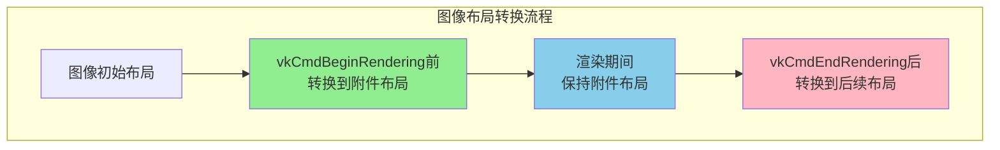

**最佳实践**：
- 在 `vkCmdBeginRendering` 之前，确保图像处于正确的布局
- 使用 `VK_IMAGE_LAYOUT_COLOR_ATTACHMENT_OPTIMAL` 作为颜色附件布局
- 使用 `VK_IMAGE_LAYOUT_DEPTH_STENCIL_ATTACHMENT_OPTIMAL` 作为深度/模板附件布局
- 在渲染结束后，根据需要转换图像布局（如转换为 `VK_IMAGE_LAYOUT_SHADER_READ_ONLY_OPTIMAL`）

### 2. 同步和内存屏障

```cpp
// 在开始渲染前插入内存屏障
VkMemoryBarrier memoryBarrier{};
memoryBarrier.sType = VK_STRUCTURE_TYPE_MEMORY_BARRIER;
memoryBarrier.srcAccessMask = VK_ACCESS_COLOR_ATTACHMENT_WRITE_BIT;
memoryBarrier.dstAccessMask = VK_ACCESS_COLOR_ATTACHMENT_READ_BIT;

vkCmdPipelineBarrier(
    commandBuffer,
    VK_PIPELINE_STAGE_COLOR_ATTACHMENT_OUTPUT_BIT,
    VK_PIPELINE_STAGE_COLOR_ATTACHMENT_OUTPUT_BIT,
    0,
    1, &memoryBarrier,
    0, nullptr,
    0, nullptr
);

vkCmdBeginRendering(commandBuffer, &renderingInfo);
```

### 3. 性能优化建议

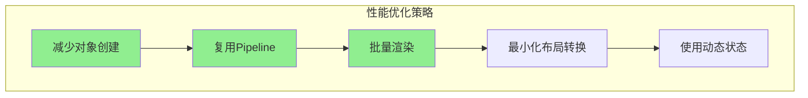

**优化建议**：
1. **复用管线**: 创建较少的管线对象，通过动态状态改变行为
2. **批量渲染**: 在一次 `vkCmdBeginRendering` / `vkCmdEndRendering` 调用中绘制多个对象
3. **最小化布局转换**: 合理安排图像布局转换，减少不必要的转换
4. **使用动态状态**: 使用 `VK_DYNAMIC_STATE_VIEWPORT` 和 `VK_DYNAMIC_STATE_SCISSOR` 等动态状态

### 4. 错误处理

```cpp
// 使用实例级 API 检查动态渲染支持
VkPhysicalDeviceDynamicRenderingFeatures dynamicRenderingFeatures{};
dynamicRenderingFeatures.sType = VK_STRUCTURE_TYPE_PHYSICAL_DEVICE_DYNAMIC_RENDERING_FEATURES;

VkPhysicalDeviceFeatures2 features2{};
features2.sType = VK_STRUCTURE_TYPE_PHYSICAL_DEVICE_FEATURES_2;
features2.pNext = &dynamicRenderingFeatures;

// 实例级 API：查询物理设备特性
vkGetPhysicalDeviceFeatures2(physicalDevice, &features2);

if (!dynamicRenderingFeatures.dynamicRendering) {
    // 回退到传统渲染方式
    std::cerr << "Dynamic rendering not supported, falling back to traditional rendering" << std::endl;
    return false;
}
```

### 5. 与传统渲染方式共存

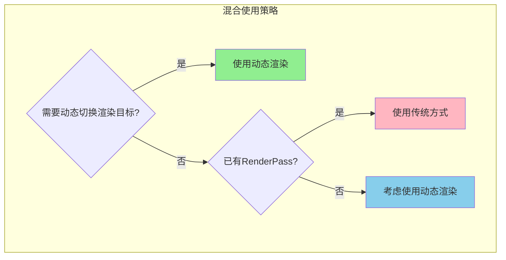

**建议**：
- 新项目优先使用动态渲染
- 现有项目可以逐步迁移
- 两种方式可以在同一应用中混合使用

---

## 同步2（Synchronization2）

### 概述

**同步2（Synchronization2）** 是 Vulkan 1.3 引入的核心功能，它将 `VK_KHR_synchronization2` 扩展提升为核心功能。同步2提供了更直观、更强大的同步机制，简化了同步操作的使用。

### 为什么需要同步2？

#### 传统同步 API 的问题

```mermaid
graph TB
    subgraph "传统同步API问题"
        A[vkQueueSubmit<br/>复杂的参数结构]
        B[vkCmdPipelineBarrier<br/>难以理解的访问掩码]
        C[vkCmdWaitEvents<br/>复杂的依赖关系]
        D[容易出错<br/>难以调试]
    end
    
    A --> D
    B --> D
    C --> D
    
    style D fill:#FFB6C1
```

传统同步 API 的主要问题：
- **复杂的访问掩码**: `srcAccessMask` 和 `dstAccessMask` 难以正确设置
- **隐式依赖**: 依赖关系不够明确
- **容易出错**: 错误的同步设置可能导致数据竞争或性能问题
- **难以维护**: 代码可读性差

#### 同步2的优势

```mermaid
graph TB
    subgraph "同步2优势"
        A1[vkQueueSubmit2<br/>结构化的依赖信息]
        B1[vkCmdPipelineBarrier2<br/>明确的依赖关系]
        C1[更直观的API<br/>更易理解]
        D1[更好的性能<br/>更少的错误]
    end
    
    A1 --> D1
    B1 --> D1
    C1 --> D1
    
    style D1 fill:#90EE90
```

### 核心概念

#### VkDependencyInfo 结构

同步2使用 `VkDependencyInfo` 结构统一描述依赖关系：

```mermaid
graph TB
    subgraph "VkDependencyInfo 结构"
        DI[VkDependencyInfo]
        
        subgraph "内存屏障"
            MB[memoryBarrierCount<br/>pMemoryBarriers<br/>内存屏障数组]
        end
        
        subgraph "缓冲区内存屏障"
            BMB[bufferMemoryBarrierCount<br/>pBufferMemoryBarriers<br/>缓冲区内存屏障数组]
        end
        
        subgraph "图像内存屏障"
            IMB[imageMemoryBarrierCount<br/>pImageMemoryBarriers<br/>图像内存屏障数组]
        end
        
        subgraph "依赖标志"
            DF[dependencyFlags<br/>依赖标志]
        end
        
        DI --> MB
        DI --> BMB
        DI --> IMB
        DI --> DF
    end
    
    style DI fill:#90EE90
```

### API 详解

#### API 分类

根据 Vulkan 官方规范，同步2相关的 API 分为两类：

##### 实例级 API（Instance-level APIs）

| API名称 | 类型 | 作用 |
|--------|------|------|
| `vkGetPhysicalDeviceFeatures2` | 实例级 | 查询物理设备是否支持同步2功能 |

##### 设备级 API（Device-level APIs）

| API名称 | 类型 | 作用 |
|--------|------|------|
| `vkQueueSubmit2` | 设备级 | 提交命令缓冲区（同步2版本） |
| `vkCmdPipelineBarrier2` | 设备级 | 设置管线屏障（同步2版本） |
| `vkCmdWaitEvents2` | 设备级 | 等待事件（同步2版本） |
| `vkCmdSetEvent2` | 设备级 | 设置事件（同步2版本） |

### 1. 启用同步2功能

#### 检查设备支持（实例级 API）

```cpp
// 使用实例级 API 查询物理设备是否支持同步2
VkPhysicalDeviceSynchronization2Features sync2Features{};
sync2Features.sType = VK_STRUCTURE_TYPE_PHYSICAL_DEVICE_SYNCHRONIZATION_2_FEATURES;

VkPhysicalDeviceFeatures2 features2{};
features2.sType = VK_STRUCTURE_TYPE_PHYSICAL_DEVICE_FEATURES_2;
features2.pNext = &sync2Features;

// 实例级 API：查询物理设备特性
vkGetPhysicalDeviceFeatures2(physicalDevice, &features2);

if (sync2Features.synchronization2) {
    // 设备支持同步2
}
```

#### 设备创建时启用（设备级 API）

```cpp
// 在创建 VkDevice 时启用同步2功能
VkPhysicalDeviceSynchronization2Features sync2Features{};
sync2Features.sType = VK_STRUCTURE_TYPE_PHYSICAL_DEVICE_SYNCHRONIZATION_2_FEATURES;
sync2Features.synchronization2 = VK_TRUE;

VkDeviceCreateInfo deviceCreateInfo{};
deviceCreateInfo.sType = VK_STRUCTURE_TYPE_DEVICE_CREATE_INFO;
deviceCreateInfo.pNext = &sync2Features;
// ... 其他设置

// 设备级 API：创建设备
vkCreateDevice(physicalDevice, &deviceCreateInfo, nullptr, &device);
```

### 2. vkQueueSubmit2（设备级 API）

`vkQueueSubmit2` 是同步2的核心API，提供了更结构化的命令提交方式：

```cpp
// 使用 vkQueueSubmit2 提交命令
VkCommandBufferSubmitInfo commandBufferInfo{};
commandBufferInfo.sType = VK_STRUCTURE_TYPE_COMMAND_BUFFER_SUBMIT_INFO;
commandBufferInfo.commandBuffer = commandBuffer;
commandBufferInfo.deviceMask = 0;

VkSemaphoreSubmitInfo waitSemaphoreInfo{};
waitSemaphoreInfo.sType = VK_STRUCTURE_TYPE_SEMAPHORE_SUBMIT_INFO;
waitSemaphoreInfo.semaphore = waitSemaphore;
waitSemaphoreInfo.value = 1; // 时间线信号量值（如果使用）
waitSemaphoreInfo.stageMask = VK_PIPELINE_STAGE_2_COLOR_ATTACHMENT_OUTPUT_BIT;

VkSemaphoreSubmitInfo signalSemaphoreInfo{};
signalSemaphoreInfo.sType = VK_STRUCTURE_TYPE_SEMAPHORE_SUBMIT_INFO;
signalSemaphoreInfo.semaphore = signalSemaphore;
signalSemaphoreInfo.value = 2; // 时间线信号量值（如果使用）
signalSemaphoreInfo.stageMask = VK_PIPELINE_STAGE_2_COLOR_ATTACHMENT_OUTPUT_BIT;

VkSubmitInfo2 submitInfo{};
submitInfo.sType = VK_STRUCTURE_TYPE_SUBMIT_INFO_2;
submitInfo.waitSemaphoreInfoCount = 1;
submitInfo.pWaitSemaphoreInfos = &waitSemaphoreInfo;
submitInfo.commandBufferInfoCount = 1;
submitInfo.pCommandBufferInfos = &commandBufferInfo;
submitInfo.signalSemaphoreInfoCount = 1;
submitInfo.pSignalSemaphoreInfos = &signalSemaphoreInfo;

// 设备级 API：提交命令（同步2版本）
vkQueueSubmit2(queue, 1, &submitInfo, fence);
```

### 3. vkCmdPipelineBarrier2（设备级 API）

`vkCmdPipelineBarrier2` 提供了更直观的屏障设置方式：

```cpp
// 使用 vkCmdPipelineBarrier2 设置屏障
VkMemoryBarrier2 memoryBarrier{};
memoryBarrier.sType = VK_STRUCTURE_TYPE_MEMORY_BARRIER_2;
memoryBarrier.srcStageMask = VK_PIPELINE_STAGE_2_COLOR_ATTACHMENT_OUTPUT_BIT;
memoryBarrier.srcAccessMask = VK_ACCESS_2_COLOR_ATTACHMENT_WRITE_BIT;
memoryBarrier.dstStageMask = VK_PIPELINE_STAGE_2_FRAGMENT_SHADER_BIT;
memoryBarrier.dstAccessMask = VK_ACCESS_2_SHADER_READ_BIT;

VkImageMemoryBarrier2 imageBarrier{};
imageBarrier.sType = VK_STRUCTURE_TYPE_IMAGE_MEMORY_BARRIER_2;
imageBarrier.srcStageMask = VK_PIPELINE_STAGE_2_COLOR_ATTACHMENT_OUTPUT_BIT;
imageBarrier.srcAccessMask = VK_ACCESS_2_COLOR_ATTACHMENT_WRITE_BIT;
imageBarrier.dstStageMask = VK_PIPELINE_STAGE_2_FRAGMENT_SHADER_BIT;
imageBarrier.dstAccessMask = VK_ACCESS_2_SHADER_READ_BIT;
imageBarrier.oldLayout = VK_IMAGE_LAYOUT_COLOR_ATTACHMENT_OPTIMAL;
imageBarrier.newLayout = VK_IMAGE_LAYOUT_SHADER_READ_ONLY_OPTIMAL;
imageBarrier.image = image;
imageBarrier.subresourceRange.aspectMask = VK_IMAGE_ASPECT_COLOR_BIT;
imageBarrier.subresourceRange.baseMipLevel = 0;
imageBarrier.subresourceRange.levelCount = 1;
imageBarrier.subresourceRange.baseArrayLayer = 0;
imageBarrier.subresourceRange.layerCount = 1;

VkDependencyInfo dependencyInfo{};
dependencyInfo.sType = VK_STRUCTURE_TYPE_DEPENDENCY_INFO;
dependencyInfo.memoryBarrierCount = 1;
dependencyInfo.pMemoryBarriers = &memoryBarrier;
dependencyInfo.imageMemoryBarrierCount = 1;
dependencyInfo.pImageMemoryBarriers = &imageBarrier;

// 设备级 API：设置管线屏障（同步2版本）
vkCmdPipelineBarrier2(commandBuffer, &dependencyInfo);
```

### 4. vkCmdWaitEvents2（设备级 API）

`vkCmdWaitEvents2` 提供了更灵活的事件等待机制：

```cpp
// 使用 vkCmdWaitEvents2 等待事件
VkMemoryBarrier2 memoryBarrier{};
memoryBarrier.sType = VK_STRUCTURE_TYPE_MEMORY_BARRIER_2;
memoryBarrier.srcStageMask = VK_PIPELINE_STAGE_2_COMPUTE_SHADER_BIT;
memoryBarrier.srcAccessMask = VK_ACCESS_2_SHADER_WRITE_BIT;
memoryBarrier.dstStageMask = VK_PIPELINE_STAGE_2_FRAGMENT_SHADER_BIT;
memoryBarrier.dstAccessMask = VK_ACCESS_2_SHADER_READ_BIT;

VkDependencyInfo dependencyInfo{};
dependencyInfo.sType = VK_STRUCTURE_TYPE_DEPENDENCY_INFO;
dependencyInfo.memoryBarrierCount = 1;
dependencyInfo.pMemoryBarriers = &memoryBarrier;

VkEvent events[] = {event1, event2};

// 设备级 API：等待事件（同步2版本）
vkCmdWaitEvents2(commandBuffer, 2, events, &dependencyInfo);
```

### 5. vkCmdSetEvent2（设备级 API）

```cpp
// 使用 vkCmdSetEvent2 设置事件
VkMemoryBarrier2 memoryBarrier{};
memoryBarrier.sType = VK_STRUCTURE_TYPE_MEMORY_BARRIER_2;
memoryBarrier.srcStageMask = VK_PIPELINE_STAGE_2_COLOR_ATTACHMENT_OUTPUT_BIT;
memoryBarrier.srcAccessMask = VK_ACCESS_2_COLOR_ATTACHMENT_WRITE_BIT;
memoryBarrier.dstStageMask = VK_PIPELINE_STAGE_2_ALL_COMMANDS_BIT;
memoryBarrier.dstAccessMask = VK_ACCESS_2_MEMORY_READ_BIT | VK_ACCESS_2_MEMORY_WRITE_BIT;

VkDependencyInfo dependencyInfo{};
dependencyInfo.sType = VK_STRUCTURE_TYPE_DEPENDENCY_INFO;
dependencyInfo.memoryBarrierCount = 1;
dependencyInfo.pMemoryBarriers = &memoryBarrier;

// 设备级 API：设置事件（同步2版本）
vkCmdSetEvent2(commandBuffer, event, &dependencyInfo);
```

### 同步2 vs 传统同步 API

| 特性 | 传统同步 API | 同步2 API |
|------|------------|----------|
| **命令提交** | `vkQueueSubmit` | `vkQueueSubmit2` |
| **管线屏障** | `vkCmdPipelineBarrier` | `vkCmdPipelineBarrier2` |
| **等待事件** | `vkCmdWaitEvents` | `vkCmdWaitEvents2` |
| **设置事件** | `vkSetEvent` / `vkCmdSetEvent` | `vkCmdSetEvent2` |
| **依赖描述** | 分散的参数 | `VkDependencyInfo` 统一结构 |
| **访问掩码** | 难以理解 | 更直观的 `VK_ACCESS_2_*` 枚举 |
| **阶段掩码** | 难以理解 | 更直观的 `VK_PIPELINE_STAGE_2_*` 枚举 |

### 代码示例

#### 完整示例：使用同步2

```cpp
// 示例：使用同步2进行图像布局转换和同步
void transitionImageLayoutWithSync2(
    VkCommandBuffer commandBuffer,
    VkImage image,
    VkImageLayout oldLayout,
    VkImageLayout newLayout,
    VkPipelineStageFlags2 srcStage,
    VkPipelineStageFlags2 dstStage,
    VkAccessFlags2 srcAccess,
    VkAccessFlags2 dstAccess
) {
    VkImageMemoryBarrier2 imageBarrier{};
    imageBarrier.sType = VK_STRUCTURE_TYPE_IMAGE_MEMORY_BARRIER_2;
    imageBarrier.srcStageMask = srcStage;
    imageBarrier.srcAccessMask = srcAccess;
    imageBarrier.dstStageMask = dstStage;
    imageBarrier.dstAccessMask = dstAccess;
    imageBarrier.oldLayout = oldLayout;
    imageBarrier.newLayout = newLayout;
    imageBarrier.image = image;
    imageBarrier.subresourceRange.aspectMask = VK_IMAGE_ASPECT_COLOR_BIT;
    imageBarrier.subresourceRange.baseMipLevel = 0;
    imageBarrier.subresourceRange.levelCount = 1;
    imageBarrier.subresourceRange.baseArrayLayer = 0;
    imageBarrier.subresourceRange.layerCount = 1;
    
    VkDependencyInfo dependencyInfo{};
    dependencyInfo.sType = VK_STRUCTURE_TYPE_DEPENDENCY_INFO;
    dependencyInfo.imageMemoryBarrierCount = 1;
    dependencyInfo.pImageMemoryBarriers = &imageBarrier;
    
    vkCmdPipelineBarrier2(commandBuffer, &dependencyInfo);
}
```

---

## 扩展动态状态（Extended Dynamic State）

### 概述

**扩展动态状态（Extended Dynamic State）** 是 Vulkan 1.3 引入的核心功能，它将 `VK_EXT_extended_dynamic_state` 等扩展提升为核心功能。扩展动态状态允许在命令缓冲区记录时动态设置更多的管线状态，而不是在管线创建时固定。

### 为什么需要扩展动态状态？

#### 传统管线状态的问题

```mermaid
graph TB
    subgraph "传统管线状态问题"
        A[状态固定在管线创建时]
        B[需要为每个状态组合创建管线]
        C[管线对象数量爆炸]
        D[内存占用大]
    end
    
    A --> B
    B --> C
    C --> D
    
    style D fill:#FFB6C1
```

传统方式的问题：
- **管线爆炸**: 需要为每个状态组合创建不同的管线
- **内存占用**: 大量管线对象占用内存
- **灵活性差**: 无法在运行时改变某些状态

#### 扩展动态状态的优势

```mermaid
graph TB
    subgraph "扩展动态状态优势"
        A1[状态在命令缓冲区中动态设置]
        B1[减少管线对象数量]
        C1[提高灵活性]
        D1[减少内存占用]
    end
    
    A1 --> B1
    B1 --> C1
    C1 --> D1
    
    style D1 fill:#90EE90
```

### 核心概念

Vulkan 1.3 支持以下动态状态：

| 动态状态 | 枚举值 | 说明 |
|---------|--------|------|
| 图元拓扑 | `VK_DYNAMIC_STATE_PRIMITIVE_TOPOLOGY` | 动态设置图元拓扑 |
| 图元重启启用 | `VK_DYNAMIC_STATE_PRIMITIVE_RESTART_ENABLE` | 动态启用/禁用图元重启 |
| 视口（带计数） | `VK_DYNAMIC_STATE_VIEWPORT_WITH_COUNT` | 动态设置视口数量和视口 |
| 裁剪（带计数） | `VK_DYNAMIC_STATE_SCISSOR_WITH_COUNT` | 动态设置裁剪数量和裁剪矩形 |
| 剔除模式 | `VK_DYNAMIC_STATE_CULL_MODE` | 动态设置剔除模式 |
| 正面朝向 | `VK_DYNAMIC_STATE_FRONT_FACE` | 动态设置正面朝向 |
| 深度测试启用 | `VK_DYNAMIC_STATE_DEPTH_TEST_ENABLE` | 动态启用/禁用深度测试 |
| 深度写入启用 | `VK_DYNAMIC_STATE_DEPTH_WRITE_ENABLE` | 动态启用/禁用深度写入 |
| 深度比较操作 | `VK_DYNAMIC_STATE_DEPTH_COMPARE_OP` | 动态设置深度比较操作 |
| 深度边界测试启用 | `VK_DYNAMIC_STATE_DEPTH_BOUNDS_TEST_ENABLE` | 动态启用/禁用深度边界测试 |
| 模板测试启用 | `VK_DYNAMIC_STATE_STENCIL_TEST_ENABLE` | 动态启用/禁用模板测试 |
| 模板操作 | `VK_DYNAMIC_STATE_STENCIL_OP` | 动态设置模板操作 |
| 光栅化器丢弃启用 | `VK_DYNAMIC_STATE_RASTERIZER_DISCARD_ENABLE` | 动态启用/禁用光栅化器丢弃 |
| 深度偏置启用 | `VK_DYNAMIC_STATE_DEPTH_BIAS_ENABLE` | 动态启用/禁用深度偏置 |
| 逻辑操作启用 | `VK_DYNAMIC_STATE_LOGIC_OP_ENABLE` | 动态启用/禁用逻辑操作 |
| 逻辑操作 | `VK_DYNAMIC_STATE_LOGIC_OP` | 动态设置逻辑操作 |
| 颜色混合启用 | `VK_DYNAMIC_STATE_COLOR_BLEND_ENABLE` | 动态启用/禁用颜色混合 |
| 颜色混合方程 | `VK_DYNAMIC_STATE_COLOR_BLEND_EQUATION` | 动态设置颜色混合方程 |
| 颜色写入掩码 | `VK_DYNAMIC_STATE_COLOR_WRITE_MASK` | 动态设置颜色写入掩码 |

### API 详解

#### API 分类

根据 Vulkan 官方规范，扩展动态状态相关的 API 分为两类：

##### 实例级 API（Instance-level APIs）

| API名称 | 类型 | 作用 |
|--------|------|------|
| `vkGetPhysicalDeviceFeatures2` | 实例级 | 查询物理设备是否支持扩展动态状态功能 |

##### 设备级 API（Device-level APIs）

| API名称 | 类型 | 作用 |
|--------|------|------|
| `vkCreateGraphicsPipelines` | 设备级 | 创建图形管线（启用动态状态） |
| `vkCmdSetPrimitiveTopology` | 设备级 | 设置图元拓扑 |
| `vkCmdSetViewportWithCount` | 设备级 | 设置视口（带计数） |
| `vkCmdSetScissorWithCount` | 设备级 | 设置裁剪（带计数） |
| `vkCmdSetCullMode` | 设备级 | 设置剔除模式 |
| `vkCmdSetFrontFace` | 设备级 | 设置正面朝向 |
| `vkCmdSetDepthTestEnable` | 设备级 | 启用/禁用深度测试 |
| `vkCmdSetDepthWriteEnable` | 设备级 | 启用/禁用深度写入 |
| `vkCmdSetDepthCompareOp` | 设备级 | 设置深度比较操作 |
| `vkCmdSetStencilTestEnable` | 设备级 | 启用/禁用模板测试 |
| `vkCmdSetStencilOp` | 设备级 | 设置模板操作 |
| `vkCmdSetRasterizerDiscardEnable` | 设备级 | 启用/禁用光栅化器丢弃 |
| `vkCmdSetDepthBiasEnable` | 设备级 | 启用/禁用深度偏置 |
| `vkCmdSetLogicOpEnable` | 设备级 | 启用/禁用逻辑操作 |
| `vkCmdSetLogicOp` | 设备级 | 设置逻辑操作 |
| `vkCmdSetColorBlendEnable` | 设备级 | 启用/禁用颜色混合 |
| `vkCmdSetColorBlendEquation` | 设备级 | 设置颜色混合方程 |
| `vkCmdSetColorWriteMask` | 设备级 | 设置颜色写入掩码 |

**注意**: 在 Vulkan 1.3 中，扩展动态状态是核心功能，API 名称不带 `EXT` 后缀。如果使用扩展版本（Vulkan 1.2 及更早），API 名称会带 `EXT` 后缀（如 `vkCmdSetPrimitiveTopologyEXT`）。

### 1. 启用扩展动态状态功能

#### 检查设备支持（实例级 API）

```cpp
// 使用实例级 API 查询物理设备是否支持扩展动态状态
// Vulkan 1.3 核心功能，使用 VkPhysicalDeviceVulkan13Features
VkPhysicalDeviceVulkan13Features vulkan13Features{};
vulkan13Features.sType = VK_STRUCTURE_TYPE_PHYSICAL_DEVICE_VULKAN_1_3_FEATURES;

VkPhysicalDeviceFeatures2 features2{};
features2.sType = VK_STRUCTURE_TYPE_PHYSICAL_DEVICE_FEATURES_2;
features2.pNext = &vulkan13Features;

// 实例级 API：查询物理设备特性
vkGetPhysicalDeviceFeatures2(physicalDevice, &features2);

if (vulkan13Features.extendedDynamicState) {
    // 设备支持扩展动态状态
}
```

### 2. 创建启用动态状态的管线

```cpp
// 创建启用动态状态的图形管线
VkDynamicState dynamicStates[] = {
    VK_DYNAMIC_STATE_PRIMITIVE_TOPOLOGY,
    VK_DYNAMIC_STATE_VIEWPORT_WITH_COUNT,
    VK_DYNAMIC_STATE_SCISSOR_WITH_COUNT,
    VK_DYNAMIC_STATE_CULL_MODE,
    VK_DYNAMIC_STATE_FRONT_FACE,
    VK_DYNAMIC_STATE_DEPTH_TEST_ENABLE,
    VK_DYNAMIC_STATE_DEPTH_WRITE_ENABLE,
    VK_DYNAMIC_STATE_DEPTH_COMPARE_OP,
    VK_DYNAMIC_STATE_STENCIL_TEST_ENABLE,
    VK_DYNAMIC_STATE_STENCIL_OP,
    VK_DYNAMIC_STATE_COLOR_BLEND_ENABLE,
    VK_DYNAMIC_STATE_COLOR_BLEND_EQUATION,
    VK_DYNAMIC_STATE_COLOR_WRITE_MASK
};

VkPipelineDynamicStateCreateInfo dynamicState{};
dynamicState.sType = VK_STRUCTURE_TYPE_PIPELINE_DYNAMIC_STATE_CREATE_INFO;
dynamicState.dynamicStateCount = sizeof(dynamicStates) / sizeof(dynamicStates[0]);
dynamicState.pDynamicStates = dynamicStates;

VkGraphicsPipelineCreateInfo pipelineInfo{};
pipelineInfo.sType = VK_STRUCTURE_TYPE_GRAPHICS_PIPELINE_CREATE_INFO;
pipelineInfo.pDynamicState = &dynamicState;
// ... 其他管线设置

vkCreateGraphicsPipelines(device, VK_NULL_HANDLE, 1, &pipelineInfo, nullptr, &pipeline);
```

### 3. 在命令缓冲区中设置动态状态

```cpp
// 在命令缓冲区中动态设置状态
void recordCommandBufferWithDynamicState(VkCommandBuffer commandBuffer) {
    vkBeginCommandBuffer(commandBuffer, &beginInfo);
    
    // 设置图元拓扑
    vkCmdSetPrimitiveTopology(commandBuffer, VK_PRIMITIVE_TOPOLOGY_TRIANGLE_LIST);
    
    // 设置视口（带计数）
    VkViewport viewports[] = {
        {0.0f, 0.0f, 800.0f, 600.0f, 0.0f, 1.0f},
        {800.0f, 0.0f, 800.0f, 600.0f, 0.0f, 1.0f}  // 多视口示例
    };
    vkCmdSetViewportWithCount(commandBuffer, 2, viewports);
    
    // 设置裁剪（带计数）
    VkRect2D scissors[] = {
        {{0, 0}, {800, 600}},
        {{800, 0}, {800, 600}}
    };
    vkCmdSetScissorWithCount(commandBuffer, 2, scissors);
    
    // 设置剔除模式
    vkCmdSetCullMode(commandBuffer, VK_CULL_MODE_BACK_BIT);
    
    // 设置正面朝向
    vkCmdSetFrontFace(commandBuffer, VK_FRONT_FACE_COUNTER_CLOCKWISE);
    
    // 设置深度测试
    vkCmdSetDepthTestEnable(commandBuffer, VK_TRUE);
    vkCmdSetDepthWriteEnable(commandBuffer, VK_TRUE);
    vkCmdSetDepthCompareOp(commandBuffer, VK_COMPARE_OP_LESS);
    
    // 设置模板测试
    vkCmdSetStencilTestEnable(commandBuffer, VK_FALSE);
    
    // 设置颜色混合
    VkBool32 colorBlendEnables[] = {VK_TRUE, VK_FALSE};
    vkCmdSetColorBlendEnable(commandBuffer, 0, 2, colorBlendEnables);
    
    VkColorBlendEquation colorBlendEquations[] = {
        {VK_BLEND_FACTOR_SRC_ALPHA, VK_BLEND_FACTOR_ONE_MINUS_SRC_ALPHA, VK_BLEND_OP_ADD,
         VK_BLEND_FACTOR_ONE, VK_BLEND_FACTOR_ZERO, VK_BLEND_OP_ADD}
    };
    vkCmdSetColorBlendEquation(commandBuffer, 0, 1, colorBlendEquations);
    
    VkColorComponentFlags colorWriteMasks[] = {
        VK_COLOR_COMPONENT_R_BIT | VK_COLOR_COMPONENT_G_BIT | 
        VK_COLOR_COMPONENT_B_BIT | VK_COLOR_COMPONENT_A_BIT
    };
    vkCmdSetColorWriteMask(commandBuffer, 0, 1, colorWriteMasks);
    
    // 绑定管线并绘制
    vkCmdBindPipeline(commandBuffer, VK_PIPELINE_BIND_POINT_GRAPHICS, pipeline);
    vkCmdDraw(commandBuffer, vertexCount, 1, 0, 0);
    
    vkEndCommandBuffer(commandBuffer);
}
```

### 扩展动态状态 vs 传统方式

| 特性 | 传统方式 | 扩展动态状态 |
|------|---------|------------|
| **状态设置时机** | 管线创建时 | 命令缓冲区记录时 |
| **管线对象数量** | 多（每个状态组合一个） | 少（一个管线多个状态） |
| **内存占用** | 高 | 低 |
| **灵活性** | 低 | 高 |
| **性能** | 可能更好（驱动优化） | 可能略低（运行时设置） |

---

## 其他 Vulkan 1.3 新功能

### 1. 着色器整数点积（Shader Integer Dot Product）

Vulkan 1.3 引入了着色器整数点积功能，增强了机器学习和图形计算能力。

#### API 使用

```cpp
// 检查整数点积支持
VkPhysicalDeviceShaderIntegerDotProductFeatures shaderIntegerDotProductFeatures{};
shaderIntegerDotProductFeatures.sType = VK_STRUCTURE_TYPE_PHYSICAL_DEVICE_SHADER_INTEGER_DOT_PRODUCT_FEATURES;

VkPhysicalDeviceFeatures2 features2{};
features2.sType = VK_STRUCTURE_TYPE_PHYSICAL_DEVICE_FEATURES_2;
features2.pNext = &shaderIntegerDotProductFeatures;

vkGetPhysicalDeviceFeatures2(physicalDevice, &features2);

if (shaderIntegerDotProductFeatures.shaderIntegerDotProduct) {
    // 支持整数点积
}
```

#### 着色器中的使用

```glsl
#version 450
#extension GL_KHR_shader_subgroup_arithmetic : require

layout(set = 0, binding = 0) buffer InputBuffer {
    ivec4 a[];
    ivec4 b[];
};

layout(set = 0, binding = 1) buffer OutputBuffer {
    int result[];
};

void main() {
    uint index = gl_GlobalInvocationID.x;
    
    // 整数点积运算
    int dotProduct = dot(a[index], b[index]);
    
    result[index] = dotProduct;
}
```

### 2. 缓冲区设备地址（Buffer Device Address）

Vulkan 1.3 支持缓冲区设备地址功能，允许着色器直接访问缓冲区的设备地址。

#### API 使用

```cpp
// 获取缓冲区设备地址
VkBufferDeviceAddressInfo bufferAddressInfo{};
bufferAddressInfo.sType = VK_STRUCTURE_TYPE_BUFFER_DEVICE_ADDRESS_INFO;
bufferAddressInfo.buffer = buffer;

VkDeviceAddress deviceAddress = vkGetBufferDeviceAddress(device, &bufferAddressInfo);
```

### 3. Maintenance4 功能

Vulkan 1.3 将 `VK_KHR_maintenance4` 扩展提升为核心功能，提供了新的查询和内存需求获取 API。

#### API 使用

```cpp
// 使用 Maintenance4 的新 API
VkDeviceBufferMemoryRequirements bufferMemoryRequirements{};
bufferMemoryRequirements.sType = VK_STRUCTURE_TYPE_DEVICE_BUFFER_MEMORY_REQUIREMENTS;
bufferMemoryRequirements.pCreateInfo = &bufferCreateInfo;

VkMemoryRequirements2 memoryRequirements{};
memoryRequirements.sType = VK_STRUCTURE_TYPE_MEMORY_REQUIREMENTS_2;
memoryRequirements.pNext = &bufferMemoryRequirements;

vkGetDeviceBufferMemoryRequirements(device, &bufferMemoryRequirements, &memoryRequirements);
```

---

## 常见问题

### Q1: 动态渲染是否完全替代了 RenderPass？

**A**: 不是。动态渲染提供了另一种渲染方式，但 RenderPass 仍然有其用途：
- RenderPass 在某些场景下可能性能更好（驱动优化）
- 某些扩展功能仍然需要 RenderPass
- 向后兼容性考虑

### Q2: 动态渲染的性能如何？

**A**: 动态渲染通常性能更好：
- 减少了对象创建开销
- 减少了驱动状态管理开销
- 更好的运行时优化机会

### Q3: 可以在同一个命令缓冲区中混合使用动态渲染和传统渲染吗？

**A**: 可以。你可以在同一个命令缓冲区中交替使用 `vkCmdBeginRendering`/`vkCmdEndRendering` 和 `vkCmdBeginRenderPass`/`vkCmdEndRenderPass`。

### Q4: 动态渲染支持哪些功能？

**A**: 动态渲染支持大部分传统渲染功能：
- ✅ 多颜色附件
- ✅ 深度/模板附件
- ✅ 多重采样（MSAA）
- ✅ 多视图渲染
- ✅ 分层渲染
- ❌ 某些高级 RenderPass 功能（如子通道）

### Q5: 如何迁移现有代码到动态渲染？

**A**: 迁移步骤：

```mermaid
graph LR
    A[移除RenderPass创建] --> B[移除Framebuffer创建]
    B --> C[修改Pipeline创建]
    C --> D[替换BeginRenderPass]
    D --> E[替换EndRenderPass]
    E --> F[测试验证]
    
    style A fill:#90EE90
    style B fill:#90EE90
    style C fill:#90EE90
    style D fill:#90EE90
    style E fill:#90EE90
```

1. 移除 `VkRenderPass` 和 `VkFramebuffer` 的创建代码
2. 修改管线创建，使用 `VkPipelineRenderingCreateInfo`
3. 将 `vkCmdBeginRenderPass` 替换为 `vkCmdBeginRendering`
4. 将 `vkCmdEndRenderPass` 替换为 `vkCmdEndRendering`
5. 确保图像布局正确管理

---

## 总结

Vulkan 1.3 是 Vulkan API 的重要更新，引入了多项核心功能，显著提升了 API 的功能性、易用性和性能。

### Vulkan 1.3 核心功能总结

#### 1. 动态渲染（Dynamic Rendering）

- ✅ **简化流程**: 无需创建 RenderPass 和 Framebuffer
- ✅ **运行时灵活**: 可以动态切换渲染目标
- ✅ **性能提升**: 减少对象创建和管理开销
- ✅ **易于使用**: 代码更简洁，更易维护

#### 2. 同步2（Synchronization2）

- ✅ **更直观的API**: 使用 `VkDependencyInfo` 统一描述依赖关系
- ✅ **更易理解**: 更清晰的访问掩码和阶段掩码枚举
- ✅ **更少错误**: 减少同步设置错误
- ✅ **更好的性能**: 优化的同步机制

#### 3. 扩展动态状态（Extended Dynamic State）

- ✅ **减少管线数量**: 一个管线可以支持多种状态组合
- ✅ **提高灵活性**: 在命令缓冲区中动态设置状态
- ✅ **减少内存占用**: 减少管线对象的内存占用
- ✅ **更好的可维护性**: 代码更简洁

#### 4. 其他新功能

- ✅ **着色器整数点积**: 增强机器学习和图形计算能力
- ✅ **缓冲区设备地址**: 更灵活的内存管理
- ✅ **Maintenance4**: 新的查询和内存需求获取 API
- ✅ **SPIR-V 1.6 支持**: 更新的着色器功能和内存模型

### 关键要点

1. ✅ **向后兼容**: Vulkan 1.3 完全向后兼容之前的版本
2. ✅ **扩展提升**: 将成熟的扩展提升为核心功能
3. ✅ **性能优化**: 多项功能都带来了性能提升
4. ✅ **易于使用**: API 更加直观和易用
5. ✅ **功能丰富**: 涵盖了渲染、同步、状态管理等多个方面

### 适用场景

- ✅ **新项目开发**: 优先使用 Vulkan 1.3 的新功能
- ✅ **现有项目迁移**: 可以逐步迁移到新 API
- ✅ **性能优化**: 利用新功能优化应用程序性能
- ✅ **代码简化**: 使用新 API 简化代码结构

---

## 参考资料

- [Vulkan 1.3 Specification - Dynamic Rendering](https://registry.khronos.org/vulkan/specs/1.3-extensions/html/chap33.html#renderpass-dynamic-rendering)
- [VK_KHR_dynamic_rendering Extension](https://registry.khronos.org/vulkan/specs/1.3-extensions/man/html/VK_KHR_dynamic_rendering.html)
- [Vulkan Tutorial - Dynamic Rendering](https://vulkan-tutorial.com/)

---

*文档版本: 1.0*  
*最后更新: 2024*


