# Vulkan 框架模型文档

## 目录
1. [概述](#概述)
2. [Vulkan 架构层次](#vulkan-架构层次)
   - [完整整体架构图](#完整整体架构图基于-trianglecpp)
   - [对象关系说明](#对象关系说明)
   - [对象创建顺序](#对象创建顺序基于-trianglecpp)
3. [程序执行流程（基于 triangle.cpp）](#程序执行流程基于-trianglecpp)
   - [初始化流程](#初始化流程基于-trianglecpp)
   - [渲染循环流程](#渲染循环流程基于-trianglecpp)
4. [对象模型详解](#对象模型详解)
   - [对象层次结构](#对象层次结构)
   - [对象生命周期](#对象生命周期)
5. [渲染管线系统](#渲染管线系统)
   - [图形管线阶段](#图形管线阶段)
   - [管线创建流程](#管线创建流程)
6. [内存管理系统](#内存管理系统)
   - [内存类型层次](#内存类型层次)
   - [缓冲区创建与内存绑定流程](#缓冲区创建与内存绑定流程)
   - [暂存缓冲区模式](#暂存缓冲区模式)
7. [同步机制](#同步机制)
   - [同步对象类型](#同步对象类型)
   - [渲染循环中的同步关系](#渲染循环中的同步关系)
8. [命令提交流程](#命令提交流程)
   - [命令缓冲区生命周期](#命令缓冲区生命周期)
   - [命令提交与执行流程](#命令提交与执行流程)
   - [多帧并发渲染](#多帧并发渲染)
9. [Vulkan 1.3 新特性](#vulkan-13-新特性)

---

## 概述

Vulkan 是一个低级别的图形和计算 API，提供了对现代 GPU 的直接控制。与 OpenGL 不同，Vulkan 采用显式资源管理和多线程设计，为开发者提供了更高的性能和更精确的控制。

### Vulkan 的核心特点

- **显式控制**: 开发者需要显式管理所有资源
- **多线程友好**: 支持多线程命令缓冲区记录
- **低开销**: 最小化驱动开销
- **跨平台**: 支持 Windows、Linux、Android、macOS 等

---

## Vulkan 架构层次

### 完整整体架构图（基于 triangle.cpp）

以下架构图整合了 triangle.cpp 示例中涉及的所有 Vulkan 对象及其关系：

```mermaid
graph TB
    subgraph "应用程序层"
        App[VulkanExample<br/>应用程序]
        Base[VulkanExampleBase<br/>基类]
    end
    
    subgraph "实例级别对象"
        Instance[VkInstance<br/>Vulkan 实例]
        Surface[VkSurfaceKHR<br/>窗口表面]
        DebugUtils[VkDebugUtilsMessengerEXT<br/>调试回调]
    end
    
    subgraph "物理设备层"
        PhysicalDevice[VkPhysicalDevice<br/>物理设备/GPU]
        PhysicalProps[物理设备属性<br/>VkPhysicalDeviceProperties]
        MemoryProps[内存属性<br/>VkPhysicalDeviceMemoryProperties]
    end
    
    subgraph "逻辑设备层"
        Device[VkDevice<br/>逻辑设备]
        Queue[VkQueue<br/>图形队列]
        QueueFamily[队列族索引]
    end
    
    subgraph "交换链系统"
        SwapChain[VkSwapchainKHR<br/>交换链]
        SwapImages[交换链图像数组<br/>VkImage数组]
        SwapImageViews[交换链图像视图数组<br/>VkImageView数组]
        SwapFormat[交换链格式<br/>VkFormat]
    end
    
    subgraph "命令系统"
        CommandPool[VkCommandPool<br/>命令池]
        CommandBuffers[命令缓冲区数组<br/>VkCommandBuffer数组<br/>MAX_CONCURRENT_FRAMES=2]
        CopyCmd[临时复制命令缓冲区<br/>VkCommandBuffer]
    end
    
    subgraph "缓冲区资源"
        VertexBuffer[VkBuffer<br/>顶点缓冲区]
        VertexMemory[VkDeviceMemory<br/>顶点缓冲区内存<br/>DEVICE_LOCAL]
        IndexBuffer[VkBuffer<br/>索引缓冲区]
        IndexMemory[VkDeviceMemory<br/>索引缓冲区内存<br/>DEVICE_LOCAL]
        UniformBuffers[统一缓冲区数组<br/>VkBuffer数组<br/>MAX_CONCURRENT_FRAMES=2]
        UniformMemories[统一缓冲区内存数组<br/>VkDeviceMemory数组<br/>HOST_VISIBLE和HOST_COHERENT]
        UniformMapped[映射内存指针<br/>uint8_t指针数组]
        StagingVertexBuffer[暂存顶点缓冲区<br/>VkBuffer<br/>HOST_VISIBLE]
        StagingVertexMemory[暂存顶点内存<br/>VkDeviceMemory]
        StagingIndexBuffer[暂存索引缓冲区<br/>VkBuffer<br/>HOST_VISIBLE]
        StagingIndexMemory[暂存索引内存<br/>VkDeviceMemory]
    end
    
    subgraph "图像资源"
        DepthImage[VkImage<br/>深度模板图像]
        DepthMemory[VkDeviceMemory<br/>深度模板内存<br/>DEVICE_LOCAL]
        DepthImageView[VkImageView<br/>深度模板图像视图]
    end
    
    subgraph "描述符系统"
        DescriptorSetLayout[VkDescriptorSetLayout<br/>描述符集布局]
        DescriptorPool[VkDescriptorPool<br/>描述符池]
        DescriptorSets[描述符集数组<br/>VkDescriptorSet数组<br/>MAX_CONCURRENT_FRAMES=2]
    end
    
    subgraph "管线系统"
        PipelineLayout[VkPipelineLayout<br/>管线布局]
        Pipeline[VkPipeline<br/>图形管线]
        PipelineCache[VkPipelineCache<br/>管线缓存]
        VertexShader[VkShaderModule<br/>顶点着色器模块<br/>临时对象]
        FragmentShader[VkShaderModule<br/>片段着色器模块<br/>临时对象]
    end
    
    subgraph "渲染通道系统"
        RenderPass[VkRenderPass<br/>渲染通道]
        FrameBuffers[帧缓冲区数组<br/>VkFramebuffer数组<br/>每个交换链图像一个]
    end
    
    subgraph "同步对象"
        WaitFences[等待栅栏数组<br/>VkFence数组<br/>MAX_CONCURRENT_FRAMES=2<br/>SIGNALED状态创建]
        PresentCompleteSemaphores[呈现完成信号量数组<br/>VkSemaphore数组<br/>MAX_CONCURRENT_FRAMES=2]
        RenderCompleteSemaphores[渲染完成信号量数组<br/>VkSemaphore数组<br/>每个交换链图像一个]
        CopyFence[复制栅栏<br/>VkFence<br/>临时对象]
    end
    
    subgraph "渲染状态"
        CurrentFrame[当前帧索引<br/>uint32_t<br/>0-1循环]
        ShaderData[着色器数据<br/>ShaderData结构<br/>投影/视图/模型矩阵]
    end
    
    %% 应用程序关系
    App --> Base
    Base --> Instance
    Base --> Surface
    
    %% 实例到物理设备
    Instance --> PhysicalDevice
    Instance --> DebugUtils
    PhysicalDevice --> PhysicalProps
    PhysicalDevice --> MemoryProps
    
    %% 物理设备到逻辑设备
    PhysicalDevice --> Device
    PhysicalDevice --> QueueFamily
    Device --> Queue
    QueueFamily --> Queue
    
    %% 表面到交换链
    Surface --> SwapChain
    Device --> SwapChain
    SwapChain --> SwapImages
    SwapImages --> SwapImageViews
    SwapChain --> SwapFormat
    
    %% 设备到命令系统
    Device --> CommandPool
    QueueFamily --> CommandPool
    CommandPool --> CommandBuffers
    CommandPool --> CopyCmd
    
    %% 设备到缓冲区
    Device --> VertexBuffer
    Device --> IndexBuffer
    Device --> UniformBuffers
    Device --> StagingVertexBuffer
    Device --> StagingIndexBuffer
    MemoryProps --> VertexMemory
    MemoryProps --> IndexMemory
    MemoryProps --> UniformMemories
    MemoryProps --> StagingVertexMemory
    MemoryProps --> StagingIndexMemory
    VertexBuffer --> VertexMemory
    IndexBuffer --> IndexMemory
    UniformBuffers --> UniformMemories
    UniformMemories --> UniformMapped
    StagingVertexBuffer --> StagingVertexMemory
    StagingIndexBuffer --> StagingIndexMemory
    
    %% 暂存缓冲区到设备缓冲区（复制关系）
    CopyCmd -.复制.-> StagingVertexBuffer
    CopyCmd -.复制.-> StagingIndexBuffer
    CopyCmd -.复制.-> VertexBuffer
    CopyCmd -.复制.-> IndexBuffer
    
    %% 设备到图像
    Device --> DepthImage
    MemoryProps --> DepthMemory
    DepthImage --> DepthMemory
    DepthImage --> DepthImageView
    
    %% 描述符系统
    Device --> DescriptorSetLayout
    Device --> DescriptorPool
    DescriptorSetLayout --> DescriptorPool
    DescriptorPool --> DescriptorSets
    DescriptorSetLayout --> DescriptorSets
    UniformBuffers --> DescriptorSets
    
    %% 管线系统
    Device --> PipelineLayout
    Device --> Pipeline
    Device --> PipelineCache
    DescriptorSetLayout --> PipelineLayout
    PipelineLayout --> Pipeline
    PipelineCache --> Pipeline
    VertexShader -.创建后销毁.-> Pipeline
    FragmentShader -.创建后销毁.-> Pipeline
    
    %% 渲染通道系统
    Device --> RenderPass
    SwapImageViews --> FrameBuffers
    DepthImageView --> FrameBuffers
    RenderPass --> FrameBuffers
    
    %% 同步对象
    Device --> WaitFences
    Device --> PresentCompleteSemaphores
    Device --> RenderCompleteSemaphores
    Device --> CopyFence
    
    %% 渲染关系
    CommandBuffers --> RenderPass
    CommandBuffers --> FrameBuffers
    CommandBuffers --> Pipeline
    CommandBuffers --> PipelineLayout
    CommandBuffers --> DescriptorSets
    CommandBuffers --> VertexBuffer
    CommandBuffers --> IndexBuffer
    CommandBuffers --> Queue
    
    %% 同步关系
    Queue --> WaitFences
    Queue --> PresentCompleteSemaphores
    Queue --> RenderCompleteSemaphores
    SwapChain --> PresentCompleteSemaphores
    Queue --> SwapChain
    
    %% 渲染状态
    CurrentFrame --> CommandBuffers
    CurrentFrame --> WaitFences
    CurrentFrame --> PresentCompleteSemaphores
    CurrentFrame --> UniformBuffers
    CurrentFrame --> DescriptorSets
    ShaderData --> UniformMapped
    
    %% 样式
    style Instance fill:#FFE4B5
    style Device fill:#E0E0E0
    style Queue fill:#B0E0E6
    style Pipeline fill:#DDA0DD
    style SwapChain fill:#90EE90
    style RenderPass fill:#87CEEB
    style CommandPool fill:#FFB6C1
    style DescriptorPool fill:#F0E68C
```

---

## 程序执行流程（基于 triangle.cpp）

### 程序启动流程

基于 triangle.cpp 的完整程序执行流程：

```
程序启动 (WinMain/main)
  ↓
创建 VulkanExample 实例
  ↓
initVulkan() - 初始化 Vulkan 实例和设备
  ↓
setupWindow() - 创建窗口和表面
  ↓
prepare() - 准备所有资源
  ├─ 基类 VulkanExampleBase::prepare()
  │   ├─ createSurface()
  │   ├─ createCommandPool()
  │   ├─ createSwapChain()
  │   ├─ createCommandBuffers()
  │   ├─ createSynchronizationPrimitives()
  │   ├─ setupDepthStencil()
  │   ├─ setupRenderPass()
  │   ├─ createPipelineCache()
  │   └─ setupFrameBuffer()
  └─ 派生类 VulkanExample::prepare()
      ├─ createSynchronizationPrimitives()
      ├─ createCommandBuffers()
      ├─ createVertexBuffer()
      ├─ createUniformBuffers()
      ├─ createDescriptorSetLayout()
      ├─ createDescriptorPool()
      ├─ createDescriptorSets()
      └─ createPipelines()
  ↓
renderLoop() - 渲染循环
  └─ render() - 每帧调用
      ├─ 等待栅栏
      ├─ 获取交换链图像
      ├─ 更新统一缓冲区
      ├─ 记录命令缓冲区
      ├─ 提交到队列
      └─ 呈现图像
```

## 初始化流程（基于 triangle.cpp）

### 详细初始化流程图

以下流程图基于 triangle.cpp 的实际代码执行顺序：

```mermaid
flowchart TD
    Start([程序启动<br/>WinMain/main]) --> CreateApp[创建 VulkanExample 实例]
    CreateApp --> InitVulkan[initVulkan<br/>初始化 Vulkan]
    
    subgraph "initVulkan() 阶段"
        InitVulkan --> CreateInstance[1. createInstance<br/>vkCreateInstance<br/>创建 Vulkan 实例]
        CreateInstance --> EnableValidation{启用验证层?}
        EnableValidation -->|是| SetupDebug[设置调试回调<br/>vks::debug::setupDebuging]
        EnableValidation -->|否| EnumerateDevices[2. 枚举物理设备<br/>vkEnumeratePhysicalDevices]
        SetupDebug --> EnumerateDevices
        EnumerateDevices --> SelectDevice[3. 选择物理设备<br/>选择第一个可用设备]
        SelectDevice --> QueryProps[查询设备属性<br/>vkGetPhysicalDeviceProperties<br/>vkGetPhysicalDeviceMemoryProperties]
        QueryProps --> CreateDevice[4. createDevice<br/>vkCreateDevice<br/>创建逻辑设备]
        CreateDevice --> GetQueue[5. vkGetDeviceQueue<br/>获取图形队列]
    end
    
    GetQueue --> SetupWindow[setupWindow<br/>创建窗口]
    SetupWindow --> Prepare[prepare<br/>准备资源]
    
    subgraph "prepare() 阶段 - 基类 VulkanExampleBase::prepare()"
        Prepare --> CreateSurface[6. createSurface<br/>vkCreateSurfaceKHR<br/>创建窗口表面]
        CreateSurface --> CreateCmdPool[7. createCommandPool<br/>vkCreateCommandPool<br/>创建命令池]
        CreateCmdPool --> CreateSwapChain[8. createSwapChain<br/>vkCreateSwapchainKHR<br/>创建交换链]
        CreateSwapChain --> CreateSwapViews[创建交换链图像视图<br/>vkCreateImageView<br/>为每个交换链图像]
        CreateSwapViews --> CreateBaseCmdBuf[9. createCommandBuffers<br/>基类命令缓冲区]
        CreateBaseCmdBuf --> CreateBaseSync[10. createSynchronizationPrimitives<br/>基类同步对象]
        CreateBaseSync --> SetupDepth[11. setupDepthStencil<br/>创建深度模板图像和视图]
        SetupDepth --> SetupRP[12. setupRenderPass<br/>vkCreateRenderPass<br/>创建渲染通道]
        SetupRP --> CreatePipelineCache[13. createPipelineCache<br/>vkCreatePipelineCache]
        CreatePipelineCache --> SetupFB[14. setupFrameBuffer<br/>vkCreateFramebuffer<br/>为每个交换链图像创建帧缓冲区]
    end
    
    SetupFB --> PrepareDerived[派生类 prepare<br/>VulkanExample::prepare]
    
    subgraph "prepare() 阶段 - 派生类 VulkanExample::prepare()"
        PrepareDerived --> CreateSync[15. createSynchronizationPrimitives<br/>创建每帧同步对象<br/>- waitFences数组 MAX_CONCURRENT_FRAMES<br/>- presentCompleteSemaphores数组<br/>- renderCompleteSemaphores数组]
        CreateSync --> CreateCmdBuf[16. createCommandBuffers<br/>创建每帧命令缓冲区<br/>- 从命令池分配 MAX_CONCURRENT_FRAMES 个]
        CreateCmdBuf --> CreateVertexBuf[17. createVertexBuffer<br/>创建顶点和索引缓冲区]
        
        subgraph "createVertexBuffer() 详细流程"
            CreateVertexBuf --> CreateStagingVertex[创建暂存顶点缓冲区<br/>HOST_VISIBLE和HOST_COHERENT]
            CreateStagingVertex --> MapStagingVertex[映射暂存内存<br/>vkMapMemory]
            MapStagingVertex --> CopyVertexData[复制顶点数据<br/>memcpy]
            CopyVertexData --> UnmapStagingVertex[取消映射<br/>vkUnmapMemory]
            UnmapStagingVertex --> CreateDeviceVertex[创建设备本地顶点缓冲区<br/>DEVICE_LOCAL]
            CreateDeviceVertex --> CreateStagingIndex[创建暂存索引缓冲区]
            CreateStagingIndex --> MapStagingIndex[映射暂存内存]
            MapStagingIndex --> CopyIndexData[复制索引数据]
            CopyIndexData --> UnmapStagingIndex[取消映射]
            UnmapStagingIndex --> CreateDeviceIndex[创建设备本地索引缓冲区]
            CreateDeviceIndex --> AllocCopyCmd[分配复制命令缓冲区]
            AllocCopyCmd --> BeginCopyCmd[开始记录复制命令<br/>vkBeginCommandBuffer]
            BeginCopyCmd --> RecordCopy[记录复制命令<br/>vkCmdCopyBuffer<br/>暂存->设备]
            RecordCopy --> EndCopyCmd[结束记录<br/>vkEndCommandBuffer]
            EndCopyCmd --> CreateCopyFence[创建复制栅栏<br/>vkCreateFence]
            CreateCopyFence --> SubmitCopy[提交复制命令<br/>vkQueueSubmit]
            SubmitCopy --> WaitCopy[等待复制完成<br/>vkWaitForFences]
            WaitCopy --> DestroyStaging[销毁暂存缓冲区和栅栏]
        end
        
        DestroyStaging --> CreateUniformBuf[18. createUniformBuffers<br/>创建每帧统一缓冲区<br/>HOST_VISIBLE和HOST_COHERENT<br/>映射内存保存指针]
        CreateUniformBuf --> CreateDescLayout[19. createDescriptorSetLayout<br/>vkCreateDescriptorSetLayout<br/>定义描述符集布局]
        CreateDescLayout --> CreateDescPool[20. createDescriptorPool<br/>vkCreateDescriptorPool<br/>创建描述符池]
        CreateDescPool --> CreateDescSets[21. createDescriptorSets<br/>vkAllocateDescriptorSets<br/>为每帧分配描述符集<br/>vkUpdateDescriptorSets<br/>绑定统一缓冲区]
        CreateDescSets --> CreatePipelines[22. createPipelines<br/>创建图形管线]
        
        subgraph "createPipelines() 详细流程"
            CreatePipelines --> CreatePipeLayout[创建管线布局<br/>vkCreatePipelineLayout<br/>引用描述符集布局]
            CreatePipeLayout --> LoadVertexShader[加载顶点着色器<br/>loadSPIRVShader<br/>triangle.vert.spv]
            LoadVertexShader --> LoadFragShader[加载片段着色器<br/>loadSPIRVShader<br/>triangle.frag.spv]
            LoadFragShader --> CreateShaderModules[创建着色器模块<br/>vkCreateShaderModule]
            CreateShaderModules --> SetupPipelineStates[设置管线状态<br/>- 输入装配状态<br/>- 光栅化状态<br/>- 颜色混合状态<br/>- 视口状态<br/>- 深度模板状态<br/>- 多重采样状态<br/>- 动态状态<br/>- 顶点输入状态]
            SetupPipelineStates --> CreateGraphicsPipeline[创建图形管线<br/>vkCreateGraphicsPipelines<br/>引用渲染通道和管线布局]
            CreateGraphicsPipeline --> DestroyShaderModules[销毁着色器模块<br/>vkDestroyShaderModule]
        end
    end
    
    DestroyShaderModules --> SetPrepared[prepared = true<br/>标记准备完成]
    SetPrepared --> End([初始化完成])
    
    style Start fill:#90EE90
    style End fill:#90EE90
    style CreateInstance fill:#87CEEB
    style CreateDevice fill:#87CEEB
    style CreateSwapChain fill:#87CEEB
    style CreatePipelines fill:#DDA0DD
    style CreateVertexBuf fill:#FFB6C1
```

## 渲染循环流程（基于 triangle.cpp）

### 渲染循环流程图（基于 triangle.cpp）

以下流程图详细展示了 triangle.cpp 中 `render()` 函数的完整执行流程：

```mermaid
flowchart TD
    Start([render函数开始]) --> CheckPrepared{prepared == true?}
    CheckPrepared -->|否| Return([直接返回])
    CheckPrepared -->|是| WaitFence[1. 等待栅栏<br/>vkWaitForFences<br/>等待当前帧的栅栏完成]
    
    WaitFence --> ResetFence[2. 重置栅栏<br/>vkResetFences<br/>重置当前帧栅栏为未信号状态]
    ResetFence --> AcquireImage[3. 获取交换链图像<br/>vkAcquireNextImageKHR<br/>等待presentCompleteSemaphores<br/>返回imageIndex]
    
    AcquireImage --> CheckAcquireResult{获取结果?}
    CheckAcquireResult -->|OUT_OF_DATE| WindowResize1[窗口大小改变<br/>windowResize]
    CheckAcquireResult -->|SUBOPTIMAL| UpdateUniform[4. 更新统一缓冲区<br/>准备ShaderData<br/>投影矩阵/视图矩阵/模型矩阵<br/>memcpy到映射内存]
    CheckAcquireResult -->|SUCCESS| UpdateUniform
    CheckAcquireResult -->|其他错误| Error1([抛出异常])
    
    WindowResize1 --> Return
    UpdateUniform --> ResetCmdBuf[5. 重置命令缓冲区<br/>vkResetCommandBuffer<br/>清空之前记录的命令]
    
    ResetCmdBuf --> BeginCmdBuf[6. 开始记录命令<br/>vkBeginCommandBuffer]
    BeginCmdBuf --> SetupClearValues[7. 设置清除值<br/>颜色清除值深蓝色<br/>深度清除值1.0]
    
    SetupClearValues --> SetupRenderPassInfo[8. 设置渲染通道信息<br/>VkRenderPassBeginInfo<br/>- renderPass<br/>- framebuffer索引imageIndex<br/>- clearValues<br/>- renderArea]
    
    SetupRenderPassInfo --> BeginRenderPass[9. 开始渲染通道<br/>vkCmdBeginRenderPass<br/>VK_SUBPASS_CONTENTS_INLINE]
    
    BeginRenderPass --> SetViewport[10. 设置动态视口<br/>vkCmdSetViewport<br/>width x height<br/>minDepth=0.0 maxDepth=1.0]
    
    SetViewport --> SetScissor[11. 设置动态裁剪矩形<br/>vkCmdSetScissor<br/>width x height]
    
    SetScissor --> BindDescriptorSet[12. 绑定描述符集<br/>vkCmdBindDescriptorSets<br/>绑定当前帧的descriptorSet<br/>包含统一缓冲区]
    
    BindDescriptorSet --> BindPipeline[13. 绑定图形管线<br/>vkCmdBindPipeline<br/>VK_PIPELINE_BIND_POINT_GRAPHICS]
    
    BindPipeline --> BindVertexBuffer[14. 绑定顶点缓冲区<br/>vkCmdBindVertexBuffers<br/>绑定点0<br/>vertices.buffer]
    
    BindVertexBuffer --> BindIndexBuffer[15. 绑定索引缓冲区<br/>vkCmdBindIndexBuffer<br/>indices.buffer<br/>VK_INDEX_TYPE_UINT32]
    
    BindIndexBuffer --> DrawIndexed[16. 绘制索引图元<br/>vkCmdDrawIndexed<br/>indices.count个索引<br/>1个实例]
    
    DrawIndexed --> EndRenderPass[17. 结束渲染通道<br/>vkCmdEndRenderPass<br/>隐式布局转换到PRESENT_SRC_KHR]
    
    EndRenderPass --> EndCmdBuf[18. 结束记录命令<br/>vkEndCommandBuffer]
    
    EndCmdBuf --> SetupSubmitInfo[19. 设置提交信息<br/>VkSubmitInfo<br/>- commandBuffer<br/>- waitSemaphore: presentCompleteSemaphores<br/>- waitStageMask: COLOR_ATTACHMENT_OUTPUT<br/>- signalSemaphore: renderCompleteSemaphores]
    
    SetupSubmitInfo --> QueueSubmit[20. 提交到队列<br/>vkQueueSubmit<br/>等待presentCompleteSemaphore<br/>发出renderCompleteSemaphore<br/>关联waitFences]
    
    QueueSubmit --> SetupPresentInfo[21. 设置呈现信息<br/>VkPresentInfoKHR<br/>- waitSemaphore: renderCompleteSemaphore<br/>- swapchain<br/>- imageIndex]
    
    SetupPresentInfo --> QueuePresent[22. 呈现图像<br/>vkQueuePresentKHR<br/>等待renderCompleteSemaphore<br/>呈现到窗口]
    
    QueuePresent --> CheckPresentResult{呈现结果?}
    CheckPresentResult -->|OUT_OF_DATE| WindowResize2[窗口大小改变<br/>windowResize]
    CheckPresentResult -->|SUBOPTIMAL| UpdateCurrentFrame[23. 更新当前帧索引<br/>currentFrame = currentFrame + 1<br/>模MAX_CONCURRENT_FRAMES]
    CheckPresentResult -->|SUCCESS| UpdateCurrentFrame
    CheckPresentResult -->|其他错误| Error2([抛出异常])
    
    WindowResize2 --> Return
    UpdateCurrentFrame --> End([render函数结束<br/>等待下一帧])
    
    style Start fill:#90EE90
    style End fill:#90EE90
    style Return fill:#FFB6C1
    style Error1 fill:#FF6B6B
    style Error2 fill:#FF6B6B
    style WaitFence fill:#87CEEB
    style QueueSubmit fill:#DDA0DD
    style QueuePresent fill:#FFE4B5
```

### 渲染循环中的同步关系

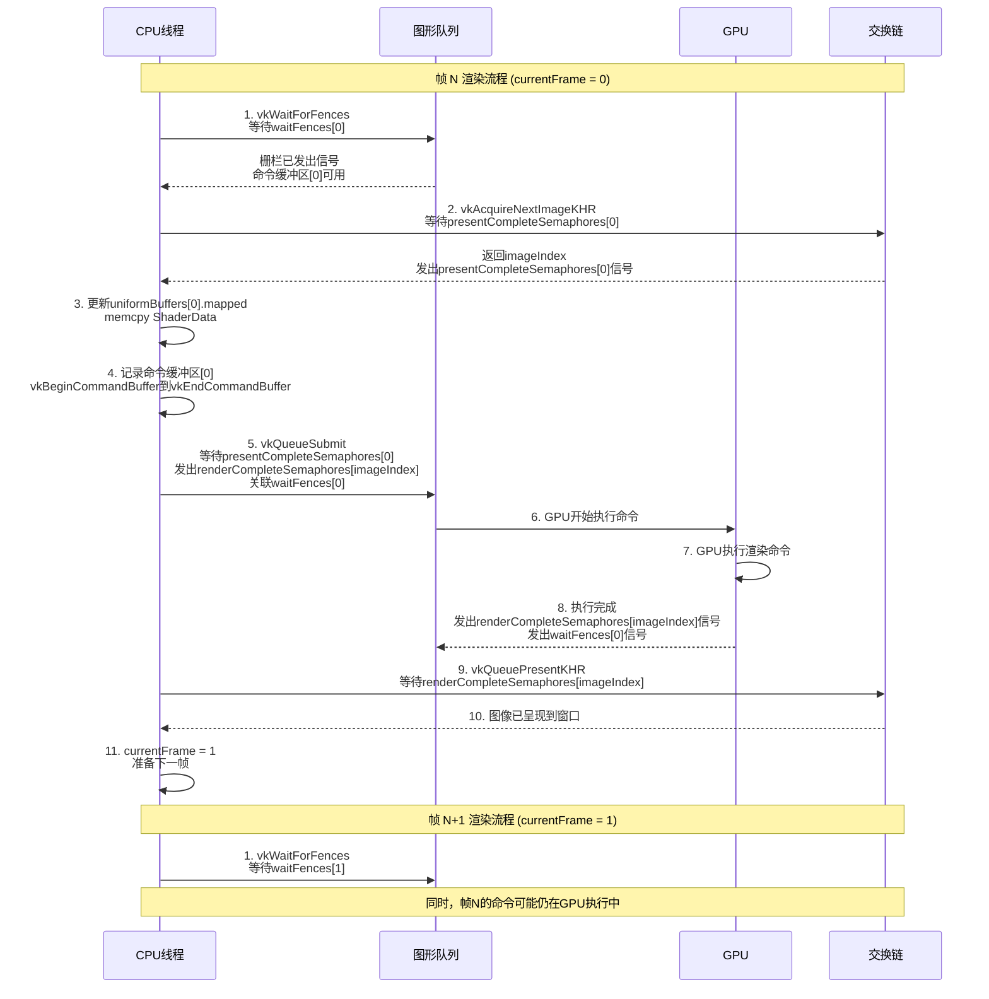

---

## 对象模型详解

### Vulkan 对象层次结构（基于 triangle.cpp）

以下图表整合了对象分类、关系和详细说明，展示了 triangle.cpp 中所有对象的完整信息：

```mermaid
graph TB
    subgraph "1. 实例级别对象（生命周期最长）"
        Instance[VkInstance<br/>Vulkan应用程序入口点<br/>管理全局状态和扩展]
        Surface[VkSurfaceKHR<br/>窗口系统集成表面<br/>连接操作系统窗口和Vulkan]
        DebugUtils[VkDebugUtilsMessengerEXT<br/>调试回调<br/>验证层消息输出]
        PhysicalDevice[VkPhysicalDevice<br/>物理GPU硬件<br/>只读查询对象]
        
        Instance --> Surface
        Instance --> DebugUtils
        Instance --> PhysicalDevice
    end
    
    subgraph "2. 设备级别对象（资源创建的基础）"
        Device[VkDevice<br/>逻辑设备<br/>所有资源都从它创建]
        Queue[VkQueue<br/>命令执行队列<br/>从设备获取，用于提交命令]
        QueueFamily[队列族索引<br/>用于创建命令池和交换链]
        
        PhysicalDevice --> Device
        Device --> Queue
        QueueFamily --> Queue
    end
    
    subgraph "3. 交换链系统（窗口显示）"
        SwapChain[VkSwapchainKHR<br/>交换链<br/>管理可呈现图像的双缓冲/三缓冲]
        SwapImages[交换链图像数组<br/>VkImage数组<br/>实际的图像资源，由交换链管理]
        SwapImageViews[交换链图像视图数组<br/>VkImageView数组<br/>用于在帧缓冲区中引用]
        SwapFormat[交换链格式<br/>VkFormat<br/>颜色格式，由交换链选择]
        
        Surface --> SwapChain
        Device --> SwapChain
        SwapChain --> SwapImages
        SwapImages --> SwapImageViews
        SwapChain --> SwapFormat
    end
    
    subgraph "4. 命令系统（命令记录和执行）"
        CommandPool[VkCommandPool<br/>命令池<br/>命令缓冲区的内存池，从队列族创建]
        CommandBuffers[命令缓冲区数组<br/>VkCommandBuffer数组<br/>MAX_CONCURRENT_FRAMES=2<br/>记录渲染命令，从命令池分配<br/>允许CPU和GPU并行工作]
        
        QueueFamily --> CommandPool
        Device --> CommandPool
        CommandPool --> CommandBuffers
    end
    
    subgraph "5. 缓冲区资源（顶点、索引、统一数据）"
        VertexBuffer[VkBuffer<br/>顶点缓冲区<br/>DEVICE_LOCAL<br/>设备本地内存，通过暂存缓冲区上传]
        IndexBuffer[VkBuffer<br/>索引缓冲区<br/>DEVICE_LOCAL<br/>设备本地内存]
        UniformBuffers[统一缓冲区数组<br/>VkBuffer数组<br/>HOST_VISIBLE和HOST_COHERENT<br/>MAX_CONCURRENT_FRAMES=2<br/>主机可见内存，每帧一个，支持动态更新]
        VertexMemory[VkDeviceMemory<br/>顶点缓冲区内存<br/>设备内存，所有缓冲区都需要绑定]
        IndexMemory[VkDeviceMemory<br/>索引缓冲区内存]
        UniformMemories[统一缓冲区内存数组<br/>VkDeviceMemory数组<br/>映射内存指针]
        
        Device --> VertexBuffer
        Device --> IndexBuffer
        Device --> UniformBuffers
        Device --> VertexMemory
        Device --> IndexMemory
        Device --> UniformMemories
        VertexBuffer --> VertexMemory
        IndexBuffer --> IndexMemory
        UniformBuffers --> UniformMemories
    end
    
    subgraph "6. 图像资源（深度模板）"
        DepthImage[VkImage<br/>深度模板图像<br/>DEVICE_LOCAL<br/>用于深度测试和模板测试]
        DepthMemory[VkDeviceMemory<br/>深度模板内存<br/>图像也需要绑定设备内存]
        DepthImageView[VkImageView<br/>深度模板图像视图<br/>用于在渲染通道中引用]
        
        Device --> DepthImage
        Device --> DepthMemory
        Device --> DepthImageView
        DepthImage --> DepthMemory
        DepthImage --> DepthImageView
    end
    
    subgraph "7. 描述符系统（着色器资源绑定）"
        DescriptorSetLayout[VkDescriptorSetLayout<br/>描述符集布局<br/>定义绑定结构<br/>描述符集的布局模板]
        DescriptorPool[VkDescriptorPool<br/>描述符池<br/>描述符集的内存池<br/>用于分配描述符集]
        DescriptorSets[描述符集数组<br/>VkDescriptorSet数组<br/>MAX_CONCURRENT_FRAMES=2<br/>实际的描述符集，绑定到统一缓冲区等资源]
        
        Device --> DescriptorSetLayout
        Device --> DescriptorPool
        Device --> DescriptorSets
        DescriptorSetLayout --> DescriptorPool
        DescriptorPool --> DescriptorSets
        UniformBuffers --> DescriptorSets
    end
    
    subgraph "8. 管线系统（渲染状态）"
        PipelineLayout[VkPipelineLayout<br/>管线布局<br/>引用描述符集布局]
        Pipeline[VkPipeline<br/>图形管线<br/>包含所有固定渲染状态]
        PipelineCache[VkPipelineCache<br/>管线缓存<br/>加速管线创建]
        ShaderModule[VkShaderModule<br/>着色器模块<br/>临时对象，创建管线后销毁]
        
        Device --> PipelineLayout
        Device --> Pipeline
        Device --> PipelineCache
        DescriptorSetLayout --> PipelineLayout
        PipelineLayout --> Pipeline
        PipelineCache --> Pipeline
        ShaderModule -.创建后销毁.-> Pipeline
    end
    
    subgraph "9. 渲染通道系统（渲染目标）"
        RenderPass[VkRenderPass<br/>渲染通道<br/>定义渲染通道的结构、附件和子通道]
        FrameBuffers[帧缓冲区数组<br/>VkFramebuffer数组<br/>每个交换链图像一个<br/>绑定交换链图像和深度图像]
        
        Device --> RenderPass
        SwapImageViews --> FrameBuffers
        DepthImageView --> FrameBuffers
        RenderPass --> FrameBuffers
    end
    
    subgraph "10. 同步对象（CPU-GPU同步）"
        WaitFences[等待栅栏数组<br/>VkFence数组<br/>MAX_CONCURRENT_FRAMES=2<br/>CPU-GPU同步，等待命令完成<br/>每帧等待→重置→等待]
        PresentCompleteSemaphores[呈现完成信号量数组<br/>VkSemaphore数组<br/>MAX_CONCURRENT_FRAMES=2<br/>GPU内部同步，等待图像可用于呈现]
        RenderCompleteSemaphores[渲染完成信号量数组<br/>VkSemaphore数组<br/>每个交换链图像一个<br/>GPU内部同步，等待渲染完成]
        
        Device --> WaitFences
        Device --> PresentCompleteSemaphores
        Device --> RenderCompleteSemaphores
    end
    
    %% 跨分类关系
    CommandBuffers --> RenderPass
    CommandBuffers --> FrameBuffers
    CommandBuffers --> Pipeline
    CommandBuffers --> PipelineLayout
    CommandBuffers --> DescriptorSets
    CommandBuffers --> VertexBuffer
    CommandBuffers --> IndexBuffer
    CommandBuffers --> Queue
    
    %% 样式
    style Instance fill:#FFE4B5
    style Device fill:#E0E0E0
    style Queue fill:#B0E0E6
    style Pipeline fill:#DDA0DD
    style SwapChain fill:#90EE90
    style RenderPass fill:#87CEEB
    style CommandPool fill:#FFB6C1
    style DescriptorPool fill:#F0E68C
```

### 对象创建顺序（基于 triangle.cpp）

以下时序图展示了 triangle.cpp 中所有对象的创建顺序：

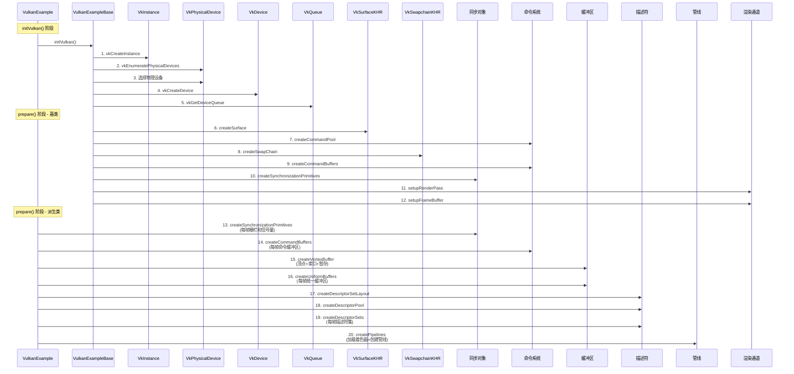

### 对象分类快速参考表

| 分类 | 对象 | 说明 | 生命周期 | 创建时机 |
|------|------|------|---------|---------|
| **1. 实例级别** | VkInstance | Vulkan应用程序入口点，管理全局状态 | 程序生命周期 | initVulkan() |
| | VkSurfaceKHR | 窗口系统集成表面，连接窗口和Vulkan | 程序生命周期 | prepare() |
| | VkDebugUtilsMessengerEXT | 调试回调，验证层消息输出 | 程序生命周期 | initVulkan() |
| | VkPhysicalDevice | 物理GPU硬件，只读查询 | 查询对象 | initVulkan() |
| **2. 设备级别** | VkDevice | 逻辑设备，所有资源创建的基础 | 程序生命周期 | initVulkan() |
| | VkQueue | 命令执行队列，用于提交命令 | 随设备销毁 | initVulkan() |
| | 队列族索引 | 用于创建命令池和交换链 | 查询值 | initVulkan() |
| **3. 交换链系统** | VkSwapchainKHR | 管理可呈现图像的双缓冲/三缓冲 | 程序生命周期 | prepare() |
| | 交换链图像 | 实际的图像资源，由交换链管理 | 随交换链销毁 | prepare() |
| | 交换链图像视图 | 用于在帧缓冲区中引用 | 程序生命周期 | prepare() |
| **4. 命令系统** | VkCommandPool | 命令缓冲区的内存池 | 程序生命周期 | prepare() |
| | VkCommandBuffer | 记录渲染命令，MAX_CONCURRENT_FRAMES=2 | 每帧重置使用 | prepare() |
| **5. 缓冲区资源** | 顶点/索引缓冲区 | DEVICE_LOCAL，通过暂存缓冲区上传 | 程序生命周期 | prepare() |
| | 统一缓冲区 | HOST_VISIBLE，每帧更新，MAX_CONCURRENT_FRAMES=2 | 程序生命周期 | prepare() |
| | VkDeviceMemory | 设备内存，所有缓冲区都需要绑定 | 程序生命周期 | prepare() |
| **6. 图像资源** | 深度模板图像 | DEVICE_LOCAL，用于深度测试 | 程序生命周期 | prepare() |
| | 深度模板图像视图 | 用于在渲染通道中引用 | 程序生命周期 | prepare() |
| **7. 描述符系统** | VkDescriptorSetLayout | 描述符集布局模板，定义绑定结构 | 程序生命周期 | prepare() |
| | VkDescriptorPool | 描述符集的内存池 | 程序生命周期 | prepare() |
| | VkDescriptorSet | 实际的描述符集，MAX_CONCURRENT_FRAMES=2 | 程序生命周期 | prepare() |
| **8. 管线系统** | VkPipelineLayout | 管线布局，引用描述符集布局 | 程序生命周期 | prepare() |
| | VkPipeline | 图形管线，包含所有固定渲染状态 | 程序生命周期 | prepare() |
| | VkPipelineCache | 管线缓存，加速管线创建 | 程序生命周期 | prepare() |
| | VkShaderModule | 着色器模块，临时对象 | 创建后销毁 | prepare() |
| **9. 渲染通道系统** | VkRenderPass | 定义渲染通道的结构、附件和子通道 | 程序生命周期 | prepare() |
| | VkFramebuffer | 帧缓冲区，绑定交换链图像和深度图像 | 程序生命周期 | prepare() |
| **10. 同步对象** | VkFence | CPU-GPU同步，MAX_CONCURRENT_FRAMES=2 | 程序生命周期 | prepare() |
| | VkSemaphore | GPU内部同步，呈现完成和渲染完成 | 程序生命周期 | prepare() |

---

## 渲染管线系统（基于 triangle.cpp）

### 图形管线阶段（triangle.cpp 使用的阶段）

triangle.cpp 示例使用的图形管线阶段：

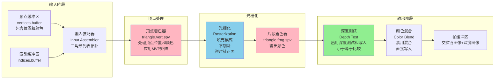

**注意**：triangle.cpp 只使用了顶点着色器和片段着色器，没有使用曲面细分、几何着色器等可选阶段。

### 管线创建流程（基于 triangle.cpp 的 createPipelines()）

以下流程图展示了 triangle.cpp 中 `createPipelines()` 函数的完整执行流程：

```mermaid
flowchart TD
    Start([createPipelines开始]) --> CreatePipeLayout[1. 创建管线布局<br/>vkCreatePipelineLayout<br/>引用descriptorSetLayout<br/>setLayoutCount=1]
    
    CreatePipeLayout --> SetupPipelineCI[2. 设置图形管线创建信息<br/>VkGraphicsPipelineCreateInfo<br/>- layout: pipelineLayout<br/>- renderPass: renderPass]
    
    SetupPipelineCI --> SetupInputAssembly[3. 设置输入装配状态<br/>VkPipelineInputAssemblyStateCreateInfo<br/>topology: TRIANGLE_LIST<br/>三角形列表]
    
    SetupInputAssembly --> SetupRasterization[4. 设置光栅化状态<br/>VkPipelineRasterizationStateCreateInfo<br/>- polygonMode: FILL填充<br/>- cullMode: NONE不剔除<br/>- frontFace: COUNTER_CLOCKWISE逆时针<br/>- lineWidth: 1.0]
    
    SetupRasterization --> SetupColorBlend[5. 设置颜色混合状态<br/>VkPipelineColorBlendStateCreateInfo<br/>- colorWriteMask: 0xf全部启用<br/>- blendEnable: FALSE禁用混合<br/>attachmentCount: 1]
    
    SetupColorBlend --> SetupViewport[6. 设置视口状态<br/>VkPipelineViewportStateCreateInfo<br/>viewportCount: 1<br/>scissorCount: 1<br/>注意：被动态状态覆盖]
    
    SetupViewport --> SetupDynamicState[7. 设置动态状态<br/>VkPipelineDynamicStateCreateInfo<br/>- VK_DYNAMIC_STATE_VIEWPORT<br/>- VK_DYNAMIC_STATE_SCISSOR<br/>允许在命令缓冲区中动态设置]
    
    SetupDynamicState --> SetupDepthStencil[8. 设置深度模板状态<br/>VkPipelineDepthStencilStateCreateInfo<br/>- depthTestEnable: TRUE<br/>- depthWriteEnable: TRUE<br/>- depthCompareOp: LESS_OR_EQUAL<br/>- stencilTestEnable: FALSE]
    
    SetupDepthStencil --> SetupMultisample[9. 设置多重采样状态<br/>VkPipelineMultisampleStateCreateInfo<br/>rasterizationSamples: 1_BIT<br/>单采样，不使用抗锯齿]
    
    SetupMultisample --> SetupVertexInput[10. 设置顶点输入状态<br/>VkPipelineVertexInputStateCreateInfo]
    
    subgraph "顶点输入详细设置"
        SetupVertexInput --> SetupVertexBinding[10.1 设置顶点绑定<br/>VkVertexInputBindingDescription<br/>- binding: 0<br/>- stride: sizeofVertex<br/>- inputRate: VERTEX]
        SetupVertexBinding --> SetupVertexAttribs[10.2 设置顶点属性<br/>VkVertexInputAttributeDescription数组<br/>属性0: position位置<br/>- location: 0<br/>- format: R32G32B32_SFLOAT<br/>- offset: offsetofposition<br/>属性1: color颜色<br/>- location: 1<br/>- format: R32G32B32_SFLOAT<br/>- offset: offsetofcolor]
    end
    
    SetupVertexAttribs --> LoadShaders[11. 加载着色器<br/>loadSPIRVShader]
    
    subgraph "着色器加载"
        LoadShaders --> LoadVertexShader[11.1 加载顶点着色器<br/>triangle.vert.spv<br/>VK_SHADER_STAGE_VERTEX_BIT]
        LoadVertexShader --> CreateVertexModule[11.2 创建顶点着色器模块<br/>vkCreateShaderModule]
        CreateVertexModule --> LoadFragShader[11.3 加载片段着色器<br/>triangle.frag.spv<br/>VK_SHADER_STAGE_FRAGMENT_BIT]
        LoadFragShader --> CreateFragModule[11.4 创建片段着色器模块<br/>vkCreateShaderModule]
    end
    
    CreateFragModule --> SetupShaderStages[12. 设置着色器阶段信息<br/>VkPipelineShaderStageCreateInfo数组<br/>- stage: VERTEX_BIT<br/>- module: vertexShaderModule<br/>- pName: main<br/>- stage: FRAGMENT_BIT<br/>- module: fragmentShaderModule<br/>- pName: main]
    
    SetupShaderStages --> AssignStates[13. 分配所有状态到管线创建信息<br/>pipelineCI.pVertexInputState<br/>pipelineCI.pInputAssemblyState<br/>pipelineCI.pRasterizationState<br/>pipelineCI.pColorBlendState<br/>pipelineCI.pMultisampleState<br/>pipelineCI.pViewportState<br/>pipelineCI.pDepthStencilState<br/>pipelineCI.pDynamicState<br/>pipelineCI.pStages]
    
    AssignStates --> CreateGraphicsPipeline[14. 创建图形管线<br/>vkCreateGraphicsPipelines<br/>使用pipelineCache<br/>引用renderPass和pipelineLayout]
    
    CreateGraphicsPipeline --> DestroyShaderModules[15. 销毁着色器模块<br/>vkDestroyShaderModule<br/>顶点和片段着色器模块<br/>创建后不再需要]
    
    DestroyShaderModules --> End([管线创建完成])
    
    style Start fill:#90EE90
    style End fill:#90EE90
    style CreateGraphicsPipeline fill:#87CEEB
    style LoadShaders fill:#FFB6C1
    style DestroyShaderModules fill:#DDA0DD
```

### 管线状态详细说明（基于 triangle.cpp）

#### 1. 顶点输入状态
- **绑定描述**：1个绑定，绑定点0，步长为 `sizeof(Vertex)`，输入速率为每个顶点
- **属性描述**：2个属性
  - 属性0（位置）：location=0，格式 `R32G32B32_SFLOAT`，偏移量 `offsetof(Vertex, position)`
  - 属性1（颜色）：location=1，格式 `R32G32B32_SFLOAT`，偏移量 `offsetof(Vertex, color)`

#### 2. 输入装配状态
- **拓扑类型**：`VK_PRIMITIVE_TOPOLOGY_TRIANGLE_LIST`（三角形列表）

#### 3. 光栅化状态
- **多边形模式**：`VK_POLYGON_MODE_FILL`（填充）
- **剔除模式**：`VK_CULL_MODE_NONE`（不剔除）
- **正面朝向**：`VK_FRONT_FACE_COUNTER_CLOCKWISE`（逆时针）
- **线宽**：1.0

#### 4. 视口状态
- **视口数量**：1
- **裁剪矩形数量**：1
- **注意**：实际值由动态状态在命令缓冲区中设置

#### 5. 动态状态
- `VK_DYNAMIC_STATE_VIEWPORT`（动态视口）
- `VK_DYNAMIC_STATE_SCISSOR`（动态裁剪矩形）

#### 6. 光栅化状态（多重采样）
- **采样数**：`VK_SAMPLE_COUNT_1_BIT`（单采样，不使用抗锯齿）

#### 7. 深度模板状态
- **深度测试**：启用
- **深度写入**：启用
- **深度比较操作**：`VK_COMPARE_OP_LESS_OR_EQUAL`（小于或等于）
- **模板测试**：禁用

#### 8. 颜色混合状态
- **混合启用**：禁用
- **颜色写入掩码**：0xf（RGBA全部启用）

#### 9. 着色器阶段
- **顶点着色器**：`triangle.vert.spv`，入口点 `main`
- **片段着色器**：`triangle.frag.spv`，入口点 `main`

### 管线对象关系

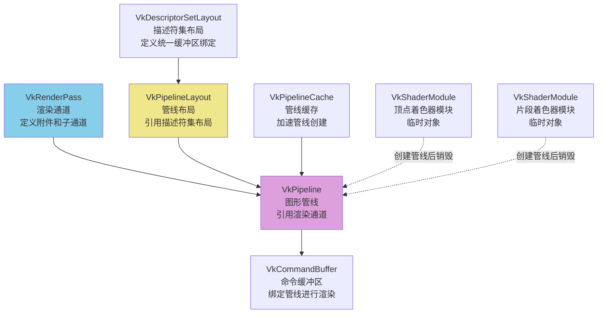

### 渲染通道与管线的关系（基于 triangle.cpp）

在 triangle.cpp 中，渲染通道在基类的 `setupRenderPass()` 中创建，管线在派生类的 `createPipelines()` 中创建并引用渲染通道：

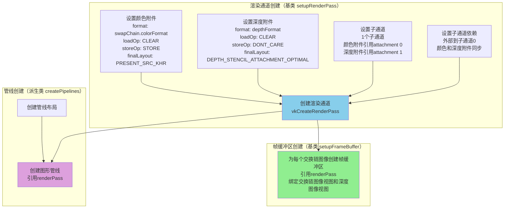

### 渲染通道详细配置（基于 triangle.cpp）

#### 颜色附件配置
- **格式**：`swapChain.colorFormat`（由交换链选择）
- **采样数**：`VK_SAMPLE_COUNT_1_BIT`（单采样）
- **加载操作**：`VK_ATTACHMENT_LOAD_OP_CLEAR`（清除）
- **存储操作**：`VK_ATTACHMENT_STORE_OP_STORE`（存储，用于显示）
- **初始布局**：`VK_IMAGE_LAYOUT_UNDEFINED`
- **最终布局**：`VK_IMAGE_LAYOUT_PRESENT_SRC_KHR`（用于呈现）

#### 深度附件配置
- **格式**：`depthFormat`（由基类选择）
- **采样数**：`VK_SAMPLE_COUNT_1_BIT`（单采样）
- **加载操作**：`VK_ATTACHMENT_LOAD_OP_CLEAR`（清除）
- **存储操作**：`VK_ATTACHMENT_STORE_OP_DONT_CARE`（不需要，可能提升性能）
- **初始布局**：`VK_IMAGE_LAYOUT_UNDEFINED`
- **最终布局**：`VK_IMAGE_LAYOUT_DEPTH_STENCIL_ATTACHMENT_OPTIMAL`

#### 子通道配置
- **子通道数量**：1
- **颜色附件引用**：attachment 0，布局 `COLOR_ATTACHMENT_OPTIMAL`
- **深度附件引用**：attachment 1，布局 `DEPTH_STENCIL_ATTACHMENT_OPTIMAL`
- **输入附件**：无
- **保留附件**：无
- **解析附件**：无

### 管线在渲染循环中的使用（基于 triangle.cpp）

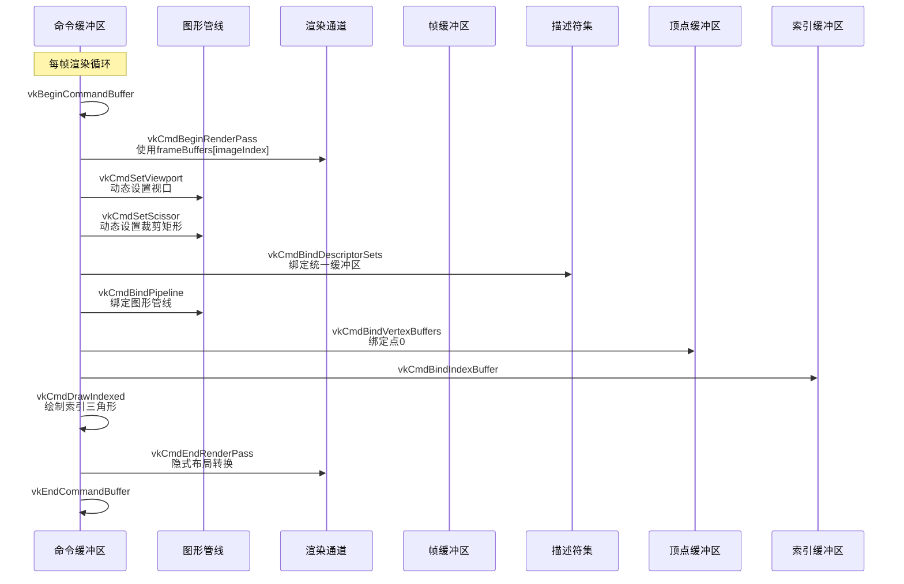

---

## 内存管理系统（基于 triangle.cpp）

triangle.cpp 中使用了三种不同的内存管理模式，针对不同的资源类型选择最优的内存策略。

### 内存类型与使用场景

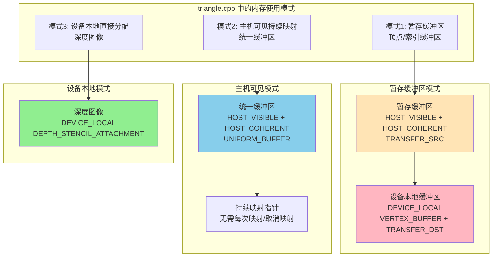

### 模式1：暂存缓冲区模式（顶点/索引缓冲区）

用于静态几何数据，需要高性能 GPU 访问。使用暂存缓冲区将数据从 CPU 传输到 GPU 设备本地内存。

**完整流程：**

```mermaid
flowchart TD
    Start([createVertexBuffer开始]) --> CreateStagingBuf[1. 创建暂存缓冲区<br/>usage: TRANSFER_SRC<br/>HOST_VISIBLE + HOST_COHERENT]
    CreateStagingBuf --> QueryStagingMem[2. 查询暂存缓冲区内存需求<br/>vkGetBufferMemoryRequirements]
    QueryStagingMem --> AllocStagingMem[3. 分配暂存内存<br/>vkAllocateMemory<br/>HOST_VISIBLE + HOST_COHERENT]
    AllocStagingMem --> BindStagingMem[4. 绑定暂存内存<br/>vkBindBufferMemory]
    BindStagingMem --> MapStaging[5. 映射暂存内存<br/>vkMapMemory]
    MapStaging --> CopyData[6. 复制数据到映射内存<br/>memcpy]
    CopyData --> UnmapStaging[7. 取消映射<br/>vkUnmapMemory]
    UnmapStaging --> CreateDeviceBuf[8. 创建设备本地缓冲区<br/>usage: VERTEX_BUFFER + TRANSFER_DST<br/>DEVICE_LOCAL]
    CreateDeviceBuf --> QueryDeviceMem[9. 查询设备缓冲区内存需求<br/>vkGetBufferMemoryRequirements]
    QueryDeviceMem --> AllocDeviceMem[10. 分配设备本地内存<br/>vkAllocateMemory<br/>DEVICE_LOCAL]
    AllocDeviceMem --> BindDeviceMem[11. 绑定设备内存<br/>vkBindBufferMemory]
    BindDeviceMem --> AllocCopyCmd[12. 分配复制命令缓冲区<br/>vkAllocateCommandBuffers]
    AllocCopyCmd --> BeginCopyCmd[13. 开始记录命令<br/>vkBeginCommandBuffer]
    BeginCopyCmd --> RecordCopy[14. 记录复制命令<br/>vkCmdCopyBuffer<br/>暂存->设备]
    RecordCopy --> EndCopyCmd[15. 结束记录<br/>vkEndCommandBuffer]
    EndCopyCmd --> CreateFence[16. 创建复制栅栏<br/>vkCreateFence]
    CreateFence --> SubmitCopy[17. 提交复制命令<br/>vkQueueSubmit]
    SubmitCopy --> WaitCopy[18. 等待复制完成<br/>vkWaitForFences]
    WaitCopy --> DestroyFence[19. 销毁复制栅栏<br/>vkDestroyFence]
    DestroyFence --> FreeCopyCmd[20. 释放复制命令缓冲区<br/>vkFreeCommandBuffers]
    FreeCopyCmd --> DestroyStaging[21. 销毁暂存缓冲区<br/>vkDestroyBuffer<br/>vkFreeMemory]
    DestroyStaging --> End([缓冲区创建完成<br/>设备本地缓冲区可用于渲染])
    
    style CreateStagingBuf fill:#FFE4B5
    style CreateDeviceBuf fill:#FFB6C1
    style RecordCopy fill:#DDA0DD
    style WaitCopy fill:#87CEEB
```

**关键特点：**
- 暂存缓冲区：HOST_VISIBLE + HOST_COHERENT，允许 CPU 直接写入
- 设备缓冲区：DEVICE_LOCAL，GPU 访问最快
- 使用命令缓冲区复制，由 GPU DMA 执行，效率高
- 复制完成后销毁暂存缓冲区，释放临时内存
- 适用于：顶点数据、索引数据等静态几何资源

### 模式2：主机可见持续映射模式（统一缓冲区）

用于需要每帧更新的数据（如 MVP 矩阵），CPU 需要频繁写入。使用主机可见内存并持续映射。

**完整流程：**

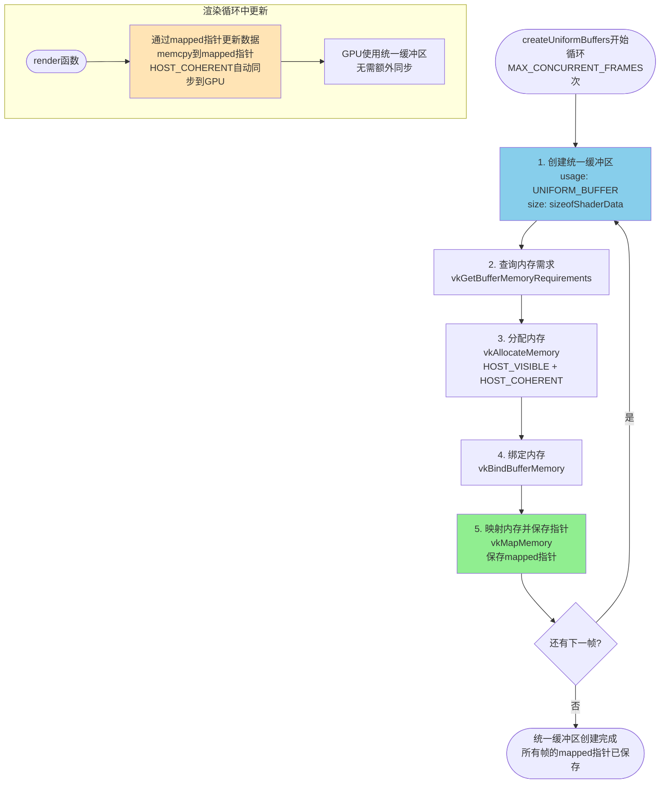

**关键特点：**
- HOST_VISIBLE + HOST_COHERENT：CPU 可直接写入，自动同步到 GPU
- 持续映射：初始化时映射一次，保存指针，程序运行期间不再取消映射
- 每帧更新：在 render() 函数中通过映射指针直接写入数据
- 多帧并发：MAX_CONCURRENT_FRAMES 个缓冲区，每帧使用不同的缓冲区避免冲突
- 无需额外同步：HOST_COHERENT 保证写入立即可见
- 适用于：统一缓冲区、频繁更新的动态数据

### 模式3：设备本地直接分配模式（深度图像）

用于只由 GPU 使用的资源，不需要 CPU 访问。直接分配设备本地内存。

**完整流程：**

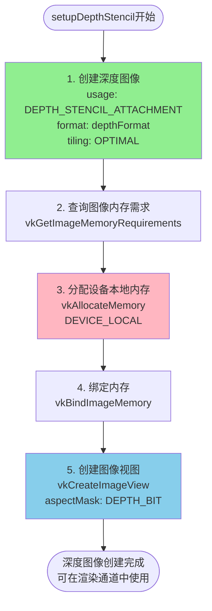

**关键特点：**
- DEVICE_LOCAL：GPU 专用内存，访问速度最快
- 无需 CPU 访问：深度图像完全由 GPU 管理
- 无需映射：CPU 不需要写入或读取
- 适用于：深度图像、纹理（GPU 生成）、渲染目标

### 内存类型选择策略总结

| 资源类型 | 内存类型 | 映射方式 | 更新频率 | triangle.cpp 中的应用 |
|---------|---------|---------|---------|---------------------|
| **顶点/索引缓冲区** | 暂存：HOST_VISIBLE + HOST_COHERENT<br/>最终：DEVICE_LOCAL | 临时映射暂存缓冲区 | 初始化一次 | vertices.buffer, indices.buffer |
| **统一缓冲区** | HOST_VISIBLE + HOST_COHERENT | 持续映射 | 每帧更新 | uniformBuffers[].buffer |
| **深度图像** | DEVICE_LOCAL | 不映射 | 不更新（GPU管理） | depthStencil.image |

### 内存获取函数（getMemoryTypeIndex）

triangle.cpp 使用 `getMemoryTypeIndex()` 函数根据内存类型位掩码和属性标志查找合适的内存类型索引：

- 输入：`memoryTypeBits`（从 vkGetBufferMemoryRequirements 获取）
- 输入：`properties`（请求的内存属性标志）
- 输出：匹配的内存类型索引
- 逻辑：遍历所有内存类型，找到同时满足类型位掩码和属性标志的内存类型

---

---

## 命令管理系统（基于 triangle.cpp）

triangle.cpp 中的命令管理分为三个场景：初始化时的命令池和命令缓冲区创建、资源上传时的临时复制命令缓冲区、以及渲染循环中的命令记录和提交。

### 命令池和命令缓冲区创建（createCommandBuffers）

**执行时机**：在 `prepare()` 函数中，创建渲染相关的命令缓冲区。

**完整流程：**

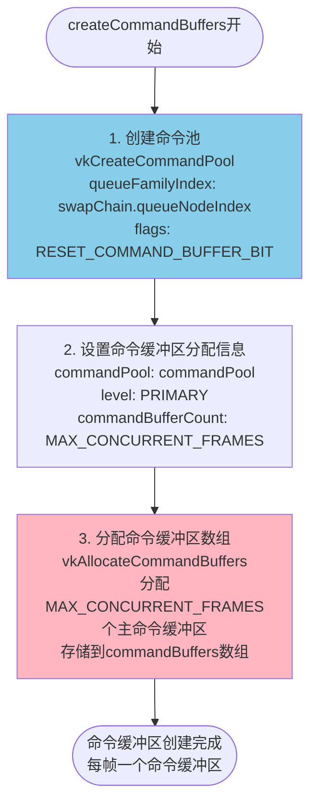

**关键特点：**
- 命令池使用 `RESET_COMMAND_BUFFER_BIT` 标志，允许重置命令缓冲区
- 从同一个命令池分配 MAX_CONCURRENT_FRAMES（2）个主命令缓冲区
- 每个命令缓冲区对应一帧，实现帧重叠渲染
- 命令缓冲区级别为 PRIMARY（主命令缓冲区），可以直接提交到队列

### 临时复制命令缓冲区（createVertexBuffer 中使用）

**执行时机**：在 `createVertexBuffer()` 函数中，用于将暂存缓冲区的数据复制到设备本地缓冲区。

**完整流程：**

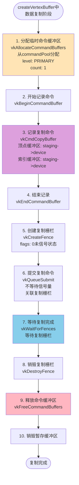

**关键特点：**
- 临时分配的命令缓冲区，使用后立即释放
- 记录两个复制命令：顶点缓冲区和索引缓冲区
- 使用栅栏同步，确保复制完成后再销毁暂存缓冲区
- 一次性操作，不参与渲染循环

### 渲染循环中的命令记录和提交（render 函数中）

**执行时机**：每帧在 `render()` 函数中执行，完整的命令记录、提交和呈现流程。

**完整流程：**

```mermaid
flowchart TD
    Start([render函数开始]) --> WaitFence["1. 等待栅栏<br/>vkWaitForFences<br/>等待waitFences(currentFrame)"]
    WaitFence --> ResetFence["2. 重置栅栏<br/>vkResetFences<br/>重置waitFences(currentFrame)"]
    ResetFence --> AcquireImage["3. 获取交换链图像<br/>vkAcquireNextImageKHR<br/>等待presentCompleteSemaphores(currentFrame)<br/>返回imageIndex"]
    AcquireImage --> UpdateUBO["4. 更新统一缓冲区<br/>memcpy到uniformBuffers(currentFrame).mapped"]
    UpdateUBO --> ResetCmdBuf["5. 重置命令缓冲区<br/>vkResetCommandBuffer<br/>commandBuffers(currentFrame)"]
    ResetCmdBuf --> BeginCmdBuf["6. 开始记录命令<br/>vkBeginCommandBuffer<br/>commandBuffers(currentFrame)"]
    BeginCmdBuf --> BeginRP["7. 开始渲染通道<br/>vkCmdBeginRenderPass<br/>framebuffer: frameBuffers(imageIndex)"]
    BeginRP --> SetViewport["8. 设置动态视口<br/>vkCmdSetViewport"]
    SetViewport --> SetScissor["9. 设置动态裁剪矩形<br/>vkCmdSetScissor"]
    SetScissor --> BindDescSet["10. 绑定描述符集<br/>vkCmdBindDescriptorSets<br/>uniformBuffers(currentFrame).descriptorSet"]
    BindDescSet --> BindPipeline["11. 绑定图形管线<br/>vkCmdBindPipeline"]
    BindPipeline --> BindVertexBuf["12. 绑定顶点缓冲区<br/>vkCmdBindVertexBuffers<br/>vertices.buffer"]
    BindVertexBuf --> BindIndexBuf["13. 绑定索引缓冲区<br/>vkCmdBindIndexBuffer<br/>indices.buffer"]
    BindIndexBuf --> Draw["14. 绘制索引图元<br/>vkCmdDrawIndexed<br/>indices.count个索引"]
    Draw --> EndRP["15. 结束渲染通道<br/>vkCmdEndRenderPass<br/>隐式布局转换到PRESENT_SRC_KHR"]
    EndRP --> EndCmdBuf["16. 结束记录命令<br/>vkEndCommandBuffer"]
    EndCmdBuf --> SetupSubmit["17. 设置提交信息<br/>VkSubmitInfo<br/>waitSemaphore: presentCompleteSemaphores(currentFrame)<br/>waitStageMask: COLOR_ATTACHMENT_OUTPUT<br/>signalSemaphore: renderCompleteSemaphores(imageIndex)<br/>fence: waitFences(currentFrame)"]
    SetupSubmit --> QueueSubmit["18. 提交到队列<br/>vkQueueSubmit<br/>等待presentCompleteSemaphore<br/>发出renderCompleteSemaphore<br/>关联waitFences(currentFrame)"]
    QueueSubmit --> SetupPresent["19. 设置呈现信息<br/>VkPresentInfoKHR<br/>waitSemaphore: renderCompleteSemaphores(imageIndex)"]
    SetupPresent --> QueuePresent["20. 呈现图像<br/>vkQueuePresentKHR<br/>等待renderCompleteSemaphore"]
    QueuePresent --> UpdateFrame["21. 更新当前帧索引<br/>currentFrame = currentFrame + 1<br/>模MAX_CONCURRENT_FRAMES"]
    UpdateFrame --> End([render函数结束<br/>等待下一帧])
    
    style WaitFence fill:#87CEEB
    style QueueSubmit fill:#FFB6C1
    style QueuePresent fill:#FFE4B5
```

**命令记录顺序（步骤7-14）：**


**关键特点：**
- 每帧使用 `commandBuffers[currentFrame]`，实现帧重叠
- 使用 `vkResetCommandBuffer` 重置命令缓冲区，而不是重新分配
- 同步机制：使用栅栏等待上一帧完成，使用信号量协调交换链和渲染
- 命令记录顺序：渲染通道 -> 动态状态 -> 资源绑定 -> 绘制 -> 结束渲染通道
- 提交时等待 `presentCompleteSemaphores[currentFrame]`，发出 `renderCompleteSemaphores[imageIndex]`
- 呈现时等待 `renderCompleteSemaphores[imageIndex]`，确保渲染完成后才呈现

### 命令缓冲区生命周期

在 triangle.cpp 中，命令缓冲区有两种生命周期模式：

**模式1：持久命令缓冲区（渲染命令缓冲区）**

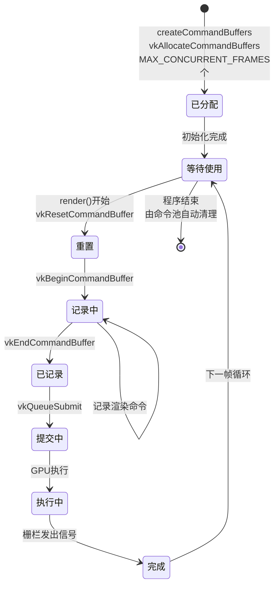

**模式2：临时命令缓冲区（复制命令缓冲区）**

```mermaid
stateDiagram-v2
    [*] --> 已分配: createVertexBuffer中<br/>vkAllocateCommandBuffers
    已分配 --> 记录中: vkBeginCommandBuffer
    记录中 --> 已记录: vkEndCommandBuffer<br/>记录复制命令
    已记录 --> 提交中: vkQueueSubmit
    提交中 --> 执行中: GPU执行
    执行中 --> 完成: vkWaitForFences
    完成 --> [*]: vkFreeCommandBuffers<br/>立即释放
```

### 命令管理总结

| 命令缓冲区类型 | 创建时机 | 生命周期 | 用途 | 数量 |
|--------------|---------|---------|------|------|
| **渲染命令缓冲区** | prepare() | 程序运行期间 | 每帧记录渲染命令 | MAX_CONCURRENT_FRAMES（2） |
| **复制命令缓冲区** | createVertexBuffer() | 临时，立即释放 | 暂存缓冲区到设备缓冲区的复制 | 1（临时） |

**命令池管理：**
- 单个命令池：`commandPool`，从交换链的队列族创建
- 标志：`RESET_COMMAND_BUFFER_BIT`，允许重置命令缓冲区
- 所有命令缓冲区（渲染和临时）都从同一个命令池分配

**多帧并发策略：**
- 使用 `currentFrame` 索引循环选择命令缓冲区（0 和 1 交替）
- 使用栅栏确保命令缓冲区在再次使用前已完成执行
- CPU 和 GPU 可以并行工作：CPU 记录下一帧时，GPU 执行上一帧

---

### 动态渲染 (Dynamic Rendering)

动态渲染是 Vulkan 1.3 的核心特性，简化了渲染流程，不再需要预先创建渲染通道和帧缓冲区。

```mermaid
graph TB
    subgraph "传统渲染通道方式"
        CreateRP[创建渲染通道<br/>VkRenderPass]
        CreateFB[创建帧缓冲区<br/>VkFramebuffer]
        BeginRP[vkCmdBeginRenderPass]
        Draw1[绘制]
        EndRP[vkCmdEndRenderPass]
        
        CreateRP --> CreateFB
        CreateFB --> BeginRP
        BeginRP --> Draw1
        Draw1 --> EndRP
    end
    
    subgraph "动态渲染方式"
        SetupAttach[设置附件信息<br/>VkRenderingAttachmentInfo]
        BeginRend[vkCmdBeginRendering]
        Draw2[绘制]
        EndRend[vkCmdEndRendering]
        
        SetupAttach --> BeginRend
        BeginRend --> Draw2
        Draw2 --> EndRend
    end
    
    style BeginRend fill:#90EE90
    style EndRend fill:#90EE90
```

### 同步 2 (Synchronization2)

同步 2 提供了更灵活和强大的同步机制。

```mermaid
graph LR
    subgraph "传统同步"
        OldBarrier[VkPipelineBarrier]
        OldWait[VkWaitSemaphores]
    end
    
    subgraph "同步 2"
        NewBarrier[VkMemoryBarrier2]
        NewWait[VkSemaphoreSubmitInfo]
        Timeline[时间线信号量]
    end
    
    OldBarrier --> NewBarrier
    OldWait --> NewWait
    NewWait --> Timeline
    
    style NewBarrier fill:#90EE90
    style Timeline fill:#90EE90
```

### 特性对比表

| 特性 | Vulkan 1.0-1.2 | Vulkan 1.3 |
|-----|---------------|-----------|
| **渲染方式** | 渲染通道 + 帧缓冲区 | 动态渲染 |
| **同步机制** | 基础同步原语 | 同步 2 |
| **管线创建** | 需要渲染通道 | 不需要渲染通道 |
| **API 复杂度** | 较高 | 较低 |
| **性能** | 优秀 | 优秀 |

---

## 总结

### Vulkan 框架核心概念

1. **显式资源管理**: 所有资源都需要显式创建和销毁
2. **命令驱动**: 通过命令缓冲区记录和提交命令
3. **多线程友好**: 支持多线程命令缓冲区记录
4. **精确同步**: 提供多种同步原语控制执行顺序
5. **管线状态对象**: 所有状态在管线创建时确定

### 学习建议

1. **从基础开始**: 先理解实例、设备、队列的创建
2. **掌握同步**: 理解信号量、栅栏的使用场景
3. **熟悉管线**: 理解图形管线的各个阶段
4. **实践项目**: 通过实际项目加深理解
5. **参考示例**: 参考 `trianglevulkan13` 等示例代码

### 相关资源

- [Vulkan 官方规范](https://www.khronos.org/vulkan/)
- [Vulkan 教程](https://vulkan-tutorial.com/)
- [Vulkan 示例代码库](https://github.com/KhronosGroup/Vulkan-Samples)

---

## 附录：关键 API 速查

### 初始化相关
- `vkCreateInstance()` - 创建 Vulkan 实例
- `vkEnumeratePhysicalDevices()` - 枚举物理设备
- `vkCreateDevice()` - 创建逻辑设备
- `vkGetDeviceQueue()` - 获取队列

### 资源创建
- `vkCreateBuffer()` - 创建缓冲区
- `vkCreateImage()` - 创建图像
- `vkAllocateMemory()` - 分配内存
- `vkBindBufferMemory()` - 绑定缓冲区内存

### 管线相关
- `vkCreatePipelineLayout()` - 创建管线布局
- `vkCreateGraphicsPipelines()` - 创建图形管线
- `vkCreateDescriptorSetLayout()` - 创建描述符集布局
- `vkCreateDescriptorPool()` - 创建描述符池

### 命令相关
- `vkCreateCommandPool()` - 创建命令池
- `vkAllocateCommandBuffers()` - 分配命令缓冲区
- `vkBeginCommandBuffer()` - 开始记录命令
- `vkEndCommandBuffer()` - 结束记录命令
- `vkQueueSubmit()` - 提交命令到队列

### 同步相关
- `vkCreateSemaphore()` - 创建信号量
- `vkCreateFence()` - 创建栅栏
- `vkWaitForFences()` - 等待栅栏
- `vkQueuePresentKHR()` - 呈现图像

---

*文档版本: 1.0*  
*最后更新: 2024*

