# Vulkan 框架模型文档

## 目录
1. [概述](#概述)
2. [Vulkan 架构层次](#vulkan-架构层次)
3. [初始化流程](#初始化流程)
4. [对象模型](#对象模型)
5. [渲染管线](#渲染管线)
6. [内存管理](#内存管理)
7. [同步机制](#同步机制)
8. [命令提交流程](#命令提交流程)
9. [Vulkan 1.3 新特性](#vulkan-13-新特性)

---

## 概述

Vulkan 是一个低级别的图形和计算 API，提供了对现代 GPU 的直接控制。与 OpenGL 不同，Vulkan 采用显式资源管理和多线程设计，为开发者提供了更高的性能和更精确的控制。

### Vulkan 的核心特点

- **显式控制**: 开发者需要显式管理所有资源
- **多线程友好**: 支持多线程命令缓冲区记录
- **低开销**: 最小化驱动开销
- **跨平台**: 支持 Windows、Linux、Android、macOS 等

---

## Vulkan 架构层次

### 整体架构图

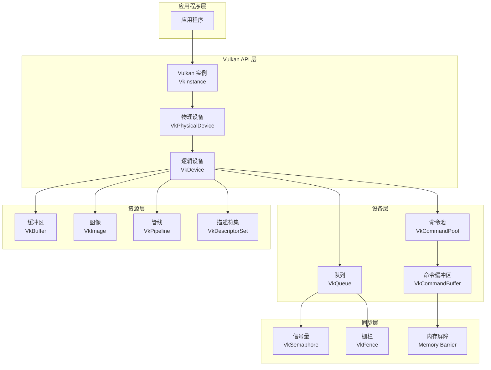

### 对象创建顺序

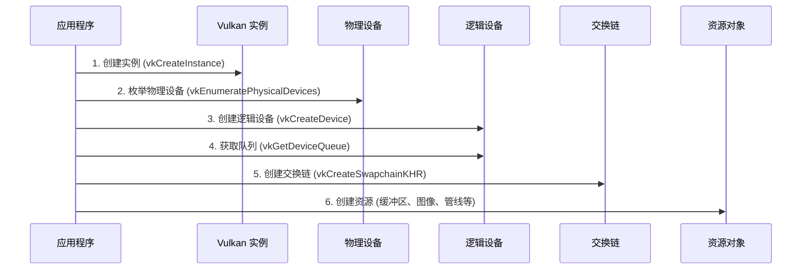

---

## 初始化流程

### 详细初始化流程图

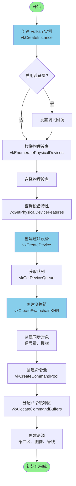

### 初始化代码示例

```cpp
// 1. 创建实例
VkInstance instance;
VkInstanceCreateInfo createInfo{};
vkCreateInstance(&createInfo, nullptr, &instance);

// 2. 枚举物理设备
uint32_t deviceCount = 0;
vkEnumeratePhysicalDevices(instance, &deviceCount, nullptr);
std::vector<VkPhysicalDevice> devices(deviceCount);
vkEnumeratePhysicalDevices(instance, &deviceCount, devices.data());

// 3. 创建逻辑设备
VkDevice device;
VkDeviceCreateInfo deviceInfo{};
vkCreateDevice(devices[0], &deviceInfo, nullptr, &device);

// 4. 获取队列
VkQueue queue;
vkGetDeviceQueue(device, queueFamilyIndex, 0, &queue);
```

---

## 对象模型

### Vulkan 对象层次结构

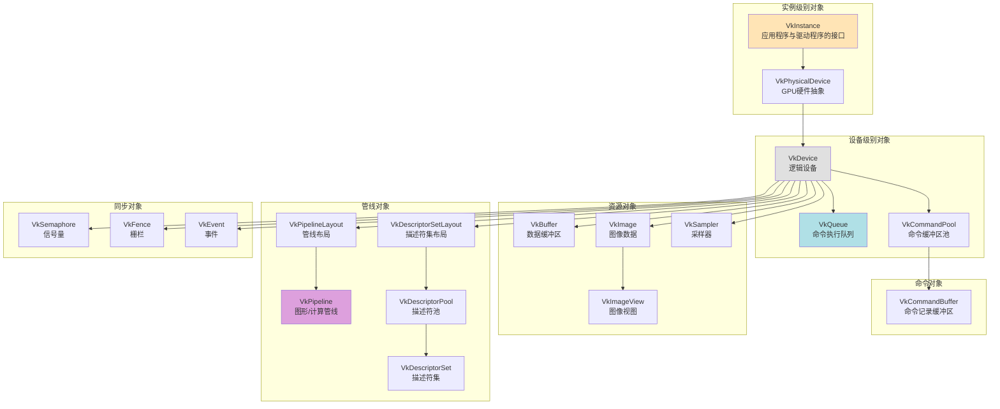

### 对象生命周期

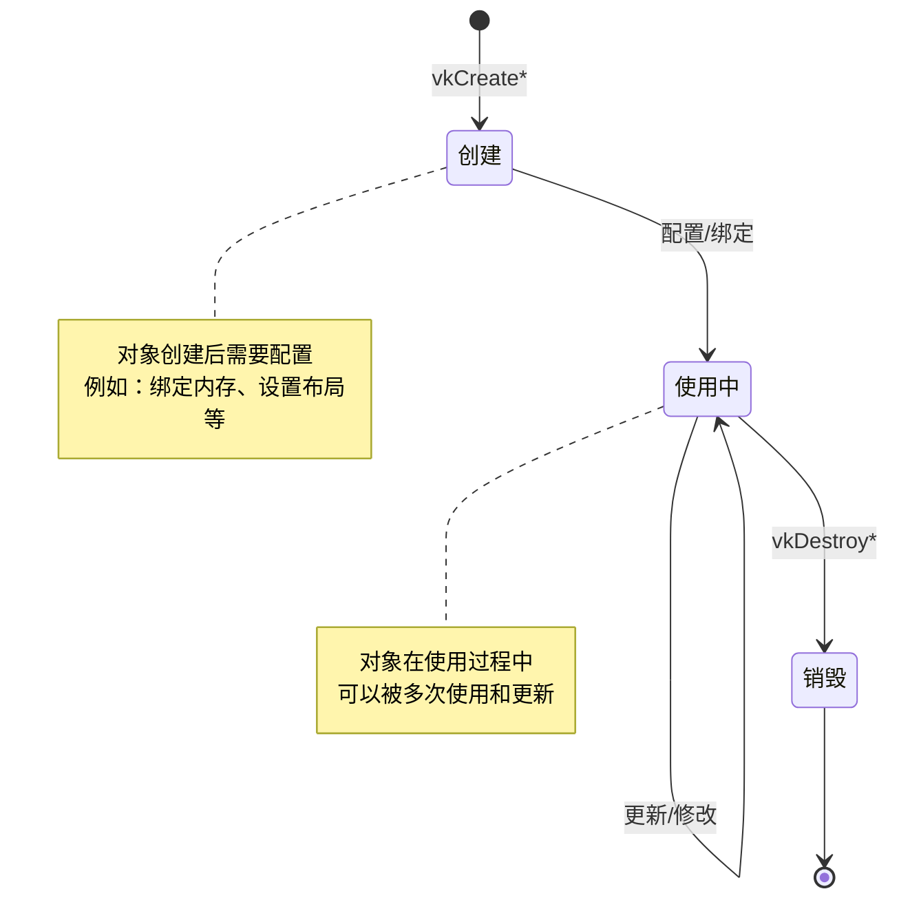

---

## 渲染管线

### 图形管线阶段

```mermaid
graph LR
    subgraph "输入阶段"
        InputAssembler[输入装配器<br/>Input Assembler]
        VertexBuffer[顶点缓冲区]
    end
    
    subgraph "顶点处理"
        VertexShader[顶点着色器<br/>Vertex Shader]
        Tessellation[曲面细分<br/>Tessellation]
        GeometryShader[几何着色器<br/>Geometry Shader]
    end
    
    subgraph "光栅化"
        Rasterization[光栅化<br/>Rasterization]
        FragmentShader[片段着色器<br/>Fragment Shader]
    end
    
    subgraph "输出阶段"
        ColorBlend[颜色混合<br/>Color Blend]
        DepthTest[深度测试<br/>Depth Test]
        FrameBuffer[帧缓冲区]
    end
    
    VertexBuffer --> InputAssembler
    InputAssembler --> VertexShader
    VertexShader --> Tessellation
    Tessellation --> GeometryShader
    GeometryShader --> Rasterization
    Rasterization --> FragmentShader
    FragmentShader --> DepthTest
    DepthTest --> ColorBlend
    ColorBlend --> FrameBuffer
    
    style VertexShader fill:#FFB6C1
    style FragmentShader fill:#FFB6C1
    style Rasterization fill:#87CEEB
```

### 管线创建流程

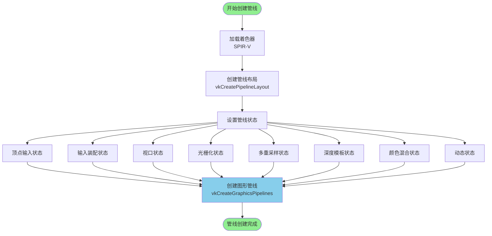

### Vulkan 1.3 动态渲染

```mermaid
graph TB
    subgraph "传统方式 (Vulkan 1.0-1.2)"
        RenderPass1[创建渲染通道<br/>vkCreateRenderPass]
        FrameBuffer1[创建帧缓冲区<br/>vkCreateFramebuffer]
        BeginRP1[vkCmdBeginRenderPass]
        Draw1[绘制命令]
        EndRP1[vkCmdEndRenderPass]
        
        RenderPass1 --> FrameBuffer1
        FrameBuffer1 --> BeginRP1
        BeginRP1 --> Draw1
        Draw1 --> EndRP1
    end
    
    subgraph "动态渲染 (Vulkan 1.3)"
        SetupAttach[设置附件信息<br/>VkRenderingAttachmentInfo]
        BeginRendering[vkCmdBeginRendering]
        Draw2[绘制命令]
        EndRendering[vkCmdEndRendering]
        
        SetupAttach --> BeginRendering
        BeginRendering --> Draw2
        Draw2 --> EndRendering
    end
    
    style BeginRendering fill:#90EE90
    style EndRendering fill:#90EE90
```

---

## 内存管理

### 内存类型层次

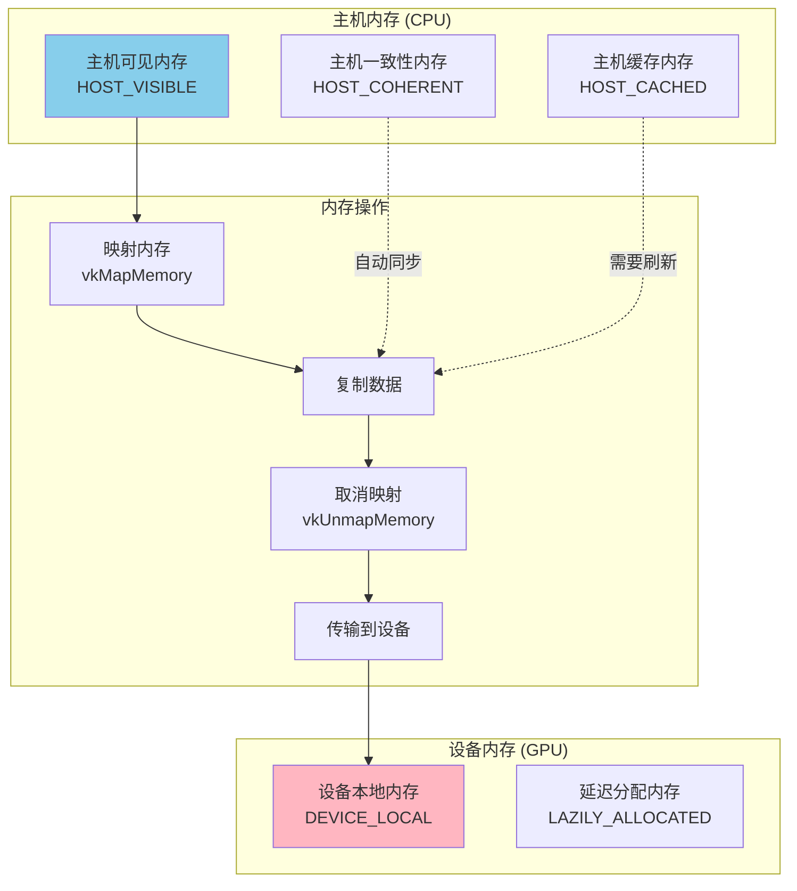

### 缓冲区创建与内存绑定流程

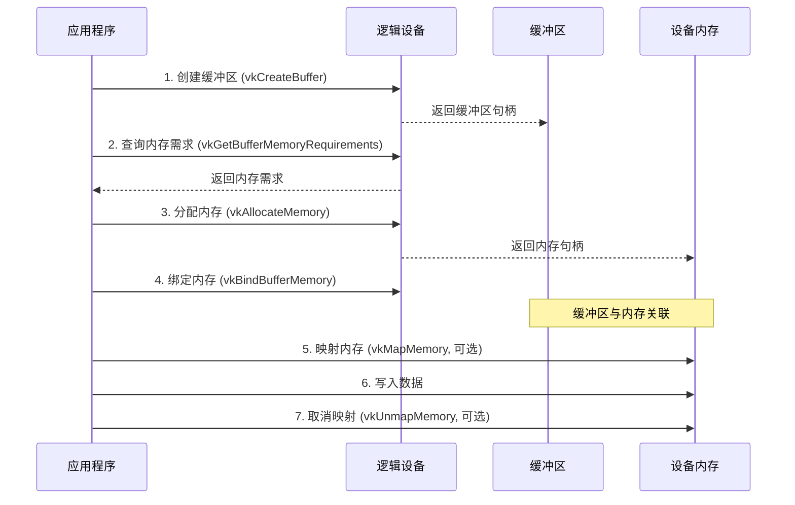

### 暂存缓冲区模式

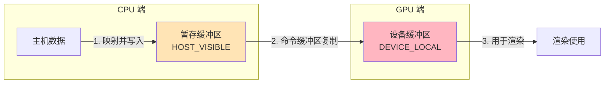

---

## 同步机制

### 同步对象类型

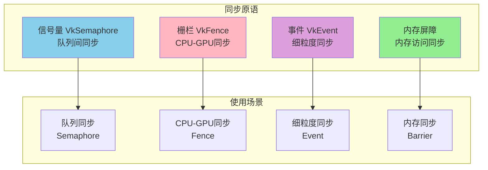

### 渲染循环中的同步

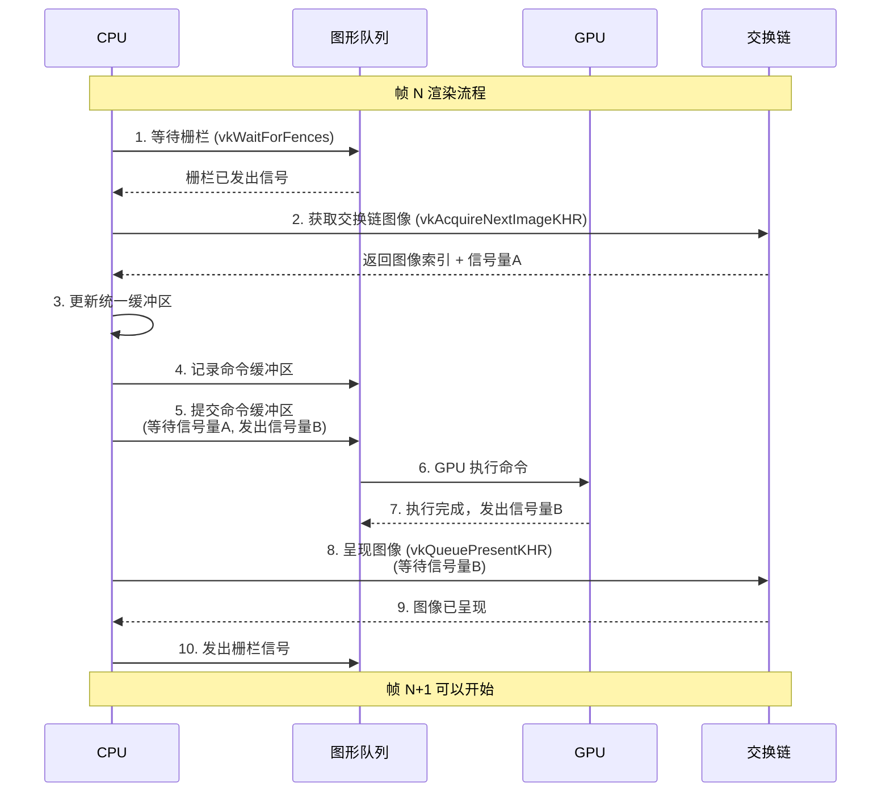

### 同步原语对比

| 同步原语 | 用途 | 作用范围 | 性能开销 |
|---------|------|---------|---------|
| **信号量 (Semaphore)** | 队列操作同步 | GPU 内部 | 低 |
| **栅栏 (Fence)** | CPU-GPU 同步 | CPU ↔ GPU | 中 |
| **事件 (Event)** | 细粒度同步 | 命令缓冲区内 | 中 |
| **内存屏障 (Barrier)** | 内存访问顺序 | 内存访问 | 低 |

---

## 命令提交流程

### 命令缓冲区生命周期

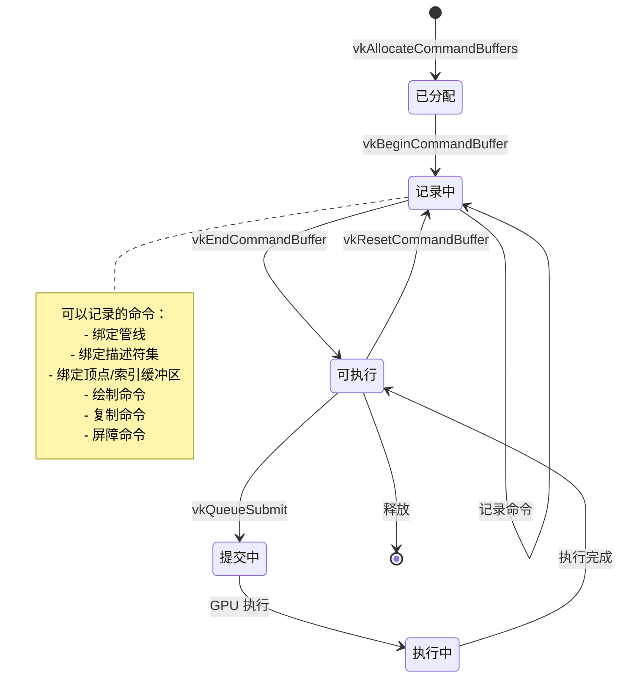

### 命令提交与执行流程

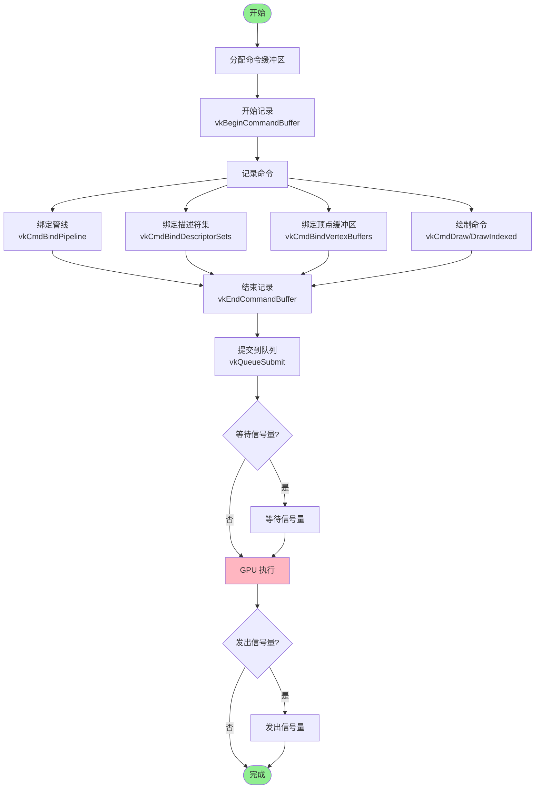

### 多帧并发渲染

```mermaid
gantt
    title 多帧并发渲染时间线 (MAX_CONCURRENT_FRAMES = 2)
    dateFormat X
    axisFormat %s
    
    section 帧 N
    CPU记录命令缓冲区    :0, 5
    GPU执行              :5, 10
    
    section 帧 N+1
    CPU记录命令缓冲区    :5, 10
    GPU执行              :10, 15
    
    section 帧 N+2
    CPU记录命令缓冲区    :10, 15
    GPU执行              :15, 20
```

---

## Vulkan 1.3 新特性

### 动态渲染 (Dynamic Rendering)

动态渲染是 Vulkan 1.3 的核心特性，简化了渲染流程，不再需要预先创建渲染通道和帧缓冲区。

```mermaid
graph TB
    subgraph "传统渲染通道方式"
        CreateRP[创建渲染通道<br/>VkRenderPass]
        CreateFB[创建帧缓冲区<br/>VkFramebuffer]
        BeginRP[vkCmdBeginRenderPass]
        Draw1[绘制]
        EndRP[vkCmdEndRenderPass]
        
        CreateRP --> CreateFB
        CreateFB --> BeginRP
        BeginRP --> Draw1
        Draw1 --> EndRP
    end
    
    subgraph "动态渲染方式"
        SetupAttach[设置附件信息<br/>VkRenderingAttachmentInfo]
        BeginRend[vkCmdBeginRendering]
        Draw2[绘制]
        EndRend[vkCmdEndRendering]
        
        SetupAttach --> BeginRend
        BeginRend --> Draw2
        Draw2 --> EndRend
    end
    
    style BeginRend fill:#90EE90
    style EndRend fill:#90EE90
```

### 同步 2 (Synchronization2)

同步 2 提供了更灵活和强大的同步机制。

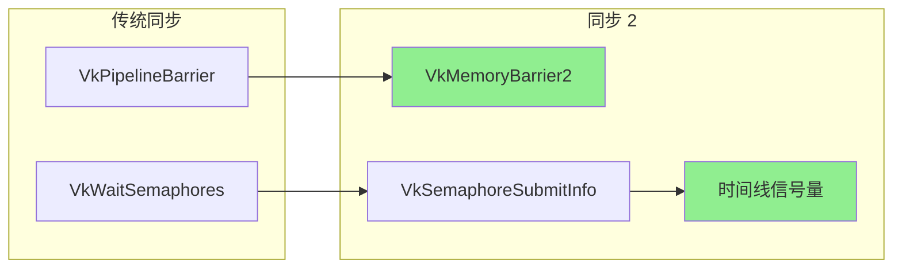

### 特性对比表

| 特性 | Vulkan 1.0-1.2 | Vulkan 1.3 |
|-----|---------------|-----------|
| **渲染方式** | 渲染通道 + 帧缓冲区 | 动态渲染 |
| **同步机制** | 基础同步原语 | 同步 2 |
| **管线创建** | 需要渲染通道 | 不需要渲染通道 |
| **API 复杂度** | 较高 | 较低 |
| **性能** | 优秀 | 优秀 |

---

## 总结

### Vulkan 框架核心概念

1. **显式资源管理**: 所有资源都需要显式创建和销毁
2. **命令驱动**: 通过命令缓冲区记录和提交命令
3. **多线程友好**: 支持多线程命令缓冲区记录
4. **精确同步**: 提供多种同步原语控制执行顺序
5. **管线状态对象**: 所有状态在管线创建时确定

### 学习建议

1. **从基础开始**: 先理解实例、设备、队列的创建
2. **掌握同步**: 理解信号量、栅栏的使用场景
3. **熟悉管线**: 理解图形管线的各个阶段
4. **实践项目**: 通过实际项目加深理解
5. **参考示例**: 参考 `trianglevulkan13` 等示例代码

### 相关资源

- [Vulkan 官方规范](https://www.khronos.org/vulkan/)
- [Vulkan 教程](https://vulkan-tutorial.com/)
- [Vulkan 示例代码库](https://github.com/KhronosGroup/Vulkan-Samples)

---

## 附录：关键 API 速查

### 初始化相关
- `vkCreateInstance()` - 创建 Vulkan 实例
- `vkEnumeratePhysicalDevices()` - 枚举物理设备
- `vkCreateDevice()` - 创建逻辑设备
- `vkGetDeviceQueue()` - 获取队列

### 资源创建
- `vkCreateBuffer()` - 创建缓冲区
- `vkCreateImage()` - 创建图像
- `vkAllocateMemory()` - 分配内存
- `vkBindBufferMemory()` - 绑定缓冲区内存

### 管线相关
- `vkCreatePipelineLayout()` - 创建管线布局
- `vkCreateGraphicsPipelines()` - 创建图形管线
- `vkCreateDescriptorSetLayout()` - 创建描述符集布局
- `vkCreateDescriptorPool()` - 创建描述符池

### 命令相关
- `vkCreateCommandPool()` - 创建命令池
- `vkAllocateCommandBuffers()` - 分配命令缓冲区
- `vkBeginCommandBuffer()` - 开始记录命令
- `vkEndCommandBuffer()` - 结束记录命令
- `vkQueueSubmit()` - 提交命令到队列

### 同步相关
- `vkCreateSemaphore()` - 创建信号量
- `vkCreateFence()` - 创建栅栏
- `vkWaitForFences()` - 等待栅栏
- `vkQueuePresentKHR()` - 呈现图像

---

*文档版本: 1.0*  
*最后更新: 2024*

