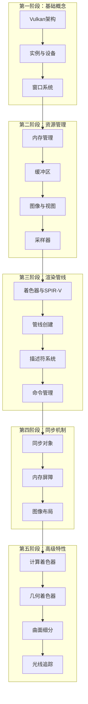

# Vulkan 系统学习路线

## 📚 文档说明

本文档提供了一份系统化的 Vulkan API 和知识点学习路线，帮助您从零开始系统掌握 Vulkan 图形编程。本路线结合了理论学习和实践应用，按照从基础到高级、从核心到扩展的顺序组织。

---

## 🎯 学习路线总览



---

## 📖 第一阶段：Vulkan 基础架构（1-2周）

### 1.1 Vulkan 概述与架构设计 ⭐⭐⭐⭐⭐

**学习目标**：
- 理解 Vulkan 的设计哲学
- 掌握 Vulkan 的架构层次
- 了解 Vulkan 与 OpenGL 的区别

**核心知识点**：
- Vulkan 的设计目标（显式控制、低开销、多线程）
- Vulkan 对象模型（实例、设备、资源）
- Vulkan 版本与扩展系统

**推荐文档**：
- `fenxi/Vulkan框架模型文档.md`
- `fenxi/详细分析/Vulkan扩展详细分析.md`

**实践建议**：
- 阅读 Vulkan 规范第 1-3 章
- 理解对象生命周期管理

**预计时间**：2-3 天

---

### 1.2 VkInstance - Vulkan 实例 ⭐⭐⭐⭐⭐

**学习目标**：
- 掌握 Vulkan 实例的创建
- 理解验证层的作用
- 了解扩展和层的管理

**核心知识点**：
- `vkCreateInstance` / `vkDestroyInstance`
- `VkApplicationInfo` 和 `VkInstanceCreateInfo`
- 验证层（Validation Layers）
- 扩展枚举（`vkEnumerateInstanceExtensionProperties`）
- 调试回调（`VkDebugUtilsMessengerEXT`）

**关键 API**：
```cpp
vkCreateInstance
vkDestroyInstance
vkEnumerateInstanceExtensionProperties
vkEnumerateInstanceLayerProperties
vkCreateDebugUtilsMessengerEXT
```

**推荐文档**：
- `fenxi/详细分析/VkInstance详细分析.md`

**实践建议**：
- 实现一个最小化的实例创建代码
- 配置验证层并理解错误信息
- 尝试启用不同的扩展

**预计时间**：2-3 天

---

### 1.3 VkPhysicalDevice - 物理设备 ⭐⭐⭐⭐⭐

**学习目标**：
- 掌握物理设备的枚举和选择
- 理解设备特性、属性和限制
- 了解队列族（Queue Families）

**核心知识点**：
- `vkEnumeratePhysicalDevices`
- `vkGetPhysicalDeviceProperties`
- `vkGetPhysicalDeviceFeatures`
- `vkGetPhysicalDeviceQueueFamilyProperties`
- `vkGetPhysicalDeviceMemoryProperties`
- 设备扩展支持检查

**关键 API**：
```cpp
vkEnumeratePhysicalDevices
vkGetPhysicalDeviceProperties
vkGetPhysicalDeviceFeatures
vkGetPhysicalDeviceQueueFamilyProperties
vkGetPhysicalDeviceMemoryProperties
vkGetPhysicalDeviceExtensionProperties
```

**推荐文档**：
- `fenxi/详细分析/VkPhysicalDevice详细分析.md`

**实践建议**：
- 编写设备选择逻辑
- 打印设备信息（名称、类型、API版本等）
- 检查队列族支持（图形、计算、传输）

**预计时间**：2-3 天

---

### 1.4 VkDevice - 逻辑设备 ⭐⭐⭐⭐⭐

**学习目标**：
- 掌握逻辑设备的创建
- 理解设备队列的获取
- 了解设备扩展的启用

**核心知识点**：
- `vkCreateDevice` / `vkDestroyDevice`
- `VkDeviceCreateInfo`
- 设备特性启用（`VkPhysicalDeviceFeatures`）
- 队列创建信息（`VkDeviceQueueCreateInfo`）
- `vkGetDeviceQueue` / `vkGetDeviceQueue2`
- 设备函数指针获取

**关键 API**：
```cpp
vkCreateDevice
vkDestroyDevice
vkGetDeviceQueue
vkGetDeviceQueue2
vkGetDeviceProcAddr
```

**推荐文档**：
- `fenxi/详细分析/VkDevice详细分析.md`
- `fenxi/详细分析/VkDevice/设备操作/Vulkan设备操作详细分析.md`

**实践建议**：
- 创建逻辑设备并获取队列
- 启用需要的设备特性
- 理解设备与物理设备的关系

**预计时间**：2-3 天

---

### 1.5 VkSurfaceKHR - 窗口表面 ⭐⭐⭐⭐⭐

**学习目标**：
- 掌握窗口表面的创建
- 理解表面格式和呈现模式
- 了解交换链的基础概念

**核心知识点**：
- 平台特定的表面创建（Windows: `vkCreateWin32SurfaceKHR`）
- `vkGetPhysicalDeviceSurfaceSupportKHR`
- `vkGetPhysicalDeviceSurfaceCapabilitiesKHR`
- `vkGetPhysicalDeviceSurfaceFormatsKHR`
- `vkGetPhysicalDeviceSurfacePresentModesKHR`
- `vkDestroySurfaceKHR`

**关键 API**：
```cpp
vkCreateWin32SurfaceKHR / vkCreateXlibSurfaceKHR / ...
vkDestroySurfaceKHR
vkGetPhysicalDeviceSurfaceSupportKHR
vkGetPhysicalDeviceSurfaceCapabilitiesKHR
vkGetPhysicalDeviceSurfaceFormatsKHR
vkGetPhysicalDeviceSurfacePresentModesKHR
```

**推荐文档**：
- `fenxi/详细分析/VkSurfaceKHR详细分析.md`

**实践建议**：
- 创建窗口表面
- 查询表面能力并选择合适的格式
- 理解呈现模式的区别（FIFO、Mailbox、Immediate）

**预计时间**：2-3 天

---

## 📦 第二阶段：资源管理（2-3周）

### 2.1 Vulkan 内存管理 ⭐⭐⭐⭐⭐

**学习目标**：
- 理解 Vulkan 的内存模型
- 掌握内存类型和堆
- 学会内存分配和管理

**核心知识点**：
- 内存类型（`VkMemoryType`）
- 内存堆（`VkMemoryHeap`）
- `vkAllocateMemory` / `vkFreeMemory`
- `vkMapMemory` / `vkUnmapMemory`
- 内存对齐要求
- 设备本地内存 vs 主机可见内存
- 内存绑定（`vkBindBufferMemory` / `vkBindImageMemory`）

**关键 API**：
```cpp
vkAllocateMemory
vkFreeMemory
vkMapMemory
vkUnmapMemory
vkFlushMappedMemoryRanges
vkInvalidateMappedMemoryRanges
vkBindBufferMemory
vkBindImageMemory
```

**推荐文档**：
- `fenxi/详细分析/VkDevice/内存管理/Vulkan内存管理详细分析.md`

**实践建议**：
- 实现内存分配器
- 理解不同内存类型的使用场景
- 掌握内存映射和刷新

**预计时间**：3-4 天

---

### 2.2 VkBuffer - 缓冲区 ⭐⭐⭐⭐⭐

**学习目标**：
- 掌握缓冲区的创建和使用
- 理解不同类型的缓冲区
- 学会缓冲区数据的传输

**核心知识点**：
- `vkCreateBuffer` / `vkDestroyBuffer`
- `VkBufferUsageFlags`（顶点、索引、Uniform、存储等）
- `vkGetBufferMemoryRequirements`
- 暂存缓冲区（Staging Buffer）模式
- 缓冲区复制（`vkCmdCopyBuffer`）
- 设备地址（`VK_KHR_buffer_device_address`）

**关键 API**：
```cpp
vkCreateBuffer
vkDestroyBuffer
vkGetBufferMemoryRequirements
vkGetBufferDeviceAddress
vkCmdCopyBuffer
vkCmdCopyBufferToImage
vkCmdCopyImageToBuffer
```

**推荐文档**：
- `fenxi/详细分析/VkDevice/资源创建/VkBuffer详细分析.md`

**实践建议**：
- 创建顶点缓冲区和索引缓冲区
- 实现数据上传（CPU → GPU）
- 理解暂存缓冲区的使用

**预计时间**：2-3 天

---

### 2.3 VkImage 和 VkImageView - 图像与视图 ⭐⭐⭐⭐⭐

**学习目标**：
- 掌握图像的创建和管理
- 理解图像格式和布局
- 学会图像视图的创建

**核心知识点**：
- `vkCreateImage` / `vkDestroyImage`
- `VkImageUsageFlags`
- `VkImageType`（1D、2D、3D）
- `VkFormat`（格式选择）
- `vkGetImageMemoryRequirements`
- `vkCreateImageView` / `vkDestroyImageView`
- `VkImageViewType`（1D、2D、立方体、数组等）
- 图像子资源范围（`VkImageSubresourceRange`）
- Mipmap 级别

**关键 API**：
```cpp
vkCreateImage
vkDestroyImage
vkGetImageMemoryRequirements
vkGetImageSubresourceLayout
vkCreateImageView
vkDestroyImageView
vkCmdCopyBufferToImage
vkCmdCopyImageToBuffer
vkCmdCopyImage
vkCmdBlitImage
```

**推荐文档**：
- `fenxi/详细分析/VkDevice/资源创建/VkImage详细分析.md`
- `fenxi/详细分析/Vulkan视图详细分析.md`
- `fenxi/详细分析/VkDevice/内存管理/Vulkan图像布局详细分析.md`

**实践建议**：
- 创建 2D 纹理图像
- 实现纹理数据上传
- 创建图像视图用于采样
- 理解图像布局转换

**预计时间**：3-4 天

---

### 2.4 VkSampler - 采样器 ⭐⭐⭐⭐

**学习目标**：
- 掌握采样器的创建
- 理解过滤和寻址模式
- 了解各向异性过滤

**核心知识点**：
- `vkCreateSampler` / `vkDestroySampler`
- `VkFilter`（最近邻、线性）
- `VkSamplerAddressMode`（重复、镜像、夹紧等）
- `VkSamplerMipmapMode`
- 各向异性过滤（`maxAnisotropy`）
- LOD 偏移和范围
- 比较模式（用于阴影贴图）

**关键 API**：
```cpp
vkCreateSampler
vkDestroySampler
```

**推荐文档**：
- `fenxi/详细分析/VkDevice/资源创建/VkSampler详细分析.md`

**实践建议**：
- 创建不同的采样器配置
- 比较不同过滤模式的效果
- 实现各向异性过滤

**预计时间**：1-2 天

---

## 🎨 第三阶段：渲染管线（3-4周）

### 3.1 SPIR-V 与着色器 ⭐⭐⭐⭐⭐

**学习目标**：
- 理解 SPIR-V 格式
- 掌握着色器模块的创建
- 了解着色器编译流程

**核心知识点**：
- SPIR-V 二进制格式
- GLSL 到 SPIR-V 编译（`glslc`、`glslangValidator`）
- `vkCreateShaderModule` / `vkDestroyShaderModule`
- 着色器阶段（顶点、片段、几何、计算等）
- 入口点（Entry Point）
- 特化常量（Specialization Constants）

**关键 API**：
```cpp
vkCreateShaderModule
vkDestroyShaderModule
```

**推荐文档**：
- `fenxi/SPIR-V架构与使用文档.md`

**实践建议**：
- 编写简单的顶点和片段着色器
- 编译 GLSL 到 SPIR-V
- 创建着色器模块并验证

**预计时间**：2-3 天

---

### 3.2 VkPipeline - 图形管线 ⭐⭐⭐⭐⭐

**学习目标**：
- 掌握图形管线的创建
- 理解管线状态对象（PSO）
- 了解管线的各个阶段

**核心知识点**：
- `vkCreateGraphicsPipelines` / `vkDestroyPipeline`
- `VkGraphicsPipelineCreateInfo`
- 着色器阶段（`VkPipelineShaderStageCreateInfo`）
- 顶点输入（`VkPipelineVertexInputStateCreateInfo`）
- 输入装配（`VkPipelineInputAssemblyStateCreateInfo`）
- 视口和裁剪（`VkPipelineViewportStateCreateInfo`）
- 光栅化（`VkPipelineRasterizationStateCreateInfo`）
- 多重采样（`VkPipelineMultisampleStateCreateInfo`）
- 深度和模板测试（`VkPipelineDepthStencilStateCreateInfo`）
- 颜色混合（`VkPipelineColorBlendStateCreateInfo`）
- 动态状态（`VkPipelineDynamicStateCreateInfo`）
- 管线布局（`VkPipelineLayout`）
- 管线派生（Pipeline Derivatives）

**关键 API**：
```cpp
vkCreateGraphicsPipelines
vkDestroyPipeline
vkCreatePipelineLayout
vkDestroyPipelineLayout
```

**推荐文档**：
- `fenxi/详细分析/VkDevice/资源创建/VkPipeline详细分析.md`

**实践建议**：
- 创建最简单的图形管线（三角形）
- 逐步添加各个阶段的状态
- 理解管线状态对象的作用

**预计时间**：4-5 天

---

### 3.3 描述符系统 ⭐⭐⭐⭐⭐

**学习目标**：
- 掌握描述符集布局
- 理解描述符池和描述符集
- 学会绑定描述符

**核心知识点**：
- `VkDescriptorSetLayout`（描述符集布局）
- `VkDescriptorType`（Uniform Buffer、Combined Image Sampler 等）
- `vkCreateDescriptorSetLayout` / `vkDestroyDescriptorSetLayout`
- `VkDescriptorPool`（描述符池）
- `vkCreateDescriptorPool` / `vkDestroyDescriptorPool`
- `vkAllocateDescriptorSets` / `vkFreeDescriptorSets`
- `vkUpdateDescriptorSets`（更新描述符）
- `vkCmdBindDescriptorSets`（绑定描述符集）
- 推送描述符（`VK_KHR_push_descriptor`）
- 描述符索引（`VK_EXT_descriptor_indexing`）
- 动态 Uniform 缓冲区

**关键 API**：
```cpp
vkCreateDescriptorSetLayout
vkDestroyDescriptorSetLayout
vkCreateDescriptorPool
vkDestroyDescriptorPool
vkAllocateDescriptorSets
vkFreeDescriptorSets
vkUpdateDescriptorSets
vkCmdBindDescriptorSets
vkCmdPushDescriptorSetKHR
```

**推荐文档**：
- `fenxi/详细分析/VkDevice/设备操作/Vulkan描述符和描述符集详细分析.md`

**实践建议**：
- 创建描述符集布局
- 分配和更新描述符集
- 在渲染命令中绑定描述符
- 实现 Uniform 缓冲区绑定

**预计时间**：3-4 天

---

### 3.4 推送常量（Push Constants）⭐⭐⭐⭐

**学习目标**：
- 理解推送常量的使用场景
- 掌握推送常量的实现

**核心知识点**：
- `VkPushConstantRange`
- `vkCmdPushConstants`
- 推送常量 vs 描述符集
- 大小限制（通常 128 字节）

**关键 API**：
```cpp
vkCmdPushConstants
```

**实践建议**：
- 使用推送常量传递变换矩阵
- 比较推送常量和 Uniform 缓冲区的性能

**预计时间**：1 天

---

### 3.5 VkCommandPool 和 VkCommandBuffer - 命令管理 ⭐⭐⭐⭐⭐

**学习目标**：
- 掌握命令池的创建
- 理解命令缓冲区的分配和记录
- 学会命令的提交和执行

**核心知识点**：
- `vkCreateCommandPool` / `vkDestroyCommandPool`
- `VkCommandPoolCreateFlags`（重置标志）
- `vkAllocateCommandBuffers` / `vkFreeCommandBuffers`
- `vkBeginCommandBuffer` / `vkEndCommandBuffer`
- `VkCommandBufferUsageFlags`
- 渲染命令（`vkCmdBeginRenderPass`、`vkCmdDraw` 等）
- 辅助命令缓冲区（`VK_COMMAND_BUFFER_USAGE_RENDER_PASS_CONTINUE_BIT`）
- 多线程命令记录
- `vkQueueSubmit` / `vkQueueWaitIdle`
- `vkQueuePresentKHR`

**关键 API**：
```cpp
vkCreateCommandPool
vkDestroyCommandPool
vkAllocateCommandBuffers
vkFreeCommandBuffers
vkBeginCommandBuffer
vkEndCommandBuffer
vkResetCommandBuffer
vkResetCommandPool
vkCmdBeginRenderPass
vkCmdEndRenderPass
vkCmdBindPipeline
vkCmdBindVertexBuffers
vkCmdBindIndexBuffer
vkCmdDraw
vkCmdDrawIndexed
vkCmdDrawIndirect
vkQueueSubmit
vkQueueWaitIdle
vkQueuePresentKHR
```

**推荐文档**：
- `fenxi/详细分析/VkDevice/命令管理/VkCommandPool详细分析.md`
- `fenxi/详细分析/VkDevice/命令管理/VkQueue详细分析.md`
- `fenxi/详细分析/VkDevice/命令管理/Vulkan命令管理架构设计.md`

**实践建议**：
- 创建命令池并分配命令缓冲区
- 记录基本的绘制命令
- 实现多线程命令记录
- 理解命令提交和同步

**预计时间**：3-4 天

---

### 3.6 VkRenderPass 和 VkFramebuffer - 渲染通道 ⭐⭐⭐⭐⭐

**学习目标**：
- 掌握渲染通道的创建
- 理解附件和子通道
- 学会帧缓冲区的管理

**核心知识点**：
- `vkCreateRenderPass` / `vkDestroyRenderPass`
- `VkAttachmentDescription`（附件描述）
- `VkAttachmentReference`（附件引用）
- `VkSubpassDescription`（子通道描述）
- `VkSubpassDependency`（子通道依赖）
- `vkCreateFramebuffer` / `vkDestroyFramebuffer`
- 输入附件（Input Attachments）
- 解析附件（Resolve Attachments）
- 动态渲染（`VK_KHR_dynamic_rendering`，Vulkan 1.3）

**关键 API**：
```cpp
vkCreateRenderPass
vkDestroyRenderPass
vkCreateFramebuffer
vkDestroyFramebuffer
vkCmdBeginRenderPass
vkCmdEndRenderPass
vkCmdBeginRenderingKHR
vkCmdEndRenderingKHR
```

**实践建议**：
- 创建简单的渲染通道
- 实现多渲染目标（MRT）
- 使用子通道优化性能
- 尝试动态渲染（Vulkan 1.3）

**预计时间**：3-4 天

---

### 3.7 VkSwapchainKHR - 交换链 ⭐⭐⭐⭐⭐

**学习目标**：
- 掌握交换链的创建和管理
- 理解图像获取和呈现
- 学会交换链重建

**核心知识点**：
- `vkCreateSwapchainKHR` / `vkDestroySwapchainKHR`
- `VkSwapchainCreateInfoKHR`
- 交换链图像格式和颜色空间
- 呈现模式（FIFO、Mailbox、Immediate）
- `vkGetSwapchainImagesKHR`
- `vkAcquireNextImageKHR`
- `vkQueuePresentKHR`
- 交换链重建（窗口大小改变时）

**关键 API**：
```cpp
vkCreateSwapchainKHR
vkDestroySwapchainKHR
vkGetSwapchainImagesKHR
vkAcquireNextImageKHR
vkQueuePresentKHR
```

**实践建议**：
- 创建交换链
- 实现图像获取和呈现循环
- 处理窗口大小改变事件
- 理解同步问题

**预计时间**：2-3 天

---

## 🔒 第四阶段：同步机制（2-3周）

### 4.1 同步对象总览 ⭐⭐⭐⭐⭐

**学习目标**：
- 理解 Vulkan 的同步模型
- 掌握不同同步对象的用途

**核心知识点**：
- 同步对象类型（信号量、栅栏、事件、屏障）
- CPU-GPU 同步 vs GPU-GPU 同步
- 队列内同步 vs 跨队列同步

**推荐文档**：
- `fenxi/详细分析/VkDevice/同步对象/VkSemaphore详细分析.md`
- `fenxi/详细分析/VkDevice/同步对象/VkFence详细分析.md`
- `fenxi/详细分析/VkDevice/同步对象/VkEvent详细分析.md`

**预计时间**：1 天

---

### 4.2 VkSemaphore - 信号量 ⭐⭐⭐⭐⭐

**学习目标**：
- 掌握信号量的创建和使用
- 理解信号量在队列提交中的作用
- 学会图像获取和呈现的同步

**核心知识点**：
- `vkCreateSemaphore` / `vkDestroySemaphore`
- `VkSemaphoreType`（二进制、时间线）
- `VkSemaphoreWaitInfo`
- `vkWaitSemaphores`
- 在 `vkQueueSubmit` 中使用信号量
- 图像获取同步（`vkAcquireNextImageKHR`）
- 时间线信号量（`VK_KHR_timeline_semaphore`）

**关键 API**：
```cpp
vkCreateSemaphore
vkDestroySemaphore
vkWaitSemaphores
vkSignalSemaphore
vkGetSemaphoreCounterValue
```

**推荐文档**：
- `fenxi/详细分析/VkDevice/同步对象/VkSemaphore详细分析.md`

**实践建议**：
- 使用信号量同步图像获取和呈现
- 实现多队列同步
- 尝试时间线信号量

**预计时间**：2-3 天

---

### 4.3 VkFence - 栅栏 ⭐⭐⭐⭐⭐

**学习目标**：
- 掌握栅栏的创建和使用
- 理解 CPU-GPU 同步

**核心知识点**：
- `vkCreateFence` / `vkDestroyFence`
- `vkWaitForFences` / `vkResetFences`
- `VkFenceCreateFlags`
- 在 `vkQueueSubmit` 中使用栅栏
- 多栅栏等待

**关键 API**：
```cpp
vkCreateFence
vkDestroyFence
vkWaitForFences
vkResetFences
vkGetFenceStatus
```

**推荐文档**：
- `fenxi/详细分析/VkDevice/同步对象/VkFence详细分析.md`

**实践建议**：
- 使用栅栏等待命令完成
- 实现帧同步（双缓冲、三缓冲）
- 理解栅栏重置的重要性

**预计时间**：2 天

---

### 4.4 VkEvent - 事件 ⭐⭐⭐

**学习目标**：
- 理解事件的用途
- 掌握事件在命令缓冲区中的使用

**核心知识点**：
- `vkCreateEvent` / `vkDestroyEvent`
- `vkSetEvent` / `vkResetEvent`
- `vkGetEventStatus`
- `vkCmdSetEvent` / `vkCmdResetEvent`
- `vkCmdWaitEvents`
- 事件在管线中的位置

**关键 API**：
```cpp
vkCreateEvent
vkDestroyEvent
vkSetEvent
vkResetEvent
vkGetEventStatus
vkCmdSetEvent
vkCmdResetEvent
vkCmdWaitEvents
```

**推荐文档**：
- `fenxi/详细分析/VkDevice/同步对象/VkEvent详细分析.md`

**实践建议**：
- 使用事件同步命令缓冲区内的操作
- 实现条件渲染

**预计时间**：1-2 天

---

### 4.5 内存屏障和图像布局 ⭐⭐⭐⭐⭐

**学习目标**：
- 理解内存可见性和可用性
- 掌握内存屏障的使用
- 学会图像布局转换

**核心知识点**：
- 内存可见性域（Memory Visibility Domain）
- 可用性操作（Availability Operation）
- 可见性操作（Visibility Operation）
- `VkMemoryBarrier`（全局内存屏障）
- `VkBufferMemoryBarrier`（缓冲区内存屏障）
- `VkImageMemoryBarrier`（图像内存屏障）
- `vkCmdPipelineBarrier`
- `vkCmdWaitEvents`
- 图像布局（`VkImageLayout`）
- 布局转换（`VK_IMAGE_LAYOUT_UNDEFINED` → `VK_IMAGE_LAYOUT_TRANSFER_DST_OPTIMAL` 等）
- `VkImageSubresourceRange`

**关键 API**：
```cpp
vkCmdPipelineBarrier
vkCmdWaitEvents
vkCmdSetEvent
vkCmdResetEvent
```

**推荐文档**：
- `fenxi/详细分析/VkDevice/资源创建/Vulkan屏障详细分析.md`
- `fenxi/详细分析/VkDevice/内存管理/Vulkan图像布局详细分析.md`

**实践建议**：
- 实现图像布局转换
- 使用屏障同步缓冲区写入
- 理解不同管线阶段的屏障
- 优化屏障使用（减少不必要的屏障）

**预计时间**：4-5 天

---

## 🚀 第五阶段：高级渲染技术（3-4周）

### 5.1 多重采样抗锯齿（MSAA）⭐⭐⭐⭐

**学习目标**：
- 掌握 MSAA 的实现
- 理解多重采样附件

**核心知识点**：
- `VkSampleCountFlagBits`
- 多重采样附件创建
- 解析附件（Resolve Attachment）
- `vkCmdResolveImage`

**实践建议**：
- 实现 4x MSAA
- 比较 MSAA 和 FXAA 的效果

**预计时间**：2 天

---

### 5.2 实例化渲染 ⭐⭐⭐⭐

**学习目标**：
- 掌握 GPU 实例化
- 理解实例数据传递

**核心知识点**：
- `vkCmdDraw` / `vkCmdDrawIndexed`（实例计数）
- 实例属性（`VkVertexInputBindingDescription`）
- 实例数据缓冲区

**实践建议**：
- 实现大量对象的实例化渲染
- 比较实例化和多次绘制的性能

**预计时间**：2 天

---

### 5.3 间接绘制 ⭐⭐⭐⭐⭐

**学习目标**：
- 掌握间接绘制命令
- 理解 GPU 驱动渲染

**核心知识点**：
- `VkDrawIndirectCommand` / `VkDrawIndexedIndirectCommand`
- `vkCmdDrawIndirect` / `vkCmdDrawIndexedIndirect`
- 间接命令缓冲区
- 多间接绘制

**实践建议**：
- 实现 GPU 驱动的对象剔除
- 结合计算着色器生成间接命令

**预计时间**：2-3 天

---

### 5.4 阴影映射 ⭐⭐⭐⭐⭐

**学习目标**：
- 掌握阴影贴图技术
- 理解深度比较

**核心知识点**：
- 阴影贴图创建（深度图像）
- 深度比较采样器
- 阴影贴图渲染通道
- PCF 滤波

**实践建议**：
- 实现方向光阴影
- 实现点光源阴影（立方体贴图）
- 实现级联阴影映射（CSM）

**预计时间**：3-4 天

---

### 5.5 延迟渲染 ⭐⭐⭐⭐⭐

**学习目标**：
- 掌握延迟着色技术
- 理解 G-Buffer

**核心知识点**：
- G-Buffer 创建（多渲染目标）
- 几何通道渲染
- 光照通道渲染
- 延迟渲染优化

**实践建议**：
- 实现基础延迟渲染
- 添加多光源支持
- 实现延迟渲染中的阴影

**预计时间**：4-5 天

---

### 5.6 PBR 渲染 ⭐⭐⭐⭐⭐

**学习目标**：
- 掌握物理基于渲染
- 理解 BRDF 实现

**核心知识点**：
- 金属度/粗糙度工作流
- BRDF 函数
- 环境光照（IBL）
- 辐照度贴图和预过滤环境贴图

**实践建议**：
- 实现基础 PBR
- 添加 IBL 支持
- 实现 PBR 纹理工作流

**预计时间**：4-5 天

---

## 💻 第六阶段：计算着色器（2-3周）

### 6.1 计算管线 ⭐⭐⭐⭐⭐

**学习目标**：
- 掌握计算管线的创建
- 理解计算着色器的执行模型

**核心知识点**：
- `vkCreateComputePipelines`
- 计算着色器模块
- 工作组大小（Local Size）
- `vkCmdDispatch` / `vkCmdDispatchIndirect`
- 计算队列

**关键 API**：
```cpp
vkCreateComputePipelines
vkCmdDispatch
vkCmdDispatchIndirect
vkCmdBindPipeline
vkCmdBindDescriptorSets
```

**实践建议**：
- 实现简单的图像处理（模糊、边缘检测）
- 理解工作组和调度

**预计时间**：2-3 天

---

### 6.2 存储缓冲区 ⭐⭐⭐⭐

**学习目标**：
- 掌握存储缓冲区的使用
- 理解原子操作

**核心知识点**：
- `VK_DESCRIPTOR_TYPE_STORAGE_BUFFER`
- 存储缓冲区绑定
- 原子操作（`atomicAdd`、`atomicExchange` 等）
- 共享内存（Shared Memory）

**实践建议**：
- 实现 GPU 粒子系统
- 实现 GPU 驱动的剔除

**预计时间**：2-3 天

---

### 6.3 计算与图形同步 ⭐⭐⭐⭐

**学习目标**：
- 掌握计算和图形队列的同步
- 理解内存屏障在计算中的使用

**核心知识点**：
- 跨队列同步
- 计算到图形的数据传输
- 内存屏障

**实践建议**：
- 实现计算着色器预处理 + 图形渲染
- 实现 GPU 粒子系统渲染

**预计时间**：2 天

---

## 🔺 第七阶段：几何和曲面细分（2-3周）

### 7.1 几何着色器 ⭐⭐⭐

**学习目标**：
- 掌握几何着色器的使用
- 理解动态几何生成

**核心知识点**：
- `VK_SHADER_STAGE_GEOMETRY_BIT`
- 几何着色器输入/输出
- `vkCmdDraw` 在几何着色器中的使用

**实践建议**：
- 实现法线可视化
- 实现动态几何生成

**预计时间**：2 天

---

### 7.2 曲面细分 ⭐⭐⭐⭐

**学习目标**：
- 掌握曲面细分管线
- 理解细分控制器和评估器

**核心知识点**：
- `VK_SHADER_STAGE_TESSELLATION_CONTROL_BIT`
- `VK_SHADER_STAGE_TESSELLATION_EVALUATION_BIT`
- `VkPipelineTessellationStateCreateInfo`
- 细分级别（Tessellation Level）
- PN 三角形

**实践建议**：
- 实现基础曲面细分
- 实现位移贴图
- 实现地形渲染

**预计时间**：3-4 天

---

## 🌟 第八阶段：光线追踪（3-4周，需要 RTX 硬件）

### 8.1 光线追踪基础 ⭐⭐⭐⭐⭐

**学习目标**：
- 掌握加速结构（AS）的创建
- 理解光线追踪管线

**核心知识点**：
- `VkAccelerationStructureKHR`
- `vkCreateAccelerationStructureKHR`
- `vkBuildAccelerationStructuresKHR`
- 光线追踪管线（`VkRayTracingPipelineCreateInfoKHR`）
- 着色器绑定表（SBT）
- `vkCmdTraceRaysKHR`

**关键 API**：
```cpp
vkCreateAccelerationStructureKHR
vkDestroyAccelerationStructureKHR
vkBuildAccelerationStructuresKHR
vkCreateRayTracingPipelinesKHR
vkCmdTraceRaysKHR
vkGetRayTracingShaderGroupHandlesKHR
```

**实践建议**：
- 实现基础光线追踪（三角形）
- 理解加速结构的构建
- 实现简单的阴影和反射

**预计时间**：4-5 天

---

### 8.2 光线追踪高级特性 ⭐⭐⭐⭐⭐

**学习目标**：
- 掌握递归光线追踪
- 理解可调用和相交着色器

**核心知识点**：
- 递归光线追踪
- 可调用着色器（Callable Shaders）
- 相交着色器（Intersection Shaders）
- 过程几何
- 帧累积和抗锯齿

**实践建议**：
- 实现复杂场景的光线追踪
- 实现光线追踪的 glTF 加载
- 实现实时反射和全局光照

**预计时间**：3-4 天

---

## 🎯 第九阶段：现代 Vulkan 特性（2-3周）

### 9.1 Vulkan 1.3 新特性 ⭐⭐⭐⭐⭐

**学习目标**：
- 掌握动态渲染
- 理解动态状态扩展

**核心知识点**：
- 动态渲染（`VK_KHR_dynamic_rendering`）
- `vkCmdBeginRenderingKHR` / `vkCmdEndRenderingKHR`
- 动态状态扩展（`VK_EXT_extended_dynamic_state`）
- 同步 2（Synchronization2）

**实践建议**：
- 将传统渲染通道迁移到动态渲染
- 使用动态状态减少管线数量

**预计时间**：2-3 天

---

### 9.2 网格着色器 ⭐⭐⭐⭐⭐

**学习目标**：
- 掌握网格着色器管线
- 理解任务着色器

**核心知识点**：
- `VK_EXT_mesh_shader`
- 任务着色器（Task Shader）
- 网格着色器（Mesh Shader）
- 传统顶点管线的替代

**实践建议**：
- 实现网格着色器渲染
- 比较网格着色器和传统管线的性能

**预计时间**：3-4 天

---

### 9.3 着色器对象 ⭐⭐⭐⭐

**学习目标**：
- 理解着色器对象扩展
- 掌握动态管线状态

**核心知识点**：
- `VK_EXT_shader_object`
- 着色器对象创建
- 动态状态绑定

**实践建议**：
- 实现着色器对象渲染
- 理解与管线状态对象的区别

**预计时间**：2-3 天

---

## 📚 学习建议与资源

### 学习时间规划

| 阶段 | 预计时间 | 重要性 |
|------|---------|--------|
| 第一阶段：基础架构 | 1-2 周 | ⭐⭐⭐⭐⭐ |
| 第二阶段：资源管理 | 2-3 周 | ⭐⭐⭐⭐⭐ |
| 第三阶段：渲染管线 | 3-4 周 | ⭐⭐⭐⭐⭐ |
| 第四阶段：同步机制 | 2-3 周 | ⭐⭐⭐⭐⭐ |
| 第五阶段：高级渲染 | 3-4 周 | ⭐⭐⭐⭐ |
| 第六阶段：计算着色器 | 2-3 周 | ⭐⭐⭐⭐ |
| 第七阶段：几何/曲面细分 | 2-3 周 | ⭐⭐⭐ |
| 第八阶段：光线追踪 | 3-4 周 | ⭐⭐⭐⭐ |
| 第九阶段：现代特性 | 2-3 周 | ⭐⭐⭐⭐ |

**总计**：约 20-30 周（5-7 个月，每天 2-3 小时）

### 学习方法

1. **理论与实践结合**
   - 每学习一个概念，立即编写代码实践
   - 参考示例代码（`examples/` 目录）
   - 修改示例代码，观察效果变化

2. **循序渐进**
   - 不要跳过基础阶段
   - 确保每个阶段都理解透彻再进入下一阶段
   - 遇到问题及时查阅文档和规范

3. **使用调试工具**
   - RenderDoc：图形调试器
   - Vulkan 验证层：运行时错误检查
   - GPU 厂商工具：性能分析

4. **做笔记和总结**
   - 记录关键 API 和概念
   - 总结常见问题和解决方案
   - 绘制知识图谱

5. **阅读官方文档**
   - Vulkan 规范：https://registry.khronos.org/vulkan/
   - Vulkan 教程：https://vulkan-tutorial.com/
   - Khronos 官方文档

### 必备工具

- **Vulkan SDK**：包含头文件、库和工具
- **GLSL 编译器**：`glslc` 或 `glslangValidator`
- **调试工具**：RenderDoc、Nsight Graphics
- **IDE**：Visual Studio、CLion 等
- **验证层**：Vulkan SDK 自带

### 常见问题与解决方案

1. **验证层错误**
   - 仔细阅读错误信息
   - 检查资源生命周期
   - 确保对象在使用前已创建

2. **同步问题**
   - 理解内存屏障的作用
   - 正确使用信号量和栅栏
   - 检查图像布局转换

3. **性能问题**
   - 使用性能分析工具
   - 减少不必要的状态切换
   - 优化内存分配

4. **扩展支持**
   - 检查设备扩展支持
   - 使用 `vkGetPhysicalDeviceExtensionProperties`
   - 提供回退方案

### 快速参考

- `fenxi/快速参考.md`：常用 API 速查
- `fenxi/学习顺序.md`：示例学习顺序
- `fenxi/Vulkan框架模型文档.md`：架构总览

### 推荐学习路径

**初学者路径**（核心知识点）：
1. 第一阶段：基础架构（必须）
2. 第二阶段：资源管理（必须）
3. 第三阶段：渲染管线（必须）
4. 第四阶段：同步机制（必须）
5. 第五阶段：高级渲染（选学部分）

**进阶路径**（完整掌握）：
- 完成所有阶段的学习
- 深入理解每个概念
- 实现复杂的渲染效果

**专家路径**（深入研究）：
- 掌握所有高级特性
- 优化性能
- 实现自定义引擎

---

## 🎓 学习检查清单

### 基础阶段检查清单

- [ ] 能够创建 Vulkan 实例并配置验证层
- [ ] 能够枚举和选择物理设备
- [ ] 能够创建逻辑设备并获取队列
- [ ] 能够创建窗口表面
- [ ] 理解内存类型和堆
- [ ] 能够创建缓冲区和图像
- [ ] 能够创建图像视图和采样器
- [ ] 能够创建图形管线
- [ ] 能够创建描述符集并绑定
- [ ] 能够记录和提交命令
- [ ] 能够创建交换链并呈现图像
- [ ] 理解信号量和栅栏的使用
- [ ] 能够正确使用内存屏障
- [ ] 能够转换图像布局

### 进阶阶段检查清单

- [ ] 能够实现 MSAA
- [ ] 能够实现实例化渲染
- [ ] 能够实现间接绘制
- [ ] 能够实现阴影映射
- [ ] 能够实现延迟渲染
- [ ] 能够实现 PBR 渲染
- [ ] 能够创建计算管线
- [ ] 能够实现 GPU 粒子系统
- [ ] 能够实现曲面细分
- [ ] 能够实现光线追踪（如果硬件支持）

---

## 📖 推荐阅读顺序

结合本学习路线和您已有的文档：

1. **先读框架文档**：`Vulkan框架模型文档.md`
2. **按阶段学习**：按照本路线逐步学习
3. **参考详细分析**：遇到具体对象时查阅 `详细分析/` 目录下的文档
4. **实践示例**：参考 `学习顺序.md` 中的示例学习顺序
5. **快速查阅**：使用 `快速参考.md` 查找 API

---

**祝您学习顺利！** 🚀

如有问题，请查阅相关详细分析文档或 Vulkan 官方规范。


