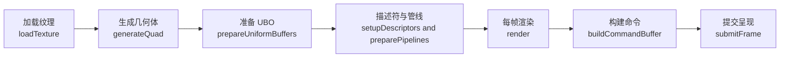
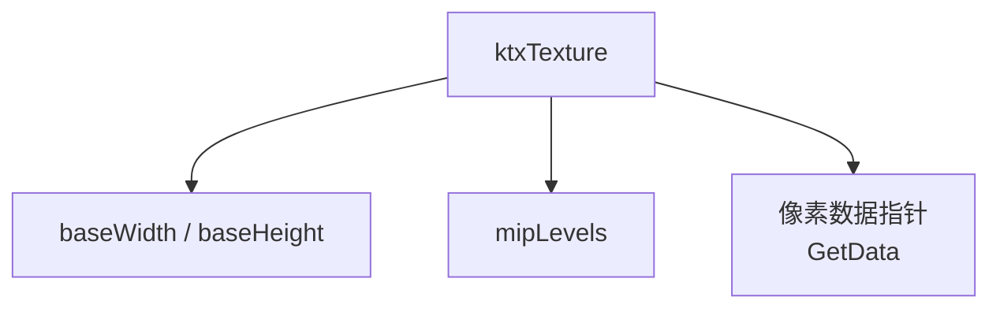
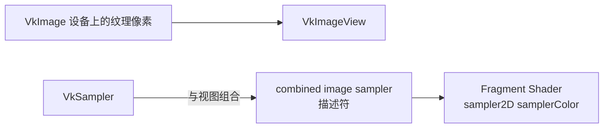
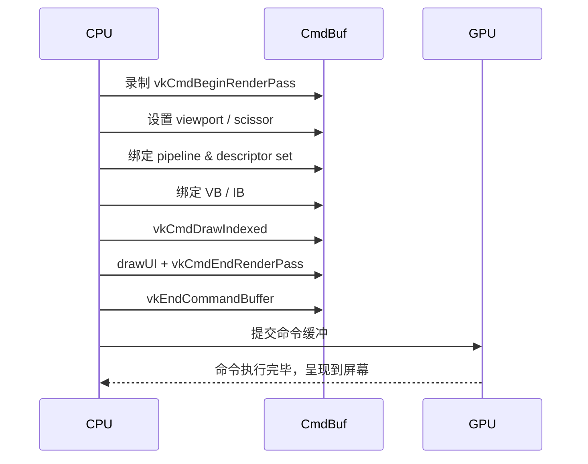

## Vulkan 示例 `texture.cpp` 案例详解

本案例展示了在 Vulkan 中如何加载一张 2D 纹理（含 mipmap），上传到 GPU，并通过一个简单的矩形（quad）在屏幕上显示出来。下面从整体流程、关键数据结构、纹理上传、渲染管线和指令录制几个角度进行分析，并配合示意图帮助理解。

---

## 一、整体流程总览

运行时的主要调用顺序（省略窗口和基础设施初始化）：

1. 创建 `VulkanExample`，在构造函数中配置相机。
2. `prepare()`：
   - `loadTexture()`：从 KTX 文件加载纹理并上传到 GPU。
   - `generateQuad()`：创建绘制纹理用的矩形顶点/索引缓冲。
   - `prepareUniformBuffers()`：为每帧创建 UBO。
   - `setupDescriptors()`：创建描述符池、布局和描述符集，将 UBO 和纹理绑定到着色器。
   - `preparePipelines()`：创建图形管线（VS/FS、顶点输入、光栅化等）。
3. 每帧 `render()`：
   - `prepareFrame()`：获得当前可用的交换链图像/帧索引。
   - `updateUniformBuffers()`：更新相机矩阵和 LOD 偏移到当前帧的 UBO。
   - `buildCommandBuffer()`：为当前帧重建绘制命令缓冲。
   - `submitFrame()`：提交命令缓冲，呈现到屏幕。

用一个简单的“模块关系图”来形象表示：



---

## 二、关键数据结构

### 1. 顶点结构 `Vertex`

```cpp
struct Vertex {
    float pos[3];
    float uv[2];
    float normal[3];
};
```

- **`pos`**：顶点位置（NDC 前的模型空间/世界空间位置，最终会乘上 MVP）。
- **`uv`**：纹理坐标，对应片元着色器采样 `sampler2D` 时的输入。
- **`normal`**：法线，用于简单光照（此例中矩形法线统一指向 +Z）。

### 2. 纹理对象 `Texture`

```cpp
struct Texture {
    VkSampler sampler;
    VkImage image;
    VkImageLayout imageLayout;
    VkDeviceMemory deviceMemory;
    VkImageView view;
    uint32_t width;
    uint32_t height;
    uint32_t mipLevels;
} texture;
```

- **`VkImage` + `VkDeviceMemory`**：真正存储像素数据的 GPU 图像与其显存。
- **`VkImageView`**：着色器访问图像的“视图”，可指定 mip 范围、array layer 等。
- **`VkSampler`**：采样规则（过滤、寻址模式、各向异性、lod 范围等）。
- **`imageLayout`**：当前图像布局，本例最终是 `VK_IMAGE_LAYOUT_SHADER_READ_ONLY_OPTIMAL`。

### 3. Uniform 数据 `UniformData`

```cpp
struct UniformData {
    glm::mat4 projection;
    glm::mat4 modelView;
    glm::vec4 viewPos;
    float lodBias = 0.0f;
} uniformData;
```

- **`projection`**：透视投影矩阵。
- **`modelView`**：模型视图矩阵（此例中主要是相机 view）。
- **`viewPos`**：相机位置，用于光照或其他效果。
- **`lodBias`**：控制片元着色器里的 mip 级别偏移，用于观察 mipmap 变化。

UI 叠加层中可以实时调节 `lodBias`：

```cpp
overlay->sliderFloat("LOD bias", &uniformData.lodBias, 0.0f, (float)texture.mipLevels);
```

---

## 三、纹理加载与上传 `loadTexture()`

### 1. 加载 KTX 文件

```cpp
std::string filename = getAssetPath() + "textures/metalplate01_rgba.ktx";
VkFormat format = VK_FORMAT_R8G8B8A8_UNORM;

ktxTexture* ktxTexture;
result = ktxTexture_CreateFromNamedFile(filename.c_str(),
    KTX_TEXTURE_CREATE_LOAD_IMAGE_DATA_BIT, &ktxTexture);
```

- 使用 Khronos 的 KTX 容器格式。
- `ktxTexture` 内部已经包含了所有 mip level 的像素数据。
- 从 `ktxTexture` 中读取基本属性：

```cpp
texture.width     = ktxTexture->baseWidth;
texture.height    = ktxTexture->baseHeight;
texture.mipLevels = ktxTexture->numLevels;
ktx_uint8_t* ktxTextureData = ktxTexture_GetData(ktxTexture);
ktx_size_t ktxTextureSize   = ktxTexture_GetSize(ktxTexture);
```

可用“纹理数据结构图”示意 KTX 的内容：



### 2. 使用 Staging Buffer 上传到 Optimal Tiled Image

示例中默认走 **staging 路径**（`useStaging = true`）：

1. **创建 staging buffer**（主机可见）并将 KTX 数据拷贝进去：

   ```cpp
   VkBuffer stagingBuffer;
   VkDeviceMemory stagingMemory;

   bufferCreateInfo.size  = ktxTextureSize;
   bufferCreateInfo.usage = VK_BUFFER_USAGE_TRANSFER_SRC_BIT;
   vkCreateBuffer(..., &stagingBuffer);
   vkGetBufferMemoryRequirements(..., &memReqs);
   memAllocInfo.memoryTypeIndex =
       vulkanDevice->getMemoryType(memReqs.memoryTypeBits,
           VK_MEMORY_PROPERTY_HOST_VISIBLE_BIT |
           VK_MEMORY_PROPERTY_HOST_COHERENT_BIT);
   vkAllocateMemory(..., &stagingMemory);
   vkBindBufferMemory(device, stagingBuffer, stagingMemory, 0);

   vkMapMemory(..., (void**)&data);
   memcpy(data, ktxTextureData, ktxTextureSize);
   vkUnmapMemory(device, stagingMemory);
   ```

2. **为每个 mip level 填写 `VkBufferImageCopy`**：

   ```cpp
   std::vector<VkBufferImageCopy> bufferCopyRegions;
   for (uint32_t i = 0; i < texture.mipLevels; i++) {
       ktx_size_t offset;
       ktxTexture_GetImageOffset(ktxTexture, i, 0, 0, &offset);

       VkBufferImageCopy region{};
       region.imageSubresource.aspectMask = VK_IMAGE_ASPECT_COLOR_BIT;
       region.imageSubresource.mipLevel   = i;
       region.imageSubresource.layerCount = 1;
       region.imageExtent.width  = ktxTexture->baseWidth  >> i;
       region.imageExtent.height = ktxTexture->baseHeight >> i;
       region.imageExtent.depth  = 1;
       region.bufferOffset       = offset;
       bufferCopyRegions.push_back(region);
   }
   ```

3. **创建 GPU 上的 optimal tiled `VkImage`**：

   ```cpp
   VkImageCreateInfo imageCreateInfo = vks::initializers::imageCreateInfo();
   imageCreateInfo.imageType   = VK_IMAGE_TYPE_2D;
   imageCreateInfo.format      = format;
   imageCreateInfo.mipLevels   = texture.mipLevels;
   imageCreateInfo.arrayLayers = 1;
   imageCreateInfo.samples     = VK_SAMPLE_COUNT_1_BIT;
   imageCreateInfo.tiling      = VK_IMAGE_TILING_OPTIMAL;
   imageCreateInfo.usage       = VK_IMAGE_USAGE_TRANSFER_DST_BIT |
                                 VK_IMAGE_USAGE_SAMPLED_BIT;
   imageCreateInfo.initialLayout = VK_IMAGE_LAYOUT_UNDEFINED;
   imageCreateInfo.extent = { texture.width, texture.height, 1 };
   vkCreateImage(device, &imageCreateInfo, nullptr, &texture.image);
   ```

   然后分配 `VK_MEMORY_PROPERTY_DEVICE_LOCAL_BIT` 的显存并绑定。

4. **两次布局转换 + 拷贝：**

   - 第一次：`UNDEFINED` → `TRANSFER_DST_OPTIMAL`（准备接收拷贝）。
   - 调用 `vkCmdCopyBufferToImage`，把所有 mip level 从 staging buffer 拷贝到 image。
   - 第二次：`TRANSFER_DST_OPTIMAL` → `SHADER_READ_ONLY_OPTIMAL`（供着色器采样）。

布局转换的指令（只展示关键字段）：

```cpp
VkImageSubresourceRange subresourceRange{};
subresourceRange.aspectMask  = VK_IMAGE_ASPECT_COLOR_BIT;
subresourceRange.baseMipLevel = 0;
subresourceRange.levelCount   = texture.mipLevels;
subresourceRange.layerCount   = 1;

VkImageMemoryBarrier barrier = vks::initializers::imageMemoryBarrier();
barrier.image          = texture.image;
barrier.subresourceRange = subresourceRange;
barrier.srcAccessMask  = 0;
barrier.dstAccessMask  = VK_ACCESS_TRANSFER_WRITE_BIT;
barrier.oldLayout      = VK_IMAGE_LAYOUT_UNDEFINED;
barrier.newLayout      = VK_IMAGE_LAYOUT_TRANSFER_DST_OPTIMAL;

vkCmdPipelineBarrier(copyCmd,
    VK_PIPELINE_STAGE_HOST_BIT,
    VK_PIPELINE_STAGE_TRANSFER_BIT,
    0, 0, nullptr, 0, nullptr, 1, &barrier);
```

### 3. 采样器与图像视图

创建采样器：

```cpp
VkSamplerCreateInfo sampler = vks::initializers::samplerCreateInfo();
sampler.magFilter    = VK_FILTER_LINEAR;
sampler.minFilter    = VK_FILTER_LINEAR;
sampler.mipmapMode   = VK_SAMPLER_MIPMAP_MODE_LINEAR;
sampler.addressModeU = VK_SAMPLER_ADDRESS_MODE_REPEAT;
sampler.addressModeV = VK_SAMPLER_ADDRESS_MODE_REPEAT;
sampler.addressModeW = VK_SAMPLER_ADDRESS_MODE_REPEAT;
sampler.minLod       = 0.0f;
sampler.maxLod       = (useStaging) ? (float)texture.mipLevels : 0.0f;
if (vulkanDevice->features.samplerAnisotropy) {
    sampler.maxAnisotropy = vulkanDevice->properties.limits.maxSamplerAnisotropy;
    sampler.anisotropyEnable = VK_TRUE;
}
vkCreateSampler(device, &sampler, nullptr, &texture.sampler);
```

创建图像视图：

```cpp
VkImageViewCreateInfo view = vks::initializers::imageViewCreateInfo();
view.viewType = VK_IMAGE_VIEW_TYPE_2D;
view.format   = format;
view.subresourceRange.aspectMask     = VK_IMAGE_ASPECT_COLOR_BIT;
view.subresourceRange.baseMipLevel   = 0;
view.subresourceRange.levelCount     = (useStaging) ? texture.mipLevels : 1;
view.subresourceRange.baseArrayLayer = 0;
view.subresourceRange.layerCount     = 1;
view.image = texture.image;
vkCreateImageView(device, &view, nullptr, &texture.view);
```

可以用一张“小组件关系示意图”理解采样路径：



---

## 四、矩形几何体与顶点输入

### 1. `generateQuad()`：创建顶点/索引缓冲

- 定义了一个覆盖 [-1,1]² 的矩形，UV 范围 [0,1]：

```cpp
std::vector<Vertex> vertices = {
    { {  1.0f,  1.0f, 0.0f }, { 1.0f, 1.0f }, { 0.0f, 0.0f, 1.0f } },
    { { -1.0f,  1.0f, 0.0f }, { 0.0f, 1.0f }, { 0.0f, 0.0f, 1.0f } },
    { { -1.0f, -1.0f, 0.0f }, { 0.0f, 0.0f }, { 0.0f, 0.0f, 1.0f } },
    { {  1.0f, -1.0f, 0.0f }, { 1.0f, 0.0f }, { 0.0f, 0.0f, 1.0f } }
};

std::vector<uint32_t> indices = { 0, 1, 2, 2, 3, 0 };
```

- 先创建主机可见的 staging buffer，把数据写进去，再拷贝到设备本地缓冲。
- 顶点缓冲使用 `VK_BUFFER_USAGE_VERTEX_BUFFER_BIT | VK_BUFFER_USAGE_TRANSFER_DST_BIT`，索引类似。

### 2. 顶点输入布局 `preparePipelines()` 中配置

```cpp
std::vector<VkVertexInputBindingDescription> vertexInputBindings = {
    vks::initializers::vertexInputBindingDescription(
        0, sizeof(Vertex), VK_VERTEX_INPUT_RATE_VERTEX)
};

std::vector<VkVertexInputAttributeDescription> vertexInputAttributes = {
    vks::initializers::vertexInputAttributeDescription(
        0, 0, VK_FORMAT_R32G32B32_SFLOAT, offsetof(Vertex, pos)),
    vks::initializers::vertexInputAttributeDescription(
        0, 1, VK_FORMAT_R32G32_SFLOAT,    offsetof(Vertex, uv)),
    vks::initializers::vertexInputAttributeDescription(
        0, 2, VK_FORMAT_R32G32B32_SFLOAT, offsetof(Vertex, normal)),
};
```

- 绑定槽 `binding = 0`，一次读取一个 `Vertex`。
- attribute 0 / 1 / 2 分别对应 VS 输入位置、UV、法线。

---

## 五、描述符与管线

### 1. 描述符布局与池 `setupDescriptors()`

- 描述符池：为 **每帧** 提供一个 UBO + 一个 combined image sampler。

```cpp
std::vector<VkDescriptorPoolSize> poolSizes = {
    vks::initializers::descriptorPoolSize(
        VK_DESCRIPTOR_TYPE_UNIFORM_BUFFER, maxConcurrentFrames),
    vks::initializers::descriptorPoolSize(
        VK_DESCRIPTOR_TYPE_COMBINED_IMAGE_SAMPLER, maxConcurrentFrames)
};
```

- 描述符集布局：`binding 0` 是 VS 的 UBO，`binding 1` 是 FS 的 combined image sampler。

```cpp
std::vector<VkDescriptorSetLayoutBinding> setLayoutBindings = {
    vks::initializers::descriptorSetLayoutBinding(
        VK_DESCRIPTOR_TYPE_UNIFORM_BUFFER, VK_SHADER_STAGE_VERTEX_BIT,   0),
    vks::initializers::descriptorSetLayoutBinding(
        VK_DESCRIPTOR_TYPE_COMBINED_IMAGE_SAMPLER, VK_SHADER_STAGE_FRAGMENT_BIT, 1)
};
```

- 为每个帧的 UBO 分配一个 descriptor set，但共享同一个纹理 image/sampler：

```cpp
VkDescriptorImageInfo textureDescriptor{};
textureDescriptor.imageView   = texture.view;
textureDescriptor.sampler     = texture.sampler;
textureDescriptor.imageLayout = texture.imageLayout;

for (auto i = 0; i < uniformBuffers.size(); i++) {
    vkAllocateDescriptorSets(device, &allocInfo, &descriptorSets[i]);

    std::vector<VkWriteDescriptorSet> writes = {
        vks::initializers::writeDescriptorSet(
            descriptorSets[i], VK_DESCRIPTOR_TYPE_UNIFORM_BUFFER,
            0, &uniformBuffers[i].descriptor),
        vks::initializers::writeDescriptorSet(
            descriptorSets[i], VK_DESCRIPTOR_TYPE_COMBINED_IMAGE_SAMPLER,
            1, &textureDescriptor)
    };
    vkUpdateDescriptorSets(device,
        static_cast<uint32_t>(writes.size()), writes.data(), 0, nullptr);
}
```

### 2. 图形管线 `preparePipelines()`

- 主要固定功能配置：
  - 输入装配：三角形列表。
  - 光栅化：背面不裁剪，填充模式。
  - 深度测试：开。
  - 颜色混合：关闭混合。
  - 动态状态：viewport/scissor 动态设置。

```cpp
VkPipelineInputAssemblyStateCreateInfo inputAssemblyState =
    vks::initializers::pipelineInputAssemblyStateCreateInfo(
        VK_PRIMITIVE_TOPOLOGY_TRIANGLE_LIST, 0, VK_FALSE);

VkPipelineRasterizationStateCreateInfo rasterizationState =
    vks::initializers::pipelineRasterizationStateCreateInfo(
        VK_POLYGON_MODE_FILL, VK_CULL_MODE_NONE,
        VK_FRONT_FACE_COUNTER_CLOCKWISE, 0);
```

- 着色器阶段加载：

```cpp
shaderStages[0] = loadShader(getShadersPath() + "texture/texture.vert.spv",
                             VK_SHADER_STAGE_VERTEX_BIT);
shaderStages[1] = loadShader(getShadersPath() + "texture/texture.frag.spv",
                             VK_SHADER_STAGE_FRAGMENT_BIT);
```

最终用 `vkCreateGraphicsPipelines` 创建单条管线。

---

## 六、Uniform 缓冲与更新

### 1. 创建 UBO `prepareUniformBuffers()`

```cpp
for (auto& buffer : uniformBuffers) {
    vulkanDevice->createBuffer(
        VK_BUFFER_USAGE_UNIFORM_BUFFER_BIT,
        VK_MEMORY_PROPERTY_HOST_VISIBLE_BIT |
        VK_MEMORY_PROPERTY_HOST_COHERENT_BIT,
        &buffer, sizeof(UniformData), &uniformData);
    buffer.map();
}
```

- 每帧一个 UBO，使用 host-visible + coherent 内存，简化更新。
- 预先 `map()`，后续每帧只需要 `memcpy`。

### 2. 每帧更新数据 `updateUniformBuffers()`

```cpp
uniformData.projection = camera.matrices.perspective;
uniformData.modelView  = camera.matrices.view;
uniformData.viewPos    = camera.viewPos;
memcpy(uniformBuffers[currentBuffer].mapped,
       &uniformData, sizeof(uniformData));
```

- `currentBuffer` 与 swapchain 的当前帧索引关联，实现多帧并行时的资源解耦。

---

## 七、命令缓冲录制与绘制

### 1. `buildCommandBuffer()`

核心步骤：

1. **开始命令缓冲 / render pass**：

   ```cpp
   vkBeginCommandBuffer(cmdBuffer, &cmdBufInfo);
   vkCmdBeginRenderPass(cmdBuffer, &renderPassBeginInfo,
                        VK_SUBPASS_CONTENTS_INLINE);
   ```

2. **设置 viewport & scissor**：

   ```cpp
   VkViewport viewport = vks::initializers::viewport(
       (float)width, (float)height, 0.0f, 1.0f);
   vkCmdSetViewport(cmdBuffer, 0, 1, &viewport);

   VkRect2D scissor = vks::initializers::rect2D(width, height, 0, 0);
   vkCmdSetScissor(cmdBuffer, 0, 1, &scissor);
   ```

3. **绑定描述符集与管线**：

   ```cpp
   vkCmdBindDescriptorSets(
       cmdBuffer, VK_PIPELINE_BIND_POINT_GRAPHICS,
       pipelineLayout, 0, 1, &descriptorSets[currentBuffer], 0, nullptr);
   vkCmdBindPipeline(
       cmdBuffer, VK_PIPELINE_BIND_POINT_GRAPHICS, pipeline);
   ```

4. **绑定顶点/索引缓冲 + DrawIndexed**：

   ```cpp
   VkDeviceSize offsets[1] = { 0 };
   vkCmdBindVertexBuffers(cmdBuffer, 0, 1, &vertexBuffer.buffer, offsets);
   vkCmdBindIndexBuffer(cmdBuffer, indexBuffer.buffer, 0, VK_INDEX_TYPE_UINT32);
   vkCmdDrawIndexed(cmdBuffer, indexCount, 1, 0, 0, 0);
   ```

5. **绘制 UI / 结束 render pass 和命令缓冲**：

   ```cpp
   drawUI(cmdBuffer);
   vkCmdEndRenderPass(cmdBuffer);
   vkEndCommandBuffer(cmdBuffer);
   ```

可以用一个“渲染命令流水图”表示：



---

## 八、与 Shader 的对应关系（简要）

虽然源码中 shader 是编译后的 `.vert.spv` / `.frag.spv`，但从描述符绑定可推断典型的 GLSL 结构大致如下（伪代码）：

```glsl
// texture.vert (概念示意)
layout (binding = 0) uniform UBO {
    mat4 projection;
    mat4 modelView;
    vec4 viewPos;
    float lodBias;
} ubo;

layout (location = 0) in vec3 inPos;
layout (location = 1) in vec2 inUV;
layout (location = 2) in vec3 inNormal;

layout (location = 0) out vec2 outUV;

void main() {
    gl_Position = ubo.projection * ubo.modelView * vec4(inPos, 1.0);
    outUV = inUV;
}
```

```glsl
// texture.frag (概念示意)
layout (binding = 1) uniform sampler2D samplerColor;

layout (location = 0) in vec2 inUV;
layout (location = 0) out vec4 outColor;

void main() {
    // 可用 textureLod 或 bias 来观察 mipmaps
    outColor = texture(samplerColor, inUV);
}
```

---

## 九、小结：这个示例教会了什么？

- **纹理资源完整链路**：从磁盘 KTX → CPU 内存 → staging buffer → optimal tiled `VkImage` → `VkImageView` + `VkSampler` → combined image sampler 描述符 → 片元着色器采样。
- **mipmap / LOD**：通过 `lodBias` 配合 UI 动态修改 mipmap 级别，对理解多级纹理非常直观。
- **分离资源与访问**：图像本体、图像视图、采样器三者分离，使得同一图像可以通过不同视图/采样器实现多种效果。
- **多帧并行资源管理**：UBO per-frame + 共享纹理的模式，是 Vulkan 中常见的资源管理实践。

如果你想在此基础上扩展，可以尝试：

- 替换成自己的 KTX 纹理并观察 mipmap 效果；
- 在片元着色器中显式使用 `textureLod` 与 `lodBias` 做 debug 可视化；
- 添加法线贴图、镜面贴图等，扩展为一个简单的 PBR/Blinn-Phong 示例。


