# Multithreading 案例分析文档

## 目录
1. [概述](#概述)
2. [多线程渲染架构](#多线程渲染架构)
3. [核心数据结构](#核心数据结构)
4. [程序执行流程](#程序执行流程)
5. [命令缓冲区系统](#命令缓冲区系统)
6. [多线程命令录制详解](#多线程命令录制详解)
7. [视锥剔除系统](#视锥剔除系统)
8. [关键技术点总结](#关键技术点总结)

---

## 概述

`multithreading` 案例展示了 Vulkan 多线程命令缓冲区生成的最佳实践。该案例通过使用线程池并行生成次级命令缓冲区，实现了高效的渲染命令录制，适合渲染大量对象的场景。

### 核心特点

- **多线程并行录制**：使用线程池并行生成命令缓冲区
- **每个线程独立命令池**：每个工作线程拥有自己的命令池，避免线程同步问题
- **次级命令缓冲区**：使用次级命令缓冲区支持并行录制
- **视锥剔除优化**：在每个线程中进行视锥剔除，减少无效绘制
- **Push Constants**：使用 Push Constants 避免描述符集更新开销

### 渲染场景

- 总共渲染 **512 个** UFO 模型对象
- 每个线程负责约 **512/numThreads** 个对象
- 支持多帧并发渲染（maxConcurrentFrames = 2）
- 每个对象都有独立的动画（旋转、位置、缩放）

---

## 多线程渲染架构

### 整体架构图

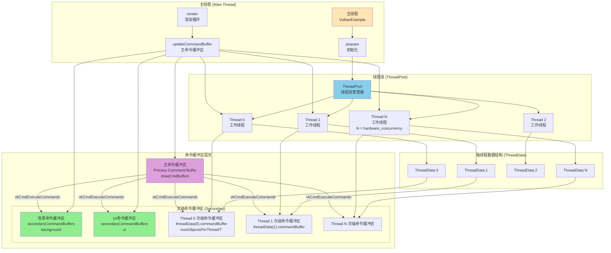

### 多线程命令录制架构

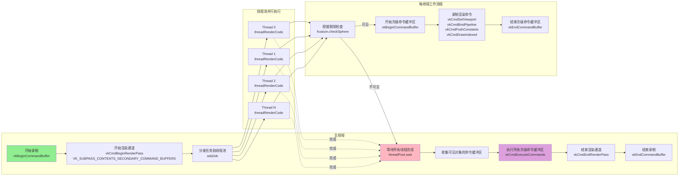

---

## 核心数据结构

### ThreadData 结构

每个工作线程都有独立的数据结构，避免线程间的数据竞争：

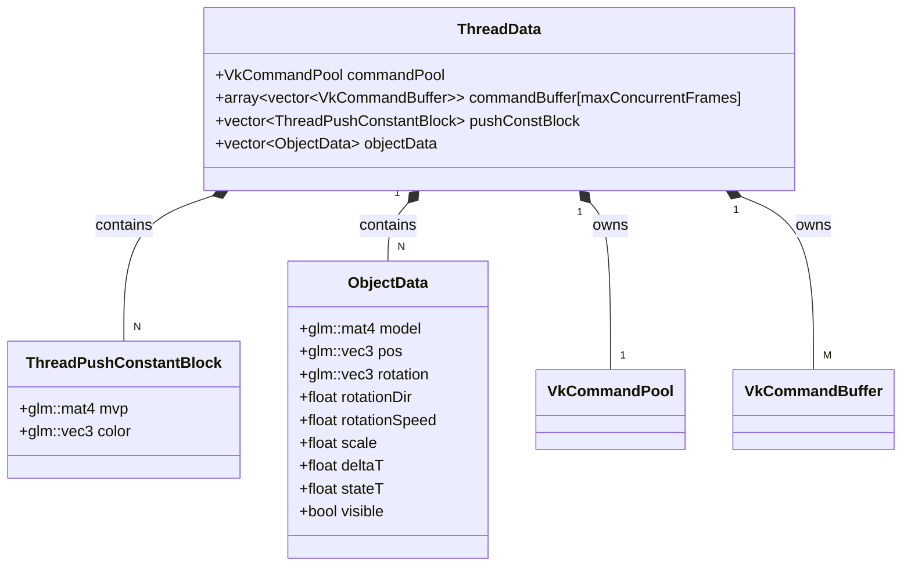

### 数据结构关系图

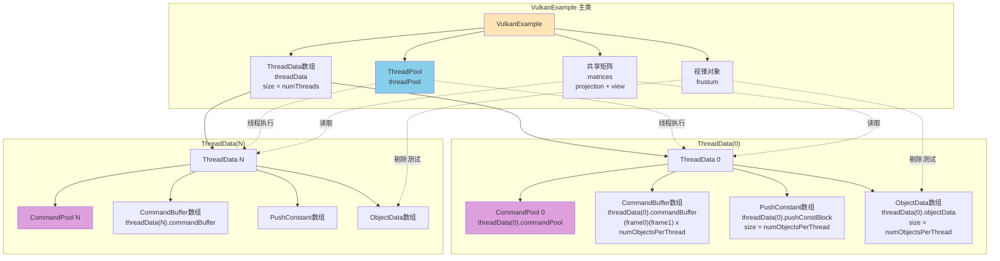

---

## 程序执行流程

### 初始化流程

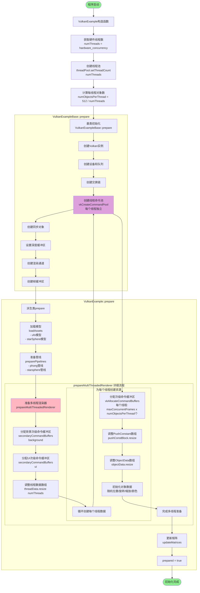

### 渲染循环流程

```mermaid
flowchart TD
    Start([render函数开始]) --> CheckPrep{prepared?}
    CheckPrep -->|否| Return([直接返回])
    CheckPrep -->|是| PrepareFrame[基类prepareFrame<br/>- 等待栅栏<br/>- 获取交换链图像<br/>- 重置栅栏]
    
    PrepareFrame --> UpdateCmd[updateCommandBuffer<br/>更新命令缓冲区]
    
    subgraph "updateCommandBuffer 详细流程"
        UpdateCmd --> BeginPrimary["开始主命令缓冲区<br/>vkBeginCommandBuffer<br/>drawCmdBuffers(currentBuffer)"]
        
        BeginPrimary --> SetupRP["设置渲染通道信息<br/>VkRenderPassBeginInfo<br/>- renderPass<br/>- framebuffer(currentImageIndex)<br/>- clearValues"]
        
        SetupRP --> BeginRP[开始渲染通道<br/>vkCmdBeginRenderPass<br/>VK_SUBPASS_CONTENTS_SECONDARY_COMMAND_BUFFERS]
        
        BeginRP --> SetupInherit[设置继承信息<br/>VkCommandBufferInheritanceInfo<br/>- renderPass<br/>- framebuffer]
        
        SetupInherit --> UpdateSec[更新场景次级命令缓冲区<br/>updateSecondaryCommandBuffers<br/>- 背景命令缓冲区<br/>- UI命令缓冲区]
        
        UpdateSec --> AddBackground{显示背景?}
        AddBackground -->|是| PushBG["添加背景命令缓冲区<br/>commandBuffers.push_back<br/>secondaryCommandBuffers(currentBuffer).background"]
        AddBackground -->|否| DistributeJobs
        
        PushBG --> DistributeJobs["分发任务到线程池<br/>for each thread:<br/>  for each object:<br/>    threadPool.threads(t)->addJob<br/>    threadRenderCode(t, i, inheritanceInfo)"]
        
        DistributeJobs --> WaitThreads[等待所有线程完成<br/>threadPool.wait]
        
        WaitThreads --> CollectVisible["收集可见对象的命令缓冲区<br/>for each thread:<br/>  for each object:<br/>    if objectData.visible:<br/>      commandBuffers.push_back<br/>      commandBuffer(currentBuffer)(i)"]
        
        CollectVisible --> AddUI{UI可见?}
        AddUI -->|是| PushUI["添加UI命令缓冲区<br/>commandBuffers.push_back<br/>secondaryCommandBuffers(currentBuffer).ui"]
        AddUI -->|否| Execute
        
        PushUI --> Execute["执行所有次级命令缓冲区<br/>vkCmdExecuteCommands<br/>drawCmdBuffers(currentBuffer)<br/>commandBuffers数组"]
        
        Execute --> EndRP[结束渲染通道<br/>vkCmdEndRenderPass]
        
        EndRP --> EndPrimary[结束主命令缓冲区<br/>vkEndCommandBuffer]
    end
    
    EndPrimary --> UpdateMatrices[updateMatrices<br/>更新投影和视图矩阵<br/>更新视锥]
    
    UpdateMatrices --> SubmitFrame[基类submitFrame<br/>- 提交到队列<br/>- 呈现图像<br/>- 更新currentFrame]
    
    SubmitFrame --> End([render函数结束])
    
    style Start fill:#90EE90
    style End fill:#90EE90
    style DistributeJobs fill:#FFB6C1
    style WaitThreads fill:#87CEEB
    style Execute fill:#DDA0DD
```

### 多线程命令录制详细流程

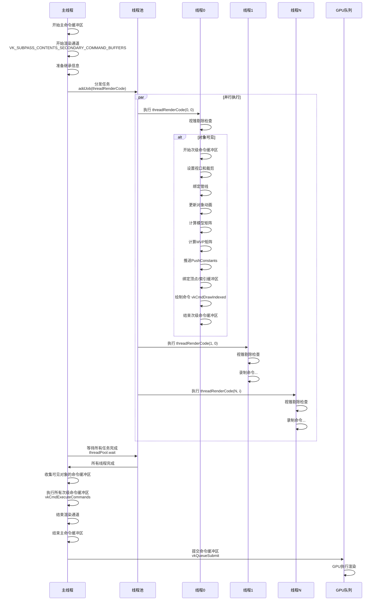

---

## 命令缓冲区系统

### 命令缓冲区层次结构

```mermaid
graph TB
    subgraph "主命令缓冲区 (Primary)"
        Primary["主命令缓冲区<br/>drawCmdBuffers(currentBuffer)<br/>VK_COMMAND_BUFFER_LEVEL_PRIMARY"]
    end
    
    subgraph "次级命令缓冲区 (Secondary) - 场景"
        SecBG["背景命令缓冲区<br/>secondaryCommandBuffers(currentBuffer).background<br/>VK_COMMAND_BUFFER_LEVEL_SECONDARY"]
        SecUI["UI命令缓冲区<br/>secondaryCommandBuffers(currentBuffer).ui<br/>VK_COMMAND_BUFFER_LEVEL_SECONDARY"]
    end
    
    subgraph "次级命令缓冲区 (Secondary) - 线程0"
        SecT0_0["Thread 0 Object 0<br/>threadData(0).commandBuffer(currentBuffer)(0)"]
        SecT0_1["Thread 0 Object 1<br/>threadData(0).commandBuffer(currentBuffer)(1)"]
        SecT0_N["Thread 0 Object N<br/>threadData(0).commandBuffer(currentBuffer)(numObjectsPerThread-1)"]
    end
    
    subgraph "次级命令缓冲区 (Secondary) - 线程N"
        SecTN_0["Thread N Object 0<br/>threadData(N).commandBuffer(currentBuffer)(0)"]
        SecTN_N["Thread N Object M<br/>threadData(N).commandBuffer(currentBuffer)(numObjectsPerThread-1)"]
    end
    
    Primary -->|vkCmdExecuteCommands| SecBG
    Primary -->|vkCmdExecuteCommands| SecUI
    Primary -->|vkCmdExecuteCommands| SecT0_0
    Primary -->|vkCmdExecuteCommands| SecT0_1
    Primary -->|vkCmdExecuteCommands| SecT0_N
    Primary -->|vkCmdExecuteCommands| SecTN_0
    Primary -->|vkCmdExecuteCommands| SecTN_N
    
    style Primary fill:#FFE4B5
    style SecBG fill:#90EE90
    style SecUI fill:#90EE90
    style SecT0_0 fill:#87CEEB
    style SecTN_0 fill:#87CEEB
```

### 命令缓冲区分配图

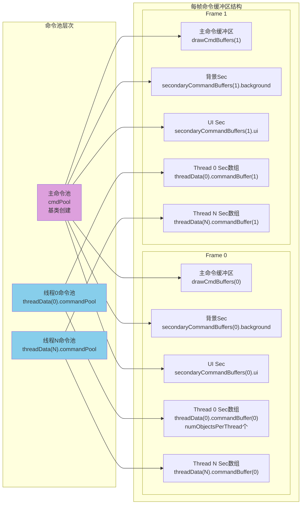

### 命令缓冲区使用时间线

```mermaid
gantt
    title 命令缓冲区录制和执行时间线 (假设4个线程，每线程128个对象)
    dateFormat X
    axisFormat %s
    
    section 主线程
    开始主命令缓冲区 :0, 1s
    开始渲染通道 :1, 1s
    分发任务到线程池 :2, 1s
    等待线程完成 :3, 50s
    收集命令缓冲区 :53, 1s
    执行次级命令缓冲区 :54, 1s
    结束渲染通道 :55, 1s
    提交到GPU :56, 1s
    
    section 线程0
    视锥剔除和录制(128个对象) :2, 25s
    
    section 线程1
    视锥剔除和录制(128个对象) :2, 25s
    
    section 线程2
    视锥剔除和录制(128个对象) :2, 28s
    
    section 线程3
    视锥剔除和录制(128个对象) :2, 30s
    
    section GPU执行
    GPU执行渲染 :57, 10s
```

---

## 多线程命令录制详解

### threadRenderCode 函数详细流程

`threadRenderCode` 是每个线程执行的核心函数，负责为单个对象录制渲染命令：

```mermaid
flowchart TD
    Start([threadRenderCode开始<br/>threadIndex, cmdBufferIndex, inheritanceInfo]) --> GetThread["获取线程数据<br/>thread = threadData(threadIndex)"]
    
    GetThread --> GetObject["获取对象数据<br/>objectData = thread->objectData(cmdBufferIndex)"]
    
    GetObject --> FrustumCull[视锥剔除检查<br/>frustum.checkSphere<br/>objectData->pos, radius]
    
    FrustumCull -->|不可见| SetInvisible[设置可见标志<br/>objectData->visible = false]
    SetInvisible --> Return([直接返回])
    
    FrustumCull -->|可见| SetVisible[设置可见标志<br/>objectData->visible = true]
    
    SetVisible --> SetupBeginInfo[设置命令缓冲区开始信息<br/>VkCommandBufferBeginInfo<br/>- flags: RENDER_PASS_CONTINUE_BIT<br/>- pInheritanceInfo: inheritanceInfo]
    
    SetupBeginInfo --> GetCmdBuf["获取命令缓冲区<br/>cmdBuffer = thread->commandBuffer<br/>(currentBuffer)(cmdBufferIndex)"]
    
    GetCmdBuf --> BeginCmd[开始命令缓冲区<br/>vkBeginCommandBuffer<br/>cmdBuffer]
    
    BeginCmd --> SetViewport[设置视口<br/>vkCmdSetViewport<br/>width x height]
    
    SetViewport --> SetScissor[设置裁剪矩形<br/>vkCmdSetScissor<br/>width x height]
    
    SetScissor --> BindPipeline[绑定图形管线<br/>vkCmdBindPipeline<br/>pipelines.phong]
    
    BindPipeline --> UpdateAnimation{暂停?}
    
    UpdateAnimation -->|否| CalcRotation["计算旋转<br/>rotation.y += rotationSpeed * frameTimer"]
    CalcRotation --> CalcDeltaT["计算deltaT<br/>deltaT += 0.15f * frameTimer"]
    CalcDeltaT --> CalcPosY["计算Y位置<br/>pos.y = sin(deltaT * 360°) * 2.5f"]
    
    CalcPosY --> BuildModel
    UpdateAnimation -->|是| BuildModel["构建模型矩阵<br/>model = translate * rotate * scale"]
    
    BuildModel --> CalcMVP["计算MVP矩阵<br/>mvp = projection * view * model"]
    
    CalcMVP --> PushConstants[推送PushConstants<br/>vkCmdPushConstants<br/>- mvp矩阵<br/>- color颜色]
    
    PushConstants --> BindVertex[绑定顶点缓冲区<br/>vkCmdBindVertexBuffers<br/>models.ufo.vertices.buffer]
    
    BindVertex --> BindIndex[绑定索引缓冲区<br/>vkCmdBindIndexBuffer<br/>models.ufo.indices.buffer]
    
    BindIndex --> Draw[绘制命令<br/>vkCmdDrawIndexed<br/>indices.count个索引]
    
    Draw --> EndCmd[结束命令缓冲区<br/>vkEndCommandBuffer]
    
    EndCmd --> End([函数结束])
    
    style Start fill:#90EE90
    style FrustumCull fill:#FFB6C1
    style BuildModel fill:#87CEEB
    style Draw fill:#DDA0DD
    style End fill:#90EE90
```

### 命令录制内容示例

每个次级命令缓冲区包含以下命令序列：

```
vkBeginCommandBuffer (VK_COMMAND_BUFFER_USAGE_RENDER_PASS_CONTINUE_BIT)
  ↓
vkCmdSetViewport
  ↓
vkCmdSetScissor
  ↓
vkCmdBindPipeline (VK_PIPELINE_BIND_POINT_GRAPHICS, phong pipeline)
  ↓
vkCmdPushConstants (mvp矩阵 + color颜色)
  ↓
vkCmdBindVertexBuffers (UFO模型顶点缓冲区)
  ↓
vkCmdBindIndexBuffer (UFO模型索引缓冲区)
  ↓
vkCmdDrawIndexed (绘制索引图元)
  ↓
vkEndCommandBuffer
```

---

## 视锥剔除系统

### 视锥剔除流程图

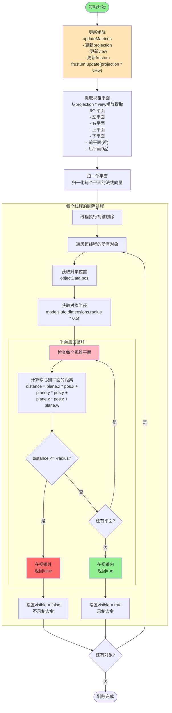

### 视锥剔除原理图

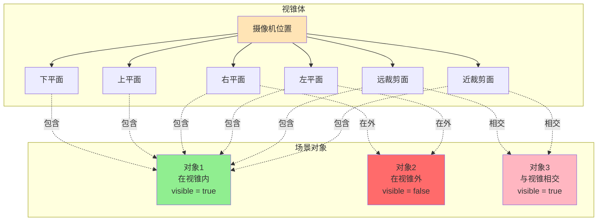

### 视锥剔除算法

每个对象使用球体进行视锥剔除测试：

```
算法: checkSphere(pos, radius)
  对于每个视锥平面 plane (共6个):
    计算球心到平面的距离:
      distance = plane.x * pos.x + plane.y * pos.y + plane.z * pos.z + plane.w
    
    如果 distance <= -radius:
      返回 false (球体完全在视锥外)
  
  返回 true (球体在视锥内或与视锥相交)
```

---

## 关键技术点总结

### 1. 多线程命令录制策略

#### 关键设计点

- **每个线程独立命令池**：避免命令池的线程同步开销
  ```cpp
  // 每个线程都有独立的命令池
  VkCommandPoolCreateInfo cmdPoolInfo = ...;
  cmdPoolInfo.queueFamilyIndex = swapChain.queueNodeIndex;
  cmdPoolInfo.flags = VK_COMMAND_POOL_CREATE_RESET_COMMAND_BUFFER_BIT;
  vkCreateCommandPool(device, &cmdPoolInfo, nullptr, &thread->commandPool);
  ```

- **使用次级命令缓冲区**：支持并行录制，然后在主线程中执行
  ```cpp
  // 次级命令缓冲区标志
  VkCommandBufferBeginInfo commandBufferBeginInfo = ...;
  commandBufferBeginInfo.flags = VK_COMMAND_BUFFER_USAGE_RENDER_PASS_CONTINUE_BIT;
  commandBufferBeginInfo.pInheritanceInfo = &inheritanceInfo;
  ```

- **主命令缓冲区使用 SECONDARY 标志**：
  ```cpp
  // 主命令缓冲区开始渲染通道时指定使用次级命令缓冲区
  vkCmdBeginRenderPass(..., VK_SUBPASS_CONTENTS_SECONDARY_COMMAND_BUFFERS);
  ```

### 2. 线程池实现

#### ThreadPool 架构

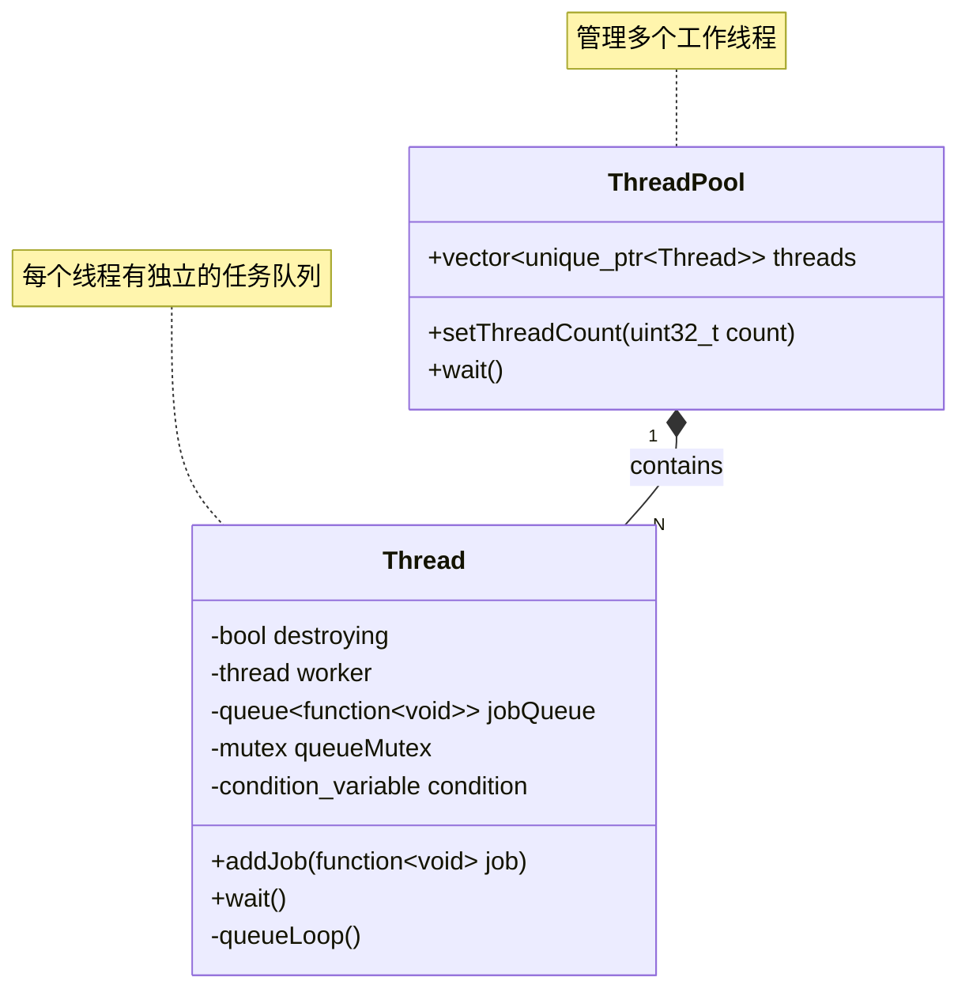

#### 工作流程

1. **任务分发**：主线程将任务添加到每个线程的队列
2. **并行执行**：每个线程从自己的队列中取任务执行
3. **等待同步**：主线程等待所有线程完成

### 3. Push Constants 使用

使用 Push Constants 而不是 Uniform Buffer，避免描述符集更新：

```cpp
struct ThreadPushConstantBlock {
    glm::mat4 mvp;      // 模型视图投影矩阵
    glm::vec3 color;    // 对象颜色
};

// 每个线程在录制命令时推送自己的常量
vkCmdPushConstants(
    cmdBuffer,
    pipelineLayout,
    VK_SHADER_STAGE_VERTEX_BIT,
    0,
    sizeof(ThreadPushConstantBlock),
    &thread->pushConstBlock[cmdBufferIndex]);
```

**优势**：
- 每个线程可以独立更新，无需同步
- 避免描述符集的频繁更新
- 性能开销小

### 4. 多帧并发支持

每个线程的命令缓冲区数组支持多帧并发：

```cpp
// 每个线程的命令缓冲区数组
std::array<std::vector<VkCommandBuffer>, maxConcurrentFrames> commandBuffer;

// 使用当前帧索引
VkCommandBuffer cmdBuffer = thread->commandBuffer[currentBuffer][cmdBufferIndex];
```

### 5. 性能优化技巧

1. **视锥剔除**：在录制命令前剔除不可见对象，减少 GPU 工作
2. **负载均衡**：对象均匀分配到各线程（512 对象 / 线程数）
3. **避免同步**：每个线程使用独立资源，减少锁竞争
4. **批量执行**：使用 `vkCmdExecuteCommands` 批量执行所有次级命令缓冲区

### 6. 关键数据流

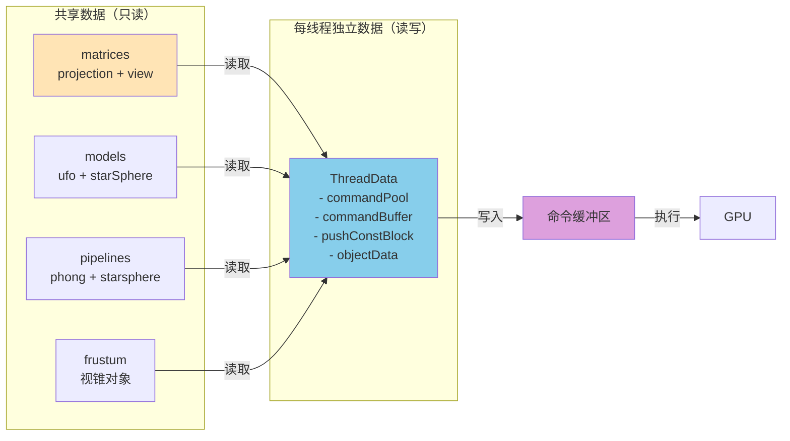

### 7. 线程安全考虑

- ✅ **命令池隔离**：每个线程有独立的命令池，无竞争
- ✅ **命令缓冲区隔离**：每个线程有独立的命令缓冲区，无竞争
- ✅ **对象数据隔离**：每个线程管理自己的对象数组
- ✅ **共享资源只读**：矩阵、模型、管线等共享资源只读访问
- ⚠️ **视锥对象**：虽然被多线程读取，但只在主线程更新，线程安全

### 8. 扩展建议

1. **动态负载均衡**：根据对象复杂度动态分配任务
2. **异步剔除**：在上一帧提前进行视锥剔除
3. **实例化渲染**：对于相同模型，使用实例化减少命令数量
4. **间接绘制**：使用间接绘制命令进一步优化

---

## 总结

`multithreading` 案例展示了 Vulkan 多线程命令缓冲区生成的最佳实践：

1. **架构清晰**：主线程管理，多线程并行录制，最后统一执行
2. **性能优秀**：利用多核 CPU 并行录制命令，显著提升性能
3. **线程安全**：通过资源隔离确保线程安全
4. **可扩展性**：支持任意数量的线程和对象

这个案例是学习 Vulkan 多线程渲染的绝佳参考，展示了如何充分利用 CPU 多核能力来优化渲染性能。

