# VkBuffer 详细分析文档

## 目录
1. [VkBuffer 概述](#vkbuffer-概述)
2. [缓冲区的作用与重要性](#缓冲区的作用与重要性)
3. [缓冲区类型与使用标志](#缓冲区类型与使用标志)
4. [内存管理与属性](#内存管理与属性)
5. [缓冲区的创建流程](#缓冲区的创建流程)
6. [缓冲区操作](#缓冲区操作)
7. [缓冲区复制与传输](#缓冲区复制与传输)
8. [缓冲区与描述符](#缓冲区与描述符)
9. [实际代码示例](#实际代码示例)
10. [最佳实践](#最佳实践)

---

## VkBuffer 概述

### 什么是 VkBuffer？

**VkBuffer** 是 Vulkan 中用于存储线性数据的内存对象。它代表 GPU 可访问的连续内存区域，用于存储顶点数据、索引数据、统一缓冲区、存储缓冲区等各种类型的数据。

### VkBuffer 的核心特点

- **线性内存**: 存储连续的字节数据
- **GPU 可访问**: 可以被 GPU 直接访问
- **多种用途**: 支持顶点、索引、统一缓冲区、存储缓冲区等
- **内存绑定**: 需要绑定到设备内存才能使用
- **类型安全**: 通过使用标志指定用途
- **高效传输**: 支持高效的 GPU 间数据传输

### VkBuffer 在 Vulkan 架构中的位置

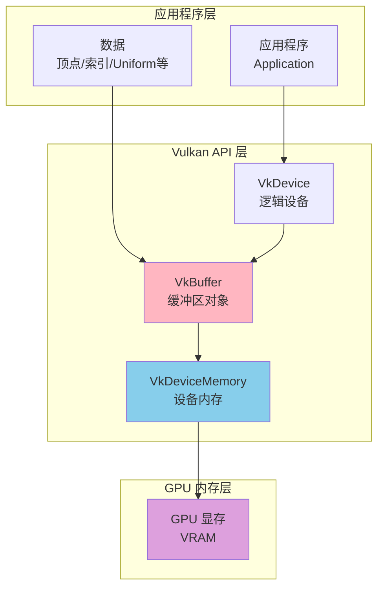

---

## 缓冲区的作用与重要性

### 缓冲区的主要作用

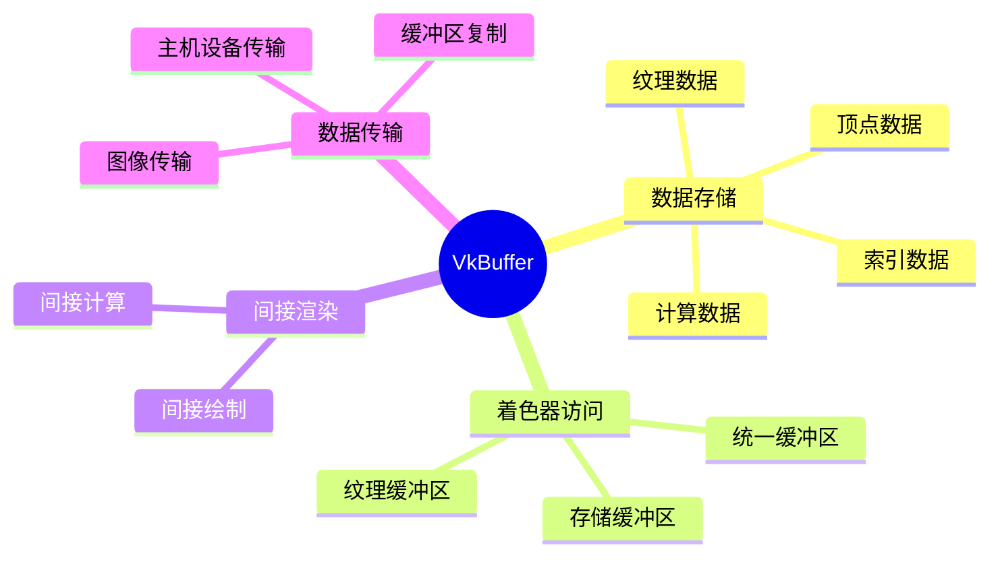

### 缓冲区 vs 图像 vs 其他资源

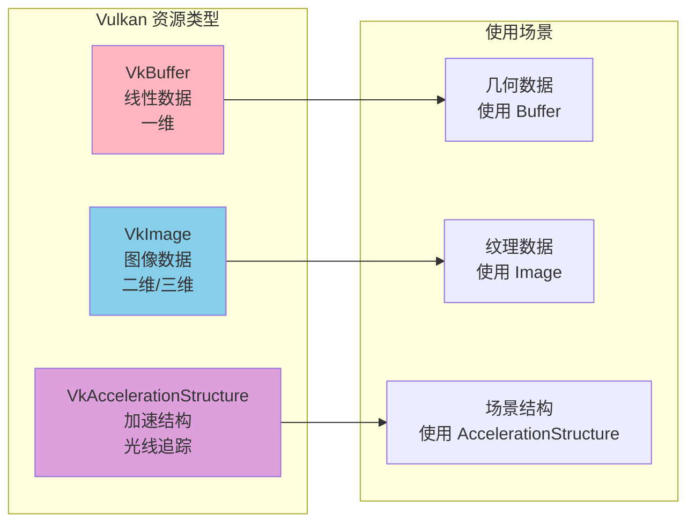

---

## 缓冲区类型与使用标志

### VkBufferUsageFlags

缓冲区使用标志定义了缓冲区的用途和允许的操作：

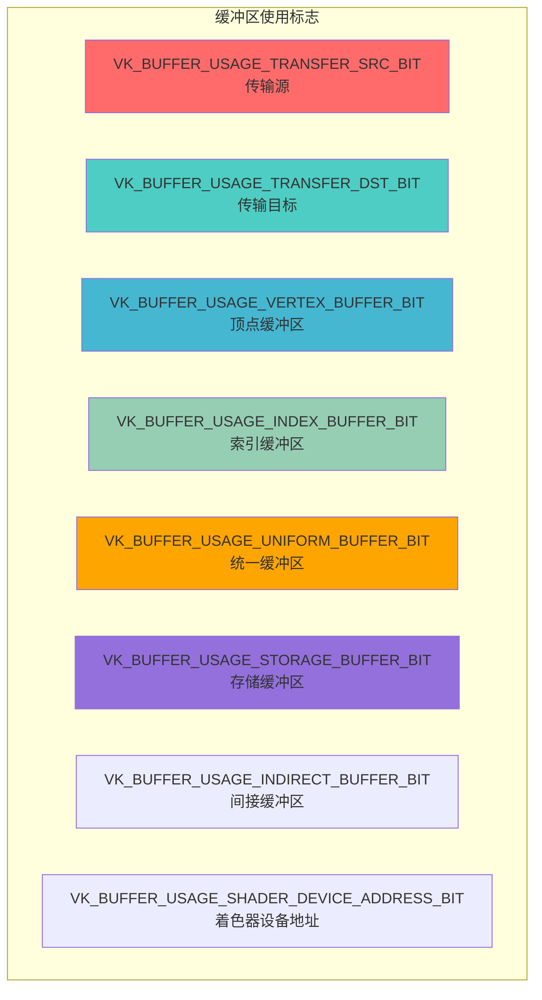

### 1. 传输缓冲区 (Transfer Buffers)

**VK_BUFFER_USAGE_TRANSFER_SRC_BIT**: 作为传输源
- 用于从缓冲区读取数据
- 可以复制到其他缓冲区或图像

**VK_BUFFER_USAGE_TRANSFER_DST_BIT**: 作为传输目标
- 用于接收传输的数据
- 可以从其他缓冲区或图像复制数据

```cpp
// 创建暂存缓冲区（传输源）
VkBufferCreateInfo stagingBufferInfo{};
stagingBufferInfo.sType = VK_STRUCTURE_TYPE_BUFFER_CREATE_INFO;
stagingBufferInfo.size = bufferSize;
stagingBufferInfo.usage = VK_BUFFER_USAGE_TRANSFER_SRC_BIT;  // 传输源
stagingBufferInfo.sharingMode = VK_SHARING_MODE_EXCLUSIVE;

// 创建设备缓冲区（传输目标）
VkBufferCreateInfo deviceBufferInfo{};
deviceBufferInfo.sType = VK_STRUCTURE_TYPE_BUFFER_CREATE_INFO;
deviceBufferInfo.size = bufferSize;
deviceBufferInfo.usage = VK_BUFFER_USAGE_TRANSFER_DST_BIT | 
                         VK_BUFFER_USAGE_VERTEX_BUFFER_BIT;  // 传输目标 + 顶点缓冲区
deviceBufferInfo.sharingMode = VK_SHARING_MODE_EXCLUSIVE;
```

### 2. 顶点缓冲区 (Vertex Buffer)

**VK_BUFFER_USAGE_VERTEX_BUFFER_BIT**: 存储顶点数据
- 包含顶点位置、颜色、法线、纹理坐标等
- 在渲染管线中作为输入

```cpp
// 创建顶点缓冲区
VkBufferCreateInfo vertexBufferInfo{};
vertexBufferInfo.sType = VK_STRUCTURE_TYPE_BUFFER_CREATE_INFO;
vertexBufferInfo.size = vertexDataSize;
vertexBufferInfo.usage = VK_BUFFER_USAGE_VERTEX_BUFFER_BIT | 
                         VK_BUFFER_USAGE_TRANSFER_DST_BIT;  // 顶点缓冲区 + 传输目标
vertexBufferInfo.sharingMode = VK_SHARING_MODE_EXCLUSIVE;
```

### 3. 索引缓冲区 (Index Buffer)

**VK_BUFFER_USAGE_INDEX_BUFFER_BIT**: 存储索引数据
- 定义顶点的连接顺序
- 用于索引绘制（Indexed Drawing）

```cpp
// 创建索引缓冲区
VkBufferCreateInfo indexBufferInfo{};
indexBufferInfo.sType = VK_STRUCTURE_TYPE_BUFFER_CREATE_INFO;
indexBufferInfo.size = indexDataSize;
indexBufferInfo.usage = VK_BUFFER_USAGE_INDEX_BUFFER_BIT | 
                         VK_BUFFER_USAGE_TRANSFER_DST_BIT;  // 索引缓冲区 + 传输目标
indexBufferInfo.sharingMode = VK_SHARING_MODE_EXCLUSIVE;
```

### 4. 统一缓冲区 (Uniform Buffer)

**VK_BUFFER_USAGE_UNIFORM_BUFFER_BIT**: 存储统一变量
- 存储着色器常量数据
- 只读，在着色器中通过 uniform 访问
- 大小有限制（通常 16KB-256KB）

```cpp
// 创建统一缓冲区
VkBufferCreateInfo uniformBufferInfo{};
uniformBufferInfo.sType = VK_STRUCTURE_TYPE_BUFFER_CREATE_INFO;
uniformBufferInfo.size = sizeof(UniformBufferObject);
uniformBufferInfo.usage = VK_BUFFER_USAGE_UNIFORM_BUFFER_BIT;  // 统一缓冲区
uniformBufferInfo.sharingMode = VK_SHARING_MODE_EXCLUSIVE;
```

### 5. 存储缓冲区 (Storage Buffer)

**VK_BUFFER_USAGE_STORAGE_BUFFER_BIT**: 存储可读写数据
- 在着色器中可读写
- 用于计算着色器和存储块
- 大小限制更大（通常几GB）

```cpp
// 创建存储缓冲区
VkBufferCreateInfo storageBufferInfo{};
storageBufferInfo.sType = VK_STRUCTURE_TYPE_BUFFER_CREATE_INFO;
storageBufferInfo.size = dataSize;
storageBufferInfo.usage = VK_BUFFER_USAGE_STORAGE_BUFFER_BIT;  // 存储缓冲区
storageBufferInfo.sharingMode = VK_SHARING_MODE_EXCLUSIVE;
```

### 6. 间接缓冲区 (Indirect Buffer)

**VK_BUFFER_USAGE_INDIRECT_BUFFER_BIT**: 存储间接绘制/计算参数
- 用于间接绘制（Indirect Drawing）
- 用于间接计算调度（Indirect Compute Dispatch）

```cpp
// 创建间接缓冲区
VkBufferCreateInfo indirectBufferInfo{};
indirectBufferInfo.sType = VK_STRUCTURE_TYPE_BUFFER_CREATE_INFO;
indirectBufferInfo.size = sizeof(VkDrawIndirectCommand) * drawCount;
indirectBufferInfo.usage = VK_BUFFER_USAGE_INDIRECT_BUFFER_BIT | 
                           VK_BUFFER_USAGE_STORAGE_BUFFER_BIT;  // 间接缓冲区 + 存储缓冲区
indirectBufferInfo.sharingMode = VK_SHARING_MODE_EXCLUSIVE;
```

### 7. 着色器设备地址 (Shader Device Address)

**VK_BUFFER_USAGE_SHADER_DEVICE_ADDRESS_BIT**: 允许着色器直接访问
- 用于光线追踪
- 允许获取缓冲区的 GPU 虚拟地址
- 需要特殊的内存分配标志

```cpp
// 创建支持设备地址的缓冲区
VkBufferCreateInfo bufferInfo{};
bufferInfo.sType = VK_STRUCTURE_TYPE_BUFFER_CREATE_INFO;
bufferInfo.size = bufferSize;
bufferInfo.usage = VK_BUFFER_USAGE_SHADER_DEVICE_ADDRESS_BIT |
                   VK_BUFFER_USAGE_STORAGE_BUFFER_BIT;
bufferInfo.sharingMode = VK_SHARING_MODE_EXCLUSIVE;

// 分配内存时需要特殊标志
VkMemoryAllocateFlagsInfo allocFlagsInfo{};
allocFlagsInfo.sType = VK_STRUCTURE_TYPE_MEMORY_ALLOCATE_FLAGS_INFO;
allocFlagsInfo.flags = VK_MEMORY_ALLOCATE_DEVICE_ADDRESS_BIT;

VkMemoryAllocateInfo allocInfo{};
allocInfo.pNext = &allocFlagsInfo;
// ... 其他分配信息
```

### 使用标志组合示例

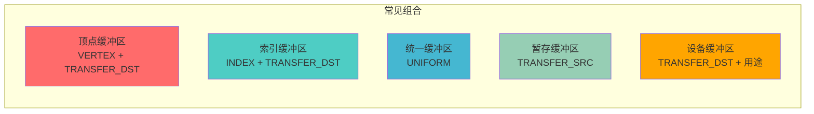

---

## 内存管理与属性

### 内存属性标志

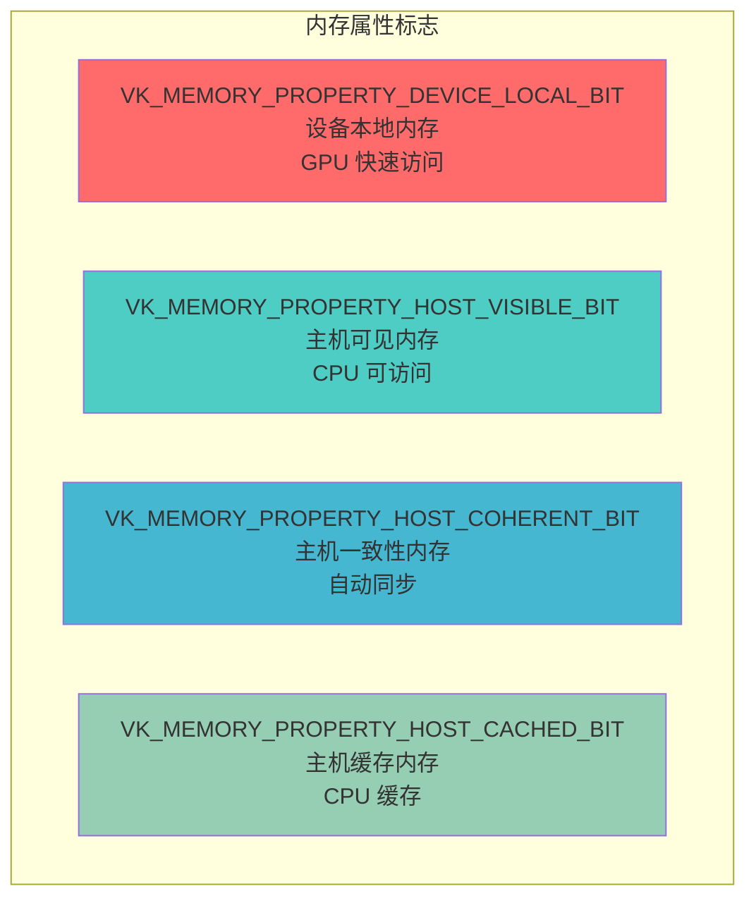

### 内存类型选择策略

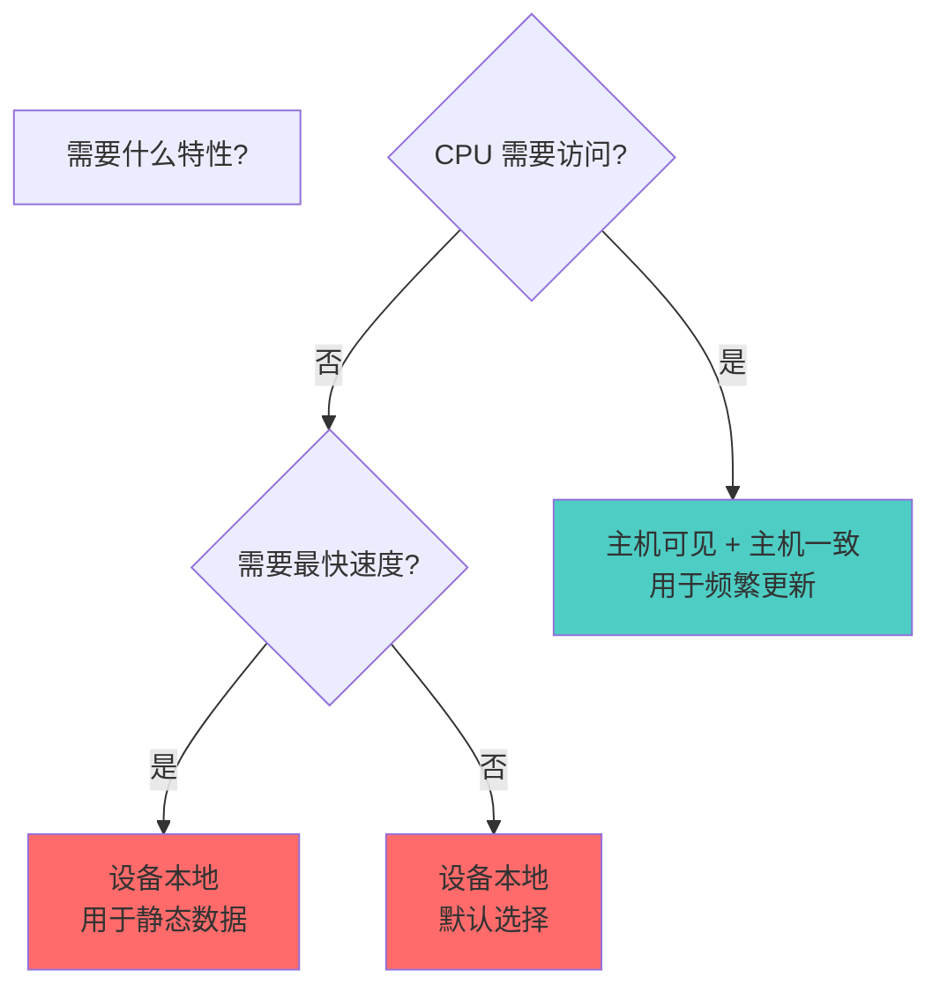

### 1. 设备本地内存 (Device Local)

**VK_MEMORY_PROPERTY_DEVICE_LOCAL_BIT**:
- GPU 快速访问
- CPU 通常无法直接访问
- 用于频繁 GPU 访问的数据（顶点、索引、纹理等）

**特点**:
- ✅ 最快的 GPU 访问速度
- ✅ 大容量（通常几GB）
- ❌ CPU 无法直接访问
- ❌ 需要通过暂存缓冲区传输数据

### 2. 主机可见内存 (Host Visible)

**VK_MEMORY_PROPERTY_HOST_VISIBLE_BIT**:
- CPU 可以映射和访问
- 用于需要频繁更新的数据（Uniform Buffer）

**特点**:
- ✅ CPU 可以直接访问
- ✅ 适合频繁更新的数据
- ⚠️ GPU 访问速度较慢
- ⚠️ 容量通常较小

### 3. 主机一致内存 (Host Coherent)

**VK_MEMORY_PROPERTY_HOST_COHERENT_BIT**:
- CPU 和 GPU 之间的写入自动同步
- 不需要手动刷新/失效操作

**特点**:
- ✅ 自动同步，无需手动刷新
- ✅ 适合频繁更新的 Uniform Buffer
- ⚠️ 性能可能略低于非一致内存

### 4. 主机缓存内存 (Host Cached)

**VK_MEMORY_PROPERTY_HOST_CACHED_BIT**:
- CPU 端有缓存
- 需要手动刷新使 GPU 可见

**特点**:
- ✅ CPU 访问速度快（有缓存）
- ⚠️ 需要手动刷新
- ⚠️ GPU 访问可能较慢

### 内存类型组合

| 组合 | 用途 | 特点 |
|------|------|------|
| DEVICE_LOCAL | 静态顶点/索引缓冲区 | GPU 最快，CPU 不可访问 |
| HOST_VISIBLE + HOST_COHERENT | 频繁更新的 Uniform Buffer | CPU 可访问，自动同步 |
| HOST_VISIBLE + HOST_CACHED | 偶尔更新的数据 | CPU 有缓存，需手动刷新 |
| DEVICE_LOCAL + HOST_VISIBLE | 集成显卡 | 两者都可访问 |

---

## 缓冲区的创建流程

### 完整创建流程

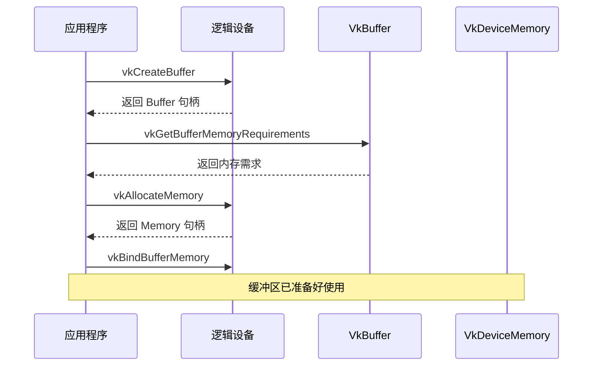

### 步骤 1: 创建缓冲区对象

```cpp
VkBufferCreateInfo bufferInfo{};
bufferInfo.sType = VK_STRUCTURE_TYPE_BUFFER_CREATE_INFO;
bufferInfo.size = bufferSize;                              // 缓冲区大小（字节）
bufferInfo.usage = VK_BUFFER_USAGE_VERTEX_BUFFER_BIT |      // 使用标志
                   VK_BUFFER_USAGE_TRANSFER_DST_BIT;
bufferInfo.sharingMode = VK_SHARING_MODE_EXCLUSIVE;        // 独占模式

VkBuffer buffer;
VkResult result = vkCreateBuffer(device, &bufferInfo, nullptr, &buffer);
if (result != VK_SUCCESS) {
    throw std::runtime_error("failed to create buffer!");
}
```

### 步骤 2: 查询内存需求

```cpp
VkMemoryRequirements memRequirements;
vkGetBufferMemoryRequirements(device, buffer, &memRequirements);

// memRequirements 包含：
// - size: 所需内存大小（可能大于请求的大小，已对齐）
// - alignment: 内存对齐要求
// - memoryTypeBits: 支持的内存类型位掩码
```

### 步骤 3: 查找合适的内存类型

```cpp
VkPhysicalDeviceMemoryProperties memProperties;
vkGetPhysicalDeviceMemoryProperties(physicalDevice, &memProperties);

uint32_t memoryTypeIndex = UINT32_MAX;
for (uint32_t i = 0; i < memProperties.memoryTypeCount; i++) {
    // 检查内存类型是否支持缓冲区
    if ((memRequirements.memoryTypeBits & (1 << i)) &&
        // 检查内存属性是否符合要求
        (memProperties.memoryTypes[i].propertyFlags & 
         (VK_MEMORY_PROPERTY_HOST_VISIBLE_BIT | 
          VK_MEMORY_PROPERTY_HOST_COHERENT_BIT)) ==
        (VK_MEMORY_PROPERTY_HOST_VISIBLE_BIT | 
         VK_MEMORY_PROPERTY_HOST_COHERENT_BIT)) {
        memoryTypeIndex = i;
        break;
    }
}

if (memoryTypeIndex == UINT32_MAX) {
    throw std::runtime_error("failed to find suitable memory type!");
}
```

### 步骤 4: 分配设备内存

```cpp
VkMemoryAllocateInfo allocInfo{};
allocInfo.sType = VK_STRUCTURE_TYPE_MEMORY_ALLOCATE_INFO;
allocInfo.allocationSize = memRequirements.size;      // 分配大小（已对齐）
allocInfo.memoryTypeIndex = memoryTypeIndex;          // 内存类型索引

VkDeviceMemory bufferMemory;
VkResult result = vkAllocateMemory(device, &allocInfo, nullptr, &bufferMemory);
if (result != VK_SUCCESS) {
    throw std::runtime_error("failed to allocate buffer memory!");
}
```

### 步骤 5: 绑定内存到缓冲区

```cpp
VkResult result = vkBindBufferMemory(device, buffer, bufferMemory, 0);
if (result != VK_SUCCESS) {
    throw std::runtime_error("failed to bind buffer memory!");
}
```

### 完整创建函数示例

```cpp
VkResult createBuffer(
    VkDevice device,
    VkPhysicalDevice physicalDevice,
    VkDeviceSize size,
    VkBufferUsageFlags usage,
    VkMemoryPropertyFlags properties,
    VkBuffer& buffer,
    VkDeviceMemory& bufferMemory) {
    
    // 1. 创建缓冲区
    VkBufferCreateInfo bufferInfo{};
    bufferInfo.sType = VK_STRUCTURE_TYPE_BUFFER_CREATE_INFO;
    bufferInfo.size = size;
    bufferInfo.usage = usage;
    bufferInfo.sharingMode = VK_SHARING_MODE_EXCLUSIVE;
    
    if (vkCreateBuffer(device, &bufferInfo, nullptr, &buffer) != VK_SUCCESS) {
        return VK_ERROR_INITIALIZATION_FAILED;
    }
    
    // 2. 查询内存需求
    VkMemoryRequirements memRequirements;
    vkGetBufferMemoryRequirements(device, buffer, &memRequirements);
    
    // 3. 查找内存类型
    VkPhysicalDeviceMemoryProperties memProperties;
    vkGetPhysicalDeviceMemoryProperties(physicalDevice, &memProperties);
    
    uint32_t memoryTypeIndex = UINT32_MAX;
    for (uint32_t i = 0; i < memProperties.memoryTypeCount; i++) {
        if ((memRequirements.memoryTypeBits & (1 << i)) &&
            (memProperties.memoryTypes[i].propertyFlags & properties) == properties) {
            memoryTypeIndex = i;
            break;
        }
    }
    
    if (memoryTypeIndex == UINT32_MAX) {
        return VK_ERROR_OUT_OF_DEVICE_MEMORY;
    }
    
    // 4. 分配内存
    VkMemoryAllocateInfo allocInfo{};
    allocInfo.sType = VK_STRUCTURE_TYPE_MEMORY_ALLOCATE_INFO;
    allocInfo.allocationSize = memRequirements.size;
    allocInfo.memoryTypeIndex = memoryTypeIndex;
    
    if (vkAllocateMemory(device, &allocInfo, nullptr, &bufferMemory) != VK_SUCCESS) {
        return VK_ERROR_OUT_OF_DEVICE_MEMORY;
    }
    
    // 5. 绑定内存
    return vkBindBufferMemory(device, buffer, bufferMemory, 0);
}
```

---

## 缓冲区操作

### 1. 内存映射 (Memory Mapping)

映射主机可见内存以便 CPU 访问：

```cpp
// 映射内存
void* mappedData;
VkResult result = vkMapMemory(
    device,           // 设备
    bufferMemory,     // 内存对象
    0,               // 偏移量
    VK_WHOLE_SIZE,   // 大小（VK_WHOLE_SIZE 表示整个范围）
    0,               // 标志
    &mappedData      // 输出的映射指针
);

if (result == VK_SUCCESS) {
    // 现在可以通过 mappedData 访问内存
    memcpy(mappedData, sourceData, dataSize);
    
    // 如果是非一致内存，需要刷新
    if (!(memoryProperties & VK_MEMORY_PROPERTY_HOST_COHERENT_BIT)) {
        VkMappedMemoryRange mappedRange{};
        mappedRange.sType = VK_STRUCTURE_TYPE_MAPPED_MEMORY_RANGE;
        mappedRange.memory = bufferMemory;
        mappedRange.offset = 0;
        mappedRange.size = VK_WHOLE_SIZE;
        vkFlushMappedMemoryRanges(device, 1, &mappedRange);
    }
    
    // 取消映射
    vkUnmapMemory(device, bufferMemory);
}
```

### 2. 内存刷新 (Flush)

使 CPU 写入对 GPU 可见（非一致内存）：

```cpp
VkMappedMemoryRange mappedRange{};
mappedRange.sType = VK_STRUCTURE_TYPE_MAPPED_MEMORY_RANGE;
mappedRange.memory = bufferMemory;
mappedRange.offset = offset;
mappedRange.size = size;  // 或 VK_WHOLE_SIZE

vkFlushMappedMemoryRanges(device, 1, &mappedRange);
```

### 3. 内存失效 (Invalidate)

使 GPU 写入对 CPU 可见（非一致内存）：

```cpp
VkMappedMemoryRange mappedRange{};
mappedRange.sType = VK_STRUCTURE_TYPE_MAPPED_MEMORY_RANGE;
mappedRange.memory = bufferMemory;
mappedRange.offset = offset;
mappedRange.size = size;

vkInvalidateMappedMemoryRanges(device, 1, &mappedRange);
```

### 4. 更新缓冲区数据

```cpp
void updateBuffer(VkDevice device, VkDeviceMemory memory, 
                  void* data, VkDeviceSize size) {
    void* mapped;
    vkMapMemory(device, memory, 0, size, 0, &mapped);
    memcpy(mapped, data, size);
    
    // 如果是非一致内存，刷新
    VkMappedMemoryRange range{};
    range.sType = VK_STRUCTURE_TYPE_MAPPED_MEMORY_RANGE;
    range.memory = memory;
    range.size = size;
    vkFlushMappedMemoryRanges(device, 1, &range);
    
    vkUnmapMemory(device, memory);
}
```

---

## 缓冲区复制与传输

### 使用暂存缓冲区上传数据

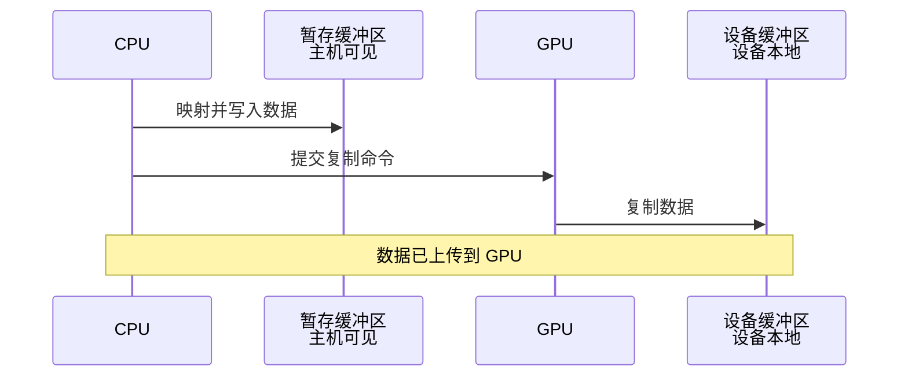

### 暂存缓冲区模式

```cpp
void copyBufferToDevice(
    VkDevice device,
    VkCommandBuffer commandBuffer,
    VkQueue queue,
    VkBuffer srcBuffer,      // 暂存缓冲区（主机可见）
    VkBuffer dstBuffer,      // 设备缓冲区（设备本地）
    VkDeviceSize size) {
    
    // 1. 创建暂存缓冲区（主机可见）
    VkBuffer stagingBuffer;
    VkDeviceMemory stagingMemory;
    createBuffer(
        device, physicalDevice,
        size,
        VK_BUFFER_USAGE_TRANSFER_SRC_BIT,
        VK_MEMORY_PROPERTY_HOST_VISIBLE_BIT | 
        VK_MEMORY_PROPERTY_HOST_COHERENT_BIT,
        stagingBuffer, stagingMemory
    );
    
    // 2. 映射并复制数据到暂存缓冲区
    void* data;
    vkMapMemory(device, stagingMemory, 0, size, 0, &data);
    memcpy(data, sourceData, size);
    vkUnmapMemory(device, stagingMemory);
    
    // 3. 创建设备缓冲区（设备本地）
    VkBuffer deviceBuffer;
    VkDeviceMemory deviceMemory;
    createBuffer(
        device, physicalDevice,
        size,
        VK_BUFFER_USAGE_TRANSFER_DST_BIT | 
        VK_BUFFER_USAGE_VERTEX_BUFFER_BIT,
        VK_MEMORY_PROPERTY_DEVICE_LOCAL_BIT,
        deviceBuffer, deviceMemory
    );
    
    // 4. 记录复制命令
    VkCommandBufferBeginInfo beginInfo{};
    beginInfo.sType = VK_STRUCTURE_TYPE_COMMAND_BUFFER_BEGIN_INFO;
    beginInfo.flags = VK_COMMAND_BUFFER_USAGE_ONE_TIME_SUBMIT_BIT;
    
    vkBeginCommandBuffer(commandBuffer, &beginInfo);
    
    VkBufferCopy copyRegion{};
    copyRegion.srcOffset = 0;
    copyRegion.dstOffset = 0;
    copyRegion.size = size;
    vkCmdCopyBuffer(commandBuffer, stagingBuffer, deviceBuffer, 1, &copyRegion);
    
    vkEndCommandBuffer(commandBuffer);
    
    // 5. 提交命令
    VkSubmitInfo submitInfo{};
    submitInfo.sType = VK_STRUCTURE_TYPE_SUBMIT_INFO;
    submitInfo.commandBufferCount = 1;
    submitInfo.pCommandBuffers = &commandBuffer;
    
    VkFence fence;
    VkFenceCreateInfo fenceInfo{};
    fenceInfo.sType = VK_STRUCTURE_TYPE_FENCE_CREATE_INFO;
    vkCreateFence(device, &fenceInfo, nullptr, &fence);
    
    vkQueueSubmit(queue, 1, &submitInfo, fence);
    vkWaitForFences(device, 1, &fence, VK_TRUE, UINT64_MAX);
    
    // 6. 清理
    vkDestroyFence(device, fence, nullptr);
    vkDestroyBuffer(device, stagingBuffer, nullptr);
    vkFreeMemory(device, stagingMemory, nullptr);
}
```

### 缓冲区到缓冲区复制

```cpp
// 在命令缓冲区中记录复制命令
VkBufferCopy copyRegion{};
copyRegion.srcOffset = 0;      // 源偏移
copyRegion.dstOffset = 0;      // 目标偏移
copyRegion.size = copySize;    // 复制大小

vkCmdCopyBuffer(
    commandBuffer,    // 命令缓冲区
    srcBuffer,        // 源缓冲区
    dstBuffer,        // 目标缓冲区
    1,                // 复制区域数量
    &copyRegion       // 复制区域数组
);
```

### 缓冲区到图像复制

```cpp
// 复制缓冲区数据到图像
VkBufferImageCopy region{};
region.bufferOffset = 0;
region.bufferRowLength = 0;        // 0 表示紧密打包
region.bufferImageHeight = 0;
region.imageSubresource.aspectMask = VK_IMAGE_ASPECT_COLOR_BIT;
region.imageSubresource.mipLevel = 0;
region.imageSubresource.baseArrayLayer = 0;
region.imageSubresource.layerCount = 1;
region.imageOffset = {0, 0, 0};
region.imageExtent = {width, height, 1};

vkCmdCopyBufferToImage(
    commandBuffer,
    srcBuffer,
    dstImage,
    VK_IMAGE_LAYOUT_TRANSFER_DST_OPTIMAL,
    1,
    &region
);
```

---

## 缓冲区与描述符

### 描述符缓冲区信息

```cpp
VkDescriptorBufferInfo bufferInfo{};
bufferInfo.buffer = uniformBuffer;      // 缓冲区句柄
bufferInfo.offset = 0;                  // 偏移量
bufferInfo.range = sizeof(UniformBufferObject);  // 范围大小
```

### 在描述符集中使用缓冲区

```cpp
// 更新描述符集
VkWriteDescriptorSet descriptorWrite{};
descriptorWrite.sType = VK_STRUCTURE_TYPE_WRITE_DESCRIPTOR_SET;
descriptorWrite.dstSet = descriptorSet;
descriptorWrite.dstBinding = 0;
descriptorWrite.dstArrayElement = 0;
descriptorWrite.descriptorType = VK_DESCRIPTOR_TYPE_UNIFORM_BUFFER;
descriptorWrite.descriptorCount = 1;
descriptorWrite.pBufferInfo = &bufferInfo;  // 缓冲区信息

vkUpdateDescriptorSets(device, 1, &descriptorWrite, 0, nullptr);
```

### 绑定顶点缓冲区

```cpp
// 在渲染命令中绑定顶点缓冲区
VkBuffer vertexBuffers[] = {vertexBuffer};
VkDeviceSize offsets[] = {0};

vkCmdBindVertexBuffers(
    commandBuffer,    // 命令缓冲区
    0,                // 第一个绑定点
    1,                // 缓冲区数量
    vertexBuffers,    // 缓冲区数组
    offsets           // 偏移数组
);
```

### 绑定索引缓冲区

```cpp
vkCmdBindIndexBuffer(
    commandBuffer,
    indexBuffer,
    0,                              // 偏移量
    VK_INDEX_TYPE_UINT32            // 索引类型（UINT16 或 UINT32）
);
```

---

## 实际代码示例

### 示例 1: 创建顶点缓冲区

```cpp
class VertexBuffer {
private:
    VkDevice device;
    VkPhysicalDevice physicalDevice;
    VkBuffer buffer;
    VkDeviceMemory memory;
    VkDeviceSize size;
    
public:
    void create(const std::vector<Vertex>& vertices) {
        size = sizeof(vertices[0]) * vertices.size();
        
        // 1. 创建暂存缓冲区
        VkBuffer stagingBuffer;
        VkDeviceMemory stagingMemory;
        createBuffer(
            device, physicalDevice,
            size,
            VK_BUFFER_USAGE_TRANSFER_SRC_BIT,
            VK_MEMORY_PROPERTY_HOST_VISIBLE_BIT | 
            VK_MEMORY_PROPERTY_HOST_COHERENT_BIT,
            stagingBuffer, stagingMemory
        );
        
        // 2. 上传数据到暂存缓冲区
        void* data;
        vkMapMemory(device, stagingMemory, 0, size, 0, &data);
        memcpy(data, vertices.data(), size);
        vkUnmapMemory(device, stagingMemory);
        
        // 3. 创建设备缓冲区
        createBuffer(
            device, physicalDevice,
            size,
            VK_BUFFER_USAGE_TRANSFER_DST_BIT | 
            VK_BUFFER_USAGE_VERTEX_BUFFER_BIT,
            VK_MEMORY_PROPERTY_DEVICE_LOCAL_BIT,
            buffer, memory
        );
        
        // 4. 复制数据
        copyBuffer(stagingBuffer, buffer, size);
        
        // 5. 清理暂存缓冲区
        vkDestroyBuffer(device, stagingBuffer, nullptr);
        vkFreeMemory(device, stagingMemory, nullptr);
    }
    
    void destroy() {
        vkDestroyBuffer(device, buffer, nullptr);
        vkFreeMemory(device, memory, nullptr);
    }
    
    VkBuffer getBuffer() const { return buffer; }
    VkDeviceSize getSize() const { return size; }
};
```

### 示例 2: 创建统一缓冲区

```cpp
class UniformBuffer {
private:
    VkDevice device;
    VkPhysicalDevice physicalDevice;
    VkBuffer buffer;
    VkDeviceMemory memory;
    void* mapped = nullptr;
    
public:
    void create(VkDeviceSize size) {
        // 创建主机可见的统一缓冲区（用于频繁更新）
        createBuffer(
            device, physicalDevice,
            size,
            VK_BUFFER_USAGE_UNIFORM_BUFFER_BIT,
            VK_MEMORY_PROPERTY_HOST_VISIBLE_BIT | 
            VK_MEMORY_PROPERTY_HOST_COHERENT_BIT,
            buffer, memory
        );
        
        // 持久映射
        vkMapMemory(device, memory, 0, size, 0, &mapped);
    }
    
    void update(const void* data, VkDeviceSize size) {
        // 直接写入映射的内存（主机一致内存自动同步）
        memcpy(mapped, data, size);
    }
    
    VkDescriptorBufferInfo getDescriptorInfo() const {
        VkDescriptorBufferInfo info{};
        info.buffer = buffer;
        info.offset = 0;
        info.range = VK_WHOLE_SIZE;
        return info;
    }
    
    void destroy() {
        if (mapped) {
            vkUnmapMemory(device, memory);
            mapped = nullptr;
        }
        vkDestroyBuffer(device, buffer, nullptr);
        vkFreeMemory(device, memory, nullptr);
    }
};
```

### 示例 3: 创建存储缓冲区

```cpp
class StorageBuffer {
private:
    VkDevice device;
    VkPhysicalDevice physicalDevice;
    VkBuffer buffer;
    VkDeviceMemory memory;
    VkDeviceSize size;
    
public:
    void create(VkDeviceSize bufferSize, const void* initialData = nullptr) {
        size = bufferSize;
        
        if (initialData) {
            // 使用暂存缓冲区初始化
            VkBuffer stagingBuffer;
            VkDeviceMemory stagingMemory;
            createBuffer(
                device, physicalDevice,
                size,
                VK_BUFFER_USAGE_TRANSFER_SRC_BIT,
                VK_MEMORY_PROPERTY_HOST_VISIBLE_BIT | 
                VK_MEMORY_PROPERTY_HOST_COHERENT_BIT,
                stagingBuffer, stagingMemory
            );
            
            void* data;
            vkMapMemory(device, stagingMemory, 0, size, 0, &data);
            memcpy(data, initialData, size);
            vkUnmapMemory(device, stagingMemory);
            
            createBuffer(
                device, physicalDevice,
                size,
                VK_BUFFER_USAGE_STORAGE_BUFFER_BIT | 
                VK_BUFFER_USAGE_TRANSFER_DST_BIT,
                VK_MEMORY_PROPERTY_DEVICE_LOCAL_BIT,
                buffer, memory
            );
            
            copyBuffer(stagingBuffer, buffer, size);
            
            vkDestroyBuffer(device, stagingBuffer, nullptr);
            vkFreeMemory(device, stagingMemory, nullptr);
        } else {
            // 直接创建设备本地缓冲区
            createBuffer(
                device, physicalDevice,
                size,
                VK_BUFFER_USAGE_STORAGE_BUFFER_BIT,
                VK_MEMORY_PROPERTY_DEVICE_LOCAL_BIT,
                buffer, memory
            );
        }
    }
    
    VkDescriptorBufferInfo getDescriptorInfo() const {
        VkDescriptorBufferInfo info{};
        info.buffer = buffer;
        info.offset = 0;
        info.range = size;
        return info;
    }
    
    void destroy() {
        vkDestroyBuffer(device, buffer, nullptr);
        vkFreeMemory(device, memory, nullptr);
    }
};
```

### 示例 4: 完整的缓冲区管理类

```cpp
class BufferManager {
private:
    VkDevice device;
    VkPhysicalDevice physicalDevice;
    VkCommandPool commandPool;
    VkQueue transferQueue;
    
    // 辅助函数：创建缓冲区
    VkResult createBuffer(
        VkDeviceSize size,
        VkBufferUsageFlags usage,
        VkMemoryPropertyFlags properties,
        VkBuffer& buffer,
        VkDeviceMemory& memory) {
        
        VkBufferCreateInfo bufferInfo{};
        bufferInfo.sType = VK_STRUCTURE_TYPE_BUFFER_CREATE_INFO;
        bufferInfo.size = size;
        bufferInfo.usage = usage;
        bufferInfo.sharingMode = VK_SHARING_MODE_EXCLUSIVE;
        
        if (vkCreateBuffer(device, &bufferInfo, nullptr, &buffer) != VK_SUCCESS) {
            return VK_ERROR_INITIALIZATION_FAILED;
        }
        
        VkMemoryRequirements memRequirements;
        vkGetBufferMemoryRequirements(device, buffer, &memRequirements);
        
        VkPhysicalDeviceMemoryProperties memProperties;
        vkGetPhysicalDeviceMemoryProperties(physicalDevice, &memProperties);
        
        uint32_t memoryTypeIndex = UINT32_MAX;
        for (uint32_t i = 0; i < memProperties.memoryTypeCount; i++) {
            if ((memRequirements.memoryTypeBits & (1 << i)) &&
                (memProperties.memoryTypes[i].propertyFlags & properties) == properties) {
                memoryTypeIndex = i;
                break;
            }
        }
        
        if (memoryTypeIndex == UINT32_MAX) {
            return VK_ERROR_OUT_OF_DEVICE_MEMORY;
        }
        
        VkMemoryAllocateInfo allocInfo{};
        allocInfo.sType = VK_STRUCTURE_TYPE_MEMORY_ALLOCATE_INFO;
        allocInfo.allocationSize = memRequirements.size;
        allocInfo.memoryTypeIndex = memoryTypeIndex;
        
        if (vkAllocateMemory(device, &allocInfo, nullptr, &memory) != VK_SUCCESS) {
            return VK_ERROR_OUT_OF_DEVICE_MEMORY;
        }
        
        return vkBindBufferMemory(device, buffer, memory, 0);
    }
    
    // 辅助函数：复制缓冲区
    void copyBuffer(VkBuffer srcBuffer, VkBuffer dstBuffer, VkDeviceSize size) {
        VkCommandBufferAllocateInfo allocInfo{};
        allocInfo.sType = VK_STRUCTURE_TYPE_COMMAND_BUFFER_ALLOCATE_INFO;
        allocInfo.level = VK_COMMAND_BUFFER_LEVEL_PRIMARY;
        allocInfo.commandPool = commandPool;
        allocInfo.commandBufferCount = 1;
        
        VkCommandBuffer commandBuffer;
        vkAllocateCommandBuffers(device, &allocInfo, &commandBuffer);
        
        VkCommandBufferBeginInfo beginInfo{};
        beginInfo.sType = VK_STRUCTURE_TYPE_COMMAND_BUFFER_BEGIN_INFO;
        beginInfo.flags = VK_COMMAND_BUFFER_USAGE_ONE_TIME_SUBMIT_BIT;
        
        vkBeginCommandBuffer(commandBuffer, &beginInfo);
        
        VkBufferCopy copyRegion{};
        copyRegion.size = size;
        vkCmdCopyBuffer(commandBuffer, srcBuffer, dstBuffer, 1, &copyRegion);
        
        vkEndCommandBuffer(commandBuffer);
        
        VkSubmitInfo submitInfo{};
        submitInfo.sType = VK_STRUCTURE_TYPE_SUBMIT_INFO;
        submitInfo.commandBufferCount = 1;
        submitInfo.pCommandBuffers = &commandBuffer;
        
        vkQueueSubmit(transferQueue, 1, &submitInfo, VK_NULL_HANDLE);
        vkQueueWaitIdle(transferQueue);
        
        vkFreeCommandBuffers(device, commandPool, 1, &commandBuffer);
    }
    
public:
    BufferManager(VkDevice dev, VkPhysicalDevice physDev, 
                  VkCommandPool cmdPool, VkQueue queue)
        : device(dev), physicalDevice(physDev), 
          commandPool(cmdPool), transferQueue(queue) {}
    
    // 创建顶点缓冲区
    void createVertexBuffer(const std::vector<Vertex>& vertices,
                           VkBuffer& buffer, VkDeviceMemory& memory) {
        VkDeviceSize bufferSize = sizeof(vertices[0]) * vertices.size();
        
        // 暂存缓冲区
        VkBuffer stagingBuffer;
        VkDeviceMemory stagingMemory;
        createBuffer(
            bufferSize,
            VK_BUFFER_USAGE_TRANSFER_SRC_BIT,
            VK_MEMORY_PROPERTY_HOST_VISIBLE_BIT | 
            VK_MEMORY_PROPERTY_HOST_COHERENT_BIT,
            stagingBuffer, stagingMemory
        );
        
        void* data;
        vkMapMemory(device, stagingMemory, 0, bufferSize, 0, &data);
        memcpy(data, vertices.data(), bufferSize);
        vkUnmapMemory(device, stagingMemory);
        
        // 设备缓冲区
        createBuffer(
            bufferSize,
            VK_BUFFER_USAGE_TRANSFER_DST_BIT | 
            VK_BUFFER_USAGE_VERTEX_BUFFER_BIT,
            VK_MEMORY_PROPERTY_DEVICE_LOCAL_BIT,
            buffer, memory
        );
        
        copyBuffer(stagingBuffer, buffer, bufferSize);
        
        vkDestroyBuffer(device, stagingBuffer, nullptr);
        vkFreeMemory(device, stagingMemory, nullptr);
    }
    
    // 创建统一缓冲区
    void createUniformBuffer(VkDeviceSize size,
                            VkBuffer& buffer, VkDeviceMemory& memory) {
        createBuffer(
            size,
            VK_BUFFER_USAGE_UNIFORM_BUFFER_BIT,
            VK_MEMORY_PROPERTY_HOST_VISIBLE_BIT | 
            VK_MEMORY_PROPERTY_HOST_COHERENT_BIT,
            buffer, memory
        );
    }
};
```

---

## 最佳实践

### 1. 内存类型选择

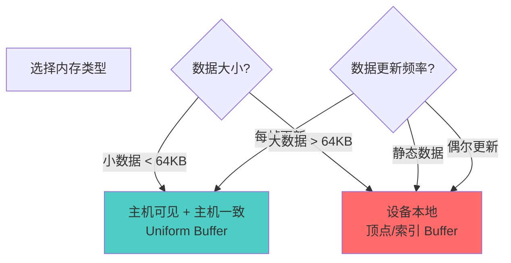

**建议**:
- ✅ 频繁更新的小数据（Uniform Buffer）→ 主机可见 + 主机一致
- ✅ 静态或偶尔更新的大数据（顶点/索引）→ 设备本地
- ✅ 计算着色器输出 → 设备本地存储缓冲区
- ⚠️ 避免在每帧都使用暂存缓冲区传输数据

### 2. 缓冲区对齐

```cpp
// ✅ 好的做法：考虑对齐要求
VkMemoryRequirements memReqs;
vkGetBufferMemoryRequirements(device, buffer, &memReqs);

// 使用对齐后的大小
VkDeviceSize alignedSize = (size + memReqs.alignment - 1) & ~(memReqs.alignment - 1);

// ❌ 不好的做法：忽略对齐
VkDeviceSize size = sizeof(Data);  // 可能不满足对齐要求
```

### 3. 批量分配

```cpp
// ✅ 好的做法：批量分配内存
VkMemoryAllocateInfo allocInfo{};
allocInfo.allocationSize = totalSize;  // 一次分配大块内存
vkAllocateMemory(device, &allocInfo, nullptr, &memory);

// 然后绑定多个缓冲区到同一内存的不同偏移
vkBindBufferMemory(device, buffer1, memory, 0);
vkBindBufferMemory(device, buffer2, memory, offset1);
vkBindBufferMemory(device, buffer3, memory, offset2);
```

### 4. 暂存缓冲区重用

```cpp
// ✅ 好的做法：重用暂存缓冲区
class StagingBufferPool {
    std::vector<VkBuffer> buffers;
    std::vector<VkDeviceMemory> memories;
    
public:
    VkBuffer acquire(VkDeviceSize size) {
        // 查找或创建合适大小的缓冲区
        // ...
    }
    
    void release(VkBuffer buffer) {
        // 返回到池中
        // ...
    }
};
```

### 5. 内存映射最佳实践

```cpp
// ✅ 好的做法：持久映射频繁更新的缓冲区
void* mapped;
vkMapMemory(device, uniformBufferMemory, 0, size, 0, &mapped);
// 保持映射，直接更新
memcpy(mapped, data, size);  // 主机一致内存自动同步

// ❌ 不好的做法：频繁映射/取消映射
for (int i = 0; i < 1000; i++) {
    void* mapped;
    vkMapMemory(device, memory, 0, size, 0, &mapped);
    memcpy(mapped, data, size);
    vkUnmapMemory(device, memory);  // 性能开销大
}
```

### 6. 错误处理

```cpp
VkResult createBuffer(...) {
    VkResult result = vkCreateBuffer(device, &bufferInfo, nullptr, &buffer);
    if (result != VK_SUCCESS) {
        // 检查具体错误
        switch (result) {
            case VK_ERROR_OUT_OF_HOST_MEMORY:
                // 主机内存不足
                break;
            case VK_ERROR_OUT_OF_DEVICE_MEMORY:
                // 设备内存不足
                break;
            case VK_ERROR_INVALID_EXTERNAL_HANDLE:
                // 无效的外部句柄
                break;
            default:
                break;
        }
        return result;
    }
    
    // 继续分配内存...
    return VK_SUCCESS;
}
```

### 7. 资源清理顺序

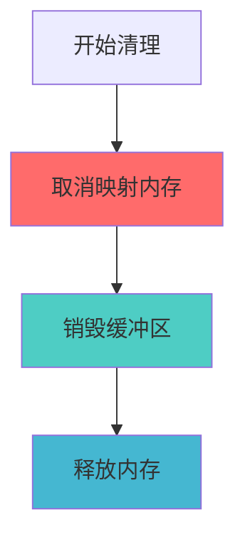

**清理顺序**:
1. 取消映射内存（如果已映射）
2. 销毁缓冲区对象
3. 释放设备内存

### 8. 常见陷阱

| 陷阱 | 问题 | 解决方案 |
|------|------|----------|
| 忘记绑定内存 | 缓冲区无法使用 | 创建后立即绑定内存 |
| 忽略对齐要求 | 性能下降或错误 | 使用查询到的对齐要求 |
| 频繁映射/取消映射 | 性能开销大 | 持久映射频繁更新的缓冲区 |
| 忘记刷新非一致内存 | GPU 看不到更新 | 使用 vkFlushMappedMemoryRanges |
| 内存类型不匹配 | 分配失败 | 检查内存类型位掩码 |
| 缓冲区大小不足 | 数据截断 | 确保大小足够，考虑对齐 |

### 9. 性能优化建议

```cpp
// ✅ 使用设备本地内存 + 暂存缓冲区
// 适合：大块静态数据（顶点、索引）

// ✅ 使用主机可见 + 主机一致内存
// 适合：频繁更新的小数据（Uniform Buffer）

// ✅ 批量传输
// 一次传输多个缓冲区，而不是逐个传输

// ✅ 使用专用传输队列
// 如果可用，使用专用传输队列提高并行性

// ⚠️ 避免每帧创建/销毁缓冲区
// 在初始化时创建，结束时销毁
```

---

## 总结

### VkBuffer 关键要点

1. **缓冲区是线性内存对象**: 存储连续的字节数据
2. **需要绑定设备内存**: 创建后必须绑定内存才能使用
3. **使用标志定义用途**: 指定缓冲区可以用于什么操作
4. **内存类型影响性能**: 选择合适的内存类型很重要
5. **对齐很重要**: 必须满足内存对齐要求
6. **暂存缓冲区模式**: 用于上传数据到设备本地内存
7. **映射用于 CPU 访问**: 主机可见内存可以映射

### 缓冲区创建流程


### 缓冲区类型选择指南

| 数据类型 | 使用标志 | 内存属性 | 更新频率 |
|---------|---------|---------|---------|
| 顶点数据 | VERTEX_BUFFER + TRANSFER_DST | DEVICE_LOCAL | 静态 |
| 索引数据 | INDEX_BUFFER + TRANSFER_DST | DEVICE_LOCAL | 静态 |
| Uniform Buffer | UNIFORM_BUFFER | HOST_VISIBLE + HOST_COHERENT | 每帧 |
| Storage Buffer | STORAGE_BUFFER | DEVICE_LOCAL | GPU 更新 |
| 暂存缓冲区 | TRANSFER_SRC | HOST_VISIBLE + HOST_COHERENT | 临时 |

### 进一步学习

- 深入了解 Vulkan 内存管理
- 学习缓冲区复制和传输优化
- 研究描述符集和缓冲区绑定
- 探索间接渲染和间接缓冲区
- 了解缓冲区设备地址扩展

---

**文档版本**: 1.0  
**最后更新**: 2024  
**相关文档**: 
- [VkQueue 详细分析](./VkQueue详细分析.md)
- [VkPhysicalDevice 详细分析](./VkPhysicalDevice详细分析.md)
- [VkInstance 详细分析](./VkInstance详细分析.md)

