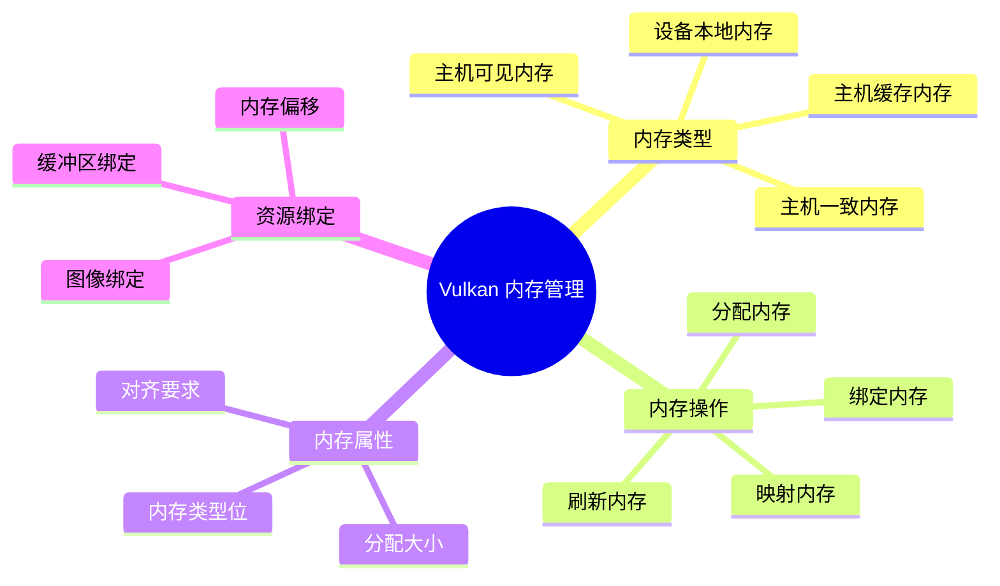
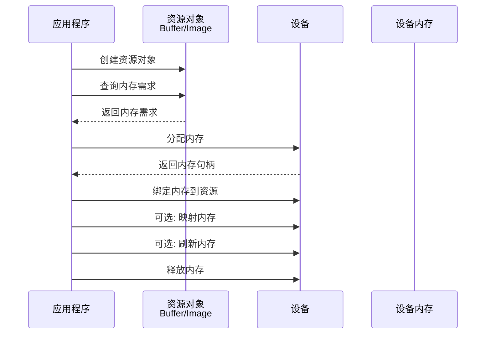
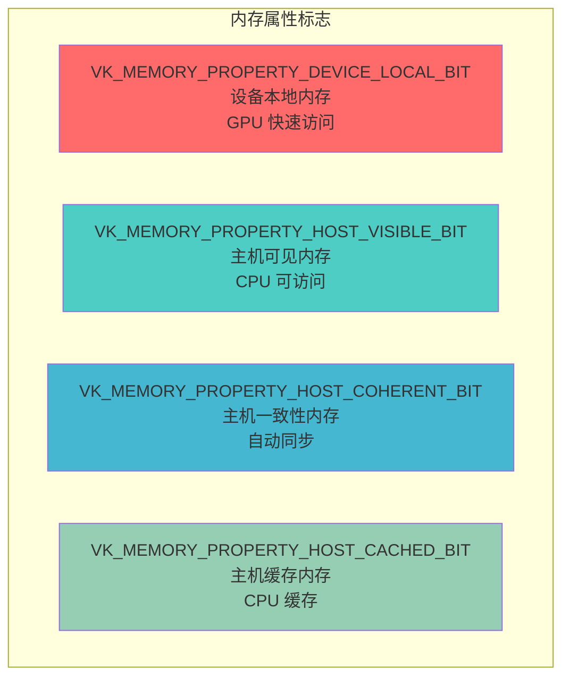
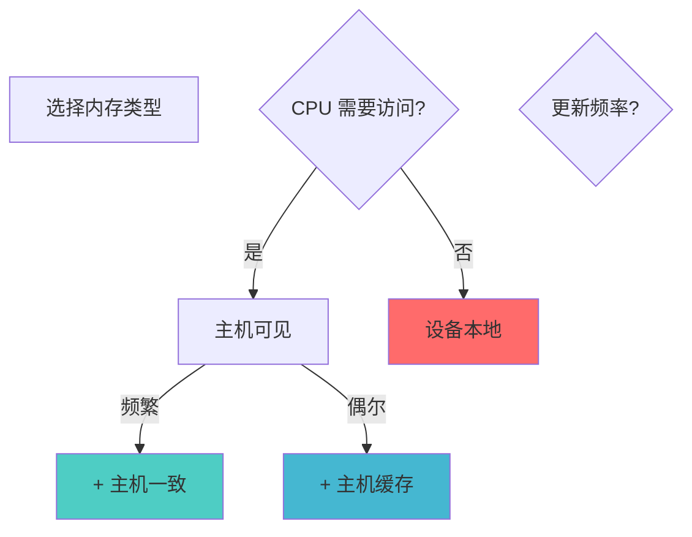

# Vulkan 内存管理详细分析文档

## 目录
1. [内存管理概述](#内存管理概述)
2. [内存类型与属性](#内存类型与属性)
3. [内存需求查询](#内存需求查询)
4. [内存分配](#内存分配)
5. [内存绑定](#内存绑定)
6. [内存映射](#内存映射)
7. [内存刷新与失效](#内存刷新与失效)
8. [内存对齐](#内存对齐)
9. [内存管理策略](#内存管理策略)
10. [实际代码示例](#实际代码示例)
11. [最佳实践](#最佳实践)

---

## 内存管理概述

### Vulkan 内存管理的特点

Vulkan 的内存管理是显式的，应用程序需要直接管理设备内存的分配、绑定和释放。这与 OpenGL 等 API 的自动内存管理不同。

### 内存管理的核心概念



### 内存管理流程



---

## 内存类型与属性

### 内存属性标志



### 1. 设备本地内存 (Device Local)

**VK_MEMORY_PROPERTY_DEVICE_LOCAL_BIT**:
- GPU 快速访问
- CPU 通常无法直接访问
- 用于频繁 GPU 访问的数据

**特点**:
- ✅ 最快的 GPU 访问速度
- ✅ 大容量（通常几GB）
- ❌ CPU 无法直接访问
- ❌ 需要通过暂存缓冲区传输数据

**使用场景**:
- 顶点缓冲区
- 索引缓冲区
- 纹理图像
- 渲染目标

### 2. 主机可见内存 (Host Visible)

**VK_MEMORY_PROPERTY_HOST_VISIBLE_BIT**:
- CPU 可以映射和访问
- 用于需要频繁更新的数据

**特点**:
- ✅ CPU 可以直接访问
- ✅ 适合频繁更新的数据
- ⚠️ GPU 访问速度较慢
- ⚠️ 容量通常较小

**使用场景**:
- Uniform Buffer（频繁更新）
- 暂存缓冲区
- 动态数据

### 3. 主机一致内存 (Host Coherent)

**VK_MEMORY_PROPERTY_HOST_COHERENT_BIT**:
- CPU 和 GPU 之间的写入自动同步
- 不需要手动刷新/失效操作

**特点**:
- ✅ 自动同步，无需手动刷新
- ✅ 适合频繁更新的 Uniform Buffer
- ⚠️ 性能可能略低于非一致内存

**使用场景**:
- 频繁更新的 Uniform Buffer
- 需要自动同步的数据

### 4. 主机缓存内存 (Host Cached)

**VK_MEMORY_PROPERTY_HOST_CACHED_BIT**:
- CPU 端有缓存
- 需要手动刷新使 GPU 可见

**特点**:
- ✅ CPU 访问速度快（有缓存）
- ⚠️ 需要手动刷新
- ⚠️ GPU 访问可能较慢

**使用场景**:
- 偶尔更新的数据
- CPU 频繁读取的数据

### 内存类型组合

| 组合 | 用途 | 特点 |
|------|------|------|
| DEVICE_LOCAL | 静态顶点/索引缓冲区 | GPU 最快，CPU 不可访问 |
| HOST_VISIBLE + HOST_COHERENT | 频繁更新的 Uniform Buffer | CPU 可访问，自动同步 |
| HOST_VISIBLE + HOST_CACHED | 偶尔更新的数据 | CPU 有缓存，需手动刷新 |
| DEVICE_LOCAL + HOST_VISIBLE | 集成显卡 | 两者都可访问 |

---

## 内存需求查询

### 查询缓冲区内存需求

```cpp
VkMemoryRequirements memRequirements;
vkGetBufferMemoryRequirements(device, buffer, &memRequirements);

// memRequirements 包含：
// - size: 所需内存大小（可能大于请求的大小，已对齐）
// - alignment: 内存对齐要求
// - memoryTypeBits: 支持的内存类型位掩码
```

### 查询图像内存需求

```cpp
VkMemoryRequirements memRequirements;
vkGetImageMemoryRequirements(device, image, &memRequirements);

// 与缓冲区类似，但图像可能有不同的对齐要求
```

### VkMemoryRequirements 结构

```cpp
typedef struct VkMemoryRequirements {
    VkDeviceSize    size;              // 所需内存大小（字节）
    VkDeviceSize    alignment;         // 内存对齐要求（字节）
    uint32_t        memoryTypeBits;    // 支持的内存类型位掩码
} VkMemoryRequirements;
```

### 内存类型位掩码

`memoryTypeBits` 是一个位掩码，每一位表示一个内存类型是否支持该资源：

```cpp
// 检查内存类型是否支持
bool isMemoryTypeSupported(uint32_t memoryTypeBits, uint32_t memoryTypeIndex) {
    return (memoryTypeBits & (1 << memoryTypeIndex)) != 0;
}
```

---

## 内存分配

### vkAllocateMemory 函数

```cpp
VkResult vkAllocateMemory(
    VkDevice                    device,             // 设备
    const VkMemoryAllocateInfo* pAllocateInfo,     // 分配信息
    const VkAllocationCallbacks* pAllocator,       // 分配回调（可选）
    VkDeviceMemory*             pMemory            // 输出的内存句柄
);
```

### VkMemoryAllocateInfo 结构

```cpp
typedef struct VkMemoryAllocateInfo {
    VkStructureType    sType;              // 结构体类型
    const void*       pNext;              // 扩展链
    VkDeviceSize      allocationSize;     // 分配大小（字节）
    uint32_t          memoryTypeIndex;    // 内存类型索引
} VkMemoryAllocateInfo;
```

### 基本内存分配

```cpp
// 1. 查询内存需求
VkMemoryRequirements memRequirements;
vkGetBufferMemoryRequirements(device, buffer, &memRequirements);

// 2. 查找合适的内存类型
VkPhysicalDeviceMemoryProperties memProperties;
vkGetPhysicalDeviceMemoryProperties(physicalDevice, &memProperties);

uint32_t memoryTypeIndex = UINT32_MAX;
for (uint32_t i = 0; i < memProperties.memoryTypeCount; i++) {
    // 检查内存类型是否支持
    if ((memRequirements.memoryTypeBits & (1 << i)) &&
        // 检查内存属性是否符合要求
        (memProperties.memoryTypes[i].propertyFlags & 
         (VK_MEMORY_PROPERTY_HOST_VISIBLE_BIT | 
          VK_MEMORY_PROPERTY_HOST_COHERENT_BIT)) ==
        (VK_MEMORY_PROPERTY_HOST_VISIBLE_BIT | 
         VK_MEMORY_PROPERTY_HOST_COHERENT_BIT)) {
        memoryTypeIndex = i;
        break;
    }
}

if (memoryTypeIndex == UINT32_MAX) {
    throw std::runtime_error("failed to find suitable memory type!");
}

// 3. 分配内存
VkMemoryAllocateInfo allocInfo{};
allocInfo.sType = VK_STRUCTURE_TYPE_MEMORY_ALLOCATE_INFO;
allocInfo.allocationSize = memRequirements.size;      // 分配大小（已对齐）
allocInfo.memoryTypeIndex = memoryTypeIndex;          // 内存类型索引

VkDeviceMemory memory;
VkResult result = vkAllocateMemory(device, &allocInfo, nullptr, &memory);
if (result != VK_SUCCESS) {
    throw std::runtime_error("failed to allocate memory!");
}
```

### 查找内存类型的辅助函数

```cpp
uint32_t findMemoryType(
    VkPhysicalDevice physicalDevice,
    uint32_t typeFilter,
    VkMemoryPropertyFlags properties) {
    
    VkPhysicalDeviceMemoryProperties memProperties;
    vkGetPhysicalDeviceMemoryProperties(physicalDevice, &memProperties);
    
    for (uint32_t i = 0; i < memProperties.memoryTypeCount; i++) {
        // 检查内存类型是否支持资源
        if ((typeFilter & (1 << i)) &&
            // 检查内存属性是否符合要求
            (memProperties.memoryTypes[i].propertyFlags & properties) == properties) {
            return i;
        }
    }
    
    throw std::runtime_error("failed to find suitable memory type!");
}
```

### 特殊分配：设备地址

```cpp
// 用于缓冲区设备地址扩展
VkMemoryAllocateFlagsInfo allocFlagsInfo{};
allocFlagsInfo.sType = VK_STRUCTURE_TYPE_MEMORY_ALLOCATE_FLAGS_INFO;
allocFlagsInfo.flags = VK_MEMORY_ALLOCATE_DEVICE_ADDRESS_BIT;

VkMemoryAllocateInfo allocInfo{};
allocInfo.sType = VK_STRUCTURE_TYPE_MEMORY_ALLOCATE_INFO;
allocInfo.pNext = &allocFlagsInfo;  // 链接扩展信息
allocInfo.allocationSize = size;
allocInfo.memoryTypeIndex = memoryTypeIndex;

VkDeviceMemory memory;
vkAllocateMemory(device, &allocInfo, nullptr, &memory);
```

---

## 内存绑定

### 绑定缓冲区内存

```cpp
VkResult vkBindBufferMemory(
    VkDevice        device,         // 设备
    VkBuffer        buffer,         // 缓冲区
    VkDeviceMemory  memory,         // 内存对象
    VkDeviceSize    offset          // 内存偏移量
);
```

### 绑定图像内存

```cpp
VkResult vkBindImageMemory(
    VkDevice        device,         // 设备
    VkImage         image,          // 图像
    VkDeviceMemory  memory,         // 内存对象
    VkDeviceSize    offset          // 内存偏移量
);
```

### 基本绑定示例

```cpp
// 绑定缓冲区
VkResult result = vkBindBufferMemory(device, buffer, memory, 0);
if (result != VK_SUCCESS) {
    throw std::runtime_error("failed to bind buffer memory!");
}

// 绑定图像
result = vkBindImageMemory(device, image, memory, 0);
if (result != VK_SUCCESS) {
    throw std::runtime_error("failed to bind image memory!");
}
```

### 绑定到内存偏移

```cpp
// 多个资源绑定到同一内存块的不同偏移
VkDeviceSize offset1 = 0;
VkDeviceSize offset2 = alignedSize(buffer1Size, alignment);
VkDeviceSize offset3 = offset2 + alignedSize(buffer2Size, alignment);

vkBindBufferMemory(device, buffer1, memory, offset1);
vkBindBufferMemory(device, buffer2, memory, offset2);
vkBindBufferMemory(device, buffer3, memory, offset3);
```

### 对齐辅助函数

```cpp
VkDeviceSize alignedSize(VkDeviceSize size, VkDeviceSize alignment) {
    return (size + alignment - 1) & ~(alignment - 1);
}
```

### 绑定时机

**绑定时机**:
- ✅ 在分配内存后立即绑定
- ✅ 在资源创建后、使用前绑定
- ❌ 不要在资源使用中重新绑定

---

## 内存映射

### vkMapMemory 函数

```cpp
VkResult vkMapMemory(
    VkDevice        device,         // 设备
    VkDeviceMemory  memory,         // 内存对象
    VkDeviceSize    offset,         // 偏移量
    VkDeviceSize    size,           // 大小（VK_WHOLE_SIZE 表示整个范围）
    VkMemoryMapFlags flags,         // 标志（保留，必须为 0）
    void**          ppData          // 输出的映射指针
);
```

### 基本映射示例

```cpp
// 映射整个内存范围
void* mappedData;
VkResult result = vkMapMemory(
    device,
    memory,
    0,                  // 偏移量
    VK_WHOLE_SIZE,      // 整个范围
    0,                  // 标志
    &mappedData         // 输出的映射指针
);

if (result == VK_SUCCESS) {
    // 现在可以通过 mappedData 访问内存
    memcpy(mappedData, sourceData, dataSize);
    
    // 取消映射
    vkUnmapMemory(device, memory);
}
```

### vkUnmapMemory 函数

```cpp
void vkUnmapMemory(
    VkDevice        device,         // 设备
    VkDeviceMemory  memory          // 内存对象
);
```

### 映射部分内存

```cpp
// 映射部分内存范围
void* mappedData;
VkDeviceSize offset = 1024;  // 从偏移 1024 开始
VkDeviceSize size = 4096;    // 映射 4096 字节

vkMapMemory(device, memory, offset, size, 0, &mappedData);

// 使用映射的内存
// ...

vkUnmapMemory(device, memory);
```

### 持久映射

```cpp
// 持久映射（保持映射状态）
void* persistentMapped;
vkMapMemory(device, uniformBufferMemory, 0, size, 0, &persistentMapped);

// 在渲染循环中直接更新
void updateUniformBuffer(const UniformBufferObject& ubo) {
    memcpy(persistentMapped, &ubo, sizeof(ubo));
    // 主机一致内存自动同步，无需刷新
}

// 应用程序退出时取消映射
vkUnmapMemory(device, uniformBufferMemory);
```

### 映射限制

**注意事项**:
- ⚠️ 只能映射主机可见内存
- ⚠️ 同一内存可以多次映射（但通常不推荐）
- ⚠️ 映射后需要取消映射才能释放内存
- ⚠️ 映射指针在取消映射后无效

---

## 内存刷新与失效

### 为什么需要刷新？

对于非一致内存（没有 `HOST_COHERENT_BIT`），CPU 的写入不会自动对 GPU 可见，需要手动刷新。

### vkFlushMappedMemoryRanges 函数

```cpp
VkResult vkFlushMappedMemoryRanges(
    VkDevice                        device,         // 设备
    uint32_t                        memoryRangeCount, // 范围数量
    const VkMappedMemoryRange*     pMemoryRanges   // 内存范围数组
);
```

### VkMappedMemoryRange 结构

```cpp
typedef struct VkMappedMemoryRange {
    VkStructureType    sType;          // 结构体类型
    const void*       pNext;          // 扩展链
    VkDeviceMemory    memory;         // 内存对象
    VkDeviceSize      offset;         // 偏移量
    VkDeviceSize      size;           // 大小（VK_WHOLE_SIZE 表示整个范围）
} VkMappedMemoryRange;
```

### 刷新内存示例

```cpp
// 刷新整个映射范围
VkMappedMemoryRange mappedRange{};
mappedRange.sType = VK_STRUCTURE_TYPE_MAPPED_MEMORY_RANGE;
mappedRange.memory = memory;
mappedRange.offset = 0;
mappedRange.size = VK_WHOLE_SIZE;

vkFlushMappedMemoryRanges(device, 1, &mappedRange);
```

### vkInvalidateMappedMemoryRanges 函数

```cpp
VkResult vkInvalidateMappedMemoryRanges(
    VkDevice                        device,
    uint32_t                        memoryRangeCount,
    const VkMappedMemoryRange*     pMemoryRanges
);
```

### 失效内存示例

```cpp
// 使 GPU 写入对 CPU 可见（非一致内存）
VkMappedMemoryRange mappedRange{};
mappedRange.sType = VK_STRUCTURE_TYPE_MAPPED_MEMORY_RANGE;
mappedRange.memory = memory;
mappedRange.offset = 0;
mappedRange.size = VK_WHOLE_SIZE;

vkInvalidateMappedMemoryRanges(device, 1, &mappedRange);
```

### 刷新策略

```cpp
void updateBufferData(
    VkDeviceMemory memory,
    void* data,
    VkDeviceSize size,
    VkMemoryPropertyFlags properties) {
    
    void* mapped;
    vkMapMemory(device, memory, 0, size, 0, &mapped);
    memcpy(mapped, data, size);
    
    // 如果是非一致内存，需要刷新
    if (!(properties & VK_MEMORY_PROPERTY_HOST_COHERENT_BIT)) {
        VkMappedMemoryRange range{};
        range.sType = VK_STRUCTURE_TYPE_MAPPED_MEMORY_RANGE;
        range.memory = memory;
        range.size = size;
        vkFlushMappedMemoryRanges(device, 1, &range);
    }
    
    vkUnmapMemory(device, memory);
}
```

---

## 内存对齐

### 对齐的重要性

内存对齐是 Vulkan 内存管理中的重要概念。不正确的对齐可能导致性能下降或错误。

### 对齐要求

```cpp
// 查询对齐要求
VkMemoryRequirements memRequirements;
vkGetBufferMemoryRequirements(device, buffer, &memRequirements);

VkDeviceSize alignment = memRequirements.alignment;  // 对齐要求
```

### 对齐计算

```cpp
// 计算对齐后的偏移量
VkDeviceSize alignedOffset(VkDeviceSize offset, VkDeviceSize alignment) {
    return (offset + alignment - 1) & ~(alignment - 1);
}

// 计算对齐后的大小
VkDeviceSize alignedSize(VkDeviceSize size, VkDeviceSize alignment) {
    return (size + alignment - 1) & ~(alignment - 1);
}
```

### 多个资源的内存布局

```cpp
// 在单个内存块中布局多个资源
VkDeviceSize totalSize = 0;
VkDeviceSize maxAlignment = 0;

// 计算总大小和对齐要求
for (const auto& buffer : buffers) {
    VkMemoryRequirements memReqs;
    vkGetBufferMemoryRequirements(device, buffer, &memReqs);
    
    maxAlignment = std::max(maxAlignment, memReqs.alignment);
    totalSize = alignedOffset(totalSize, memReqs.alignment) + memReqs.size;
}

// 分配内存
VkMemoryAllocateInfo allocInfo{};
allocInfo.allocationSize = alignedSize(totalSize, maxAlignment);
// ... 设置内存类型

VkDeviceMemory memory;
vkAllocateMemory(device, &allocInfo, nullptr, &memory);

// 绑定资源
VkDeviceSize currentOffset = 0;
for (size_t i = 0; i < buffers.size(); i++) {
    VkMemoryRequirements memReqs;
    vkGetBufferMemoryRequirements(device, buffers[i], &memReqs);
    
    currentOffset = alignedOffset(currentOffset, memReqs.alignment);
    vkBindBufferMemory(device, buffers[i], memory, currentOffset);
    
    currentOffset += memReqs.size;
}
```

---

## 内存管理策略

### 1. 单个资源单个内存

**策略**: 每个资源分配独立的内存块

**优点**:
- ✅ 简单易用
- ✅ 易于管理

**缺点**:
- ❌ 内存碎片
- ❌ 分配开销大

```cpp
// 为每个缓冲区分配独立内存
for (auto& buffer : buffers) {
    VkMemoryRequirements memReqs;
    vkGetBufferMemoryRequirements(device, buffer, &memReqs);
    
    VkMemoryAllocateInfo allocInfo{};
    allocInfo.allocationSize = memReqs.size;
    allocInfo.memoryTypeIndex = findMemoryType(...);
    
    VkDeviceMemory memory;
    vkAllocateMemory(device, &allocInfo, nullptr, &memory);
    vkBindBufferMemory(device, buffer, memory, 0);
}
```

### 2. 批量分配

**策略**: 多个资源共享一个内存块

**优点**:
- ✅ 减少内存碎片
- ✅ 减少分配次数
- ✅ 更好的内存利用率

**缺点**:
- ⚠️ 需要手动管理偏移
- ⚠️ 需要处理对齐

```cpp
// 批量分配内存
VkDeviceSize totalSize = 0;
VkDeviceSize maxAlignment = 0;

// 计算总大小
for (const auto& buffer : buffers) {
    VkMemoryRequirements memReqs;
    vkGetBufferMemoryRequirements(device, buffer, &memReqs);
    maxAlignment = std::max(maxAlignment, memReqs.alignment);
    totalSize = alignedOffset(totalSize, memReqs.alignment) + memReqs.size;
}

// 分配单个大块内存
VkMemoryAllocateInfo allocInfo{};
allocInfo.allocationSize = alignedSize(totalSize, maxAlignment);
allocInfo.memoryTypeIndex = findMemoryType(...);

VkDeviceMemory memory;
vkAllocateMemory(device, &allocInfo, nullptr, &memory);

// 绑定到不同偏移
VkDeviceSize offset = 0;
for (size_t i = 0; i < buffers.size(); i++) {
    VkMemoryRequirements memReqs;
    vkGetBufferMemoryRequirements(device, buffers[i], &memReqs);
    
    offset = alignedOffset(offset, memReqs.alignment);
    vkBindBufferMemory(device, buffers[i], memory, offset);
    offset += memReqs.size;
}
```

### 3. 内存池

**策略**: 预分配内存池，从池中分配

**优点**:
- ✅ 减少分配开销
- ✅ 更好的性能
- ✅ 统一管理

**缺点**:
- ⚠️ 实现复杂
- ⚠️ 需要内存管理算法

---

## 实际代码示例

### 示例 1: 完整的缓冲区创建流程

```cpp
class BufferManager {
private:
    VkDevice device;
    VkPhysicalDevice physicalDevice;
    
    uint32_t findMemoryType(
        uint32_t typeFilter,
        VkMemoryPropertyFlags properties) {
        
        VkPhysicalDeviceMemoryProperties memProperties;
        vkGetPhysicalDeviceMemoryProperties(physicalDevice, &memProperties);
        
        for (uint32_t i = 0; i < memProperties.memoryTypeCount; i++) {
            if ((typeFilter & (1 << i)) &&
                (memProperties.memoryTypes[i].propertyFlags & properties) == properties) {
                return i;
            }
        }
        
        throw std::runtime_error("failed to find suitable memory type!");
    }
    
public:
    void createBuffer(
        VkDeviceSize size,
        VkBufferUsageFlags usage,
        VkMemoryPropertyFlags properties,
        VkBuffer& buffer,
        VkDeviceMemory& bufferMemory) {
        
        // 1. 创建缓冲区
        VkBufferCreateInfo bufferInfo{};
        bufferInfo.sType = VK_STRUCTURE_TYPE_BUFFER_CREATE_INFO;
        bufferInfo.size = size;
        bufferInfo.usage = usage;
        bufferInfo.sharingMode = VK_SHARING_MODE_EXCLUSIVE;
        
        vkCreateBuffer(device, &bufferInfo, nullptr, &buffer);
        
        // 2. 查询内存需求
        VkMemoryRequirements memRequirements;
        vkGetBufferMemoryRequirements(device, buffer, &memRequirements);
        
        // 3. 分配内存
        VkMemoryAllocateInfo allocInfo{};
        allocInfo.sType = VK_STRUCTURE_TYPE_MEMORY_ALLOCATE_INFO;
        allocInfo.allocationSize = memRequirements.size;
        allocInfo.memoryTypeIndex = findMemoryType(
            memRequirements.memoryTypeBits,
            properties
        );
        
        vkAllocateMemory(device, &allocInfo, nullptr, &bufferMemory);
        
        // 4. 绑定内存
        vkBindBufferMemory(device, buffer, bufferMemory, 0);
    }
    
    void updateBuffer(
        VkDeviceMemory memory,
        void* data,
        VkDeviceSize size,
        VkMemoryPropertyFlags properties) {
        
        // 1. 映射内存
        void* mapped;
        vkMapMemory(device, memory, 0, size, 0, &mapped);
        
        // 2. 复制数据
        memcpy(mapped, data, size);
        
        // 3. 刷新（如果是非一致内存）
        if (!(properties & VK_MEMORY_PROPERTY_HOST_COHERENT_BIT)) {
            VkMappedMemoryRange range{};
            range.sType = VK_STRUCTURE_TYPE_MAPPED_MEMORY_RANGE;
            range.memory = memory;
            range.size = size;
            vkFlushMappedMemoryRanges(device, 1, &range);
        }
        
        // 4. 取消映射
        vkUnmapMemory(device, memory);
    }
};
```

### 示例 2: 统一缓冲区管理

```cpp
class UniformBuffer {
private:
    VkDevice device;
    VkDeviceMemory memory;
    void* mapped = nullptr;
    VkDeviceSize size;
    VkMemoryPropertyFlags properties;
    
public:
    void create(VkDevice dev, VkPhysicalDevice physicalDevice, VkDeviceSize bufferSize) {
        device = dev;
        size = bufferSize;
        properties = VK_MEMORY_PROPERTY_HOST_VISIBLE_BIT | 
                     VK_MEMORY_PROPERTY_HOST_COHERENT_BIT;
        
        // 创建缓冲区
        VkBufferCreateInfo bufferInfo{};
        bufferInfo.sType = VK_STRUCTURE_TYPE_BUFFER_CREATE_INFO;
        bufferInfo.size = size;
        bufferInfo.usage = VK_BUFFER_USAGE_UNIFORM_BUFFER_BIT;
        bufferInfo.sharingMode = VK_SHARING_MODE_EXCLUSIVE;
        
        VkBuffer buffer;
        vkCreateBuffer(device, &bufferInfo, nullptr, &buffer);
        
        // 查询内存需求
        VkMemoryRequirements memReqs;
        vkGetBufferMemoryRequirements(device, buffer, &memReqs);
        
        // 分配内存
        VkMemoryAllocateInfo allocInfo{};
        allocInfo.sType = VK_STRUCTURE_TYPE_MEMORY_ALLOCATE_INFO;
        allocInfo.allocationSize = memReqs.size;
        allocInfo.memoryTypeIndex = findMemoryType(
            physicalDevice,
            memReqs.memoryTypeBits,
            properties
        );
        
        vkAllocateMemory(device, &allocInfo, nullptr, &memory);
        
        // 绑定内存
        vkBindBufferMemory(device, buffer, memory, 0);
        
        // 持久映射
        vkMapMemory(device, memory, 0, size, 0, &mapped);
    }
    
    void update(const void* data) {
        // 直接写入映射的内存（主机一致内存自动同步）
        memcpy(mapped, data, size);
    }
    
    void destroy() {
        if (mapped) {
            vkUnmapMemory(device, memory);
            mapped = nullptr;
        }
        vkFreeMemory(device, memory, nullptr);
    }
};
```

### 示例 3: 批量内存分配

```cpp
class BatchMemoryAllocator {
private:
    struct Allocation {
        VkDeviceMemory memory;
        VkDeviceSize offset;
        VkDeviceSize size;
    };
    
    VkDevice device;
    VkPhysicalDevice physicalDevice;
    std::vector<Allocation> allocations;
    
public:
    void allocateBatch(
        const std::vector<VkBuffer>& buffers,
        VkMemoryPropertyFlags properties) {
        
        // 1. 计算总大小和对齐
        VkDeviceSize totalSize = 0;
        VkDeviceSize maxAlignment = 0;
        std::vector<VkMemoryRequirements> memReqs(buffers.size());
        
        for (size_t i = 0; i < buffers.size(); i++) {
            vkGetBufferMemoryRequirements(device, buffers[i], &memReqs[i]);
            maxAlignment = std::max(maxAlignment, memReqs[i].alignment);
            totalSize = alignedOffset(totalSize, memReqs[i].alignment) + memReqs[i].size;
        }
        
        // 2. 分配内存
        VkMemoryAllocateInfo allocInfo{};
        allocInfo.sType = VK_STRUCTURE_TYPE_MEMORY_ALLOCATE_INFO;
        allocInfo.allocationSize = alignedSize(totalSize, maxAlignment);
        allocInfo.memoryTypeIndex = findMemoryType(
            physicalDevice,
            memReqs[0].memoryTypeBits,  // 假设所有缓冲区支持相同的内存类型
            properties
        );
        
        VkDeviceMemory memory;
        vkAllocateMemory(device, &allocInfo, nullptr, &memory);
        
        // 3. 绑定到不同偏移
        VkDeviceSize offset = 0;
        for (size_t i = 0; i < buffers.size(); i++) {
            offset = alignedOffset(offset, memReqs[i].alignment);
            vkBindBufferMemory(device, buffers[i], memory, offset);
            
            allocations.push_back({memory, offset, memReqs[i].size});
            offset += memReqs[i].size;
        }
    }
    
    void freeAll() {
        // 释放所有分配的内存
        for (const auto& alloc : allocations) {
            vkFreeMemory(device, alloc.memory, nullptr);
        }
        allocations.clear();
    }
};
```

---

## 最佳实践

### 1. 内存类型选择



### 2. 分配策略

**DO**:
- ✅ 批量分配相关资源
- ✅ 考虑内存对齐
- ✅ 使用合适的内存类型
- ✅ 及时释放不需要的内存

**DON'T**:
- ❌ 为每个小资源单独分配
- ❌ 忽略对齐要求
- ❌ 使用错误的内存类型
- ❌ 忘记释放内存

### 3. 映射策略

**DO**:
- ✅ 持久映射频繁更新的缓冲区
- ✅ 临时映射偶尔更新的缓冲区
- ✅ 使用主机一致内存避免手动刷新

**DON'T**:
- ❌ 频繁映射/取消映射
- ❌ 忘记取消映射就释放内存
- ❌ 在映射后访问无效指针

### 4. 刷新策略

**DO**:
- ✅ 非一致内存写入后刷新
- ✅ 非一致内存读取前失效
- ✅ 使用主机一致内存避免刷新

**DON'T**:
- ❌ 忘记刷新非一致内存
- ❌ 过度刷新（主机一致内存不需要）

### 5. 常见陷阱

| 陷阱 | 问题 | 解决方案 |
|------|------|----------|
| 忘记绑定内存 | 资源无法使用 | 创建后立即绑定 |
| 忽略对齐要求 | 性能下降或错误 | 使用对齐后的偏移 |
| 忘记刷新非一致内存 | GPU 看不到更新 | 写入后刷新 |
| 内存类型不匹配 | 分配失败 | 检查内存类型位掩码 |
| 忘记取消映射 | 无法释放内存 | 释放前取消映射 |

### 6. 性能优化建议

```cpp
// ✅ 批量分配
// 一次分配大块内存，多个资源共享

// ✅ 持久映射频繁更新的缓冲区
void* mapped;
vkMapMemory(device, memory, 0, size, 0, &mapped);
// 保持映射，直接更新
memcpy(mapped, data, size);  // 主机一致内存自动同步

// ✅ 使用主机一致内存避免刷新
VkMemoryPropertyFlags properties = 
    VK_MEMORY_PROPERTY_HOST_VISIBLE_BIT | 
    VK_MEMORY_PROPERTY_HOST_COHERENT_BIT;

// ⚠️ 避免频繁分配/释放
// 在初始化时分配，结束时释放
```

---

## 总结

### 内存管理关键要点

1. **显式管理**: Vulkan 需要显式管理内存分配和释放
2. **内存类型**: 选择合适的内存类型很重要
3. **对齐要求**: 必须满足内存对齐要求
4. **绑定操作**: 资源必须绑定到内存才能使用
5. **映射访问**: 只有主机可见内存可以映射
6. **刷新同步**: 非一致内存需要手动刷新
7. **批量分配**: 批量分配可以提高效率

### 内存管理流程


### 内存类型选择指南

| 用途 | 内存类型 | 特点 |
|------|---------|------|
| 静态顶点/索引 | DEVICE_LOCAL | GPU 最快 |
| 频繁更新的 Uniform | HOST_VISIBLE + HOST_COHERENT | CPU 可访问，自动同步 |
| 偶尔更新的数据 | HOST_VISIBLE + HOST_CACHED | CPU 缓存，需手动刷新 |
| 暂存缓冲区 | HOST_VISIBLE + HOST_COHERENT | 临时使用 |

### 进一步学习

- 深入了解内存对齐和优化
- 学习内存池和分配器实现
- 研究稀疏内存和高级特性
- 探索内存性能优化技巧
- 了解不同 GPU 的内存架构

---

**文档版本**: 1.0  
**最后更新**: 2024  
**相关文档**: 
- [VkBuffer 详细分析](./VkBuffer详细分析.md)
- [VkImage 详细分析](./VkImage详细分析.md)
- [VkSemaphore 详细分析](./VkSemaphore详细分析.md)

