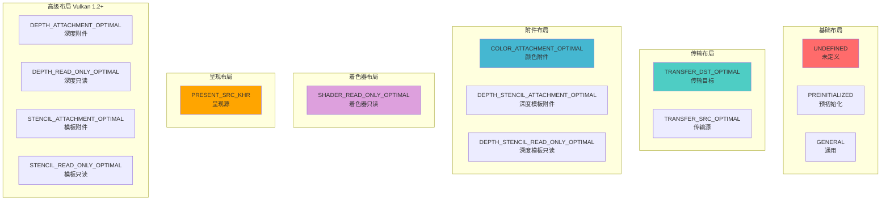
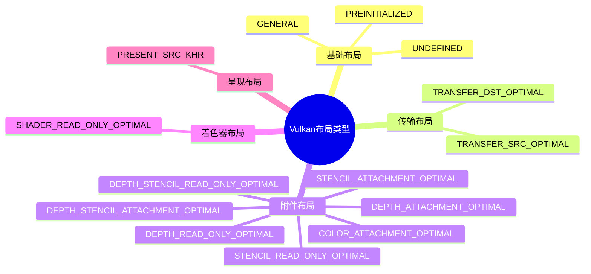
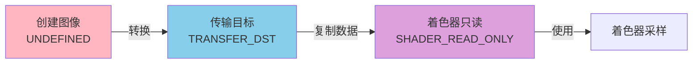
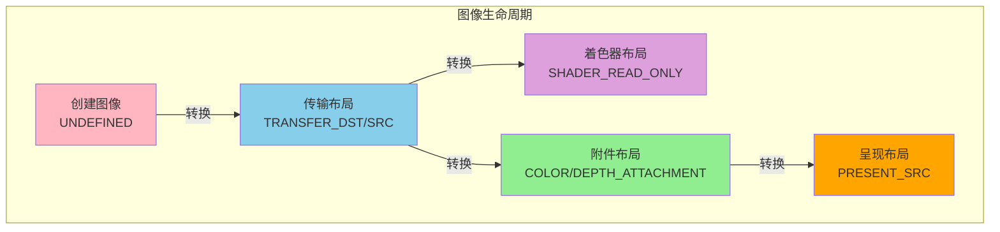
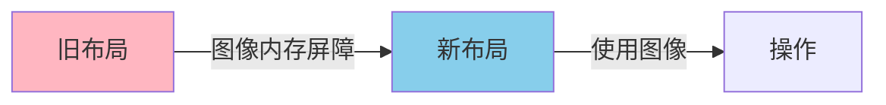
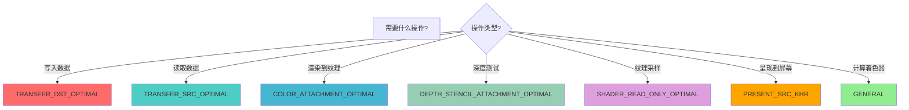
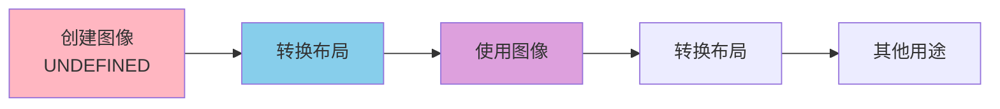

# Vulkan 布局详细分析文档

## 目录
1. [Vulkan 中的布局类型总览](#vulkan-中的布局类型总览)
2. [布局是什么？用生活例子理解](#布局是什么用生活例子理解)
3. [图像布局概述](#图像布局概述)
4. [基础布局类型](#基础布局类型)
5. [传输布局](#传输布局)
6. [附件布局](#附件布局)
7. [着色器布局](#着色器布局)
8. [呈现布局](#呈现布局)
9. [高级布局类型](#高级布局类型)
10. [布局转换](#布局转换)
11. [布局选择指南](#布局选择指南)
12. [实际代码示例](#实际代码示例)
13. [最佳实践](#最佳实践)

---

## Vulkan 中的布局类型总览

### 布局类型概述

在 Vulkan 中，**布局（Layout）**主要用于指定图像数据在内存中的组织方式。Vulkan 主要提供了**图像布局（Image Layout）**这一种布局类型，但包含多种不同的布局枚举值，每种布局针对不同的使用场景进行了优化。

### 所有图像布局类型列表

Vulkan 中定义了以下图像布局类型：



### 完整布局类型表格

| 布局类型 | 枚举值 | 版本要求 | 说明 | 主要用途 |
|---------|--------|---------|------|---------|
| **UNDEFINED** | `VK_IMAGE_LAYOUT_UNDEFINED` | Vulkan 1.0 | 未定义布局 | 初始状态 |
| **PREINITIALIZED** | `VK_IMAGE_LAYOUT_PREINITIALIZED` | Vulkan 1.0 | 预初始化布局 | 主机初始化 |
| **GENERAL** | `VK_IMAGE_LAYOUT_GENERAL` | Vulkan 1.0 | 通用布局 | 存储图像 |
| **TRANSFER_DST_OPTIMAL** | `VK_IMAGE_LAYOUT_TRANSFER_DST_OPTIMAL` | Vulkan 1.0 | 传输目标布局 | 接收数据 |
| **TRANSFER_SRC_OPTIMAL** | `VK_IMAGE_LAYOUT_TRANSFER_SRC_OPTIMAL` | Vulkan 1.0 | 传输源布局 | 发送数据 |
| **COLOR_ATTACHMENT_OPTIMAL** | `VK_IMAGE_LAYOUT_COLOR_ATTACHMENT_OPTIMAL` | Vulkan 1.0 | 颜色附件布局 | 渲染目标 |
| **DEPTH_STENCIL_ATTACHMENT_OPTIMAL** | `VK_IMAGE_LAYOUT_DEPTH_STENCIL_ATTACHMENT_OPTIMAL` | Vulkan 1.0 | 深度模板附件布局 | 深度缓冲 |
| **DEPTH_STENCIL_READ_ONLY_OPTIMAL** | `VK_IMAGE_LAYOUT_DEPTH_STENCIL_READ_ONLY_OPTIMAL` | Vulkan 1.0 | 深度模板只读布局 | 深度读取 |
| **SHADER_READ_ONLY_OPTIMAL** | `VK_IMAGE_LAYOUT_SHADER_READ_ONLY_OPTIMAL` | Vulkan 1.0 | 着色器只读布局 | 纹理采样 |
| **PRESENT_SRC_KHR** | `VK_IMAGE_LAYOUT_PRESENT_SRC_KHR` | Vulkan 1.0 | 呈现源布局 | 屏幕呈现 |
| **DEPTH_ATTACHMENT_OPTIMAL** | `VK_IMAGE_LAYOUT_DEPTH_ATTACHMENT_OPTIMAL` | Vulkan 1.2+ | 深度附件布局 | 仅深度缓冲 |
| **DEPTH_READ_ONLY_OPTIMAL** | `VK_IMAGE_LAYOUT_DEPTH_READ_ONLY_OPTIMAL` | Vulkan 1.2+ | 深度只读布局 | 仅深度读取 |
| **STENCIL_ATTACHMENT_OPTIMAL** | `VK_IMAGE_LAYOUT_STENCIL_ATTACHMENT_OPTIMAL` | Vulkan 1.2+ | 模板附件布局 | 仅模板缓冲 |
| **STENCIL_READ_ONLY_OPTIMAL** | `VK_IMAGE_LAYOUT_STENCIL_READ_ONLY_OPTIMAL` | Vulkan 1.2+ | 模板只读布局 | 仅模板读取 |
| **DEPTH_READ_ONLY_STENCIL_ATTACHMENT_OPTIMAL** | `VK_IMAGE_LAYOUT_DEPTH_READ_ONLY_STENCIL_ATTACHMENT_OPTIMAL` | Vulkan 1.2+ | 深度只读模板附件布局 | 深度只读+模板写入 |
| **DEPTH_ATTACHMENT_STENCIL_READ_ONLY_OPTIMAL** | `VK_IMAGE_LAYOUT_DEPTH_ATTACHMENT_STENCIL_READ_ONLY_OPTIMAL` | Vulkan 1.2+ | 深度附件模板只读布局 | 深度写入+模板只读 |

### 布局类型分类

#### 按功能分类



#### 按版本分类

| 版本 | 布局类型数量 | 新增布局 |
|------|------------|---------|
| **Vulkan 1.0** | 10 | UNDEFINED, PREINITIALIZED, GENERAL, TRANSFER_DST/SRC, COLOR_ATTACHMENT, DEPTH_STENCIL_ATTACHMENT/READ_ONLY, SHADER_READ_ONLY, PRESENT_SRC |
| **Vulkan 1.2+** | 16 | 新增深度/模板分离布局 |

### 布局类型选择指南

| 使用场景 | 推荐布局 | 说明 |
|---------|---------|------|
| **初始状态** | `UNDEFINED` | 图像创建时的默认布局 |
| **主机初始化** | `PREINITIALIZED` | 从主机内存初始化线性图像 |
| **数据传输写入** | `TRANSFER_DST_OPTIMAL` | 从缓冲区复制到图像 |
| **数据传输读取** | `TRANSFER_SRC_OPTIMAL` | 从图像复制到缓冲区 |
| **颜色渲染** | `COLOR_ATTACHMENT_OPTIMAL` | 作为颜色附件渲染 |
| **深度测试** | `DEPTH_STENCIL_ATTACHMENT_OPTIMAL` | 作为深度模板附件 |
| **纹理采样** | `SHADER_READ_ONLY_OPTIMAL` | 在着色器中采样纹理 |
| **屏幕呈现** | `PRESENT_SRC_KHR` | 呈现到屏幕 |
| **存储图像** | `GENERAL` | 计算着色器中的存储图像 |

---

## 布局是什么？用生活例子理解

---

## 图像布局是什么？用生活例子理解

### 🏠 最简单的理解：图像布局 = 房间用途

想象你在管理一个房间：

```
房间（图像）                用途（布局）              活动（操作）
    │                            │                        │
    │  1. 空房间                 │                        │
    │     （UNDEFINED）           │                        │
    │                            │                        │
    │  2. 改成仓库               │                        │
    │     （TRANSFER_DST）        │                        │
    │                            │                        │
    │  3. 存放物品               │                        │
    │     （复制数据）             │                        │
    │                            │                        │
    │  4. 改成办公室             │                        │
    │     （SHADER_READ_ONLY）    │                        │
    │                            │                        │
    │  5. 在办公室工作           │                        │
    │     （着色器读取）           │                        │
```

**布局（Layout）就像房间的用途**：
- **UNDEFINED** = 空房间，还没有用途
- **TRANSFER_DST** = 仓库，用于存放物品
- **SHADER_READ_ONLY** = 办公室，用于工作
- **COLOR_ATTACHMENT** = 画室，用于绘画

### 🎨 更具体的例子：画布的不同状态

想象你在画画，画布有不同的状态：

```
画布（图像）                状态（布局）              操作
    │                            │                        │
    │  1. 空白画布               │                        │
    │     （UNDEFINED）           │                        │
    │                            │                        │
    │  2. 准备上色               │                        │
    │     （TRANSFER_DST）        │                        │
    │                            │                        │
    │  3. 上色                   │                        │
    │     （复制纹理数据）         │                        │
    │                            │                        │
    │  4. 完成，可以展示         │                        │
    │     （SHADER_READ_ONLY）    │                        │
    │                            │                        │
    │  5. 展示画作               │                        │
    │     （着色器采样）           │                        │
```

### 🏗️ 建筑工地例子：不同施工阶段

想象你在建房子，有不同的施工阶段：

```
建筑（图像）                阶段（布局）              活动
    │                            │                        │
    │  1. 空地                   │                        │
    │     （UNDEFINED）           │                        │
    │                            │                        │
    │  2. 准备材料               │                        │
    │     （TRANSFER_DST）        │                        │
    │                            │                        │
    │  3. 运材料                 │                        │
    │     （数据传输）             │                        │
    │                            │                        │
    │  4. 开始施工               │                        │
    │     （COLOR_ATTACHMENT）    │                        │
    │                            │                        │
    │  5. 施工中                 │                        │
    │     （渲染到附件）           │                        │
```

### 💻 在Vulkan中的实际场景

#### 场景1：纹理加载流程

```cpp
// 1. 图像创建时：未定义布局
VkImage image;
vkCreateImage(...);  // 默认是 UNDEFINED

// 2. 转换到传输目标布局（准备接收数据）
transitionLayout(image, 
    VK_IMAGE_LAYOUT_UNDEFINED,           // 从：未定义
    VK_IMAGE_LAYOUT_TRANSFER_DST_OPTIMAL // 到：传输目标
);

// 3. 复制数据到图像
vkCmdCopyBufferToImage(...);

// 4. 转换到着色器只读布局（准备在着色器中使用）
transitionLayout(image,
    VK_IMAGE_LAYOUT_TRANSFER_DST_OPTIMAL,    // 从：传输目标
    VK_IMAGE_LAYOUT_SHADER_READ_ONLY_OPTIMAL // 到：着色器只读
);

// 5. 在着色器中采样纹理
vkCmdDraw(...);  // 着色器可以读取纹理了
```

**为什么需要布局？**
- 不同操作需要不同的内存组织方式
- 布局告诉GPU如何优化内存访问
- 确保数据访问的正确性和性能

### 🎯 图像布局的关键概念



### ✅ 总结：图像布局就是什么？

**一句话总结**：布局（Layout）就是**图像在内存中的"组织方式"**，告诉GPU如何优化访问图像数据。

**三个关键词**：
1. **内存组织** - 图像数据在内存中的排列方式
2. **访问优化** - 不同布局针对不同访问模式优化
3. **布局转换** - 在不同布局之间转换需要屏障

**记住这个公式**：
```
创建图像 → 转换布局 → 使用图像 → 转换布局 → 其他用途
```

**常见使用场景**：
- ✅ 纹理加载（UNDEFINED → TRANSFER_DST → SHADER_READ_ONLY）
- ✅ 渲染到纹理（UNDEFINED → COLOR_ATTACHMENT）
- ✅ 深度测试（UNDEFINED → DEPTH_STENCIL_ATTACHMENT）
- ✅ 呈现到屏幕（COLOR_ATTACHMENT → PRESENT_SRC）

---

## 图像布局概述

### 什么是图像布局？

图像布局（Image Layout）是 Vulkan 中唯一的布局类型，它指定了图像数据在内存中的组织方式。不同的布局针对不同的访问模式进行了优化，确保GPU能够高效地访问图像数据。

**注意**: 在 Vulkan 中，布局概念主要应用于图像（Image）。缓冲区（Buffer）没有布局概念，因为缓冲区的内存组织是线性的，不需要布局转换。

### 图像布局的核心特点

- **内存优化**: 不同布局针对不同访问模式优化
- **访问控制**: 布局限制可以进行的操作
- **性能影响**: 正确的布局可以显著提高性能
- **布局转换**: 在不同布局之间转换需要屏障
- **状态管理**: 布局是图像的状态之一

### 图像布局在 Vulkan 架构中的位置



---

## 基础布局类型

### VK_IMAGE_LAYOUT_UNDEFINED

**说明**: 未定义布局，图像内容未定义或无关紧要。

**特点**:
- 仅作为初始布局有效
- 图像内容可能被丢弃
- 不需要同步
- 性能开销最小

**使用场景**:
- 图像创建时的初始状态
- 不需要保留图像内容时

**代码示例**:
```cpp
VkImageCreateInfo imageInfo{};
imageInfo.initialLayout = VK_IMAGE_LAYOUT_UNDEFINED;  // 初始布局
```

### VK_IMAGE_LAYOUT_PREINITIALIZED

**说明**: 预初始化布局，图像内容已由主机预初始化。

**特点**:
- 仅对线性图像有效
- 保留内存内容
- 需要主机写入同步

**使用场景**:
- 从主机内存直接初始化图像
- 线性图像（非最优平铺）

**代码示例**:
```cpp
VkImageCreateInfo imageInfo{};
imageInfo.initialLayout = VK_IMAGE_LAYOUT_PREINITIALIZED;  // 预初始化
// 从主机内存写入数据...
```

### VK_IMAGE_LAYOUT_GENERAL

**说明**: 通用布局，支持所有操作但可能不是最优的。

**特点**:
- 支持所有操作
- 性能可能不是最优
- 不需要频繁转换布局

**使用场景**:
- 需要多种访问模式
- 存储图像（Storage Image）
- 计算着色器读写

**代码示例**:
```cpp
// 计算着色器中的存储图像
layout(set = 0, binding = 0, rgba8) uniform image2D storageImage;
// 布局：GENERAL
```

---

## 传输布局

### VK_IMAGE_LAYOUT_TRANSFER_DST_OPTIMAL

**说明**: 传输目标布局，优化用于接收传输数据。

**特点**:
- 优化用于写入操作
- 用于 `vkCmdCopyBufferToImage`
- 用于 `vkCmdCopyImageToImage`
- 性能最优的写入布局

**使用场景**:
- 从缓冲区复制数据到图像
- 从另一个图像复制数据
- 纹理加载

**代码示例**:
```cpp
// 转换到传输目标布局
VkImageMemoryBarrier barrier{};
barrier.oldLayout = VK_IMAGE_LAYOUT_UNDEFINED;
barrier.newLayout = VK_IMAGE_LAYOUT_TRANSFER_DST_OPTIMAL;
barrier.dstAccessMask = VK_ACCESS_TRANSFER_WRITE_BIT;
vkCmdPipelineBarrier(...);

// 复制数据
vkCmdCopyBufferToImage(commandBuffer, buffer, image, 
    VK_IMAGE_LAYOUT_TRANSFER_DST_OPTIMAL, ...);
```

### VK_IMAGE_LAYOUT_TRANSFER_SRC_OPTIMAL

**说明**: 传输源布局，优化用于作为传输源。

**特点**:
- 优化用于读取操作
- 用于 `vkCmdCopyImageToBuffer`
- 用于 `vkCmdCopyImageToImage`
- 性能最优的读取布局

**使用场景**:
- 从图像复制数据到缓冲区
- 从图像复制到另一个图像
- 图像数据读取

**代码示例**:
```cpp
// 转换到传输源布局
VkImageMemoryBarrier barrier{};
barrier.oldLayout = VK_IMAGE_LAYOUT_SHADER_READ_ONLY_OPTIMAL;
barrier.newLayout = VK_IMAGE_LAYOUT_TRANSFER_SRC_OPTIMAL;
barrier.srcAccessMask = VK_ACCESS_SHADER_READ_BIT;
barrier.dstAccessMask = VK_ACCESS_TRANSFER_READ_BIT;
vkCmdPipelineBarrier(...);

// 复制数据
vkCmdCopyImageToBuffer(commandBuffer, image, 
    VK_IMAGE_LAYOUT_TRANSFER_SRC_OPTIMAL, buffer, ...);
```

---

## 附件布局

### VK_IMAGE_LAYOUT_COLOR_ATTACHMENT_OPTIMAL

**说明**: 颜色附件布局，优化用于作为颜色附件。

**特点**:
- 优化用于颜色附件写入
- 用于渲染目标
- 支持颜色附件读写
- 性能最优的渲染布局

**使用场景**:
- 渲染到纹理（Render to Texture）
- 离屏渲染
- 颜色附件

**代码示例**:
```cpp
// 转换到颜色附件布局
VkImageMemoryBarrier barrier{};
barrier.oldLayout = VK_IMAGE_LAYOUT_UNDEFINED;
barrier.newLayout = VK_IMAGE_LAYOUT_COLOR_ATTACHMENT_OPTIMAL;
barrier.dstAccessMask = VK_ACCESS_COLOR_ATTACHMENT_WRITE_BIT;
vkCmdPipelineBarrier(...);

// 作为颜色附件使用
VkRenderPassBeginInfo renderPassInfo{};
renderPassInfo.pAttachments = &colorAttachment;  // 颜色附件
```

### VK_IMAGE_LAYOUT_DEPTH_STENCIL_ATTACHMENT_OPTIMAL

**说明**: 深度模板附件布局，优化用于作为深度模板附件。

**特点**:
- 优化用于深度模板写入
- 用于深度测试
- 支持深度模板读写
- 性能最优的深度布局

**使用场景**:
- 深度缓冲
- 模板缓冲
- 深度测试

**代码示例**:
```cpp
// 转换到深度模板附件布局
VkImageMemoryBarrier barrier{};
barrier.oldLayout = VK_IMAGE_LAYOUT_UNDEFINED;
barrier.newLayout = VK_IMAGE_LAYOUT_DEPTH_STENCIL_ATTACHMENT_OPTIMAL;
barrier.dstAccessMask = VK_ACCESS_DEPTH_STENCIL_ATTACHMENT_WRITE_BIT;
vkCmdPipelineBarrier(...);

// 作为深度附件使用
VkRenderPassBeginInfo renderPassInfo{};
renderPassInfo.pAttachments = &depthAttachment;  // 深度附件
```

### VK_IMAGE_LAYOUT_DEPTH_STENCIL_READ_ONLY_OPTIMAL

**说明**: 深度模板只读布局，优化用于只读深度模板访问。

**特点**:
- 优化用于深度模板读取
- 用于延迟渲染
- 只读访问
- 性能最优的只读深度布局

**使用场景**:
- 延迟渲染中的深度读取
- 阴影贴图采样
- 深度预 pass

**代码示例**:
```cpp
// 转换到深度模板只读布局
VkImageMemoryBarrier barrier{};
barrier.oldLayout = VK_IMAGE_LAYOUT_DEPTH_STENCIL_ATTACHMENT_OPTIMAL;
barrier.newLayout = VK_IMAGE_LAYOUT_DEPTH_STENCIL_READ_ONLY_OPTIMAL;
barrier.srcAccessMask = VK_ACCESS_DEPTH_STENCIL_ATTACHMENT_WRITE_BIT;
barrier.dstAccessMask = VK_ACCESS_DEPTH_STENCIL_ATTACHMENT_READ_BIT;
vkCmdPipelineBarrier(...);
```

---

## 着色器布局

### VK_IMAGE_LAYOUT_SHADER_READ_ONLY_OPTIMAL

**说明**: 着色器只读布局，优化用于着色器中的只读访问。

**特点**:
- 优化用于纹理采样
- 用于着色器读取
- 只读访问
- 性能最优的纹理布局

**使用场景**:
- 纹理采样
- 输入附件
- 着色器中的图像读取

**代码示例**:
```cpp
// 转换到着色器只读布局
VkImageMemoryBarrier barrier{};
barrier.oldLayout = VK_IMAGE_LAYOUT_TRANSFER_DST_OPTIMAL;
barrier.newLayout = VK_IMAGE_LAYOUT_SHADER_READ_ONLY_OPTIMAL;
barrier.srcAccessMask = VK_ACCESS_TRANSFER_WRITE_BIT;
barrier.dstAccessMask = VK_ACCESS_SHADER_READ_BIT;
vkCmdPipelineBarrier(...);

// 在着色器中采样
// layout(set = 0, binding = 1) uniform sampler2D texSampler;
```

---

## 呈现布局

### VK_IMAGE_LAYOUT_PRESENT_SRC_KHR

**说明**: 呈现源布局，优化用于呈现到屏幕。

**特点**:
- 优化用于呈现操作
- 用于交换链图像
- 只读访问
- 性能最优的呈现布局

**使用场景**:
- 交换链图像呈现
- 屏幕显示

**代码示例**:
```cpp
// 转换到呈现布局
VkImageMemoryBarrier barrier{};
barrier.oldLayout = VK_IMAGE_LAYOUT_COLOR_ATTACHMENT_OPTIMAL;
barrier.newLayout = VK_IMAGE_LAYOUT_PRESENT_SRC_KHR;
barrier.srcAccessMask = VK_ACCESS_COLOR_ATTACHMENT_WRITE_BIT;
vkCmdPipelineBarrier(...);

// 呈现到屏幕
vkQueuePresentKHR(presentQueue, &presentInfo);
```

---

## 高级布局类型

### VK_IMAGE_LAYOUT_DEPTH_ATTACHMENT_OPTIMAL (Vulkan 1.2+)

**说明**: 深度附件布局，仅用于深度（无模板）。

**特点**:
- 仅深度访问
- 无模板支持
- 性能优化

**使用场景**:
- 仅深度缓冲
- 无模板测试

### VK_IMAGE_LAYOUT_DEPTH_READ_ONLY_OPTIMAL (Vulkan 1.2+)

**说明**: 深度只读布局，仅用于只读深度访问。

**特点**:
- 仅深度读取
- 无模板支持
- 性能优化

**使用场景**:
- 只读深度访问
- 深度预 pass

### VK_IMAGE_LAYOUT_STENCIL_ATTACHMENT_OPTIMAL (Vulkan 1.2+)

**说明**: 模板附件布局，仅用于模板（无深度）。

**特点**:
- 仅模板访问
- 无深度支持
- 性能优化

**使用场景**:
- 仅模板缓冲
- 无深度测试

### VK_IMAGE_LAYOUT_STENCIL_READ_ONLY_OPTIMAL (Vulkan 1.2+)

**说明**: 模板只读布局，仅用于只读模板访问。

**特点**:
- 仅模板读取
- 无深度支持
- 性能优化

**使用场景**:
- 只读模板访问
- 模板预 pass

---

## 布局转换

### 布局转换概述

布局转换是改变图像布局的过程，需要使用图像内存屏障来同步。

### 布局转换流程



### 布局转换示例

```cpp
void transitionImageLayout(
    VkCommandBuffer commandBuffer,
    VkImage image,
    VkImageLayout oldLayout,
    VkImageLayout newLayout
) {
    VkImageMemoryBarrier barrier{};
    barrier.sType = VK_STRUCTURE_TYPE_IMAGE_MEMORY_BARRIER;
    barrier.oldLayout = oldLayout;
    barrier.newLayout = newLayout;
    barrier.srcQueueFamilyIndex = VK_QUEUE_FAMILY_IGNORED;
    barrier.dstQueueFamilyIndex = VK_QUEUE_FAMILY_IGNORED;
    barrier.image = image;
    barrier.subresourceRange.aspectMask = VK_IMAGE_ASPECT_COLOR_BIT;
    barrier.subresourceRange.baseMipLevel = 0;
    barrier.subresourceRange.levelCount = 1;
    barrier.subresourceRange.baseArrayLayer = 0;
    barrier.subresourceRange.layerCount = 1;
    
    // 设置访问掩码
    VkPipelineStageFlags srcStage;
    VkPipelineStageFlags dstStage;
    
    if (oldLayout == VK_IMAGE_LAYOUT_UNDEFINED && 
        newLayout == VK_IMAGE_LAYOUT_TRANSFER_DST_OPTIMAL) {
        barrier.srcAccessMask = 0;
        barrier.dstAccessMask = VK_ACCESS_TRANSFER_WRITE_BIT;
        srcStage = VK_PIPELINE_STAGE_TOP_OF_PIPE_BIT;
        dstStage = VK_PIPELINE_STAGE_TRANSFER_BIT;
    } else if (oldLayout == VK_IMAGE_LAYOUT_TRANSFER_DST_OPTIMAL && 
               newLayout == VK_IMAGE_LAYOUT_SHADER_READ_ONLY_OPTIMAL) {
        barrier.srcAccessMask = VK_ACCESS_TRANSFER_WRITE_BIT;
        barrier.dstAccessMask = VK_ACCESS_SHADER_READ_BIT;
        srcStage = VK_PIPELINE_STAGE_TRANSFER_BIT;
        dstStage = VK_PIPELINE_STAGE_FRAGMENT_SHADER_BIT;
    }
    
    vkCmdPipelineBarrier(
        commandBuffer,
        srcStage, dstStage,
        0, nullptr, 0, nullptr,
        1, &barrier
    );
}
```

---

## 布局选择指南

### 布局选择流程图



### 常见布局转换路径

| 使用场景 | 布局转换路径 |
|---------|------------|
| **纹理加载** | UNDEFINED → TRANSFER_DST → SHADER_READ_ONLY |
| **渲染到纹理** | UNDEFINED → COLOR_ATTACHMENT → SHADER_READ_ONLY |
| **深度缓冲** | UNDEFINED → DEPTH_STENCIL_ATTACHMENT |
| **交换链图像** | UNDEFINED → COLOR_ATTACHMENT → PRESENT_SRC |
| **存储图像** | UNDEFINED → GENERAL |

---

## 实际代码示例

### 示例 1: 完整的纹理加载流程

```cpp
void loadTexture(VkCommandBuffer cmd, VkImage image) {
    // 1. 从未定义到传输目标
    transitionImageLayout(
        cmd, image,
        VK_IMAGE_LAYOUT_UNDEFINED,
        VK_IMAGE_LAYOUT_TRANSFER_DST_OPTIMAL
    );
    
    // 2. 复制数据
    vkCmdCopyBufferToImage(cmd, buffer, image, 
        VK_IMAGE_LAYOUT_TRANSFER_DST_OPTIMAL, ...);
    
    // 3. 从传输目标到着色器只读
    transitionImageLayout(
        cmd, image,
        VK_IMAGE_LAYOUT_TRANSFER_DST_OPTIMAL,
        VK_IMAGE_LAYOUT_SHADER_READ_ONLY_OPTIMAL
    );
}
```

### 示例 2: 渲染到纹理

```cpp
void setupRenderTarget(VkCommandBuffer cmd, VkImage image) {
    // 1. 从未定义到颜色附件
    transitionImageLayout(
        cmd, image,
        VK_IMAGE_LAYOUT_UNDEFINED,
        VK_IMAGE_LAYOUT_COLOR_ATTACHMENT_OPTIMAL
    );
    
    // 2. 开始渲染通道（使用颜色附件）
    VkRenderPassBeginInfo renderPassInfo{};
    renderPassInfo.pAttachments = &colorAttachment;
    vkCmdBeginRenderPass(cmd, &renderPassInfo, ...);
    
    // 3. 渲染...
    vkCmdDraw(...);
    
    vkCmdEndRenderPass(cmd);
    
    // 4. 从颜色附件到着色器只读（如果需要作为纹理使用）
    transitionImageLayout(
        cmd, image,
        VK_IMAGE_LAYOUT_COLOR_ATTACHMENT_OPTIMAL,
        VK_IMAGE_LAYOUT_SHADER_READ_ONLY_OPTIMAL
    );
}
```

### 示例 3: 交换链图像布局管理

```cpp
void renderFrame() {
    // 1. 获取交换链图像（初始是 UNDEFINED）
    uint32_t imageIndex;
    vkAcquireNextImageKHR(device, swapChain, ...);
    
    // 2. 转换到颜色附件布局
    transitionImageLayout(
        commandBuffer, swapChainImages[imageIndex],
        VK_IMAGE_LAYOUT_UNDEFINED,
        VK_IMAGE_LAYOUT_COLOR_ATTACHMENT_OPTIMAL
    );
    
    // 3. 渲染
    vkCmdBeginRenderPass(...);
    vkCmdDraw(...);
    vkCmdEndRenderPass(...);
    
    // 4. 转换到呈现布局
    transitionImageLayout(
        commandBuffer, swapChainImages[imageIndex],
        VK_IMAGE_LAYOUT_COLOR_ATTACHMENT_OPTIMAL,
        VK_IMAGE_LAYOUT_PRESENT_SRC_KHR
    );
    
    // 5. 呈现
    vkQueuePresentKHR(presentQueue, &presentInfo);
}
```

---

## 最佳实践

### 1. 布局选择

**DO**:
- ✅ 使用最优布局（*_OPTIMAL）
- ✅ 根据实际用途选择布局
- ✅ 在需要时转换布局

**DON'T**:
- ❌ 使用 GENERAL 布局除非必要
- ❌ 忘记转换布局
- ❌ 使用错误的布局

### 2. 布局转换

**DO**:
- ✅ 使用图像内存屏障转换布局
- ✅ 正确设置访问掩码
- ✅ 批量转换布局

**DON'T**:
- ❌ 忘记转换布局
- ❌ 使用错误的访问掩码
- ❌ 频繁转换布局

### 3. 性能优化

```cpp
// ✅ 好的做法：批量转换布局
std::vector<VkImageMemoryBarrier> barriers = {barrier1, barrier2, barrier3};
vkCmdPipelineBarrier(..., barriers.size(), barriers.data());

// ❌ 不好的做法：逐个转换布局
vkCmdPipelineBarrier(..., 1, &barrier1);
vkCmdPipelineBarrier(..., 1, &barrier2);
vkCmdPipelineBarrier(..., 1, &barrier3);
```

### 4. 常见陷阱

| 陷阱 | 问题 | 解决方案 |
|------|------|----------|
| 忘记转换布局 | 性能下降或错误 | 在需要时转换布局 |
| 使用错误的布局 | 性能下降 | 使用正确的布局 |
| 频繁转换布局 | 性能下降 | 减少布局转换次数 |
| 忽略访问掩码 | 同步错误 | 正确设置访问掩码 |

---

## 总结

### 布局关键要点

1. **布局类型**: Vulkan 中只有图像布局，没有缓冲区布局
2. **布局优化**: 不同布局针对不同访问模式优化
3. **布局转换**: 使用图像内存屏障转换布局
4. **访问控制**: 布局限制可以进行的操作
5. **性能影响**: 正确的布局可以显著提高性能
6. **状态管理**: 布局是图像的状态之一

### 图像布局使用流程



### 所有布局类型总结

| 布局类型 | 枚举值 | 用途 | 访问模式 | 版本 |
|---------|--------|------|---------|------|
| **UNDEFINED** | `VK_IMAGE_LAYOUT_UNDEFINED` | 初始状态 | 无 | 1.0 |
| **PREINITIALIZED** | `VK_IMAGE_LAYOUT_PREINITIALIZED` | 主机初始化 | 主机写入 | 1.0 |
| **GENERAL** | `VK_IMAGE_LAYOUT_GENERAL` | 通用/存储图像 | 读写 | 1.0 |
| **TRANSFER_DST_OPTIMAL** | `VK_IMAGE_LAYOUT_TRANSFER_DST_OPTIMAL` | 接收数据 | 写入 | 1.0 |
| **TRANSFER_SRC_OPTIMAL** | `VK_IMAGE_LAYOUT_TRANSFER_SRC_OPTIMAL` | 发送数据 | 读取 | 1.0 |
| **COLOR_ATTACHMENT_OPTIMAL** | `VK_IMAGE_LAYOUT_COLOR_ATTACHMENT_OPTIMAL` | 颜色附件 | 读写 | 1.0 |
| **DEPTH_STENCIL_ATTACHMENT_OPTIMAL** | `VK_IMAGE_LAYOUT_DEPTH_STENCIL_ATTACHMENT_OPTIMAL` | 深度模板附件 | 读写 | 1.0 |
| **DEPTH_STENCIL_READ_ONLY_OPTIMAL** | `VK_IMAGE_LAYOUT_DEPTH_STENCIL_READ_ONLY_OPTIMAL` | 深度模板只读 | 只读 | 1.0 |
| **SHADER_READ_ONLY_OPTIMAL** | `VK_IMAGE_LAYOUT_SHADER_READ_ONLY_OPTIMAL` | 纹理采样 | 只读 | 1.0 |
| **PRESENT_SRC_KHR** | `VK_IMAGE_LAYOUT_PRESENT_SRC_KHR` | 呈现到屏幕 | 只读 | 1.0 |
| **DEPTH_ATTACHMENT_OPTIMAL** | `VK_IMAGE_LAYOUT_DEPTH_ATTACHMENT_OPTIMAL` | 仅深度附件 | 深度写入 | 1.2+ |
| **DEPTH_READ_ONLY_OPTIMAL** | `VK_IMAGE_LAYOUT_DEPTH_READ_ONLY_OPTIMAL` | 仅深度只读 | 深度只读 | 1.2+ |
| **STENCIL_ATTACHMENT_OPTIMAL** | `VK_IMAGE_LAYOUT_STENCIL_ATTACHMENT_OPTIMAL` | 仅模板附件 | 模板写入 | 1.2+ |
| **STENCIL_READ_ONLY_OPTIMAL** | `VK_IMAGE_LAYOUT_STENCIL_READ_ONLY_OPTIMAL` | 仅模板只读 | 模板只读 | 1.2+ |
| **DEPTH_READ_ONLY_STENCIL_ATTACHMENT_OPTIMAL** | `VK_IMAGE_LAYOUT_DEPTH_READ_ONLY_STENCIL_ATTACHMENT_OPTIMAL` | 深度只读+模板写入 | 深度只读/模板写入 | 1.2+ |
| **DEPTH_ATTACHMENT_STENCIL_READ_ONLY_OPTIMAL** | `VK_IMAGE_LAYOUT_DEPTH_ATTACHMENT_STENCIL_READ_ONLY_OPTIMAL` | 深度写入+模板只读 | 深度写入/模板只读 | 1.2+ |

---

**文档版本**: 1.0  
**最后更新**: 2025  
**相关文档**: 
- [VkImage 详细分析](../资源创建/VkImage详细分析.md)
- [Vulkan 屏障详细分析](../资源创建/Vulkan屏障详细分析.md)
- [Vulkan 内存管理详细分析](./Vulkan内存管理详细分析.md)

