# VkEvent 详细分析文档

## 目录
1. [事件是什么？用生活例子理解](#事件是什么用生活例子理解)
2. [VkEvent 概述](#vkevent-概述)
3. [事件的作用与重要性](#事件的作用与重要性)
4. [事件 vs 信号量 vs 栅栏](#事件-vs-信号量-vs-栅栏)
5. [事件的状态](#事件的状态)
6. [事件的创建](#事件的创建)
7. [事件的操作](#事件的操作)
8. [命令缓冲区中的事件](#命令缓冲区中的事件)
9. [事件等待与内存屏障](#事件等待与内存屏障)
10. [实际代码示例](#实际代码示例)
11. [最佳实践](#最佳实践)

---

## 事件是什么？用生活例子理解

### 🚦 最简单的理解：事件 = 交通标志牌

想象你在开车，路上有交通标志牌：

```
命令1（GPU工作1）          命令2（GPU工作2）
    │                          │
    │  执行中...               │
    │                          │
    │  完成！设置事件标志 ✅    │
    │ ───────────────────────> │
    │  事件：🟢 已设置         │
    │                          │
    │                          │  看到标志，可以继续了
    │                          │  开始执行...
```

**事件（Event）就像交通标志牌**：
- 🟢 **已设置（Signaled）** = 标志牌显示"可以通行"
- 🔴 **未设置（Unsignaled）** = 标志牌显示"禁止通行"

### 🏭 更具体的例子：工厂流水线

想象你在管理一个工厂流水线：

```
工作站1（GPU命令1）          工作站2（GPU命令2）
    │                          │
    │  1. 加工零件...          │
    │                          │
    │  2. 完成！举起标志牌 ✅   │
    │     🟢 事件：已完成      │
    │                          │
    │                          │  3. 看到标志牌
    │                          │     可以开始工作了
    │                          │  4. 开始加工...
```

**关键点**：
- 工作站1（命令1）完成后，举起标志牌（设置事件）
- 工作站2（命令2）看到标志牌后，才开始工作
- 这样确保工作按顺序进行

### 🎬 电影拍摄例子：等待道具就位

想象你在拍电影，需要等待道具：

```
场景1（GPU命令1）            场景2（GPU命令2）
    │                          │
    │  1. 准备道具...           │
    │                          │
    │  2. 道具就位！            │
    │     设置事件：✅ 就位     │
    │                          │
    │                          │  3. 等待事件...
    │                          │     看到"就位"标志
    │                          │  4. 开始拍摄...
```

### 🍳 厨房例子：等待食材准备好

想象你在做菜，需要等待食材：

```
步骤1（GPU命令1）            步骤2（GPU命令2）
    │                          │
    │  1. 切菜...              │
    │                          │
    │  2. 菜切好了！            │
    │     设置事件：✅ 准备好   │
    │                          │
    │                          │  3. 等待事件...
    │                          │     看到"准备好"标志
    │                          │  4. 开始炒菜...
```

### 💻 在Vulkan中的实际场景

#### 场景1：等待图像布局转换完成

```cpp
// 命令1：转换图像布局
vkCmdPipelineBarrier(
    commandBuffer,
    ...,
    VK_IMAGE_LAYOUT_TRANSFER_DST_OPTIMAL
);

// 设置事件：布局转换完成
vkCmdSetEvent(commandBuffer, event, VK_PIPELINE_STAGE_TRANSFER_BIT);

// 命令2：等待事件，然后复制数据
vkCmdWaitEvents(
    commandBuffer,
    1, &event,
    VK_PIPELINE_STAGE_TRANSFER_BIT,  // 等待阶段
    VK_PIPELINE_STAGE_TRANSFER_BIT,  // 目标阶段
    ...
);

vkCmdCopyBufferToImage(...);  // 现在可以安全复制了
```

**为什么需要事件？**
- 确保图像布局转换完成后再复制数据
- 避免数据竞争和错误

#### 场景2：细粒度同步

事件可以在**特定的管线阶段**进行同步，比信号量更精确：

```
顶点着色器 → 设置事件 → 等待事件 → 片段着色器
```

### 🎯 事件的三个状态

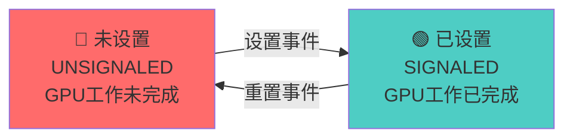

**状态说明**：
- **🔴 未设置（UNSIGNALED）**：GPU 工作未完成，其他命令必须等待
- **🟢 已设置（SIGNALED）**：GPU 工作完成，其他命令可以继续

### 🏃 完整的工作流程

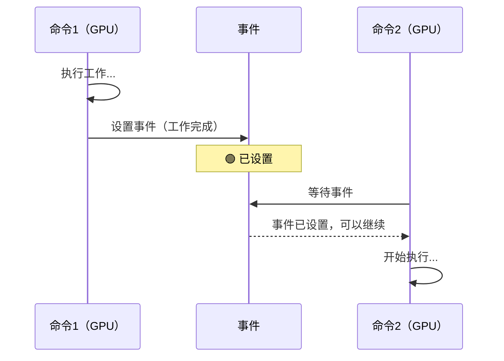

### 🆚 事件 vs 信号量 vs 栅栏：简单对比

| 特性 | 事件（Event） | 信号量（Semaphore） | 栅栏（Fence） |
|------|-------------|-------------------|-------------|
| **谁使用** | GPU 内部细粒度同步 | GPU 内部同步 | CPU 等待 GPU |
| **比喻** | 交通标志牌 | 工人之间的协调 | 项目经理等工人 |
| **查询** | ✅ CPU可以查询 | ❌ CPU不能查询 | ✅ CPU可以查询 |
| **等待** | ✅ GPU可以等待 | ✅ GPU可以等待 | ✅ CPU可以等待 |
| **细粒度** | ✅ 可以在特定阶段 | ✅ 可以在特定阶段 | ❌ 整个命令完成 |
| **用途** | 命令间细粒度同步 | 队列间同步 | CPU-GPU同步 |

### ✅ 总结：事件就是什么？

**一句话总结**：事件（Event）就是**GPU内部命令之间的"交通标志牌"**，用于在特定的管线阶段进行细粒度同步。

**三个关键词**：
1. **GPU内部同步** - GPU命令之间的同步
2. **细粒度控制** - 可以在特定管线阶段同步
3. **状态标志** - 显示某个工作是否完成

**记住这个公式**：
```
命令1执行 → 设置事件 → 命令2等待事件 → 事件已设置 → 命令2继续
```

**常见使用场景**：
- ✅ 等待图像布局转换完成
- ✅ 等待数据传输完成
- ✅ 命令间的细粒度同步
- ✅ 特定管线阶段的同步

---

## VkEvent 概述

### 什么是 VkEvent？

**VkEvent** 是 Vulkan 中用于 GPU 内部细粒度同步的同步原语。它允许在命令缓冲区中设置和等待事件，用于在特定的管线阶段建立同步点，确保操作按正确顺序执行。

### VkEvent 的核心特点

- **GPU 内部同步**: 用于 GPU 命令之间的同步
- **可查询状态**: CPU 可以查询事件的状态
- **可设置/重置**: 可以在命令缓冲区中设置和重置
- **细粒度控制**: 可以在特定管线阶段同步
- **管线阶段同步**: 支持在特定管线阶段等待
- **内存屏障集成**: 可以与内存屏障一起使用

### VkEvent 在 Vulkan 同步架构中的位置

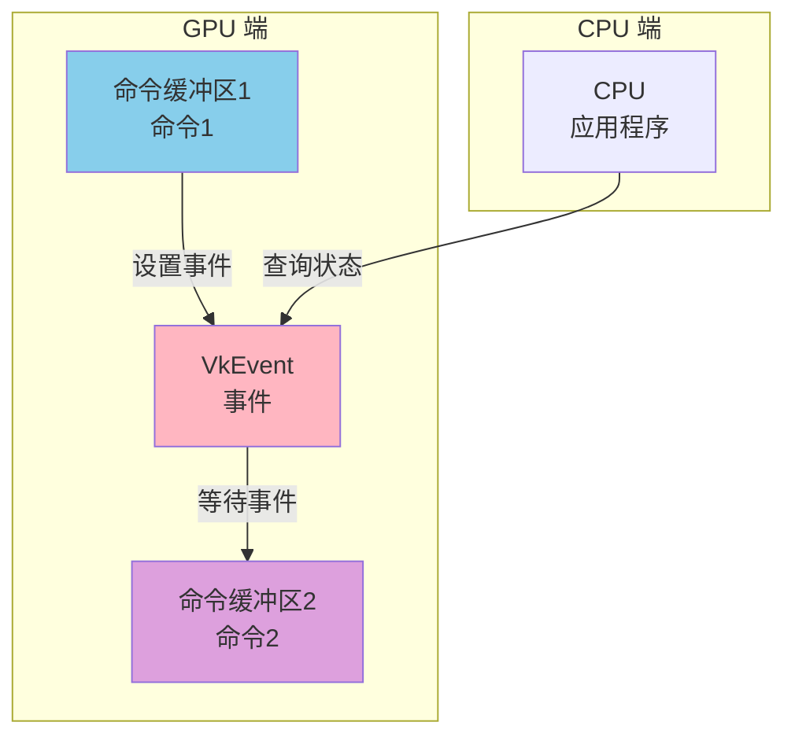

---

## 事件的作用与重要性

### 事件的主要作用

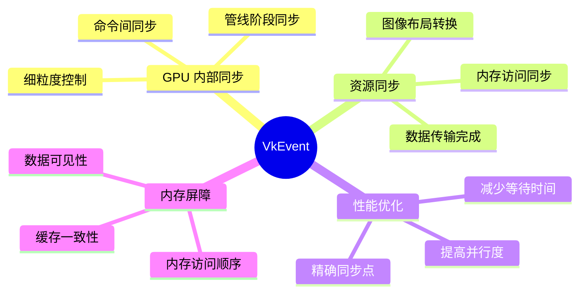

### 事件的使用场景

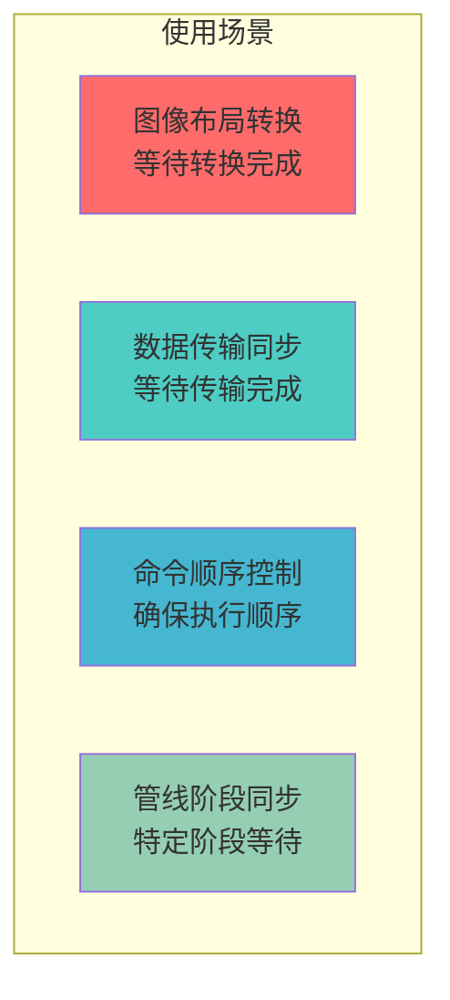

---

## 事件 vs 信号量 vs 栅栏

### 同步原语对比

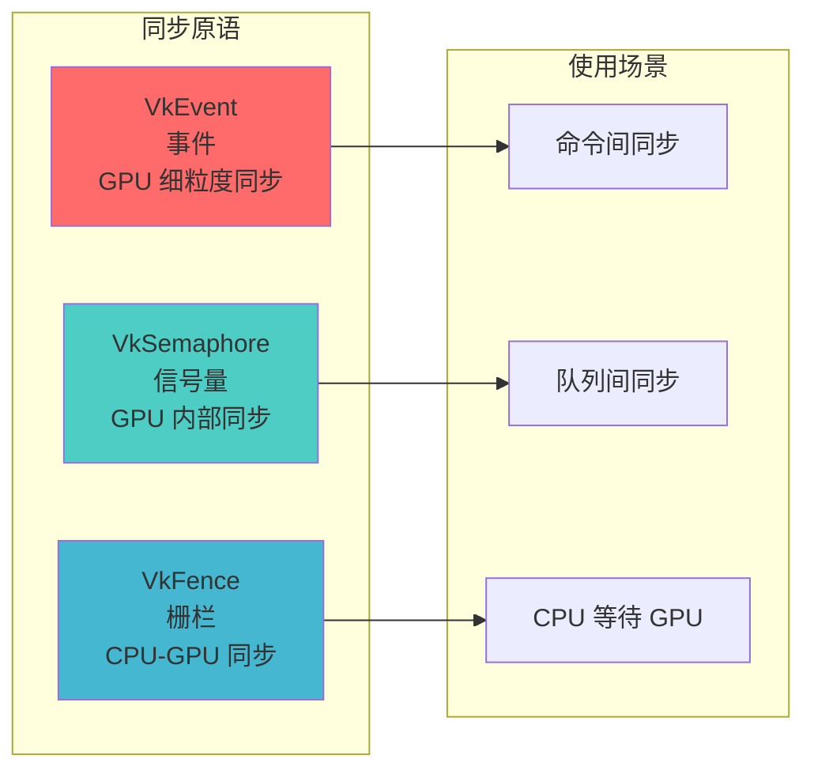

### 详细对比表

| 特性 | VkEvent | VkSemaphore | VkFence |
|------|---------|-------------|---------|
| **同步范围** | GPU 内部（命令间） | GPU 内部（队列间） | CPU-GPU |
| **CPU 可查询** | ✅ 是 | ❌ 否 | ✅ 是 |
| **CPU 可等待** | ❌ 否 | ❌ 否 | ✅ 是 |
| **GPU 可等待** | ✅ 是 | ✅ 是 | ❌ 否 |
| **可重置** | ✅ 是 | ❌ 否 | ✅ 是 |
| **细粒度** | ✅ 是（管线阶段） | ✅ 是（管线阶段） | ❌ 否（整个命令） |
| **用途** | 命令间细粒度同步 | 队列/命令同步 | CPU 等待 GPU |
| **性能** | 低开销 | 低开销 | 中等开销 |

### 何时使用事件

**使用事件当**:
- ✅ 需要在命令缓冲区中设置同步点
- ✅ 需要等待特定管线阶段完成
- ✅ 需要细粒度的命令间同步
- ✅ 需要与内存屏障一起使用
- ✅ 需要 CPU 查询同步状态

**不使用事件当**:
- ❌ 只需要队列间同步（使用信号量）
- ❌ 需要 CPU 等待 GPU（使用栅栏）
- ❌ 不需要细粒度控制（使用信号量）

---

## 事件的状态

### 事件的两种状态

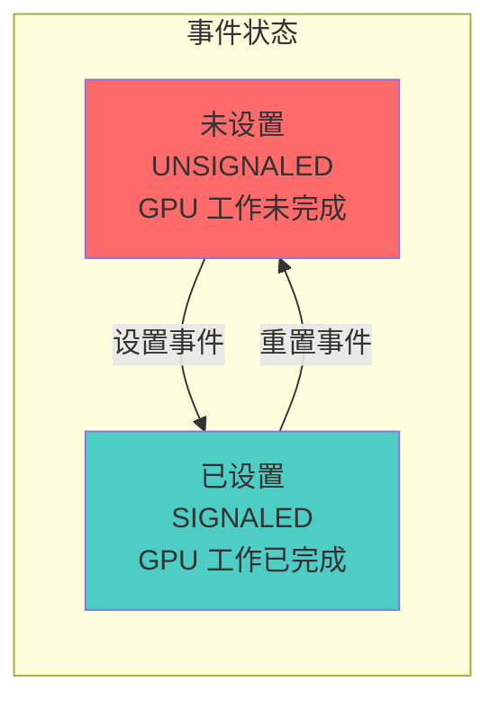

### 状态转换

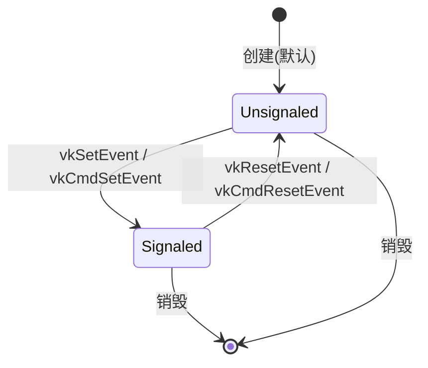

### 状态说明

**未设置 (Unsignaled)**:
- GPU 工作尚未完成
- 等待事件的命令会阻塞
- 查询返回 `VK_EVENT_RESET`

**已设置 (Signaled)**:
- GPU 工作已完成
- 等待事件的命令可以继续
- 查询返回 `VK_EVENT_SET`

---

## 事件的创建

### 基本创建

```cpp
VkEventCreateInfo eventInfo{};
eventInfo.sType = VK_STRUCTURE_TYPE_EVENT_CREATE_INFO;
eventInfo.flags = 0;  // 默认：创建为未设置状态

VkEvent event;
VkResult result = vkCreateEvent(device, &eventInfo, nullptr, &event);
if (result != VK_SUCCESS) {
    throw std::runtime_error("failed to create event!");
}
```

### 创建标志

```cpp
typedef struct VkEventCreateInfo {
    VkStructureType       sType;      // 结构体类型
    const void*           pNext;      // 扩展链
    VkEventCreateFlags    flags;      // 创建标志
} VkEventCreateInfo;
```

| 标志 | 说明 |
|------|------|
| `0` | 创建为未设置状态（默认） |
| `VK_EVENT_CREATE_DEVICE_ONLY_BIT` | 事件只能在设备上操作（CPU不能操作） |

### 事件销毁

```cpp
void vkDestroyEvent(
    VkDevice                device,
    VkEvent                  event,
    const VkAllocationCallbacks* pAllocator
);
```

---

## 事件的操作

### CPU 端操作

#### 设置事件

```cpp
VkResult vkSetEvent(
    VkDevice                device,
    VkEvent                  event
);
```

```cpp
// CPU 设置事件
VkResult result = vkSetEvent(device, event);
if (result != VK_SUCCESS) {
    // 处理错误
}
```

#### 重置事件

```cpp
VkResult vkResetEvent(
    VkDevice                device,
    VkEvent                  event
);
```

```cpp
// CPU 重置事件
VkResult result = vkResetEvent(device, event);
if (result != VK_SUCCESS) {
    // 处理错误
}
```

#### 查询事件状态

```cpp
VkResult vkGetEventStatus(
    VkDevice                device,
    VkEvent                  event
);
```

```cpp
// CPU 查询事件状态
VkResult result = vkGetEventStatus(device, event);

if (result == VK_EVENT_SET) {
    // 事件已设置
    std::cout << "Event is signaled" << std::endl;
} else if (result == VK_EVENT_RESET) {
    // 事件未设置
    std::cout << "Event is not signaled" << std::endl;
} else {
    // 错误
    throw std::runtime_error("failed to get event status");
}
```

### GPU 端操作（命令缓冲区中）

#### 在命令缓冲区中设置事件

```cpp
void vkCmdSetEvent(
    VkCommandBuffer         commandBuffer,
    VkEvent                  event,
    VkPipelineStageFlags    stageMask
);
```

```cpp
// 在命令缓冲区中设置事件
vkCmdSetEvent(
    commandBuffer,
    event,
    VK_PIPELINE_STAGE_TRANSFER_BIT  // 在传输阶段设置
);
```

#### 在命令缓冲区中重置事件

```cpp
void vkCmdResetEvent(
    VkCommandBuffer         commandBuffer,
    VkEvent                  event,
    VkPipelineStageFlags    stageMask
);
```

```cpp
// 在命令缓冲区中重置事件
vkCmdResetEvent(
    commandBuffer,
    event,
    VK_PIPELINE_STAGE_TRANSFER_BIT  // 在传输阶段重置
);
```

### 事件生命周期

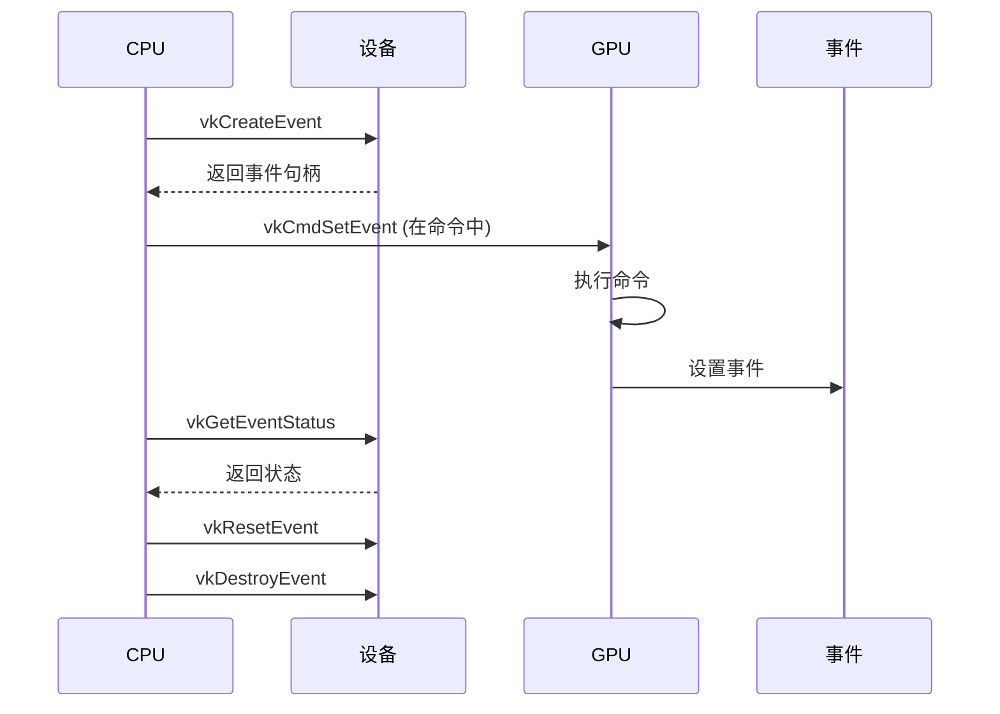

---

## 命令缓冲区中的事件

### 等待事件

```cpp
void vkCmdWaitEvents(
    VkCommandBuffer               commandBuffer,
    uint32_t                      eventCount,
    const VkEvent*                pEvents,
    VkPipelineStageFlags          srcStageMask,
    VkPipelineStageFlags          dstStageMask,
    uint32_t                      memoryBarrierCount,
    const VkMemoryBarrier*         pMemoryBarriers,
    uint32_t                      bufferMemoryBarrierCount,
    const VkBufferMemoryBarrier*   pBufferMemoryBarriers,
    uint32_t                      imageMemoryBarrierCount,
    const VkImageMemoryBarrier*    pImageMemoryBarriers
);
```

### 基本使用示例

```cpp
// 命令1：转换图像布局并设置事件
vkCmdPipelineBarrier(
    commandBuffer,
    VK_PIPELINE_STAGE_TOP_OF_PIPE_BIT,
    VK_PIPELINE_STAGE_TRANSFER_BIT,
    0,
    0, nullptr,
    0, nullptr,
    1, &imageBarrier
);

vkCmdSetEvent(
    commandBuffer,
    event,
    VK_PIPELINE_STAGE_TRANSFER_BIT
);

// 命令2：等待事件，然后复制数据
vkCmdWaitEvents(
    commandBuffer,
    1, &event,
    VK_PIPELINE_STAGE_TRANSFER_BIT,  // 源阶段
    VK_PIPELINE_STAGE_TRANSFER_BIT,  // 目标阶段
    0, nullptr,
    0, nullptr,
    0, nullptr
);

vkCmdCopyBufferToImage(...);  // 现在可以安全复制了
```

### 管线阶段同步

事件可以在特定的管线阶段进行同步：

```cpp
// 在顶点着色器阶段设置事件
vkCmdSetEvent(
    commandBuffer,
    event,
    VK_PIPELINE_STAGE_VERTEX_SHADER_BIT
);

// 在片段着色器阶段等待事件
vkCmdWaitEvents(
    commandBuffer,
    1, &event,
    VK_PIPELINE_STAGE_VERTEX_SHADER_BIT,  // 源阶段
    VK_PIPELINE_STAGE_FRAGMENT_SHADER_BIT, // 目标阶段
    ...
);
```

---

## 事件等待与内存屏障

### 事件与内存屏障的关系

事件等待通常与内存屏障一起使用，确保内存访问的正确顺序：

```cpp
VkMemoryBarrier memoryBarrier{};
memoryBarrier.sType = VK_STRUCTURE_TYPE_MEMORY_BARRIER;
memoryBarrier.srcAccessMask = VK_ACCESS_TRANSFER_WRITE_BIT;
memoryBarrier.dstAccessMask = VK_ACCESS_SHADER_READ_BIT;

vkCmdWaitEvents(
    commandBuffer,
    1, &event,
    VK_PIPELINE_STAGE_TRANSFER_BIT,
    VK_PIPELINE_STAGE_FRAGMENT_SHADER_BIT,
    1, &memoryBarrier,  // 内存屏障
    0, nullptr,
    0, nullptr
);
```

### 图像内存屏障示例

```cpp
VkImageMemoryBarrier imageBarrier{};
imageBarrier.sType = VK_STRUCTURE_TYPE_IMAGE_MEMORY_BARRIER;
imageBarrier.oldLayout = VK_IMAGE_LAYOUT_UNDEFINED;
imageBarrier.newLayout = VK_IMAGE_LAYOUT_TRANSFER_DST_OPTIMAL;
imageBarrier.srcAccessMask = 0;
imageBarrier.dstAccessMask = VK_ACCESS_TRANSFER_WRITE_BIT;
imageBarrier.image = image;
imageBarrier.subresourceRange = {VK_IMAGE_ASPECT_COLOR_BIT, 0, 1, 0, 1};

// 设置事件
vkCmdSetEvent(
    commandBuffer,
    event,
    VK_PIPELINE_STAGE_TRANSFER_BIT
);

// 等待事件并应用图像屏障
vkCmdWaitEvents(
    commandBuffer,
    1, &event,
    VK_PIPELINE_STAGE_TRANSFER_BIT,
    VK_PIPELINE_STAGE_TRANSFER_BIT,
    0, nullptr,
    0, nullptr,
    1, &imageBarrier  // 图像内存屏障
);
```

---

## 实际代码示例

### 示例 1: 基本事件使用

```cpp
class EventExample {
private:
    VkDevice device;
    VkEvent event;
    VkCommandBuffer commandBuffer;
    
public:
    void init() {
        // 创建事件
        VkEventCreateInfo eventInfo{};
        eventInfo.sType = VK_STRUCTURE_TYPE_EVENT_CREATE_INFO;
        vkCreateEvent(device, &eventInfo, nullptr, &event);
    }
    
    void recordCommands() {
        vkBeginCommandBuffer(commandBuffer, &beginInfo);
        
        // 命令1：转换图像布局
        VkImageMemoryBarrier barrier{};
        // ... 设置屏障参数
        vkCmdPipelineBarrier(
            commandBuffer,
            VK_PIPELINE_STAGE_TOP_OF_PIPE_BIT,
            VK_PIPELINE_STAGE_TRANSFER_BIT,
            0, 0, nullptr, 0, nullptr, 1, &barrier
        );
        
        // 设置事件：布局转换完成
        vkCmdSetEvent(
            commandBuffer,
            event,
            VK_PIPELINE_STAGE_TRANSFER_BIT
        );
        
        // 命令2：等待事件，然后复制
        vkCmdWaitEvents(
            commandBuffer,
            1, &event,
            VK_PIPELINE_STAGE_TRANSFER_BIT,
            VK_PIPELINE_STAGE_TRANSFER_BIT,
            0, nullptr, 0, nullptr, 0, nullptr
        );
        
        vkCmdCopyBufferToImage(...);
        
        vkEndCommandBuffer(commandBuffer);
    }
    
    void cleanup() {
        vkDestroyEvent(device, event, nullptr);
    }
};
```

### 示例 2: 图像布局转换同步

```cpp
void transitionImageLayout(
    VkCommandBuffer commandBuffer,
    VkImage image,
    VkEvent event,
    VkImageLayout oldLayout,
    VkImageLayout newLayout
) {
    VkImageMemoryBarrier barrier{};
    barrier.sType = VK_STRUCTURE_TYPE_IMAGE_MEMORY_BARRIER;
    barrier.oldLayout = oldLayout;
    barrier.newLayout = newLayout;
    barrier.srcQueueFamilyIndex = VK_QUEUE_FAMILY_IGNORED;
    barrier.dstQueueFamilyIndex = VK_QUEUE_FAMILY_IGNORED;
    barrier.image = image;
    barrier.subresourceRange = {
        VK_IMAGE_ASPECT_COLOR_BIT, 0, 1, 0, 1
    };
    
    VkPipelineStageFlags sourceStage;
    VkPipelineStageFlags destinationStage;
    
    if (oldLayout == VK_IMAGE_LAYOUT_UNDEFINED && 
        newLayout == VK_IMAGE_LAYOUT_TRANSFER_DST_OPTIMAL) {
        barrier.srcAccessMask = 0;
        barrier.dstAccessMask = VK_ACCESS_TRANSFER_WRITE_BIT;
        sourceStage = VK_PIPELINE_STAGE_TOP_OF_PIPE_BIT;
        destinationStage = VK_PIPELINE_STAGE_TRANSFER_BIT;
    } else if (oldLayout == VK_IMAGE_LAYOUT_TRANSFER_DST_OPTIMAL && 
               newLayout == VK_IMAGE_LAYOUT_SHADER_READ_ONLY_OPTIMAL) {
        barrier.srcAccessMask = VK_ACCESS_TRANSFER_WRITE_BIT;
        barrier.dstAccessMask = VK_ACCESS_SHADER_READ_BIT;
        sourceStage = VK_PIPELINE_STAGE_TRANSFER_BIT;
        destinationStage = VK_PIPELINE_STAGE_FRAGMENT_SHADER_BIT;
    }
    
    // 执行布局转换
    vkCmdPipelineBarrier(
        commandBuffer,
        sourceStage, destinationStage,
        0, 0, nullptr, 0, nullptr, 1, &barrier
    );
    
    // 设置事件：布局转换完成
    vkCmdSetEvent(
        commandBuffer,
        event,
        destinationStage
    );
}
```

### 示例 3: CPU 查询事件状态

```cpp
class EventStatusChecker {
private:
    VkDevice device;
    VkEvent event;
    
public:
    bool isEventSignaled() {
        VkResult result = vkGetEventStatus(device, event);
        
        if (result == VK_EVENT_SET) {
            return true;  // 事件已设置
        } else if (result == VK_EVENT_RESET) {
            return false;  // 事件未设置
        } else {
            throw std::runtime_error("failed to get event status");
        }
    }
    
    void waitForEvent() {
        // 非阻塞轮询
        while (!isEventSignaled()) {
            std::this_thread::sleep_for(std::chrono::milliseconds(1));
        }
    }
    
    void resetEvent() {
        vkResetEvent(device, event);
    }
};
```

### 示例 4: 多事件同步

```cpp
void waitForMultipleEvents(
    VkCommandBuffer commandBuffer,
    const std::vector<VkEvent>& events
) {
    // 等待所有事件
    vkCmdWaitEvents(
        commandBuffer,
        events.size(),
        events.data(),
        VK_PIPELINE_STAGE_ALL_COMMANDS_BIT,  // 源阶段
        VK_PIPELINE_STAGE_ALL_COMMANDS_BIT,   // 目标阶段
        0, nullptr,
        0, nullptr,
        0, nullptr
    );
}
```

---

## 最佳实践

### 1. 事件使用模式

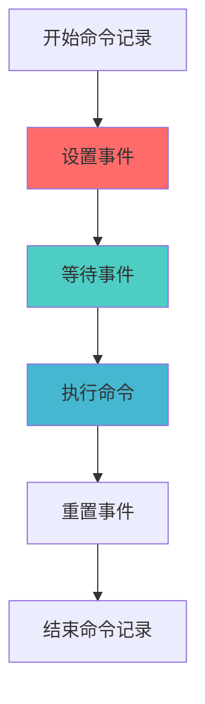

### 2. 创建策略

**DO**:
- ✅ 在需要细粒度同步时使用事件
- ✅ 与内存屏障一起使用
- ✅ 在正确的管线阶段设置和等待

**DON'T**:
- ❌ 在不需要细粒度控制时使用事件（使用信号量）
- ❌ 忘记与内存屏障一起使用
- ❌ 在错误的管线阶段设置/等待

### 3. 管线阶段选择

**DO**:
- ✅ 选择最精确的管线阶段
- ✅ 使用最晚的源阶段
- ✅ 使用最早的目标阶段

**DON'T**:
- ❌ 使用过于宽泛的管线阶段
- ❌ 在不需要的阶段等待
- ❌ 忽略管线阶段的依赖关系

### 4. 内存屏障使用

**DO**:
- ✅ 在等待事件时使用适当的内存屏障
- ✅ 正确设置访问掩码
- ✅ 考虑缓存一致性

**DON'T**:
- ❌ 忘记使用内存屏障
- ❌ 使用错误的访问掩码
- ❌ 忽略内存可见性

### 5. 性能优化

```cpp
// ✅ 好的做法：使用精确的管线阶段
vkCmdSetEvent(
    commandBuffer,
    event,
    VK_PIPELINE_STAGE_TRANSFER_BIT  // 精确的阶段
);

// ❌ 不好的做法：使用过于宽泛的阶段
vkCmdSetEvent(
    commandBuffer,
    event,
    VK_PIPELINE_STAGE_ALL_COMMANDS_BIT  // 过于宽泛
);
```

### 6. 错误处理

```cpp
VkResult result = vkGetEventStatus(device, event);

switch (result) {
    case VK_EVENT_SET:
        // 事件已设置
        break;
        
    case VK_EVENT_RESET:
        // 事件未设置
        break;
        
    case VK_ERROR_DEVICE_LOST:
        // 设备丢失
        handleDeviceLost();
        break;
        
    default:
        std::cerr << "Unexpected result: " << result << std::endl;
        break;
}
```

### 7. 常见陷阱

| 陷阱 | 问题 | 解决方案 |
|------|------|----------|
| 忘记内存屏障 | 内存访问顺序错误 | 在等待事件时使用内存屏障 |
| 错误的管线阶段 | 同步失效 | 使用正确的管线阶段 |
| 忘记重置事件 | 事件一直处于设置状态 | 在需要时重置事件 |
| CPU/GPU混用 | 同步错误 | 明确区分CPU和GPU操作 |

### 8. 事件 vs 信号量选择

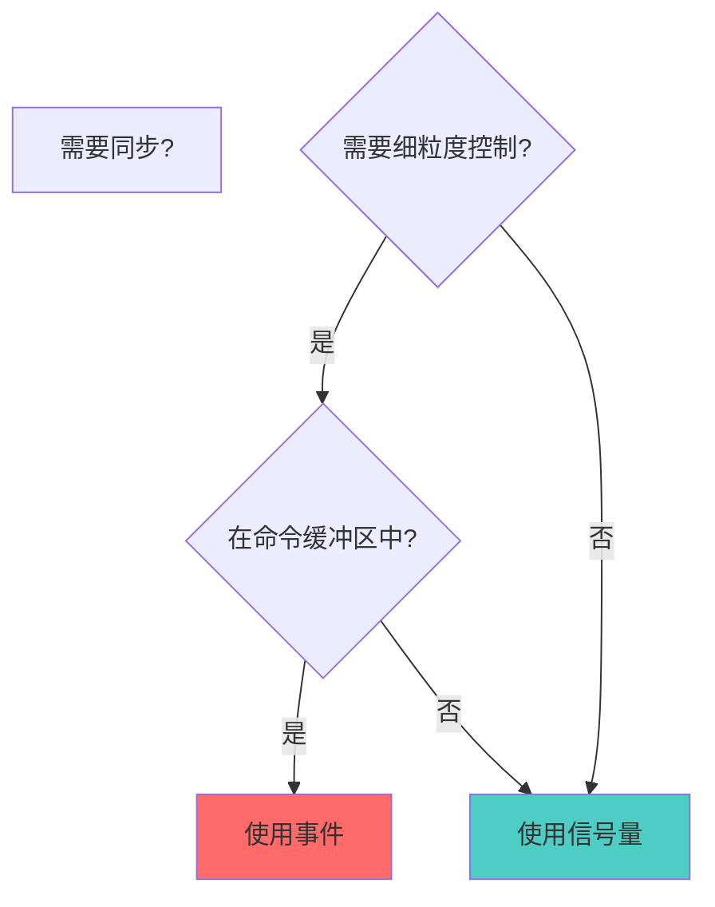

**使用事件**:
- 需要在命令缓冲区中设置同步点
- 需要等待特定管线阶段
- 需要与内存屏障一起使用
- 需要CPU查询状态

**使用信号量**:
- 只需要队列间同步
- 不需要细粒度控制
- 不需要CPU查询

---

## 总结

### VkEvent 关键要点

1. **GPU 内部同步**: 事件用于 GPU 命令之间的细粒度同步
2. **可查询状态**: CPU 可以查询事件的状态
3. **可设置/重置**: 可以在命令缓冲区中设置和重置
4. **管线阶段同步**: 支持在特定管线阶段同步
5. **内存屏障集成**: 通常与内存屏障一起使用
6. **细粒度控制**: 比信号量更精确的同步控制

### 事件使用流程

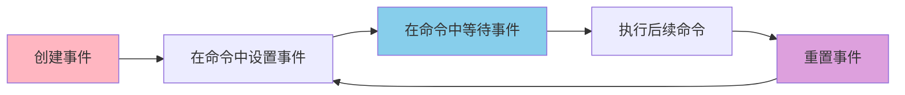

### 事件 vs 信号量 vs 栅栏选择指南

| 场景 | 使用 |
|------|------|
| 命令间细粒度同步 | VkEvent |
| 队列间同步 | VkSemaphore |
| CPU 等待 GPU | VkFence |
| 特定管线阶段同步 | VkEvent |
| 交换链同步 | VkSemaphore |
| 命令缓冲区重用 | VkFence |

### 进一步学习

- 深入了解 Vulkan 同步机制
- 学习内存屏障和布局转换
- 研究管线阶段和依赖关系
- 探索性能优化技巧
- 了解多队列同步

---

**文档版本**: 1.0  
**最后更新**: 2025  
**相关文档**: 
- [VkFence 详细分析](./VkFence详细分析.md)
- [VkSemaphore 详细分析](./VkSemaphore详细分析.md)
- [VkQueue 详细分析](../命令管理/VkQueue详细分析.md)


