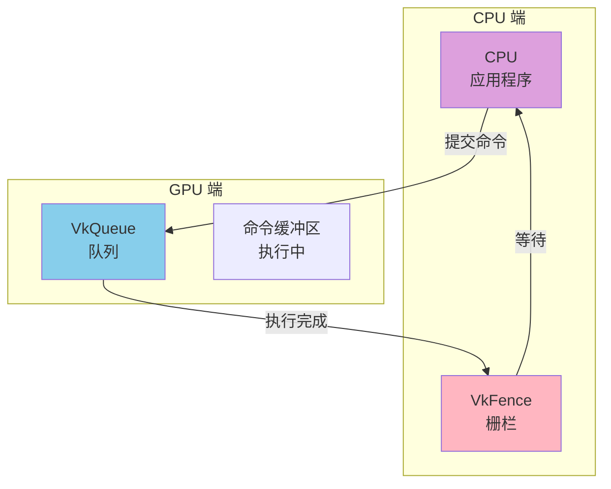
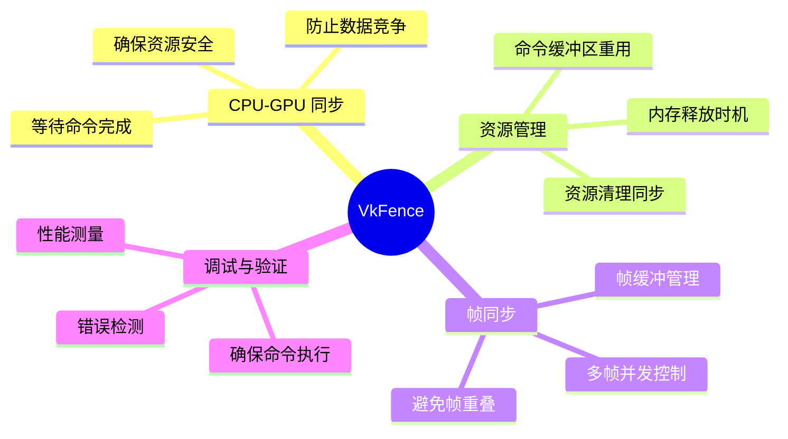
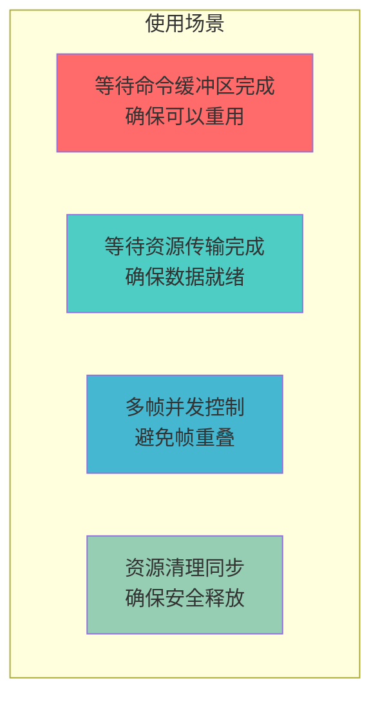
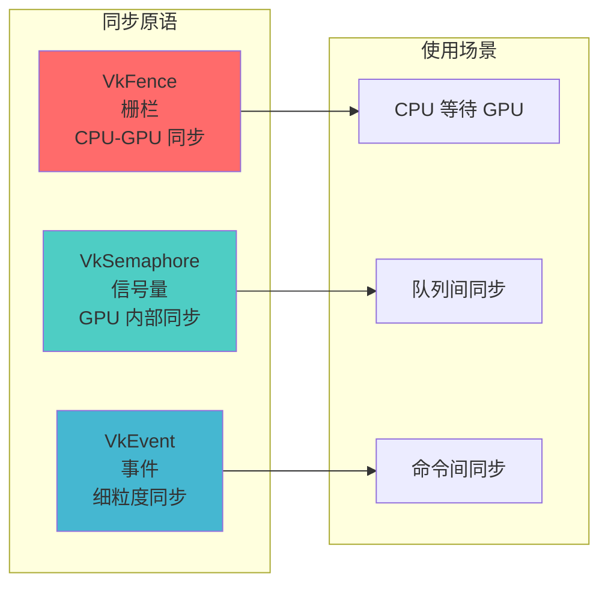
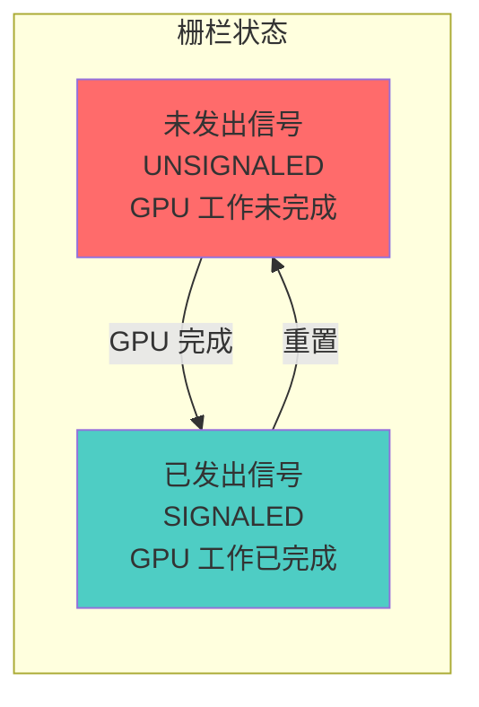
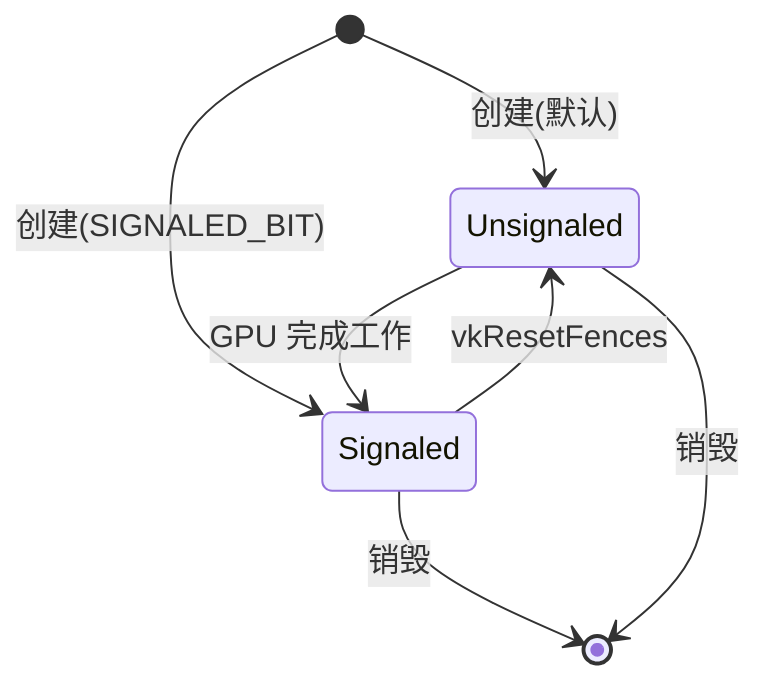
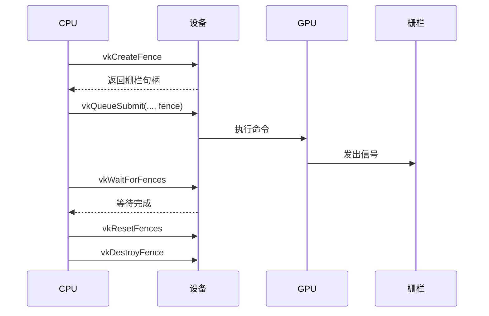
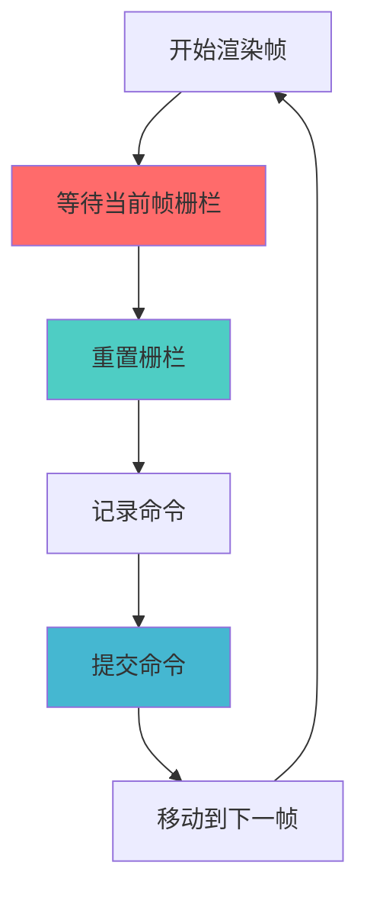
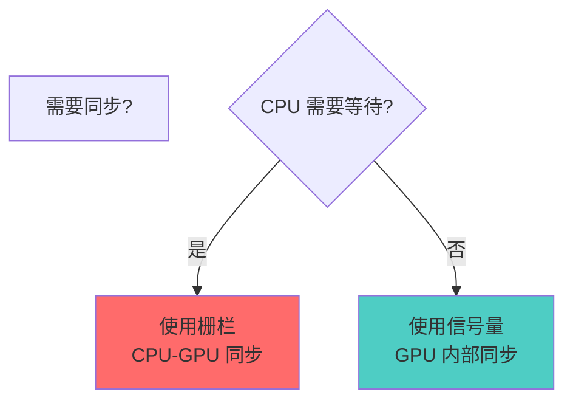

# VkFence 详细分析文档

## 目录
1. [VkFence 概述](#vkfence-概述)
2. [栅栏的作用与重要性](#栅栏的作用与重要性)
3. [栅栏 vs 信号量 vs 事件](#栅栏-vs-信号量-vs-事件)
4. [栅栏的状态](#栅栏的状态)
5. [栅栏的创建](#栅栏的创建)
6. [栅栏的使用](#栅栏的使用)
7. [栅栏等待](#栅栏等待)
8. [栅栏重置](#栅栏重置)
9. [栅栏查询](#栅栏查询)
10. [实际代码示例](#实际代码示例)
11. [最佳实践](#最佳实践)

---

## VkFence 概述

### 什么是 VkFence？

**VkFence** 是 Vulkan 中用于 CPU-GPU 同步的同步原语。它允许 CPU 等待 GPU 完成特定的工作，确保在 CPU 继续执行之前，GPU 已经完成了提交的命令。

### VkFence 的核心特点

- **CPU-GPU 同步**: 用于 CPU 等待 GPU 完成工作
- **可查询状态**: CPU 可以查询栅栏的状态
- **可重置**: 可以重置栅栏以重复使用
- **阻塞等待**: 支持阻塞等待直到信号发出
- **非阻塞查询**: 支持非阻塞查询状态
- **初始状态**: 可以创建为已发出信号或未发出信号状态

### VkFence 在 Vulkan 同步架构中的位置



---

## 栅栏的作用与重要性

### 栅栏的主要作用



### 栅栏的使用场景



---

## 栅栏 vs 信号量 vs 事件

### 同步原语对比



### 详细对比表

| 特性 | VkFence | VkSemaphore | VkEvent |
|------|---------|-------------|---------|
| **同步范围** | CPU-GPU | GPU-GPU | GPU 内部 |
| **CPU 可查询** | ✅ 是 | ❌ 否 | ✅ 是 |
| **CPU 可等待** | ✅ 是 | ❌ 否 | ❌ 否 |
| **可重置** | ✅ 是 | ❌ 否 | ✅ 是 |
| **用途** | CPU 等待 GPU | 队列/命令同步 | 细粒度同步 |
| **性能** | 中等开销 | 低开销 | 低开销 |

### 何时使用栅栏

**使用栅栏当**:
- ✅ CPU 需要等待 GPU 完成工作
- ✅ 需要确保命令缓冲区可以安全重用
- ✅ 需要同步资源清理
- ✅ 需要控制多帧并发

**不使用栅栏当**:
- ❌ 只需要 GPU 内部同步（使用信号量）
- ❌ 需要细粒度同步（使用事件）
- ❌ 在渲染循环中频繁等待（性能差）

---

## 栅栏的状态

### 栅栏的两种状态



### 状态转换



### 状态说明

**未发出信号 (Unsignaled)**:
- GPU 工作尚未完成
- CPU 等待会阻塞
- 查询返回 `VK_NOT_READY`

**已发出信号 (Signaled)**:
- GPU 工作已完成
- CPU 等待立即返回
- 查询返回 `VK_SUCCESS`

---

## 栅栏的创建

### 基本创建

```cpp
VkFenceCreateInfo fenceInfo{};
fenceInfo.sType = VK_STRUCTURE_TYPE_FENCE_CREATE_INFO;
fenceInfo.flags = 0;  // 默认：创建为未发出信号状态

VkFence fence;
VkResult result = vkCreateFence(device, &fenceInfo, nullptr, &fence);
if (result != VK_SUCCESS) {
    throw std::runtime_error("failed to create fence!");
}
```

### 创建为已发出信号状态

```cpp
VkFenceCreateInfo fenceInfo{};
fenceInfo.sType = VK_STRUCTURE_TYPE_FENCE_CREATE_INFO;
fenceInfo.flags = VK_FENCE_CREATE_SIGNALED_BIT;  // 创建为已发出信号状态

VkFence fence;
vkCreateFence(device, &fenceInfo, nullptr, &fence);
```

**使用场景**:
- 多帧并发渲染时，第一帧不需要等待
- 避免第一次渲染时的阻塞

### VkFenceCreateInfo 结构

```cpp
typedef struct VkFenceCreateInfo {
    VkStructureType       sType;      // 结构体类型
    const void*           pNext;      // 扩展链
    VkFenceCreateFlags    flags;      // 创建标志
} VkFenceCreateInfo;
```

### 创建标志

| 标志 | 说明 |
|------|------|
| `0` | 创建为未发出信号状态（默认） |
| `VK_FENCE_CREATE_SIGNALED_BIT` | 创建为已发出信号状态 |

---

## 栅栏的使用

### 在队列提交中使用栅栏

```cpp
// 1. 创建栅栏
VkFenceCreateInfo fenceInfo{};
fenceInfo.sType = VK_STRUCTURE_TYPE_FENCE_CREATE_INFO;
fenceInfo.flags = 0;  // 未发出信号状态

VkFence fence;
vkCreateFence(device, &fenceInfo, nullptr, &fence);

// 2. 提交命令时关联栅栏
VkSubmitInfo submitInfo{};
submitInfo.sType = VK_STRUCTURE_TYPE_SUBMIT_INFO;
submitInfo.commandBufferCount = 1;
submitInfo.pCommandBuffers = &commandBuffer;

vkQueueSubmit(queue, 1, &submitInfo, fence);  // 关联栅栏

// 3. 等待栅栏
vkWaitForFences(device, 1, &fence, VK_TRUE, UINT64_MAX);

// 4. 重置栅栏（如果需要重用）
vkResetFences(device, 1, &fence);

// 5. 销毁栅栏
vkDestroyFence(device, fence, nullptr);
```

### 栅栏生命周期



---

## 栅栏等待

### vkWaitForFences 函数

```cpp
VkResult vkWaitForFences(
    VkDevice                device,         // 设备
    uint32_t                fenceCount,    // 栅栏数量
    const VkFence*          pFences,       // 栅栏数组
    VkBool32                waitAll,        // 是否等待所有栅栏
    uint64_t                timeout         // 超时时间（纳秒）
);
```

### 等待单个栅栏

```cpp
VkFence fence;
// ... 创建栅栏并提交命令

// 阻塞等待直到栅栏发出信号
VkResult result = vkWaitForFences(
    device,
    1,              // 栅栏数量
    &fence,         // 栅栏数组
    VK_TRUE,        // 等待所有栅栏（单个栅栏时无影响）
    UINT64_MAX      // 无限等待
);

if (result == VK_SUCCESS) {
    // 栅栏已发出信号，GPU 工作完成
}
```

### 等待多个栅栏

```cpp
std::vector<VkFence> fences = {fence1, fence2, fence3};

// 等待所有栅栏都发出信号
VkResult result = vkWaitForFences(
    device,
    fences.size(),
    fences.data(),
    VK_TRUE,        // 等待所有栅栏
    UINT64_MAX
);

// 或者等待任意一个栅栏发出信号
result = vkWaitForFences(
    device,
    fences.size(),
    fences.data(),
    VK_FALSE,       // 等待任意一个栅栏
    UINT64_MAX
);
```

### 超时等待

```cpp
// 等待最多 1 秒
uint64_t timeout = 1000000000;  // 1 秒 = 1,000,000,000 纳秒

VkResult result = vkWaitForFences(
    device,
    1,
    &fence,
    VK_TRUE,
    timeout
);

if (result == VK_TIMEOUT) {
    // 超时，GPU 工作尚未完成
} else if (result == VK_SUCCESS) {
    // 栅栏已发出信号
}
```

### 等待模式

**waitAll = VK_TRUE**:
- 等待所有栅栏都发出信号
- 所有栅栏都发出信号后才返回

**waitAll = VK_FALSE**:
- 等待任意一个栅栏发出信号
- 第一个栅栏发出信号后立即返回

---

## 栅栏重置

### vkResetFences 函数

```cpp
VkResult vkResetFences(
    VkDevice                device,         // 设备
    uint32_t                fenceCount,     // 栅栏数量
    const VkFence*          pFences        // 栅栏数组
);
```

### 重置单个栅栏

```cpp
// 重置栅栏为未发出信号状态
VkResult result = vkResetFences(device, 1, &fence);
if (result != VK_SUCCESS) {
    // 处理错误
}
```

### 重置多个栅栏

```cpp
std::vector<VkFence> fences = {fence1, fence2, fence3};
vkResetFences(device, fences.size(), fences.data());
```

### 重置时机

**重置栅栏当**:
- ✅ 栅栏已发出信号后
- ✅ 准备重用栅栏时
- ✅ 开始新的一帧渲染时

**重置模式示例**:

```cpp
void renderFrame() {
    // 1. 等待上一帧完成
    vkWaitForFences(device, 1, &waitFences[currentFrame], VK_TRUE, UINT64_MAX);
    
    // 2. 重置栅栏，准备新帧
    vkResetFences(device, 1, &waitFences[currentFrame]);
    
    // 3. 提交新帧的命令
    VkSubmitInfo submitInfo{};
    // ... 设置提交信息
    vkQueueSubmit(queue, 1, &submitInfo, waitFences[currentFrame]);
    
    // 4. 移动到下一帧
    currentFrame = (currentFrame + 1) % MAX_CONCURRENT_FRAMES;
}
```

---

## 栅栏查询

### vkGetFenceStatus 函数

```cpp
VkResult vkGetFenceStatus(
    VkDevice                device,         // 设备
    VkFence                 fence          // 栅栏
);
```

### 查询栅栏状态

```cpp
VkResult result = vkGetFenceStatus(device, fence);

if (result == VK_SUCCESS) {
    // 栅栏已发出信号，GPU 工作完成
} else if (result == VK_NOT_READY) {
    // 栅栏未发出信号，GPU 工作尚未完成
} else {
    // 错误（如设备丢失）
}
```

### 非阻塞查询示例

```cpp
void checkFenceStatus(VkFence fence) {
    VkResult result = vkGetFenceStatus(device, fence);
    
    switch (result) {
        case VK_SUCCESS:
            // 栅栏已发出信号
            std::cout << "Fence is signaled" << std::endl;
            break;
            
        case VK_NOT_READY:
            // 栅栏未发出信号
            std::cout << "Fence is not ready" << std::endl;
            break;
            
        case VK_ERROR_DEVICE_LOST:
            // 设备丢失
            std::cerr << "Device lost" << std::endl;
            break;
            
        default:
            std::cerr << "Unexpected result: " << result << std::endl;
            break;
    }
}
```

### 轮询查询

```cpp
// 非阻塞轮询
while (true) {
    VkResult result = vkGetFenceStatus(device, fence);
    
    if (result == VK_SUCCESS) {
        // 栅栏已发出信号，退出循环
        break;
    } else if (result == VK_NOT_READY) {
        // 继续等待，可以做一些其他工作
        std::this_thread::sleep_for(std::chrono::milliseconds(1));
    } else {
        // 错误
        throw std::runtime_error("fence status check failed");
    }
}
```

---

## 实际代码示例

### 示例 1: 基本栅栏使用

```cpp
class FenceExample {
private:
    VkDevice device;
    VkQueue queue;
    VkFence fence;
    
public:
    void init() {
        // 创建栅栏
        VkFenceCreateInfo fenceInfo{};
        fenceInfo.sType = VK_STRUCTURE_TYPE_FENCE_CREATE_INFO;
        fenceInfo.flags = 0;  // 未发出信号状态
        
        vkCreateFence(device, &fenceInfo, nullptr, &fence);
    }
    
    void submitAndWait(VkCommandBuffer commandBuffer) {
        // 提交命令
        VkSubmitInfo submitInfo{};
        submitInfo.sType = VK_STRUCTURE_TYPE_SUBMIT_INFO;
        submitInfo.commandBufferCount = 1;
        submitInfo.pCommandBuffers = &commandBuffer;
        
        vkQueueSubmit(queue, 1, &submitInfo, fence);
        
        // 等待完成
        vkWaitForFences(device, 1, &fence, VK_TRUE, UINT64_MAX);
        
        // 重置栅栏
        vkResetFences(device, 1, &fence);
    }
    
    void cleanup() {
        vkDestroyFence(device, fence, nullptr);
    }
};
```

### 示例 2: 多帧并发渲染

```cpp
class MultiFrameRenderer {
private:
    static constexpr uint32_t MAX_CONCURRENT_FRAMES = 2;
    
    VkDevice device;
    VkQueue queue;
    std::array<VkFence, MAX_CONCURRENT_FRAMES> waitFences;
    std::array<VkCommandBuffer, MAX_CONCURRENT_FRAMES> commandBuffers;
    uint32_t currentFrame = 0;
    
public:
    void init() {
        // 创建每帧的栅栏（初始为已发出信号状态）
        VkFenceCreateInfo fenceInfo{};
        fenceInfo.sType = VK_STRUCTURE_TYPE_FENCE_CREATE_INFO;
        fenceInfo.flags = VK_FENCE_CREATE_SIGNALED_BIT;  // 已发出信号状态
        
        for (uint32_t i = 0; i < MAX_CONCURRENT_FRAMES; i++) {
            vkCreateFence(device, &fenceInfo, nullptr, &waitFences[i]);
        }
    }
    
    void renderFrame() {
        // 1. 等待当前帧的栅栏（确保可以安全使用命令缓冲区）
        vkWaitForFences(
            device, 
            1, 
            &waitFences[currentFrame], 
            VK_TRUE, 
            UINT64_MAX
        );
        
        // 2. 重置栅栏
        vkResetFences(device, 1, &waitFences[currentFrame]);
        
        // 3. 记录命令缓冲区
        VkCommandBufferBeginInfo beginInfo{};
        beginInfo.sType = VK_STRUCTURE_TYPE_COMMAND_BUFFER_BEGIN_INFO;
        vkBeginCommandBuffer(commandBuffers[currentFrame], &beginInfo);
        
        // ... 记录渲染命令
        
        vkEndCommandBuffer(commandBuffers[currentFrame]);
        
        // 4. 提交命令
        VkSubmitInfo submitInfo{};
        submitInfo.sType = VK_STRUCTURE_TYPE_SUBMIT_INFO;
        submitInfo.commandBufferCount = 1;
        submitInfo.pCommandBuffers = &commandBuffers[currentFrame];
        
        vkQueueSubmit(queue, 1, &submitInfo, waitFences[currentFrame]);
        
        // 5. 移动到下一帧
        currentFrame = (currentFrame + 1) % MAX_CONCURRENT_FRAMES;
    }
    
    void cleanup() {
        // 等待所有帧完成
        vkWaitForFences(
            device, 
            MAX_CONCURRENT_FRAMES, 
            waitFences.data(), 
            VK_TRUE, 
            UINT64_MAX
        );
        
        // 销毁栅栏
        for (auto& fence : waitFences) {
            vkDestroyFence(device, fence, nullptr);
        }
    }
};
```

### 示例 3: 等待多个栅栏

```cpp
class MultiFenceWaiter {
private:
    VkDevice device;
    std::vector<VkFence> fences;
    
public:
    void waitForAll() {
        // 等待所有栅栏都发出信号
        VkResult result = vkWaitForFences(
            device,
            fences.size(),
            fences.data(),
            VK_TRUE,        // 等待所有
            UINT64_MAX
        );
        
        if (result == VK_SUCCESS) {
            // 所有栅栏都已发出信号
            std::cout << "All fences signaled" << std::endl;
        }
    }
    
    void waitForAny() {
        // 等待任意一个栅栏发出信号
        VkResult result = vkWaitForFences(
            device,
            fences.size(),
            fences.data(),
            VK_FALSE,       // 等待任意一个
            UINT64_MAX
        );
        
        if (result == VK_SUCCESS) {
            // 至少一个栅栏已发出信号
            std::cout << "At least one fence signaled" << std::endl;
        }
    }
    
    void resetAll() {
        vkResetFences(device, fences.size(), fences.data());
    }
};
```

### 示例 4: 超时等待

```cpp
class TimeoutFence {
private:
    VkDevice device;
    VkFence fence;
    
public:
    bool waitWithTimeout(uint64_t timeoutNanoseconds) {
        VkResult result = vkWaitForFences(
            device,
            1,
            &fence,
            VK_TRUE,
            timeoutNanoseconds
        );
        
        if (result == VK_SUCCESS) {
            return true;  // 栅栏已发出信号
        } else if (result == VK_TIMEOUT) {
            return false;  // 超时
        } else {
            throw std::runtime_error("fence wait failed");
        }
    }
    
    void waitWithRetry(uint32_t maxRetries, uint64_t timeoutPerRetry) {
        for (uint32_t i = 0; i < maxRetries; i++) {
            if (waitWithTimeout(timeoutPerRetry)) {
                return;  // 成功
            }
            std::cout << "Retry " << (i + 1) << "/" << maxRetries << std::endl;
        }
        throw std::runtime_error("fence wait timeout after retries");
    }
};
```

### 示例 5: 非阻塞查询

```cpp
class NonBlockingFence {
private:
    VkDevice device;
    VkFence fence;
    
public:
    bool isReady() {
        VkResult result = vkGetFenceStatus(device, fence);
        
        if (result == VK_SUCCESS) {
            return true;  // 已发出信号
        } else if (result == VK_NOT_READY) {
            return false;  // 未发出信号
        } else {
            throw std::runtime_error("fence status check failed");
        }
    }
    
    void waitNonBlocking() {
        // 非阻塞轮询
        while (!isReady()) {
            // 可以做其他工作
            std::this_thread::yield();
        }
    }
    
    void waitWithCallback(std::function<void()> callback) {
        // 在等待期间执行回调
        while (!isReady()) {
            callback();  // 执行回调（如更新 UI）
            std::this_thread::sleep_for(std::chrono::milliseconds(16));
        }
    }
};
```

---

## 最佳实践

### 1. 栅栏使用模式



### 2. 创建策略

**DO**:
- ✅ 为每帧创建独立的栅栏
- ✅ 多帧并发时，初始创建为已发出信号状态
- ✅ 单次使用时，创建为未发出信号状态

**DON'T**:
- ❌ 在渲染循环中频繁创建/销毁栅栏
- ❌ 忘记重置栅栏就重用
- ❌ 在错误的时机等待栅栏

### 3. 等待策略

**DO**:
- ✅ 在重用资源前等待栅栏
- ✅ 使用超时避免无限等待
- ✅ 批量等待多个栅栏

**DON'T**:
- ❌ 在渲染循环中频繁等待（性能差）
- ❌ 等待未关联的栅栏
- ❌ 忘记处理超时情况

### 4. 重置策略

**DO**:
- ✅ 在等待后立即重置
- ✅ 在提交新命令前重置
- ✅ 批量重置多个栅栏

**DON'T**:
- ❌ 重置未发出信号的栅栏（虽然允许，但无意义）
- ❌ 忘记重置就重用栅栏
- ❌ 在 GPU 仍在使用时重置

### 5. 性能优化

```cpp
// ✅ 好的做法：批量等待和重置
std::vector<VkFence> fences = {fence1, fence2, fence3};
vkWaitForFences(device, fences.size(), fences.data(), VK_TRUE, UINT64_MAX);
vkResetFences(device, fences.size(), fences.data());

// ❌ 不好的做法：逐个等待和重置
vkWaitForFences(device, 1, &fence1, VK_TRUE, UINT64_MAX);
vkResetFences(device, 1, &fence1);
vkWaitForFences(device, 1, &fence2, VK_TRUE, UINT64_MAX);
vkResetFences(device, 1, &fence2);
// ...
```

### 6. 错误处理

```cpp
VkResult result = vkWaitForFences(device, 1, &fence, VK_TRUE, timeout);

switch (result) {
    case VK_SUCCESS:
        // 成功
        break;
        
    case VK_TIMEOUT:
        // 超时，GPU 工作尚未完成
        std::cerr << "Fence wait timeout" << std::endl;
        break;
        
    case VK_ERROR_DEVICE_LOST:
        // 设备丢失，需要重新初始化
        handleDeviceLost();
        break;
        
    default:
        std::cerr << "Unexpected result: " << result << std::endl;
        break;
}
```

### 7. 常见陷阱

| 陷阱 | 问题 | 解决方案 |
|------|------|----------|
| 忘记等待 | 数据竞争 | 在重用资源前等待 |
| 忘记重置 | 栅栏一直处于信号状态 | 等待后立即重置 |
| 等待未关联的栅栏 | 无限等待 | 确保栅栏已关联到提交 |
| 在渲染循环中频繁等待 | 性能下降 | 使用信号量进行 GPU 同步 |
| 重置时机错误 | 同步失效 | 在等待后、提交前重置 |

### 8. 栅栏 vs 信号量选择



**使用栅栏**:
- CPU 需要等待 GPU 完成
- 确保资源可以安全重用
- 多帧并发控制

**使用信号量**:
- 只需要 GPU 内部同步
- 队列间同步
- 渲染循环中的同步

### 9. 多帧并发最佳实践

```cpp
class BestPracticeRenderer {
private:
    static constexpr uint32_t MAX_FRAMES_IN_FLIGHT = 2;
    
    std::array<VkFence, MAX_FRAMES_IN_FLIGHT> inFlightFences;
    std::array<VkSemaphore, MAX_FRAMES_IN_FLIGHT> imageAvailableSemaphores;
    std::array<VkSemaphore, MAX_FRAMES_IN_FLIGHT> renderFinishedSemaphores;
    uint32_t currentFrame = 0;
    
public:
    void init() {
        // 创建栅栏（初始为已发出信号）
        VkFenceCreateInfo fenceInfo{};
        fenceInfo.sType = VK_STRUCTURE_TYPE_FENCE_CREATE_INFO;
        fenceInfo.flags = VK_FENCE_CREATE_SIGNALED_BIT;
        
        for (uint32_t i = 0; i < MAX_FRAMES_IN_FLIGHT; i++) {
            vkCreateFence(device, &fenceInfo, nullptr, &inFlightFences[i]);
        }
    }
    
    void renderFrame() {
        // 1. 等待当前帧完成（确保可以安全使用资源）
        vkWaitForFences(
            device, 
            1, 
            &inFlightFences[currentFrame], 
            VK_TRUE, 
            UINT64_MAX
        );
        
        // 2. 重置栅栏
        vkResetFences(device, 1, &inFlightFences[currentFrame]);
        
        // 3. 获取交换链图像（使用信号量同步）
        uint32_t imageIndex;
        vkAcquireNextImageKHR(
            device, 
            swapChain, 
            UINT64_MAX, 
            imageAvailableSemaphores[currentFrame], 
            VK_NULL_HANDLE, 
            &imageIndex
        );
        
        // 4. 记录命令缓冲区
        // ...
        
        // 5. 提交命令（使用信号量同步，栅栏等待）
        VkSubmitInfo submitInfo{};
        submitInfo.waitSemaphoreCount = 1;
        submitInfo.pWaitSemaphores = &imageAvailableSemaphores[currentFrame];
        submitInfo.signalSemaphoreCount = 1;
        submitInfo.pSignalSemaphores = &renderFinishedSemaphores[currentFrame];
        submitInfo.commandBufferCount = 1;
        submitInfo.pCommandBuffers = &commandBuffers[imageIndex];
        
        vkQueueSubmit(
            graphicsQueue, 
            1, 
            &submitInfo, 
            inFlightFences[currentFrame]  // 关联栅栏
        );
        
        // 6. 呈现（使用信号量同步）
        VkPresentInfoKHR presentInfo{};
        presentInfo.waitSemaphoreCount = 1;
        presentInfo.pWaitSemaphores = &renderFinishedSemaphores[currentFrame];
        presentInfo.swapchainCount = 1;
        presentInfo.pSwapchains = &swapChain;
        presentInfo.pImageIndices = &imageIndex;
        
        vkQueuePresentKHR(presentQueue, &presentInfo);
        
        // 7. 移动到下一帧
        currentFrame = (currentFrame + 1) % MAX_FRAMES_IN_FLIGHT;
    }
};
```

---

## 总结

### VkFence 关键要点

1. **CPU-GPU 同步**: 栅栏用于 CPU 等待 GPU 完成工作
2. **可查询状态**: CPU 可以查询栅栏是否已发出信号
3. **可重置**: 栅栏可以重置以重复使用
4. **阻塞等待**: 支持阻塞等待直到信号发出
5. **初始状态**: 可以创建为已发出信号或未发出信号状态
6. **多帧并发**: 用于控制多帧并发渲染
7. **资源安全**: 确保资源可以安全重用

### 栅栏使用流程


### 栅栏 vs 信号量选择指南

| 场景 | 使用 |
|------|------|
| CPU 等待 GPU | VkFence |
| GPU 内部同步 | VkSemaphore |
| 队列间同步 | VkSemaphore |
| 命令缓冲区重用 | VkFence |
| 多帧并发控制 | VkFence |
| 渲染循环同步 | VkSemaphore |

### 进一步学习

- 深入了解 Vulkan 同步机制
- 学习信号量和事件的用法
- 研究多帧并发渲染优化
- 探索内存屏障和布局转换
- 了解性能优化技巧

---

**文档版本**: 1.0  
**最后更新**: 2024  
**相关文档**: 
- [VkQueue 详细分析](./VkQueue详细分析.md)
- [VkBuffer 详细分析](./VkBuffer详细分析.md)
- [VkImage 详细分析](./VkImage详细分析.md)

