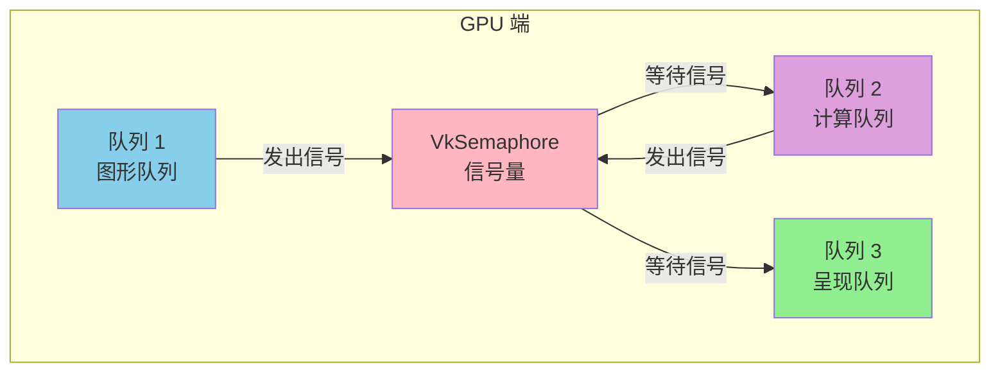
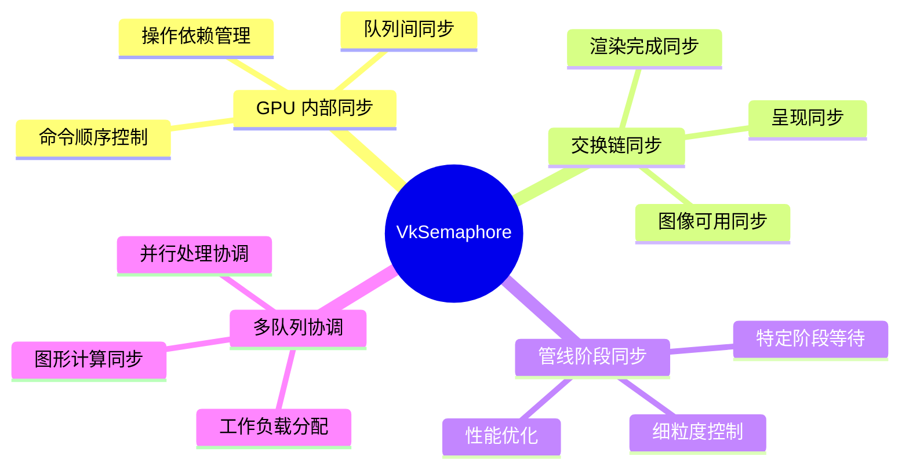
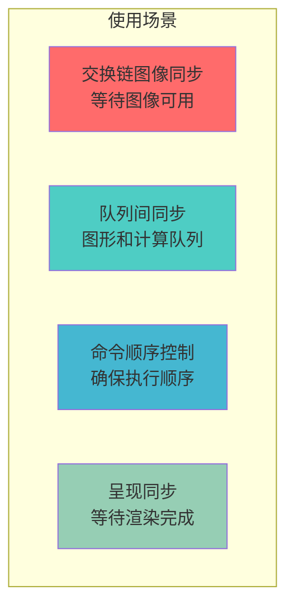
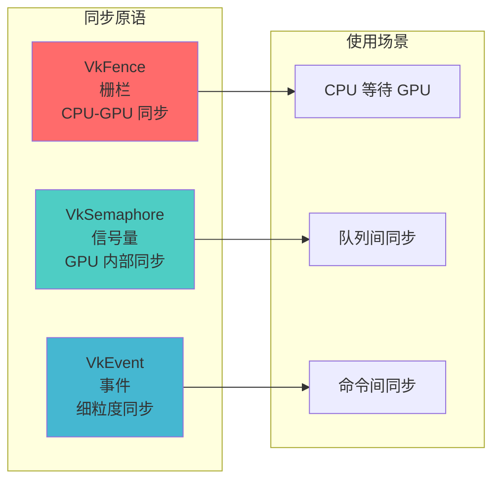
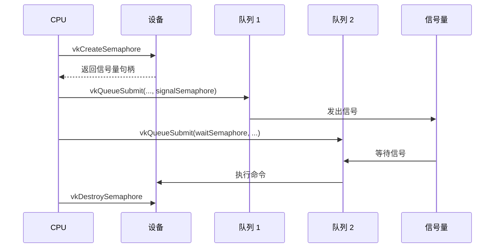
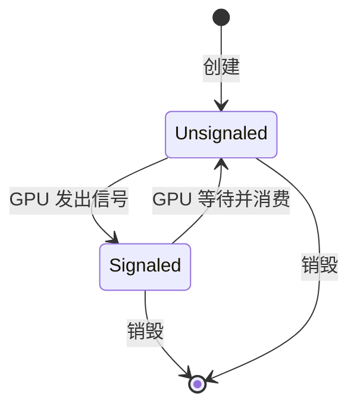
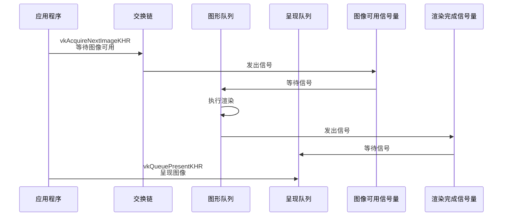
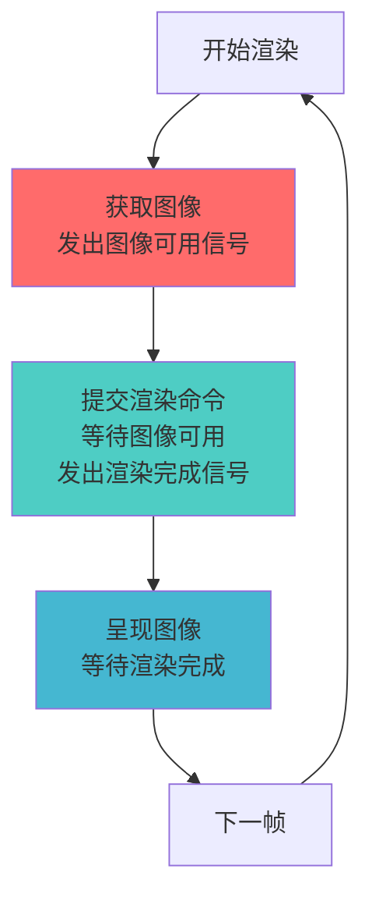
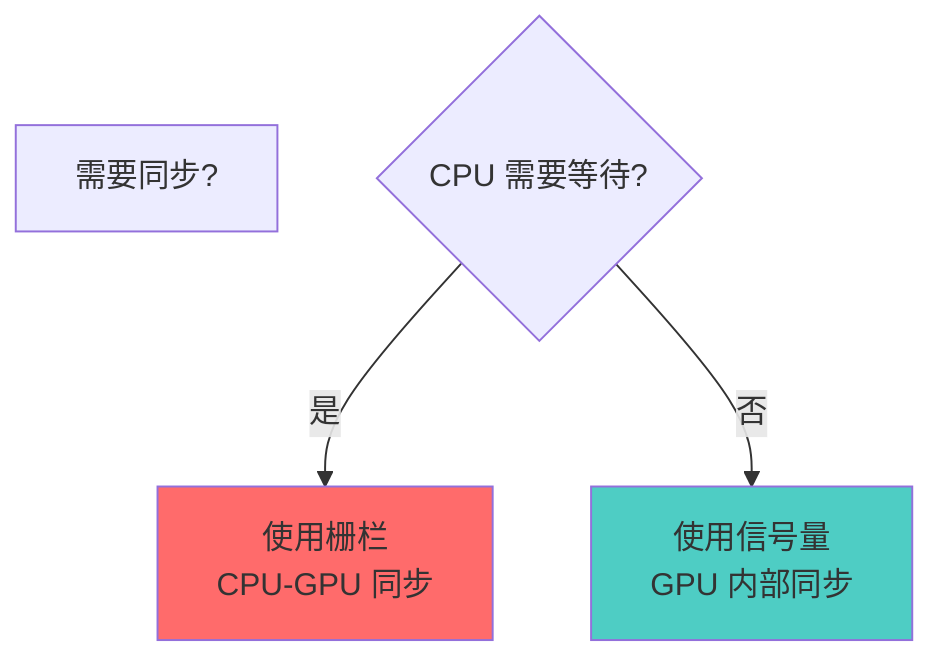

# VkSemaphore 详细分析文档

## 目录
1. [VkSemaphore 概述](#vksemaphore-概述)
2. [信号量的作用与重要性](#信号量的作用与重要性)
3. [信号量 vs 栅栏 vs 事件](#信号量-vs-栅栏-vs-事件)
4. [信号量类型](#信号量类型)
5. [信号量的创建](#信号量的创建)
6. [信号量的使用](#信号量的使用)
7. [队列提交中的信号量](#队列提交中的信号量)
8. [交换链同步](#交换链同步)
9. [时间线信号量](#时间线信号量)
10. [实际代码示例](#实际代码示例)
11. [最佳实践](#最佳实践)

---

## VkSemaphore 概述

### 什么是 VkSemaphore？

**VkSemaphore** 是 Vulkan 中用于 GPU 内部同步的同步原语。它用于在队列之间、命令之间以及 GPU 操作之间建立同步点，确保操作按正确顺序执行。

### VkSemaphore 的核心特点

- **GPU 内部同步**: 用于 GPU 操作之间的同步
- **不可查询**: CPU 无法查询信号量的状态
- **不可重置**: 信号量自动重置（二进制信号量）
- **队列间同步**: 可以在不同队列之间同步
- **管线阶段同步**: 可以在特定管线阶段等待
- **高效**: 比栅栏更轻量，适合高频同步

### VkSemaphore 在 Vulkan 同步架构中的位置



---

## 信号量的作用与重要性

### 信号量的主要作用



### 信号量的使用场景



---

## 信号量 vs 栅栏 vs 事件

### 同步原语对比



### 详细对比表

| 特性 | VkSemaphore | VkFence | VkEvent |
|------|-------------|---------|---------|
| **同步范围** | GPU-GPU | CPU-GPU | GPU 内部 |
| **CPU 可查询** | ❌ 否 | ✅ 是 | ✅ 是 |
| **CPU 可等待** | ❌ 否 | ✅ 是 | ❌ 否 |
| **可重置** | ❌ 否（自动） | ✅ 是 | ✅ 是 |
| **用途** | 队列/命令同步 | CPU 等待 GPU | 细粒度同步 |
| **性能** | 低开销 | 中等开销 | 低开销 |
| **使用频率** | 高频 | 低频 | 中频 |

### 何时使用信号量

**使用信号量当**:
- ✅ 需要在 GPU 操作之间同步
- ✅ 需要在队列之间同步
- ✅ 需要控制命令执行顺序
- ✅ 需要交换链图像同步
- ✅ 在渲染循环中需要同步

**不使用信号量当**:
- ❌ CPU 需要等待 GPU（使用栅栏）
- ❌ 需要查询同步状态（使用栅栏）
- ❌ 需要细粒度命令同步（使用事件）

---

## 信号量类型

### 1. 二进制信号量 (Binary Semaphore)

**标准信号量**:
- 两种状态：未发出信号 / 已发出信号
- 自动重置（使用后自动变为未发出信号）
- 最常见的信号量类型

**特点**:
- ✅ 简单易用
- ✅ 性能优秀
- ✅ 适合大多数同步场景
- ⚠️ 只能表示一个同步点

### 2. 时间线信号量 (Timeline Semaphore)

**扩展信号量** (VK_KHR_timeline_semaphore):
- 使用递增的 64 位值
- 可以表示多个同步点
- 可以等待特定值

**特点**:
- ✅ 可以表示多个同步点
- ✅ 可以等待特定值
- ✅ 可以替代栅栏（CPU 可等待）
- ⚠️ 需要扩展支持

---

## 信号量的创建

### 基本创建（二进制信号量）

```cpp
VkSemaphoreCreateInfo semaphoreInfo{};
semaphoreInfo.sType = VK_STRUCTURE_TYPE_SEMAPHORE_CREATE_INFO;
semaphoreInfo.flags = 0;  // 二进制信号量（默认）

VkSemaphore semaphore;
VkResult result = vkCreateSemaphore(device, &semaphoreInfo, nullptr, &semaphore);
if (result != VK_SUCCESS) {
    throw std::runtime_error("failed to create semaphore!");
}
```

### 创建时间线信号量

```cpp
// 需要 VK_KHR_timeline_semaphore 扩展
VkSemaphoreCreateInfo semaphoreInfo{};
semaphoreInfo.sType = VK_STRUCTURE_TYPE_SEMAPHORE_CREATE_INFO;

VkSemaphoreTypeCreateInfoKHR typeInfo{};
typeInfo.sType = VK_STRUCTURE_TYPE_SEMAPHORE_TYPE_CREATE_INFO_KHR;
typeInfo.semaphoreType = VK_SEMAPHORE_TYPE_TIMELINE_KHR;
typeInfo.initialValue = 0;  // 初始值

semaphoreInfo.pNext = &typeInfo;

VkSemaphore timelineSemaphore;
vkCreateSemaphore(device, &semaphoreInfo, nullptr, &timelineSemaphore);
```

### VkSemaphoreCreateInfo 结构

```cpp
typedef struct VkSemaphoreCreateInfo {
    VkStructureType           sType;      // 结构体类型
    const void*              pNext;      // 扩展链（用于时间线信号量）
    VkSemaphoreCreateFlags    flags;      // 创建标志（保留，必须为 0）
} VkSemaphoreCreateInfo;
```

---

## 信号量的使用

### 信号量的生命周期



### 信号量的状态转换



---

## 队列提交中的信号量

### VkSubmitInfo 中的信号量

```cpp
typedef struct VkSubmitInfo {
    VkStructureType                sType;                  // 结构体类型
    const void*                    pNext;                  // 扩展链
    uint32_t                       waitSemaphoreCount;     // 等待信号量数量
    const VkSemaphore*             pWaitSemaphores;        // 等待信号量数组
    const VkPipelineStageFlags*    pWaitDstStageMask;      // 等待阶段掩码
    uint32_t                       commandBufferCount;     // 命令缓冲区数量
    const VkCommandBuffer*         pCommandBuffers;        // 命令缓冲区数组
    uint32_t                       signalSemaphoreCount;   // 信号信号量数量
    const VkSemaphore*             pSignalSemaphores;       // 信号信号量数组
} VkSubmitInfo;
```

### 等待信号量

**等待信号量** (`pWaitSemaphores`):
- 在命令执行前等待这些信号量发出信号
- 在指定的管线阶段等待（`pWaitDstStageMask`）
- 等待后信号量自动重置为未发出信号状态

### 信号信号量

**信号信号量** (`pSignalSemaphores`):
- 在命令执行完成后发出信号
- 可以在所有命令完成后发出信号
- 其他队列可以等待这些信号量

### 基本使用示例

```cpp
// 创建信号量
VkSemaphore waitSemaphore, signalSemaphore;
VkSemaphoreCreateInfo semaphoreInfo{};
semaphoreInfo.sType = VK_STRUCTURE_TYPE_SEMAPHORE_CREATE_INFO;

vkCreateSemaphore(device, &semaphoreInfo, nullptr, &waitSemaphore);
vkCreateSemaphore(device, &semaphoreInfo, nullptr, &signalSemaphore);

// 提交命令
VkPipelineStageFlags waitStage = VK_PIPELINE_STAGE_COLOR_ATTACHMENT_OUTPUT_BIT;

VkSubmitInfo submitInfo{};
submitInfo.sType = VK_STRUCTURE_TYPE_SUBMIT_INFO;
submitInfo.waitSemaphoreCount = 1;
submitInfo.pWaitSemaphores = &waitSemaphore;        // 等待信号量
submitInfo.pWaitDstStageMask = &waitStage;          // 等待阶段
submitInfo.commandBufferCount = 1;
submitInfo.pCommandBuffers = &commandBuffer;
submitInfo.signalSemaphoreCount = 1;
submitInfo.pSignalSemaphores = &signalSemaphore;    // 信号信号量

vkQueueSubmit(queue, 1, &submitInfo, VK_NULL_HANDLE);
```

---

## 交换链同步

### 交换链同步流程



### 完整的交换链同步示例

```cpp
class SwapchainSynchronization {
private:
    VkDevice device;
    VkSwapchainKHR swapchain;
    VkQueue graphicsQueue;
    VkQueue presentQueue;
    
    // 每帧的信号量
    std::vector<VkSemaphore> imageAvailableSemaphores;   // 图像可用信号量
    std::vector<VkSemaphore> renderFinishedSemaphores;   // 渲染完成信号量
    
    uint32_t currentFrame = 0;
    
public:
    void init(uint32_t maxFramesInFlight) {
        // 创建图像可用信号量（每帧一个）
        imageAvailableSemaphores.resize(maxFramesInFlight);
        VkSemaphoreCreateInfo semaphoreInfo{};
        semaphoreInfo.sType = VK_STRUCTURE_TYPE_SEMAPHORE_CREATE_INFO;
        
        for (uint32_t i = 0; i < maxFramesInFlight; i++) {
            vkCreateSemaphore(
                device, 
                &semaphoreInfo, 
                nullptr, 
                &imageAvailableSemaphores[i]
            );
        }
        
        // 创建渲染完成信号量（每个交换链图像一个）
        renderFinishedSemaphores.resize(swapchainImageCount);
        for (uint32_t i = 0; i < swapchainImageCount; i++) {
            vkCreateSemaphore(
                device, 
                &semaphoreInfo, 
                nullptr, 
                &renderFinishedSemaphores[i]
            );
        }
    }
    
    void renderFrame() {
        uint32_t imageIndex;
        
        // 1. 获取交换链图像（等待图像可用信号量）
        vkAcquireNextImageKHR(
            device,
            swapchain,
            UINT64_MAX,                                    // 无限等待
            imageAvailableSemaphores[currentFrame],        // 图像可用时发出信号
            VK_NULL_HANDLE,
            &imageIndex
        );
        
        // 2. 提交渲染命令
        VkPipelineStageFlags waitStages[] = {
            VK_PIPELINE_STAGE_COLOR_ATTACHMENT_OUTPUT_BIT
        };
        
        VkSubmitInfo submitInfo{};
        submitInfo.sType = VK_STRUCTURE_TYPE_SUBMIT_INFO;
        submitInfo.waitSemaphoreCount = 1;
        submitInfo.pWaitSemaphores = &imageAvailableSemaphores[currentFrame];
        submitInfo.pWaitDstStageMask = waitStages;
        submitInfo.commandBufferCount = 1;
        submitInfo.pCommandBuffers = &commandBuffers[imageIndex];
        submitInfo.signalSemaphoreCount = 1;
        submitInfo.pSignalSemaphores = &renderFinishedSemaphores[imageIndex];
        
        vkQueueSubmit(graphicsQueue, 1, &submitInfo, VK_NULL_HANDLE);
        
        // 3. 呈现图像（等待渲染完成信号量）
        VkPresentInfoKHR presentInfo{};
        presentInfo.sType = VK_STRUCTURE_TYPE_PRESENT_INFO_KHR;
        presentInfo.waitSemaphoreCount = 1;
        presentInfo.pWaitSemaphores = &renderFinishedSemaphores[imageIndex];
        presentInfo.swapchainCount = 1;
        presentInfo.pSwapchains = &swapchain;
        presentInfo.pImageIndices = &imageIndex;
        
        vkQueuePresentKHR(presentQueue, &presentInfo);
        
        // 4. 移动到下一帧
        currentFrame = (currentFrame + 1) % maxFramesInFlight;
    }
};
```

### 同步点说明

**图像可用信号量**:
- 由 `vkAcquireNextImageKHR` 发出信号
- 表示交换链图像已准备好用于渲染
- 图形队列等待此信号量后开始渲染

**渲染完成信号量**:
- 由图形队列在渲染完成后发出信号
- 表示渲染命令已完成
- 呈现队列等待此信号量后呈现图像

---

## 时间线信号量

### 时间线信号量概述

时间线信号量使用递增的 64 位值来表示多个同步点，比二进制信号量更强大。

### 创建时间线信号量

```cpp
// 需要启用 VK_KHR_timeline_semaphore 扩展
VkSemaphoreCreateInfo semaphoreInfo{};
semaphoreInfo.sType = VK_STRUCTURE_TYPE_SEMAPHORE_CREATE_INFO;

VkSemaphoreTypeCreateInfoKHR typeInfo{};
typeInfo.sType = VK_STRUCTURE_TYPE_SEMAPHORE_TYPE_CREATE_INFO_KHR;
typeInfo.semaphoreType = VK_SEMAPHORE_TYPE_TIMELINE_KHR;
typeInfo.initialValue = 0;  // 初始值

semaphoreInfo.pNext = &typeInfo;

VkSemaphore timelineSemaphore;
vkCreateSemaphore(device, &semaphoreInfo, nullptr, &timelineSemaphore);
```

### 使用时间线信号量

```cpp
// 在提交中使用时间线信号量
VkTimelineSemaphoreSubmitInfoKHR timelineInfo{};
timelineInfo.sType = VK_STRUCTURE_TYPE_TIMELINE_SEMAPHORE_SUBMIT_INFO_KHR;
timelineInfo.waitSemaphoreValueCount = 1;
uint64_t waitValue = 5;  // 等待值 5
timelineInfo.pWaitSemaphoreValues = &waitValue;
timelineInfo.signalSemaphoreValueCount = 1;
uint64_t signalValue = 6;  // 发出信号值 6
timelineInfo.pSignalSemaphoreValues = &signalValue;

VkSubmitInfo submitInfo{};
submitInfo.sType = VK_STRUCTURE_TYPE_SUBMIT_INFO;
submitInfo.pNext = &timelineInfo;  // 链接时间线信息
submitInfo.waitSemaphoreCount = 1;
submitInfo.pWaitSemaphores = &timelineSemaphore;
submitInfo.signalSemaphoreCount = 1;
submitInfo.pSignalSemaphores = &timelineSemaphore;
submitInfo.commandBufferCount = 1;
submitInfo.pCommandBuffers = &commandBuffer;

vkQueueSubmit(queue, 1, &submitInfo, VK_NULL_HANDLE);
```

### CPU 等待时间线信号量

```cpp
// 需要 vkWaitSemaphoresKHR 函数
PFN_vkWaitSemaphoresKHR vkWaitSemaphoresKHR = 
    (PFN_vkWaitSemaphoresKHR)vkGetDeviceProcAddr(device, "vkWaitSemaphoresKHR");

VkSemaphoreWaitInfo waitInfo{};
waitInfo.sType = VK_STRUCTURE_TYPE_SEMAPHORE_WAIT_INFO;
waitInfo.semaphoreCount = 1;
waitInfo.pSemaphores = &timelineSemaphore;
uint64_t waitValue = 10;
waitInfo.pValues = &waitValue;

// CPU 等待时间线信号量达到指定值
vkWaitSemaphoresKHR(device, &waitInfo, UINT64_MAX);
```

### 查询时间线信号量值

```cpp
// 需要 vkGetSemaphoreCounterValueKHR 函数
PFN_vkGetSemaphoreCounterValueKHR vkGetSemaphoreCounterValueKHR = 
    (PFN_vkGetSemaphoreCounterValueKHR)vkGetDeviceProcAddr(
        device, "vkGetSemaphoreCounterValueKHR");

uint64_t value;
vkGetSemaphoreCounterValueKHR(device, timelineSemaphore, &value);
```

---

## 实际代码示例

### 示例 1: 基本信号量使用

```cpp
class BasicSemaphoreExample {
private:
    VkDevice device;
    VkQueue queue1, queue2;
    VkSemaphore semaphore;
    
public:
    void init() {
        // 创建信号量
        VkSemaphoreCreateInfo semaphoreInfo{};
        semaphoreInfo.sType = VK_STRUCTURE_TYPE_SEMAPHORE_CREATE_INFO;
        vkCreateSemaphore(device, &semaphoreInfo, nullptr, &semaphore);
    }
    
    void syncQueues(VkCommandBuffer cmd1, VkCommandBuffer cmd2) {
        // 队列1：发出信号
        VkSubmitInfo submitInfo1{};
        submitInfo1.sType = VK_STRUCTURE_TYPE_SUBMIT_INFO;
        submitInfo1.commandBufferCount = 1;
        submitInfo1.pCommandBuffers = &cmd1;
        submitInfo1.signalSemaphoreCount = 1;
        submitInfo1.pSignalSemaphores = &semaphore;
        
        vkQueueSubmit(queue1, 1, &submitInfo1, VK_NULL_HANDLE);
        
        // 队列2：等待信号
        VkPipelineStageFlags waitStage = VK_PIPELINE_STAGE_COMPUTE_SHADER_BIT;
        VkSubmitInfo submitInfo2{};
        submitInfo2.sType = VK_STRUCTURE_TYPE_SUBMIT_INFO;
        submitInfo2.waitSemaphoreCount = 1;
        submitInfo2.pWaitSemaphores = &semaphore;
        submitInfo2.pWaitDstStageMask = &waitStage;
        submitInfo2.commandBufferCount = 1;
        submitInfo2.pCommandBuffers = &cmd2;
        
        vkQueueSubmit(queue2, 1, &submitInfo2, VK_NULL_HANDLE);
    }
    
    void cleanup() {
        vkDestroySemaphore(device, semaphore, nullptr);
    }
};
```

### 示例 2: 多信号量同步

```cpp
class MultiSemaphoreSync {
private:
    VkDevice device;
    VkQueue graphicsQueue;
    VkQueue computeQueue;
    VkQueue transferQueue;
    
    VkSemaphore graphicsToComputeSemaphore;
    VkSemaphore computeToTransferSemaphore;
    VkSemaphore transferToGraphicsSemaphore;
    
public:
    void init() {
        VkSemaphoreCreateInfo semaphoreInfo{};
        semaphoreInfo.sType = VK_STRUCTURE_TYPE_SEMAPHORE_CREATE_INFO;
        
        vkCreateSemaphore(device, &semaphoreInfo, nullptr, 
                         &graphicsToComputeSemaphore);
        vkCreateSemaphore(device, &semaphoreInfo, nullptr, 
                         &computeToTransferSemaphore);
        vkCreateSemaphore(device, &semaphoreInfo, nullptr, 
                         &transferToGraphicsSemaphore);
    }
    
    void syncAllQueues(
        VkCommandBuffer graphicsCmd,
        VkCommandBuffer computeCmd,
        VkCommandBuffer transferCmd) {
        
        // 图形队列：发出信号给计算队列
        VkSubmitInfo graphicsSubmit{};
        graphicsSubmit.sType = VK_STRUCTURE_TYPE_SUBMIT_INFO;
        graphicsSubmit.commandBufferCount = 1;
        graphicsSubmit.pCommandBuffers = &graphicsCmd;
        graphicsSubmit.signalSemaphoreCount = 1;
        graphicsSubmit.pSignalSemaphores = &graphicsToComputeSemaphore;
        
        vkQueueSubmit(graphicsQueue, 1, &graphicsSubmit, VK_NULL_HANDLE);
        
        // 计算队列：等待图形队列，发出信号给传输队列
        VkPipelineStageFlags computeWaitStage = 
            VK_PIPELINE_STAGE_COMPUTE_SHADER_BIT;
        VkSubmitInfo computeSubmit{};
        computeSubmit.sType = VK_STRUCTURE_TYPE_SUBMIT_INFO;
        computeSubmit.waitSemaphoreCount = 1;
        computeSubmit.pWaitSemaphores = &graphicsToComputeSemaphore;
        computeSubmit.pWaitDstStageMask = &computeWaitStage;
        computeSubmit.commandBufferCount = 1;
        computeSubmit.pCommandBuffers = &computeCmd;
        computeSubmit.signalSemaphoreCount = 1;
        computeSubmit.pSignalSemaphores = &computeToTransferSemaphore;
        
        vkQueueSubmit(computeQueue, 1, &computeSubmit, VK_NULL_HANDLE);
        
        // 传输队列：等待计算队列，发出信号给图形队列
        VkPipelineStageFlags transferWaitStage = 
            VK_PIPELINE_STAGE_TRANSFER_BIT;
        VkSubmitInfo transferSubmit{};
        transferSubmit.sType = VK_STRUCTURE_TYPE_SUBMIT_INFO;
        transferSubmit.waitSemaphoreCount = 1;
        transferSubmit.pWaitSemaphores = &computeToTransferSemaphore;
        transferSubmit.pWaitDstStageMask = &transferWaitStage;
        transferSubmit.commandBufferCount = 1;
        transferSubmit.pCommandBuffers = &transferCmd;
        transferSubmit.signalSemaphoreCount = 1;
        transferSubmit.pSignalSemaphores = &transferToGraphicsSemaphore;
        
        vkQueueSubmit(transferQueue, 1, &transferSubmit, VK_NULL_HANDLE);
    }
};
```

### 示例 3: 完整的渲染循环

```cpp
class RenderLoop {
private:
    static constexpr uint32_t MAX_FRAMES_IN_FLIGHT = 2;
    
    VkDevice device;
    VkSwapchainKHR swapchain;
    VkQueue graphicsQueue;
    VkQueue presentQueue;
    
    std::array<VkSemaphore, MAX_FRAMES_IN_FLIGHT> imageAvailableSemaphores;
    std::array<VkSemaphore, MAX_FRAMES_IN_FLIGHT> renderFinishedSemaphores;
    std::array<VkFence, MAX_FRAMES_IN_FLIGHT> inFlightFences;
    
    std::vector<VkCommandBuffer> commandBuffers;
    uint32_t currentFrame = 0;
    
public:
    void init() {
        // 创建信号量
        VkSemaphoreCreateInfo semaphoreInfo{};
        semaphoreInfo.sType = VK_STRUCTURE_TYPE_SEMAPHORE_CREATE_INFO;
        
        for (uint32_t i = 0; i < MAX_FRAMES_IN_FLIGHT; i++) {
            vkCreateSemaphore(device, &semaphoreInfo, nullptr, 
                             &imageAvailableSemaphores[i]);
            vkCreateSemaphore(device, &semaphoreInfo, nullptr, 
                             &renderFinishedSemaphores[i]);
        }
        
        // 创建栅栏（用于 CPU 等待）
        VkFenceCreateInfo fenceInfo{};
        fenceInfo.sType = VK_STRUCTURE_TYPE_FENCE_CREATE_INFO;
        fenceInfo.flags = VK_FENCE_CREATE_SIGNALED_BIT;
        
        for (uint32_t i = 0; i < MAX_FRAMES_IN_FLIGHT; i++) {
            vkCreateFence(device, &fenceInfo, nullptr, &inFlightFences[i]);
        }
    }
    
    void renderFrame() {
        // 1. 等待当前帧的栅栏（确保可以安全使用资源）
        vkWaitForFences(device, 1, &inFlightFences[currentFrame], 
                       VK_TRUE, UINT64_MAX);
        vkResetFences(device, 1, &inFlightFences[currentFrame]);
        
        // 2. 获取交换链图像
        uint32_t imageIndex;
        vkAcquireNextImageKHR(
            device,
            swapchain,
            UINT64_MAX,
            imageAvailableSemaphores[currentFrame],  // 图像可用时发出信号
            VK_NULL_HANDLE,
            &imageIndex
        );
        
        // 3. 提交渲染命令
        VkPipelineStageFlags waitStages[] = {
            VK_PIPELINE_STAGE_COLOR_ATTACHMENT_OUTPUT_BIT
        };
        
        VkSubmitInfo submitInfo{};
        submitInfo.sType = VK_STRUCTURE_TYPE_SUBMIT_INFO;
        submitInfo.waitSemaphoreCount = 1;
        submitInfo.pWaitSemaphores = &imageAvailableSemaphores[currentFrame];
        submitInfo.pWaitDstStageMask = waitStages;
        submitInfo.commandBufferCount = 1;
        submitInfo.pCommandBuffers = &commandBuffers[imageIndex];
        submitInfo.signalSemaphoreCount = 1;
        submitInfo.pSignalSemaphores = &renderFinishedSemaphores[currentFrame];
        
        vkQueueSubmit(graphicsQueue, 1, &submitInfo, 
                     inFlightFences[currentFrame]);
        
        // 4. 呈现图像
        VkPresentInfoKHR presentInfo{};
        presentInfo.sType = VK_STRUCTURE_TYPE_PRESENT_INFO_KHR;
        presentInfo.waitSemaphoreCount = 1;
        presentInfo.pWaitSemaphores = &renderFinishedSemaphores[currentFrame];
        presentInfo.swapchainCount = 1;
        presentInfo.pSwapchains = &swapchain;
        presentInfo.pImageIndices = &imageIndex;
        
        vkQueuePresentKHR(presentQueue, &presentInfo);
        
        // 5. 移动到下一帧
        currentFrame = (currentFrame + 1) % MAX_FRAMES_IN_FLIGHT;
    }
};
```

### 示例 4: 时间线信号量使用

```cpp
class TimelineSemaphoreExample {
private:
    VkDevice device;
    VkQueue graphicsQueue;
    VkQueue computeQueue;
    VkSemaphore timelineSemaphore;
    uint64_t timelineValue = 0;
    
public:
    void init() {
        // 创建时间线信号量
        VkSemaphoreCreateInfo semaphoreInfo{};
        semaphoreInfo.sType = VK_STRUCTURE_TYPE_SEMAPHORE_CREATE_INFO;
        
        VkSemaphoreTypeCreateInfoKHR typeInfo{};
        typeInfo.sType = VK_STRUCTURE_TYPE_SEMAPHORE_TYPE_CREATE_INFO_KHR;
        typeInfo.semaphoreType = VK_SEMAPHORE_TYPE_TIMELINE_KHR;
        typeInfo.initialValue = 0;
        
        semaphoreInfo.pNext = &typeInfo;
        vkCreateSemaphore(device, &semaphoreInfo, nullptr, &timelineSemaphore);
    }
    
    void syncWithTimeline(
        VkCommandBuffer graphicsCmd,
        VkCommandBuffer computeCmd) {
        
        const uint64_t graphicsFinished = timelineValue;
        const uint64_t computeFinished = timelineValue + 1;
        timelineValue += 2;
        
        // 图形队列：发出信号值 graphicsFinished
        VkTimelineSemaphoreSubmitInfoKHR timelineInfo{};
        timelineInfo.sType = VK_STRUCTURE_TYPE_TIMELINE_SEMAPHORE_SUBMIT_INFO_KHR;
        timelineInfo.signalSemaphoreValueCount = 1;
        timelineInfo.pSignalSemaphoreValues = &graphicsFinished;
        
        VkSubmitInfo graphicsSubmit{};
        graphicsSubmit.sType = VK_STRUCTURE_TYPE_SUBMIT_INFO;
        graphicsSubmit.pNext = &timelineInfo;
        graphicsSubmit.commandBufferCount = 1;
        graphicsSubmit.pCommandBuffers = &graphicsCmd;
        graphicsSubmit.signalSemaphoreCount = 1;
        graphicsSubmit.pSignalSemaphores = &timelineSemaphore;
        
        vkQueueSubmit(graphicsQueue, 1, &graphicsSubmit, VK_NULL_HANDLE);
        
        // 计算队列：等待 graphicsFinished，发出信号值 computeFinished
        VkPipelineStageFlags waitStage = VK_PIPELINE_STAGE_COMPUTE_SHADER_BIT;
        uint64_t waitValue = graphicsFinished;
        
        timelineInfo.waitSemaphoreValueCount = 1;
        timelineInfo.pWaitSemaphoreValues = &waitValue;
        timelineInfo.signalSemaphoreValueCount = 1;
        timelineInfo.pSignalSemaphoreValues = &computeFinished;
        
        VkSubmitInfo computeSubmit{};
        computeSubmit.sType = VK_STRUCTURE_TYPE_SUBMIT_INFO;
        computeSubmit.pNext = &timelineInfo;
        computeSubmit.waitSemaphoreCount = 1;
        computeSubmit.pWaitSemaphores = &timelineSemaphore;
        computeSubmit.pWaitDstStageMask = &waitStage;
        computeSubmit.commandBufferCount = 1;
        computeSubmit.pCommandBuffers = &computeCmd;
        computeSubmit.signalSemaphoreCount = 1;
        computeSubmit.pSignalSemaphores = &timelineSemaphore;
        
        vkQueueSubmit(computeQueue, 1, &computeSubmit, VK_NULL_HANDLE);
    }
    
    void waitOnCPU(uint64_t value) {
        // CPU 等待时间线信号量达到指定值
        PFN_vkWaitSemaphoresKHR vkWaitSemaphoresKHR = 
            (PFN_vkWaitSemaphoresKHR)vkGetDeviceProcAddr(
                device, "vkWaitSemaphoresKHR");
        
        VkSemaphoreWaitInfo waitInfo{};
        waitInfo.sType = VK_STRUCTURE_TYPE_SEMAPHORE_WAIT_INFO;
        waitInfo.semaphoreCount = 1;
        waitInfo.pSemaphores = &timelineSemaphore;
        waitInfo.pValues = &value;
        
        vkWaitSemaphoresKHR(device, &waitInfo, UINT64_MAX);
    }
};
```

---

## 最佳实践

### 1. 信号量使用模式



### 2. 创建策略

**DO**:
- ✅ 为每帧创建独立的信号量
- ✅ 为每个交换链图像创建独立的渲染完成信号量
- ✅ 在初始化时创建所有需要的信号量

**DON'T**:
- ❌ 在渲染循环中频繁创建/销毁信号量
- ❌ 重用信号量而不等待
- ❌ 忘记销毁信号量

### 3. 等待阶段选择

**DO**:
- ✅ 选择最早的等待阶段以提高并行性
- ✅ 使用 `VK_PIPELINE_STAGE_COLOR_ATTACHMENT_OUTPUT_BIT` 等待图像可用
- ✅ 使用 `VK_PIPELINE_STAGE_COMPUTE_SHADER_BIT` 等待计算完成

**DON'T**:
- ❌ 使用过晚的等待阶段（降低并行性）
- ❌ 忘记设置等待阶段掩码

### 4. 信号量 vs 栅栏选择



**使用信号量**:
- GPU 操作之间的同步
- 队列间同步
- 交换链同步
- 渲染循环中的同步

**使用栅栏**:
- CPU 需要等待 GPU
- 确保资源可以安全重用
- 多帧并发控制

### 5. 性能优化

```cpp
// ✅ 好的做法：批量提交多个信号量
VkSemaphore waitSemaphores[] = {sem1, sem2, sem3};
VkPipelineStageFlags waitStages[] = {
    VK_PIPELINE_STAGE_VERTEX_INPUT_BIT,
    VK_PIPELINE_STAGE_COMPUTE_SHADER_BIT,
    VK_PIPELINE_STAGE_COLOR_ATTACHMENT_OUTPUT_BIT
};

VkSubmitInfo submitInfo{};
submitInfo.waitSemaphoreCount = 3;
submitInfo.pWaitSemaphores = waitSemaphores;
submitInfo.pWaitDstStageMask = waitStages;
// ...

// ❌ 不好的做法：逐个提交
// 这会降低并行性
```

### 6. 常见陷阱

| 陷阱 | 问题 | 解决方案 |
|------|------|----------|
| 忘记等待信号量 | 数据竞争 | 在需要同步的操作前等待 |
| 错误的等待阶段 | 性能下降 | 选择最早的等待阶段 |
| 信号量数量不足 | 同步失效 | 为每帧创建足够的信号量 |
| 忘记设置等待阶段 | 同步失效 | 正确设置 pWaitDstStageMask |
| 重用未等待的信号量 | 未定义行为 | 等待信号量后再重用 |

### 7. 交换链同步最佳实践

```cpp
// ✅ 最佳实践：每帧独立的信号量
std::array<VkSemaphore, MAX_FRAMES_IN_FLIGHT> imageAvailableSemaphores;
std::array<VkSemaphore, MAX_FRAMES_IN_FLIGHT> renderFinishedSemaphores;

// ✅ 使用正确的等待阶段
VkPipelineStageFlags waitStage = 
    VK_PIPELINE_STAGE_COLOR_ATTACHMENT_OUTPUT_BIT;

// ✅ 在获取图像时使用信号量
vkAcquireNextImageKHR(
    device,
    swapchain,
    UINT64_MAX,
    imageAvailableSemaphores[currentFrame],
    VK_NULL_HANDLE,
    &imageIndex
);

// ✅ 在提交时等待和发出信号
VkSubmitInfo submitInfo{};
submitInfo.waitSemaphoreCount = 1;
submitInfo.pWaitSemaphores = &imageAvailableSemaphores[currentFrame];
submitInfo.pWaitDstStageMask = &waitStage;
submitInfo.signalSemaphoreCount = 1;
submitInfo.pSignalSemaphores = &renderFinishedSemaphores[currentFrame];
```

### 8. 时间线信号量最佳实践

**使用时间线信号量当**:
- ✅ 需要多个同步点
- ✅ 需要 CPU 等待 GPU（替代栅栏）
- ✅ 需要复杂的同步逻辑

**优势**:
- 可以表示多个同步点
- CPU 可以等待特定值
- 可以替代栅栏使用

---

## 总结

### VkSemaphore 关键要点

1. **GPU 内部同步**: 信号量用于 GPU 操作之间的同步
2. **不可查询**: CPU 无法查询信号量的状态
3. **自动重置**: 二进制信号量使用后自动重置
4. **队列间同步**: 可以在不同队列之间同步
5. **管线阶段同步**: 可以在特定管线阶段等待
6. **高效**: 比栅栏更轻量，适合高频同步
7. **交换链同步**: 用于交换链图像同步

### 信号量使用流程


### 信号量 vs 栅栏选择指南

| 场景 | 使用 |
|------|------|
| GPU 操作间同步 | VkSemaphore |
| CPU 等待 GPU | VkFence |
| 队列间同步 | VkSemaphore |
| 交换链同步 | VkSemaphore |
| 命令缓冲区重用 | VkFence |
| 多帧并发控制 | VkFence + VkSemaphore |

### 进一步学习

- 深入了解 Vulkan 同步机制
- 学习栅栏和事件的用法
- 研究时间线信号量扩展
- 探索多队列并行处理
- 了解性能优化技巧

---

**文档版本**: 1.0  
**最后更新**: 2024  
**相关文档**: 
- [VkFence 详细分析](./VkFence详细分析.md)
- [VkQueue 详细分析](./VkQueue详细分析.md)
- [VkBuffer 详细分析](./VkBuffer详细分析.md)

