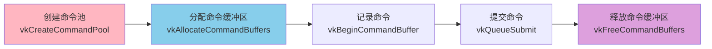
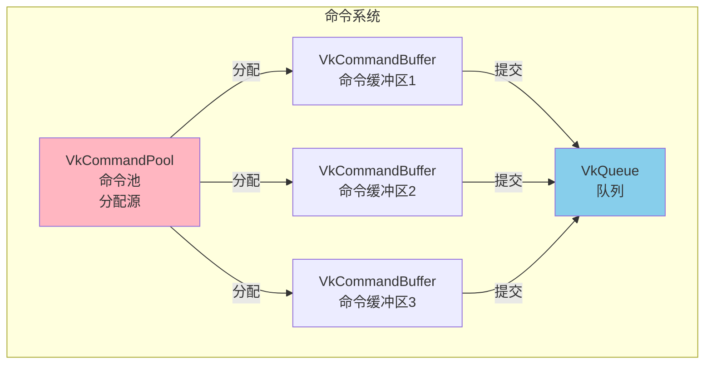
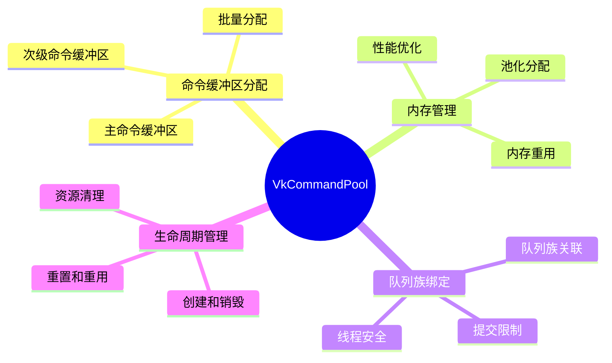
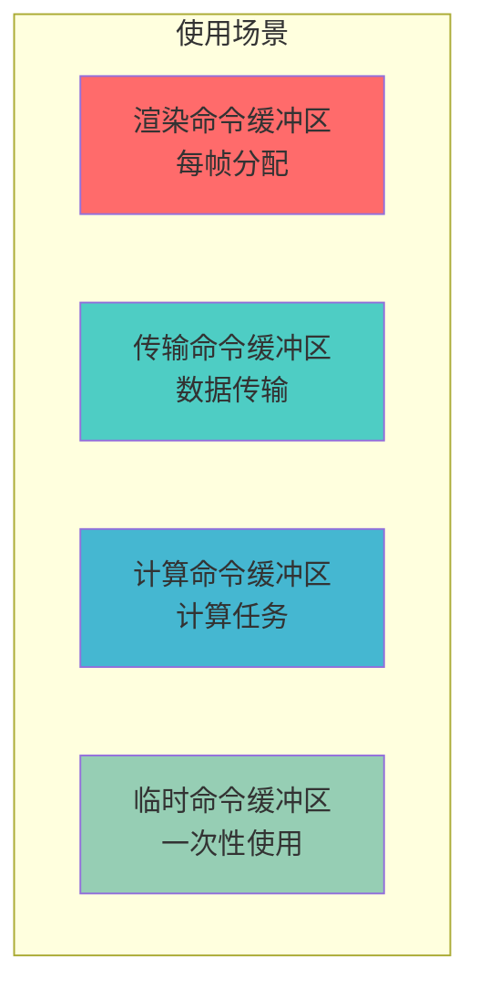
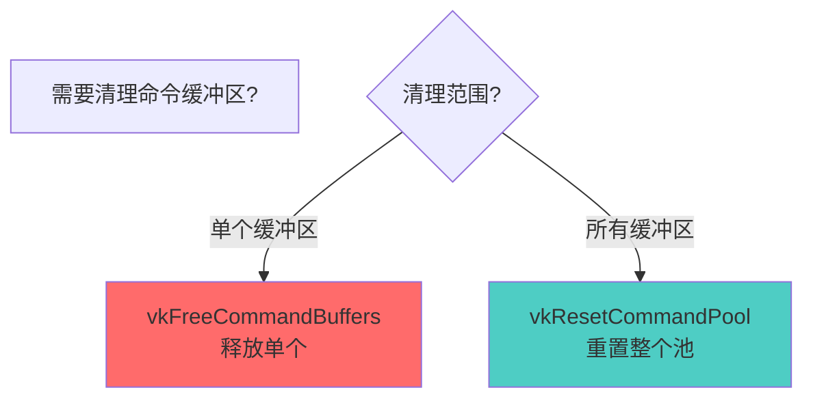
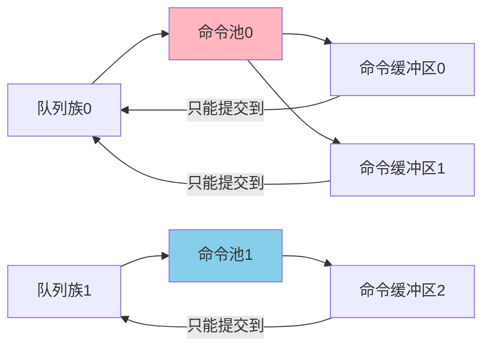
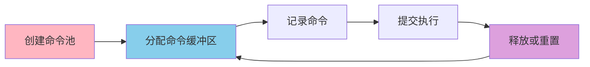

# VkCommandPool 详细分析文档

## 目录
1. [命令池是什么？用生活例子理解](#命令池是什么用生活例子理解)
2. [VkCommandPool 概述](#vkcommandpool-概述)
3. [命令池的作用与重要性](#命令池的作用与重要性)
4. [命令池的创建](#命令池的创建)
5. [命令缓冲区的分配](#命令缓冲区的分配)
6. [命令池的重置](#命令池的重置)
7. [命令缓冲区的释放](#命令缓冲区的释放)
8. [命令池与队列族的关系](#命令池与队列族的关系)
9. [实际代码示例](#实际代码示例)
10. [最佳实践](#最佳实践)

---

## 命令池是什么？用生活例子理解

### 📝 最简单的理解：命令池 = 笔记本仓库

想象你在管理一个办公室：

```
办公室（GPU）              笔记本仓库（命令池）          笔记本（命令缓冲区）
    │                              │                        │
    │  1. 创建仓库                  │                        │
    │     （命令池）                │                        │
    │                              │                        │
    │  2. 从仓库领取笔记本          │                        │
    │     （分配命令缓冲区）         │                        │
    │                              │                        │
    │  3. 在笔记本上写命令          │                        │
    │     （记录命令）               │                        │
    │                              │                        │
    │  4. 使用完归还仓库            │                        │
    │     （释放命令缓冲区）         │                        │
```

**命令池（Command Pool）就像笔记本仓库**：
- **创建命令池** = 准备一个仓库存放笔记本
- **分配命令缓冲区** = 从仓库领取笔记本
- **记录命令** = 在笔记本上写命令
- **释放命令缓冲区** = 归还笔记本到仓库

### 🏭 更具体的例子：工厂工具箱

想象你在管理一个工厂：

```
工厂（GPU）                工具箱（命令池）              工具（命令缓冲区）
    │                            │                          │
    │  1. 准备工具箱              │                          │
    │     （创建命令池）           │                          │
    │                            │                          │
    │  2. 从工具箱拿工具          │                          │
    │     （分配命令缓冲区）       │                          │
    │                            │                          │
    │  3. 使用工具工作            │                          │
    │     （记录命令）             │                          │
    │                            │                          │
    │  4. 用完放回工具箱          │                          │
    │     （释放命令缓冲区）       │                          │
```

**关键点**：
- 工具箱（命令池）预先准备好工具
- 工人（应用程序）从工具箱拿工具（分配命令缓冲区）
- 使用工具工作（记录命令）
- 用完放回工具箱（释放命令缓冲区）

### 🎮 游戏例子：技能栏

想象你在玩游戏，有技能栏：

```
角色（GPU）                技能栏（命令池）              技能（命令缓冲区）
    │                            │                          │
    │  1. 准备技能栏              │                          │
    │     （创建命令池）           │                          │
    │                            │                          │
    │  2. 学习技能                │                          │
    │     （分配命令缓冲区）       │                          │
    │                            │                          │
    │  3. 使用技能                │                          │
    │     （记录命令）             │                          │
    │                            │                          │
    │  4. 技能冷却                │                          │
    │     （释放命令缓冲区）       │                          │
```

### 💻 在Vulkan中的实际场景

#### 场景1：创建命令池并分配命令缓冲区

```cpp
// 1. 创建命令池（准备仓库）
VkCommandPoolCreateInfo poolInfo{};
poolInfo.sType = VK_STRUCTURE_TYPE_COMMAND_POOL_CREATE_INFO;
poolInfo.queueFamilyIndex = graphicsQueueFamilyIndex;  // 图形队列族
poolInfo.flags = VK_COMMAND_POOL_CREATE_RESET_COMMAND_BUFFER_BIT;  // 允许重置

VkCommandPool commandPool;
vkCreateCommandPool(device, &poolInfo, nullptr, &commandPool);

// 2. 从命令池分配命令缓冲区（从仓库领取笔记本）
VkCommandBufferAllocateInfo allocInfo{};
allocInfo.sType = VK_STRUCTURE_TYPE_COMMAND_BUFFER_ALLOCATE_INFO;
allocInfo.commandPool = commandPool;
allocInfo.level = VK_COMMAND_BUFFER_LEVEL_PRIMARY;
allocInfo.commandBufferCount = 1;

VkCommandBuffer commandBuffer;
vkAllocateCommandBuffers(device, &allocInfo, &commandBuffer);
```

**为什么需要命令池？**
- 命令缓冲区不能直接创建，必须从命令池分配
- 命令池管理命令缓冲区的内存
- 提高分配效率（池化分配）

### 🎯 命令池的关键概念



### 🆚 命令池 vs 直接创建：简单对比

| 特性 | 命令池系统 | 直接创建 |
|------|----------|---------|
| **方式** | 从池中分配 | 直接创建 |
| **比喻** | 从仓库领取 | 直接制造 |
| **效率** | 高（池化） | 低（每次创建） |
| **Vulkan** | ✅ 使用命令池 | ❌ 不支持直接创建 |

### ✅ 总结：命令池就是什么？

**一句话总结**：命令池（Command Pool）就是**命令缓冲区的"仓库"**，用于分配和管理命令缓冲区。

**三个关键词**：
1. **分配源** - 命令缓冲区从这里分配
2. **内存管理** - 管理命令缓冲区的内存
3. **队列族绑定** - 与特定队列族关联

**记住这个公式**：
```
创建命令池 → 分配命令缓冲区 → 记录命令 → 提交执行 → 释放命令缓冲区
```

**常见使用场景**：
- ✅ 分配主命令缓冲区
- ✅ 分配次级命令缓冲区
- ✅ 批量分配命令缓冲区
- ✅ 重用命令缓冲区

---

## VkCommandPool 概述

### 什么是 VkCommandPool？

**VkCommandPool** 是 Vulkan 中用于分配命令缓冲区的对象。它管理命令缓冲区的内存分配，并确保命令缓冲区只能提交到特定队列族的队列。

### VkCommandPool 的核心特点

- **命令缓冲区分配**: 从命令池分配命令缓冲区
- **队列族绑定**: 与特定队列族关联
- **内存管理**: 管理命令缓冲区的内存
- **重置支持**: 可以重置命令池或单个命令缓冲区
- **线程安全**: 命令池不是线程安全的

### VkCommandPool 在 Vulkan 命令架构中的位置



---

## 命令池的作用与重要性

### 命令池的主要作用



### 命令池的使用场景



---

## 命令池的创建

### 基本创建

```cpp
VkCommandPoolCreateInfo poolInfo{};
poolInfo.sType = VK_STRUCTURE_TYPE_COMMAND_POOL_CREATE_INFO;
poolInfo.queueFamilyIndex = graphicsQueueFamilyIndex;  // 队列族索引
poolInfo.flags = VK_COMMAND_POOL_CREATE_RESET_COMMAND_BUFFER_BIT;  // 创建标志

VkCommandPool commandPool;
VkResult result = vkCreateCommandPool(device, &poolInfo, nullptr, &commandPool);
if (result != VK_SUCCESS) {
    throw std::runtime_error("failed to create command pool!");
}
```

### VkCommandPoolCreateInfo 结构

```cpp
typedef struct VkCommandPoolCreateInfo {
    VkStructureType              sType;              // 结构体类型
    const void*                  pNext;              // 扩展链
    VkCommandPoolCreateFlags     flags;              // 创建标志
    uint32_t                     queueFamilyIndex;   // 队列族索引
} VkCommandPoolCreateInfo;
```

### 创建标志

| 标志 | 说明 |
|------|------|
| `0` | 默认标志 |
| `VK_COMMAND_POOL_CREATE_TRANSIENT_BIT` | 命令缓冲区经常重置 |
| `VK_COMMAND_POOL_CREATE_RESET_COMMAND_BUFFER_BIT` | 允许单独重置命令缓冲区 |

### 队列族索引

**重要**：
- 命令池必须指定队列族索引
- 从该命令池分配的命令缓冲区只能提交到同一队列族的队列
- 不同队列族需要不同的命令池

---

## 命令缓冲区的分配

### 分配命令缓冲区

```cpp
VkCommandBufferAllocateInfo allocInfo{};
allocInfo.sType = VK_STRUCTURE_TYPE_COMMAND_BUFFER_ALLOCATE_INFO;
allocInfo.commandPool = commandPool;                    // 命令池
allocInfo.level = VK_COMMAND_BUFFER_LEVEL_PRIMARY;     // 级别（主级或次级）
allocInfo.commandBufferCount = 1;                      // 数量

VkCommandBuffer commandBuffer;
VkResult result = vkAllocateCommandBuffers(device, &allocInfo, &commandBuffer);
```

### 命令缓冲区级别

**VK_COMMAND_BUFFER_LEVEL_PRIMARY**（主级）：
- 可以直接提交到队列
- 可以包含次级命令缓冲区
- 用于主要渲染任务

**VK_COMMAND_BUFFER_LEVEL_SECONDARY**（次级）：
- 不能直接提交到队列
- 只能被主命令缓冲区调用
- 用于可重用的命令序列

### 批量分配

```cpp
// 分配多个命令缓冲区
std::vector<VkCommandBuffer> commandBuffers(3);

VkCommandBufferAllocateInfo allocInfo{};
allocInfo.sType = VK_STRUCTURE_TYPE_COMMAND_BUFFER_ALLOCATE_INFO;
allocInfo.commandPool = commandPool;
allocInfo.level = VK_COMMAND_BUFFER_LEVEL_PRIMARY;
allocInfo.commandBufferCount = 3;  // 分配3个

vkAllocateCommandBuffers(device, &allocInfo, commandBuffers.data());
```

---

## 命令池的重置

### 重置命令池概述

重置命令池会释放所有从该池分配的命令缓冲区，使它们可以重新分配。

### vkResetCommandPool 函数

```cpp
VkResult vkResetCommandPool(
    VkDevice                device,
    VkCommandPool           commandPool,
    VkCommandPoolResetFlags flags
);
```

### 重置标志

| 标志 | 说明 |
|------|------|
| `0` | 默认标志 |
| `VK_COMMAND_POOL_RESET_RELEASE_RESOURCES_BIT` | 释放资源回驱动程序 |

### 重置示例

```cpp
// 重置命令池（释放所有命令缓冲区）
vkResetCommandPool(device, commandPool, 0);

// 现在可以重新分配命令缓冲区
vkAllocateCommandBuffers(device, &allocInfo, &commandBuffer);
```

---

## 命令缓冲区的释放

### 释放命令缓冲区

```cpp
void vkFreeCommandBuffers(
    VkDevice                device,
    VkCommandPool           commandPool,
    uint32_t                commandBufferCount,
    const VkCommandBuffer*  pCommandBuffers
);
```

### 释放示例

```cpp
// 释放单个命令缓冲区
vkFreeCommandBuffers(device, commandPool, 1, &commandBuffer);

// 释放多个命令缓冲区
std::vector<VkCommandBuffer> buffers = {buf1, buf2, buf3};
vkFreeCommandBuffers(device, commandPool, buffers.size(), buffers.data());
```

### 释放 vs 重置



---

## 命令池与队列族的关系

### 队列族绑定

命令池与队列族紧密绑定：



### 多队列族示例

```cpp
// 为图形队列创建命令池
VkCommandPool graphicsPool;
VkCommandPoolCreateInfo graphicsPoolInfo{};
graphicsPoolInfo.queueFamilyIndex = graphicsQueueFamilyIndex;
vkCreateCommandPool(device, &graphicsPoolInfo, nullptr, &graphicsPool);

// 为计算队列创建命令池
VkCommandPool computePool;
VkCommandPoolCreateInfo computePoolInfo{};
computePoolInfo.queueFamilyIndex = computeQueueFamilyIndex;
vkCreateCommandPool(device, &computePoolInfo, nullptr, &computePool);
```

---

## 实际代码示例

### 示例 1: 基本命令池使用

```cpp
class CommandPoolManager {
private:
    VkDevice device;
    VkCommandPool commandPool;
    
public:
    void create(uint32_t queueFamilyIndex) {
        VkCommandPoolCreateInfo poolInfo{};
        poolInfo.sType = VK_STRUCTURE_TYPE_COMMAND_POOL_CREATE_INFO;
        poolInfo.queueFamilyIndex = queueFamilyIndex;
        poolInfo.flags = VK_COMMAND_POOL_CREATE_RESET_COMMAND_BUFFER_BIT;
        
        vkCreateCommandPool(device, &poolInfo, nullptr, &commandPool);
    }
    
    VkCommandBuffer allocate(VkCommandBufferLevel level) {
        VkCommandBufferAllocateInfo allocInfo{};
        allocInfo.sType = VK_STRUCTURE_TYPE_COMMAND_BUFFER_ALLOCATE_INFO;
        allocInfo.commandPool = commandPool;
        allocInfo.level = level;
        allocInfo.commandBufferCount = 1;
        
        VkCommandBuffer commandBuffer;
        vkAllocateCommandBuffers(device, &allocInfo, &commandBuffer);
        return commandBuffer;
    }
    
    void free(VkCommandBuffer commandBuffer) {
        vkFreeCommandBuffers(device, commandPool, 1, &commandBuffer);
    }
    
    void reset() {
        vkResetCommandPool(device, commandPool, 0);
    }
    
    void destroy() {
        vkDestroyCommandPool(device, commandPool, nullptr);
    }
};
```

### 示例 2: 多帧并发命令池

```cpp
class MultiFrameCommandPool {
private:
    VkDevice device;
    VkCommandPool commandPool;
    std::vector<VkCommandBuffer> commandBuffers;
    uint32_t maxFramesInFlight;
    
public:
    void create(uint32_t queueFamilyIndex, uint32_t maxFrames) {
        maxFramesInFlight = maxFrames;
        
        VkCommandPoolCreateInfo poolInfo{};
        poolInfo.sType = VK_STRUCTURE_TYPE_COMMAND_POOL_CREATE_INFO;
        poolInfo.queueFamilyIndex = queueFamilyIndex;
        poolInfo.flags = VK_COMMAND_POOL_CREATE_RESET_COMMAND_BUFFER_BIT;
        
        vkCreateCommandPool(device, &poolInfo, nullptr, &commandPool);
        
        // 为每帧分配命令缓冲区
        commandBuffers.resize(maxFramesInFlight);
        VkCommandBufferAllocateInfo allocInfo{};
        allocInfo.sType = VK_STRUCTURE_TYPE_COMMAND_BUFFER_ALLOCATE_INFO;
        allocInfo.commandPool = commandPool;
        allocInfo.level = VK_COMMAND_BUFFER_LEVEL_PRIMARY;
        allocInfo.commandBufferCount = maxFramesInFlight;
        
        vkAllocateCommandBuffers(device, &allocInfo, commandBuffers.data());
    }
    
    VkCommandBuffer getCommandBuffer(uint32_t frameIndex) {
        return commandBuffers[frameIndex];
    }
};
```

---

## 最佳实践

### 1. 命令池创建策略

**DO**:
- ✅ 为每个队列族创建独立的命令池
- ✅ 使用 `RESET_COMMAND_BUFFER_BIT` 标志
- ✅ 根据用途创建多个命令池

**DON'T**:
- ❌ 跨队列族使用命令池
- ❌ 忘记设置队列族索引
- ❌ 创建过多命令池

### 2. 命令缓冲区分配

**DO**:
- ✅ 批量分配命令缓冲区
- ✅ 重用命令缓冲区
- ✅ 正确选择命令缓冲区级别

**DON'T**:
- ❌ 频繁分配/释放命令缓冲区
- ❌ 忘记释放命令缓冲区
- ❌ 使用错误的命令缓冲区级别

### 3. 命令池重置

**DO**:
- ✅ 在适当时机重置命令池
- ✅ 确保命令缓冲区已完成执行
- ✅ 使用合适的重置标志

**DON'T**:
- ❌ 在命令缓冲区还在使用时重置
- ❌ 忘记等待命令完成
- ❌ 频繁重置命令池

---

## 总结

### VkCommandPool 关键要点

1. **命令缓冲区分配**: 命令池用于分配命令缓冲区
2. **队列族绑定**: 命令池与特定队列族关联
3. **内存管理**: 命令池管理命令缓冲区的内存
4. **重置支持**: 可以重置命令池或单个命令缓冲区
5. **生命周期**: 命令池在设备销毁前必须销毁

### 命令池使用流程



---

**文档版本**: 1.0  
**最后更新**: 2025  
**相关文档**: 
- [VkQueue 详细分析](./VkQueue详细分析.md)
- [VkDevice 详细分析](../VkDevice详细分析.md)

