# VkQueue 详细分析文档

## 目录
1. [VkQueue 概述](#vkqueue-概述)
2. [队列的作用与重要性](#队列的作用与重要性)
3. [队列族与队列的关系](#队列族与队列的关系)
4. [队列类型](#队列类型)
5. [队列的获取](#队列的获取)
6. [队列提交 (Queue Submission)](#队列提交-queue-submission)
7. [队列呈现 (Queue Presentation)](#队列呈现-queue-presentation)
8. [队列同步](#队列同步)
9. [队列优先级](#队列优先级)
10. [队列等待与空闲](#队列等待与空闲)
11. [实际代码示例](#实际代码示例)
12. [最佳实践](#最佳实践)

---

## VkQueue 概述

### 什么是 VkQueue？

**VkQueue** 是 Vulkan 中用于执行命令的队列对象。它是命令缓冲区提交和执行的实际执行单元，代表 GPU 上可以并行执行命令的工作队列。

### VkQueue 的核心特点

- **命令执行单元**: 用于提交和执行命令缓冲区
- **线程安全**: 队列操作是线程安全的，可以从多个线程提交
- **异步执行**: 命令提交是异步的，立即返回
- **队列族成员**: 每个队列都属于一个队列族（Queue Family）
- **多种类型**: 支持图形、计算、传输等不同类型的队列
- **优先级支持**: 可以设置队列优先级以影响调度

### VkQueue 在 Vulkan 架构中的位置

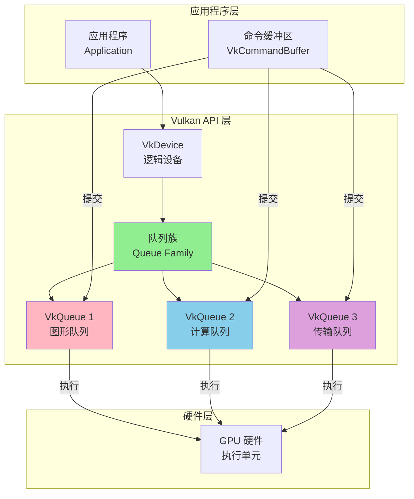

---

## 队列的作用与重要性

### 队列的主要作用

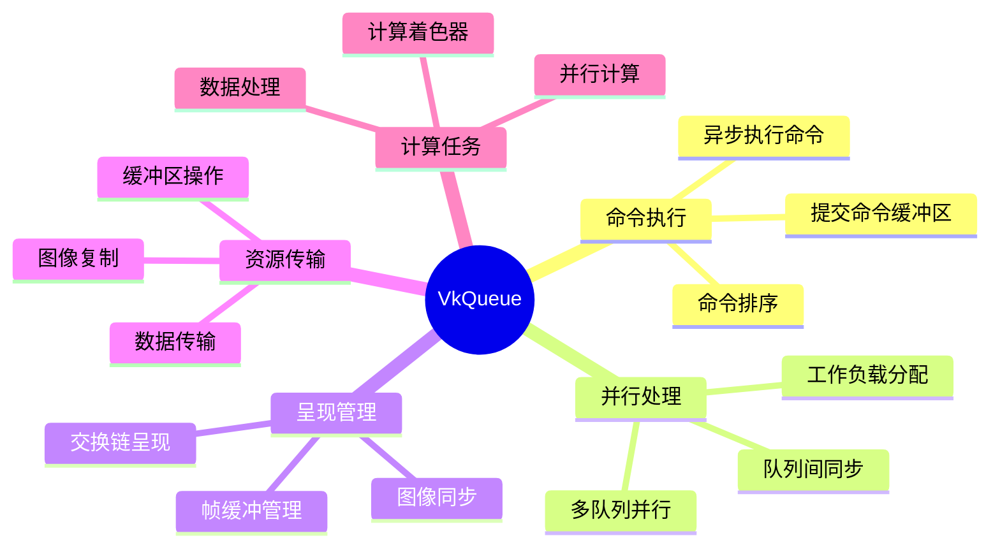

### 队列 vs 命令缓冲区 vs 命令池

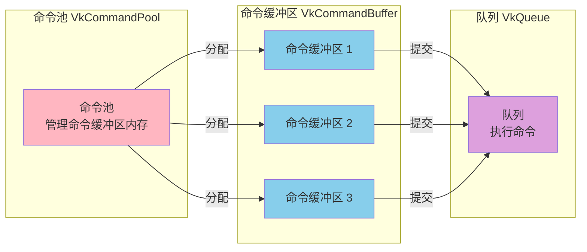

---

## 队列族与队列的关系

### 队列族 (Queue Family) 概念

**队列族**是物理设备上具有相同能力和属性的队列集合。每个队列族可以包含多个队列，这些队列具有相同的功能特性。

### 队列族与队列的关系图

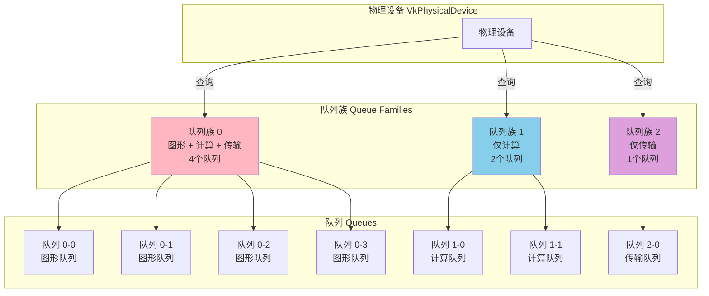

### 队列族属性查询

```cpp
// 查询物理设备的队列族属性
uint32_t queueFamilyCount = 0;
vkGetPhysicalDeviceQueueFamilyProperties(physicalDevice, &queueFamilyCount, nullptr);

std::vector<VkQueueFamilyProperties> queueFamilies(queueFamilyCount);
vkGetPhysicalDeviceQueueFamilyProperties(physicalDevice, &queueFamilyCount, queueFamilies.data());

// 遍历队列族
for (uint32_t i = 0; i < queueFamilyCount; i++) {
    const auto& queueFamily = queueFamilies[i];
    
    // 队列族支持的队列类型
    VkQueueFlags flags = queueFamily.queueFlags;
    
    // 该队列族中可用的队列数量
    uint32_t queueCount = queueFamily.queueCount;
    
    // 时间戳支持
    bool timestampValidBits = queueFamily.timestampValidBits > 0;
    
    // 最小图像传输粒度
    VkExtent3D minImageTransferGranularity = queueFamily.minImageTransferGranularity;
}
```

### VkQueueFamilyProperties 结构

```cpp
typedef struct VkQueueFamilyProperties {
    VkQueueFlags    queueFlags;                    // 队列类型标志
    uint32_t        queueCount;                    // 队列数量
    uint32_t        timestampValidBits;            // 时间戳有效位数
    VkExtent3D      minImageTransferGranularity;   // 最小图像传输粒度
} VkQueueFamilyProperties;
```

---

## 队列类型

### 队列类型标志

Vulkan 支持以下队列类型：

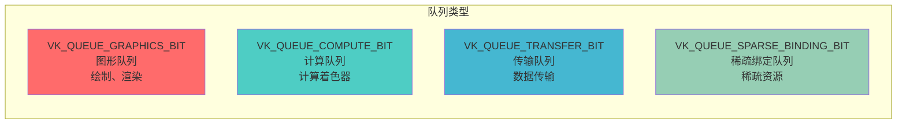

### 1. 图形队列 (Graphics Queue)

**功能**:
- 执行图形渲染命令
- 支持绘制调用（Draw Calls）
- 支持图形管线操作
- 通常也支持计算和传输操作

**使用场景**:
- 渲染三角形和几何体
- 执行图形管线
- 处理顶点和片段着色器

```cpp
// 查找图形队列族
uint32_t graphicsQueueFamilyIndex = UINT32_MAX;
for (uint32_t i = 0; i < queueFamilyCount; i++) {
    if (queueFamilies[i].queueFlags & VK_QUEUE_GRAPHICS_BIT) {
        graphicsQueueFamilyIndex = i;
        break;
    }
}
```

### 2. 计算队列 (Compute Queue)

**功能**:
- 执行计算着色器
- 并行数据处理
- 通常可以独立于图形队列运行

**使用场景**:
- GPU 计算任务
- 物理模拟
- 图像处理
- 机器学习推理

```cpp
// 查找专用计算队列（不包含图形功能）
uint32_t computeQueueFamilyIndex = UINT32_MAX;
for (uint32_t i = 0; i < queueFamilyCount; i++) {
    VkQueueFlags flags = queueFamilies[i].queueFlags;
    if ((flags & VK_QUEUE_COMPUTE_BIT) && 
        !(flags & VK_QUEUE_GRAPHICS_BIT)) {
        computeQueueFamilyIndex = i;
        break;
    }
}
```

### 3. 传输队列 (Transfer Queue)

**功能**:
- 专门用于数据传输操作
- 缓冲区到缓冲区复制
- 图像数据传输
- 通常可以与其他队列并行执行

**使用场景**:
- 上传纹理数据
- 复制缓冲区
- 图像布局转换
- 异步数据传输

```cpp
// 查找专用传输队列
uint32_t transferQueueFamilyIndex = UINT32_MAX;
for (uint32_t i = 0; i < queueFamilyCount; i++) {
    VkQueueFlags flags = queueFamilies[i].queueFlags;
    if ((flags & VK_QUEUE_TRANSFER_BIT) && 
        !(flags & VK_QUEUE_GRAPHICS_BIT) && 
        !(flags & VK_QUEUE_COMPUTE_BIT)) {
        transferQueueFamilyIndex = i;
        break;
    }
}
```

### 4. 稀疏绑定队列 (Sparse Binding Queue)

**功能**:
- 管理稀疏资源
- 部分绑定内存
- 动态更新资源绑定

**使用场景**:
- 大型纹理流式加载
- 虚拟纹理
- 动态资源管理

### 队列类型组合示例

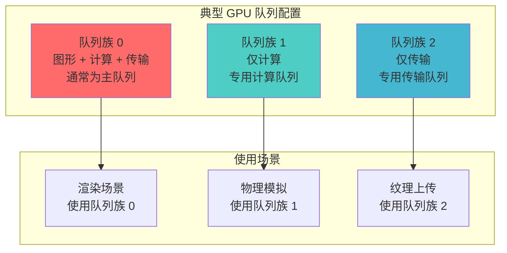

---

## 队列的获取

### 创建逻辑设备时请求队列

在创建逻辑设备时，需要指定要创建的队列：

```cpp
// 准备队列创建信息
std::vector<VkDeviceQueueCreateInfo> queueCreateInfos;

// 图形队列
float queuePriority = 1.0f;
VkDeviceQueueCreateInfo graphicsQueueInfo{};
graphicsQueueInfo.sType = VK_STRUCTURE_TYPE_DEVICE_QUEUE_CREATE_INFO;
graphicsQueueInfo.queueFamilyIndex = graphicsQueueFamilyIndex;
graphicsQueueInfo.queueCount = 1;  // 请求1个队列
graphicsQueueInfo.pQueuePriorities = &queuePriority;  // 队列优先级
queueCreateInfos.push_back(graphicsQueueInfo);

// 计算队列（如果与图形队列不同）
if (computeQueueFamilyIndex != graphicsQueueFamilyIndex) {
    VkDeviceQueueCreateInfo computeQueueInfo{};
    computeQueueInfo.sType = VK_STRUCTURE_TYPE_DEVICE_QUEUE_CREATE_INFO;
    computeQueueInfo.queueFamilyIndex = computeQueueFamilyIndex;
    computeQueueInfo.queueCount = 1;
    computeQueueInfo.pQueuePriorities = &queuePriority;
    queueCreateInfos.push_back(computeQueueInfo);
}

// 创建逻辑设备
VkDeviceCreateInfo deviceInfo{};
deviceInfo.sType = VK_STRUCTURE_TYPE_DEVICE_CREATE_INFO;
deviceInfo.queueCreateInfoCount = static_cast<uint32_t>(queueCreateInfos.size());
deviceInfo.pQueueCreateInfos = queueCreateInfos.data();
// ... 其他设备创建信息

VkDevice device;
vkCreateDevice(physicalDevice, &deviceInfo, nullptr, &device);
```

### 获取队列句柄

创建逻辑设备后，使用 `vkGetDeviceQueue` 获取队列句柄：

```cpp
// 获取图形队列
VkQueue graphicsQueue;
vkGetDeviceQueue(
    device,                      // 逻辑设备
    graphicsQueueFamilyIndex,   // 队列族索引
    0,                          // 队列索引（在该队列族中的索引）
    &graphicsQueue              // 输出的队列句柄
);

// 获取计算队列
VkQueue computeQueue;
vkGetDeviceQueue(
    device,
    computeQueueFamilyIndex,
    0,
    &computeQueue
);
```

### 获取多个队列

如果队列族中有多个队列，可以获取不同的队列：

```cpp
// 假设队列族0有4个队列
VkQueue graphicsQueue0, graphicsQueue1, graphicsQueue2, graphicsQueue3;

vkGetDeviceQueue(device, graphicsQueueFamilyIndex, 0, &graphicsQueue0);
vkGetDeviceQueue(device, graphicsQueueFamilyIndex, 1, &graphicsQueue1);
vkGetDeviceQueue(device, graphicsQueueFamilyIndex, 2, &graphicsQueue2);
vkGetDeviceQueue(device, graphicsQueueFamilyIndex, 3, &graphicsQueue3);
```

### 队列获取流程图

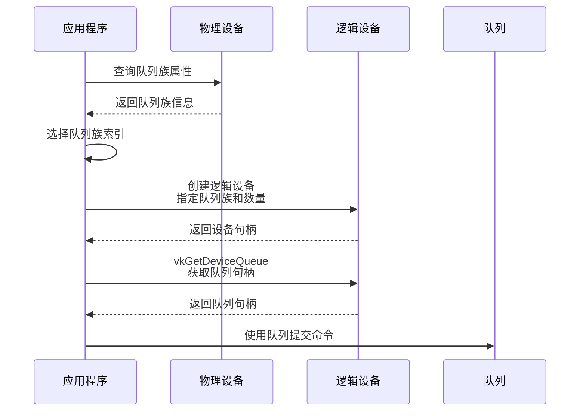

---

## 队列提交 (Queue Submission)

### vkQueueSubmit 函数

`vkQueueSubmit` 是向队列提交命令缓冲区的核心函数：

```cpp
VkResult vkQueueSubmit(
    VkQueue                  queue,              // 目标队列
    uint32_t                 submitCount,       // 提交信息数量
    const VkSubmitInfo*      pSubmits,          // 提交信息数组
    VkFence                  fence              // 可选的栅栏（用于同步）
);
```

### VkSubmitInfo 结构

```cpp
typedef struct VkSubmitInfo {
    VkStructureType                sType;                  // 结构体类型
    const void*                    pNext;                  // 扩展链
    uint32_t                       waitSemaphoreCount;     // 等待信号量数量
    const VkSemaphore*             pWaitSemaphores;        // 等待信号量数组
    const VkPipelineStageFlags*    pWaitDstStageMask;      // 等待阶段掩码
    uint32_t                       commandBufferCount;     // 命令缓冲区数量
    const VkCommandBuffer*         pCommandBuffers;        // 命令缓冲区数组
    uint32_t                       signalSemaphoreCount;   // 信号信号量数量
    const VkSemaphore*             pSignalSemaphores;      // 信号信号量数组
} VkSubmitInfo;
```

### 基本提交示例

```cpp
// 简单的命令缓冲区提交
VkSubmitInfo submitInfo{};
submitInfo.sType = VK_STRUCTURE_TYPE_SUBMIT_INFO;
submitInfo.commandBufferCount = 1;
submitInfo.pCommandBuffers = &commandBuffer;

VkResult result = vkQueueSubmit(graphicsQueue, 1, &submitInfo, VK_NULL_HANDLE);
```

### 带同步的提交示例

```cpp
// 等待信号量，执行命令，然后发出信号
VkPipelineStageFlags waitStage = VK_PIPELINE_STAGE_COLOR_ATTACHMENT_OUTPUT_BIT;

VkSubmitInfo submitInfo{};
submitInfo.sType = VK_STRUCTURE_TYPE_SUBMIT_INFO;
submitInfo.waitSemaphoreCount = 1;
submitInfo.pWaitSemaphores = &imageAvailableSemaphore;      // 等待图像可用
submitInfo.pWaitDstStageMask = &waitStage;                  // 在颜色附件输出阶段等待
submitInfo.commandBufferCount = 1;
submitInfo.pCommandBuffers = &commandBuffer;
submitInfo.signalSemaphoreCount = 1;
submitInfo.pSignalSemaphores = &renderFinishedSemaphore;    // 渲染完成后发出信号

VkFence fence;  // 可选：用于等待提交完成
vkQueueSubmit(graphicsQueue, 1, &submitInfo, fence);
```

### 多命令缓冲区提交

```cpp
// 提交多个命令缓冲区
std::vector<VkCommandBuffer> commandBuffers = {
    cmdBuffer1, cmdBuffer2, cmdBuffer3
};

VkSubmitInfo submitInfo{};
submitInfo.sType = VK_STRUCTURE_TYPE_SUBMIT_INFO;
submitInfo.commandBufferCount = static_cast<uint32_t>(commandBuffers.size());
submitInfo.pCommandBuffers = commandBuffers.data();

vkQueueSubmit(graphicsQueue, 1, &submitInfo, VK_NULL_HANDLE);
```

### 多次提交

```cpp
// 多次提交到同一队列
std::vector<VkSubmitInfo> submits;

// 第一次提交
VkSubmitInfo submit1{};
submit1.sType = VK_STRUCTURE_TYPE_SUBMIT_INFO;
submit1.commandBufferCount = 1;
submit1.pCommandBuffers = &cmdBuffer1;
submits.push_back(submit1);

// 第二次提交
VkSubmitInfo submit2{};
submit2.sType = VK_STRUCTURE_TYPE_SUBMIT_INFO;
submit2.waitSemaphoreCount = 1;
submit2.pWaitSemaphores = &semaphore;
submit2.commandBufferCount = 1;
submit2.pCommandBuffers = &cmdBuffer2;
submits.push_back(submit2);

vkQueueSubmit(graphicsQueue, submits.size(), submits.data(), fence);
```

### 队列提交流程图

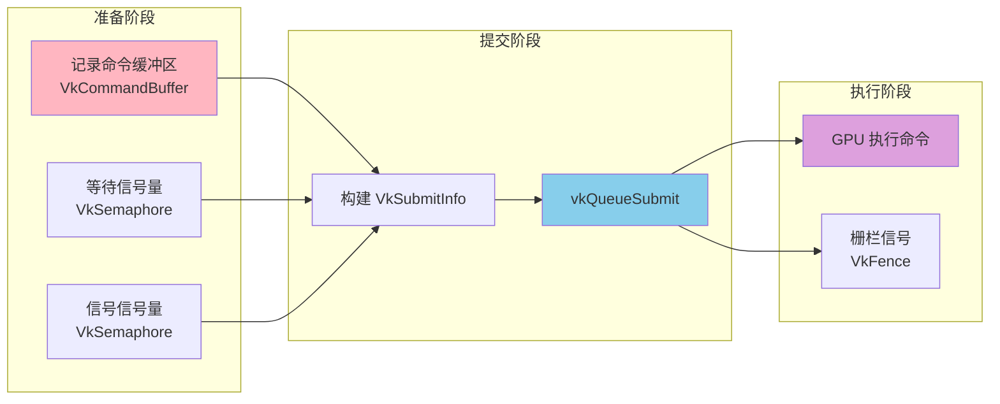

---

## 队列呈现 (Queue Presentation)

### vkQueuePresentKHR 函数

`vkQueuePresentKHR` 用于将交换链图像呈现到屏幕：

```cpp
VkResult vkQueuePresentKHR(
    VkQueue                 queue,              // 呈现队列
    const VkPresentInfoKHR* pPresentInfo        // 呈现信息
);
```

### VkPresentInfoKHR 结构

```cpp
typedef struct VkPresentInfoKHR {
    VkStructureType          sType;              // 结构体类型
    const void*             pNext;              // 扩展链
    uint32_t                waitSemaphoreCount; // 等待信号量数量
    const VkSemaphore*      pWaitSemaphores;    // 等待信号量（等待渲染完成）
    uint32_t                swapchainCount;     // 交换链数量
    const VkSwapchainKHR*   pSwapchains;        // 交换链数组
    const uint32_t*         pImageIndices;      // 图像索引数组
    VkResult*               pResults;           // 可选：每个交换链的结果
} VkPresentInfoKHR;
```

### 呈现示例

```cpp
// 等待渲染完成信号量
VkPresentInfoKHR presentInfo{};
presentInfo.sType = VK_STRUCTURE_TYPE_PRESENT_INFO_KHR;
presentInfo.waitSemaphoreCount = 1;
presentInfo.pWaitSemaphores = &renderFinishedSemaphore;  // 等待渲染完成
presentInfo.swapchainCount = 1;
presentInfo.pSwapchains = &swapchain;
presentInfo.pImageIndices = &imageIndex;  // 要呈现的图像索引

VkResult result = vkQueuePresentKHR(presentQueue, &presentInfo);

// 检查结果
if (result == VK_ERROR_OUT_OF_DATE_KHR || result == VK_SUBOPTIMAL_KHR) {
    // 需要重新创建交换链
    recreateSwapchain();
} else if (result != VK_SUCCESS) {
    throw std::runtime_error("failed to present swap chain image!");
}
```

### 完整的渲染循环

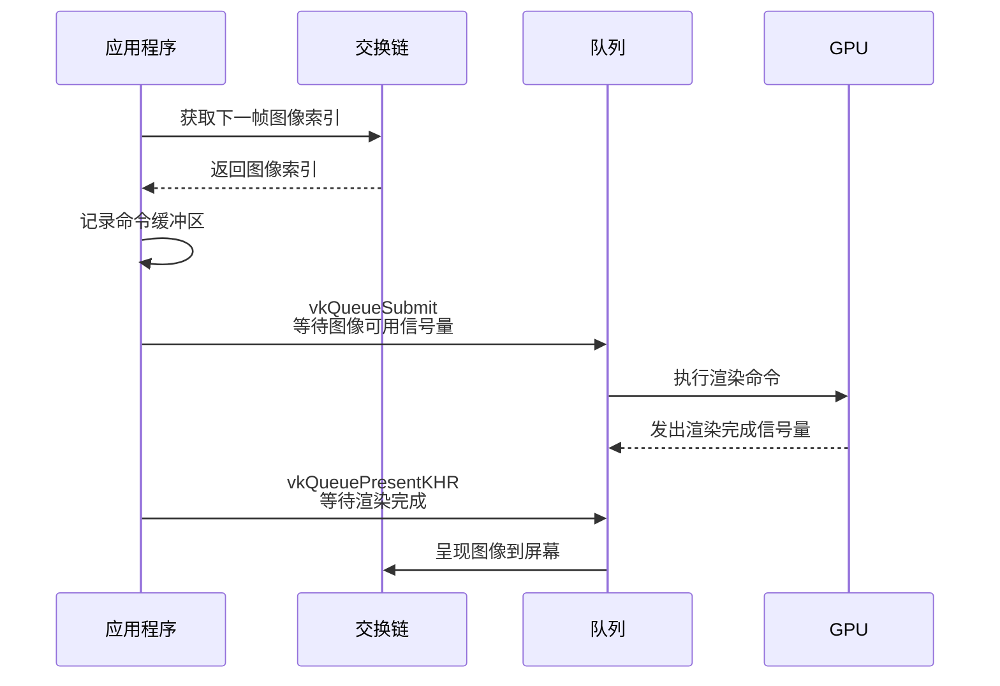

---

## 队列同步

### 同步原语类型

Vulkan 提供了多种同步原语用于队列同步：

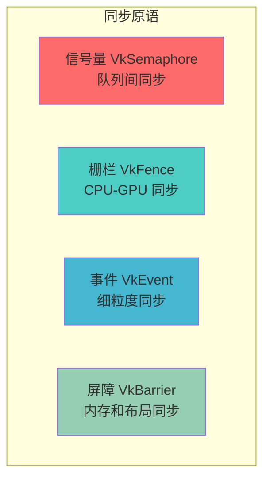

### 1. 信号量 (Semaphore)

**用途**: 队列间同步，GPU 内部同步

```cpp
// 创建信号量
VkSemaphoreCreateInfo semaphoreInfo{};
semaphoreInfo.sType = VK_STRUCTURE_TYPE_SEMAPHORE_CREATE_INFO;

VkSemaphore imageAvailableSemaphore;
VkSemaphore renderFinishedSemaphore;
vkCreateSemaphore(device, &semaphoreInfo, nullptr, &imageAvailableSemaphore);
vkCreateSemaphore(device, &semaphoreInfo, nullptr, &renderFinishedSemaphore);

// 在提交中使用
VkSubmitInfo submitInfo{};
submitInfo.waitSemaphoreCount = 1;
submitInfo.pWaitSemaphores = &imageAvailableSemaphore;  // 等待
submitInfo.signalSemaphoreCount = 1;
submitInfo.pSignalSemaphores = &renderFinishedSemaphore;  // 发出信号
```

### 2. 栅栏 (Fence)

**用途**: CPU-GPU 同步，等待 GPU 完成工作

```cpp
// 创建栅栏
VkFenceCreateInfo fenceInfo{};
fenceInfo.sType = VK_STRUCTURE_TYPE_FENCE_CREATE_INFO;
fenceInfo.flags = VK_FENCE_CREATE_SIGNALED_BIT;  // 初始状态为已发出信号

VkFence fence;
vkCreateFence(device, &fenceInfo, nullptr, &fence);

// 提交时使用栅栏
vkQueueSubmit(queue, 1, &submitInfo, fence);

// CPU 等待 GPU 完成
vkWaitForFences(device, 1, &fence, VK_TRUE, UINT64_MAX);
vkResetFences(device, 1, &fence);  // 重置栅栏
```

### 3. 多队列同步示例

```cpp
// 图形队列提交
VkSubmitInfo graphicsSubmit{};
graphicsSubmit.commandBufferCount = 1;
graphicsSubmit.pCommandBuffers = &graphicsCmdBuffer;
graphicsSubmit.signalSemaphoreCount = 1;
graphicsSubmit.pSignalSemaphores = &graphicsFinishedSemaphore;

vkQueueSubmit(graphicsQueue, 1, &graphicsSubmit, VK_NULL_HANDLE);

// 计算队列等待图形队列完成
VkPipelineStageFlags waitStage = VK_PIPELINE_STAGE_COMPUTE_SHADER_BIT;
VkSubmitInfo computeSubmit{};
computeSubmit.waitSemaphoreCount = 1;
computeSubmit.pWaitSemaphores = &graphicsFinishedSemaphore;
computeSubmit.pWaitDstStageMask = &waitStage;
computeSubmit.commandBufferCount = 1;
computeSubmit.pCommandBuffers = &computeCmdBuffer;

vkQueueSubmit(computeQueue, 1, &computeSubmit, VK_NULL_HANDLE);
```

### 同步流程图


---

## 队列优先级

### 队列优先级概念

队列优先级用于影响 GPU 调度器对不同队列的调度顺序。优先级范围是 0.0 到 1.0，数值越高优先级越高。

### 设置队列优先级

```cpp
// 在创建逻辑设备时设置队列优先级
std::vector<float> queuePriorities = {1.0f, 0.5f};  // 高优先级和低优先级

VkDeviceQueueCreateInfo queueInfo{};
queueInfo.sType = VK_STRUCTURE_TYPE_DEVICE_QUEUE_CREATE_INFO;
queueInfo.queueFamilyIndex = graphicsQueueFamilyIndex;
queueInfo.queueCount = 2;  // 创建2个队列
queueInfo.pQueuePriorities = queuePriorities.data();  // 设置优先级

VkDeviceCreateInfo deviceInfo{};
deviceInfo.pQueueCreateInfos = &queueInfo;
// ... 其他信息
vkCreateDevice(physicalDevice, &deviceInfo, nullptr, &device);

// 获取不同优先级的队列
VkQueue highPriorityQueue;
VkQueue lowPriorityQueue;
vkGetDeviceQueue(device, graphicsQueueFamilyIndex, 0, &highPriorityQueue);   // 优先级 1.0
vkGetDeviceQueue(device, graphicsQueueFamilyIndex, 1, &lowPriorityQueue);      // 优先级 0.5
```

### 优先级使用场景

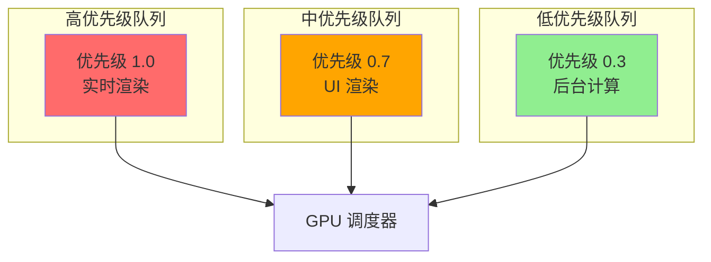

---

## 队列等待与空闲

### vkQueueWaitIdle

`vkQueueWaitIdle` 用于等待队列中的所有操作完成：

```cpp
// 等待队列空闲（所有提交的命令执行完成）
VkResult result = vkQueueWaitIdle(graphicsQueue);
if (result != VkResult::VK_SUCCESS) {
    // 处理错误
}
```

**使用场景**:
- 清理资源前确保所有操作完成
- 调试时确保命令执行完成
- 应用程序退出前清理

**注意**: 这是一个阻塞调用，会等待 GPU 完成所有工作，通常应避免在性能关键路径中使用。

### vkDeviceWaitIdle

等待设备上所有队列空闲：

```cpp
// 等待设备上所有队列空闲
vkDeviceWaitIdle(device);
```

### 等待时机

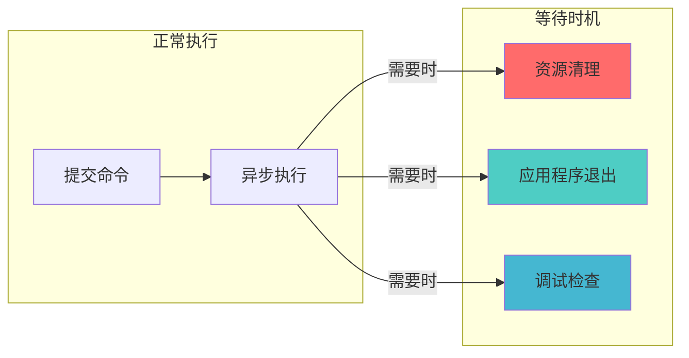

---

## 实际代码示例

### 示例 1: 基本队列使用

```cpp
class VulkanRenderer {
private:
    VkDevice device;
    VkQueue graphicsQueue;
    VkQueue computeQueue;
    VkQueue presentQueue;
    uint32_t graphicsQueueFamilyIndex;
    uint32_t presentQueueFamilyIndex;
    
public:
    void initQueues(VkPhysicalDevice physicalDevice) {
        // 查询队列族
        uint32_t queueFamilyCount = 0;
        vkGetPhysicalDeviceQueueFamilyProperties(physicalDevice, &queueFamilyCount, nullptr);
        
        std::vector<VkQueueFamilyProperties> queueFamilies(queueFamilyCount);
        vkGetPhysicalDeviceQueueFamilyProperties(physicalDevice, &queueFamilyCount, queueFamilies.data());
        
        // 查找图形队列族
        for (uint32_t i = 0; i < queueFamilyCount; i++) {
            if (queueFamilies[i].queueFlags & VK_QUEUE_GRAPHICS_BIT) {
                graphicsQueueFamilyIndex = i;
                break;
            }
        }
        
        // 查找呈现队列族（需要支持表面呈现）
        // ... 检查 vkGetPhysicalDeviceSurfaceSupportKHR
        
        // 创建逻辑设备时请求队列
        float queuePriority = 1.0f;
        VkDeviceQueueCreateInfo queueCreateInfo{};
        queueCreateInfo.sType = VK_STRUCTURE_TYPE_DEVICE_QUEUE_CREATE_INFO;
        queueCreateInfo.queueFamilyIndex = graphicsQueueFamilyIndex;
        queueCreateInfo.queueCount = 1;
        queueCreateInfo.pQueuePriorities = &queuePriority;
        
        VkDeviceCreateInfo deviceCreateInfo{};
        deviceCreateInfo.sType = VK_STRUCTURE_TYPE_DEVICE_CREATE_INFO;
        deviceCreateInfo.queueCreateInfoCount = 1;
        deviceCreateInfo.pQueueCreateInfos = &queueCreateInfo;
        // ... 其他设备创建信息
        
        vkCreateDevice(physicalDevice, &deviceCreateInfo, nullptr, &device);
        
        // 获取队列句柄
        vkGetDeviceQueue(device, graphicsQueueFamilyIndex, 0, &graphicsQueue);
        vkGetDeviceQueue(device, presentQueueFamilyIndex, 0, &presentQueue);
    }
    
    void submitFrame(VkCommandBuffer commandBuffer, 
                     VkSemaphore waitSemaphore, 
                     VkSemaphore signalSemaphore,
                     VkFence fence) {
        VkPipelineStageFlags waitStage = VK_PIPELINE_STAGE_COLOR_ATTACHMENT_OUTPUT_BIT;
        
        VkSubmitInfo submitInfo{};
        submitInfo.sType = VK_STRUCTURE_TYPE_SUBMIT_INFO;
        submitInfo.waitSemaphoreCount = 1;
        submitInfo.pWaitSemaphores = &waitSemaphore;
        submitInfo.pWaitDstStageMask = &waitStage;
        submitInfo.commandBufferCount = 1;
        submitInfo.pCommandBuffers = &commandBuffer;
        submitInfo.signalSemaphoreCount = 1;
        submitInfo.pSignalSemaphores = &signalSemaphore;
        
        vkQueueSubmit(graphicsQueue, 1, &submitInfo, fence);
    }
    
    void presentFrame(VkSwapchainKHR swapchain, 
                      uint32_t imageIndex, 
                      VkSemaphore waitSemaphore) {
        VkPresentInfoKHR presentInfo{};
        presentInfo.sType = VK_STRUCTURE_TYPE_PRESENT_INFO_KHR;
        presentInfo.waitSemaphoreCount = 1;
        presentInfo.pWaitSemaphores = &waitSemaphore;
        presentInfo.swapchainCount = 1;
        presentInfo.pSwapchains = &swapchain;
        presentInfo.pImageIndices = &imageIndex;
        
        vkQueuePresentKHR(presentQueue, &presentInfo);
    }
};
```

### 示例 2: 多队列并行处理

```cpp
class MultiQueueRenderer {
private:
    VkQueue graphicsQueue;
    VkQueue computeQueue;
    VkQueue transferQueue;
    
    VkSemaphore graphicsToComputeSemaphore;
    VkSemaphore computeToGraphicsSemaphore;
    
public:
    void renderFrame() {
        // 1. 图形队列：渲染场景
        VkSubmitInfo graphicsSubmit{};
        graphicsSubmit.sType = VK_STRUCTURE_TYPE_SUBMIT_INFO;
        graphicsSubmit.commandBufferCount = 1;
        graphicsSubmit.pCommandBuffers = &graphicsCmdBuffer;
        graphicsSubmit.signalSemaphoreCount = 1;
        graphicsSubmit.pSignalSemaphores = &graphicsToComputeSemaphore;
        
        vkQueueSubmit(graphicsQueue, 1, &graphicsSubmit, VK_NULL_HANDLE);
        
        // 2. 计算队列：并行执行物理模拟（等待图形队列完成）
        VkPipelineStageFlags waitStage = VK_PIPELINE_STAGE_COMPUTE_SHADER_BIT;
        VkSubmitInfo computeSubmit{};
        computeSubmit.sType = VK_STRUCTURE_TYPE_SUBMIT_INFO;
        computeSubmit.waitSemaphoreCount = 1;
        computeSubmit.pWaitSemaphores = &graphicsToComputeSemaphore;
        computeSubmit.pWaitDstStageMask = &waitStage;
        computeSubmit.commandBufferCount = 1;
        computeSubmit.pCommandBuffers = &computeCmdBuffer;
        computeSubmit.signalSemaphoreCount = 1;
        computeSubmit.pSignalSemaphores = &computeToGraphicsSemaphore;
        
        vkQueueSubmit(computeQueue, 1, &computeSubmit, VK_NULL_HANDLE);
        
        // 3. 传输队列：异步上传纹理（独立执行）
        VkSubmitInfo transferSubmit{};
        transferSubmit.sType = VK_STRUCTURE_TYPE_SUBMIT_INFO;
        transferSubmit.commandBufferCount = 1;
        transferSubmit.pCommandBuffers = &transferCmdBuffer;
        
        vkQueueSubmit(transferQueue, 1, &transferSubmit, VK_NULL_HANDLE);
    }
};
```

### 示例 3: 完整的渲染循环

```cpp
void renderLoop() {
    while (!shouldClose) {
        // 1. 获取交换链图像
        uint32_t imageIndex;
        vkAcquireNextImageKHR(device, swapchain, UINT64_MAX, 
                              imageAvailableSemaphores[currentFrame], 
                              VK_NULL_HANDLE, &imageIndex);
        
        // 2. 重置栅栏
        vkWaitForFences(device, 1, &inFlightFences[currentFrame], 
                       VK_TRUE, UINT64_MAX);
        vkResetFences(device, 1, &inFlightFences[currentFrame]);
        
        // 3. 记录命令缓冲区
        vkResetCommandBuffer(commandBuffers[currentFrame], 0);
        recordCommandBuffer(commandBuffers[currentFrame], imageIndex);
        
        // 4. 提交到图形队列
        VkPipelineStageFlags waitStages[] = {
            VK_PIPELINE_STAGE_COLOR_ATTACHMENT_OUTPUT_BIT
        };
        
        VkSubmitInfo submitInfo{};
        submitInfo.sType = VK_STRUCTURE_TYPE_SUBMIT_INFO;
        submitInfo.waitSemaphoreCount = 1;
        submitInfo.pWaitSemaphores = &imageAvailableSemaphores[currentFrame];
        submitInfo.pWaitDstStageMask = waitStages;
        submitInfo.commandBufferCount = 1;
        submitInfo.pCommandBuffers = &commandBuffers[currentFrame];
        submitInfo.signalSemaphoreCount = 1;
        submitInfo.pSignalSemaphores = &renderFinishedSemaphores[currentFrame];
        
        vkQueueSubmit(graphicsQueue, 1, &submitInfo, 
                     inFlightFences[currentFrame]);
        
        // 5. 呈现图像
        VkPresentInfoKHR presentInfo{};
        presentInfo.sType = VK_STRUCTURE_TYPE_PRESENT_INFO_KHR;
        presentInfo.waitSemaphoreCount = 1;
        presentInfo.pWaitSemaphores = &renderFinishedSemaphores[currentFrame];
        presentInfo.swapchainCount = 1;
        presentInfo.pSwapchains = &swapchain;
        presentInfo.pImageIndices = &imageIndex;
        
        VkResult result = vkQueuePresentKHR(presentQueue, &presentInfo);
        
        if (result == VK_ERROR_OUT_OF_DATE_KHR || result == VK_SUBOPTIMAL_KHR) {
            recreateSwapchain();
        }
        
        // 6. 移动到下一帧
        currentFrame = (currentFrame + 1) % MAX_FRAMES_IN_FLIGHT;
    }
    
    // 等待所有操作完成
    vkDeviceWaitIdle(device);
}
```

---

## 最佳实践

### 1. 队列选择策略

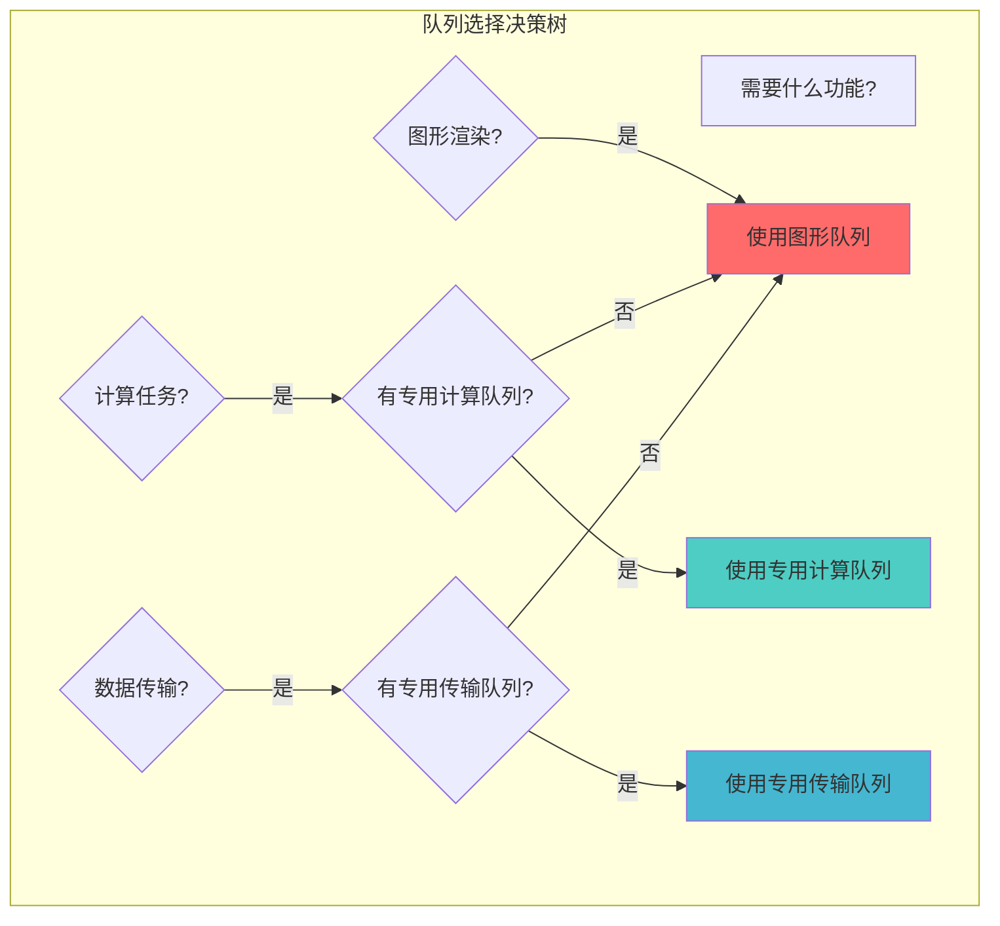

**建议**:
- 优先使用专用队列（如果可用）以提高并行性
- 图形队列通常也支持计算和传输，可以作为通用队列
- 对于大量数据传输，专用传输队列可能更高效

### 2. 同步最佳实践

**DO**:
- ✅ 使用信号量进行队列间同步
- ✅ 使用栅栏等待 GPU 完成工作（仅在必要时）
- ✅ 正确设置等待阶段掩码
- ✅ 为每帧使用独立的同步对象

**DON'T**:
- ❌ 避免在渲染循环中频繁调用 `vkQueueWaitIdle`
- ❌ 不要忘记重置栅栏
- ❌ 不要在同一帧中重用信号量
- ❌ 避免不必要的同步

### 3. 性能优化建议

```cpp
// ✅ 好的做法：使用多个命令缓冲区并行记录
std::vector<VkCommandBuffer> cmdBuffers;
// ... 并行记录多个命令缓冲区
vkQueueSubmit(queue, cmdBuffers.size(), submitInfos.data(), fence);

// ❌ 不好的做法：逐个提交
for (auto& cmdBuffer : cmdBuffers) {
    VkSubmitInfo submitInfo{};
    submitInfo.commandBufferCount = 1;
    submitInfo.pCommandBuffers = &cmdBuffer;
    vkQueueSubmit(queue, 1, &submitInfo, VK_NULL_HANDLE);  // 多次提交
}
```

### 4. 线程安全

**VkQueue 操作是线程安全的**:
- 可以从多个线程同时调用 `vkQueueSubmit`
- 可以从多个线程同时调用 `vkQueuePresentKHR`
- 可以从多个线程同时调用 `vkQueueWaitIdle`

**但是**:
- 命令缓冲区的记录不是线程安全的
- 应该使用每线程的命令池和命令缓冲区

### 5. 错误处理

```cpp
// 检查队列提交结果
VkResult result = vkQueueSubmit(queue, 1, &submitInfo, fence);
if (result != VK_SUCCESS) {
    // 处理错误
    if (result == VK_ERROR_DEVICE_LOST) {
        // 设备丢失，需要重新初始化
        handleDeviceLost();
    }
}

// 检查呈现结果
result = vkQueuePresentKHR(presentQueue, &presentInfo);
if (result == VK_ERROR_OUT_OF_DATE_KHR || result == VK_SUBOPTIMAL_KHR) {
    // 交换链需要重新创建
    recreateSwapchain();
} else if (result != VK_SUCCESS) {
    throw std::runtime_error("failed to present swap chain image!");
}
```

### 6. 资源清理顺序

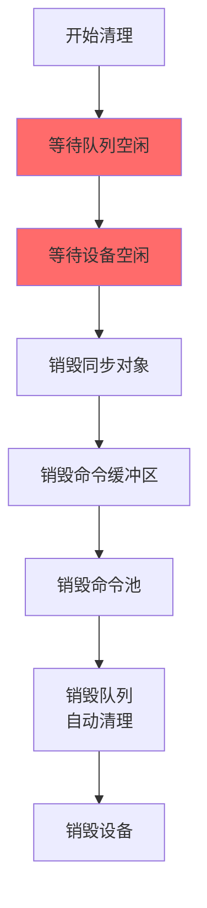

**清理顺序**:
1. 等待所有队列空闲
2. 销毁同步对象（信号量、栅栏）
3. 释放命令缓冲区
4. 销毁命令池
5. 队列会自动随设备销毁
6. 最后销毁设备

### 7. 常见陷阱

| 陷阱 | 问题 | 解决方案 |
|------|------|----------|
| 忘记等待信号量 | 命令在资源准备好之前执行 | 正确设置等待信号量和阶段掩码 |
| 重用信号量 | 同步失效 | 为每帧使用独立的信号量 |
| 忘记重置栅栏 | 栅栏一直处于信号状态 | 在等待后重置栅栏 |
| 频繁等待空闲 | 性能下降 | 使用信号量和栅栏，避免阻塞等待 |
| 错误的队列族索引 | 命令提交失败 | 验证队列族索引和队列类型 |

---

## 总结

### VkQueue 关键要点

1. **队列是命令执行的单元**: 所有 GPU 命令都通过队列提交和执行
2. **队列属于队列族**: 每个队列都属于一个队列族，具有特定的能力
3. **支持多种队列类型**: 图形、计算、传输、稀疏绑定等
4. **异步执行**: 提交是异步的，立即返回
5. **线程安全**: 队列操作可以从多个线程安全调用
6. **需要同步**: 使用信号量和栅栏进行同步
7. **优先级支持**: 可以设置队列优先级影响调度

### 队列使用流程


### 进一步学习

- 深入了解命令缓冲区和命令池
- 学习 Vulkan 同步机制
- 研究多队列并行处理
- 探索队列优先级和性能优化

---

**文档版本**: 1.0  
**最后更新**: 2024  
**相关文档**: 
- [VkPhysicalDevice 详细分析](./VkPhysicalDevice详细分析.md)
- [VkInstance 详细分析](./VkInstance详细分析.md)
- [Vulkan 扩展详细分析](./Vulkan扩展详细分析.md)

