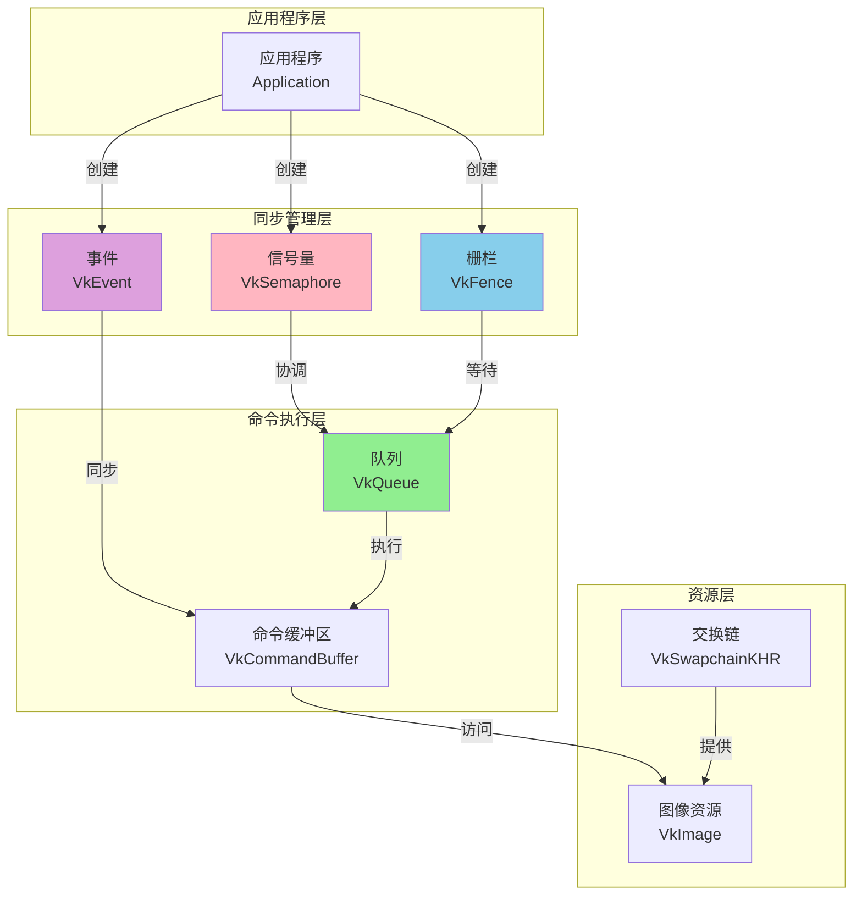
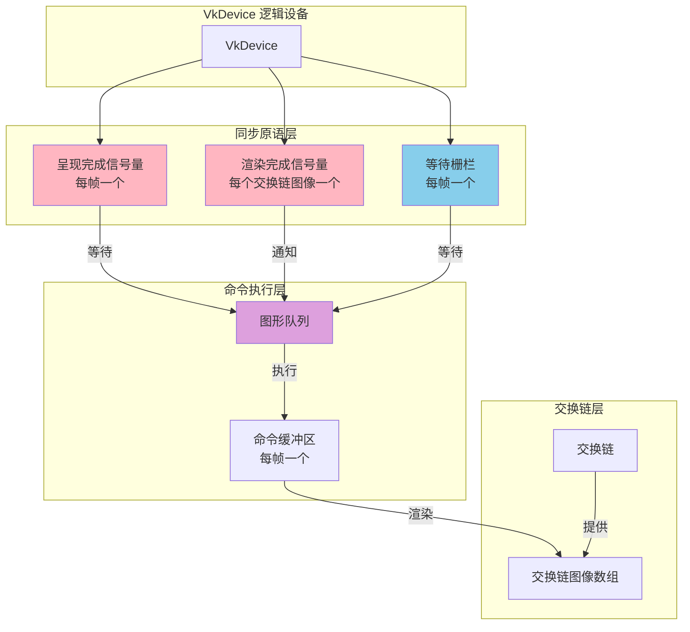
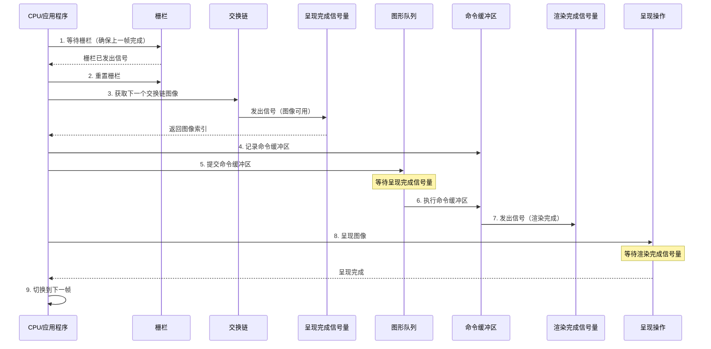
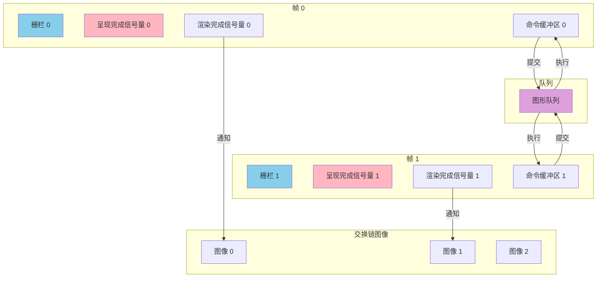
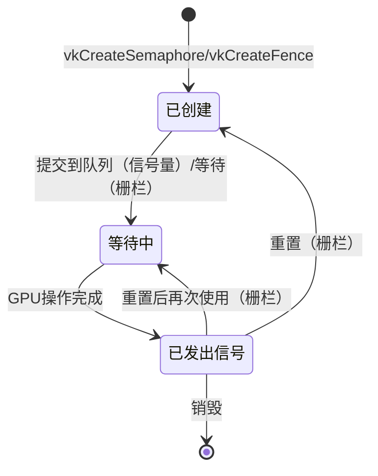
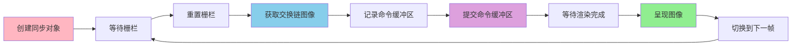

# Vulkan 同步管理架构设计文档

## 目录
1. [同步管理架构概述](#同步管理架构概述)
2. [架构组件](#架构组件)
3. [同步管理流程](#同步管理流程)
4. [同步原语类型](#同步原语类型)
5. [多帧并发同步](#多帧并发同步)
6. [同步生命周期](#同步生命周期)
7. [架构设计模式](#架构设计模式)
8. [性能优化策略](#性能优化策略)
9. [实际架构示例](#实际架构示例)
10. [最佳实践](#最佳实践)

---

## 同步管理架构概述

### 什么是同步管理架构？

Vulkan 同步管理架构是用于协调 CPU 和 GPU 之间、GPU 内部不同操作之间的执行顺序和资源访问的完整系统。它由信号量（Semaphore）、栅栏（Fence）、事件（Event）等同步原语组成，确保渲染流程的正确性和资源访问的安全性。

### 同步管理架构的核心特点

- **显式同步**: 所有同步操作都需要显式管理，没有隐式同步
- **异步执行**: GPU 操作是异步的，需要同步原语来协调
- **多帧并发**: 支持多帧同时进行，提高 GPU 利用率
- **资源保护**: 确保资源在正确的时间被访问
- **性能优化**: 通过合理的同步策略最大化性能

### 同步管理架构在 Vulkan 中的位置

---

## 架构组件

### 组件层次结构

### 组件职责

#### 1. VkSemaphore（信号量）

**职责**:
- 协调队列内的操作顺序
- 确保命令在正确的时机执行
- 在 GPU 内部不同操作之间同步

**特点**:
- 只能在 GPU 内部使用
- 不能从 CPU 查询状态
- 用于队列提交和呈现操作

**在 triangle.cpp 中的使用**:
- **呈现完成信号量** (`presentCompleteSemaphores`): 每帧一个，用于等待交换链图像可用
- **渲染完成信号量** (`renderCompleteSemaphores`): 每个交换链图像一个，用于通知渲染完成

#### 2. VkFence（栅栏）

**职责**:
- 在 CPU 和 GPU 之间同步
- 检查命令缓冲区执行完成
- 确保资源可以安全重用

**特点**:
- 可以从 CPU 查询状态
- 可以等待完成
- 用于命令缓冲区重用保护

**在 triangle.cpp 中的使用**:
- **等待栅栏** (`waitFences`): 每帧一个，用于确保命令缓冲区在重用前已完成执行

#### 3. VkEvent（事件）

**职责**:
- 在命令缓冲区内部同步
- 精确控制执行顺序
- 在特定管道阶段同步

**特点**:
- 可以在命令缓冲区中设置和等待
- 提供细粒度控制
- 用于复杂同步场景

**注意**: triangle.cpp 示例中未使用事件，但它是同步系统的重要组成部分

---

## 同步管理流程

### 完整同步流程（基于 triangle.cpp）

### 详细流程步骤

#### 步骤 1-2: 栅栏等待和重置

**目的**: 确保当前帧的命令缓冲区已完成执行，可以安全重用

**流程**:
1. CPU 等待当前帧的栅栏发出信号
2. 栅栏发出信号表示命令缓冲区已完成执行
3. CPU 重置栅栏，准备下一帧使用

**关键点**:
- 栅栏在创建时设置为已发出信号状态（`VK_FENCE_CREATE_SIGNALED_BIT`）
- 这确保第一帧不需要等待
- 栅栏在命令缓冲区提交时自动重置

#### 步骤 3: 获取交换链图像

**目的**: 从交换链获取可用于渲染的图像

**流程**:
1. CPU 调用 `vkAcquireNextImageKHR` 获取下一个交换链图像
2. 指定呈现完成信号量，等待图像可用
3. 交换链在图像可用时发出信号
4. 返回图像索引

**关键点**:
- 使用呈现完成信号量确保图像已准备好
- 图像索引可能不是按顺序的
- 必须使用获取函数，不能自己循环索引

#### 步骤 4: 记录命令缓冲区

**目的**: 记录当前帧的渲染命令

**流程**:
1. 重置命令缓冲区
2. 开始记录命令
3. 记录渲染命令（绑定资源、绘制等）
4. 结束记录

**关键点**:
- 命令缓冲区在记录前必须重置
- 记录是 CPU 操作，不涉及同步
- 命令缓冲区状态变为可执行

#### 步骤 5: 提交命令缓冲区

**目的**: 将命令缓冲区提交到队列执行

**流程**:
1. 设置等待信号量（呈现完成信号量）
2. 设置等待阶段（颜色附件输出阶段）
3. 设置信号信号量（渲染完成信号量）
4. 提交到队列，关联栅栏

**关键点**:
- 等待呈现完成信号量确保图像可用
- 等待阶段指定在哪个管道阶段等待
- 渲染完成信号量在命令执行完成后发出信号
- 栅栏在命令执行完成后发出信号

#### 步骤 6-7: 命令执行和信号发出

**目的**: GPU 执行命令并发出完成信号

**流程**:
1. GPU 在等待阶段等待呈现完成信号量
2. 图像可用后，开始执行命令缓冲区
3. 命令执行完成后，发出渲染完成信号量
4. 栅栏也发出信号

**关键点**:
- 执行是异步的，立即返回
- 信号量在 GPU 内部自动管理
- 栅栏状态可以从 CPU 查询

#### 步骤 8: 呈现图像

**目的**: 将渲染完成的图像呈现到屏幕

**流程**:
1. CPU 调用 `vkQueuePresentKHR` 呈现图像
2. 指定等待信号量（渲染完成信号量）
3. 等待渲染完成后呈现图像
4. 呈现完成后，图像可以再次被获取

**关键点**:
- 必须等待渲染完成信号量
- 确保图像已完全渲染
- 呈现后图像可以再次用于渲染

#### 步骤 9: 帧切换

**目的**: 切换到下一帧，准备下一轮渲染

**流程**:
1. 更新当前帧索引
2. 循环使用同步对象（帧重叠）
3. 准备下一帧的渲染

**关键点**:
- 使用模运算循环帧索引
- 每帧使用对应的同步对象
- 实现多帧并发渲染

---

## 同步原语类型

### 信号量（Semaphore）

**用途**:
- 队列内操作同步
- 交换链操作同步
- GPU 内部操作协调

**特点**:
- 只能在 GPU 内部使用
- 自动管理状态
- 不能从 CPU 查询

**使用场景**:
- 等待交换链图像可用
- 等待渲染完成
- 协调多个队列操作

### 栅栏（Fence）

**用途**:
- CPU 和 GPU 同步
- 命令缓冲区完成检查
- 资源重用保护

**特点**:
- 可以从 CPU 查询状态
- 可以等待完成
- 用于资源保护

**使用场景**:
- 等待命令缓冲区完成
- 确保资源可以重用
- 多帧并发控制

### 事件（Event）

**用途**:
- 命令缓冲区内部同步
- 精确执行顺序控制
- 管道阶段同步

**特点**:
- 可以在命令缓冲区中设置和等待
- 提供细粒度控制
- 用于复杂同步场景

**使用场景**:
- 命令缓冲区内部同步
- 精确控制执行顺序
- 复杂渲染流程控制

---

## 多帧并发同步

### 多帧并发架构

### 多帧并发策略

#### 策略 1: 每帧独立同步对象

**特点**:
- 每帧有独立的栅栏和呈现完成信号量
- 渲染完成信号量按交换链图像数量分配
- 实现帧重叠，提高 GPU 利用率

**优势**:
- 简单清晰
- 易于管理
- 性能优化

**在 triangle.cpp 中的实现**:
- `MAX_CONCURRENT_FRAMES = 2`: 最多 2 帧并发
- 每帧一个栅栏和呈现完成信号量
- 每个交换链图像一个渲染完成信号量

#### 策略 2: 帧索引循环

**特点**:
- 使用模运算循环帧索引
- 每帧使用对应的同步对象
- 实现帧重叠渲染

**优势**:
- 资源高效利用
- 简单实现
- 性能优化

#### 策略 3: 交换链图像同步

**特点**:
- 渲染完成信号量按交换链图像数量分配
- 每个图像有独立的信号量
- 确保图像正确同步

**优势**:
- 精确控制
- 避免竞争
- 正确同步

---

## 同步生命周期

### 同步对象生命周期状态机

### 生命周期管理

#### 阶段 1: 创建阶段

**信号量**:
- 创建时处于未发出信号状态
- 在队列操作中使用
- 由 GPU 自动管理状态

**栅栏**:
- 可以创建为已发出信号状态（`VK_FENCE_CREATE_SIGNALED_BIT`）
- 用于第一帧不需要等待的场景
- 可以从 CPU 查询状态

#### 阶段 2: 使用阶段

**信号量**:
- 在队列提交时指定
- 等待信号量：等待指定阶段
- 信号信号量：操作完成后发出信号

**栅栏**:
- 在队列提交时关联
- 命令执行完成后发出信号
- 可以从 CPU 等待完成

#### 阶段 3: 重置阶段

**信号量**:
- 不需要手动重置
- 由 GPU 自动管理
- 可以重复使用

**栅栏**:
- 需要手动重置
- 重置后可以再次使用
- 确保下一帧正确同步

#### 阶段 4: 销毁阶段

**信号量和栅栏**:
- 在设备销毁前必须销毁
- 确保所有使用完成
- 释放资源

---

## 架构设计模式

### 模式 1: 帧同步管理器

**职责**:
- 管理每帧的同步对象
- 提供帧切换功能
- 处理同步等待和重置

**组件**:
- 栅栏数组（每帧一个）
- 呈现完成信号量数组（每帧一个）
- 渲染完成信号量数组（每个交换链图像一个）
- 当前帧索引

**功能**:
- 等待当前帧完成
- 重置同步对象
- 切换到下一帧

### 模式 2: 交换链同步协调器

**职责**:
- 协调交换链图像获取
- 管理呈现完成信号量
- 处理图像可用通知

**组件**:
- 呈现完成信号量数组
- 交换链引用
- 图像索引管理

**功能**:
- 获取下一个交换链图像
- 等待图像可用
- 通知图像准备就绪

### 模式 3: 命令提交同步器

**职责**:
- 管理命令缓冲区提交
- 设置等待和信号信号量
- 关联栅栏

**组件**:
- 等待信号量引用
- 信号信号量引用
- 栅栏引用
- 等待阶段掩码

**功能**:
- 设置同步依赖
- 提交命令缓冲区
- 等待执行完成

---

## 性能优化策略

### 策略 1: 多帧并发

**原理**:
- 同时处理多帧，提高 GPU 利用率
- CPU 和 GPU 并行工作
- 减少等待时间

**实现**:
- 使用多个命令缓冲区和同步对象
- 帧索引循环
- 帧重叠渲染

**效果**:
- 提高帧率
- 减少延迟
- 最大化性能

### 策略 2: 信号量复用

**原理**:
- 信号量可以重复使用
- 不需要每次创建新的
- 减少资源开销

**实现**:
- 预先创建信号量数组
- 循环使用信号量
- 避免频繁创建销毁

**效果**:
- 减少开销
- 提高效率
- 简化管理

### 策略 3: 栅栏初始状态

**原理**:
- 栅栏可以创建为已发出信号状态
- 第一帧不需要等待
- 简化初始化流程

**实现**:
- 使用 `VK_FENCE_CREATE_SIGNALED_BIT` 标志
- 第一帧直接开始
- 后续帧正常等待

**效果**:
- 简化代码
- 提高效率
- 减少延迟

### 策略 4: 精确等待阶段

**原理**:
- 指定精确的等待管道阶段
- 避免不必要的等待
- 最大化并行性

**实现**:
- 使用 `pWaitDstStageMask` 指定阶段
- 选择最早需要的阶段
- 减少等待时间

**效果**:
- 提高并行性
- 减少延迟
- 优化性能

---

## 实际架构示例

### 示例 1: triangle.cpp 同步架构

**架构组成**:
- **栅栏**: 每帧一个，共 `MAX_CONCURRENT_FRAMES` 个
- **呈现完成信号量**: 每帧一个，共 `MAX_CONCURRENT_FRAMES` 个
- **渲染完成信号量**: 每个交换链图像一个，共 `swapChain.images.size()` 个
- **当前帧索引**: 循环使用，实现帧重叠

**同步流程**:
1. 等待当前帧栅栏（确保命令缓冲区完成）
2. 重置栅栏
3. 获取交换链图像（等待呈现完成信号量）
4. 记录命令缓冲区
5. 提交命令缓冲区（等待呈现完成信号量，信号渲染完成信号量，关联栅栏）
6. 呈现图像（等待渲染完成信号量）
7. 切换到下一帧

**关键设计**:
- 栅栏初始化为已发出信号状态
- 每帧使用对应的同步对象
- 渲染完成信号量按图像索引使用
- 实现多帧并发渲染

### 示例 2: 复杂同步场景

**场景描述**:
- 多个队列操作
- 资源依赖关系
- 复杂执行顺序

**同步策略**:
- 使用多个信号量协调不同操作
- 使用栅栏保护资源重用
- 使用事件进行精确控制

**架构设计**:
- 信号量链：操作 A → 信号量 1 → 操作 B → 信号量 2 → 操作 C
- 栅栏保护：确保资源在重用前完成
- 事件控制：命令缓冲区内部精确同步

---

## 最佳实践

### 1. 同步对象管理

**DO**:
- ✅ 预先创建所有需要的同步对象
- ✅ 使用数组管理多帧同步对象
- ✅ 正确设置栅栏初始状态
- ✅ 及时重置栅栏

**DON'T**:
- ❌ 频繁创建销毁同步对象
- ❌ 忘记重置栅栏
- ❌ 在多线程中共享同步对象（除非线程安全）
- ❌ 忽略同步对象销毁

### 2. 信号量使用

**DO**:
- ✅ 为每个需要同步的操作使用信号量
- ✅ 正确设置等待阶段
- ✅ 确保信号量在正确时机发出信号
- ✅ 复用信号量对象

**DON'T**:
- ❌ 在 CPU 端查询信号量状态
- ❌ 忘记等待必要的信号量
- ❌ 使用未初始化的信号量
- ❌ 在错误的阶段等待信号量

### 3. 栅栏使用

**DO**:
- ✅ 使用栅栏保护资源重用
- ✅ 等待栅栏完成后再重用资源
- ✅ 重置栅栏后再次使用
- ✅ 使用初始已发出信号状态简化第一帧

**DON'T**:
- ❌ 在栅栏未发出信号时重用资源
- ❌ 忘记重置栅栏
- ❌ 在错误的时机等待栅栏
- ❌ 忽略栅栏状态

### 4. 多帧并发

**DO**:
- ✅ 使用多个命令缓冲区和同步对象
- ✅ 实现帧重叠渲染
- ✅ 正确管理帧索引
- ✅ 确保每帧使用对应的同步对象

**DON'T**:
- ❌ 单帧渲染（浪费 GPU）
- ❌ 帧索引管理错误
- ❌ 同步对象使用混乱
- ❌ 忽略帧重叠带来的复杂性

### 5. 性能优化

**DO**:
- ✅ 使用多帧并发提高性能
- ✅ 精确设置等待阶段
- ✅ 复用同步对象
- ✅ 最小化同步开销

**DON'T**:
- ❌ 过度同步（降低性能）
- ❌ 不必要的等待
- ❌ 频繁创建销毁对象
- ❌ 忽略性能影响

---

## 总结

### 同步管理架构关键要点

1. **显式同步**: 所有同步操作都需要显式管理
2. **异步执行**: GPU 操作是异步的，需要同步原语协调
3. **多帧并发**: 支持多帧同时进行，提高 GPU 利用率
4. **资源保护**: 确保资源在正确的时间被访问
5. **性能优化**: 通过合理的同步策略最大化性能

### 同步管理架构流程图

### triangle.cpp 同步管理总结

**同步对象配置**:
- 栅栏: `MAX_CONCURRENT_FRAMES` 个（每帧一个）
- 呈现完成信号量: `MAX_CONCURRENT_FRAMES` 个（每帧一个）
- 渲染完成信号量: `swapChain.images.size()` 个（每个交换链图像一个）

**同步流程**:
1. 栅栏等待和重置（CPU-GPU 同步）
2. 获取交换链图像（使用呈现完成信号量）
3. 记录命令缓冲区
4. 提交命令缓冲区（等待呈现完成，信号渲染完成，关联栅栏）
5. 呈现图像（等待渲染完成）
6. 帧切换（循环使用同步对象）

**关键设计**:
- 多帧并发渲染（`MAX_CONCURRENT_FRAMES = 2`）
- 栅栏初始已发出信号状态
- 信号量按需使用
- 帧索引循环管理

---

**文档版本**: 1.0  
**最后更新**: 2025  
**相关文档**: 
- [Vulkan 命令管理架构设计](./Vulkan命令管理架构设计.md)
- [VkSemaphore 详细分析](../同步对象/VkSemaphore详细分析.md)
- [VkFence 详细分析](../同步对象/VkFence详细分析.md)
- [VkEvent 详细分析](../同步对象/VkEvent详细分析.md)

