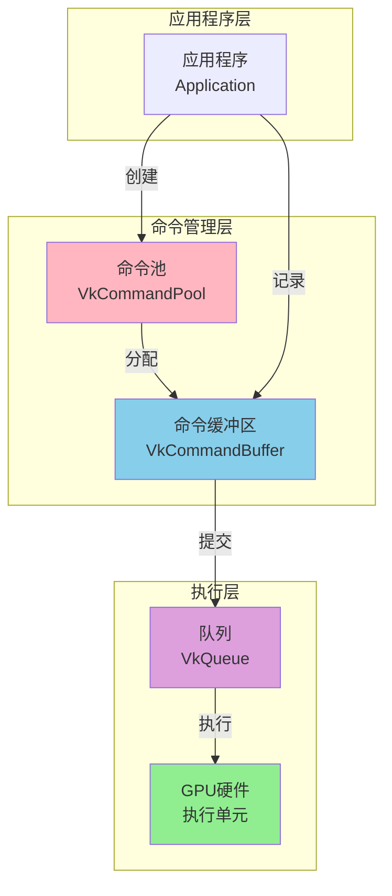
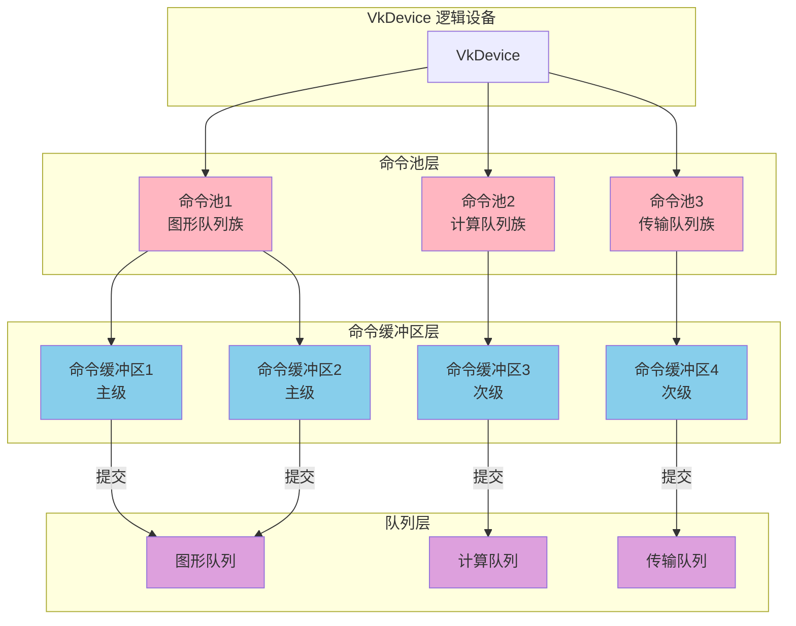
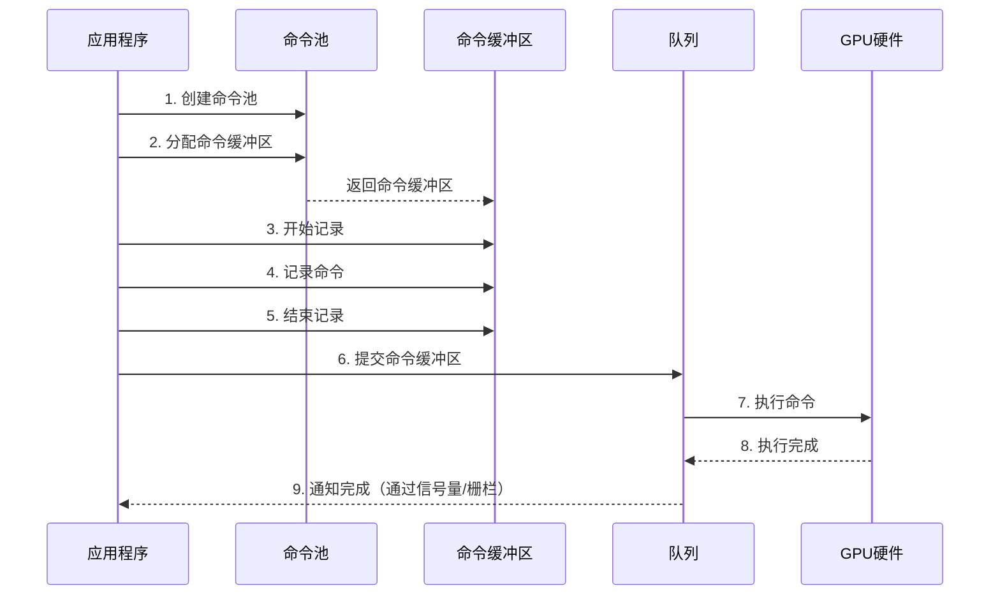
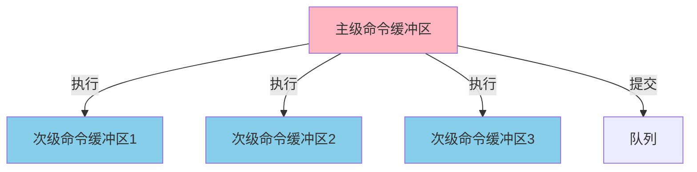
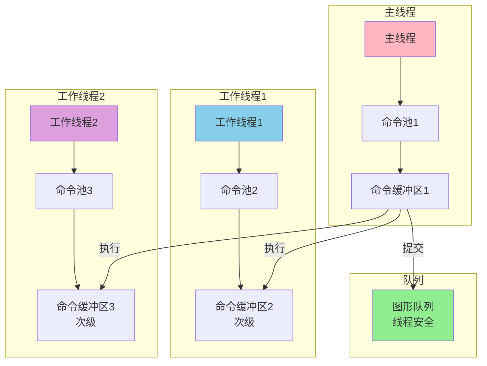
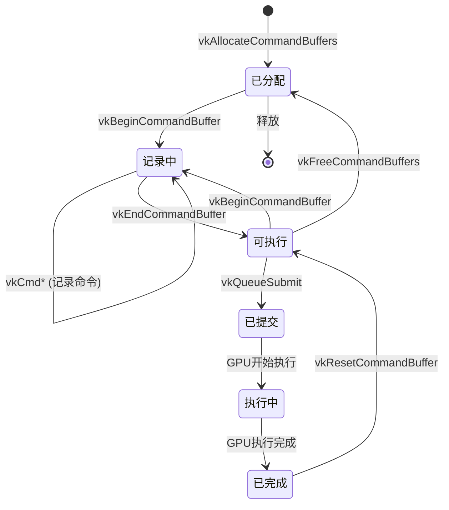

# Vulkan 命令管理架构设计文档

## 目录
1. [命令管理架构概述](#命令管理架构概述)
2. [架构组件](#架构组件)
3. [命令管理流程](#命令管理流程)
4. [命令缓冲区级别](#命令缓冲区级别)
5. [多线程命令管理](#多线程命令管理)
6. [命令生命周期](#命令生命周期)
7. [架构设计模式](#架构设计模式)
8. [性能优化策略](#性能优化策略)
9. [实际架构示例](#实际架构示例)
10. [最佳实践](#最佳实践)

---

## 命令管理架构概述

### 什么是命令管理架构？

Vulkan 命令管理架构是用于创建、记录、提交和执行 GPU 命令的完整系统。它由命令池、命令缓冲区、队列等组件组成，提供了高效、灵活的 GPU 命令管理机制。

### 命令管理架构的核心特点

- **分层设计**: 命令池 → 命令缓冲区 → 队列
- **池化分配**: 从命令池分配命令缓冲区，提高效率
- **异步执行**: 命令提交是异步的，立即返回
- **线程安全**: 队列操作是线程安全的
- **灵活控制**: 支持主级和次级命令缓冲区

### 命令管理架构在 Vulkan 中的位置



---

## 架构组件

### 组件层次结构



### 组件职责

#### 1. VkCommandPool（命令池）

**职责**:
- 管理命令缓冲区的内存分配
- 与特定队列族关联
- 提供命令缓冲区的分配和回收

**特点**:
- 线程不安全（同一命令池不能多线程同时操作）
- 可以重置以重用内存
- 与队列族绑定

#### 2. VkCommandBuffer（命令缓冲区）

**职责**:
- 记录 GPU 命令
- 存储命令序列
- 提交到队列执行

**特点**:
- 主级或次级级别
- 记录状态管理
- 可重用

#### 3. VkQueue（队列）

**职责**:
- 接收命令缓冲区
- 调度命令执行
- 管理命令执行顺序

**特点**:
- 线程安全
- 异步执行
- 支持多种队列类型

---

## 命令管理流程

### 完整命令流程



### 详细流程步骤

#### 步骤 1: 创建命令池

```cpp
VkCommandPoolCreateInfo poolInfo{};
poolInfo.sType = VK_STRUCTURE_TYPE_COMMAND_POOL_CREATE_INFO;
poolInfo.queueFamilyIndex = graphicsQueueFamilyIndex;
poolInfo.flags = VK_COMMAND_POOL_CREATE_RESET_COMMAND_BUFFER_BIT;

VkCommandPool commandPool;
vkCreateCommandPool(device, &poolInfo, nullptr, &commandPool);
```

#### 步骤 2: 分配命令缓冲区

```cpp
VkCommandBufferAllocateInfo allocInfo{};
allocInfo.sType = VK_STRUCTURE_TYPE_COMMAND_BUFFER_ALLOCATE_INFO;
allocInfo.commandPool = commandPool;
allocInfo.level = VK_COMMAND_BUFFER_LEVEL_PRIMARY;
allocInfo.commandBufferCount = 1;

VkCommandBuffer commandBuffer;
vkAllocateCommandBuffers(device, &allocInfo, &commandBuffer);
```

#### 步骤 3-5: 记录命令

```cpp
// 3. 开始记录
VkCommandBufferBeginInfo beginInfo{};
beginInfo.sType = VK_STRUCTURE_TYPE_COMMAND_BUFFER_BEGIN_INFO;
vkBeginCommandBuffer(commandBuffer, &beginInfo);

// 4. 记录命令
vkCmdBeginRenderPass(commandBuffer, &renderPassInfo, ...);
vkCmdBindPipeline(commandBuffer, VK_PIPELINE_BIND_POINT_GRAPHICS, pipeline);
vkCmdBindVertexBuffers(commandBuffer, 0, 1, &vertexBuffer, offsets);
vkCmdDraw(commandBuffer, vertexCount, 1, 0, 0);
vkCmdEndRenderPass(commandBuffer);

// 5. 结束记录
vkEndCommandBuffer(commandBuffer);
```

#### 步骤 6: 提交到队列

```cpp
VkSubmitInfo submitInfo{};
submitInfo.sType = VK_STRUCTURE_TYPE_SUBMIT_INFO;
submitInfo.commandBufferCount = 1;
submitInfo.pCommandBuffers = &commandBuffer;
submitInfo.waitSemaphoreCount = 1;
submitInfo.pWaitSemaphores = &waitSemaphore;
submitInfo.signalSemaphoreCount = 1;
submitInfo.pSignalSemaphores = &signalSemaphore;

vkQueueSubmit(queue, 1, &submitInfo, fence);
```

---

## 命令缓冲区级别

### 主级命令缓冲区（Primary Command Buffer）

**特点**:
- 可以直接提交到队列
- 可以包含次级命令缓冲区
- 用于主要渲染任务

**使用场景**:
- 主渲染循环
- 完整的渲染通道

**架构图**:


### 次级命令缓冲区（Secondary Command Buffer）

**特点**:
- 不能直接提交到队列
- 只能被主级命令缓冲区调用
- 用于可重用的命令序列

**使用场景**:
- 可重用的渲染序列
- 多线程命令记录
- 模块化渲染

**代码示例**:
```cpp
// 创建次级命令缓冲区
VkCommandBufferAllocateInfo allocInfo{};
allocInfo.level = VK_COMMAND_BUFFER_LEVEL_SECONDARY;
allocInfo.commandBufferCount = 1;
VkCommandBuffer secondaryBuffer;
vkAllocateCommandBuffers(device, &allocInfo, &secondaryBuffer);

// 记录次级命令缓冲区
VkCommandBufferInheritanceInfo inheritInfo{};
inheritInfo.renderPass = renderPass;
inheritInfo.framebuffer = framebuffer;

VkCommandBufferBeginInfo beginInfo{};
beginInfo.sType = VK_STRUCTURE_TYPE_COMMAND_BUFFER_BEGIN_INFO;
beginInfo.flags = VK_COMMAND_BUFFER_USAGE_RENDER_PASS_CONTINUE_BIT;
beginInfo.pInheritanceInfo = &inheritInfo;

vkBeginCommandBuffer(secondaryBuffer, &beginInfo);
vkCmdDraw(secondaryBuffer, ...);
vkEndCommandBuffer(secondaryBuffer);

// 在主级命令缓冲区中执行
vkBeginCommandBuffer(primaryBuffer, ...);
vkCmdBeginRenderPass(primaryBuffer, ...);
vkCmdExecuteCommands(primaryBuffer, 1, &secondaryBuffer);
vkCmdEndRenderPass(primaryBuffer);
vkEndCommandBuffer(primaryBuffer);
```

---

## 多线程命令管理

### 多线程架构



### 多线程命令记录策略

#### 策略 1: 每线程一个命令池

```cpp
// 每个线程创建自己的命令池
class ThreadCommandManager {
private:
    VkDevice device;
    uint32_t queueFamilyIndex;
    VkCommandPool commandPool;
    
public:
    void init() {
        VkCommandPoolCreateInfo poolInfo{};
        poolInfo.queueFamilyIndex = queueFamilyIndex;
        poolInfo.flags = VK_COMMAND_POOL_CREATE_RESET_COMMAND_BUFFER_BIT;
        vkCreateCommandPool(device, &poolInfo, nullptr, &commandPool);
    }
    
    VkCommandBuffer allocateSecondary() {
        VkCommandBufferAllocateInfo allocInfo{};
        allocInfo.commandPool = commandPool;
        allocInfo.level = VK_COMMAND_BUFFER_LEVEL_SECONDARY;
        allocInfo.commandBufferCount = 1;
        
        VkCommandBuffer commandBuffer;
        vkAllocateCommandBuffers(device, &allocInfo, &commandBuffer);
        return commandBuffer;
    }
};
```

#### 策略 2: 主线程提交

```cpp
// 主线程收集所有次级命令缓冲区并提交
void renderFrame() {
    std::vector<VkCommandBuffer> secondaryBuffers;
    
    // 工作线程记录次级命令缓冲区
    // ... 多线程记录 ...
    
    // 主线程记录主级命令缓冲区
    vkBeginCommandBuffer(primaryBuffer, ...);
    vkCmdBeginRenderPass(primaryBuffer, ...);
    
    // 执行所有次级命令缓冲区
    vkCmdExecuteCommands(primaryBuffer, 
        secondaryBuffers.size(), 
        secondaryBuffers.data());
    
    vkCmdEndRenderPass(primaryBuffer);
    vkEndCommandBuffer(primaryBuffer);
    
    // 提交到队列（线程安全）
    vkQueueSubmit(queue, 1, &submitInfo, fence);
}
```

---

## 命令生命周期

### 命令生命周期状态机



### 生命周期管理

#### 状态 1: 已分配（Initial）

```cpp
VkCommandBuffer commandBuffer;
vkAllocateCommandBuffers(device, &allocInfo, &commandBuffer);
// 状态：已分配，但未记录
```

#### 状态 2: 记录中（Recording）

```cpp
vkBeginCommandBuffer(commandBuffer, &beginInfo);
// 状态：记录中，可以记录命令
vkCmdDraw(commandBuffer, ...);
```

#### 状态 3: 可执行（Executable）

```cpp
vkEndCommandBuffer(commandBuffer);
// 状态：可执行，可以提交到队列
```

#### 状态 4: 已提交（Pending）

```cpp
vkQueueSubmit(queue, 1, &submitInfo, fence);
// 状态：已提交，等待GPU执行
```

#### 状态 5: 执行中（Executing）

```cpp
// GPU正在执行命令
// 状态：执行中
```

#### 状态 6: 已完成（Completed）

```cpp
vkWaitForFences(device, 1, &fence, VK_TRUE, UINT64_MAX);
// 状态：已完成，可以重用或释放
```

---

## 架构设计模式

### 模式 1: 命令池管理器

```cpp
class CommandPoolManager {
private:
    VkDevice device;
    std::unordered_map<uint32_t, VkCommandPool> pools;  // 按队列族索引
    
public:
    VkCommandPool getPool(uint32_t queueFamilyIndex) {
        if (pools.find(queueFamilyIndex) == pools.end()) {
            VkCommandPoolCreateInfo poolInfo{};
            poolInfo.queueFamilyIndex = queueFamilyIndex;
            poolInfo.flags = VK_COMMAND_POOL_CREATE_RESET_COMMAND_BUFFER_BIT;
            
            VkCommandPool pool;
            vkCreateCommandPool(device, &poolInfo, nullptr, &pool);
            pools[queueFamilyIndex] = pool;
        }
        return pools[queueFamilyIndex];
    }
};
```

### 模式 2: 命令缓冲区池

```cpp
class CommandBufferPool {
private:
    VkDevice device;
    VkCommandPool commandPool;
    std::vector<VkCommandBuffer> availableBuffers;
    std::vector<VkCommandBuffer> inUseBuffers;
    
public:
    VkCommandBuffer acquire() {
        if (availableBuffers.empty()) {
            // 分配新的命令缓冲区
            VkCommandBufferAllocateInfo allocInfo{};
            allocInfo.commandPool = commandPool;
            allocInfo.level = VK_COMMAND_BUFFER_LEVEL_PRIMARY;
            allocInfo.commandBufferCount = 1;
            
            VkCommandBuffer buffer;
            vkAllocateCommandBuffers(device, &allocInfo, &buffer);
            availableBuffers.push_back(buffer);
        }
        
        VkCommandBuffer buffer = availableBuffers.back();
        availableBuffers.pop_back();
        inUseBuffers.push_back(buffer);
        return buffer;
    }
    
    void release(VkCommandBuffer buffer) {
        // 重置命令缓冲区
        vkResetCommandBuffer(buffer, 0);
        
        // 从使用中移除，添加到可用列表
        auto it = std::find(inUseBuffers.begin(), inUseBuffers.end(), buffer);
        if (it != inUseBuffers.end()) {
            inUseBuffers.erase(it);
            availableBuffers.push_back(buffer);
        }
    }
};
```

### 模式 3: 多帧并发管理

```cpp
class FrameCommandManager {
private:
    VkDevice device;
    VkCommandPool commandPool;
    std::vector<VkCommandBuffer> commandBuffers;  // 每帧一个
    uint32_t maxFramesInFlight;
    uint32_t currentFrame;
    
public:
    void init(uint32_t maxFrames) {
        maxFramesInFlight = maxFrames;
        commandBuffers.resize(maxFrames);
        
        VkCommandBufferAllocateInfo allocInfo{};
        allocInfo.commandPool = commandPool;
        allocInfo.level = VK_COMMAND_BUFFER_LEVEL_PRIMARY;
        allocInfo.commandBufferCount = maxFrames;
        
        vkAllocateCommandBuffers(device, &allocInfo, commandBuffers.data());
    }
    
    VkCommandBuffer getCurrentBuffer() {
        return commandBuffers[currentFrame];
    }
    
    void advanceFrame() {
        currentFrame = (currentFrame + 1) % maxFramesInFlight;
    }
};
```

---

## 性能优化策略

### 策略 1: 命令缓冲区重用

```cpp
// ✅ 好的做法：重用命令缓冲区
void renderFrame() {
    VkCommandBuffer cmd = getCurrentCommandBuffer();
    
    // 重置并重新记录
    vkResetCommandBuffer(cmd, 0);
    vkBeginCommandBuffer(cmd, ...);
    // ... 记录命令 ...
    vkEndCommandBuffer(cmd);
    
    vkQueueSubmit(queue, 1, &submitInfo, fence);
}

// ❌ 不好的做法：每次都分配新的
void renderFrame() {
    VkCommandBuffer cmd;
    vkAllocateCommandBuffers(device, &allocInfo, &cmd);
    // ... 记录命令 ...
    vkFreeCommandBuffers(device, commandPool, 1, &cmd);
}
```

### 策略 2: 批量提交

```cpp
// ✅ 好的做法：批量提交
std::vector<VkCommandBuffer> buffers = {buf1, buf2, buf3};
VkSubmitInfo submitInfo{};
submitInfo.commandBufferCount = buffers.size();
submitInfo.pCommandBuffers = buffers.data();
vkQueueSubmit(queue, 1, &submitInfo, fence);

// ❌ 不好的做法：逐个提交
vkQueueSubmit(queue, 1, &submitInfo1, fence1);
vkQueueSubmit(queue, 1, &submitInfo2, fence2);
vkQueueSubmit(queue, 1, &submitInfo3, fence3);
```

### 策略 3: 多线程记录

```cpp
// ✅ 好的做法：多线程记录次级命令缓冲区
void recordSecondaryBuffers() {
    std::vector<std::thread> threads;
    std::vector<VkCommandBuffer> secondaryBuffers(numThreads);
    
    for (uint32_t i = 0; i < numThreads; i++) {
        threads.emplace_back([&, i]() {
            // 每个线程使用自己的命令池
            VkCommandPool pool = getThreadCommandPool(i);
            VkCommandBuffer buffer = allocateSecondary(pool);
            
            // 记录命令
            vkBeginCommandBuffer(buffer, ...);
            // ... 记录命令 ...
            vkEndCommandBuffer(buffer);
            
            secondaryBuffers[i] = buffer;
        });
    }
    
    for (auto& thread : threads) {
        thread.join();
    }
}
```

---

## 实际架构示例

### 示例 1: 完整的命令管理系统

```cpp
class VulkanCommandManager {
private:
    VkDevice device;
    
    // 命令池管理
    struct QueueFamilyPools {
        VkCommandPool graphics;
        VkCommandPool compute;
        VkCommandPool transfer;
    };
    std::unordered_map<uint32_t, QueueFamilyPools> familyPools;
    
    // 命令缓冲区管理
    struct FrameResources {
        VkCommandBuffer graphics;
        VkCommandBuffer compute;
        VkFence fence;
    };
    std::vector<FrameResources> frameResources;
    uint32_t currentFrame;
    uint32_t maxFramesInFlight;
    
public:
    void init(VkDevice dev, uint32_t graphicsQueueFamily, 
              uint32_t computeQueueFamily, uint32_t transferQueueFamily,
              uint32_t maxFrames) {
        device = dev;
        maxFramesInFlight = maxFrames;
        currentFrame = 0;
        
        // 创建命令池
        familyPools[graphicsQueueFamily].graphics = 
            createCommandPool(graphicsQueueFamily);
        familyPools[computeQueueFamily].compute = 
            createCommandPool(computeQueueFamily);
        familyPools[transferQueueFamily].transfer = 
            createCommandPool(transferQueueFamily);
        
        // 分配命令缓冲区
        frameResources.resize(maxFrames);
        for (auto& frame : frameResources) {
            frame.graphics = allocateCommandBuffer(
                familyPools[graphicsQueueFamily].graphics,
                VK_COMMAND_BUFFER_LEVEL_PRIMARY);
            frame.compute = allocateCommandBuffer(
                familyPools[computeQueueFamily].compute,
                VK_COMMAND_BUFFER_LEVEL_PRIMARY);
            
            VkFenceCreateInfo fenceInfo{};
            fenceInfo.flags = VK_FENCE_CREATE_SIGNALED_BIT;
            vkCreateFence(device, &fenceInfo, nullptr, &frame.fence);
        }
    }
    
    VkCommandBuffer getGraphicsBuffer() {
        return frameResources[currentFrame].graphics;
    }
    
    VkCommandBuffer getComputeBuffer() {
        return frameResources[currentFrame].compute;
    }
    
    void submitGraphics(VkQueue queue, 
                       const std::vector<VkSemaphore>& waitSemaphores,
                       const std::vector<VkSemaphore>& signalSemaphores) {
        VkCommandBuffer cmd = getGraphicsBuffer();
        
        VkSubmitInfo submitInfo{};
        submitInfo.sType = VK_STRUCTURE_TYPE_SUBMIT_INFO;
        submitInfo.commandBufferCount = 1;
        submitInfo.pCommandBuffers = &cmd;
        submitInfo.waitSemaphoreCount = waitSemaphores.size();
        submitInfo.pWaitSemaphores = waitSemaphores.data();
        submitInfo.signalSemaphoreCount = signalSemaphores.size();
        submitInfo.pSignalSemaphores = signalSemaphores.data();
        
        vkQueueSubmit(queue, 1, &submitInfo, 
                     frameResources[currentFrame].fence);
    }
    
    void advanceFrame() {
        currentFrame = (currentFrame + 1) % maxFramesInFlight;
        
        // 等待当前帧完成
        vkWaitForFences(device, 1, 
                       &frameResources[currentFrame].fence, 
                       VK_TRUE, UINT64_MAX);
        vkResetFences(device, 1, 
                     &frameResources[currentFrame].fence);
        
        // 重置命令缓冲区
        vkResetCommandBuffer(
            frameResources[currentFrame].graphics, 0);
        vkResetCommandBuffer(
            frameResources[currentFrame].compute, 0);
    }
};
```

---

## 最佳实践

### 1. 命令池管理

**DO**:
- ✅ 为每个队列族创建独立的命令池
- ✅ 使用 `RESET_COMMAND_BUFFER_BIT` 标志
- ✅ 重用命令池

**DON'T**:
- ❌ 跨队列族使用命令池
- ❌ 频繁创建/销毁命令池
- ❌ 在多线程中共享命令池

### 2. 命令缓冲区管理

**DO**:
- ✅ 重用命令缓冲区
- ✅ 批量分配命令缓冲区
- ✅ 正确选择命令缓冲区级别

**DON'T**:
- ❌ 频繁分配/释放命令缓冲区
- ❌ 忘记重置命令缓冲区
- ❌ 在记录状态提交命令缓冲区

### 3. 多线程策略

**DO**:
- ✅ 每线程一个命令池
- ✅ 使用次级命令缓冲区进行多线程记录
- ✅ 主线程统一提交

**DON'T**:
- ❌ 多线程共享命令池
- ❌ 多线程同时操作同一命令缓冲区
- ❌ 忘记同步

### 4. 性能优化

**DO**:
- ✅ 批量提交命令缓冲区
- ✅ 重用命令缓冲区
- ✅ 使用多线程记录

**DON'T**:
- ❌ 频繁分配/释放
- ❌ 逐个提交命令缓冲区
- ❌ 单线程记录所有命令

---

## 总结

### 命令管理架构关键要点

1. **分层设计**: 命令池 → 命令缓冲区 → 队列
2. **池化分配**: 从命令池分配命令缓冲区
3. **异步执行**: 命令提交是异步的
4. **线程安全**: 队列操作是线程安全的
5. **灵活控制**: 支持主级和次级命令缓冲区

### 命令管理架构流程图


---

**文档版本**: 1.0  
**最后更新**: 2025  
**相关文档**: 
- [VkCommandPool 详细分析](./VkCommandPool详细分析.md)
- [VkQueue 详细分析](./VkQueue详细分析.md)
- [VkDevice 详细分析](../VkDevice详细分析.md)


