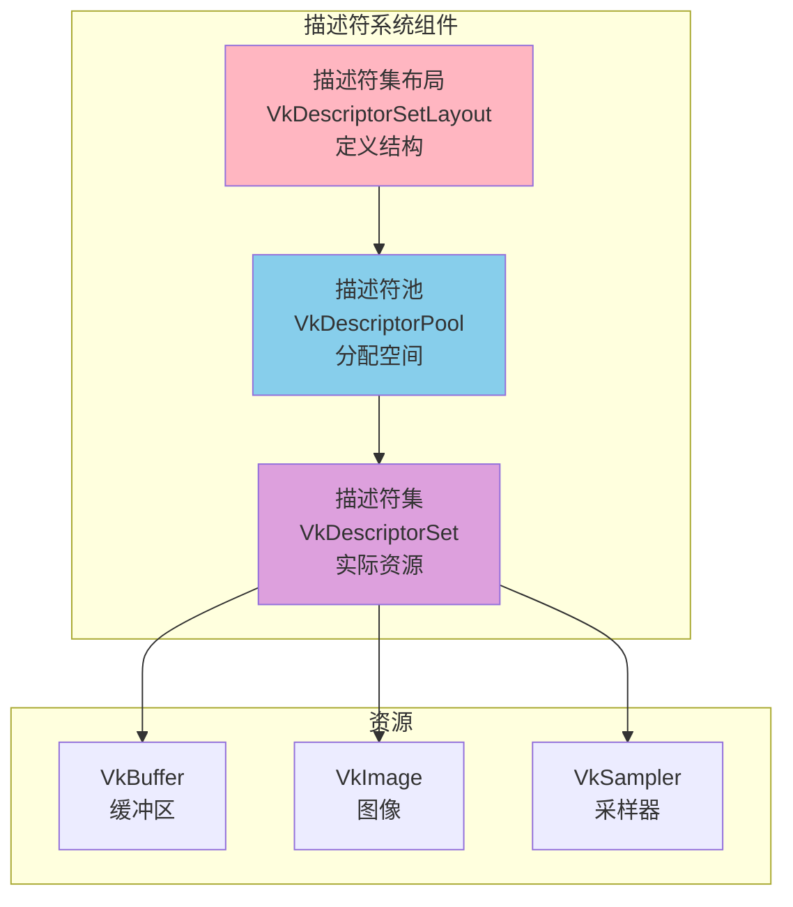
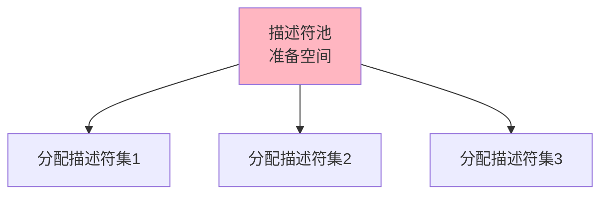
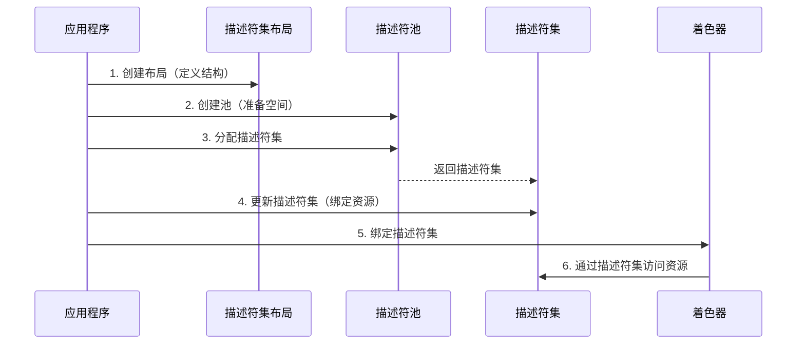
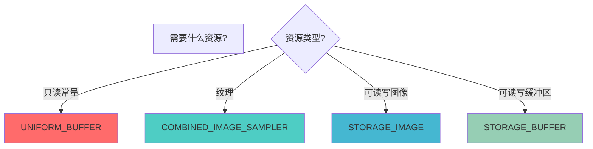

# Vulkan 描述符和描述符集详细分析文档

## 目录
1. [描述符是什么？用生活例子理解](#描述符是什么用生活例子理解)
2. [描述符系统概述](#描述符系统概述)
3. [描述符集布局（Descriptor Set Layout）](#描述符集布局descriptor-set-layout)
4. [描述符池（Descriptor Pool）](#描述符池descriptor-pool)
5. [描述符集（Descriptor Set）](#描述符集descriptor-set)
6. [描述符类型](#描述符类型)
7. [描述符更新](#描述符更新)
8. [描述符绑定](#描述符绑定)
9. [实际代码示例](#实际代码示例)
10. [最佳实践](#最佳实践)

---

## 描述符是什么？用生活例子理解

### 📋 最简单的理解：描述符 = 资源引用表

想象你在管理一个图书馆：

```
图书馆（GPU）                目录卡（描述符集）          实际书籍（资源）
    │                              │                        │
    │  1. 定义目录格式              │                        │
    │     （描述符集布局）           │                        │
    │                              │                        │
    │  2. 准备目录卡                │                        │
    │     （描述符池）               │                        │
    │                              │                        │
    │  3. 填写目录卡                │                        │
    │     （描述符集）               │                        │
    │     ┌──────────────────┐     │                        │
    │     │ 位置0: 数学书     │─────┼──────────────────────> │ 数学书
    │     │ 位置1: 物理书     │─────┼──────────────────────> │ 物理书
    │     │ 位置2: 化学书     │─────┼──────────────────────> │ 化学书
    │     └──────────────────┘     │                        │
```

**描述符（Descriptor）就像图书馆的目录卡**：
- **描述符集布局** = 目录卡的格式（定义有哪些位置）
- **描述符池** = 准备目录卡的地方
- **描述符集** = 实际的目录卡（填写了具体书籍的位置）

### 🏠 更具体的例子：房间配置表

想象你在管理一个房间：

```
房间（着色器）                配置表（描述符集）          实际物品（资源）
    │                              │                        │
    │  1. 定义配置表格式            │                        │
    │     （描述符集布局）           │                        │
    │     位置0: 桌子               │                        │
    │     位置1: 椅子               │                        │
    │     位置2: 灯                 │                        │
    │                              │                        │
    │  2. 准备配置表                │                        │
    │     （描述符池）               │                        │
    │                              │                        │
    │  3. 填写配置表                │                        │
    │     （描述符集）               │                        │
    │     ┌──────────────────┐     │                        │
    │     │ 位置0: 桌子A      │─────┼──────────────────────> │ 桌子A
    │     │ 位置1: 椅子B      │─────┼──────────────────────> │ 椅子B
    │     │ 位置2: 灯C        │─────┼──────────────────────> │ 灯C
    │     └──────────────────┘     │                        │
```

### 🎮 游戏例子：装备栏

想象你在玩游戏，有装备栏：

```
角色（着色器）                装备栏（描述符集）          实际装备（资源）
    │                              │                        │
    │  1. 定义装备栏格式            │                        │
    │     （描述符集布局）           │                        │
    │     位置0: 武器               │                        │
    │     位置1: 护甲               │                        │
    │     位置2: 饰品               │                        │
    │                              │                        │
    │  2. 准备装备栏                │                        │
    │     （描述符池）               │                        │
    │                              │                        │
    │  3. 装备物品                  │                        │
    │     （描述符集）               │                        │
    │     ┌──────────────────┐     │                        │
    │     │ 位置0: 剑        │─────┼──────────────────────> │ 剑
    │     │ 位置1: 盔甲      │─────┼──────────────────────> │ 盔甲
    │     │ 位置2: 戒指      │─────┼──────────────────────> │ 戒指
    │     └──────────────────┘     │                        │
```

### 💻 在Vulkan中的实际场景

#### 场景1：着色器需要资源

```glsl
// 着色器代码
layout(set = 0, binding = 0) uniform UniformBufferObject {
    mat4 model;
    mat4 view;
    mat4 proj;
} ubo;

layout(set = 0, binding = 1) uniform sampler2D texSampler;
```

```cpp
// C++代码：创建描述符集
// 1. 定义布局（描述符集布局）
VkDescriptorSetLayoutBinding bindings[2];
bindings[0].binding = 0;  // 对应着色器中的 binding = 0
bindings[0].descriptorType = VK_DESCRIPTOR_TYPE_UNIFORM_BUFFER;
bindings[1].binding = 1;  // 对应着色器中的 binding = 1
bindings[1].descriptorType = VK_DESCRIPTOR_TYPE_COMBINED_IMAGE_SAMPLER;

// 2. 创建描述符集布局
vkCreateDescriptorSetLayout(...);

// 3. 创建描述符池
vkCreateDescriptorPool(...);

// 4. 分配描述符集
vkAllocateDescriptorSets(...);

// 5. 更新描述符集（绑定实际资源）
VkWriteDescriptorSet writes[2];
writes[0].pBufferInfo = &uniformBufferInfo;  // 绑定uniform缓冲区
writes[1].pImageInfo = &textureImageInfo;    // 绑定纹理
vkUpdateDescriptorSets(...);
```

**为什么需要描述符？**
- 着色器需要访问缓冲区、纹理等资源
- 描述符是着色器访问资源的"桥梁"
- 就像给着色器一个"资源目录"，告诉它资源在哪里

### 🎯 描述符系统的关键概念


### 🆚 描述符 vs 直接绑定：简单对比

| 特性 | 描述符系统 | 直接绑定 |
|------|----------|---------|
| **方式** | 通过描述符集 | 直接传递资源 |
| **比喻** | 目录卡 | 直接给书 |
| **灵活性** | 高（可以动态更新） | 低（固定绑定） |
| **性能** | 高效 | 高效 |
| **Vulkan** | ✅ 使用描述符 | ❌ 不支持直接绑定 |

### ✅ 总结：描述符就是什么？

**一句话总结**：描述符（Descriptor）就是**着色器访问资源的"目录卡"**，告诉着色器资源在哪里、是什么类型。

**三个关键词**：
1. **资源引用** - 指向实际的缓冲区、图像等资源
2. **布局定义** - 定义描述符的结构
3. **动态绑定** - 可以在运行时更新资源

**记住这个公式**：
```
描述符集布局（模板） → 描述符池（准备） → 描述符集（实际） → 着色器使用
```

**常见使用场景**：
- ✅ 着色器访问uniform缓冲区
- ✅ 着色器采样纹理
- ✅ 着色器访问存储缓冲区
- ✅ 动态更新资源绑定

---

## 描述符系统概述

### 什么是描述符系统？

描述符系统是 Vulkan 中用于将资源（缓冲区、图像、采样器等）绑定到着色器的机制。它允许着色器通过描述符集访问这些资源。

### 描述符系统的核心组件



### 描述符系统的特点

- **类型安全**: 描述符类型必须匹配资源类型
- **布局驱动**: 必须定义描述符集布局
- **池化分配**: 从描述符池分配描述符集
- **动态更新**: 可以更新描述符集的内容
- **多集支持**: 可以使用多个描述符集

---

## 描述符集布局（Descriptor Set Layout）

### 描述符集布局概述

描述符集布局定义了描述符集的结构，包括每个绑定的类型、数量和着色器阶段。

### VkDescriptorSetLayoutBinding 结构

```cpp
typedef struct VkDescriptorSetLayoutBinding {
    uint32_t              binding;           // 绑定索引（对应着色器中的binding）
    VkDescriptorType      descriptorType;    // 描述符类型
    uint32_t              descriptorCount;    // 描述符数量（数组大小）
    VkShaderStageFlags    stageFlags;         // 着色器阶段标志
    const VkSampler*      pImmutableSamplers; // 不可变采样器（可选）
} VkDescriptorSetLayoutBinding;
```

### 创建描述符集布局

```cpp
// 定义绑定
std::vector<VkDescriptorSetLayoutBinding> bindings;

// 绑定0：Uniform缓冲区
VkDescriptorSetLayoutBinding uboBinding{};
uboBinding.binding = 0;
uboBinding.descriptorType = VK_DESCRIPTOR_TYPE_UNIFORM_BUFFER;
uboBinding.descriptorCount = 1;
uboBinding.stageFlags = VK_SHADER_STAGE_VERTEX_BIT;
bindings.push_back(uboBinding);

// 绑定1：纹理采样器
VkDescriptorSetLayoutBinding samplerBinding{};
samplerBinding.binding = 1;
samplerBinding.descriptorType = VK_DESCRIPTOR_TYPE_COMBINED_IMAGE_SAMPLER;
samplerBinding.descriptorCount = 1;
samplerBinding.stageFlags = VK_SHADER_STAGE_FRAGMENT_BIT;
bindings.push_back(samplerBinding);

// 创建描述符集布局
VkDescriptorSetLayoutCreateInfo layoutInfo{};
layoutInfo.sType = VK_STRUCTURE_TYPE_DESCRIPTOR_SET_LAYOUT_CREATE_INFO;
layoutInfo.bindingCount = static_cast<uint32_t>(bindings.size());
layoutInfo.pBindings = bindings.data();

VkDescriptorSetLayout descriptorSetLayout;
vkCreateDescriptorSetLayout(device, &layoutInfo, nullptr, &descriptorSetLayout);
```

### 描述符集布局的作用


---

## 描述符池（Descriptor Pool）

### 描述符池概述

描述符池用于分配描述符集，类似于内存池。它预先分配一定数量的描述符，然后从池中分配描述符集。

### VkDescriptorPoolSize 结构

```cpp
typedef struct VkDescriptorPoolSize {
    VkDescriptorType    type;            // 描述符类型
    uint32_t            descriptorCount; // 该类型的描述符数量
} VkDescriptorPoolSize;
```

### 创建描述符池

```cpp
// 定义池大小
std::vector<VkDescriptorPoolSize> poolSizes;
poolSizes.push_back({
    VK_DESCRIPTOR_TYPE_UNIFORM_BUFFER,      // 类型
    10                                       // 数量（可以分配10个uniform缓冲区描述符）
});
poolSizes.push_back({
    VK_DESCRIPTOR_TYPE_COMBINED_IMAGE_SAMPLER,
    10                                       // 可以分配10个图像采样器描述符
});

// 创建描述符池
VkDescriptorPoolCreateInfo poolInfo{};
poolInfo.sType = VK_STRUCTURE_TYPE_DESCRIPTOR_POOL_CREATE_INFO;
poolInfo.poolSizeCount = static_cast<uint32_t>(poolSizes.size());
poolInfo.pPoolSizes = poolSizes.data();
poolInfo.maxSets = 10;  // 最多可以分配10个描述符集

VkDescriptorPool descriptorPool;
vkCreateDescriptorPool(device, &poolInfo, nullptr, &descriptorPool);
```

### 描述符池的作用



---

## 描述符集（Descriptor Set）

### 描述符集概述

描述符集是实际包含资源引用的对象，它从描述符池中分配，并使用描述符集布局定义的结构。

### 分配描述符集

```cpp
// 分配描述符集
VkDescriptorSetAllocateInfo allocInfo{};
allocInfo.sType = VK_STRUCTURE_TYPE_DESCRIPTOR_SET_ALLOCATE_INFO;
allocInfo.descriptorPool = descriptorPool;
allocInfo.descriptorSetCount = 1;
allocInfo.pSetLayouts = &descriptorSetLayout;

VkDescriptorSet descriptorSet;
vkAllocateDescriptorSets(device, &allocInfo, &descriptorSet);
```

### 更新描述符集

```cpp
// 更新描述符集（绑定实际资源）
std::vector<VkWriteDescriptorSet> descriptorWrites;

// 写入0：Uniform缓冲区
VkDescriptorBufferInfo bufferInfo{};
bufferInfo.buffer = uniformBuffer;
bufferInfo.offset = 0;
bufferInfo.range = sizeof(UniformBufferObject);

VkWriteDescriptorSet bufferWrite{};
bufferWrite.sType = VK_STRUCTURE_TYPE_WRITE_DESCRIPTOR_SET;
bufferWrite.dstSet = descriptorSet;
bufferWrite.dstBinding = 0;
bufferWrite.dstArrayElement = 0;
bufferWrite.descriptorType = VK_DESCRIPTOR_TYPE_UNIFORM_BUFFER;
bufferWrite.descriptorCount = 1;
bufferWrite.pBufferInfo = &bufferInfo;
descriptorWrites.push_back(bufferWrite);

// 写入1：纹理
VkDescriptorImageInfo imageInfo{};
imageInfo.imageLayout = VK_IMAGE_LAYOUT_SHADER_READ_ONLY_OPTIMAL;
imageInfo.imageView = textureImageView;
imageInfo.sampler = textureSampler;

VkWriteDescriptorSet imageWrite{};
imageWrite.sType = VK_STRUCTURE_TYPE_WRITE_DESCRIPTOR_SET;
imageWrite.dstSet = descriptorSet;
imageWrite.dstBinding = 1;
imageWrite.dstArrayElement = 0;
imageWrite.descriptorType = VK_DESCRIPTOR_TYPE_COMBINED_IMAGE_SAMPLER;
imageWrite.descriptorCount = 1;
imageWrite.pImageInfo = &imageInfo;
descriptorWrites.push_back(imageWrite);

// 执行更新
vkUpdateDescriptorSets(
    device,
    static_cast<uint32_t>(descriptorWrites.size()),
    descriptorWrites.data(),
    0, nullptr
);
```

### 描述符集的使用流程



---

## 描述符类型

### 描述符类型概述

不同的资源类型需要不同的描述符类型。

### 常见描述符类型

| 描述符类型 | 说明 | 使用场景 |
|-----------|------|---------|
| `VK_DESCRIPTOR_TYPE_UNIFORM_BUFFER` | Uniform缓冲区 | 传递常量数据（如矩阵） |
| `VK_DESCRIPTOR_TYPE_COMBINED_IMAGE_SAMPLER` | 组合图像采样器 | 纹理采样 |
| `VK_DESCRIPTOR_TYPE_SAMPLED_IMAGE` | 采样图像 | 只读图像 |
| `VK_DESCRIPTOR_TYPE_STORAGE_IMAGE` | 存储图像 | 可读写图像 |
| `VK_DESCRIPTOR_TYPE_STORAGE_BUFFER` | 存储缓冲区 | 可读写缓冲区 |
| `VK_DESCRIPTOR_TYPE_UNIFORM_BUFFER_DYNAMIC` | 动态Uniform缓冲区 | 动态偏移的uniform缓冲区 |

### 描述符类型选择



---

## 描述符更新

### 更新描述符集

使用 `vkUpdateDescriptorSets` 更新描述符集的内容。

### VkWriteDescriptorSet 结构

```cpp
typedef struct VkWriteDescriptorSet {
    VkStructureType                  sType;              // 结构体类型
    const void*                      pNext;              // 扩展链
    VkDescriptorSet                  dstSet;             // 目标描述符集
    uint32_t                         dstBinding;         // 目标绑定索引
    uint32_t                         dstArrayElement;    // 目标数组元素
    uint32_t                         descriptorCount;    // 描述符数量
    VkDescriptorType                descriptorType;      // 描述符类型
    const VkDescriptorImageInfo*     pImageInfo;         // 图像信息（图像描述符）
    const VkDescriptorBufferInfo*   pBufferInfo;         // 缓冲区信息（缓冲区描述符）
    const VkBufferView*              pTexelBufferView;   // 缓冲区视图（texel缓冲区）
} VkWriteDescriptorSet;
```

### 更新示例

```cpp
// 更新Uniform缓冲区
VkWriteDescriptorSet write{};
write.sType = VK_STRUCTURE_TYPE_WRITE_DESCRIPTOR_SET;
write.dstSet = descriptorSet;
write.dstBinding = 0;
write.descriptorType = VK_DESCRIPTOR_TYPE_UNIFORM_BUFFER;
write.descriptorCount = 1;
write.pBufferInfo = &bufferInfo;

vkUpdateDescriptorSets(device, 1, &write, 0, nullptr);
```

---

## 描述符绑定

### 绑定描述符集到管线

在命令缓冲区中绑定描述符集：

```cpp
void vkCmdBindDescriptorSets(
    VkCommandBuffer                 commandBuffer,
    VkPipelineBindPoint             pipelineBindPoint,    // 管线绑定点
    VkPipelineLayout                layout,               // 管线布局
    uint32_t                        firstSet,             // 第一个描述符集索引
    uint32_t                        descriptorSetCount,   // 描述符集数量
    const VkDescriptorSet*         pDescriptorSets,      // 描述符集数组
    uint32_t                        dynamicOffsetCount,   // 动态偏移数量
    const uint32_t*                 pDynamicOffsets       // 动态偏移数组
);
```

### 绑定示例

```cpp
// 绑定描述符集
vkCmdBindDescriptorSets(
    commandBuffer,
    VK_PIPELINE_BIND_POINT_GRAPHICS,  // 图形管线
    pipelineLayout,                    // 管线布局
    0,                                 // 第一个描述符集索引
    1,                                 // 描述符集数量
    &descriptorSet,                    // 描述符集数组
    0, nullptr                         // 动态偏移
);
```

---

## 实际代码示例

### 示例 1: 完整的描述符系统设置

```cpp
class DescriptorSystem {
private:
    VkDevice device;
    VkDescriptorSetLayout descriptorSetLayout;
    VkDescriptorPool descriptorPool;
    VkDescriptorSet descriptorSet;
    
public:
    void setup() {
        // 1. 创建描述符集布局
        createDescriptorSetLayout();
        
        // 2. 创建描述符池
        createDescriptorPool();
        
        // 3. 分配描述符集
        allocateDescriptorSet();
        
        // 4. 更新描述符集
        updateDescriptorSet();
    }
    
    void createDescriptorSetLayout() {
        std::vector<VkDescriptorSetLayoutBinding> bindings;
        
        // 绑定0：Uniform缓冲区
        bindings.push_back({
            0,                                              // binding
            VK_DESCRIPTOR_TYPE_UNIFORM_BUFFER,              // type
            1,                                              // count
            VK_SHADER_STAGE_VERTEX_BIT,                     // stage
            nullptr                                         // immutable samplers
        });
        
        // 绑定1：纹理
        bindings.push_back({
            1,                                              // binding
            VK_DESCRIPTOR_TYPE_COMBINED_IMAGE_SAMPLER,     // type
            1,                                              // count
            VK_SHADER_STAGE_FRAGMENT_BIT,                   // stage
            nullptr
        });
        
        VkDescriptorSetLayoutCreateInfo layoutInfo{};
        layoutInfo.sType = VK_STRUCTURE_TYPE_DESCRIPTOR_SET_LAYOUT_CREATE_INFO;
        layoutInfo.bindingCount = static_cast<uint32_t>(bindings.size());
        layoutInfo.pBindings = bindings.data();
        
        vkCreateDescriptorSetLayout(device, &layoutInfo, nullptr, &descriptorSetLayout);
    }
    
    void createDescriptorPool() {
        std::vector<VkDescriptorPoolSize> poolSizes = {
            {VK_DESCRIPTOR_TYPE_UNIFORM_BUFFER, 10},
            {VK_DESCRIPTOR_TYPE_COMBINED_IMAGE_SAMPLER, 10}
        };
        
        VkDescriptorPoolCreateInfo poolInfo{};
        poolInfo.sType = VK_STRUCTURE_TYPE_DESCRIPTOR_POOL_CREATE_INFO;
        poolInfo.poolSizeCount = static_cast<uint32_t>(poolSizes.size());
        poolInfo.pPoolSizes = poolSizes.data();
        poolInfo.maxSets = 10;
        
        vkCreateDescriptorPool(device, &poolInfo, nullptr, &descriptorPool);
    }
    
    void allocateDescriptorSet() {
        VkDescriptorSetAllocateInfo allocInfo{};
        allocInfo.sType = VK_STRUCTURE_TYPE_DESCRIPTOR_SET_ALLOCATE_INFO;
        allocInfo.descriptorPool = descriptorPool;
        allocInfo.descriptorSetCount = 1;
        allocInfo.pSetLayouts = &descriptorSetLayout;
        
        vkAllocateDescriptorSets(device, &allocInfo, &descriptorSet);
    }
    
    void updateDescriptorSet(VkBuffer uniformBuffer, VkImageView imageView, VkSampler sampler) {
        std::vector<VkWriteDescriptorSet> writes;
        
        // Uniform缓冲区
        VkDescriptorBufferInfo bufferInfo{};
        bufferInfo.buffer = uniformBuffer;
        bufferInfo.offset = 0;
        bufferInfo.range = VK_WHOLE_SIZE;
        
        VkWriteDescriptorSet bufferWrite{};
        bufferWrite.sType = VK_STRUCTURE_TYPE_WRITE_DESCRIPTOR_SET;
        bufferWrite.dstSet = descriptorSet;
        bufferWrite.dstBinding = 0;
        bufferWrite.descriptorType = VK_DESCRIPTOR_TYPE_UNIFORM_BUFFER;
        bufferWrite.descriptorCount = 1;
        bufferWrite.pBufferInfo = &bufferInfo;
        writes.push_back(bufferWrite);
        
        // 纹理
        VkDescriptorImageInfo imageInfo{};
        imageInfo.imageLayout = VK_IMAGE_LAYOUT_SHADER_READ_ONLY_OPTIMAL;
        imageInfo.imageView = imageView;
        imageInfo.sampler = sampler;
        
        VkWriteDescriptorSet imageWrite{};
        imageWrite.sType = VK_STRUCTURE_TYPE_WRITE_DESCRIPTOR_SET;
        imageWrite.dstSet = descriptorSet;
        imageWrite.dstBinding = 1;
        imageWrite.descriptorType = VK_DESCRIPTOR_TYPE_COMBINED_IMAGE_SAMPLER;
        imageWrite.descriptorCount = 1;
        imageWrite.pImageInfo = &imageInfo;
        writes.push_back(imageWrite);
        
        vkUpdateDescriptorSets(device, static_cast<uint32_t>(writes.size()), writes.data(), 0, nullptr);
    }
};
```

### 示例 2: 多描述符集

```cpp
// 使用多个描述符集
VkDescriptorSet sets[] = {descriptorSet0, descriptorSet1, descriptorSet2};

vkCmdBindDescriptorSets(
    commandBuffer,
    VK_PIPELINE_BIND_POINT_GRAPHICS,
    pipelineLayout,
    0,                          // 第一个描述符集索引
    3,                          // 描述符集数量
    sets,                       // 描述符集数组
    0, nullptr
);
```

---

## 最佳实践

### 1. 描述符集布局设计

**DO**:
- ✅ 按更新频率分组（静态/动态）
- ✅ 使用多个描述符集
- ✅ 匹配着色器绑定

**DON'T**:
- ❌ 把所有资源放在一个描述符集
- ❌ 忽略更新频率
- ❌ 不匹配着色器绑定

### 2. 描述符池管理

**DO**:
- ✅ 预先分配足够的描述符
- ✅ 重用描述符池
- ✅ 正确计算池大小

**DON'T**:
- ❌ 分配过少导致失败
- ❌ 频繁创建/销毁池
- ❌ 忘记重置池

### 3. 描述符集更新

**DO**:
- ✅ 批量更新描述符集
- ✅ 只在需要时更新
- ✅ 正确设置绑定信息

**DON'T**:
- ❌ 每帧都更新所有描述符集
- ❌ 忘记更新描述符集
- ❌ 使用错误的绑定索引

### 4. 性能优化

```cpp
// ✅ 好的做法：批量更新
std::vector<VkWriteDescriptorSet> writes = {write1, write2, write3};
vkUpdateDescriptorSets(device, writes.size(), writes.data(), 0, nullptr);

// ❌ 不好的做法：逐个更新
vkUpdateDescriptorSets(device, 1, &write1, 0, nullptr);
vkUpdateDescriptorSets(device, 1, &write2, 0, nullptr);
vkUpdateDescriptorSets(device, 1, &write3, 0, nullptr);
```

---

## 总结

### 描述符系统关键要点

1. **描述符集布局**: 定义描述符集的结构
2. **描述符池**: 用于分配描述符集
3. **描述符集**: 包含实际的资源引用
4. **描述符更新**: 绑定实际资源到描述符集
5. **描述符绑定**: 在命令缓冲区中绑定描述符集

### 描述符系统使用流程


---

**文档版本**: 1.0  
**最后更新**: 2025  
**相关文档**: 
- [VkPipeline 详细分析](../资源创建/VkPipeline详细分析.md)
- [VkImage 详细分析](../资源创建/VkImage详细分析.md)
- [VkSampler 详细分析](../资源创建/VkSampler详细分析.md)


