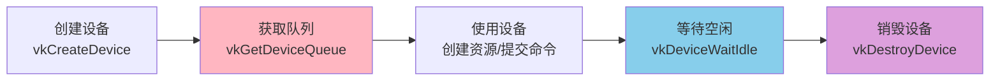
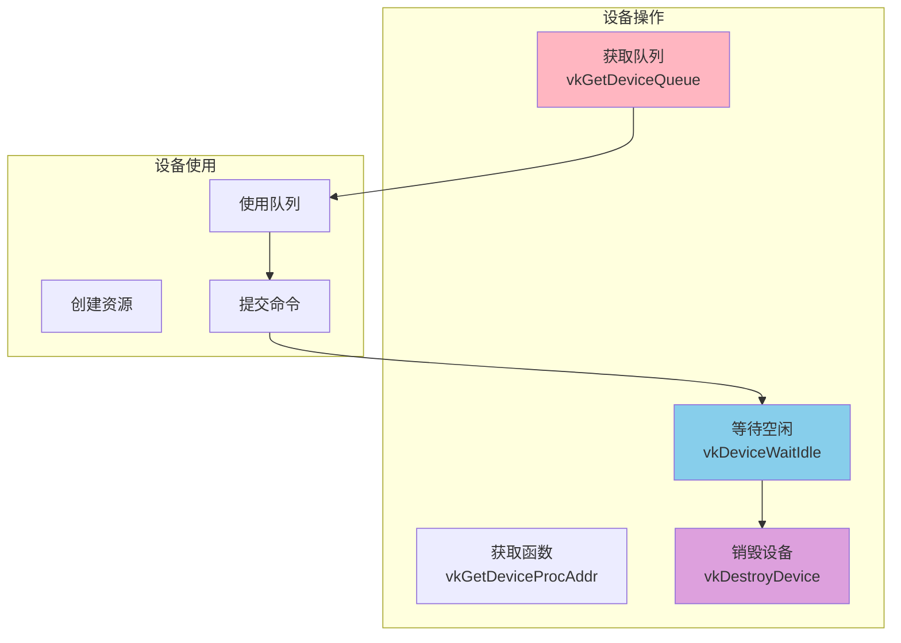
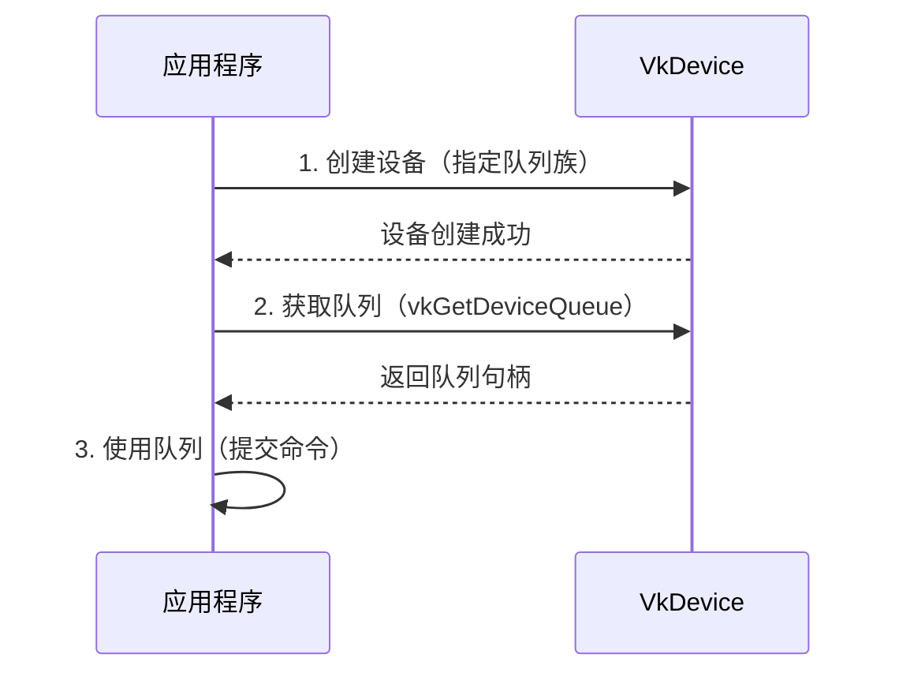
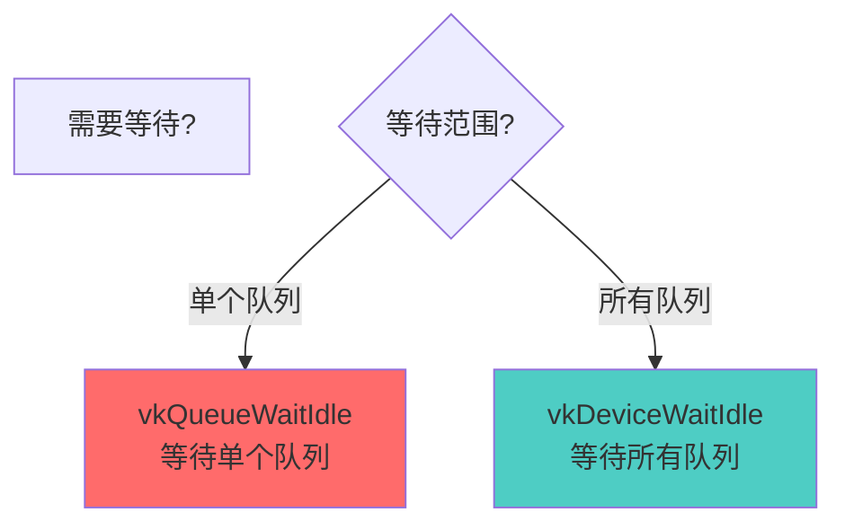
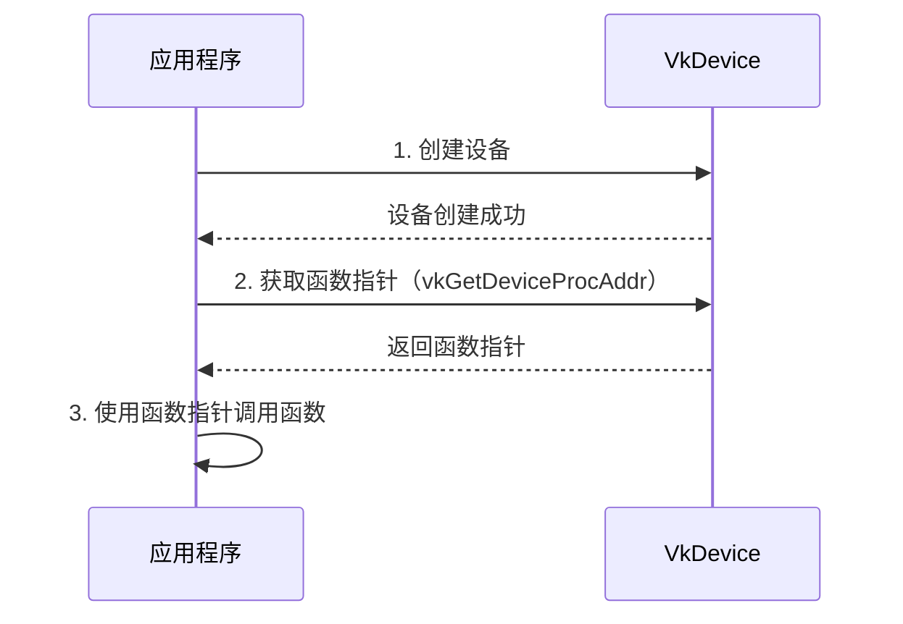
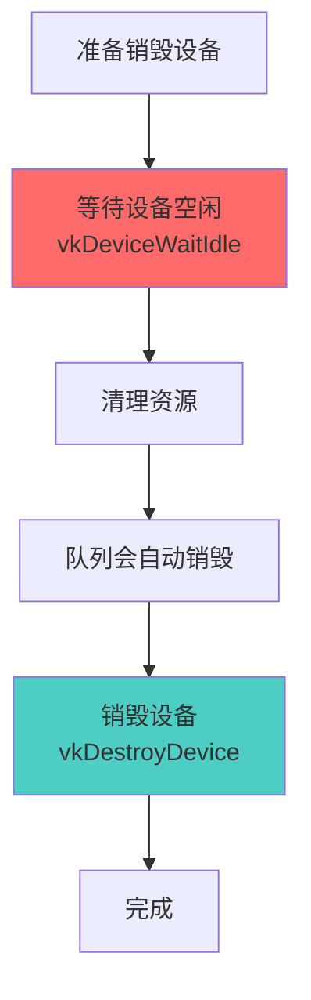
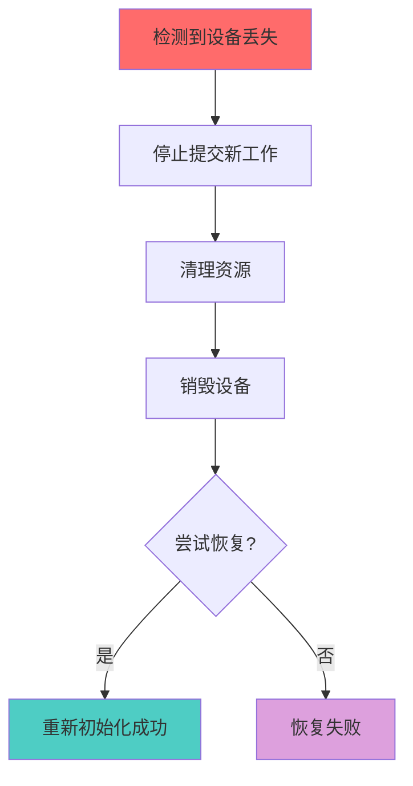
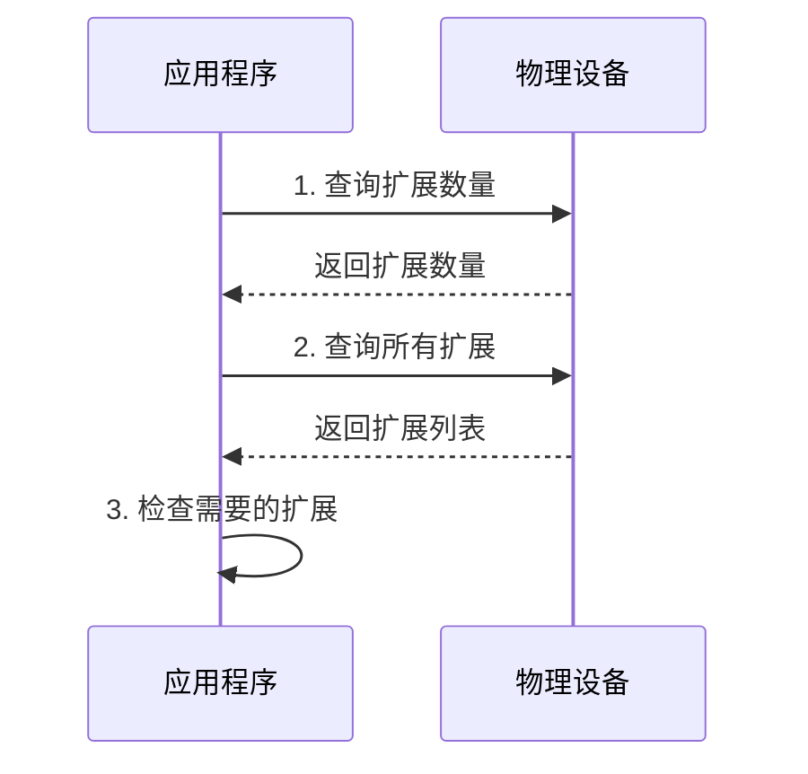

# Vulkan 设备操作详细分析文档

## 目录
1. [设备操作是什么？用生活例子理解](#设备操作是什么用生活例子理解)
2. [设备操作概述](#设备操作概述)
3. [获取设备队列](#获取设备队列)
4. [等待设备空闲](#等待设备空闲)
5. [获取设备函数指针](#获取设备函数指针)
6. [设备销毁](#设备销毁)
7. [设备丢失处理](#设备丢失处理)
8. [设备扩展查询](#设备扩展查询)
9. [实际代码示例](#实际代码示例)
10. [最佳实践](#最佳实践)

---

## 设备操作是什么？用生活例子理解

### 🏭 最简单的理解：设备操作 = 工厂管理

想象你管理一个工厂（设备）：

```
工厂（VkDevice）              你的操作（设备操作）
    │                              │
    │  1. 获取工作台（队列）        │
    │     vkGetDeviceQueue         │
    │                              │
    │  2. 等待所有工人完成         │
    │     vkDeviceWaitIdle         │
    │                              │
    │  3. 获取工具使用说明          │
    │     vkGetDeviceProcAddr      │
    │                              │
    │  4. 关闭工厂                 │
    │     vkDestroyDevice          │
```

**设备操作（Device Operations）就是管理工厂的各种操作**：
- **获取队列** = 获取工作台（工人在这里工作）
- **等待空闲** = 等待所有工人完成工作
- **获取函数** = 获取工具使用说明
- **销毁设备** = 关闭工厂

### 🎮 更具体的例子：游戏机管理

想象你有一台游戏机（设备）：

```
游戏机（VkDevice）              你的操作
    │                              │
    │  1. 选择游戏模式（队列）      │
    │     图形模式/计算模式         │
    │                              │
    │  2. 等待游戏完成             │
    │     确保所有任务完成          │
    │                              │
    │  3. 获取游戏功能说明         │
    │     如何使用特殊功能          │
    │                              │
    │  4. 关闭游戏机               │
    │     安全关机                 │
```

### 🏢 办公室例子：管理办公设备

想象你管理办公室的设备：

```
办公设备（VkDevice）            你的操作
    │                              │
    │  1. 分配打印机（队列）        │
    │     给不同部门分配            │
    │                              │
    │  2. 等待所有打印完成         │
    │     确保没有任务在进行        │
    │                              │
    │  3. 查看设备说明书           │
    │     了解如何使用功能          │
    │                              │
    │  4. 关闭设备                 │
    │     安全断电                 │
```

### 💻 在Vulkan中的实际场景

#### 场景1：获取队列（就像分配工作台）

```cpp
// 获取图形队列（就像分配图形工作台）
VkQueue graphicsQueue;
vkGetDeviceQueue(device, graphicsQueueFamilyIndex, 0, &graphicsQueue);

// 获取计算队列（就像分配计算工作台）
VkQueue computeQueue;
vkGetDeviceQueue(device, computeQueueFamilyIndex, 0, &computeQueue);
```

**为什么需要获取队列？**
- 设备创建时只是"准备"了队列，需要"获取"才能使用
- 就像工厂准备好了工作台，但需要你去"领取"才能使用

#### 场景2：等待设备空闲（就像等待所有工人完成）

```cpp
// 等待设备空闲（就像等待所有工人完成工作）
vkDeviceWaitIdle(device);
// 现在可以安全地销毁资源了
```

**为什么需要等待？**
- 确保所有GPU工作完成
- 避免在GPU还在工作时销毁资源

### 🎯 设备操作的关键概念



### ✅ 总结：设备操作就是什么？

**一句话总结**：设备操作就是**管理Vulkan设备的各种操作**，包括获取队列、等待空闲、获取函数指针、销毁设备等。

**三个关键词**：
1. **队列管理** - 获取和使用设备队列
2. **同步等待** - 等待设备完成工作
3. **生命周期** - 设备的创建和销毁

**记住这个公式**：
```
创建设备 → 获取队列 → 使用设备 → 等待空闲 → 销毁设备
```

**常见设备操作**：
- ✅ 获取设备队列（vkGetDeviceQueue）
- ✅ 等待设备空闲（vkDeviceWaitIdle）
- ✅ 获取设备函数指针（vkGetDeviceProcAddr）
- ✅ 销毁设备（vkDestroyDevice）
- ✅ 处理设备丢失（VK_ERROR_DEVICE_LOST）

---

## 设备操作概述

### 什么是设备操作？

设备操作是 Vulkan 中用于管理和控制逻辑设备的各种操作，包括队列获取、设备同步、函数指针获取、设备销毁等。

### 设备操作的核心特点

- **队列管理**: 获取和使用设备队列
- **同步控制**: 等待设备完成工作
- **函数获取**: 获取设备级别的函数指针
- **生命周期**: 设备的创建和销毁
- **错误处理**: 设备丢失等错误处理

### 设备操作在 Vulkan 架构中的位置



---

## 获取设备队列

### 获取队列概述

设备创建时，我们指定了需要的队列族和数量，但需要显式获取队列句柄才能使用。

### vkGetDeviceQueue 函数

```cpp
void vkGetDeviceQueue(
    VkDevice                device,             // 设备
    uint32_t                queueFamilyIndex,   // 队列族索引
    uint32_t                queueIndex,         // 队列索引（在队列族中的索引）
    VkQueue*                pQueue              // 输出的队列句柄
);
```

### 基本使用

```cpp
// 获取图形队列
VkQueue graphicsQueue;
vkGetDeviceQueue(
    device,
    graphicsQueueFamilyIndex,  // 图形队列族索引
    0,                         // 队列索引（第一个队列）
    &graphicsQueue
);

// 获取计算队列
VkQueue computeQueue;
vkGetDeviceQueue(
    device,
    computeQueueFamilyIndex,   // 计算队列族索引
    0,                         // 队列索引
    &computeQueue
);
```

### 获取多个队列

```cpp
// 如果队列族有多个队列，可以获取多个
VkQueue graphicsQueue0;
VkQueue graphicsQueue1;
VkQueue graphicsQueue2;

vkGetDeviceQueue(device, graphicsQueueFamilyIndex, 0, &graphicsQueue0);
vkGetDeviceQueue(device, graphicsQueueFamilyIndex, 1, &graphicsQueue1);
vkGetDeviceQueue(device, graphicsQueueFamilyIndex, 2, &graphicsQueue2);
```

### 队列获取时机



### 队列获取注意事项

**重要**：
- ✅ 队列索引必须在创建设备时指定的队列数量范围内
- ✅ 同一个队列句柄可以被多次获取（返回相同的句柄）
- ✅ 队列句柄在设备销毁前一直有效
- ❌ 不能获取未在设备创建时请求的队列

---

## 等待设备空闲

### 等待空闲概述

`vkDeviceWaitIdle` 用于等待设备上的所有队列完成所有提交的工作。这在销毁资源或关闭应用程序时非常重要。

### vkDeviceWaitIdle 函数

```cpp
VkResult vkDeviceWaitIdle(
    VkDevice                device              // 设备
);
```

### 基本使用

```cpp
// 等待设备上所有队列完成工作
VkResult result = vkDeviceWaitIdle(device);
if (result != VK_SUCCESS) {
    // 处理错误（如设备丢失）
    handleError(result);
}
```

### 使用场景

#### 场景1：销毁资源前

```cpp
// 在销毁资源前等待设备空闲
vkDeviceWaitIdle(device);

// 现在可以安全地销毁资源
vkDestroyBuffer(device, buffer, nullptr);
vkFreeMemory(device, memory, nullptr);
```

#### 场景2：应用程序关闭

```cpp
void cleanup() {
    // 等待所有工作完成
    vkDeviceWaitIdle(device);
    
    // 清理资源
    cleanupResources();
    
    // 销毁设备
    vkDestroyDevice(device, nullptr);
}
```

### 等待空闲 vs 队列等待



**区别**：
- `vkQueueWaitIdle`: 只等待指定队列
- `vkDeviceWaitIdle`: 等待设备上所有队列

### 性能考虑

**注意**：
- ⚠️ `vkDeviceWaitIdle` 会阻塞CPU，直到所有GPU工作完成
- ⚠️ 在渲染循环中频繁调用会影响性能
- ✅ 只在必要时使用（如销毁资源、关闭应用）

---

## 获取设备函数指针

### 获取函数指针概述

某些 Vulkan 函数是设备级别的，需要通过 `vkGetDeviceProcAddr` 获取函数指针才能使用。

### vkGetDeviceProcAddr 函数

```cpp
PFN_vkVoidFunction vkGetDeviceProcAddr(
    VkDevice                device,             // 设备
    const char*             pName               // 函数名称
);
```

### 基本使用

```cpp
// 获取设备函数指针
PFN_vkGetDeviceQueue2 vkGetDeviceQueue2 = 
    (PFN_vkGetDeviceQueue2)vkGetDeviceProcAddr(device, "vkGetDeviceQueue2");

if (vkGetDeviceQueue2) {
    // 使用函数指针
    VkDeviceQueueInfo2 queueInfo{};
    // ... 设置队列信息
    vkGetDeviceQueue2(device, &queueInfo, &queue);
}
```

### 常见设备函数

```cpp
// 获取常用设备函数
PFN_vkGetDeviceQueue2 vkGetDeviceQueue2 = 
    (PFN_vkGetDeviceQueue2)vkGetDeviceProcAddr(device, "vkGetDeviceQueue2");

PFN_vkCreateSwapchainKHR vkCreateSwapchainKHR = 
    (PFN_vkCreateSwapchainKHR)vkGetDeviceProcAddr(device, "vkCreateSwapchainKHR");

PFN_vkDestroySwapchainKHR vkDestroySwapchainKHR = 
    (PFN_vkDestroySwapchainKHR)vkGetDeviceProcAddr(device, "vkDestroySwapchainKHR");
```

### 函数指针获取时机



### 函数指针 vs 实例函数

| 特性 | 实例函数 | 设备函数 |
|------|---------|---------|
| **获取方式** | `vkGetInstanceProcAddr` | `vkGetDeviceProcAddr` |
| **作用范围** | 实例级别 | 设备级别 |
| **示例** | `vkCreateDevice` | `vkGetDeviceQueue2` |
| **扩展函数** | 实例扩展 | 设备扩展 |

---

## 设备销毁

### 设备销毁概述

设备销毁是设备生命周期的最后一步，必须确保所有资源已清理，所有工作已完成。

### vkDestroyDevice 函数

```cpp
void vkDestroyDevice(
    VkDevice                device,             // 设备
    const VkAllocationCallbacks* pAllocator     // 分配器（可选）
);
```

### 销毁流程



### 基本使用

```cpp
void destroyDevice() {
    // 1. 等待设备空闲
    vkDeviceWaitIdle(device);
    
    // 2. 清理所有资源
    // - 销毁缓冲区、图像、管线等
    // - 释放内存
    // - 销毁命令池等
    
    // 3. 销毁设备（队列会自动销毁）
    vkDestroyDevice(device, nullptr);
    device = VK_NULL_HANDLE;
}
```

### 销毁顺序

**正确的销毁顺序**：
1. 等待设备空闲
2. 销毁所有资源（缓冲区、图像、管线等）
3. 销毁命令池
4. 销毁同步对象（信号量、栅栏、事件）
5. 销毁设备（队列会自动销毁）

**错误示例**：
```cpp
// ❌ 错误：在设备还在使用时销毁
vkDestroyDevice(device, nullptr);  // 可能导致崩溃

// ✅ 正确：先等待空闲
vkDeviceWaitIdle(device);
vkDestroyDevice(device, nullptr);
```

---

## 设备丢失处理

### 设备丢失概述

设备丢失（`VK_ERROR_DEVICE_LOST`）是 Vulkan 中的严重错误，表示设备不再可用（如驱动崩溃、硬件故障等）。

### 设备丢失的原因

- 驱动崩溃
- 硬件故障
- 系统资源耗尽
- 设备被移除（如外接GPU）

### 检测设备丢失

```cpp
VkResult result = vkDeviceWaitIdle(device);
if (result == VK_ERROR_DEVICE_LOST) {
    // 设备丢失
    handleDeviceLost();
}
```

### 处理设备丢失

```cpp
void handleDeviceLost() {
    // 1. 停止提交新工作
    isDeviceLost = true;
    
    // 2. 清理资源（尽可能）
    try {
        cleanupResources();
    } catch (...) {
        // 清理可能失败，继续处理
    }
    
    // 3. 销毁设备
    if (device != VK_NULL_HANDLE) {
        vkDestroyDevice(device, nullptr);
        device = VK_NULL_HANDLE;
    }
    
    // 4. 尝试重新初始化
    if (shouldReinitialize) {
        reinitializeDevice();
    } else {
        // 退出应用程序
        exit(EXIT_FAILURE);
    }
}
```

### 设备丢失恢复流程



---

## 设备扩展查询

### 扩展查询概述

在创建设备前，需要查询设备支持的扩展，以确定可以使用哪些功能。

### vkEnumerateDeviceExtensionProperties 函数

```cpp
VkResult vkEnumerateDeviceExtensionProperties(
    VkPhysicalDevice            physicalDevice,     // 物理设备
    const char*                 pLayerName,         // 层名称（可选）
    uint32_t*                   pPropertyCount,     // 扩展数量
    VkExtensionProperties*      pProperties         // 扩展属性数组
);
```

### 基本使用

```cpp
// 第一次调用：获取扩展数量
uint32_t extensionCount = 0;
vkEnumerateDeviceExtensionProperties(
    physicalDevice,
    nullptr,  // 不指定层
    &extensionCount,
    nullptr
);

// 第二次调用：获取所有扩展
std::vector<VkExtensionProperties> extensions(extensionCount);
vkEnumerateDeviceExtensionProperties(
    physicalDevice,
    nullptr,
    &extensionCount,
    extensions.data()
);

// 检查需要的扩展是否支持
bool swapchainSupported = false;
for (const auto& ext : extensions) {
    if (strcmp(ext.extensionName, VK_KHR_SWAPCHAIN_EXTENSION_NAME) == 0) {
        swapchainSupported = true;
        break;
    }
}
```

### 扩展查询流程



---

## 实际代码示例

### 示例 1: 完整的设备操作流程

```cpp
class VulkanDeviceManager {
private:
    VkDevice device;
    VkQueue graphicsQueue;
    VkQueue computeQueue;
    VkQueue presentQueue;
    
public:
    void initialize() {
        // 1. 创建设备
        createDevice();
        
        // 2. 获取队列
        vkGetDeviceQueue(device, graphicsQueueFamilyIndex, 0, &graphicsQueue);
        vkGetDeviceQueue(device, computeQueueFamilyIndex, 0, &computeQueue);
        vkGetDeviceQueue(device, presentQueueFamilyIndex, 0, &presentQueue);
        
        // 3. 获取设备函数指针（如果需要）
        loadDeviceFunctions();
    }
    
    void cleanup() {
        // 1. 等待设备空闲
        vkDeviceWaitIdle(device);
        
        // 2. 清理资源
        cleanupResources();
        
        // 3. 销毁设备
        vkDestroyDevice(device, nullptr);
        device = VK_NULL_HANDLE;
    }
    
    void loadDeviceFunctions() {
        // 获取设备扩展函数
        // ...
    }
};
```

### 示例 2: 设备丢失处理

```cpp
class DeviceLostHandler {
private:
    VkDevice device;
    bool isDeviceLost = false;
    
public:
    bool checkDeviceLost() {
        VkResult result = vkDeviceWaitIdle(device);
        if (result == VK_ERROR_DEVICE_LOST) {
            handleDeviceLost();
            return true;
        }
        return false;
    }
    
    void handleDeviceLost() {
        isDeviceLost = true;
        
        // 停止所有操作
        stopAllOperations();
        
        // 清理资源
        try {
            cleanupResources();
        } catch (...) {
            // 忽略清理错误
        }
        
        // 销毁设备
        if (device != VK_NULL_HANDLE) {
            vkDestroyDevice(device, nullptr);
            device = VK_NULL_HANDLE;
        }
        
        // 通知应用程序
        notifyDeviceLost();
    }
};
```

### 示例 3: 安全的设备销毁

```cpp
void safeDestroyDevice(VkDevice device) {
    if (device == VK_NULL_HANDLE) {
        return;
    }
    
    // 1. 等待设备空闲（处理可能的设备丢失）
    VkResult result = vkDeviceWaitIdle(device);
    if (result == VK_ERROR_DEVICE_LOST) {
        // 设备已丢失，直接销毁
        vkDestroyDevice(device, nullptr);
        return;
    }
    
    // 2. 清理所有资源
    cleanupAllResources(device);
    
    // 3. 销毁设备
    vkDestroyDevice(device, nullptr);
}
```

---

## 最佳实践

### 1. 队列获取策略

**DO**:
- ✅ 在设备创建后立即获取队列
- ✅ 保存队列句柄供后续使用
- ✅ 验证队列索引有效性

**DON'T**:
- ❌ 在设备销毁后使用队列
- ❌ 假设队列索引总是0
- ❌ 忘记获取需要的队列

### 2. 等待空闲策略

**DO**:
- ✅ 在销毁资源前等待空闲
- ✅ 在应用程序关闭时等待空闲
- ✅ 处理设备丢失错误

**DON'T**:
- ❌ 在渲染循环中频繁等待
- ❌ 忘记等待就销毁资源
- ❌ 忽略等待的返回值

### 3. 设备销毁策略

**DO**:
- ✅ 按正确顺序销毁资源
- ✅ 先等待空闲再销毁
- ✅ 处理销毁时的错误

**DON'T**:
- ❌ 在设备还在使用时销毁
- ❌ 忘记清理资源就销毁
- ❌ 忽略销毁顺序

### 4. 设备丢失处理

**DO**:
- ✅ 检查所有可能返回设备丢失的操作
- ✅ 实现设备丢失恢复机制
- ✅ 优雅地处理设备丢失

**DON'T**:
- ❌ 忽略设备丢失错误
- ❌ 在设备丢失后继续使用设备
- ❌ 忘记清理资源

### 5. 函数指针获取

**DO**:
- ✅ 在使用前检查函数指针有效性
- ✅ 缓存函数指针
- ✅ 处理函数不存在的情况

**DON'T**:
- ❌ 假设所有函数都可用
- ❌ 忘记检查函数指针
- ❌ 每次调用都获取函数指针

### 6. 错误处理

```cpp
// ✅ 好的做法：检查所有返回值
VkResult result = vkDeviceWaitIdle(device);
if (result != VK_SUCCESS) {
    if (result == VK_ERROR_DEVICE_LOST) {
        handleDeviceLost();
    } else {
        handleError(result);
    }
}

// ❌ 不好的做法：忽略返回值
vkDeviceWaitIdle(device);  // 可能失败但被忽略
```

### 7. 常见陷阱

| 陷阱 | 问题 | 解决方案 |
|------|------|----------|
| 忘记等待空闲 | 资源销毁时崩溃 | 在销毁前等待空闲 |
| 设备丢失未处理 | 应用程序崩溃 | 检查并处理设备丢失 |
| 错误的销毁顺序 | 资源泄漏 | 按正确顺序销毁 |
| 队列索引错误 | 获取失败 | 验证队列索引有效性 |

---

## 总结

### 设备操作关键要点

1. **队列获取**: 设备创建后需要显式获取队列
2. **等待空闲**: 在销毁资源前必须等待设备空闲
3. **设备销毁**: 必须按正确顺序销毁所有资源
4. **设备丢失**: 需要检测和处理设备丢失错误
5. **函数指针**: 某些函数需要通过设备函数指针获取

### 设备操作流程


### 设备操作检查清单

- [ ] 创建设备后获取所有需要的队列
- [ ] 在销毁资源前等待设备空闲
- [ ] 按正确顺序清理和销毁资源
- [ ] 处理设备丢失错误
- [ ] 检查所有设备操作的返回值
- [ ] 在应用程序关闭时正确销毁设备

### 进一步学习

- 深入了解设备生命周期管理
- 学习多设备管理
- 研究设备扩展使用
- 探索性能优化技巧
- 了解错误处理最佳实践

---

**文档版本**: 1.0  
**最后更新**: 2025  
**相关文档**: 
- [VkDevice 详细分析](../VkDevice详细分析.md)
- [VkQueue 详细分析](../命令管理/VkQueue详细分析.md)
- [Vulkan 内存管理详细分析](../内存管理/Vulkan内存管理详细分析.md)


