# VkImage 详细分析文档

## 目录
1. [VkImage 概述](#vkimage-概述)
2. [图像的作用与重要性](#图像的作用与重要性)
3. [图像类型与维度](#图像类型与维度)
4. [图像格式](#图像格式)
5. [图像使用标志](#图像使用标志)
6. [图像布局](#图像布局)
7. [图像平铺](#图像平铺)
8. [图像创建流程](#图像创建流程)
9. [图像视图 (ImageView)](#图像视图-imageview)
10. [图像内存管理](#图像内存管理)
11. [图像布局转换](#图像布局转换)
12. [图像复制与传输](#图像复制与传输)
13. [Mipmap 与多级纹理](#mipmap-与多级纹理)
14. [实际代码示例](#实际代码示例)
15. [最佳实践](#最佳实践)

---

## VkImage 概述

### 什么是 VkImage？

**VkImage** 是 Vulkan 中用于存储多维数据的图像对象。它代表 GPU 可访问的图像内存，用于存储纹理、渲染目标、深度缓冲区、交换链图像等各种类型的图像数据。

### VkImage 的核心特点

- **多维数据**: 支持 1D、2D、3D 图像
- **多种格式**: 支持各种像素格式（RGBA、深度、模板等）
- **Mipmap 支持**: 支持多级细节纹理
- **数组层**: 支持纹理数组和立方体贴图
- **布局管理**: 需要管理图像布局以优化 GPU 访问
- **内存绑定**: 需要绑定到设备内存才能使用
- **视图访问**: 通过图像视图访问图像数据

### VkImage 在 Vulkan 架构中的位置

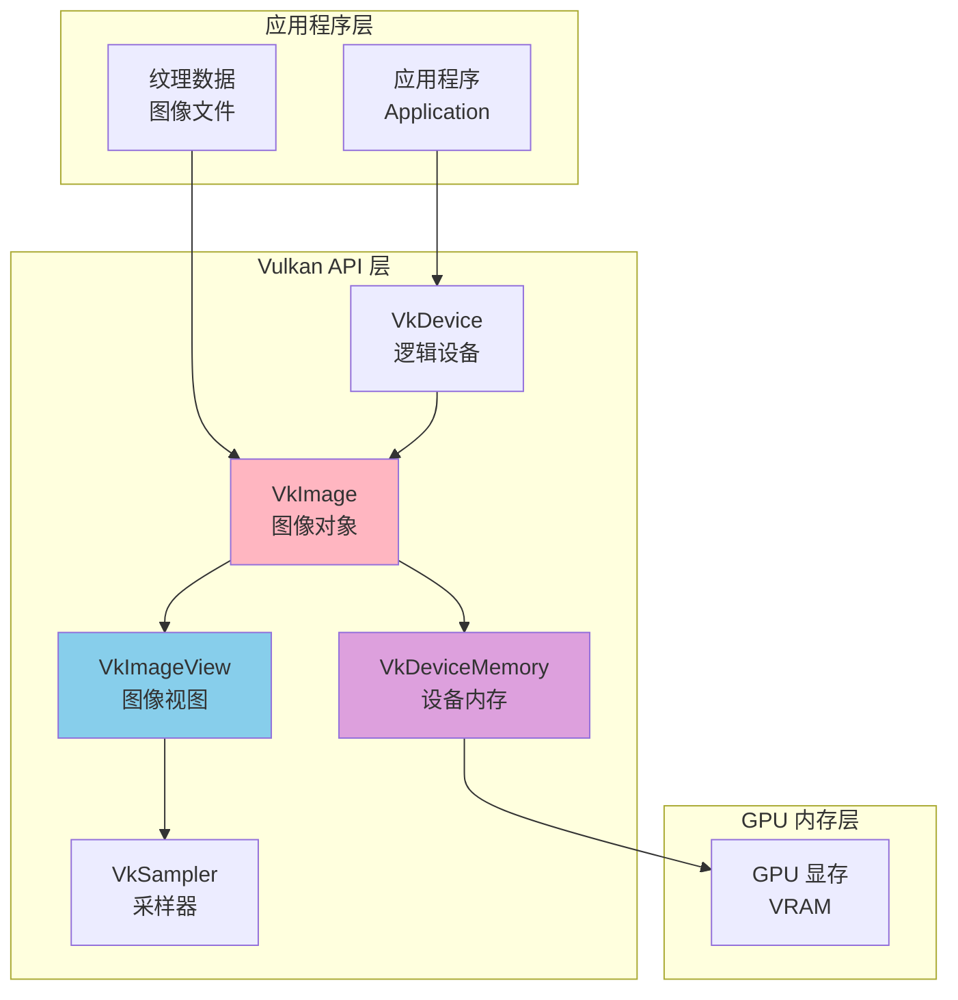

---

## 图像的作用与重要性

### 图像的主要作用

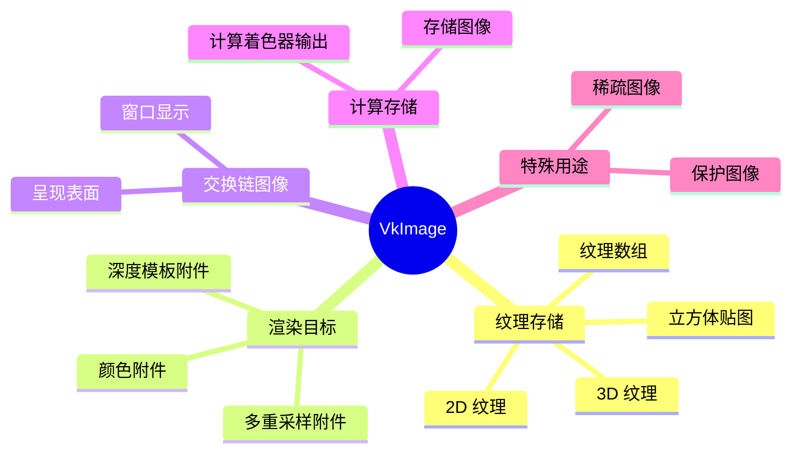

### 图像 vs 缓冲区

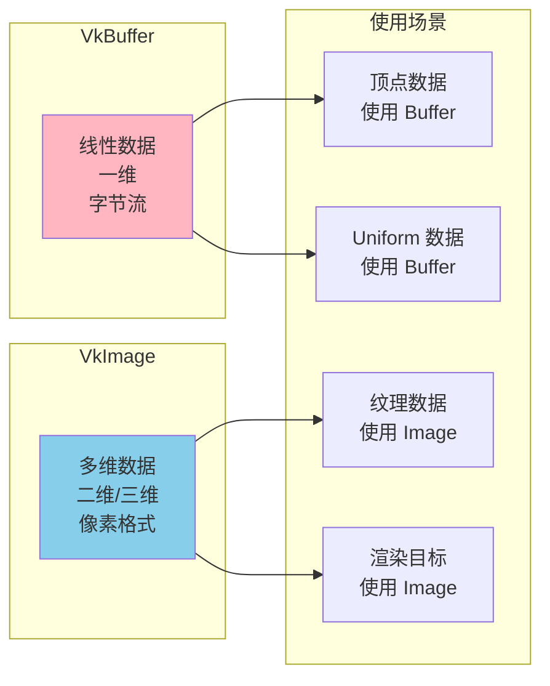

---

## 图像类型与维度

### 图像类型

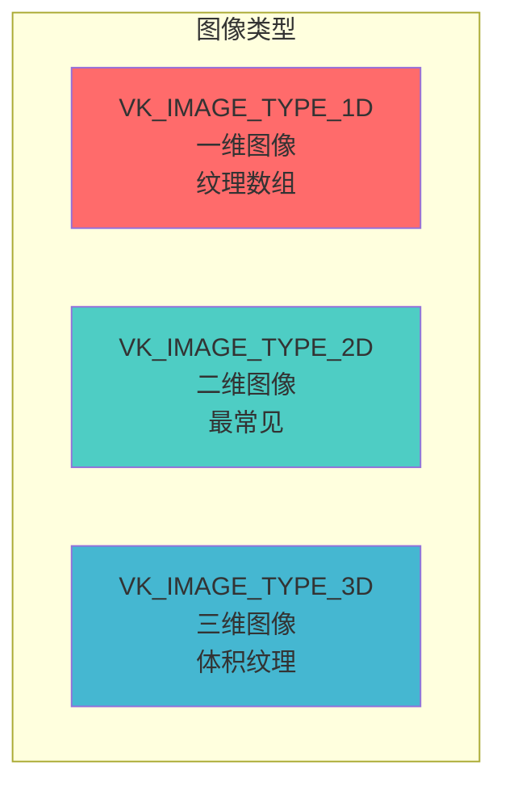

### 1. 一维图像 (1D Image)

**VK_IMAGE_TYPE_1D**:
- 宽度维度
- 通常用于纹理数组
- 较少使用

```cpp
VkImageCreateInfo imageInfo{};
imageInfo.imageType = VK_IMAGE_TYPE_1D;
imageInfo.extent = {width, 1, 1};
```

### 2. 二维图像 (2D Image)

**VK_IMAGE_TYPE_2D**:
- 宽度和高度维度
- 最常见的图像类型
- 用于纹理、渲染目标、交换链图像

```cpp
VkImageCreateInfo imageInfo{};
imageInfo.imageType = VK_IMAGE_TYPE_2D;
imageInfo.extent = {width, height, 1};
```

### 3. 三维图像 (3D Image)

**VK_IMAGE_TYPE_3D**:
- 宽度、高度和深度维度
- 用于体积纹理（Volume Texture）
- 较少使用

```cpp
VkImageCreateInfo imageInfo{};
imageInfo.imageType = VK_IMAGE_TYPE_3D;
imageInfo.extent = {width, height, depth};
```

### 图像维度示例

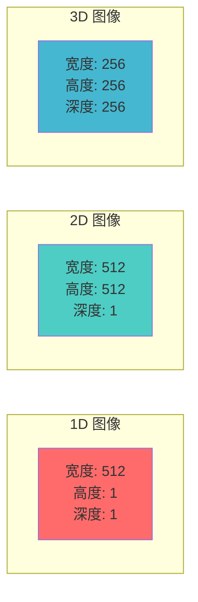

---

## 图像格式

### 常见图像格式

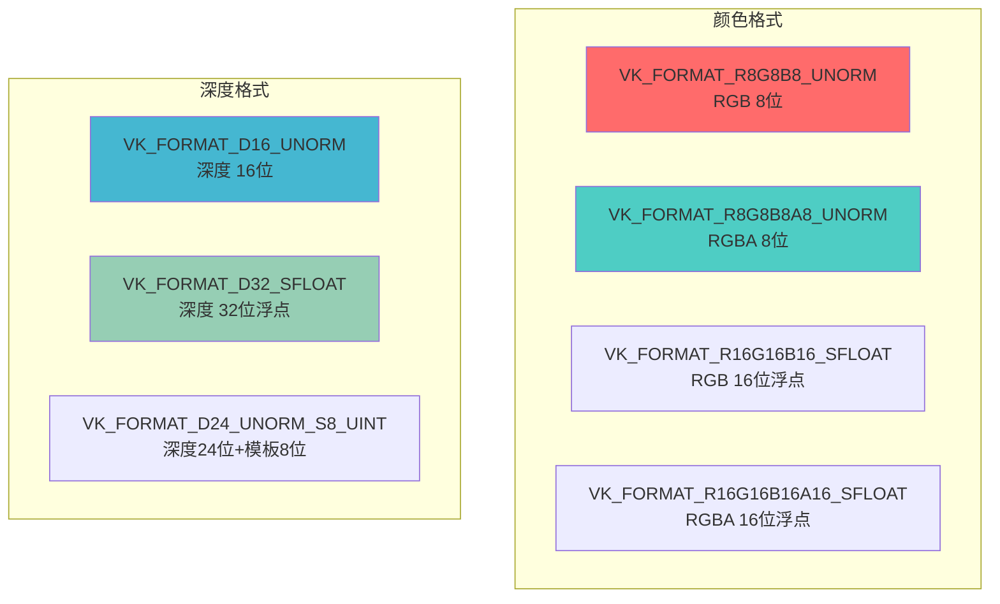

### 格式选择指南

| 用途 | 推荐格式 | 说明 |
|------|---------|------|
| 标准纹理 | R8G8B8A8_UNORM | 8位 RGBA，最常见 |
| HDR 纹理 | R16G16B16A16_SFLOAT | 16位浮点，高动态范围 |
| 法线贴图 | R8G8B8A8_UNORM | 或专用法线格式 |
| 深度缓冲区 | D24_UNORM_S8_UINT | 24位深度 + 8位模板 |
| 仅深度 | D32_SFLOAT | 32位浮点深度 |
| 压缩纹理 | BC1/BC3/BC7 | 块压缩格式 |

### 格式查询

```cpp
// 查询格式支持
VkFormatProperties formatProperties;
vkGetPhysicalDeviceFormatProperties(
    physicalDevice,
    VK_FORMAT_R8G8B8A8_UNORM,
    &formatProperties
);

// 检查线性平铺支持
if (formatProperties.linearTilingFeatures & VK_FORMAT_FEATURE_SAMPLED_IMAGE_BIT) {
    // 支持线性平铺
}

// 检查最优平铺支持
if (formatProperties.optimalTilingFeatures & VK_FORMAT_FEATURE_SAMPLED_IMAGE_BIT) {
    // 支持最优平铺
}
```

---

## 图像使用标志

### VkImageUsageFlags

图像使用标志定义了图像的用途和允许的操作：

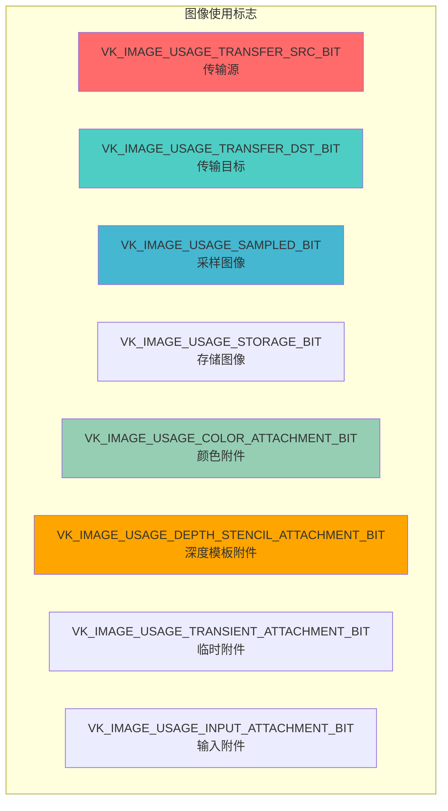

### 1. 传输标志

**VK_IMAGE_USAGE_TRANSFER_SRC_BIT**: 作为传输源
- 可以复制到其他图像或缓冲区

**VK_IMAGE_USAGE_TRANSFER_DST_BIT**: 作为传输目标
- 可以接收从缓冲区或其他图像复制的数据

### 2. 采样图像

**VK_IMAGE_USAGE_SAMPLED_BIT**: 可在着色器中采样
- 用于纹理
- 通过采样器访问

### 3. 存储图像

**VK_IMAGE_USAGE_STORAGE_BIT**: 可在着色器中读写
- 用于计算着色器
- 作为存储图像访问

### 4. 附件标志

**VK_IMAGE_USAGE_COLOR_ATTACHMENT_BIT**: 颜色附件
- 用作渲染目标的颜色缓冲区

**VK_IMAGE_USAGE_DEPTH_STENCIL_ATTACHMENT_BIT**: 深度模板附件
- 用作深度和/或模板缓冲区

**VK_IMAGE_USAGE_INPUT_ATTACHMENT_BIT**: 输入附件
- 在子通道中作为输入读取

**VK_IMAGE_USAGE_TRANSIENT_ATTACHMENT_BIT**: 临时附件
- 可能存储在片上内存中

### 使用标志组合示例

```cpp
// 纹理图像
VkImageUsageFlags textureUsage = 
    VK_IMAGE_USAGE_TRANSFER_DST_BIT |    // 接收数据
    VK_IMAGE_USAGE_SAMPLED_BIT;          // 着色器采样

// 渲染目标
VkImageUsageFlags renderTargetUsage = 
    VK_IMAGE_USAGE_COLOR_ATTACHMENT_BIT |  // 颜色附件
    VK_IMAGE_USAGE_TRANSFER_SRC_BIT;       // 可以复制

// 存储图像
VkImageUsageFlags storageUsage = 
    VK_IMAGE_USAGE_STORAGE_BIT |           // 存储图像
    VK_IMAGE_USAGE_TRANSFER_SRC_BIT |      // 可以复制
    VK_IMAGE_USAGE_TRANSFER_DST_BIT;       // 可以接收数据
```

---

## 图像布局

### 图像布局概述

图像布局定义了图像数据在内存中的组织方式。不同的布局针对不同的操作进行了优化。

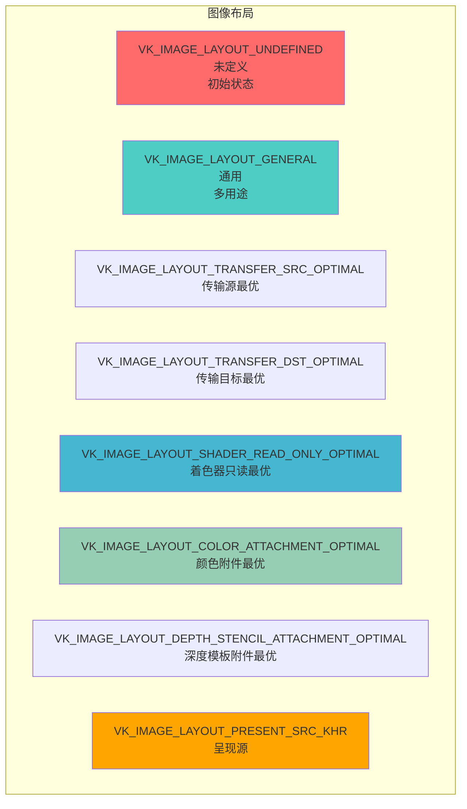

### 常见布局说明

| 布局 | 用途 | 说明 |
|------|------|------|
| UNDEFINED | 初始状态 | 数据未定义，可以丢弃 |
| GENERAL | 通用 | 多用途，性能可能不是最优 |
| TRANSFER_SRC_OPTIMAL | 传输源 | 优化复制操作 |
| TRANSFER_DST_OPTIMAL | 传输目标 | 优化接收数据 |
| SHADER_READ_ONLY_OPTIMAL | 纹理采样 | 优化着色器读取 |
| COLOR_ATTACHMENT_OPTIMAL | 颜色附件 | 优化颜色写入 |
| DEPTH_STENCIL_ATTACHMENT_OPTIMAL | 深度模板 | 优化深度/模板写入 |
| PRESENT_SRC_KHR | 呈现 | 交换链呈现 |

### 布局转换流程

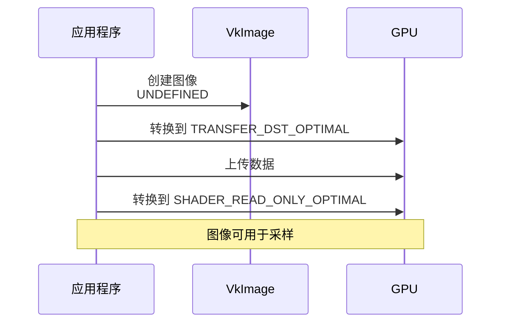

---

## 图像平铺

### 平铺模式

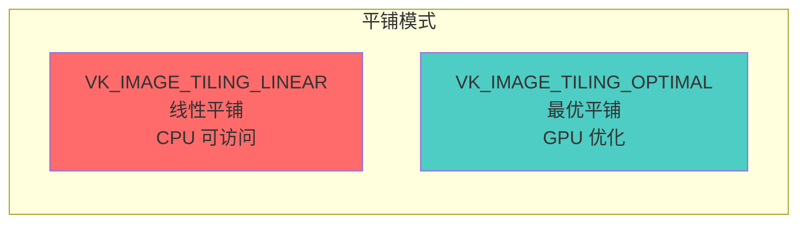

### 1. 线性平铺 (Linear Tiling)

**VK_IMAGE_TILING_LINEAR**:
- 数据按行存储
- CPU 可以映射和访问
- GPU 访问性能较差
- 适合需要 CPU 访问的图像

**特点**:
- ✅ CPU 可以直接访问
- ✅ 适合频繁更新的图像
- ❌ GPU 性能较差
- ❌ 格式支持有限

### 2. 最优平铺 (Optimal Tiling)

**VK_IMAGE_TILING_OPTIMAL**:
- GPU 优化的内存布局
- CPU 无法直接访问
- 最佳 GPU 性能
- 大多数图像使用此模式

**特点**:
- ✅ 最佳 GPU 性能
- ✅ 支持所有格式
- ❌ CPU 无法直接访问
- ❌ 需要通过暂存缓冲区传输

### 平铺模式选择

```cpp
// 需要 CPU 访问 → 线性平铺
VkImageTiling tiling = VK_IMAGE_TILING_LINEAR;

// 标准纹理/渲染目标 → 最优平铺
VkImageTiling tiling = VK_IMAGE_TILING_OPTIMAL;
```

---

## 图像创建流程

### 完整创建流程

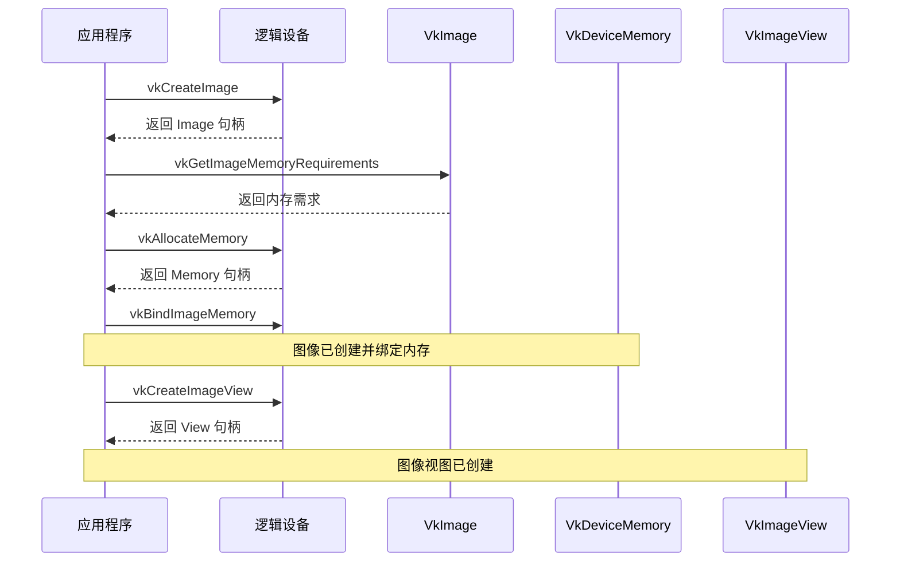

### 步骤 1: 创建图像对象

```cpp
VkImageCreateInfo imageInfo{};
imageInfo.sType = VK_STRUCTURE_TYPE_IMAGE_CREATE_INFO;
imageInfo.imageType = VK_IMAGE_TYPE_2D;                    // 2D 图像
imageInfo.format = VK_FORMAT_R8G8B8A8_UNORM;              // RGBA 格式
imageInfo.extent.width = width;                           // 宽度
imageInfo.extent.height = height;                          // 高度
imageInfo.extent.depth = 1;                               // 深度
imageInfo.mipLevels = 1;                                  // Mip 级别数
imageInfo.arrayLayers = 1;                                // 数组层数
imageInfo.samples = VK_SAMPLE_COUNT_1_BIT;                // 采样数
imageInfo.tiling = VK_IMAGE_TILING_OPTIMAL;               // 最优平铺
imageInfo.usage = VK_IMAGE_USAGE_SAMPLED_BIT |            // 使用标志
                  VK_IMAGE_USAGE_TRANSFER_DST_BIT;
imageInfo.sharingMode = VK_SHARING_MODE_EXCLUSIVE;        // 独占模式
imageInfo.initialLayout = VK_IMAGE_LAYOUT_UNDEFINED;      // 初始布局

VkImage image;
VkResult result = vkCreateImage(device, &imageInfo, nullptr, &image);
if (result != VK_SUCCESS) {
    throw std::runtime_error("failed to create image!");
}
```

### 步骤 2: 查询内存需求

```cpp
VkMemoryRequirements memRequirements;
vkGetImageMemoryRequirements(device, image, &memRequirements);

// memRequirements 包含：
// - size: 所需内存大小
// - alignment: 内存对齐要求
// - memoryTypeBits: 支持的内存类型位掩码
```

### 步骤 3: 分配和绑定内存

```cpp
// 查找内存类型
VkPhysicalDeviceMemoryProperties memProperties;
vkGetPhysicalDeviceMemoryProperties(physicalDevice, &memProperties);

uint32_t memoryTypeIndex = UINT32_MAX;
for (uint32_t i = 0; i < memProperties.memoryTypeCount; i++) {
    if ((memRequirements.memoryTypeBits & (1 << i)) &&
        (memProperties.memoryTypes[i].propertyFlags & 
         VK_MEMORY_PROPERTY_DEVICE_LOCAL_BIT)) {
        memoryTypeIndex = i;
        break;
    }
}

// 分配内存
VkMemoryAllocateInfo allocInfo{};
allocInfo.sType = VK_STRUCTURE_TYPE_MEMORY_ALLOCATE_INFO;
allocInfo.allocationSize = memRequirements.size;
allocInfo.memoryTypeIndex = memoryTypeIndex;

VkDeviceMemory imageMemory;
vkAllocateMemory(device, &allocInfo, nullptr, &imageMemory);

// 绑定内存
vkBindImageMemory(device, image, imageMemory, 0);
```

### 完整创建函数示例

```cpp
VkResult createImage(
    VkDevice device,
    VkPhysicalDevice physicalDevice,
    uint32_t width,
    uint32_t height,
    VkFormat format,
    VkImageTiling tiling,
    VkImageUsageFlags usage,
    VkMemoryPropertyFlags properties,
    VkImage& image,
    VkDeviceMemory& imageMemory) {
    
    // 1. 创建图像
    VkImageCreateInfo imageInfo{};
    imageInfo.sType = VK_STRUCTURE_TYPE_IMAGE_CREATE_INFO;
    imageInfo.imageType = VK_IMAGE_TYPE_2D;
    imageInfo.extent.width = width;
    imageInfo.extent.height = height;
    imageInfo.extent.depth = 1;
    imageInfo.mipLevels = 1;
    imageInfo.arrayLayers = 1;
    imageInfo.format = format;
    imageInfo.tiling = tiling;
    imageInfo.initialLayout = VK_IMAGE_LAYOUT_UNDEFINED;
    imageInfo.usage = usage;
    imageInfo.samples = VK_SAMPLE_COUNT_1_BIT;
    imageInfo.sharingMode = VK_SHARING_MODE_EXCLUSIVE;
    
    if (vkCreateImage(device, &imageInfo, nullptr, &image) != VK_SUCCESS) {
        return VK_ERROR_INITIALIZATION_FAILED;
    }
    
    // 2. 查询内存需求
    VkMemoryRequirements memRequirements;
    vkGetImageMemoryRequirements(device, image, &memRequirements);
    
    // 3. 查找内存类型
    VkPhysicalDeviceMemoryProperties memProperties;
    vkGetPhysicalDeviceMemoryProperties(physicalDevice, &memProperties);
    
    uint32_t memoryTypeIndex = UINT32_MAX;
    for (uint32_t i = 0; i < memProperties.memoryTypeCount; i++) {
        if ((memRequirements.memoryTypeBits & (1 << i)) &&
            (memProperties.memoryTypes[i].propertyFlags & properties) == properties) {
            memoryTypeIndex = i;
            break;
        }
    }
    
    if (memoryTypeIndex == UINT32_MAX) {
        return VK_ERROR_OUT_OF_DEVICE_MEMORY;
    }
    
    // 4. 分配内存
    VkMemoryAllocateInfo allocInfo{};
    allocInfo.sType = VK_STRUCTURE_TYPE_MEMORY_ALLOCATE_INFO;
    allocInfo.allocationSize = memRequirements.size;
    allocInfo.memoryTypeIndex = memoryTypeIndex;
    
    if (vkAllocateMemory(device, &allocInfo, nullptr, &imageMemory) != VK_SUCCESS) {
        return VK_ERROR_OUT_OF_DEVICE_MEMORY;
    }
    
    // 5. 绑定内存
    return vkBindImageMemory(device, image, imageMemory, 0);
}
```

---

## 图像视图 (ImageView)

### 什么是图像视图？

**VkImageView** 是图像的视图，定义了如何访问图像数据。一个图像可以创建多个视图，每个视图可以有不同的格式、Mip 级别范围等。

### 图像视图的作用

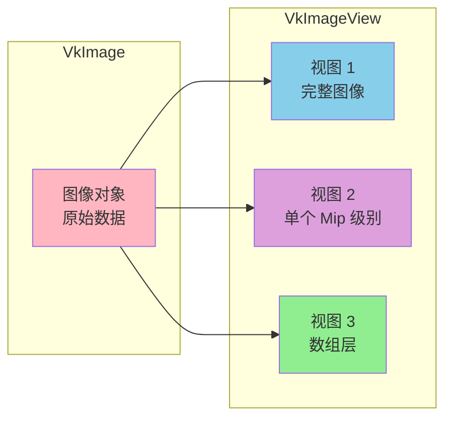

### 创建图像视图

```cpp
VkImageViewCreateInfo viewInfo{};
viewInfo.sType = VK_STRUCTURE_TYPE_IMAGE_VIEW_CREATE_INFO;
viewInfo.image = image;                                    // 图像对象
viewInfo.viewType = VK_IMAGE_VIEW_TYPE_2D;                 // 视图类型
viewInfo.format = VK_FORMAT_R8G8B8A8_UNORM;               // 格式
viewInfo.subresourceRange.aspectMask = VK_IMAGE_ASPECT_COLOR_BIT;  // 颜色方面
viewInfo.subresourceRange.baseMipLevel = 0;               // 起始 Mip 级别
viewInfo.subresourceRange.levelCount = 1;                  // Mip 级别数
viewInfo.subresourceRange.baseArrayLayer = 0;             // 起始数组层
viewInfo.subresourceRange.layerCount = 1;                 // 数组层数

VkImageView imageView;
VkResult result = vkCreateImageView(device, &viewInfo, nullptr, &imageView);
```

### 视图类型

| 视图类型 | 说明 | 用途 |
|---------|------|------|
| VK_IMAGE_VIEW_TYPE_1D | 1D 视图 | 1D 纹理 |
| VK_IMAGE_VIEW_TYPE_2D | 2D 视图 | 2D 纹理 |
| VK_IMAGE_VIEW_TYPE_3D | 3D 视图 | 3D 纹理 |
| VK_IMAGE_VIEW_TYPE_CUBE | 立方体视图 | 立方体贴图 |
| VK_IMAGE_VIEW_TYPE_1D_ARRAY | 1D 数组视图 | 1D 纹理数组 |
| VK_IMAGE_VIEW_TYPE_2D_ARRAY | 2D 数组视图 | 2D 纹理数组 |
| VK_IMAGE_VIEW_TYPE_CUBE_ARRAY | 立方体数组视图 | 立方体贴图数组 |

### 图像方面 (Aspect)

```cpp
// 颜色方面
VK_IMAGE_ASPECT_COLOR_BIT

// 深度方面
VK_IMAGE_ASPECT_DEPTH_BIT

// 模板方面
VK_IMAGE_ASPECT_STENCIL_BIT

// 深度和模板
VK_IMAGE_ASPECT_DEPTH_BIT | VK_IMAGE_ASPECT_STENCIL_BIT
```

---

## 图像内存管理

### 内存类型选择

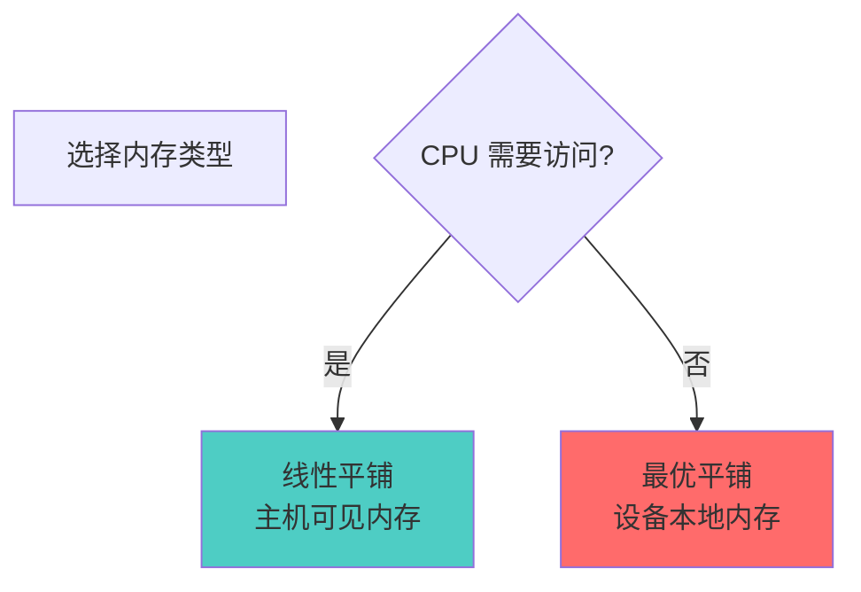

### 内存分配策略

**设备本地内存** (推荐):
- 用于纹理、渲染目标
- 最佳 GPU 性能
- 需要通过暂存缓冲区上传数据

**主机可见内存**:
- 用于需要 CPU 访问的图像
- 性能较差
- 适合频繁更新的小图像

---

## 图像布局转换

### 布局转换的必要性

图像布局转换是 Vulkan 中重要的概念。不同的操作需要不同的布局，必须通过内存屏障进行转换。

### 布局转换示例

```cpp
void transitionImageLayout(
    VkCommandBuffer commandBuffer,
    VkImage image,
    VkImageLayout oldLayout,
    VkImageLayout newLayout,
    VkImageSubresourceRange subresourceRange) {
    
    VkImageMemoryBarrier barrier{};
    barrier.sType = VK_STRUCTURE_TYPE_IMAGE_MEMORY_BARRIER;
    barrier.oldLayout = oldLayout;
    barrier.newLayout = newLayout;
    barrier.srcQueueFamilyIndex = VK_QUEUE_FAMILY_IGNORED;
    barrier.dstQueueFamilyIndex = VK_QUEUE_FAMILY_IGNORED;
    barrier.image = image;
    barrier.subresourceRange = subresourceRange;
    
    // 设置访问掩码和管线阶段
    VkPipelineStageFlags sourceStage;
    VkPipelineStageFlags destinationStage;
    
    if (oldLayout == VK_IMAGE_LAYOUT_UNDEFINED && 
        newLayout == VK_IMAGE_LAYOUT_TRANSFER_DST_OPTIMAL) {
        barrier.srcAccessMask = 0;
        barrier.dstAccessMask = VK_ACCESS_TRANSFER_WRITE_BIT;
        
        sourceStage = VK_PIPELINE_STAGE_TOP_OF_PIPE_BIT;
        destinationStage = VK_PIPELINE_STAGE_TRANSFER_BIT;
    } else if (oldLayout == VK_IMAGE_LAYOUT_TRANSFER_DST_OPTIMAL && 
               newLayout == VK_IMAGE_LAYOUT_SHADER_READ_ONLY_OPTIMAL) {
        barrier.srcAccessMask = VK_ACCESS_TRANSFER_WRITE_BIT;
        barrier.dstAccessMask = VK_ACCESS_SHADER_READ_BIT;
        
        sourceStage = VK_PIPELINE_STAGE_TRANSFER_BIT;
        destinationStage = VK_PIPELINE_STAGE_FRAGMENT_SHADER_BIT;
    } else {
        throw std::invalid_argument("unsupported layout transition!");
    }
    
    vkCmdPipelineBarrier(
        commandBuffer,
        sourceStage, destinationStage,
        0,
        0, nullptr,
        0, nullptr,
        1, &barrier
    );
}
```

### 常见布局转换路径

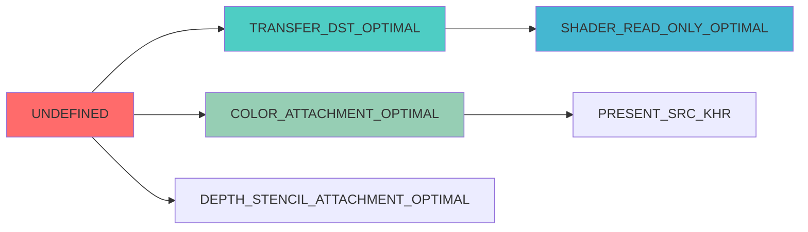

---

## 图像复制与传输

### 从缓冲区复制到图像

```cpp
void copyBufferToImage(
    VkCommandBuffer commandBuffer,
    VkBuffer buffer,
    VkImage image,
    uint32_t width,
    uint32_t height) {
    
    VkBufferImageCopy region{};
    region.bufferOffset = 0;
    region.bufferRowLength = 0;                    // 0 表示紧密打包
    region.bufferImageHeight = 0;
    region.imageSubresource.aspectMask = VK_IMAGE_ASPECT_COLOR_BIT;
    region.imageSubresource.mipLevel = 0;
    region.imageSubresource.baseArrayLayer = 0;
    region.imageSubresource.layerCount = 1;
    region.imageOffset = {0, 0, 0};
    region.imageExtent = {width, height, 1};
    
    vkCmdCopyBufferToImage(
        commandBuffer,
        buffer,
        image,
        VK_IMAGE_LAYOUT_TRANSFER_DST_OPTIMAL,
        1,
        &region
    );
}
```

### 图像到图像复制

```cpp
void copyImage(
    VkCommandBuffer commandBuffer,
    VkImage srcImage,
    VkImage dstImage,
    uint32_t width,
    uint32_t height) {
    
    VkImageCopy copyRegion{};
    copyRegion.srcSubresource.aspectMask = VK_IMAGE_ASPECT_COLOR_BIT;
    copyRegion.srcSubresource.baseArrayLayer = 0;
    copyRegion.srcSubresource.layerCount = 1;
    copyRegion.srcSubresource.mipLevel = 0;
    copyRegion.srcOffset = {0, 0, 0};
    
    copyRegion.dstSubresource.aspectMask = VK_IMAGE_ASPECT_COLOR_BIT;
    copyRegion.dstSubresource.baseArrayLayer = 0;
    copyRegion.dstSubresource.layerCount = 1;
    copyRegion.dstSubresource.mipLevel = 0;
    copyRegion.dstOffset = {0, 0, 0};
    
    copyRegion.extent = {width, height, 1};
    
    vkCmdCopyImage(
        commandBuffer,
        srcImage,
        VK_IMAGE_LAYOUT_TRANSFER_SRC_OPTIMAL,
        dstImage,
        VK_IMAGE_LAYOUT_TRANSFER_DST_OPTIMAL,
        1,
        &copyRegion
    );
}
```

### 图像 Blit（缩放）

```cpp
void blitImage(
    VkCommandBuffer commandBuffer,
    VkImage srcImage,
    VkImage dstImage,
    uint32_t srcWidth, uint32_t srcHeight,
    uint32_t dstWidth, uint32_t dstHeight) {
    
    VkImageBlit blit{};
    blit.srcOffsets[0] = {0, 0, 0};
    blit.srcOffsets[1] = {static_cast<int32_t>(srcWidth), 
                          static_cast<int32_t>(srcHeight), 1};
    blit.srcSubresource.aspectMask = VK_IMAGE_ASPECT_COLOR_BIT;
    blit.srcSubresource.mipLevel = 0;
    blit.srcSubresource.baseArrayLayer = 0;
    blit.srcSubresource.layerCount = 1;
    
    blit.dstOffsets[0] = {0, 0, 0};
    blit.dstOffsets[1] = {static_cast<int32_t>(dstWidth), 
                          static_cast<int32_t>(dstHeight), 1};
    blit.dstSubresource.aspectMask = VK_IMAGE_ASPECT_COLOR_BIT;
    blit.dstSubresource.mipLevel = 0;
    blit.dstSubresource.baseArrayLayer = 0;
    blit.dstSubresource.layerCount = 1;
    
    vkCmdBlitImage(
        commandBuffer,
        srcImage,
        VK_IMAGE_LAYOUT_TRANSFER_SRC_OPTIMAL,
        dstImage,
        VK_IMAGE_LAYOUT_TRANSFER_DST_OPTIMAL,
        1,
        &blit,
        VK_FILTER_LINEAR  // 线性过滤
    );
}
```

---

## Mipmap 与多级纹理

### Mipmap 概念

Mipmap 是图像的多个分辨率级别，用于提高纹理采样性能和减少锯齿。

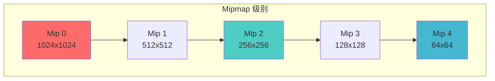

### 生成 Mipmap

```cpp
void generateMipmaps(
    VkCommandBuffer commandBuffer,
    VkImage image,
    int32_t texWidth,
    int32_t texHeight,
    uint32_t mipLevels) {
    
    VkImageMemoryBarrier barrier{};
    barrier.sType = VK_STRUCTURE_TYPE_IMAGE_MEMORY_BARRIER;
    barrier.image = image;
    barrier.srcQueueFamilyIndex = VK_QUEUE_FAMILY_IGNORED;
    barrier.dstQueueFamilyIndex = VK_QUEUE_FAMILY_IGNORED;
    barrier.subresourceRange.aspectMask = VK_IMAGE_ASPECT_COLOR_BIT;
    barrier.subresourceRange.baseArrayLayer = 0;
    barrier.subresourceRange.layerCount = 1;
    barrier.subresourceRange.levelCount = 1;
    
    int32_t mipWidth = texWidth;
    int32_t mipHeight = texHeight;
    
    for (uint32_t i = 1; i < mipLevels; i++) {
        barrier.subresourceRange.baseMipLevel = i - 1;
        barrier.oldLayout = VK_IMAGE_LAYOUT_TRANSFER_DST_OPTIMAL;
        barrier.newLayout = VK_IMAGE_LAYOUT_TRANSFER_SRC_OPTIMAL;
        barrier.srcAccessMask = VK_ACCESS_TRANSFER_WRITE_BIT;
        barrier.dstAccessMask = VK_ACCESS_TRANSFER_READ_BIT;
        
        vkCmdPipelineBarrier(commandBuffer,
            VK_PIPELINE_STAGE_TRANSFER_BIT,
            VK_PIPELINE_STAGE_TRANSFER_BIT,
            0,
            0, nullptr,
            0, nullptr,
            1, &barrier);
        
        VkImageBlit blit{};
        blit.srcOffsets[0] = {0, 0, 0};
        blit.srcOffsets[1] = {mipWidth, mipHeight, 1};
        blit.srcSubresource.aspectMask = VK_IMAGE_ASPECT_COLOR_BIT;
        blit.srcSubresource.mipLevel = i - 1;
        blit.srcSubresource.baseArrayLayer = 0;
        blit.srcSubresource.layerCount = 1;
        blit.dstOffsets[0] = {0, 0, 0};
        blit.dstOffsets[1] = {mipWidth > 1 ? mipWidth / 2 : 1, 
                              mipHeight > 1 ? mipHeight / 2 : 1, 1};
        blit.dstSubresource.aspectMask = VK_IMAGE_ASPECT_COLOR_BIT;
        blit.dstSubresource.mipLevel = i;
        blit.dstSubresource.baseArrayLayer = 0;
        blit.dstSubresource.layerCount = 1;
        
        vkCmdBlitImage(commandBuffer,
            image, VK_IMAGE_LAYOUT_TRANSFER_SRC_OPTIMAL,
            image, VK_IMAGE_LAYOUT_TRANSFER_DST_OPTIMAL,
            1, &blit,
            VK_FILTER_LINEAR);
        
        barrier.oldLayout = VK_IMAGE_LAYOUT_TRANSFER_SRC_OPTIMAL;
        barrier.newLayout = VK_IMAGE_LAYOUT_SHADER_READ_ONLY_OPTIMAL;
        barrier.srcAccessMask = VK_ACCESS_TRANSFER_READ_BIT;
        barrier.dstAccessMask = VK_ACCESS_SHADER_READ_BIT;
        
        vkCmdPipelineBarrier(commandBuffer,
            VK_PIPELINE_STAGE_TRANSFER_BIT,
            VK_PIPELINE_STAGE_FRAGMENT_SHADER_BIT,
            0,
            0, nullptr,
            0, nullptr,
            1, &barrier);
        
        if (mipWidth > 1) mipWidth /= 2;
        if (mipHeight > 1) mipHeight /= 2;
    }
    
    // 转换最后一个 Mip 级别
    barrier.subresourceRange.baseMipLevel = mipLevels - 1;
    barrier.oldLayout = VK_IMAGE_LAYOUT_TRANSFER_DST_OPTIMAL;
    barrier.newLayout = VK_IMAGE_LAYOUT_SHADER_READ_ONLY_OPTIMAL;
    barrier.srcAccessMask = VK_ACCESS_TRANSFER_WRITE_BIT;
    barrier.dstAccessMask = VK_ACCESS_SHADER_READ_BIT;
    
    vkCmdPipelineBarrier(commandBuffer,
        VK_PIPELINE_STAGE_TRANSFER_BIT,
        VK_PIPELINE_STAGE_FRAGMENT_SHADER_BIT,
        0,
        0, nullptr,
        0, nullptr,
        1, &barrier);
}
```

---

## 实际代码示例

### 示例 1: 创建纹理图像

```cpp
class Texture {
private:
    VkDevice device;
    VkPhysicalDevice physicalDevice;
    VkImage image;
    VkDeviceMemory memory;
    VkImageView view;
    uint32_t width, height;
    uint32_t mipLevels;
    
public:
    void createTexture(
        uint32_t texWidth,
        uint32_t texHeight,
        void* pixels) {
        
        width = texWidth;
        height = texHeight;
        mipLevels = static_cast<uint32_t>(
            std::floor(std::log2(std::max(width, height)))) + 1;
        
        // 1. 创建暂存缓冲区
        VkDeviceSize imageSize = width * height * 4;  // RGBA
        VkBuffer stagingBuffer;
        VkDeviceMemory stagingMemory;
        
        createBuffer(
            device, physicalDevice,
            imageSize,
            VK_BUFFER_USAGE_TRANSFER_SRC_BIT,
            VK_MEMORY_PROPERTY_HOST_VISIBLE_BIT | 
            VK_MEMORY_PROPERTY_HOST_COHERENT_BIT,
            stagingBuffer, stagingMemory
        );
        
        // 2. 上传数据到暂存缓冲区
        void* data;
        vkMapMemory(device, stagingMemory, 0, imageSize, 0, &data);
        memcpy(data, pixels, imageSize);
        vkUnmapMemory(device, stagingMemory);
        
        // 3. 创建图像
        VkImageCreateInfo imageInfo{};
        imageInfo.sType = VK_STRUCTURE_TYPE_IMAGE_CREATE_INFO;
        imageInfo.imageType = VK_IMAGE_TYPE_2D;
        imageInfo.extent.width = width;
        imageInfo.extent.height = height;
        imageInfo.extent.depth = 1;
        imageInfo.mipLevels = mipLevels;
        imageInfo.arrayLayers = 1;
        imageInfo.format = VK_FORMAT_R8G8B8A8_UNORM;
        imageInfo.tiling = VK_IMAGE_TILING_OPTIMAL;
        imageInfo.initialLayout = VK_IMAGE_LAYOUT_UNDEFINED;
        imageInfo.usage = VK_IMAGE_USAGE_TRANSFER_SRC_BIT |
                          VK_IMAGE_USAGE_TRANSFER_DST_BIT |
                          VK_IMAGE_USAGE_SAMPLED_BIT;
        imageInfo.samples = VK_SAMPLE_COUNT_1_BIT;
        imageInfo.sharingMode = VK_SHARING_MODE_EXCLUSIVE;
        
        vkCreateImage(device, &imageInfo, nullptr, &image);
        
        // 4. 分配内存
        VkMemoryRequirements memRequirements;
        vkGetImageMemoryRequirements(device, image, &memRequirements);
        
        VkMemoryAllocateInfo allocInfo{};
        allocInfo.sType = VK_STRUCTURE_TYPE_MEMORY_ALLOCATE_INFO;
        allocInfo.allocationSize = memRequirements.size;
        allocInfo.memoryTypeIndex = findMemoryType(
            memRequirements.memoryTypeBits,
            VK_MEMORY_PROPERTY_DEVICE_LOCAL_BIT
        );
        
        vkAllocateMemory(device, &allocInfo, nullptr, &memory);
        vkBindImageMemory(device, image, memory, 0);
        
        // 5. 转换布局并复制数据
        VkCommandBuffer commandBuffer = beginSingleTimeCommands();
        
        transitionImageLayout(
            commandBuffer,
            image,
            VK_IMAGE_LAYOUT_UNDEFINED,
            VK_IMAGE_LAYOUT_TRANSFER_DST_OPTIMAL,
            {VK_IMAGE_ASPECT_COLOR_BIT, 0, mipLevels, 0, 1}
        );
        
        copyBufferToImage(commandBuffer, stagingBuffer, image, width, height);
        
        // 6. 生成 Mipmap
        generateMipmaps(commandBuffer, image, width, height, mipLevels);
        
        endSingleTimeCommands(commandBuffer);
        
        // 7. 创建图像视图
        VkImageViewCreateInfo viewInfo{};
        viewInfo.sType = VK_STRUCTURE_TYPE_IMAGE_VIEW_CREATE_INFO;
        viewInfo.image = image;
        viewInfo.viewType = VK_IMAGE_VIEW_TYPE_2D;
        viewInfo.format = VK_FORMAT_R8G8B8A8_UNORM;
        viewInfo.subresourceRange.aspectMask = VK_IMAGE_ASPECT_COLOR_BIT;
        viewInfo.subresourceRange.baseMipLevel = 0;
        viewInfo.subresourceRange.levelCount = mipLevels;
        viewInfo.subresourceRange.baseArrayLayer = 0;
        viewInfo.subresourceRange.layerCount = 1;
        
        vkCreateImageView(device, &viewInfo, nullptr, &view);
        
        // 8. 清理暂存缓冲区
        vkDestroyBuffer(device, stagingBuffer, nullptr);
        vkFreeMemory(device, stagingMemory, nullptr);
    }
    
    void destroy() {
        vkDestroyImageView(device, view, nullptr);
        vkDestroyImage(device, image, nullptr);
        vkFreeMemory(device, memory, nullptr);
    }
};
```

### 示例 2: 创建深度图像

```cpp
void createDepthImage(
    VkDevice device,
    VkPhysicalDevice physicalDevice,
    uint32_t width,
    uint32_t height,
    VkImage& depthImage,
    VkDeviceMemory& depthImageMemory,
    VkImageView& depthImageView) {
    
    // 查找深度格式
    VkFormat depthFormat = findDepthFormat(physicalDevice);
    
    // 创建深度图像
    createImage(
        device, physicalDevice,
        width, height,
        depthFormat,
        VK_IMAGE_TILING_OPTIMAL,
        VK_IMAGE_USAGE_DEPTH_STENCIL_ATTACHMENT_BIT,
        VK_MEMORY_PROPERTY_DEVICE_LOCAL_BIT,
        depthImage, depthImageMemory
    );
    
    // 创建深度图像视图
    VkImageViewCreateInfo viewInfo{};
    viewInfo.sType = VK_STRUCTURE_TYPE_IMAGE_VIEW_CREATE_INFO;
    viewInfo.image = depthImage;
    viewInfo.viewType = VK_IMAGE_VIEW_TYPE_2D;
    viewInfo.format = depthFormat;
    viewInfo.subresourceRange.aspectMask = VK_IMAGE_ASPECT_DEPTH_BIT;
    viewInfo.subresourceRange.baseMipLevel = 0;
    viewInfo.subresourceRange.levelCount = 1;
    viewInfo.subresourceRange.baseArrayLayer = 0;
    viewInfo.subresourceRange.layerCount = 1;
    
    vkCreateImageView(device, &viewInfo, nullptr, &depthImageView);
    
    // 转换布局
    VkCommandBuffer commandBuffer = beginSingleTimeCommands();
    
    transitionImageLayout(
        commandBuffer,
        depthImage,
        VK_IMAGE_LAYOUT_UNDEFINED,
        VK_IMAGE_LAYOUT_DEPTH_STENCIL_ATTACHMENT_OPTIMAL,
        {VK_IMAGE_ASPECT_DEPTH_BIT, 0, 1, 0, 1}
    );
    
    endSingleTimeCommands(commandBuffer);
}
```

---

## 最佳实践

### 1. 图像格式选择

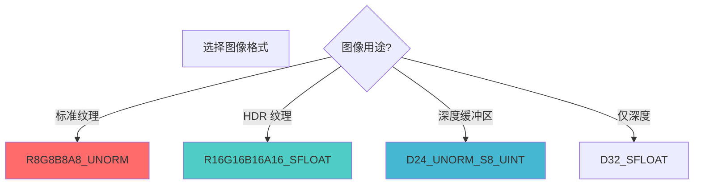

### 2. 布局管理

**DO**:
- ✅ 在操作前转换到正确的布局
- ✅ 使用最优布局（如 SHADER_READ_ONLY_OPTIMAL）
- ✅ 批量转换布局以减少屏障数量

**DON'T**:
- ❌ 忘记转换布局
- ❌ 在错误的布局下使用图像
- ❌ 频繁转换布局

### 3. Mipmap 使用

**建议**:
- ✅ 为纹理生成 Mipmap 以提高性能
- ✅ 使用 `vkCmdBlitImage` 生成 Mipmap
- ✅ 在图像视图中指定正确的 Mip 级别范围

### 4. 内存管理

**建议**:
- ✅ 使用设备本地内存（最优平铺）
- ✅ 通过暂存缓冲区上传数据
- ✅ 批量分配内存以提高效率

### 5. 图像视图管理

**建议**:
- ✅ 为每个用途创建合适的视图
- ✅ 正确设置子资源范围
- ✅ 及时销毁不需要的视图

### 6. 常见陷阱

| 陷阱 | 问题 | 解决方案 |
|------|------|----------|
| 忘记转换布局 | 操作失败或性能差 | 在操作前转换布局 |
| 错误的方面掩码 | 视图创建失败 | 根据格式选择正确的方面 |
| 忘记创建视图 | 无法使用图像 | 创建图像后创建视图 |
| Mip 级别计算错误 | Mipmap 生成失败 | 正确计算 Mip 级别数 |
| 内存类型不匹配 | 分配失败 | 检查内存类型位掩码 |

### 7. 性能优化建议

```cpp
// ✅ 使用最优平铺
VkImageTiling tiling = VK_IMAGE_TILING_OPTIMAL;

// ✅ 批量布局转换
// 一次转换多个图像，而不是逐个转换

// ✅ 使用 Mipmap
// 为纹理生成 Mipmap 以提高采样性能

// ✅ 正确的布局
// 使用针对特定操作优化的布局

// ⚠️ 避免频繁创建/销毁图像
// 在初始化时创建，结束时销毁
```

---

## 总结

### VkImage 关键要点

1. **图像是多维数据对象**: 存储纹理、渲染目标等
2. **需要绑定设备内存**: 创建后必须绑定内存才能使用
3. **布局管理很重要**: 不同操作需要不同的布局
4. **通过视图访问**: 图像视图定义了如何访问图像
5. **格式影响性能**: 选择合适的格式很重要
6. **Mipmap 提高性能**: 为纹理生成 Mipmap
7. **最优平铺最佳性能**: 大多数情况使用最优平铺

### 图像创建流程

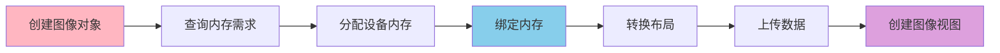

### 图像类型选择指南

| 用途 | 图像类型 | 格式 | 布局 |
|-----|---------|------|------|
| 2D 纹理 | 2D | R8G8B8A8_UNORM | SHADER_READ_ONLY_OPTIMAL |
| 深度缓冲区 | 2D | D24_UNORM_S8_UINT | DEPTH_STENCIL_ATTACHMENT_OPTIMAL |
| 颜色附件 | 2D | R8G8B8A8_UNORM | COLOR_ATTACHMENT_OPTIMAL |
| 存储图像 | 2D | R32G32B32A32_SFLOAT | GENERAL |
| 立方体贴图 | 2D (6层) | R8G8B8A8_UNORM | SHADER_READ_ONLY_OPTIMAL |

### 进一步学习

- 深入了解图像布局和内存屏障
- 学习 Mipmap 生成和优化
- 研究图像格式和压缩
- 探索图像视图和采样器
- 了解稀疏图像和高级特性

---

**文档版本**: 1.0  
**最后更新**: 2024  
**相关文档**: 
- [VkBuffer 详细分析](./VkBuffer详细分析.md)
- [VkQueue 详细分析](./VkQueue详细分析.md)
- [VkPhysicalDevice 详细分析](./VkPhysicalDevice详细分析.md)

