# VkPipeline 详细分析文档

## 目录
1. [VkPipeline 概述](#vkpipeline-概述)
2. [管线的类型](#管线的类型)
3. [图形管线详解](#图形管线详解)
4. [计算管线详解](#计算管线详解)
5. [管线布局 (Pipeline Layout)](#管线布局-pipeline-layout)
6. [管线缓存 (Pipeline Cache)](#管线缓存-pipeline-cache)
7. [管线创建流程](#管线创建流程)
8. [管线状态详解](#管线状态详解)
9. [实际代码示例](#实际代码示例)
10. [最佳实践](#最佳实践)

---

## VkPipeline 概述

### 什么是 VkPipeline？

**VkPipeline** 是 Vulkan 中的管线状态对象（Pipeline State Object, PSO），它封装了渲染或计算所需的所有状态。与 OpenGL 的状态机不同，Vulkan 的管线是预编译的状态集合，在 GPU 上存储和哈希，使得状态切换非常快速。

### VkPipeline 的核心特点

- **状态封装**: 将所有渲染状态封装在一个对象中
- **预编译**: 状态在创建时确定，运行时不能修改（动态状态除外）
- **高性能**: GPU 上缓存和哈希，状态切换快速
- **类型多样**: 图形管线和计算管线
- **可共享**: 管线布局可以在多个管线间共享

### VkPipeline 在 Vulkan 架构中的位置

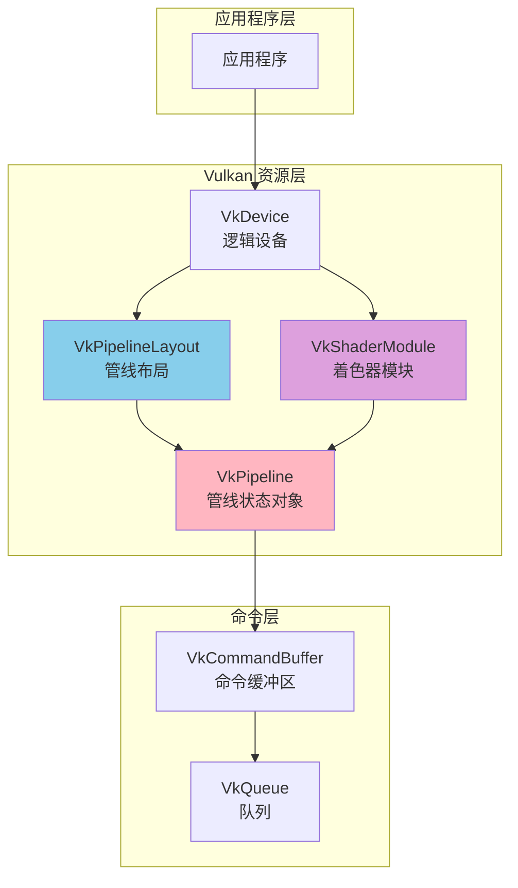

---

## 管线的类型

### 管线类型对比

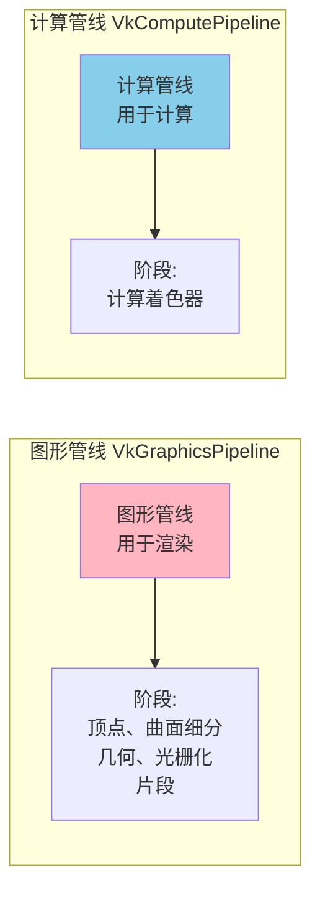

### 管线类型对比表

| 特性 | 图形管线 | 计算管线 |
|------|---------|---------|
| **创建函数** | `vkCreateGraphicsPipelines` | `vkCreateComputePipelines` |
| **用途** | 3D 渲染、图形绘制 | 通用计算、数据处理 |
| **着色器阶段** | 多个阶段（顶点、片段等） | 单个计算着色器 |
| **输入** | 顶点数据 | 缓冲区/图像 |
| **输出** | 帧缓冲区 | 缓冲区/图像 |
| **复杂度** | 高（多个状态） | 低（简单状态） |

---

## 图形管线详解

### 图形管线阶段

```mermaid
graph LR
    subgraph "输入阶段"
        VertexBuffer[顶点缓冲区]
        InputAssembler[输入装配器<br/>Input Assembler]
    end
    
    subgraph "顶点处理"
        VertexShader[顶点着色器<br/>Vertex Shader]
        TessellationControl[曲面细分控制<br/>Tessellation Control]
        TessellationEval[曲面细分计算<br/>Tessellation Evaluation]
        GeometryShader[几何着色器<br/>Geometry Shader]
    end
    
    subgraph "光栅化"
        Rasterization[光栅化<br/>Rasterization]
        FragmentShader[片段着色器<br/>Fragment Shader]
    end
    
    subgraph "输出阶段"
        DepthTest[深度测试<br/>Depth Test]
        StencilTest[模板测试<br/>Stencil Test]
        ColorBlend[颜色混合<br/>Color Blend]
        FrameBuffer[帧缓冲区]
    end
    
    VertexBuffer --> InputAssembler
    InputAssembler --> VertexShader
    VertexShader --> TessellationControl
    TessellationControl --> TessellationEval
    TessellationEval --> GeometryShader
    GeometryShader --> Rasterization
    Rasterization --> FragmentShader
    FragmentShader --> DepthTest
    DepthTest --> StencilTest
    StencilTest --> ColorBlend
    ColorBlend --> FrameBuffer
    
    style VertexShader fill:#FFB6C1
    style FragmentShader fill:#87CEEB
    style Rasterization fill:#DDA0DD
```

### 图形管线数据流

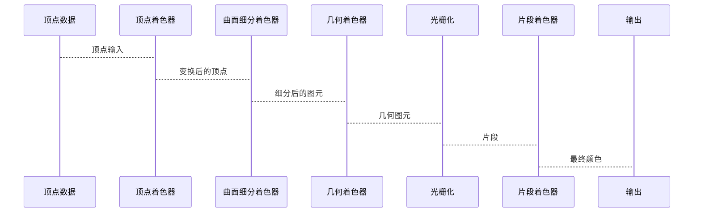

### 图形管线状态组成

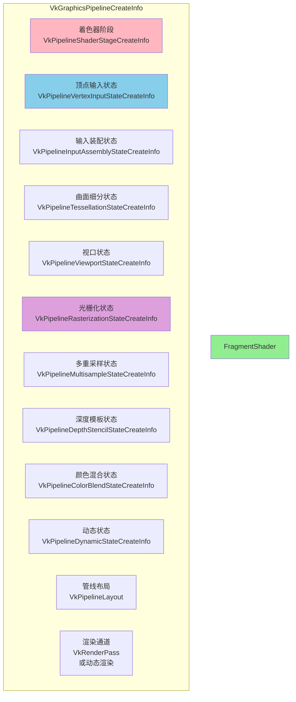

---

## 计算管线详解

### 计算管线结构

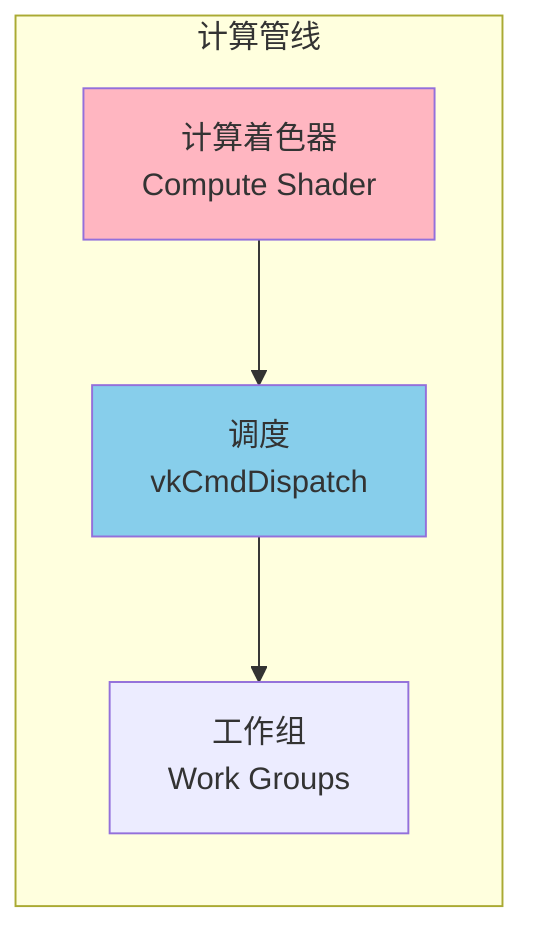

### 计算管线创建

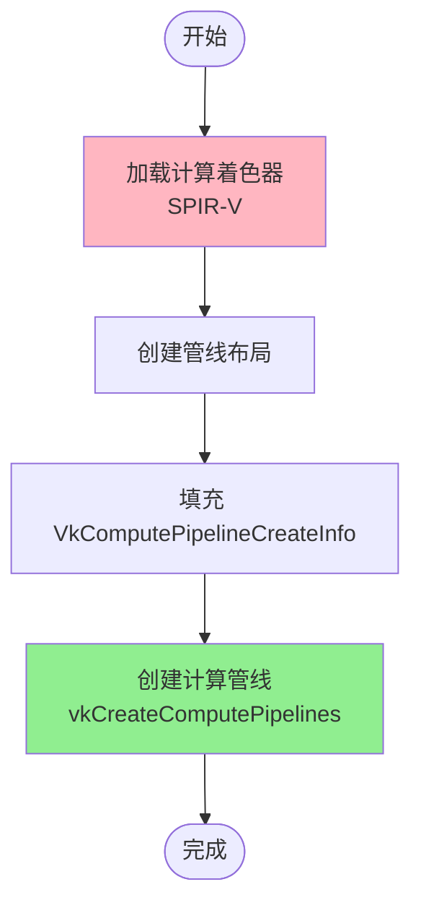

---

## 管线布局 (Pipeline Layout)

### 管线布局的作用

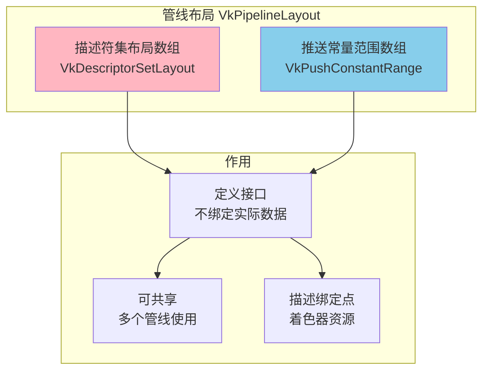

### 管线布局创建

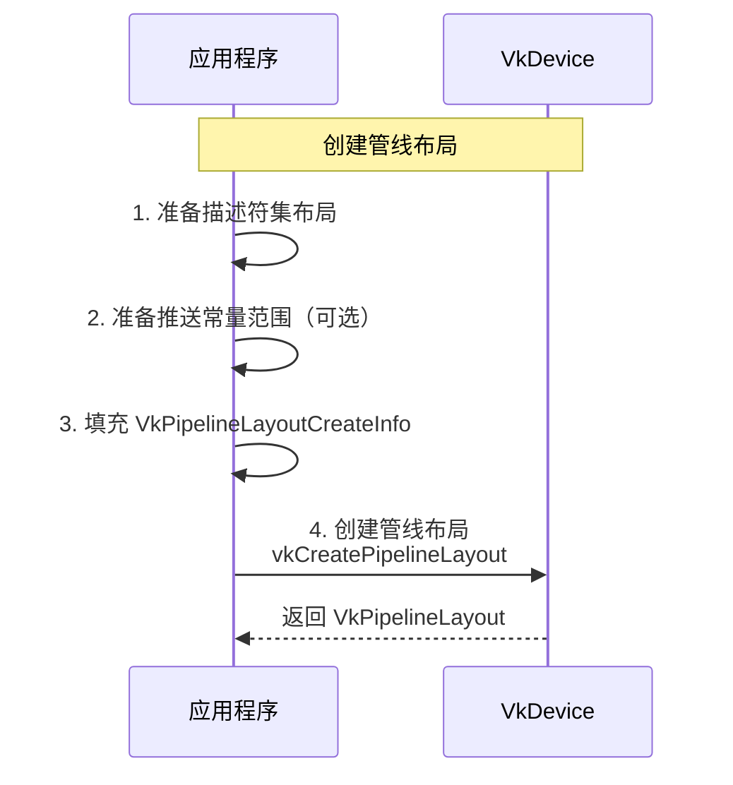

---

## 管线缓存 (Pipeline Cache)

### 管线缓存的作用

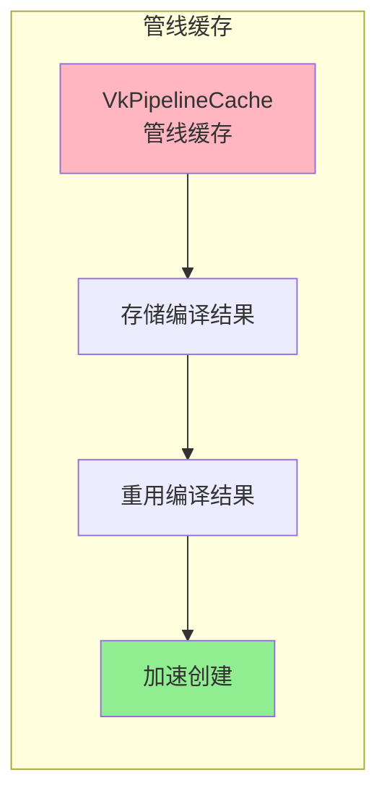

### 管线缓存使用流程

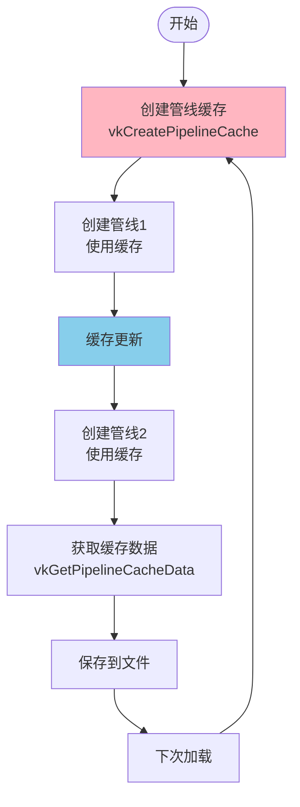

---

## 管线创建流程

### 图形管线创建流程

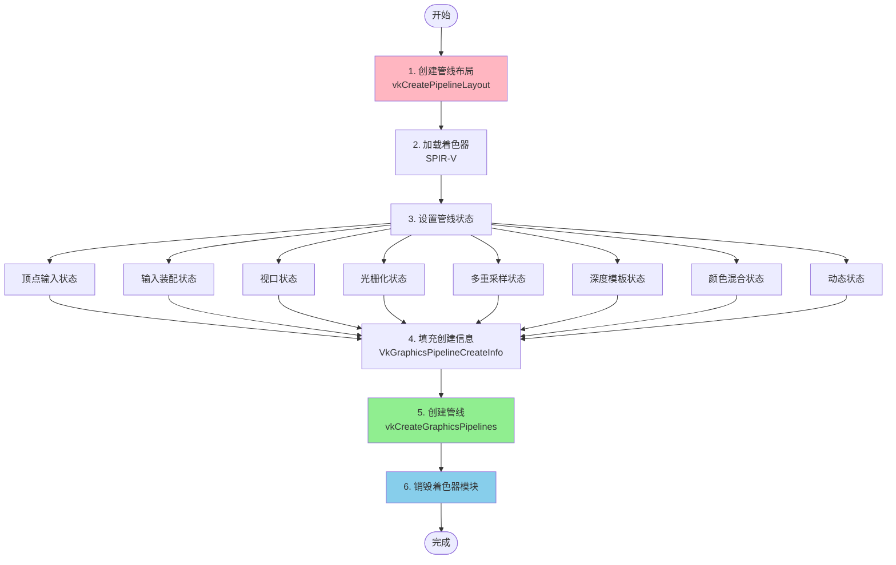

### 计算管线创建流程

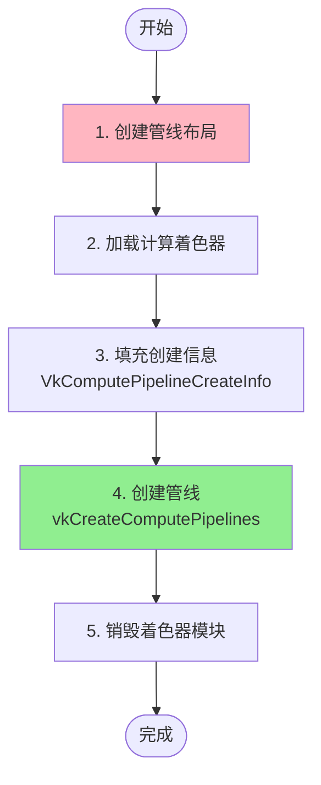

---

## 管线状态详解

### 顶点输入状态

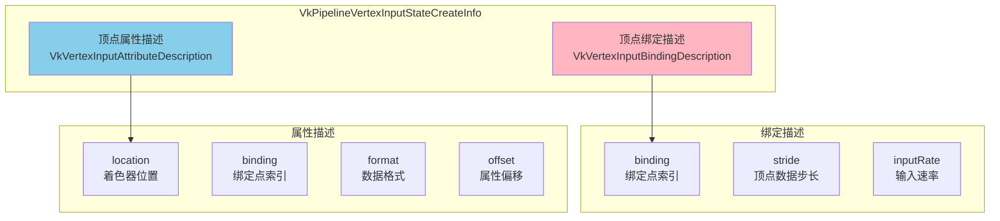

### 输入装配状态

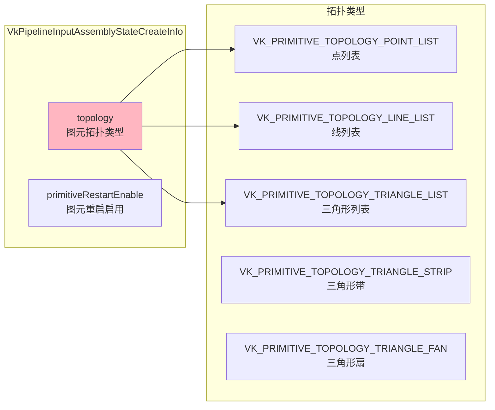

### 光栅化状态

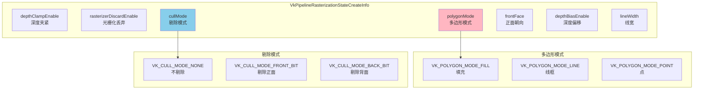

### 深度模板状态

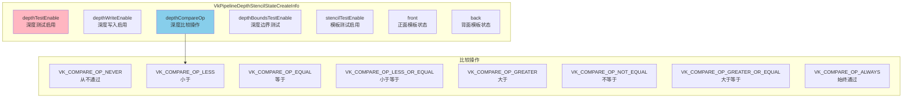

### 颜色混合状态

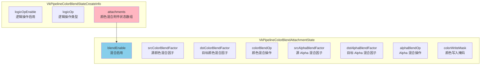

### 动态状态

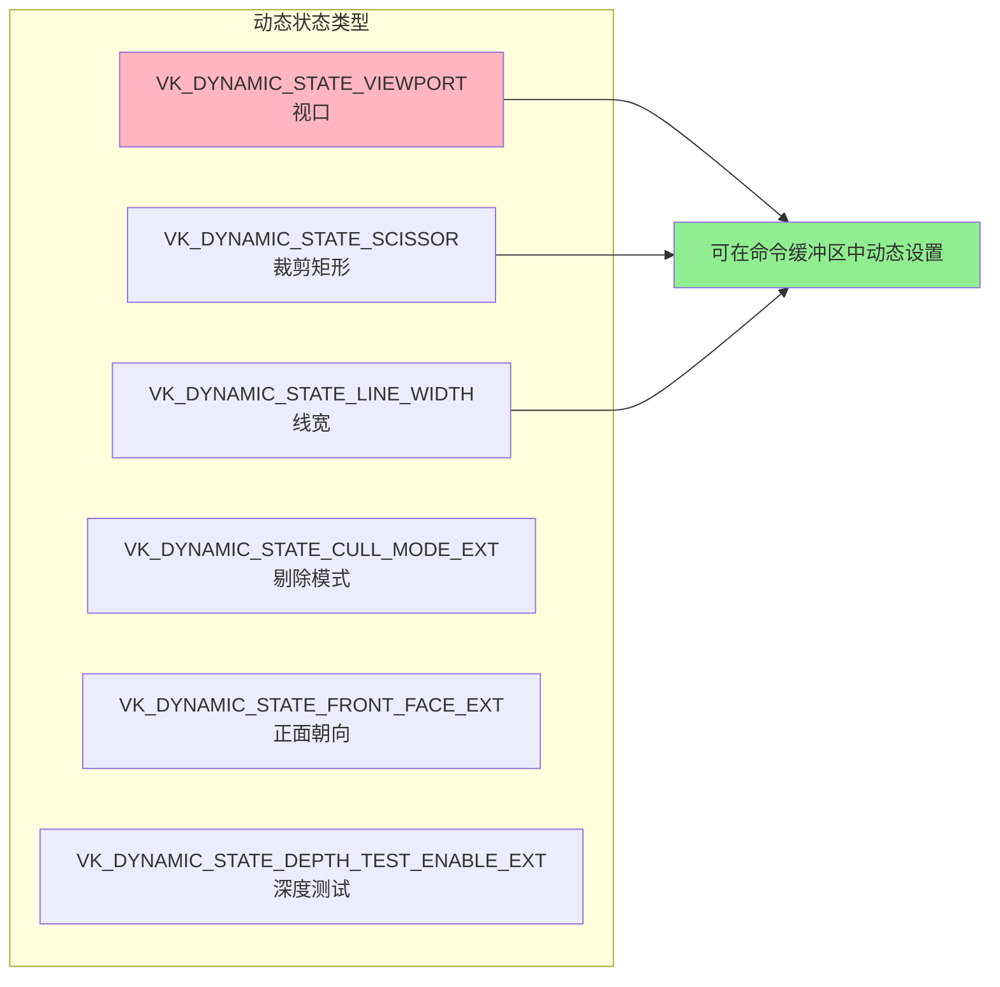

---

## 实际代码示例

### 完整的图形管线创建代码

```cpp
/**
 * @brief 创建图形管线的完整示例
 */
VkResult createGraphicsPipeline(
    VkDevice device,
    VkPipelineCache pipelineCache,
    VkPipelineLayout pipelineLayout,
    VkRenderPass renderPass,
    VkPipeline& pipeline)
{
    // 1. 加载着色器
    VkShaderModule vertexShader = loadSPIRVShader("shader.vert.spv");
    VkShaderModule fragmentShader = loadSPIRVShader("shader.frag.spv");
    
    // 2. 设置着色器阶段
    std::array<VkPipelineShaderStageCreateInfo, 2> shaderStages{};
    
    shaderStages[0].sType = VK_STRUCTURE_TYPE_PIPELINE_SHADER_STAGE_CREATE_INFO;
    shaderStages[0].stage = VK_SHADER_STAGE_VERTEX_BIT;
    shaderStages[0].module = vertexShader;
    shaderStages[0].pName = "main";
    
    shaderStages[1].sType = VK_STRUCTURE_TYPE_PIPELINE_SHADER_STAGE_CREATE_INFO;
    shaderStages[1].stage = VK_SHADER_STAGE_FRAGMENT_BIT;
    shaderStages[1].module = fragmentShader;
    shaderStages[1].pName = "main";
    
    // 3. 顶点输入状态
    VkVertexInputBindingDescription bindingDescription{};
    bindingDescription.binding = 0;
    bindingDescription.stride = sizeof(Vertex);
    bindingDescription.inputRate = VK_VERTEX_INPUT_RATE_VERTEX;
    
    std::array<VkVertexInputAttributeDescription, 2> attributeDescriptions{};
    attributeDescriptions[0].binding = 0;
    attributeDescriptions[0].location = 0;
    attributeDescriptions[0].format = VK_FORMAT_R32G32B32_SFLOAT;
    attributeDescriptions[0].offset = offsetof(Vertex, position);
    
    attributeDescriptions[1].binding = 0;
    attributeDescriptions[1].location = 1;
    attributeDescriptions[1].format = VK_FORMAT_R32G32B32_SFLOAT;
    attributeDescriptions[1].offset = offsetof(Vertex, color);
    
    VkPipelineVertexInputStateCreateInfo vertexInputInfo{};
    vertexInputInfo.sType = VK_STRUCTURE_TYPE_PIPELINE_VERTEX_INPUT_STATE_CREATE_INFO;
    vertexInputInfo.vertexBindingDescriptionCount = 1;
    vertexInputInfo.pVertexBindingDescriptions = &bindingDescription;
    vertexInputInfo.vertexAttributeDescriptionCount = 
        static_cast<uint32_t>(attributeDescriptions.size());
    vertexInputInfo.pVertexAttributeDescriptions = attributeDescriptions.data();
    
    // 4. 输入装配状态
    VkPipelineInputAssemblyStateCreateInfo inputAssembly{};
    inputAssembly.sType = VK_STRUCTURE_TYPE_PIPELINE_INPUT_ASSEMBLY_STATE_CREATE_INFO;
    inputAssembly.topology = VK_PRIMITIVE_TOPOLOGY_TRIANGLE_LIST;
    inputAssembly.primitiveRestartEnable = VK_FALSE;
    
    // 5. 视口状态
    VkPipelineViewportStateCreateInfo viewportState{};
    viewportState.sType = VK_STRUCTURE_TYPE_PIPELINE_VIEWPORT_STATE_CREATE_INFO;
    viewportState.viewportCount = 1;
    viewportState.scissorCount = 1;
    
    // 6. 光栅化状态
    VkPipelineRasterizationStateCreateInfo rasterizer{};
    rasterizer.sType = VK_STRUCTURE_TYPE_PIPELINE_RASTERIZATION_STATE_CREATE_INFO;
    rasterizer.depthClampEnable = VK_FALSE;
    rasterizer.rasterizerDiscardEnable = VK_FALSE;
    rasterizer.polygonMode = VK_POLYGON_MODE_FILL;
    rasterizer.lineWidth = 1.0f;
    rasterizer.cullMode = VK_CULL_MODE_BACK_BIT;
    rasterizer.frontFace = VK_FRONT_FACE_COUNTER_CLOCKWISE;
    rasterizer.depthBiasEnable = VK_FALSE;
    
    // 7. 多重采样状态
    VkPipelineMultisampleStateCreateInfo multisampling{};
    multisampling.sType = VK_STRUCTURE_TYPE_PIPELINE_MULTISAMPLE_STATE_CREATE_INFO;
    multisampling.sampleShadingEnable = VK_FALSE;
    multisampling.rasterizationSamples = VK_SAMPLE_COUNT_1_BIT;
    
    // 8. 深度模板状态
    VkPipelineDepthStencilStateCreateInfo depthStencil{};
    depthStencil.sType = VK_STRUCTURE_TYPE_PIPELINE_DEPTH_STENCIL_STATE_CREATE_INFO;
    depthStencil.depthTestEnable = VK_TRUE;
    depthStencil.depthWriteEnable = VK_TRUE;
    depthStencil.depthCompareOp = VK_COMPARE_OP_LESS;
    depthStencil.depthBoundsTestEnable = VK_FALSE;
    depthStencil.stencilTestEnable = VK_FALSE;
    
    // 9. 颜色混合状态
    VkPipelineColorBlendAttachmentState colorBlendAttachment{};
    colorBlendAttachment.colorWriteMask = 
        VK_COLOR_COMPONENT_R_BIT | VK_COLOR_COMPONENT_G_BIT | 
        VK_COLOR_COMPONENT_B_BIT | VK_COLOR_COMPONENT_A_BIT;
    colorBlendAttachment.blendEnable = VK_FALSE;
    
    VkPipelineColorBlendStateCreateInfo colorBlending{};
    colorBlending.sType = VK_STRUCTURE_TYPE_PIPELINE_COLOR_BLEND_STATE_CREATE_INFO;
    colorBlending.logicOpEnable = VK_FALSE;
    colorBlending.attachmentCount = 1;
    colorBlending.pAttachments = &colorBlendAttachment;
    
    // 10. 动态状态
    std::vector<VkDynamicState> dynamicStates = {
        VK_DYNAMIC_STATE_VIEWPORT,
        VK_DYNAMIC_STATE_SCISSOR
    };
    
    VkPipelineDynamicStateCreateInfo dynamicState{};
    dynamicState.sType = VK_STRUCTURE_TYPE_PIPELINE_DYNAMIC_STATE_CREATE_INFO;
    dynamicState.dynamicStateCount = static_cast<uint32_t>(dynamicStates.size());
    dynamicState.pDynamicStates = dynamicStates.data();
    
    // 11. 图形管线创建信息
    VkGraphicsPipelineCreateInfo pipelineInfo{};
    pipelineInfo.sType = VK_STRUCTURE_TYPE_GRAPHICS_PIPELINE_CREATE_INFO;
    pipelineInfo.stageCount = static_cast<uint32_t>(shaderStages.size());
    pipelineInfo.pStages = shaderStages.data();
    pipelineInfo.pVertexInputState = &vertexInputInfo;
    pipelineInfo.pInputAssemblyState = &inputAssembly;
    pipelineInfo.pViewportState = &viewportState;
    pipelineInfo.pRasterizationState = &rasterizer;
    pipelineInfo.pMultisampleState = &multisampling;
    pipelineInfo.pDepthStencilState = &depthStencil;
    pipelineInfo.pColorBlendState = &colorBlending;
    pipelineInfo.pDynamicState = &dynamicState;
    pipelineInfo.layout = pipelineLayout;
    pipelineInfo.renderPass = renderPass;
    pipelineInfo.subpass = 0;
    pipelineInfo.basePipelineHandle = VK_NULL_HANDLE;
    
    // 12. 创建图形管线
    VkResult result = vkCreateGraphicsPipelines(
        device, pipelineCache, 1, &pipelineInfo, nullptr, &pipeline);
    
    // 13. 销毁着色器模块
    vkDestroyShaderModule(device, vertexShader, nullptr);
    vkDestroyShaderModule(device, fragmentShader, nullptr);
    
    return result;
}
```

### 计算管线创建代码

```cpp
/**
 * @brief 创建计算管线的完整示例
 */
VkResult createComputePipeline(
    VkDevice device,
    VkPipelineCache pipelineCache,
    VkPipelineLayout pipelineLayout,
    VkPipeline& pipeline)
{
    // 1. 加载计算着色器
    VkShaderModule computeShader = loadSPIRVShader("compute.comp.spv");
    
    // 2. 设置着色器阶段
    VkPipelineShaderStageCreateInfo shaderStage{};
    shaderStage.sType = VK_STRUCTURE_TYPE_PIPELINE_SHADER_STAGE_CREATE_INFO;
    shaderStage.stage = VK_SHADER_STAGE_COMPUTE_BIT;
    shaderStage.module = computeShader;
    shaderStage.pName = "main";
    
    // 3. 计算管线创建信息
    VkComputePipelineCreateInfo pipelineInfo{};
    pipelineInfo.sType = VK_STRUCTURE_TYPE_COMPUTE_PIPELINE_CREATE_INFO;
    pipelineInfo.stage = shaderStage;
    pipelineInfo.layout = pipelineLayout;
    pipelineInfo.basePipelineHandle = VK_NULL_HANDLE;
    pipelineInfo.basePipelineIndex = -1;
    
    // 4. 创建计算管线
    VkResult result = vkCreateComputePipelines(
        device, pipelineCache, 1, &pipelineInfo, nullptr, &pipeline);
    
    // 5. 销毁着色器模块
    vkDestroyShaderModule(device, computeShader, nullptr);
    
    return result;
}
```

---

## 最佳实践

### 管线使用最佳实践

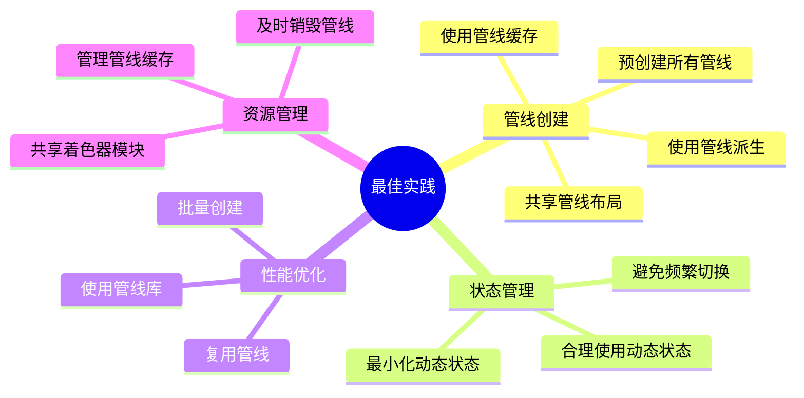

### 检查清单

| 实践 | 说明 | 重要性 |
|------|------|--------|
| **预创建管线** | 在渲染循环外创建所有管线 | ⭐⭐⭐⭐⭐ |
| **使用管线缓存** | 使用管线缓存加速创建 | ⭐⭐⭐⭐ |
| **共享管线布局** | 相同布局的管线共享布局对象 | ⭐⭐⭐⭐ |
| **合理使用动态状态** | 只对需要频繁改变的状态使用动态状态 | ⭐⭐⭐⭐ |
| **及时销毁** | 程序退出前销毁所有管线 | ⭐⭐⭐⭐⭐ |
| **错误处理** | 检查管线创建的返回值 | ⭐⭐⭐⭐⭐ |

### 常见错误与解决方案

| 错误 | 原因 | 解决方案 |
|------|------|---------|
| **VK_ERROR_INVALID_SHADER_NV** | 着色器编译错误 | 检查 SPIR-V 文件，验证着色器 |
| **VK_ERROR_OUT_OF_HOST_MEMORY** | 主机内存不足 | 减少管线数量或优化内存使用 |
| **VK_ERROR_OUT_OF_DEVICE_MEMORY** | 设备内存不足 | 减少管线数量或优化内存使用 |
| **状态不匹配** | 管线状态与使用不匹配 | 检查状态设置，确保一致性 |
| **布局不匹配** | 管线布局与描述符不匹配 | 检查描述符集布局 |

---

## 总结

### VkPipeline 核心要点

1. **状态封装**: 将所有渲染状态封装在一个对象中
2. **预编译**: 状态在创建时确定，运行时高效
3. **类型多样**: 图形管线和计算管线
4. **可共享**: 管线布局可以在多个管线间共享
5. **高性能**: GPU 上缓存，状态切换快速

### 管线创建流程总结

```mermaid
flowchart LR
    Layout[创建布局] --> Shaders[加载着色器] --> States[设置状态] --> Create[创建管线] --> Use[使用管线]
    
    style Layout fill:#FFB6C1
    style Create fill:#90EE90
    style Use fill:#87CEEB
```

### 相关 API 速查

| API | 说明 |
|-----|------|
| `vkCreateGraphicsPipelines()` | 创建图形管线 |
| `vkCreateComputePipelines()` | 创建计算管线 |
| `vkDestroyPipeline()` | 销毁管线 |
| `vkCreatePipelineLayout()` | 创建管线布局 |
| `vkDestroyPipelineLayout()` | 销毁管线布局 |
| `vkCreatePipelineCache()` | 创建管线缓存 |
| `vkDestroyPipelineCache()` | 销毁管线缓存 |
| `vkGetPipelineCacheData()` | 获取管线缓存数据 |
| `vkMergePipelineCaches()` | 合并管线缓存 |

---

*文档版本: 1.0*  
*最后更新: 2024*  
*基于 Vulkan 1.3 规范*

