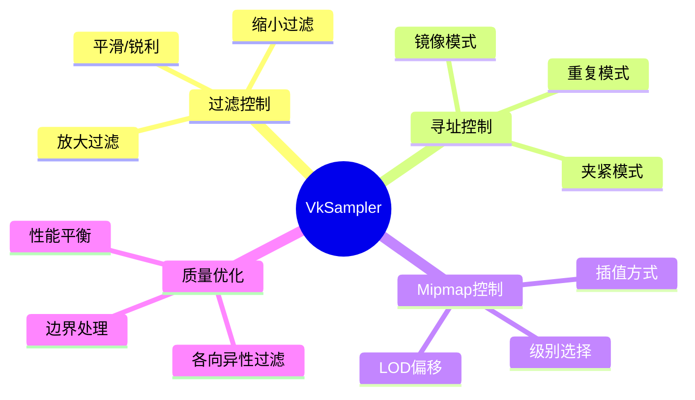
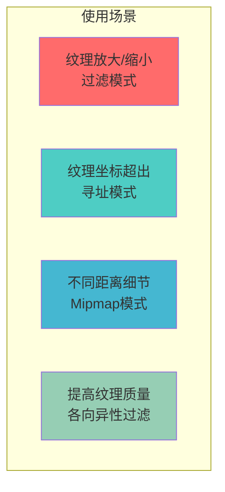
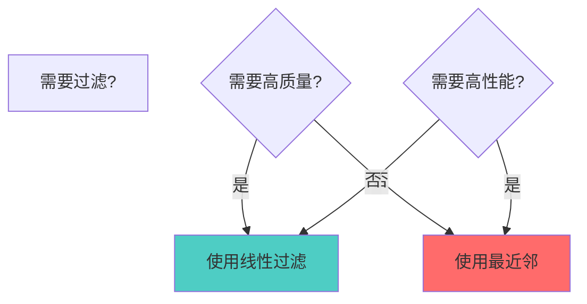
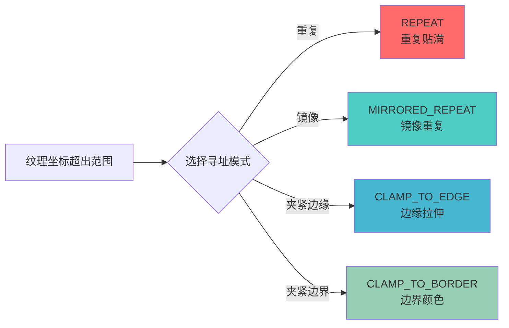
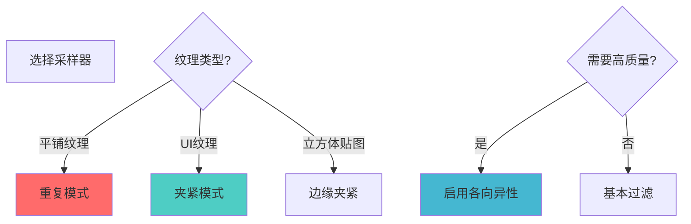
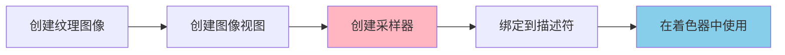

# VkSampler 详细分析文档

## 目录
1. [采样器是什么？用生活例子理解](#采样器是什么用生活例子理解)
2. [VkSampler 概述](#vksampler-概述)
3. [采样器的作用与重要性](#采样器的作用与重要性)
4. [采样器的创建](#采样器的创建)
5. [过滤模式](#过滤模式)
6. [寻址模式](#寻址模式)
7. [Mipmap 模式](#mipmap-模式)
8. [各向异性过滤](#各向异性过滤)
9. [边界颜色](#边界颜色)
10. [实际代码示例](#实际代码示例)
11. [最佳实践](#最佳实践)

---

## 采样器是什么？用生活例子理解

### 🖼️ 最简单的理解：采样器 = 放大镜的"设置"

想象你用放大镜看一张照片：

```
原始照片（纹理）              放大镜（采样器）              你看到的（渲染结果）
┌─────────────┐              ┌─────────────┐              ┌─────────────┐
│ 像素网格    │              │ 放大镜设置  │              │ 放大后的    │
│ [][][][]   │   ────────>   │ - 平滑/锐利 │   ────────>   │ 图像        │
│ [][][][]   │              │ - 边缘处理  │              │             │
│ [][][][]   │              │ - 缩放方式  │              │             │
└─────────────┘              └─────────────┘              └─────────────┘
```

**采样器（Sampler）就像放大镜的"设置"**：
- **过滤模式** = 放大镜是"平滑"还是"锐利"
- **寻址模式** = 照片超出边界时怎么处理（重复/夹紧/镜像）
- **Mipmap模式** = 看不同距离的照片时用哪个版本

### 🎨 更具体的例子：打印照片

想象你要打印一张照片，但需要调整大小：

```
原始照片（纹理）              打印机设置（采样器）          打印结果
┌─────────────┐              ┌─────────────┐              ┌─────────────┐
│ 100x100     │              │ 过滤：平滑  │              │ 200x200     │
│ 像素        │   ────────>   │ 寻址：重复  │   ────────>   │ 平滑放大    │
│             │              │ Mip：线性   │              │             │
└─────────────┘              └─────────────┘              └─────────────┘
```

**关键点**：
- **过滤模式**：决定放大/缩小时是平滑还是锐利
- **寻址模式**：决定超出边界时怎么处理
- **Mipmap模式**：决定使用哪个细节级别

### 🏠 贴墙纸例子：处理边界

想象你在贴墙纸，但墙纸比墙小：

```
墙纸（纹理）                 贴墙纸规则（采样器）           最终效果
┌─────┐                     ┌─────────────┐              ┌─────────────┐
│图案 │                     │ 重复模式：   │              │ 图案图案图案 │
│     │   ────────>          │ 重复贴满    │   ────────>   │ 图案图案图案 │
└─────┘                     └─────────────┘              │ 图案图案图案 │
                                                          └─────────────┘
```

**寻址模式的作用**：
- **重复（REPEAT）**：像贴墙纸一样重复贴满
- **夹紧（CLAMP_TO_EDGE）**：边缘拉伸到边界
- **镜像（MIRRORED_REPEAT）**：镜像重复

### 🔍 望远镜例子：看不同距离的物体

想象你用望远镜看远处的物体：

```
远处物体（纹理）             望远镜设置（采样器）           看到的图像
┌─────────────┐              ┌─────────────┐              ┌─────────────┐
│ 高分辨率    │              │ Mipmap：    │              │ 根据距离    │
│ 版本        │   ────────>   │ 自动选择    │   ────────>   │ 自动选择    │
│             │              │ 合适级别    │              │ 合适细节    │
└─────────────┘              └─────────────┘              └─────────────┘
```

**Mipmap的作用**：
- 物体远时用低分辨率版本（节省性能）
- 物体近时用高分辨率版本（保证质量）
- 采样器决定如何在这些级别之间切换

### 💻 在Vulkan中的实际场景

#### 场景1：纹理放大/缩小

```cpp
// 创建采样器：定义如何读取纹理
VkSamplerCreateInfo samplerInfo{};
samplerInfo.magFilter = VK_FILTER_LINEAR;  // 放大时：平滑
samplerInfo.minFilter = VK_FILTER_LINEAR;  // 缩小时：平滑
samplerInfo.addressModeU = VK_SAMPLER_ADDRESS_MODE_REPEAT;  // U方向：重复
samplerInfo.addressModeV = VK_SAMPLER_ADDRESS_MODE_REPEAT;  // V方向：重复

VkSampler sampler;
vkCreateSampler(device, &samplerInfo, nullptr, &sampler);
```

**为什么需要采样器？**
- 纹理坐标可能不在[0,1]范围内（需要寻址模式）
- 纹理可能被放大/缩小（需要过滤模式）
- 需要自动选择Mipmap级别（需要Mipmap模式）

### 🎯 采样器的关键概念

```mermaid
graph LR
    A[纹理图像<br/>VkImage] -->|采样器读取| B[VkSampler<br/>采样器设置]
    B -->|应用规则| C[着色器采样<br/>texture()]
    C -->|输出| D[渲染结果]
    
    style B fill:#FFB6C1
    style C fill:#87CEEB
```

### 🆚 采样器 vs 纹理图像：简单对比

| 特性 | 纹理图像（VkImage） | 采样器（VkSampler） |
|------|-------------------|-------------------|
| **是什么** | 实际的图像数据 | 读取图像的"规则" |
| **比喻** | 照片本身 | 放大镜的设置 |
| **作用** | 存储像素数据 | 定义如何读取像素 |
| **创建** | 从文件加载 | 定义过滤/寻址模式 |
| **使用** | 与采样器一起使用 | 与纹理图像一起使用 |

### ✅ 总结：采样器就是什么？

**一句话总结**：采样器（Sampler）就是**定义如何从纹理中读取像素的"规则集"**，包括过滤模式、寻址模式、Mipmap模式等。

**三个关键词**：
1. **读取规则** - 定义如何从纹理读取像素
2. **过滤模式** - 放大/缩小时的平滑/锐利
3. **寻址模式** - 超出边界时的处理方式

**记住这个公式**：
```
纹理图像（VkImage）+ 采样器（VkSampler）= 着色器可以使用的纹理
```

**常见使用场景**：
- ✅ 纹理放大/缩小（过滤模式）
- ✅ 纹理坐标超出范围（寻址模式）
- ✅ 不同距离的细节（Mipmap模式）
- ✅ 提高纹理质量（各向异性过滤）

---

## VkSampler 概述

### 什么是 VkSampler？

**VkSampler** 是 Vulkan 中用于定义如何从纹理图像中读取像素的对象。它指定了过滤模式、寻址模式、Mipmap 模式等参数，控制着色器如何采样纹理。

### VkSampler 的核心特点

- **纹理采样规则**: 定义如何从纹理读取像素
- **过滤模式**: 控制放大/缩小时的插值方式
- **寻址模式**: 控制纹理坐标超出范围时的行为
- **Mipmap 支持**: 支持多级细节级别
- **各向异性过滤**: 提高纹理质量
- **可重用**: 一个采样器可用于多个纹理

### VkSampler 在 Vulkan 纹理架构中的位置

```mermaid
graph TB
    subgraph "纹理资源"
        Image[VkImage<br/>纹理图像<br/>像素数据]
        View[VkImageView<br/>图像视图<br/>访问方式]
        Sampler[VkSampler<br/>采样器<br/>读取规则]
    end
    
    subgraph "着色器"
        Shader[着色器代码<br/>texture(sampler, uv)]
    end
    
    Image --> View
    View --> Sampler
    Sampler --> Shader
    
    style Sampler fill:#FFB6C1
    style Image fill:#87CEEB
    style View fill:#DDA0DD
```

---

## 采样器的作用与重要性

### 采样器的主要作用



### 采样器的使用场景



---

## 采样器的创建

### 基本创建

```cpp
VkSamplerCreateInfo samplerInfo{};
samplerInfo.sType = VK_STRUCTURE_TYPE_SAMPLER_CREATE_INFO;
samplerInfo.magFilter = VK_FILTER_LINEAR;  // 放大过滤
samplerInfo.minFilter = VK_FILTER_LINEAR;  // 缩小过滤
samplerInfo.addressModeU = VK_SAMPLER_ADDRESS_MODE_REPEAT;  // U方向寻址
samplerInfo.addressModeV = VK_SAMPLER_ADDRESS_MODE_REPEAT;  // V方向寻址
samplerInfo.addressModeW = VK_SAMPLER_ADDRESS_MODE_REPEAT;  // W方向寻址
samplerInfo.anisotropyEnable = VK_FALSE;  // 各向异性过滤
samplerInfo.maxAnisotropy = 1.0f;
samplerInfo.borderColor = VK_BORDER_COLOR_INT_OPAQUE_BLACK;  // 边界颜色
samplerInfo.unnormalizedCoordinates = VK_FALSE;  // 归一化坐标
samplerInfo.compareEnable = VK_FALSE;  // 比较模式
samplerInfo.compareOp = VK_COMPARE_OP_ALWAYS;
samplerInfo.mipmapMode = VK_SAMPLER_MIPMAP_MODE_LINEAR;  // Mipmap模式
samplerInfo.mipLodBias = 0.0f;  // Mip LOD偏移
samplerInfo.minLod = 0.0f;  // 最小LOD
samplerInfo.maxLod = 0.0f;  // 最大LOD

VkSampler sampler;
VkResult result = vkCreateSampler(device, &samplerInfo, nullptr, &sampler);
if (result != VK_SUCCESS) {
    throw std::runtime_error("failed to create sampler!");
}
```

### VkSamplerCreateInfo 结构

```cpp
typedef struct VkSamplerCreateInfo {
    VkStructureType         sType;                  // 结构体类型
    const void*             pNext;                  // 扩展链
    VkSamplerCreateFlags    flags;                  // 创建标志
    VkFilter                magFilter;              // 放大过滤
    VkFilter                minFilter;              // 缩小过滤
    VkSamplerMipmapMode     mipmapMode;             // Mipmap模式
    VkSamplerAddressMode    addressModeU;           // U方向寻址模式
    VkSamplerAddressMode    addressModeV;           // V方向寻址模式
    VkSamplerAddressMode    addressModeW;           // W方向寻址模式
    float                   mipLodBias;             // Mip LOD偏移
    VkBool32                anisotropyEnable;       // 是否启用各向异性过滤
    float                   maxAnisotropy;          // 最大各向异性级别
    VkBool32                compareEnable;          // 是否启用比较模式
    VkCompareOp             compareOp;              // 比较操作
    float                   minLod;                 // 最小LOD
    float                   maxLod;                 // 最大LOD
    VkBorderColor           borderColor;            // 边界颜色
    VkBool32                unnormalizedCoordinates; // 是否使用非归一化坐标
} VkSamplerCreateInfo;
```

### 采样器销毁

```cpp
void vkDestroySampler(
    VkDevice                device,
    VkSampler               sampler,
    const VkAllocationCallbacks* pAllocator
);
```

---

## 过滤模式

### 过滤模式概述

过滤模式决定当纹理被放大或缩小时，如何从原始像素计算新像素。

### 放大过滤（Mag Filter）

**VK_FILTER_NEAREST**（最近邻）：
```
原始纹理：    放大后（最近邻）：
[1][2]       [1][1][2][2]
[3][4]       [1][1][2][2]
             [3][3][4][4]
             [3][3][4][4]
```
- 选择最近的像素
- 速度快，但可能有锯齿

**VK_FILTER_LINEAR**（线性插值）：
```
原始纹理：    放大后（线性）：
[1][2]       [1][1.5][2][2]
[3][4]       [2][2.5][3][3]
             [3][3.5][4][4]
             [3][3.5][4][4]
```
- 在相邻像素间插值
- 更平滑，但稍慢

### 缩小过滤（Min Filter）

缩小过滤通常与Mipmap模式一起使用：

**VK_FILTER_NEAREST + VK_SAMPLER_MIPMAP_MODE_NEAREST**：
- 选择最近的Mip级别和最近的像素

**VK_FILTER_LINEAR + VK_SAMPLER_MIPMAP_MODE_NEAREST**：
- 选择最近的Mip级别，但在该级别内线性插值

**VK_FILTER_NEAREST + VK_SAMPLER_MIPMAP_MODE_LINEAR**：
- 在两个Mip级别间插值，但每个级别内用最近邻

**VK_FILTER_LINEAR + VK_SAMPLER_MIPMAP_MODE_LINEAR**（三线性过滤）：
- 在两个Mip级别间插值，每个级别内也线性插值
- 质量最好，但性能开销最大

### 过滤模式选择



---

## 寻址模式

### 寻址模式概述

寻址模式决定当纹理坐标超出[0,1]范围时的行为。

### 重复模式（REPEAT）

```
纹理坐标：    结果：
[0.0-1.0]    [纹理正常显示]
[1.0-2.0]    [重复显示]
[2.0-3.0]    [再次重复]
```

**比喻**：像贴墙纸一样重复贴满

```cpp
samplerInfo.addressModeU = VK_SAMPLER_ADDRESS_MODE_REPEAT;
samplerInfo.addressModeV = VK_SAMPLER_ADDRESS_MODE_REPEAT;
```

### 镜像重复模式（MIRRORED_REPEAT）

```
纹理坐标：    结果：
[0.0-1.0]    [纹理正常显示]
[1.0-2.0]    [镜像重复]
[2.0-3.0]    [再次镜像]
```

**比喻**：像镜子一样镜像重复

```cpp
samplerInfo.addressModeU = VK_SAMPLER_ADDRESS_MODE_MIRRORED_REPEAT;
```

### 夹紧到边缘模式（CLAMP_TO_EDGE）

```
纹理坐标：    结果：
[0.0-1.0]    [纹理正常显示]
[1.0-2.0]    [边缘像素拉伸]
[2.0-3.0]    [边缘像素继续拉伸]
```

**比喻**：边缘像素像橡皮筋一样拉伸

```cpp
samplerInfo.addressModeU = VK_SAMPLER_ADDRESS_MODE_CLAMP_TO_EDGE;
```

### 夹紧到边界模式（CLAMP_TO_BORDER）

```
纹理坐标：    结果：
[0.0-1.0]    [纹理正常显示]
[1.0-2.0]    [边界颜色]
[2.0-3.0]    [边界颜色]
```

**比喻**：超出部分用指定颜色填充

```cpp
samplerInfo.addressModeU = VK_SAMPLER_ADDRESS_MODE_CLAMP_TO_BORDER;
samplerInfo.borderColor = VK_BORDER_COLOR_FLOAT_OPAQUE_BLACK;
```

### 寻址模式可视化



---

## Mipmap 模式

### Mipmap 概述

Mipmap 是纹理的多个分辨率版本，用于在不同距离显示不同细节级别。

```
Mip级别 0: 1024x1024 (最高细节)
Mip级别 1: 512x512
Mip级别 2: 256x256
Mip级别 3: 128x128
Mip级别 4: 64x64
Mip级别 5: 32x32
Mip级别 6: 16x16
Mip级别 7: 8x8 (最低细节)
```

### Mipmap 模式

**VK_SAMPLER_MIPMAP_MODE_NEAREST**（最近邻）：
- 选择最近的Mip级别
- 可能有突然的细节变化

**VK_SAMPLER_MIPMAP_MODE_LINEAR**（线性）：
- 在两个Mip级别间插值
- 更平滑的细节过渡

### LOD 控制

```cpp
samplerInfo.minLod = 0.0f;      // 最小细节级别
samplerInfo.maxLod = 8.0f;      // 最大细节级别
samplerInfo.mipLodBias = 0.0f;  // LOD偏移（可调整细节）
```

**LOD偏移的作用**：
- 正值：使用更粗糙的Mip级别（性能更好）
- 负值：使用更精细的Mip级别（质量更好）

---

## 各向异性过滤

### 各向异性过滤概述

各向异性过滤用于改善倾斜表面的纹理质量，特别是在透视投影中。

### 启用各向异性过滤

```cpp
// 检查设备是否支持
if (deviceFeatures.samplerAnisotropy) {
    samplerInfo.anisotropyEnable = VK_TRUE;
    samplerInfo.maxAnisotropy = deviceProperties.limits.maxSamplerAnisotropy;
} else {
    samplerInfo.anisotropyEnable = VK_FALSE;
    samplerInfo.maxAnisotropy = 1.0f;
}
```

### 各向异性过滤效果

```
无各向异性：          有各向异性：
纹理模糊             纹理清晰
（倾斜表面）          （倾斜表面）
```

**性能影响**：
- 提高纹理质量
- 增加GPU开销
- 通常使用2x-16x级别

---

## 边界颜色

### 边界颜色概述

当使用`CLAMP_TO_BORDER`寻址模式时，需要指定边界颜色。

### 边界颜色选项

```cpp
typedef enum VkBorderColor {
    VK_BORDER_COLOR_FLOAT_TRANSPARENT_BLACK = 0,  // 透明黑色
    VK_BORDER_COLOR_INT_TRANSPARENT_BLACK = 1,
    VK_BORDER_COLOR_FLOAT_OPAQUE_BLACK = 2,       // 不透明白色
    VK_BORDER_COLOR_INT_OPAQUE_BLACK = 3,
    VK_BORDER_COLOR_FLOAT_OPAQUE_WHITE = 4,       // 不透明白色
    VK_BORDER_COLOR_INT_OPAQUE_WHITE = 5,
} VkBorderColor;
```

---

## 实际代码示例

### 示例 1: 基本采样器

```cpp
class BasicSampler {
private:
    VkDevice device;
    VkSampler sampler;
    
public:
    void create() {
        VkSamplerCreateInfo samplerInfo{};
        samplerInfo.sType = VK_STRUCTURE_TYPE_SAMPLER_CREATE_INFO;
        samplerInfo.magFilter = VK_FILTER_LINEAR;
        samplerInfo.minFilter = VK_FILTER_LINEAR;
        samplerInfo.addressModeU = VK_SAMPLER_ADDRESS_MODE_REPEAT;
        samplerInfo.addressModeV = VK_SAMPLER_ADDRESS_MODE_REPEAT;
        samplerInfo.addressModeW = VK_SAMPLER_ADDRESS_MODE_REPEAT;
        samplerInfo.anisotropyEnable = VK_FALSE;
        samplerInfo.maxAnisotropy = 1.0f;
        samplerInfo.borderColor = VK_BORDER_COLOR_INT_OPAQUE_BLACK;
        samplerInfo.unnormalizedCoordinates = VK_FALSE;
        samplerInfo.compareEnable = VK_FALSE;
        samplerInfo.mipmapMode = VK_SAMPLER_MIPMAP_MODE_LINEAR;
        samplerInfo.mipLodBias = 0.0f;
        samplerInfo.minLod = 0.0f;
        samplerInfo.maxLod = 0.0f;
        
        vkCreateSampler(device, &samplerInfo, nullptr, &sampler);
    }
    
    void destroy() {
        vkDestroySampler(device, sampler, nullptr);
    }
};
```

### 示例 2: 高质量采样器（带各向异性）

```cpp
VkSamplerCreateInfo createHighQualitySampler(
    VkDevice device,
    VkPhysicalDeviceProperties properties,
    VkPhysicalDeviceFeatures features
) {
    VkSamplerCreateInfo samplerInfo{};
    samplerInfo.sType = VK_STRUCTURE_TYPE_SAMPLER_CREATE_INFO;
    samplerInfo.magFilter = VK_FILTER_LINEAR;
    samplerInfo.minFilter = VK_FILTER_LINEAR;
    samplerInfo.mipmapMode = VK_SAMPLER_MIPMAP_MODE_LINEAR;
    samplerInfo.addressModeU = VK_SAMPLER_ADDRESS_MODE_REPEAT;
    samplerInfo.addressModeV = VK_SAMPLER_ADDRESS_MODE_REPEAT;
    samplerInfo.addressModeW = VK_SAMPLER_ADDRESS_MODE_REPEAT;
    samplerInfo.mipLodBias = 0.0f;
    
    // 启用各向异性过滤
    if (features.samplerAnisotropy) {
        samplerInfo.anisotropyEnable = VK_TRUE;
        samplerInfo.maxAnisotropy = properties.limits.maxSamplerAnisotropy;
    } else {
        samplerInfo.anisotropyEnable = VK_FALSE;
        samplerInfo.maxAnisotropy = 1.0f;
    }
    
    samplerInfo.compareEnable = VK_FALSE;
    samplerInfo.compareOp = VK_COMPARE_OP_ALWAYS;
    samplerInfo.minLod = 0.0f;
    samplerInfo.maxLod = VK_LOD_CLAMP_NONE;  // 使用所有Mip级别
    samplerInfo.borderColor = VK_BORDER_COLOR_INT_OPAQUE_BLACK;
    samplerInfo.unnormalizedCoordinates = VK_FALSE;
    
    return samplerInfo;
}
```

### 示例 3: 不同用途的采样器

```cpp
// 重复纹理采样器（用于平铺纹理）
VkSampler createRepeatSampler(VkDevice device) {
    VkSamplerCreateInfo samplerInfo{};
    samplerInfo.sType = VK_STRUCTURE_TYPE_SAMPLER_CREATE_INFO;
    samplerInfo.magFilter = VK_FILTER_LINEAR;
    samplerInfo.minFilter = VK_FILTER_LINEAR;
    samplerInfo.mipmapMode = VK_SAMPLER_MIPMAP_MODE_LINEAR;
    samplerInfo.addressModeU = VK_SAMPLER_ADDRESS_MODE_REPEAT;
    samplerInfo.addressModeV = VK_SAMPLER_ADDRESS_MODE_REPEAT;
    samplerInfo.addressModeW = VK_SAMPLER_ADDRESS_MODE_REPEAT;
    // ... 其他设置
    
    VkSampler sampler;
    vkCreateSampler(device, &samplerInfo, nullptr, &sampler);
    return sampler;
}

// 夹紧到边缘采样器（用于UI纹理）
VkSampler createClampSampler(VkDevice device) {
    VkSamplerCreateInfo samplerInfo{};
    samplerInfo.sType = VK_STRUCTURE_TYPE_SAMPLER_CREATE_INFO;
    samplerInfo.magFilter = VK_FILTER_LINEAR;
    samplerInfo.minFilter = VK_FILTER_LINEAR;
    samplerInfo.mipmapMode = VK_SAMPLER_MIPMAP_MODE_LINEAR;
    samplerInfo.addressModeU = VK_SAMPLER_ADDRESS_MODE_CLAMP_TO_EDGE;
    samplerInfo.addressModeV = VK_SAMPLER_ADDRESS_MODE_CLAMP_TO_EDGE;
    samplerInfo.addressModeW = VK_SAMPLER_ADDRESS_MODE_CLAMP_TO_EDGE;
    // ... 其他设置
    
    VkSampler sampler;
    vkCreateSampler(device, &samplerInfo, nullptr, &sampler);
    return sampler;
}
```

---

## 最佳实践

### 1. 采样器选择策略



### 2. 过滤模式选择

**DO**:
- ✅ 大多数情况使用线性过滤
- ✅ 像素艺术使用最近邻过滤
- ✅ 性能敏感场景考虑最近邻

**DON'T**:
- ❌ 在需要平滑的地方使用最近邻
- ❌ 在像素艺术中使用线性过滤
- ❌ 忽略性能影响

### 3. 寻址模式选择

**DO**:
- ✅ 平铺纹理使用重复模式
- ✅ UI纹理使用夹紧到边缘
- ✅ 立方体贴图使用边缘夹紧

**DON'T**:
- ❌ 在不需要重复的地方使用重复模式
- ❌ 在需要平铺的地方使用夹紧模式
- ❌ 忽略纹理坐标范围

### 4. 各向异性过滤

**DO**:
- ✅ 检查设备支持
- ✅ 使用设备支持的最大级别
- ✅ 在需要高质量时启用

**DON'T**:
- ❌ 在不支持的设备上启用
- ❌ 在性能敏感场景过度使用
- ❌ 忽略性能开销

### 5. Mipmap 使用

**DO**:
- ✅ 为纹理生成Mipmap
- ✅ 使用线性Mipmap模式
- ✅ 正确设置LOD范围

**DON'T**:
- ❌ 忽略Mipmap（性能差）
- ❌ 使用错误的LOD范围
- ❌ 忘记生成Mipmap

### 6. 性能优化

```cpp
// ✅ 好的做法：根据需求选择
VkFilter filter = needsHighQuality ? VK_FILTER_LINEAR : VK_FILTER_NEAREST;

// ❌ 不好的做法：总是使用最高质量
VkFilter filter = VK_FILTER_LINEAR;  // 可能过度
```

### 7. 常见陷阱

| 陷阱 | 问题 | 解决方案 |
|------|------|----------|
| 忘记启用各向异性 | 倾斜表面模糊 | 检查并启用各向异性过滤 |
| 错误的寻址模式 | 纹理显示错误 | 根据用途选择正确的模式 |
| 忽略Mipmap | 性能差 | 生成并使用Mipmap |
| 过度使用各向异性 | 性能下降 | 根据场景调整级别 |

### 8. 采样器重用

**DO**:
- ✅ 为相同用途创建共享采样器
- ✅ 在描述符池中重用采样器
- ✅ 避免创建过多采样器

**DON'T**:
- ❌ 为每个纹理创建新采样器
- ❌ 创建重复的采样器
- ❌ 忽略采样器重用

---

## 总结

### VkSampler 关键要点

1. **纹理采样规则**: 采样器定义如何从纹理读取像素
2. **过滤模式**: 控制放大/缩小时的插值方式
3. **寻址模式**: 控制纹理坐标超出范围时的行为
4. **Mipmap支持**: 支持多级细节级别
5. **各向异性过滤**: 提高倾斜表面的纹理质量
6. **可重用**: 一个采样器可用于多个纹理

### 采样器使用流程



### 采样器参数选择指南

| 场景 | 过滤模式 | 寻址模式 | 各向异性 |
|------|---------|---------|---------|
| 一般纹理 | LINEAR | REPEAT | 启用 |
| 像素艺术 | NEAREST | CLAMP_TO_EDGE | 禁用 |
| UI纹理 | LINEAR | CLAMP_TO_EDGE | 禁用 |
| 立方体贴图 | LINEAR | CLAMP_TO_EDGE | 启用 |

### 进一步学习

- 深入了解纹理过滤算法
- 学习Mipmap生成和使用
- 研究各向异性过滤原理
- 探索纹理压缩格式
- 了解性能优化技巧

---

**文档版本**: 1.0  
**最后更新**: 2025  
**相关文档**: 
- [VkImage 详细分析](./VkImage详细分析.md)
- [VkPipeline 详细分析](./VkPipeline详细分析.md)
- [VkDevice 详细分析](../VkDevice详细分析.md)


