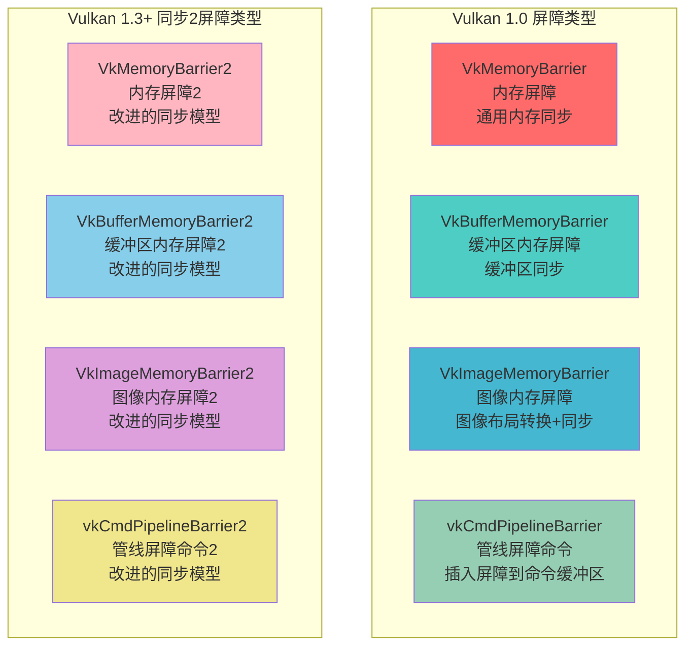
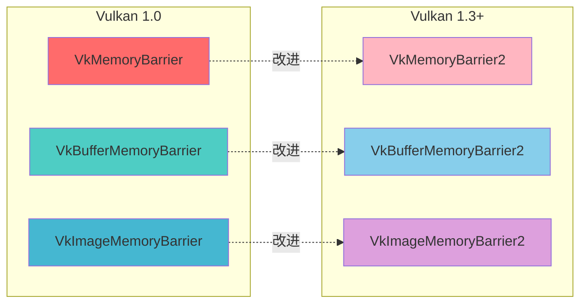
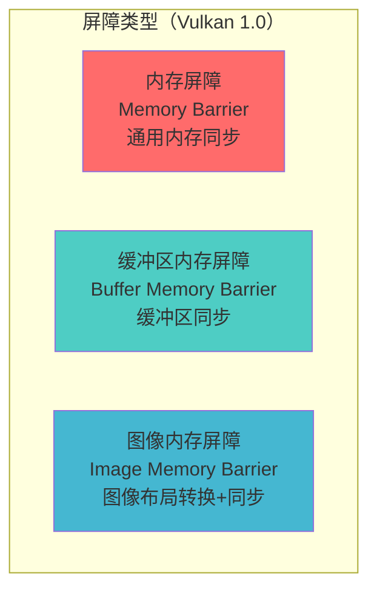
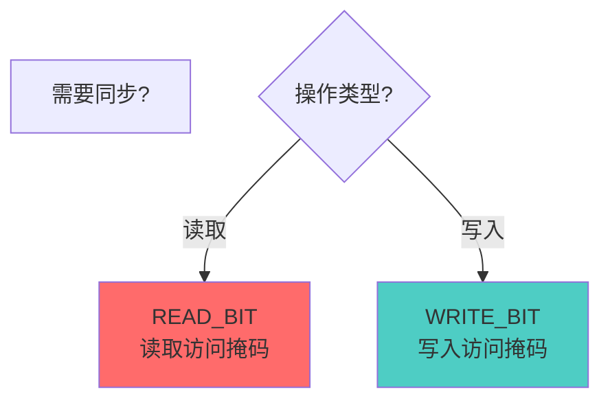
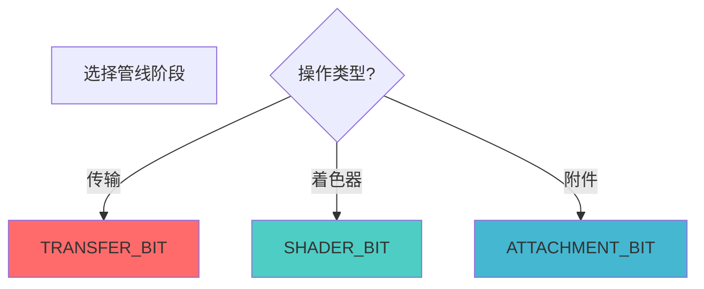

# Vulkan 屏障详细分析文档

## 目录
1. [Vulkan 中的屏障类型](#vulkan-中的屏障类型)
2. [屏障是什么？用生活例子理解](#屏障是什么用生活例子理解)
3. [屏障概述](#屏障概述)
4. [内存屏障（Memory Barrier）](#内存屏障memory-barrier)
5. [缓冲区内存屏障（Buffer Memory Barrier）](#缓冲区内存屏障buffer-memory-barrier)
6. [图像内存屏障（Image Memory Barrier）](#图像内存屏障image-memory-barrier)
7. [管线屏障（Pipeline Barrier）](#管线屏障pipeline-barrier)
8. [Vulkan 1.3+ 同步2屏障](#vulkan-13-同步2屏障)
9. [访问掩码（Access Masks）](#访问掩码access-masks)
10. [管线阶段（Pipeline Stages）](#管线阶段pipeline-stages)
11. [图像布局转换](#图像布局转换)
12. [实际代码示例](#实际代码示例)
13. [最佳实践](#最佳实践)

---

## Vulkan 中的屏障类型

### 屏障类型总览

Vulkan 中提供了多种屏障类型，用于不同的同步场景。以下是所有屏障类型的完整列表：



### 屏障类型详细列表

#### Vulkan 1.0 屏障类型（基础屏障）

| 屏障类型 | 结构体/函数 | 说明 | 使用场景 |
|---------|------------|------|---------|
| **内存屏障** | `VkMemoryBarrier` | 同步所有内存访问 | 通用内存同步 |
| **缓冲区内存屏障** | `VkBufferMemoryBarrier` | 同步特定缓冲区的内存访问 | 缓冲区数据同步 |
| **图像内存屏障** | `VkImageMemoryBarrier` | 同步图像访问并转换布局 | 图像布局转换、图像同步 |
| **管线屏障命令** | `vkCmdPipelineBarrier` | 插入屏障到命令缓冲区 | 所有屏障类型的插入点 |

#### Vulkan 1.3+ 同步2屏障类型（改进屏障）

| 屏障类型 | 结构体/函数 | 说明 | 使用场景 |
|---------|------------|------|---------|
| **内存屏障2** | `VkMemoryBarrier2` | 改进的内存同步模型 | 更精确的内存同步 |
| **缓冲区内存屏障2** | `VkBufferMemoryBarrier2` | 改进的缓冲区同步模型 | 更精确的缓冲区同步 |
| **图像内存屏障2** | `VkImageMemoryBarrier2` | 改进的图像同步模型 | 更精确的图像同步和布局转换 |
| **管线屏障命令2** | `vkCmdPipelineBarrier2` | 改进的屏障插入命令 | 使用同步2模型的屏障插入 |

### 屏障类型对比



### 屏障类型选择指南

| 场景 | 推荐屏障类型 | 版本要求 |
|------|------------|---------|
| 通用内存同步 | `VkMemoryBarrier` | Vulkan 1.0 |
| 缓冲区同步 | `VkBufferMemoryBarrier` | Vulkan 1.0 |
| 图像布局转换 | `VkImageMemoryBarrier` | Vulkan 1.0 |
| 改进的同步（推荐） | `VkMemoryBarrier2` / `VkBufferMemoryBarrier2` / `VkImageMemoryBarrier2` | Vulkan 1.3+ |

### 屏障插入命令

| 命令 | 说明 | 版本要求 |
|------|------|---------|
| `vkCmdPipelineBarrier` | 插入 Vulkan 1.0 屏障 | Vulkan 1.0 |
| `vkCmdPipelineBarrier2` | 插入 Vulkan 1.3+ 同步2屏障 | Vulkan 1.3+ |

---

## 屏障是什么？用生活例子理解

---

## 资源屏障是什么？用生活例子理解

### 🚧 最简单的理解：资源屏障 = 交通信号灯

想象你在管理一个繁忙的十字路口：

```
道路A（命令1）              交通信号灯（屏障）          道路B（命令2）
    │                              │                        │
    │  1. 车辆通过...              │                        │
    │                              │                        │
    │  2. 完成！设置屏障 ✅         │                        │
    │     🔴 红灯：禁止通行         │                        │
    │                              │                        │
    │                              │  3. 等待屏障...        │
    │                              │     看到绿灯           │
    │                              │  4. 🟢 绿灯：可以通行  │
    │                              │  5. 开始通过...        │
```

**资源屏障（Resource Barrier）就像交通信号灯**：
- 🔴 **屏障前** = 红灯，必须等待前面的操作完成
- 🟢 **屏障后** = 绿灯，可以安全地继续操作

### 🏭 更具体的例子：工厂流水线

想象你在管理一个工厂流水线：

```
工作站1（GPU命令1）          屏障（Resource Barrier）    工作站2（GPU命令2）
    │                              │                        │
    │  1. 加工零件...              │                        │
    │                              │                        │
    │  2. 完成！设置屏障 ✅         │                        │
    │     🚧 屏障：禁止通行         │                        │
    │                              │                        │
    │                              │  3. 等待屏障...        │
    │                              │     看到"可以通行"      │
    │                              │  4. 🚧 屏障：可以通行   │
    │                              │  5. 开始加工...        │
```

**关键点**：
- 工作站1（命令1）完成后，设置屏障
- 工作站2（命令2）看到屏障后，才开始工作
- 这样确保工作按顺序进行，不会冲突

### 🎬 电影拍摄例子：等待场景准备

想象你在拍电影，需要等待场景准备：

```
场景1（GPU命令1）            屏障（Resource Barrier）    场景2（GPU命令2）
    │                              │                        │
    │  1. 准备场景...              │                        │
    │                              │                        │
    │  2. 场景就位！                │                        │
    │     设置屏障：✅ 就位         │                        │
    │                              │                        │
    │                              │  3. 等待屏障...        │
    │                              │     看到"就位"标志      │
    │                              │  4. 开始拍摄...        │
```

### 🏗️ 建筑工地例子：等待材料准备好

想象你在建房子，需要等待材料：

```
步骤1（GPU命令1）            屏障（Resource Barrier）    步骤2（GPU命令2）
    │                              │                        │
    │  1. 准备材料...              │                        │
    │                              │                        │
    │  2. 材料准备好！              │                        │
    │     设置屏障：✅ 准备好       │                        │
    │                              │                        │
    │                              │  3. 等待屏障...        │
    │                              │     看到"准备好"标志    │
    │                              │  4. 开始施工...        │
```

### 💻 在Vulkan中的实际场景

#### 场景1：图像布局转换（就像改变房间用途）

```cpp
// 命令1：转换图像布局（就像把房间从"仓库"改成"办公室"）
VkImageMemoryBarrier barrier{};
barrier.oldLayout = VK_IMAGE_LAYOUT_UNDEFINED;  // 旧布局：未定义
barrier.newLayout = VK_IMAGE_LAYOUT_TRANSFER_DST_OPTIMAL;  // 新布局：传输目标

vkCmdPipelineBarrier(
    commandBuffer,
    VK_PIPELINE_STAGE_TOP_OF_PIPE_BIT,  // 源阶段
    VK_PIPELINE_STAGE_TRANSFER_BIT,     // 目标阶段
    0, nullptr, 0, nullptr,
    1, &barrier
);

// 命令2：现在可以安全地复制数据到图像了
vkCmdCopyBufferToImage(...);
```

**为什么需要屏障？**
- 确保图像布局转换完成后再使用
- 避免数据竞争和错误

#### 场景2：内存访问同步（就像确保数据写入完成）

```cpp
// 命令1：写入数据到缓冲区
vkCmdCopyBuffer(...);

// 设置屏障：确保写入完成
VkBufferMemoryBarrier barrier{};
barrier.srcAccessMask = VK_ACCESS_TRANSFER_WRITE_BIT;  // 源：传输写入
barrier.dstAccessMask = VK_ACCESS_SHADER_READ_BIT;     // 目标：着色器读取

vkCmdPipelineBarrier(
    commandBuffer,
    VK_PIPELINE_STAGE_TRANSFER_BIT,      // 源阶段：传输
    VK_PIPELINE_STAGE_FRAGMENT_SHADER_BIT, // 目标阶段：片段着色器
    0, nullptr,
    1, &barrier,  // 缓冲区屏障
    0, nullptr
);

// 命令2：现在可以安全地读取数据了
vkCmdDraw(...);
```

### 🎯 资源屏障的关键概念


### 🆚 资源屏障 vs 同步对象：简单对比

| 特性 | 资源屏障 | 同步对象（信号量/栅栏） |
|------|---------|---------------------|
| **作用范围** | 命令缓冲区内部 | 队列之间 |
| **比喻** | 交通信号灯 | 工人之间的协调 |
| **用途** | 内存访问同步、布局转换 | 队列间同步 |
| **性能** | 低开销 | 低开销 |

### ✅ 总结：资源屏障就是什么？

**一句话总结**：屏障（Barrier）就是**GPU命令之间的"交通信号灯"**，用于同步内存访问、转换图像布局、确保数据可见性。

**三个关键词**：
1. **内存同步** - 确保内存访问的正确顺序
2. **布局转换** - 转换图像的布局格式
3. **数据可见性** - 确保数据对后续操作可见

**记住这个公式**：
```
命令1执行 → 设置屏障 → 等待屏障 → 命令2执行
```

**常见使用场景**：
- ✅ 图像布局转换
- ✅ 内存访问同步
- ✅ 缓冲区数据同步
- ✅ 确保数据可见性

---

## 屏障概述

### 什么是屏障？

屏障是 Vulkan 中用于同步资源访问、转换图像布局、确保内存可见性的机制。它确保 GPU 命令按正确顺序执行，避免数据竞争和访问冲突。

### 屏障的核心特点

- **内存同步**: 确保内存访问的正确顺序
- **布局转换**: 转换图像的布局格式
- **数据可见性**: 确保数据对后续操作可见
- **命令顺序**: 控制命令的执行顺序
- **性能优化**: 最小化同步开销

### 屏障的类型（Vulkan 1.0）



### 屏障在 Vulkan 架构中的位置


---

## Vulkan 1.3+ 同步2屏障

### 同步2屏障概述

Vulkan 1.3 引入了同步2（Synchronization2）扩展，提供了改进的屏障模型。同步2屏障提供了更精确的同步控制和更好的性能。

### 同步2屏障类型

#### VkMemoryBarrier2

```cpp
typedef struct VkMemoryBarrier2 {
    VkStructureType            sType;              // 结构体类型
    const void*                pNext;              // 扩展链
    VkPipelineStageFlags2      srcStageMask;        // 源管线阶段掩码（64位）
    VkAccessFlags2             srcAccessMask;      // 源访问掩码（64位）
    VkPipelineStageFlags2      dstStageMask;        // 目标管线阶段掩码（64位）
    VkAccessFlags2             dstAccessMask;      // 目标访问掩码（64位）
} VkMemoryBarrier2;
```

#### VkBufferMemoryBarrier2

```cpp
typedef struct VkBufferMemoryBarrier2 {
    VkStructureType            sType;                  // 结构体类型
    const void*                pNext;                  // 扩展链
    VkPipelineStageFlags2      srcStageMask;            // 源管线阶段掩码（64位）
    VkAccessFlags2             srcAccessMask;          // 源访问掩码（64位）
    VkPipelineStageFlags2      dstStageMask;            // 目标管线阶段掩码（64位）
    VkAccessFlags2             dstAccessMask;          // 目标访问掩码（64位）
    uint32_t                   srcQueueFamilyIndex;     // 源队列族索引
    uint32_t                   dstQueueFamilyIndex;     // 目标队列族索引
    VkBuffer                   buffer;                  // 缓冲区句柄
    VkDeviceSize               offset;                  // 偏移量
    VkDeviceSize               size;                    // 大小
} VkBufferMemoryBarrier2;
```

#### VkImageMemoryBarrier2

```cpp
typedef struct VkImageMemoryBarrier2 {
    VkStructureType            sType;                  // 结构体类型
    const void*                pNext;                  // 扩展链
    VkPipelineStageFlags2      srcStageMask;            // 源管线阶段掩码（64位）
    VkAccessFlags2             srcAccessMask;          // 源访问掩码（64位）
    VkPipelineStageFlags2      dstStageMask;            // 目标管线阶段掩码（64位）
    VkAccessFlags2             dstAccessMask;          // 目标访问掩码（64位）
    VkImageLayout              oldLayout;               // 旧布局
    VkImageLayout              newLayout;               // 新布局
    uint32_t                   srcQueueFamilyIndex;     // 源队列族索引
    uint32_t                   dstQueueFamilyIndex;     // 目标队列族索引
    VkImage                    image;                   // 图像句柄
    VkImageSubresourceRange    subresourceRange;        // 子资源范围
} VkImageMemoryBarrier2;
```

### vkCmdPipelineBarrier2 函数

```cpp
void vkCmdPipelineBarrier2(
    VkCommandBuffer                   commandBuffer,
    const VkDependencyInfo*          pDependencyInfo  // 依赖信息（包含所有屏障）
);
```

### 同步2屏障的优势

- **更精确的控制**: 64位阶段和访问掩码提供更精确的同步控制
- **更好的性能**: 优化的同步模型可能提供更好的性能
- **统一的接口**: 所有屏障通过一个依赖信息结构传递
- **扩展性**: 更容易添加新的同步功能

### 同步2屏障使用示例

```cpp
// 使用同步2屏障
VkMemoryBarrier2 barrier{};
barrier.sType = VK_STRUCTURE_TYPE_MEMORY_BARRIER_2;
barrier.srcStageMask = VK_PIPELINE_STAGE_2_COMPUTE_SHADER_BIT;
barrier.srcAccessMask = VK_ACCESS_2_SHADER_WRITE_BIT;
barrier.dstStageMask = VK_PIPELINE_STAGE_2_COMPUTE_SHADER_BIT;
barrier.dstAccessMask = VK_ACCESS_2_SHADER_READ_BIT;

VkDependencyInfo dependencyInfo{};
dependencyInfo.sType = VK_STRUCTURE_TYPE_DEPENDENCY_INFO;
dependencyInfo.memoryBarrierCount = 1;
dependencyInfo.pMemoryBarriers = &barrier;

vkCmdPipelineBarrier2(commandBuffer, &dependencyInfo);
```

### 同步2 vs 同步1 对比

| 特性 | 同步1（Vulkan 1.0） | 同步2（Vulkan 1.3+） |
|------|-------------------|---------------------|
| **阶段掩码** | 32位 | 64位 |
| **访问掩码** | 32位 | 64位 |
| **接口** | 多个参数 | 统一的依赖信息 |
| **性能** | 良好 | 可能更好 |
| **扩展性** | 有限 | 更好 |

---

## 内存屏障（Memory Barrier）

### 内存屏障概述

内存屏障用于同步所有内存访问，不针对特定资源。它是最通用的屏障类型。

### VkMemoryBarrier 结构

```cpp
typedef struct VkMemoryBarrier {
    VkStructureType    sType;          // 结构体类型
    const void*        pNext;          // 扩展链
    VkAccessFlags      srcAccessMask;   // 源访问掩码
    VkAccessFlags      dstAccessMask;   // 目标访问掩码
} VkMemoryBarrier;
```

### 基本使用

```cpp
// 创建内存屏障
VkMemoryBarrier memoryBarrier{};
memoryBarrier.sType = VK_STRUCTURE_TYPE_MEMORY_BARRIER;
memoryBarrier.srcAccessMask = VK_ACCESS_SHADER_WRITE_BIT;  // 源：着色器写入
memoryBarrier.dstAccessMask = VK_ACCESS_SHADER_READ_BIT;    // 目标：着色器读取

// 插入管线屏障
vkCmdPipelineBarrier(
    commandBuffer,
    VK_PIPELINE_STAGE_COMPUTE_SHADER_BIT,  // 源阶段
    VK_PIPELINE_STAGE_COMPUTE_SHADER_BIT,  // 目标阶段
    0,                                      // 依赖标志
    1, &memoryBarrier,                     // 内存屏障
    0, nullptr,                            // 缓冲区屏障
    0, nullptr                             // 图像屏障
);
```

### 使用场景

**场景1：计算着色器之间的同步**

```cpp
// 计算着色器1：写入数据
vkCmdDispatch(...);

// 内存屏障：确保写入完成
VkMemoryBarrier barrier{};
barrier.sType = VK_STRUCTURE_TYPE_MEMORY_BARRIER;
barrier.srcAccessMask = VK_ACCESS_SHADER_WRITE_BIT;
barrier.dstAccessMask = VK_ACCESS_SHADER_READ_BIT;

vkCmdPipelineBarrier(
    commandBuffer,
    VK_PIPELINE_STAGE_COMPUTE_SHADER_BIT,
    VK_PIPELINE_STAGE_COMPUTE_SHADER_BIT,
    0, 1, &barrier, 0, nullptr, 0, nullptr
);

// 计算着色器2：读取数据
vkCmdDispatch(...);
```

---

## 缓冲区内存屏障（Buffer Memory Barrier）

### 缓冲区内存屏障概述

缓冲区内存屏障用于同步特定缓冲区的内存访问，比通用内存屏障更精确。

### VkBufferMemoryBarrier 结构

```cpp
typedef struct VkBufferMemoryBarrier {
    VkStructureType    sType;                  // 结构体类型
    const void*        pNext;                  // 扩展链
    VkAccessFlags      srcAccessMask;           // 源访问掩码
    VkAccessFlags      dstAccessMask;           // 目标访问掩码
    uint32_t           srcQueueFamilyIndex;     // 源队列族索引
    uint32_t           dstQueueFamilyIndex;     // 目标队列族索引
    VkBuffer           buffer;                  // 缓冲区句柄
    VkDeviceSize       offset;                  // 偏移量
    VkDeviceSize       size;                    // 大小
} VkBufferMemoryBarrier;
```

### 基本使用

```cpp
// 创建缓冲区内存屏障
VkBufferMemoryBarrier bufferBarrier{};
bufferBarrier.sType = VK_STRUCTURE_TYPE_BUFFER_MEMORY_BARRIER;
bufferBarrier.srcAccessMask = VK_ACCESS_TRANSFER_WRITE_BIT;  // 源：传输写入
bufferBarrier.dstAccessMask = VK_ACCESS_SHADER_READ_BIT;     // 目标：着色器读取
bufferBarrier.srcQueueFamilyIndex = VK_QUEUE_FAMILY_IGNORED;
bufferBarrier.dstQueueFamilyIndex = VK_QUEUE_FAMILY_IGNORED;
bufferBarrier.buffer = buffer;                                // 缓冲区句柄
bufferBarrier.offset = 0;                                     // 偏移量
bufferBarrier.size = VK_WHOLE_SIZE;                           // 整个缓冲区

// 插入管线屏障
vkCmdPipelineBarrier(
    commandBuffer,
    VK_PIPELINE_STAGE_TRANSFER_BIT,           // 源阶段：传输
    VK_PIPELINE_STAGE_FRAGMENT_SHADER_BIT,    // 目标阶段：片段着色器
    0,                                         // 依赖标志
    0, nullptr,                                // 内存屏障
    1, &bufferBarrier,                         // 缓冲区屏障
    0, nullptr                                 // 图像屏障
);
```

### 使用场景

**场景1：缓冲区数据传输后使用**

```cpp
// 命令1：复制数据到缓冲区
vkCmdCopyBuffer(...);

// 缓冲区屏障：确保写入完成
VkBufferMemoryBarrier barrier{};
barrier.sType = VK_STRUCTURE_TYPE_BUFFER_MEMORY_BARRIER;
barrier.srcAccessMask = VK_ACCESS_TRANSFER_WRITE_BIT;
barrier.dstAccessMask = VK_ACCESS_VERTEX_BUFFER_BIT;
barrier.buffer = vertexBuffer;
barrier.offset = 0;
barrier.size = VK_WHOLE_SIZE;

vkCmdPipelineBarrier(
    commandBuffer,
    VK_PIPELINE_STAGE_TRANSFER_BIT,
    VK_PIPELINE_STAGE_VERTEX_INPUT_BIT,
    0, nullptr, 1, &barrier, 0, nullptr
);

// 命令2：使用缓冲区作为顶点缓冲区
vkCmdBindVertexBuffers(...);
vkCmdDraw(...);
```

---

## 图像内存屏障（Image Memory Barrier）

### 图像内存屏障概述

图像内存屏障是最常用的屏障类型，用于同步图像访问和转换图像布局。

### VkImageMemoryBarrier 结构

```cpp
typedef struct VkImageMemoryBarrier {
    VkStructureType            sType;                  // 结构体类型
    const void*                pNext;                  // 扩展链
    VkAccessFlags              srcAccessMask;           // 源访问掩码
    VkAccessFlags              dstAccessMask;           // 目标访问掩码
    VkImageLayout              oldLayout;               // 旧布局
    VkImageLayout              newLayout;               // 新布局
    uint32_t                   srcQueueFamilyIndex;     // 源队列族索引
    uint32_t                   dstQueueFamilyIndex;     // 目标队列族索引
    VkImage                    image;                   // 图像句柄
    VkImageSubresourceRange    subresourceRange;        // 子资源范围
} VkImageMemoryBarrier;
```

### 基本使用

```cpp
// 创建图像内存屏障
VkImageMemoryBarrier imageBarrier{};
imageBarrier.sType = VK_STRUCTURE_TYPE_IMAGE_MEMORY_BARRIER;
imageBarrier.srcAccessMask = 0;                                    // 源访问掩码
imageBarrier.dstAccessMask = VK_ACCESS_TRANSFER_WRITE_BIT;         // 目标访问掩码
imageBarrier.oldLayout = VK_IMAGE_LAYOUT_UNDEFINED;                // 旧布局
imageBarrier.newLayout = VK_IMAGE_LAYOUT_TRANSFER_DST_OPTIMAL;     // 新布局
imageBarrier.srcQueueFamilyIndex = VK_QUEUE_FAMILY_IGNORED;
imageBarrier.dstQueueFamilyIndex = VK_QUEUE_FAMILY_IGNORED;
imageBarrier.image = image;                                        // 图像句柄
imageBarrier.subresourceRange.aspectMask = VK_IMAGE_ASPECT_COLOR_BIT;
imageBarrier.subresourceRange.baseMipLevel = 0;
imageBarrier.subresourceRange.levelCount = 1;
imageBarrier.subresourceRange.baseArrayLayer = 0;
imageBarrier.subresourceRange.layerCount = 1;

// 插入管线屏障
vkCmdPipelineBarrier(
    commandBuffer,
    VK_PIPELINE_STAGE_TOP_OF_PIPE_BIT,  // 源阶段
    VK_PIPELINE_STAGE_TRANSFER_BIT,      // 目标阶段
    0,                                    // 依赖标志
    0, nullptr,                           // 内存屏障
    0, nullptr,                           // 缓冲区屏障
    1, &imageBarrier                      // 图像屏障
);
```

### 使用场景

**场景1：图像布局转换（最常见）**

```cpp
// 转换图像布局：从未定义到传输目标
VkImageMemoryBarrier barrier{};
barrier.sType = VK_STRUCTURE_TYPE_IMAGE_MEMORY_BARRIER;
barrier.oldLayout = VK_IMAGE_LAYOUT_UNDEFINED;
barrier.newLayout = VK_IMAGE_LAYOUT_TRANSFER_DST_OPTIMAL;
barrier.srcAccessMask = 0;
barrier.dstAccessMask = VK_ACCESS_TRANSFER_WRITE_BIT;
barrier.image = image;
barrier.subresourceRange = {VK_IMAGE_ASPECT_COLOR_BIT, 0, 1, 0, 1};

vkCmdPipelineBarrier(
    commandBuffer,
    VK_PIPELINE_STAGE_TOP_OF_PIPE_BIT,
    VK_PIPELINE_STAGE_TRANSFER_BIT,
    0, nullptr, 0, nullptr, 1, &barrier
);

// 现在可以复制数据到图像
vkCmdCopyBufferToImage(...);
```

---

## 管线屏障（Pipeline Barrier）

### 管线屏障概述

`vkCmdPipelineBarrier` 是插入资源屏障的命令，它可以在命令缓冲区中插入同步点。

### vkCmdPipelineBarrier 函数

```cpp
void vkCmdPipelineBarrier(
    VkCommandBuffer               commandBuffer,          // 命令缓冲区
    VkPipelineStageFlags          srcStageMask,           // 源管线阶段掩码
    VkPipelineStageFlags          dstStageMask,           // 目标管线阶段掩码
    VkDependencyFlags             dependencyFlags,        // 依赖标志
    uint32_t                      memoryBarrierCount,     // 内存屏障数量
    const VkMemoryBarrier*        pMemoryBarriers,        // 内存屏障数组
    uint32_t                      bufferMemoryBarrierCount, // 缓冲区屏障数量
    const VkBufferMemoryBarrier*  pBufferMemoryBarriers,  // 缓冲区屏障数组
    uint32_t                      imageMemoryBarrierCount,  // 图像屏障数量
    const VkImageMemoryBarrier*   pImageMemoryBarriers    // 图像屏障数组
);
```

### 基本使用

```cpp
// 插入管线屏障（包含所有类型的屏障）
vkCmdPipelineBarrier(
    commandBuffer,
    VK_PIPELINE_STAGE_TRANSFER_BIT,           // 源阶段
    VK_PIPELINE_STAGE_FRAGMENT_SHADER_BIT,    // 目标阶段
    0,                                         // 依赖标志
    1, &memoryBarrier,                         // 内存屏障
    1, &bufferBarrier,                         // 缓冲区屏障
    1, &imageBarrier                           // 图像屏障
);
```

### 管线屏障的作用


---

## 访问掩码（Access Masks）

### 访问掩码概述

访问掩码指定了资源的访问类型，用于确保正确的内存可见性。

### 常见访问掩码

| 访问掩码 | 说明 | 使用场景 |
|---------|------|---------|
| `VK_ACCESS_TRANSFER_READ_BIT` | 传输读取 | 从缓冲区/图像读取 |
| `VK_ACCESS_TRANSFER_WRITE_BIT` | 传输写入 | 写入缓冲区/图像 |
| `VK_ACCESS_SHADER_READ_BIT` | 着色器读取 | 着色器中采样纹理 |
| `VK_ACCESS_SHADER_WRITE_BIT` | 着色器写入 | 计算着色器写入 |
| `VK_ACCESS_COLOR_ATTACHMENT_READ_BIT` | 颜色附件读取 | 读取颜色附件 |
| `VK_ACCESS_COLOR_ATTACHMENT_WRITE_BIT` | 颜色附件写入 | 写入颜色附件 |
| `VK_ACCESS_DEPTH_STENCIL_ATTACHMENT_READ_BIT` | 深度模板附件读取 | 读取深度模板 |
| `VK_ACCESS_DEPTH_STENCIL_ATTACHMENT_WRITE_BIT` | 深度模板附件写入 | 写入深度模板 |

### 访问掩码选择



---

## 管线阶段（Pipeline Stages）

### 管线阶段概述

管线阶段指定了命令在渲染管线中的执行位置，用于精确控制同步点。

### 常见管线阶段

| 管线阶段 | 说明 | 使用场景 |
|---------|------|---------|
| `VK_PIPELINE_STAGE_TOP_OF_PIPE_BIT` | 管线顶部 | 初始状态 |
| `VK_PIPELINE_STAGE_VERTEX_INPUT_BIT` | 顶点输入 | 顶点数据输入 |
| `VK_PIPELINE_STAGE_VERTEX_SHADER_BIT` | 顶点着色器 | 顶点着色器执行 |
| `VK_PIPELINE_STAGE_FRAGMENT_SHADER_BIT` | 片段着色器 | 片段着色器执行 |
| `VK_PIPELINE_STAGE_COLOR_ATTACHMENT_OUTPUT_BIT` | 颜色附件输出 | 颜色附件写入 |
| `VK_PIPELINE_STAGE_TRANSFER_BIT` | 传输 | 数据传输操作 |
| `VK_PIPELINE_STAGE_COMPUTE_SHADER_BIT` | 计算着色器 | 计算着色器执行 |

### 管线阶段选择



---

## 图像布局转换

### 图像布局概述

图像布局指定了图像在内存中的组织方式，不同的操作需要不同的布局。

### 常见图像布局

| 图像布局 | 说明 | 使用场景 |
|---------|------|---------|
| `VK_IMAGE_LAYOUT_UNDEFINED` | 未定义 | 初始状态 |
| `VK_IMAGE_LAYOUT_TRANSFER_DST_OPTIMAL` | 传输目标 | 接收传输数据 |
| `VK_IMAGE_LAYOUT_TRANSFER_SRC_OPTIMAL` | 传输源 | 作为传输源 |
| `VK_IMAGE_LAYOUT_SHADER_READ_ONLY_OPTIMAL` | 着色器只读 | 在着色器中采样 |
| `VK_IMAGE_LAYOUT_COLOR_ATTACHMENT_OPTIMAL` | 颜色附件 | 作为颜色附件 |
| `VK_IMAGE_LAYOUT_DEPTH_STENCIL_ATTACHMENT_OPTIMAL` | 深度模板附件 | 作为深度模板附件 |
| `VK_IMAGE_LAYOUT_PRESENT_SRC_KHR` | 呈现源 | 呈现到屏幕 |

### 图像布局转换流程


### 图像布局转换示例

```cpp
// 1. 从未定义到传输目标
transitionImageLayout(
    image,
    VK_IMAGE_LAYOUT_UNDEFINED,
    VK_IMAGE_LAYOUT_TRANSFER_DST_OPTIMAL,
    VK_PIPELINE_STAGE_TOP_OF_PIPE_BIT,
    VK_PIPELINE_STAGE_TRANSFER_BIT
);

// 2. 复制数据
vkCmdCopyBufferToImage(...);

// 3. 从传输目标到着色器只读
transitionImageLayout(
    image,
    VK_IMAGE_LAYOUT_TRANSFER_DST_OPTIMAL,
    VK_IMAGE_LAYOUT_SHADER_READ_ONLY_OPTIMAL,
    VK_PIPELINE_STAGE_TRANSFER_BIT,
    VK_PIPELINE_STAGE_FRAGMENT_SHADER_BIT
);
```

---

## 实际代码示例

### 示例 1: 图像布局转换

```cpp
void transitionImageLayout(
    VkCommandBuffer commandBuffer,
    VkImage image,
    VkImageLayout oldLayout,
    VkImageLayout newLayout,
    VkPipelineStageFlags srcStage,
    VkPipelineStageFlags dstStage
) {
    VkImageMemoryBarrier barrier{};
    barrier.sType = VK_STRUCTURE_TYPE_IMAGE_MEMORY_BARRIER;
    barrier.oldLayout = oldLayout;
    barrier.newLayout = newLayout;
    barrier.srcQueueFamilyIndex = VK_QUEUE_FAMILY_IGNORED;
    barrier.dstQueueFamilyIndex = VK_QUEUE_FAMILY_IGNORED;
    barrier.image = image;
    barrier.subresourceRange.aspectMask = VK_IMAGE_ASPECT_COLOR_BIT;
    barrier.subresourceRange.baseMipLevel = 0;
    barrier.subresourceRange.levelCount = 1;
    barrier.subresourceRange.baseArrayLayer = 0;
    barrier.subresourceRange.layerCount = 1;
    
    // 根据布局设置访问掩码
    if (oldLayout == VK_IMAGE_LAYOUT_UNDEFINED && 
        newLayout == VK_IMAGE_LAYOUT_TRANSFER_DST_OPTIMAL) {
        barrier.srcAccessMask = 0;
        barrier.dstAccessMask = VK_ACCESS_TRANSFER_WRITE_BIT;
    } else if (oldLayout == VK_IMAGE_LAYOUT_TRANSFER_DST_OPTIMAL && 
               newLayout == VK_IMAGE_LAYOUT_SHADER_READ_ONLY_OPTIMAL) {
        barrier.srcAccessMask = VK_ACCESS_TRANSFER_WRITE_BIT;
        barrier.dstAccessMask = VK_ACCESS_SHADER_READ_BIT;
    }
    
    vkCmdPipelineBarrier(
        commandBuffer,
        srcStage,
        dstStage,
        0,
        0, nullptr,
        0, nullptr,
        1, &barrier
    );
}
```

### 示例 2: 缓冲区同步

```cpp
void syncBufferAccess(
    VkCommandBuffer commandBuffer,
    VkBuffer buffer
) {
    VkBufferMemoryBarrier barrier{};
    barrier.sType = VK_STRUCTURE_TYPE_BUFFER_MEMORY_BARRIER;
    barrier.srcAccessMask = VK_ACCESS_SHADER_WRITE_BIT;
    barrier.dstAccessMask = VK_ACCESS_SHADER_READ_BIT;
    barrier.srcQueueFamilyIndex = VK_QUEUE_FAMILY_IGNORED;
    barrier.dstQueueFamilyIndex = VK_QUEUE_FAMILY_IGNORED;
    barrier.buffer = buffer;
    barrier.offset = 0;
    barrier.size = VK_WHOLE_SIZE;
    
    vkCmdPipelineBarrier(
        commandBuffer,
        VK_PIPELINE_STAGE_COMPUTE_SHADER_BIT,
        VK_PIPELINE_STAGE_COMPUTE_SHADER_BIT,
        0,
        0, nullptr,
        1, &barrier,
        0, nullptr
    );
}
```

### 示例 3: 完整的纹理加载流程

```cpp
void loadTexture(VkCommandBuffer cmd, VkImage image) {
    // 1. 转换布局：未定义 -> 传输目标
    VkImageMemoryBarrier barrier1{};
    barrier1.sType = VK_STRUCTURE_TYPE_IMAGE_MEMORY_BARRIER;
    barrier1.oldLayout = VK_IMAGE_LAYOUT_UNDEFINED;
    barrier1.newLayout = VK_IMAGE_LAYOUT_TRANSFER_DST_OPTIMAL;
    barrier1.srcAccessMask = 0;
    barrier1.dstAccessMask = VK_ACCESS_TRANSFER_WRITE_BIT;
    barrier1.image = image;
    barrier1.subresourceRange = {VK_IMAGE_ASPECT_COLOR_BIT, 0, 1, 0, 1};
    
    vkCmdPipelineBarrier(
        cmd,
        VK_PIPELINE_STAGE_TOP_OF_PIPE_BIT,
        VK_PIPELINE_STAGE_TRANSFER_BIT,
        0, nullptr, 0, nullptr, 1, &barrier1
    );
    
    // 2. 复制数据
    vkCmdCopyBufferToImage(...);
    
    // 3. 转换布局：传输目标 -> 着色器只读
    VkImageMemoryBarrier barrier2{};
    barrier2.sType = VK_STRUCTURE_TYPE_IMAGE_MEMORY_BARRIER;
    barrier2.oldLayout = VK_IMAGE_LAYOUT_TRANSFER_DST_OPTIMAL;
    barrier2.newLayout = VK_IMAGE_LAYOUT_SHADER_READ_ONLY_OPTIMAL;
    barrier2.srcAccessMask = VK_ACCESS_TRANSFER_WRITE_BIT;
    barrier2.dstAccessMask = VK_ACCESS_SHADER_READ_BIT;
    barrier2.image = image;
    barrier2.subresourceRange = {VK_IMAGE_ASPECT_COLOR_BIT, 0, 1, 0, 1};
    
    vkCmdPipelineBarrier(
        cmd,
        VK_PIPELINE_STAGE_TRANSFER_BIT,
        VK_PIPELINE_STAGE_FRAGMENT_SHADER_BIT,
        0, nullptr, 0, nullptr, 1, &barrier2
    );
}
```

---

## 最佳实践

### 1. 屏障使用策略

**DO**:
- ✅ 在布局转换时使用图像屏障
- ✅ 在缓冲区写入后使用缓冲区屏障
- ✅ 选择最精确的管线阶段
- ✅ 正确设置访问掩码

**DON'T**:
- ❌ 忘记设置屏障
- ❌ 使用错误的访问掩码
- ❌ 使用过于宽泛的管线阶段
- ❌ 忽略布局转换

### 2. 访问掩码选择

**DO**:
- ✅ 根据实际访问类型选择掩码
- ✅ 源掩码匹配写入操作
- ✅ 目标掩码匹配读取操作

**DON'T**:
- ❌ 使用错误的访问掩码
- ❌ 忽略访问掩码
- ❌ 使用过于宽泛的掩码

### 3. 管线阶段选择

**DO**:
- ✅ 选择最精确的管线阶段
- ✅ 源阶段匹配写入阶段
- ✅ 目标阶段匹配读取阶段

**DON'T**:
- ❌ 使用过于宽泛的阶段
- ❌ 忽略管线阶段
- ❌ 使用错误的阶段

### 4. 图像布局转换

**DO**:
- ✅ 在需要时转换布局
- ✅ 使用正确的布局
- ✅ 正确设置访问掩码

**DON'T**:
- ❌ 忘记转换布局
- ❌ 使用错误的布局
- ❌ 忽略布局转换

### 5. 性能优化

```cpp
// ✅ 好的做法：批量屏障
std::vector<VkImageMemoryBarrier> barriers = {barrier1, barrier2, barrier3};
vkCmdPipelineBarrier(
    commandBuffer,
    srcStage, dstStage,
    0, nullptr, 0, nullptr,
    barriers.size(), barriers.data()
);

// ❌ 不好的做法：逐个屏障
vkCmdPipelineBarrier(..., 1, &barrier1, ...);
vkCmdPipelineBarrier(..., 1, &barrier2, ...);
vkCmdPipelineBarrier(..., 1, &barrier3, ...);
```

### 6. 常见陷阱

| 陷阱 | 问题 | 解决方案 |
|------|------|----------|
| 忘记屏障 | 数据竞争 | 在需要时插入屏障 |
| 错误的访问掩码 | 同步失效 | 正确设置访问掩码 |
| 错误的布局 | 性能下降或错误 | 使用正确的布局 |
| 过于宽泛的阶段 | 性能下降 | 选择精确的阶段 |

---

## 总结

### 屏障关键要点

1. **内存同步**: 确保内存访问的正确顺序
2. **布局转换**: 转换图像的布局格式
3. **数据可见性**: 确保数据对后续操作可见
4. **访问掩码**: 指定资源的访问类型
5. **管线阶段**: 指定命令的执行位置
6. **同步2模型**: Vulkan 1.3+ 提供改进的同步模型

### 屏障使用流程


### 屏障类型选择指南

| 场景 | 使用 |
|------|------|
| 图像布局转换 | VkImageMemoryBarrier |
| 缓冲区同步 | VkBufferMemoryBarrier |
| 通用内存同步 | VkMemoryBarrier |
| 多个资源同步 | 组合使用多种屏障 |
| 改进的同步（Vulkan 1.3+） | VkMemoryBarrier2 / VkBufferMemoryBarrier2 / VkImageMemoryBarrier2 |

### 进一步学习

- 深入了解内存模型
- 学习管线阶段和依赖关系
- 研究图像布局优化
- 探索性能优化技巧
- 了解同步最佳实践

---

**文档版本**: 1.0  
**最后更新**: 2025  
**相关文档**: 
- [VkImage 详细分析](./VkImage详细分析.md)
- [VkPipeline 详细分析](./VkPipeline详细分析.md)
- [VkEvent 详细分析](../同步对象/VkEvent详细分析.md)

