# VkDevice 详细分析文档

## 目录
1. [VkDevice 概述](#vkdevice-概述)
2. [逻辑设备的作用与重要性](#逻辑设备的作用与重要性)
3. [逻辑设备的创建流程](#逻辑设备的创建流程)
4. [VkDeviceCreateInfo 结构详解](#vkdevicecreateinfo-结构详解)
5. [队列创建与获取](#队列创建与获取)
6. [功能启用](#功能启用)
7. [扩展启用](#扩展启用)
8. [逻辑设备的生命周期](#逻辑设备的生命周期)
9. [逻辑设备的使用](#逻辑设备的使用)
10. [实际代码示例](#实际代码示例)
11. [最佳实践](#最佳实践)

---

## VkDevice 概述

### 什么是 VkDevice？

**VkDevice** 是 Vulkan 中的逻辑设备，代表应用程序对物理 GPU 设备的视图。它是所有设备级别操作的入口点，用于创建资源、提交命令和执行渲染。

### VkDevice 的核心特点

- **应用程序视图**: 代表应用程序对物理设备的视图
- **资源创建**: 用于创建缓冲区、图像、管线等资源
- **命令执行**: 通过队列提交和执行命令
- **生命周期管理**: 由应用程序显式创建和销毁
- **多设备支持**: 一个应用可以创建多个逻辑设备

### VkDevice 在 Vulkan 架构中的位置

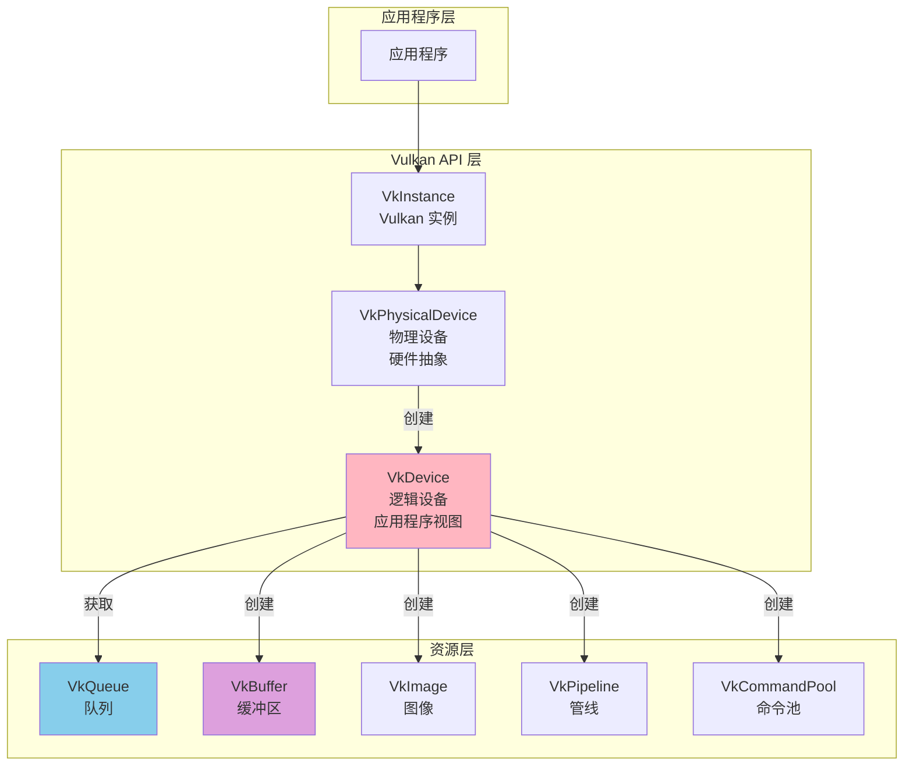

---

## 逻辑设备的作用与重要性

### 逻辑设备的主要作用

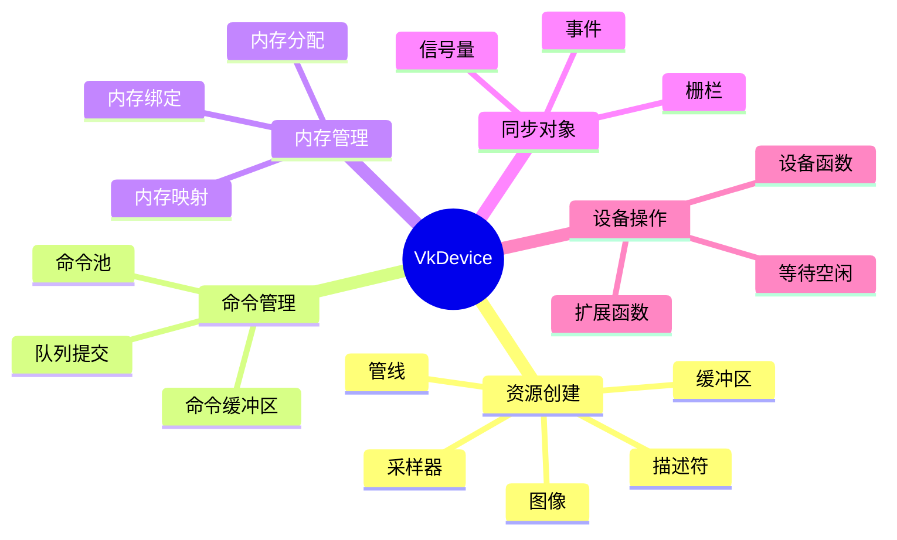

### 物理设备 vs 逻辑设备

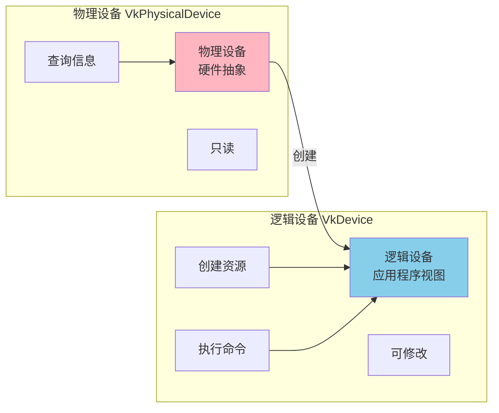

### 对比表

| 特性 | VkPhysicalDevice | VkDevice |
|------|-----------------|----------|
| **类型** | 硬件抽象 | 逻辑设备 |
| **创建方式** | 枚举获得 | `vkCreateDevice` 创建 |
| **用途** | 查询硬件信息 | 创建资源、执行命令 |
| **生命周期** | 由系统管理 | 由应用程序管理 |
| **可修改性** | 只读 | 可创建和修改资源 |
| **数量** | 系统中所有 GPU | 每个应用可创建多个 |
| **操作** | 查询属性、功能 | 创建资源、提交命令 |

### 为什么需要逻辑设备？

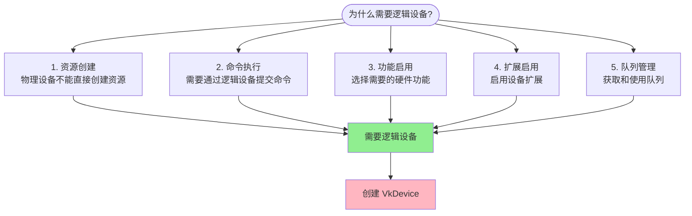

---

## 逻辑设备的创建流程

### 完整创建流程图

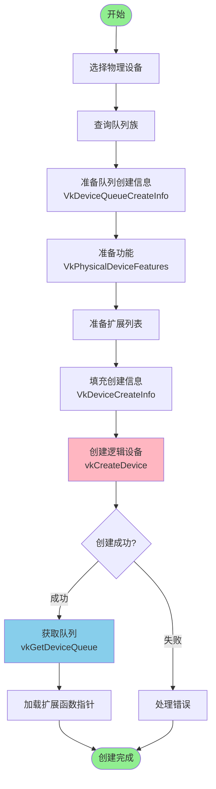

### 创建序列图

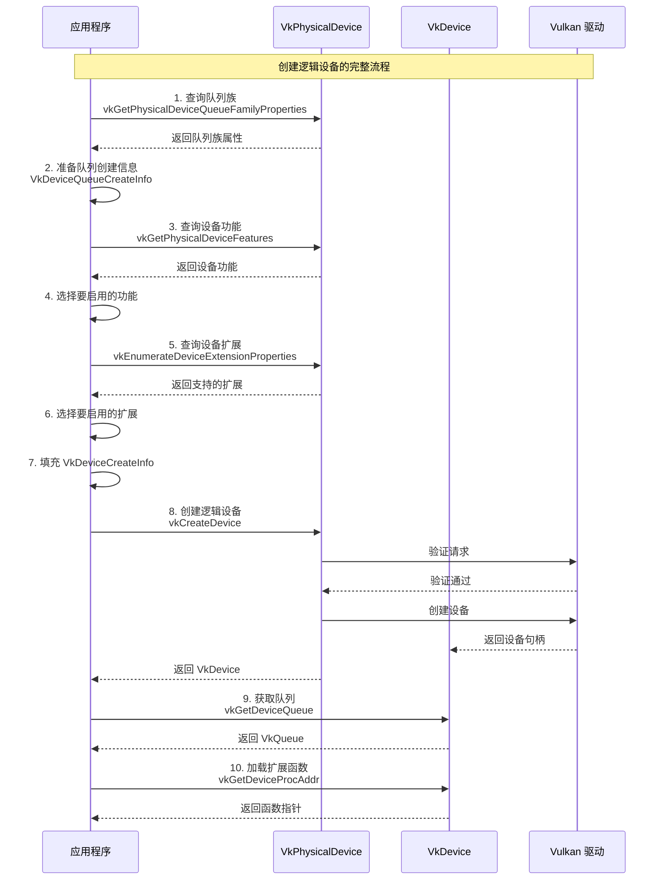

---

## VkDeviceCreateInfo 结构详解

### VkDeviceCreateInfo 结构图

```mermaid
graph TD
    subgraph "VkDeviceCreateInfo"
        sType[sType<br/>结构体类型]
        pNext[pNext<br/>扩展链指针]
        flags[flags<br/>创建标志]
        queueCreateInfoCount[queueCreateInfoCount<br/>队列创建信息数量]
        pQueueCreateInfos[pQueueCreateInfos<br/>队列创建信息数组]
        enabledLayerCount[enabledLayerCount<br/>启用的层数量<br/>已弃用]
        ppEnabledLayerNames[ppEnabledLayerNames<br/>启用的层名称数组<br/>已弃用]
        enabledExtensionCount[enabledExtensionCount<br/>启用的扩展数量]
        ppEnabledExtensionNames[ppEnabledExtensionNames<br/>启用的扩展名称数组]
        pEnabledFeatures[pEnabledFeatures<br/>启用的功能指针]
    end
    
    subgraph "VkDeviceQueueCreateInfo"
        Queue_sType[sType]
        Queue_pNext[pNext]
        Queue_flags[flags<br/>队列族标志]
        Queue_familyIndex[queueFamilyIndex<br/>队列族索引]
        Queue_queueCount[queueCount<br/>队列数量]
        Queue_pQueuePriorities[pQueuePriorities<br/>队列优先级数组]
    end
    
    pQueueCreateInfos --> Queue_sType
    pEnabledFeatures --> Features[VkPhysicalDeviceFeatures]
    pNext --> Features2[VkPhysicalDeviceFeatures2<br/>扩展功能]
    
    style pQueueCreateInfos fill:#FFB6C1
    style pEnabledFeatures fill:#87CEEB
    style ppEnabledExtensionNames fill:#DDA0DD
```

### 结构体字段说明

| 字段 | 类型 | 说明 |
|------|------|------|
| **sType** | VkStructureType | 结构体类型，必须为 `VK_STRUCTURE_TYPE_DEVICE_CREATE_INFO` |
| **pNext** | const void* | 指向扩展结构的指针，用于链接扩展功能信息 |
| **flags** | VkDeviceCreateFlags | 创建标志，通常为 0 |
| **queueCreateInfoCount** | uint32_t | 队列创建信息数量 |
| **pQueueCreateInfos** | const VkDeviceQueueCreateInfo* | 队列创建信息数组 |
| **enabledLayerCount** | uint32_t | 启用的层数量（已弃用，应设为 0） |
| **ppEnabledLayerNames** | const char* const* | 启用的层名称数组（已弃用，应设为 nullptr） |
| **enabledExtensionCount** | uint32_t | 启用的扩展数量 |
| **ppEnabledExtensionNames** | const char* const* | 启用的扩展名称数组 |
| **pEnabledFeatures** | const VkPhysicalDeviceFeatures* | 启用的功能指针 |

### VkDeviceQueueCreateInfo 字段说明

| 字段 | 类型 | 说明 |
|------|------|------|
| **queueFamilyIndex** | uint32_t | 队列族索引 |
| **queueCount** | uint32_t | 从此队列族创建的队列数量 |
| **pQueuePriorities** | const float* | 队列优先级数组（0.0-1.0） |

---

## 队列创建与获取

### 队列创建流程

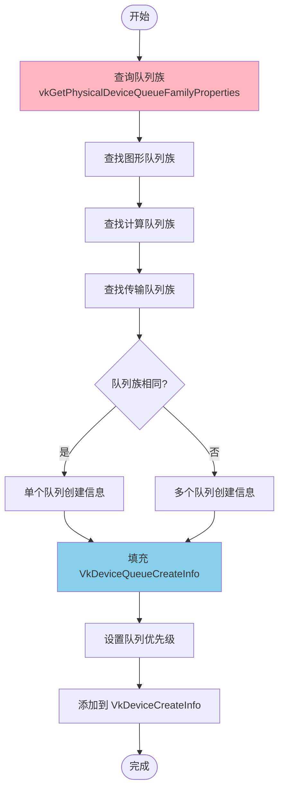

### 队列族索引查找

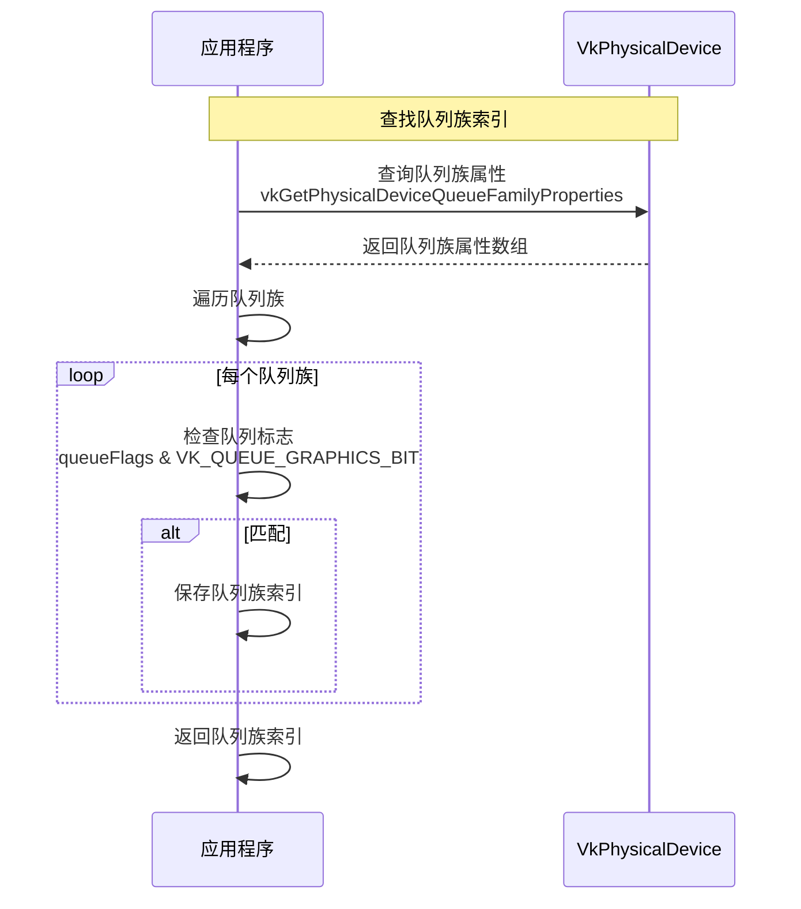

### 队列获取代码示例

```cpp
/**
 * @brief 查找队列族索引
 * @param device 物理设备
 * @param queueFlags 队列标志
 * @return 队列族索引
 */
uint32_t findQueueFamily(VkPhysicalDevice device, VkQueueFlags queueFlags)
{
    uint32_t queueFamilyCount = 0;
    vkGetPhysicalDeviceQueueFamilyProperties(device, &queueFamilyCount, nullptr);
    
    std::vector<VkQueueFamilyProperties> queueFamilies(queueFamilyCount);
    vkGetPhysicalDeviceQueueFamilyProperties(device, &queueFamilyCount, 
                                            queueFamilies.data());
    
    for (uint32_t i = 0; i < queueFamilyCount; i++) {
        if (queueFamilies[i].queueFlags & queueFlags) {
            return i;
        }
    }
    
    return UINT32_MAX;  // 未找到
}

/**
 * @brief 创建逻辑设备并获取队列
 */
VkResult createDeviceWithQueues(VkPhysicalDevice physicalDevice, 
                                 VkDevice& device,
                                 VkQueue& graphicsQueue,
                                 VkQueue& computeQueue)
{
    // 1. 查找队列族索引
    uint32_t graphicsFamily = findQueueFamily(physicalDevice, VK_QUEUE_GRAPHICS_BIT);
    uint32_t computeFamily = findQueueFamily(physicalDevice, VK_QUEUE_COMPUTE_BIT);
    
    if (graphicsFamily == UINT32_MAX) {
        return VK_ERROR_INITIALIZATION_FAILED;
    }
    
    // 2. 准备队列创建信息
    std::vector<VkDeviceQueueCreateInfo> queueCreateInfos;
    std::set<uint32_t> uniqueQueueFamilies = {graphicsFamily};
    
    float queuePriority = 1.0f;
    
    // 图形队列
    VkDeviceQueueCreateInfo graphicsQueueInfo{};
    graphicsQueueInfo.sType = VK_STRUCTURE_TYPE_DEVICE_QUEUE_CREATE_INFO;
    graphicsQueueInfo.queueFamilyIndex = graphicsFamily;
    graphicsQueueInfo.queueCount = 1;
    graphicsQueueInfo.pQueuePriorities = &queuePriority;
    queueCreateInfos.push_back(graphicsQueueInfo);
    
    // 计算队列（如果不同）
    if (computeFamily != graphicsFamily && computeFamily != UINT32_MAX) {
        VkDeviceQueueCreateInfo computeQueueInfo{};
        computeQueueInfo.sType = VK_STRUCTURE_TYPE_DEVICE_QUEUE_CREATE_INFO;
        computeQueueInfo.queueFamilyIndex = computeFamily;
        computeQueueInfo.queueCount = 1;
        computeQueueInfo.pQueuePriorities = &queuePriority;
        queueCreateInfos.push_back(computeQueueInfo);
    }
    
    // 3. 准备设备创建信息
    VkPhysicalDeviceFeatures deviceFeatures{};
    VkDeviceCreateInfo createInfo{};
    createInfo.sType = VK_STRUCTURE_TYPE_DEVICE_CREATE_INFO;
    createInfo.queueCreateInfoCount = static_cast<uint32_t>(queueCreateInfos.size());
    createInfo.pQueueCreateInfos = queueCreateInfos.data();
    createInfo.pEnabledFeatures = &deviceFeatures;
    
    // 4. 创建逻辑设备
    VkResult result = vkCreateDevice(physicalDevice, &createInfo, nullptr, &device);
    if (result != VK_SUCCESS) {
        return result;
    }
    
    // 5. 获取队列
    vkGetDeviceQueue(device, graphicsFamily, 0, &graphicsQueue);
    if (computeFamily != graphicsFamily && computeFamily != UINT32_MAX) {
        vkGetDeviceQueue(device, computeFamily, 0, &computeQueue);
    } else {
        computeQueue = graphicsQueue;  // 使用相同的队列
    }
    
    return VK_SUCCESS;
}
```

---

## 功能启用

### 功能启用流程

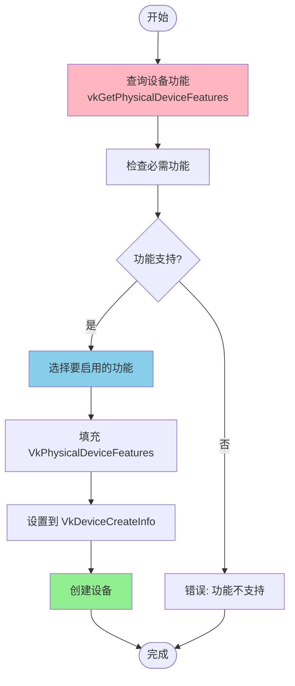

### 功能启用代码示例

```cpp
/**
 * @brief 检查并启用设备功能
 */
VkResult createDeviceWithFeatures(VkPhysicalDevice physicalDevice, VkDevice& device)
{
    // 1. 查询设备功能
    VkPhysicalDeviceFeatures availableFeatures;
    vkGetPhysicalDeviceFeatures(physicalDevice, &availableFeatures);
    
    // 2. 选择要启用的功能
    VkPhysicalDeviceFeatures enabledFeatures{};
    
    // 启用几何着色器（如果支持）
    if (availableFeatures.geometryShader) {
        enabledFeatures.geometryShader = VK_TRUE;
    }
    
    // 启用曲面细分着色器（如果支持）
    if (availableFeatures.tessellationShader) {
        enabledFeatures.tessellationShader = VK_TRUE;
    }
    
    // 启用采样器各向异性（如果支持）
    if (availableFeatures.samplerAnisotropy) {
        enabledFeatures.samplerAnisotropy = VK_TRUE;
    }
    
    // 3. 准备队列创建信息
    uint32_t queueFamily = findQueueFamily(physicalDevice, VK_QUEUE_GRAPHICS_BIT);
    float queuePriority = 1.0f;
    
    VkDeviceQueueCreateInfo queueCreateInfo{};
    queueCreateInfo.sType = VK_STRUCTURE_TYPE_DEVICE_QUEUE_CREATE_INFO;
    queueCreateInfo.queueFamilyIndex = queueFamily;
    queueCreateInfo.queueCount = 1;
    queueCreateInfo.pQueuePriorities = &queuePriority;
    
    // 4. 准备设备创建信息
    VkDeviceCreateInfo createInfo{};
    createInfo.sType = VK_STRUCTURE_TYPE_DEVICE_CREATE_INFO;
    createInfo.queueCreateInfoCount = 1;
    createInfo.pQueueCreateInfos = &queueCreateInfo;
    createInfo.pEnabledFeatures = &enabledFeatures;
    
    // 5. 创建逻辑设备
    return vkCreateDevice(physicalDevice, &createInfo, nullptr, &device);
}
```

### 扩展功能启用（使用 pNext 链）

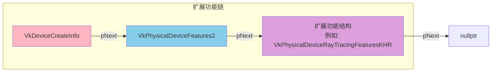

```cpp
/**
 * @brief 使用扩展功能创建设备
 */
VkResult createDeviceWithExtendedFeatures(VkPhysicalDevice physicalDevice, VkDevice& device)
{
    // 1. 查询扩展功能
    VkPhysicalDeviceRayTracingFeaturesKHR rayTracingFeatures{};
    rayTracingFeatures.sType = VK_STRUCTURE_TYPE_PHYSICAL_DEVICE_RAY_TRACING_FEATURES_KHR;
    
    VkPhysicalDeviceFeatures2 features2{};
    features2.sType = VK_STRUCTURE_TYPE_PHYSICAL_DEVICE_FEATURES_2;
    features2.pNext = &rayTracingFeatures;
    
    vkGetPhysicalDeviceFeatures2(physicalDevice, &features2);
    
    // 2. 启用扩展功能
    VkPhysicalDeviceRayTracingFeaturesKHR enabledRayTracingFeatures{};
    enabledRayTracingFeatures.sType = VK_STRUCTURE_TYPE_PHYSICAL_DEVICE_RAY_TRACING_FEATURES_KHR;
    enabledRayTracingFeatures.rayTracingPipeline = VK_TRUE;  // 启用光线追踪管线
    
    VkPhysicalDeviceFeatures2 enabledFeatures2{};
    enabledFeatures2.sType = VK_STRUCTURE_TYPE_PHYSICAL_DEVICE_FEATURES_2;
    enabledFeatures2.pNext = &enabledRayTracingFeatures;
    
    // 3. 准备队列创建信息
    uint32_t queueFamily = findQueueFamily(physicalDevice, VK_QUEUE_GRAPHICS_BIT);
    float queuePriority = 1.0f;
    
    VkDeviceQueueCreateInfo queueCreateInfo{};
    queueCreateInfo.sType = VK_STRUCTURE_TYPE_DEVICE_QUEUE_CREATE_INFO;
    queueCreateInfo.queueFamilyIndex = queueFamily;
    queueCreateInfo.queueCount = 1;
    queueCreateInfo.pQueuePriorities = &queuePriority;
    
    // 4. 准备设备创建信息（使用 pNext 链）
    VkDeviceCreateInfo createInfo{};
    createInfo.sType = VK_STRUCTURE_TYPE_DEVICE_CREATE_INFO;
    createInfo.queueCreateInfoCount = 1;
    createInfo.pQueueCreateInfos = &queueCreateInfo;
    createInfo.pEnabledFeatures = nullptr;  // 不使用旧的功能指针
    createInfo.pNext = &enabledFeatures2;  // 使用 pNext 链
    
    // 5. 启用扩展
    const char* extensions[] = {VK_KHR_RAY_TRACING_PIPELINE_EXTENSION_NAME};
    createInfo.enabledExtensionCount = 1;
    createInfo.ppEnabledExtensionNames = extensions;
    
    // 6. 创建逻辑设备
    return vkCreateDevice(physicalDevice, &createInfo, nullptr, &device);
}
```

---

## 扩展启用

### 扩展启用流程

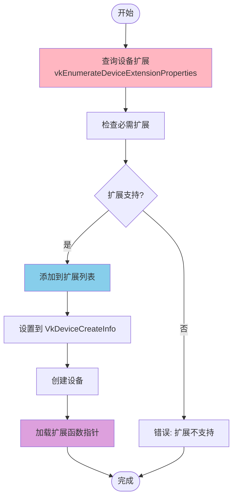

### 扩展启用代码示例

```cpp
/**
 * @brief 检查设备扩展支持
 */
bool checkDeviceExtensionSupport(VkPhysicalDevice device, 
                                 const std::vector<const char*>& requiredExtensions)
{
    // 查询支持的扩展
    uint32_t extensionCount = 0;
    vkEnumerateDeviceExtensionProperties(device, nullptr, &extensionCount, nullptr);
    
    std::vector<VkExtensionProperties> availableExtensions(extensionCount);
    vkEnumerateDeviceExtensionProperties(device, nullptr, &extensionCount, 
                                        availableExtensions.data());
    
    // 检查所有必需扩展
    std::set<std::string> requiredSet(requiredExtensions.begin(), requiredExtensions.end());
    
    for (const auto& extension : availableExtensions) {
        requiredSet.erase(extension.extensionName);
    }
    
    return requiredSet.empty();  // 如果所有扩展都找到，返回 true
}

/**
 * @brief 创建带扩展的设备
 */
VkResult createDeviceWithExtensions(VkPhysicalDevice physicalDevice, 
                                   VkDevice& device,
                                   const std::vector<const char*>& extensions)
{
    // 1. 检查扩展支持
    if (!checkDeviceExtensionSupport(physicalDevice, extensions)) {
        std::cerr << "Not all required extensions are supported\n";
        return VK_ERROR_EXTENSION_NOT_PRESENT;
    }
    
    // 2. 准备队列创建信息
    uint32_t queueFamily = findQueueFamily(physicalDevice, VK_QUEUE_GRAPHICS_BIT);
    float queuePriority = 1.0f;
    
    VkDeviceQueueCreateInfo queueCreateInfo{};
    queueCreateInfo.sType = VK_STRUCTURE_TYPE_DEVICE_QUEUE_CREATE_INFO;
    queueCreateInfo.queueFamilyIndex = queueFamily;
    queueCreateInfo.queueCount = 1;
    queueCreateInfo.pQueuePriorities = &queuePriority;
    
    // 3. 准备设备功能
    VkPhysicalDeviceFeatures deviceFeatures{};
    
    // 4. 准备设备创建信息
    VkDeviceCreateInfo createInfo{};
    createInfo.sType = VK_STRUCTURE_TYPE_DEVICE_CREATE_INFO;
    createInfo.queueCreateInfoCount = 1;
    createInfo.pQueueCreateInfos = &queueCreateInfo;
    createInfo.pEnabledFeatures = &deviceFeatures;
    createInfo.enabledExtensionCount = static_cast<uint32_t>(extensions.size());
    createInfo.ppEnabledExtensionNames = extensions.data();
    
    // 5. 创建逻辑设备
    return vkCreateDevice(physicalDevice, &createInfo, nullptr, &device);
}
```

---

## 逻辑设备的生命周期

### 生命周期阶段

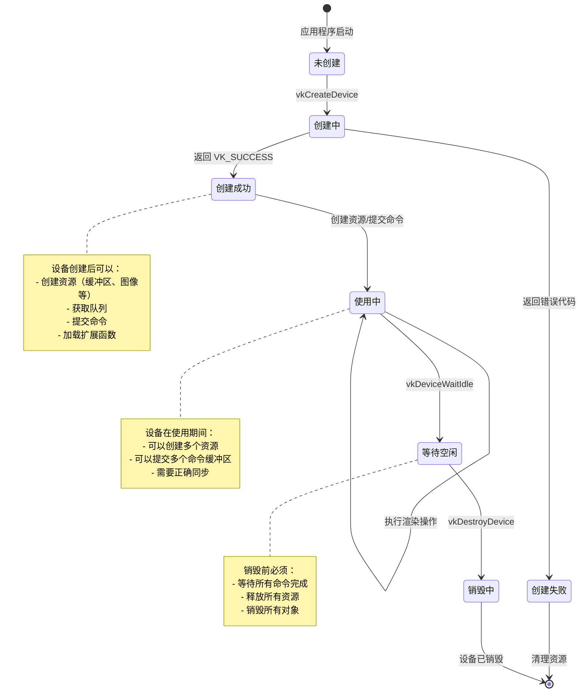

### 创建到销毁的完整流程

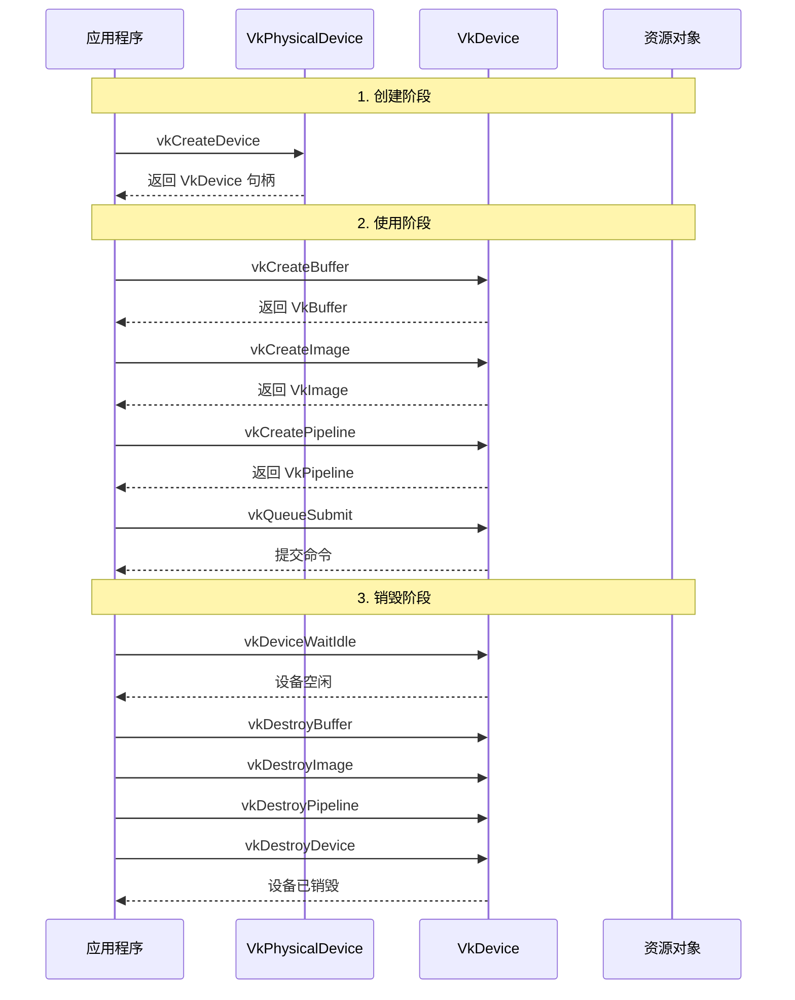

---

## 逻辑设备的使用

### 设备的主要用途

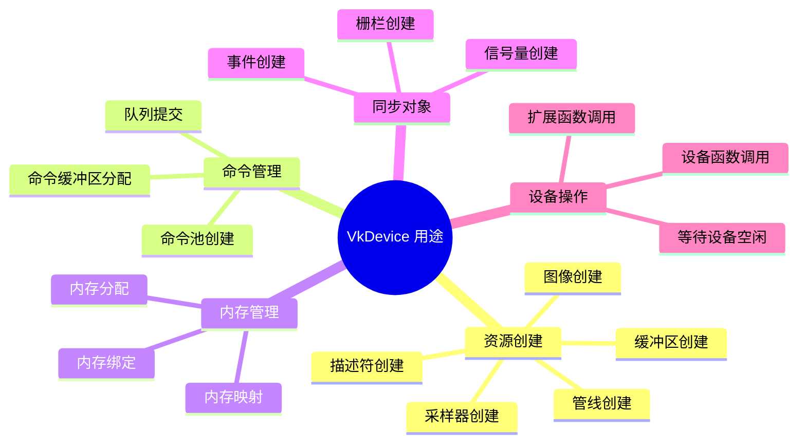

### 资源创建流程

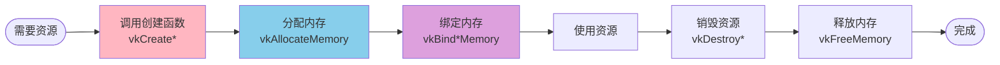

### 设备函数分类

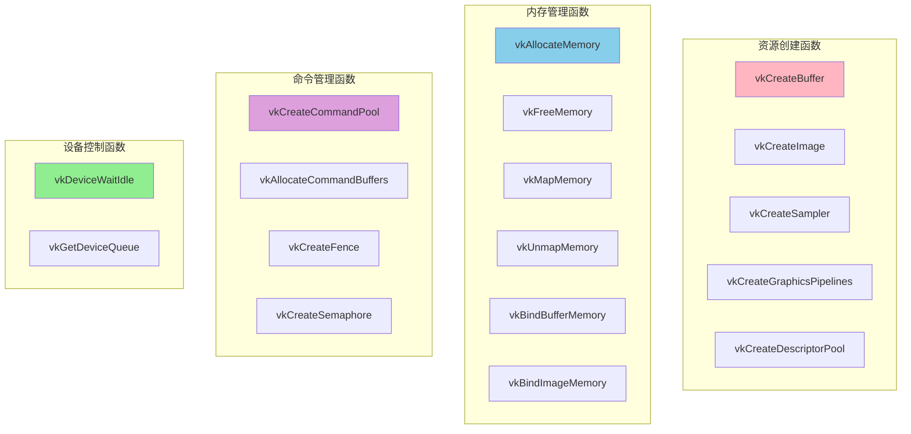

---

## 实际代码示例

### 完整的逻辑设备创建代码

```cpp
/**
 * @brief 完整的逻辑设备创建和管理类
 */
class LogicalDeviceManager {
private:
    VkPhysicalDevice physicalDevice;
    VkDevice device;
    VkQueue graphicsQueue;
    VkQueue computeQueue;
    VkQueue transferQueue;
    
    struct QueueFamilyIndices {
        uint32_t graphics = UINT32_MAX;
        uint32_t compute = UINT32_MAX;
        uint32_t transfer = UINT32_MAX;
    } queueFamilyIndices;
    
public:
    /**
     * @brief 初始化逻辑设备管理器
     */
    VkResult initialize(VkPhysicalDevice physicalDevice,
                        const std::vector<const char*>& extensions,
                        const VkPhysicalDeviceFeatures& features) {
        this->physicalDevice = physicalDevice;
        
        // 1. 查找队列族索引
        findQueueFamilies();
        
        // 2. 准备队列创建信息
        std::vector<VkDeviceQueueCreateInfo> queueCreateInfos;
        std::set<uint32_t> uniqueQueueFamilies = {
            queueFamilyIndices.graphics
        };
        
        float queuePriority = 1.0f;
        
        // 图形队列
        VkDeviceQueueCreateInfo graphicsQueueInfo{};
        graphicsQueueInfo.sType = VK_STRUCTURE_TYPE_DEVICE_QUEUE_CREATE_INFO;
        graphicsQueueInfo.queueFamilyIndex = queueFamilyIndices.graphics;
        graphicsQueueInfo.queueCount = 1;
        graphicsQueueInfo.pQueuePriorities = &queuePriority;
        queueCreateInfos.push_back(graphicsQueueInfo);
        
        // 计算队列（如果不同）
        if (queueFamilyIndices.compute != UINT32_MAX && 
            queueFamilyIndices.compute != queueFamilyIndices.graphics) {
            VkDeviceQueueCreateInfo computeQueueInfo{};
            computeQueueInfo.sType = VK_STRUCTURE_TYPE_DEVICE_QUEUE_CREATE_INFO;
            computeQueueInfo.queueFamilyIndex = queueFamilyIndices.compute;
            computeQueueInfo.queueCount = 1;
            computeQueueInfo.pQueuePriorities = &queuePriority;
            queueCreateInfos.push_back(computeQueueInfo);
            uniqueQueueFamilies.insert(queueFamilyIndices.compute);
        }
        
        // 传输队列（如果不同）
        if (queueFamilyIndices.transfer != UINT32_MAX &&
            queueFamilyIndices.transfer != queueFamilyIndices.graphics &&
            queueFamilyIndices.transfer != queueFamilyIndices.compute) {
            VkDeviceQueueCreateInfo transferQueueInfo{};
            transferQueueInfo.sType = VK_STRUCTURE_TYPE_DEVICE_QUEUE_CREATE_INFO;
            transferQueueInfo.queueFamilyIndex = queueFamilyIndices.transfer;
            transferQueueInfo.queueCount = 1;
            transferQueueInfo.pQueuePriorities = &queuePriority;
            queueCreateInfos.push_back(transferQueueInfo);
        }
        
        // 3. 准备设备创建信息
        VkDeviceCreateInfo createInfo{};
        createInfo.sType = VK_STRUCTURE_TYPE_DEVICE_CREATE_INFO;
        createInfo.queueCreateInfoCount = static_cast<uint32_t>(queueCreateInfos.size());
        createInfo.pQueueCreateInfos = queueCreateInfos.data();
        createInfo.pEnabledFeatures = &features;
        createInfo.enabledExtensionCount = static_cast<uint32_t>(extensions.size());
        createInfo.ppEnabledExtensionNames = extensions.data();
        
        // 4. 创建逻辑设备
        VkResult result = vkCreateDevice(physicalDevice, &createInfo, nullptr, &device);
        if (result != VK_SUCCESS) {
            return result;
        }
        
        // 5. 获取队列
        vkGetDeviceQueue(device, queueFamilyIndices.graphics, 0, &graphicsQueue);
        if (queueFamilyIndices.compute != UINT32_MAX) {
            if (queueFamilyIndices.compute != queueFamilyIndices.graphics) {
                vkGetDeviceQueue(device, queueFamilyIndices.compute, 0, &computeQueue);
            } else {
                computeQueue = graphicsQueue;
            }
        }
        if (queueFamilyIndices.transfer != UINT32_MAX) {
            if (queueFamilyIndices.transfer != queueFamilyIndices.graphics &&
                queueFamilyIndices.transfer != queueFamilyIndices.compute) {
                vkGetDeviceQueue(device, queueFamilyIndices.transfer, 0, &transferQueue);
            } else {
                transferQueue = graphicsQueue;
            }
        }
        
        return VK_SUCCESS;
    }
    
    /**
     * @brief 查找队列族索引
     */
    void findQueueFamilies() {
        uint32_t queueFamilyCount = 0;
        vkGetPhysicalDeviceQueueFamilyProperties(physicalDevice, &queueFamilyCount, nullptr);
        
        std::vector<VkQueueFamilyProperties> queueFamilies(queueFamilyCount);
        vkGetPhysicalDeviceQueueFamilyProperties(physicalDevice, &queueFamilyCount, 
                                                queueFamilies.data());
        
        for (uint32_t i = 0; i < queueFamilyCount; i++) {
            // 查找图形队列
            if (queueFamilies[i].queueFlags & VK_QUEUE_GRAPHICS_BIT) {
                queueFamilyIndices.graphics = i;
            }
            
            // 查找计算队列（专用）
            if ((queueFamilies[i].queueFlags & VK_QUEUE_COMPUTE_BIT) &&
                !(queueFamilies[i].queueFlags & VK_QUEUE_GRAPHICS_BIT)) {
                queueFamilyIndices.compute = i;
            }
            
            // 查找传输队列（专用）
            if ((queueFamilies[i].queueFlags & VK_QUEUE_TRANSFER_BIT) &&
                !(queueFamilies[i].queueFlags & VK_QUEUE_GRAPHICS_BIT) &&
                !(queueFamilies[i].queueFlags & VK_QUEUE_COMPUTE_BIT)) {
                queueFamilyIndices.transfer = i;
            }
        }
        
        // 如果没有找到专用计算队列，使用图形队列
        if (queueFamilyIndices.compute == UINT32_MAX) {
            queueFamilyIndices.compute = queueFamilyIndices.graphics;
        }
        
        // 如果没有找到专用传输队列，使用图形队列
        if (queueFamilyIndices.transfer == UINT32_MAX) {
            queueFamilyIndices.transfer = queueFamilyIndices.graphics;
        }
    }
    
    /**
     * @brief 清理资源
     */
    void cleanup() {
        if (device != VK_NULL_HANDLE) {
            vkDeviceWaitIdle(device);  // 等待设备空闲
            vkDestroyDevice(device, nullptr);
            device = VK_NULL_HANDLE;
        }
    }
    
    // Getter 方法
    VkDevice getDevice() const { return device; }
    VkQueue getGraphicsQueue() const { return graphicsQueue; }
    VkQueue getComputeQueue() const { return computeQueue; }
    VkQueue getTransferQueue() const { return transferQueue; }
    const QueueFamilyIndices& getQueueFamilyIndices() const { 
        return queueFamilyIndices; 
    }
};
```

---

## 最佳实践

### 逻辑设备使用最佳实践

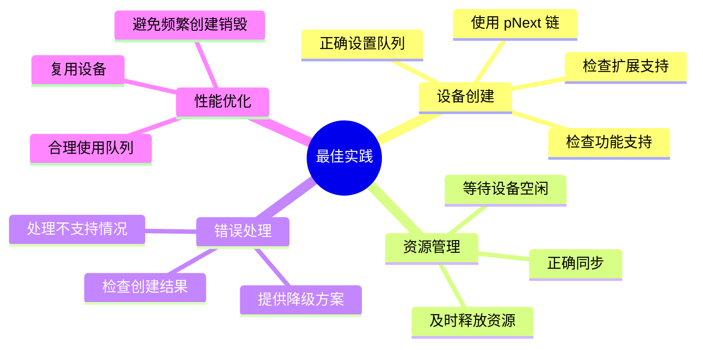

### 检查清单

| 实践 | 说明 | 重要性 |
|------|------|--------|
| **检查功能支持** | 启用前检查功能是否支持 | ⭐⭐⭐⭐⭐ |
| **检查扩展支持** | 启用前检查扩展是否支持 | ⭐⭐⭐⭐⭐ |
| **正确设置队列** | 根据需求设置队列 | ⭐⭐⭐⭐⭐ |
| **等待设备空闲** | 销毁前等待设备空闲 | ⭐⭐⭐⭐⭐ |
| **释放所有资源** | 销毁设备前释放所有资源 | ⭐⭐⭐⭐⭐ |
| **错误处理** | 检查所有设备操作的返回值 | ⭐⭐⭐⭐⭐ |
| **使用 pNext 链** | 扩展功能使用 pNext 链 | ⭐⭐⭐⭐ |

### 常见错误与解决方案

| 错误 | 原因 | 解决方案 |
|------|------|---------|
| **VK_ERROR_FEATURE_NOT_PRESENT** | 启用了不支持的功能 | 查询功能，只启用支持的功能 |
| **VK_ERROR_EXTENSION_NOT_PRESENT** | 启用了不支持的扩展 | 查询扩展，检查扩展支持 |
| **VK_ERROR_INITIALIZATION_FAILED** | 设备初始化失败 | 检查队列族、功能、扩展配置 |
| **资源泄漏** | 未释放资源就销毁设备 | 销毁前释放所有资源 |
| **设备忙** | 设备正在使用时销毁 | 使用 `vkDeviceWaitIdle` 等待 |

### 设备销毁流程

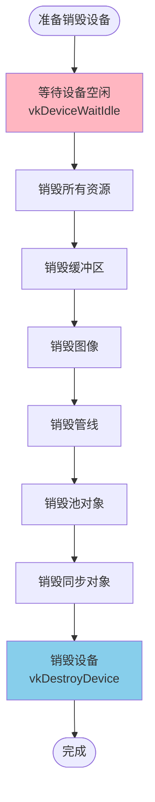

---

## 总结

### VkDevice 核心要点

1. **应用程序视图**: 代表应用程序对物理设备的视图
2. **资源创建**: 所有设备级别资源的创建入口
3. **命令执行**: 通过队列提交和执行命令
4. **生命周期管理**: 由应用程序显式管理
5. **多设备支持**: 可以创建多个逻辑设备

### 逻辑设备创建流程总结


### 相关 API 速查

| API | 说明 |
|-----|------|
| `vkCreateDevice()` | 创建逻辑设备 |
| `vkDestroyDevice()` | 销毁逻辑设备 |
| `vkGetDeviceQueue()` | 获取设备队列 |
| `vkDeviceWaitIdle()` | 等待设备空闲 |
| `vkGetDeviceProcAddr()` | 获取设备扩展函数地址 |

### 设备创建检查清单

- ✅ 查询物理设备信息
- ✅ 查找队列族索引
- ✅ 检查功能支持
- ✅ 检查扩展支持
- ✅ 准备队列创建信息
- ✅ 准备功能启用信息
- ✅ 准备扩展启用信息
- ✅ 创建逻辑设备
- ✅ 检查创建结果
- ✅ 获取队列句柄
- ✅ 加载扩展函数指针

---

*文档版本: 1.0*  
*最后更新: 2024*  
*基于 Vulkan 1.3 规范*

