# VkInstance 详细分析文档

## 目录
1. [VkInstance 概述](#vkinstance-概述)
2. [VkInstance 的作用与重要性](#vkinstance-的作用与重要性)
3. [VkInstance 的架构](#vkinstance-的架构)
4. [VkInstance 创建流程](#vkinstance-创建流程)
5. [VkInstanceCreateInfo 结构详解](#vkinstancecreateinfo-结构详解)
6. [实例扩展 (Instance Extensions)](#实例扩展-instance-extensions)
7. [验证层 (Validation Layers)](#验证层-validation-layers)
8. [VkInstance 生命周期](#vkinstance-生命周期)
9. [实际代码示例](#实际代码示例)
10. [常见问题与最佳实践](#常见问题与最佳实践)

---

## VkInstance 概述

### 什么是 VkInstance？

**VkInstance** 是 Vulkan 应用程序与 Vulkan 驱动程序之间的连接桥梁。它是 Vulkan 应用程序中第一个需要创建的对象，代表整个 Vulkan 应用程序的上下文。

### VkInstance 的核心特点

- **应用程序级别**: 每个 Vulkan 应用程序至少需要一个实例
- **全局状态**: 存储应用程序级别的 Vulkan 状态
- **扩展入口**: 启用实例级别的扩展和验证层
- **设备发现**: 用于枚举和选择物理设备（GPU）
- **生命周期**: 在应用程序启动时创建，退出时销毁

### VkInstance 在 Vulkan 架构中的位置

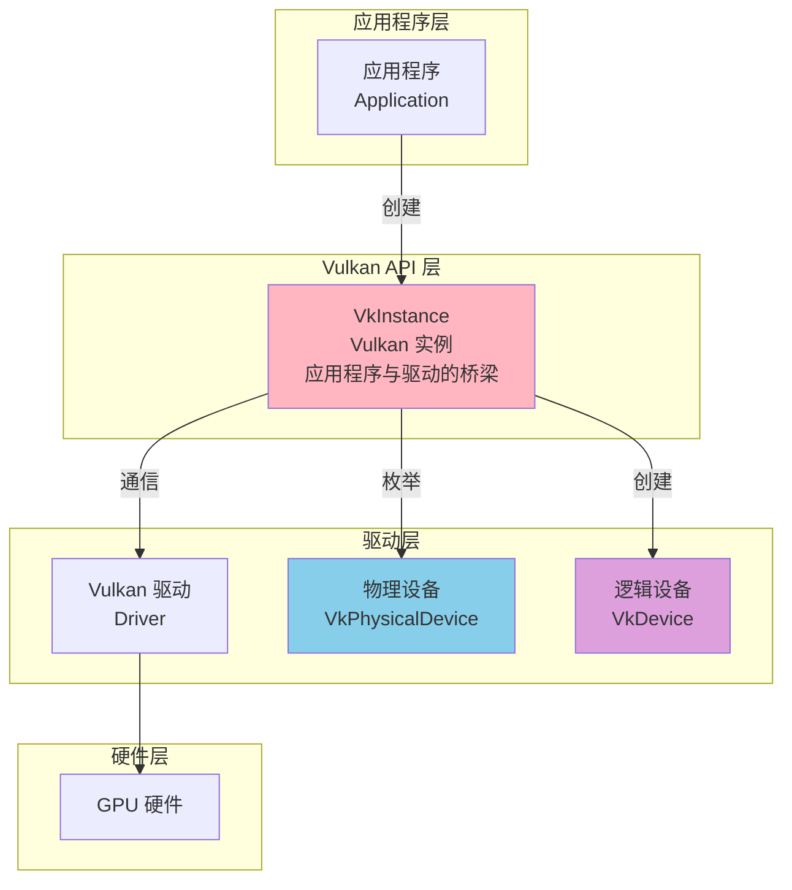

---

## VkInstance 的作用与重要性

### VkInstance 的主要作用

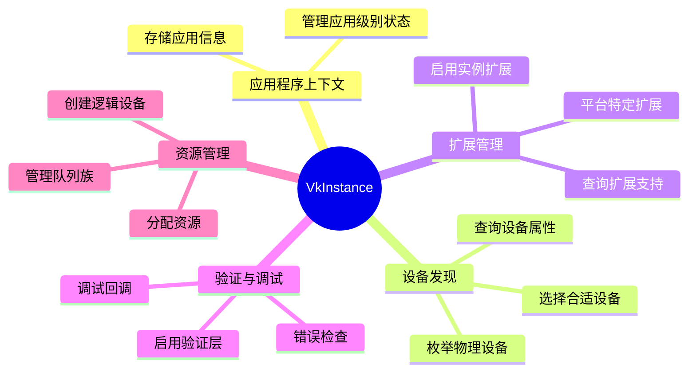

### VkInstance vs 其他 Vulkan 对象

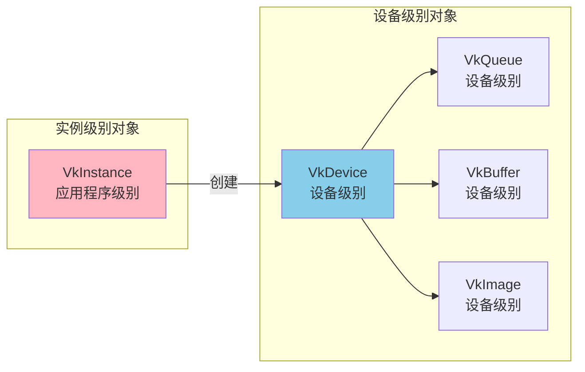

### 为什么需要 VkInstance？

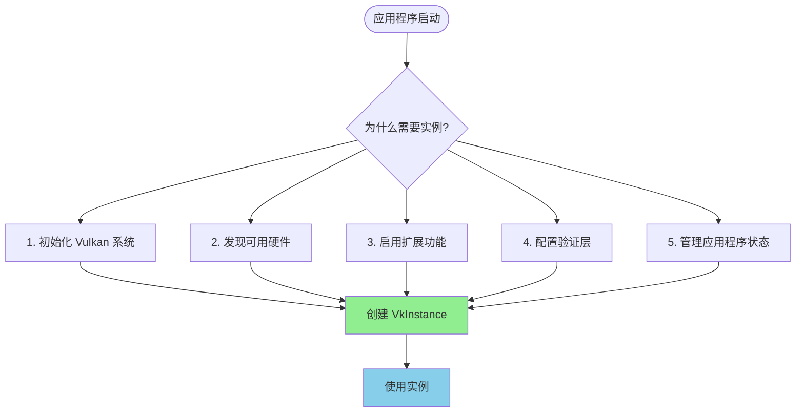

---

## VkInstance 的架构

### VkInstance 内部结构

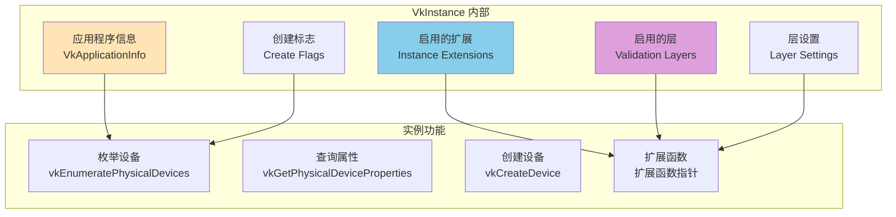

### VkInstance 与系统组件的关系

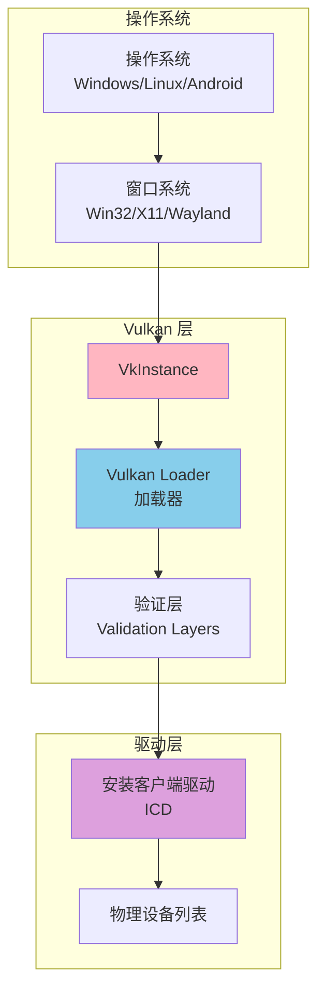

---

## VkInstance 创建流程

### 完整创建流程图

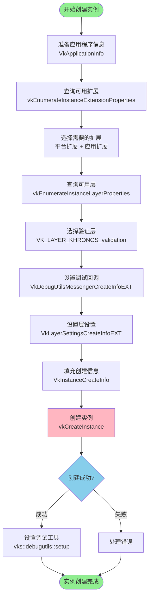

### 创建步骤详解

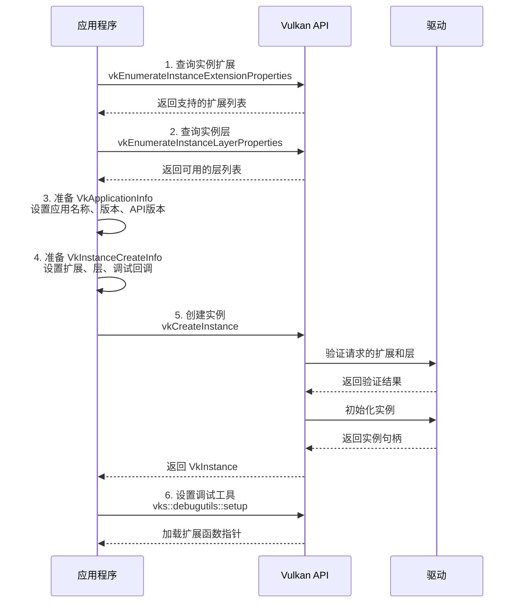

---

## VkInstanceCreateInfo 结构详解

### VkInstanceCreateInfo 结构图

```mermaid
graph TD
    subgraph "VkInstanceCreateInfo"
        sType[sType<br/>结构体类型]
        pNext[pNext<br/>扩展链指针]
        flags[flags<br/>创建标志]
        pApplicationInfo[pApplicationInfo<br/>应用程序信息指针]
        enabledLayerCount[enabledLayerCount<br/>启用的层数量]
        ppEnabledLayerNames[ppEnabledLayerNames<br/>启用的层名称数组]
        enabledExtensionCount[enabledExtensionCount<br/>启用的扩展数量]
        ppEnabledExtensionNames[ppEnabledExtensionNames<br/>启用的扩展名称数组]
    end
    
    subgraph "VkApplicationInfo"
        app_sType[sType]
        app_pNext[pNext]
        app_pApplicationName[pApplicationName<br/>应用程序名称]
        app_applicationVersion[applicationVersion<br/>应用程序版本]
        app_pEngineName[pEngineName<br/>引擎名称]
        app_engineVersion[engineVersion<br/>引擎版本]
        app_apiVersion[apiVersion<br/>Vulkan API 版本]
    end
    
    pApplicationInfo --> app_sType
    pNext --> DebugUtils[VkDebugUtilsMessengerCreateInfoEXT]
    pNext --> LayerSettings[VkLayerSettingsCreateInfoEXT]
    
    style pApplicationInfo fill:#FFE4B5
    style ppEnabledExtensionNames fill:#87CEEB
    style ppEnabledLayerNames fill:#DDA0DD
```

### 结构体字段说明

| 字段 | 类型 | 说明 |
|------|------|------|
| **sType** | VkStructureType | 结构体类型，必须为 `VK_STRUCTURE_TYPE_INSTANCE_CREATE_INFO` |
| **pNext** | const void* | 指向扩展结构的指针，用于链接扩展信息 |
| **flags** | VkInstanceCreateFlags | 创建标志，例如 `VK_INSTANCE_CREATE_ENUMERATE_PORTABILITY_BIT_KHR` |
| **pApplicationInfo** | const VkApplicationInfo* | 指向应用程序信息的指针，可以为 `nullptr` |
| **enabledLayerCount** | uint32_t | 启用的验证层数量 |
| **ppEnabledLayerNames** | const char* const* | 启用的验证层名称数组 |
| **enabledExtensionCount** | uint32_t | 启用的实例扩展数量 |
| **ppEnabledExtensionNames** | const char* const* | 启用的实例扩展名称数组 |

### VkApplicationInfo 字段说明

| 字段 | 类型 | 说明 |
|------|------|------|
| **pApplicationName** | const char* | 应用程序名称，用于驱动优化 |
| **applicationVersion** | uint32_t | 应用程序版本号 |
| **pEngineName** | const char* | 引擎名称（如果使用引擎） |
| **engineVersion** | uint32_t | 引擎版本号 |
| **apiVersion** | uint32_t | Vulkan API 版本，例如 `VK_API_VERSION_1_3` |

### pNext 扩展链

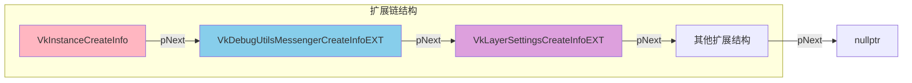

---

## 实例扩展 (Instance Extensions)

### 扩展的作用

实例扩展为 Vulkan 实例添加额外的功能，主要包括：
- **平台集成**: 与窗口系统集成（Win32、X11、Wayland 等）
- **调试支持**: 调试工具和验证功能
- **设备发现**: 增强的设备枚举功能
- **性能分析**: 性能分析和监控工具

### 常见实例扩展

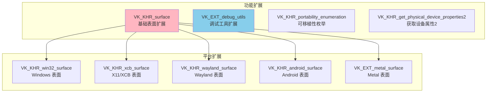

### 扩展查询流程

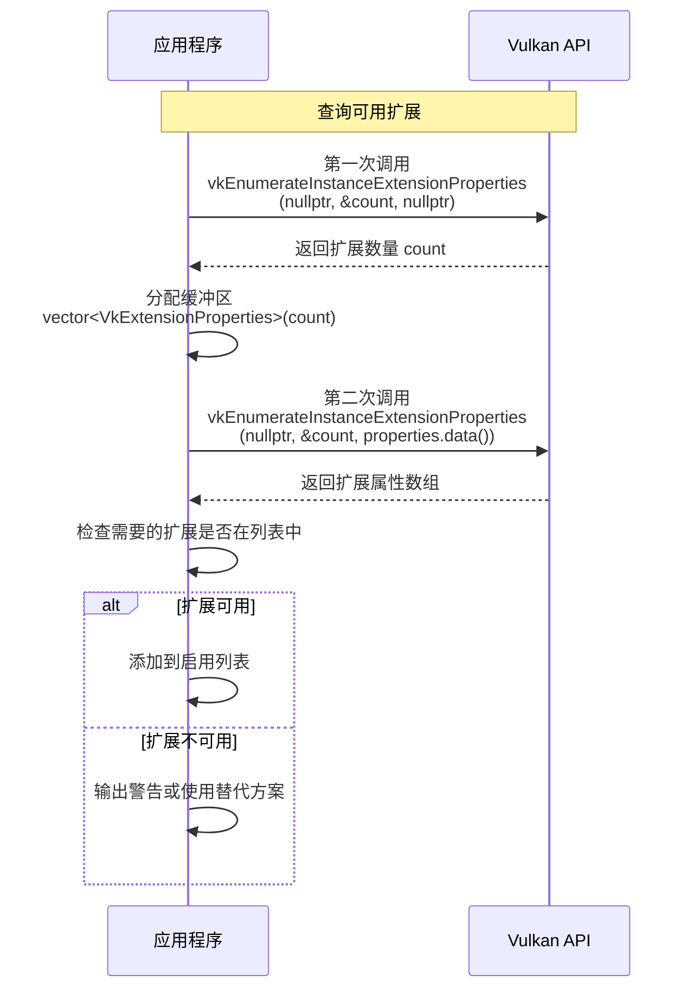

### 平台特定扩展选择

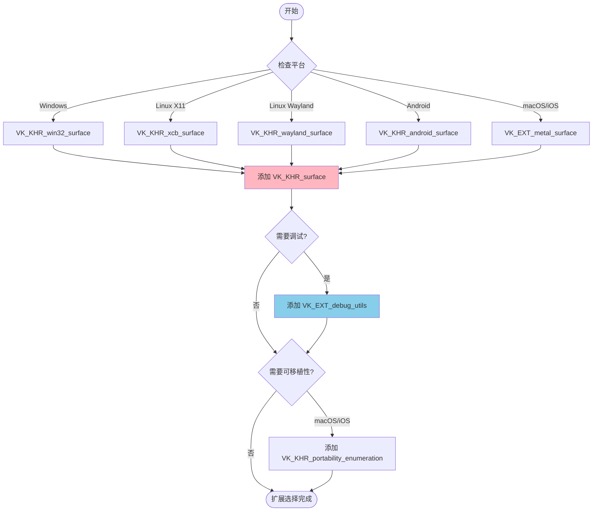

---

## 验证层 (Validation Layers)

### 验证层的作用

验证层是 Vulkan 的调试和验证工具，用于：
- **参数验证**: 检查 API 调用的参数正确性
- **状态检查**: 验证对象状态和资源使用
- **错误报告**: 报告错误和警告信息
- **性能分析**: 检测性能问题

### 验证层架构

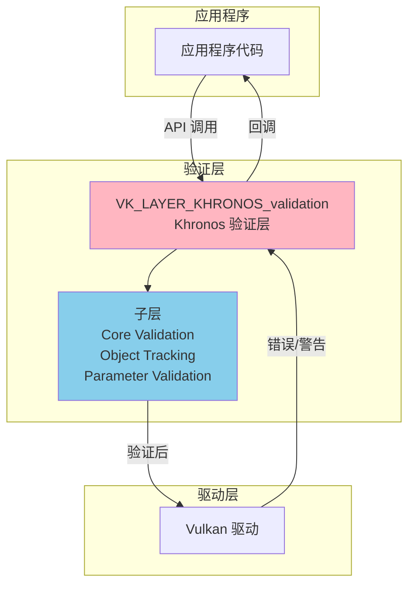

### 验证层启用流程

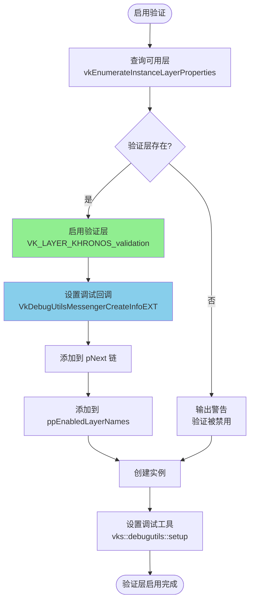

### 验证层设置

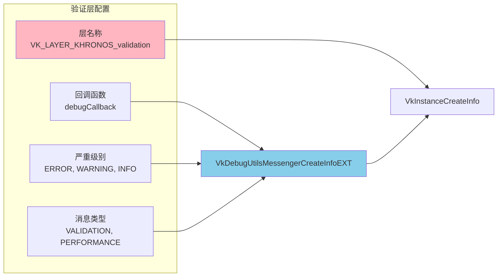

---

## VkInstance 生命周期

### 生命周期阶段

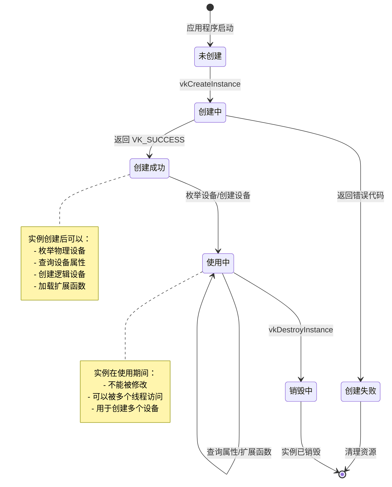

### 创建到销毁的完整流程

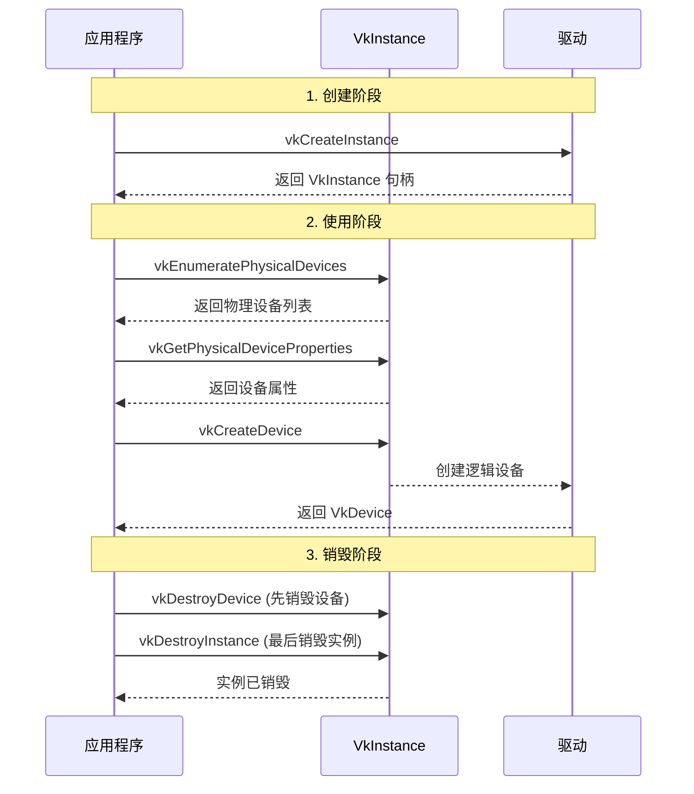

### 实例与设备的关系

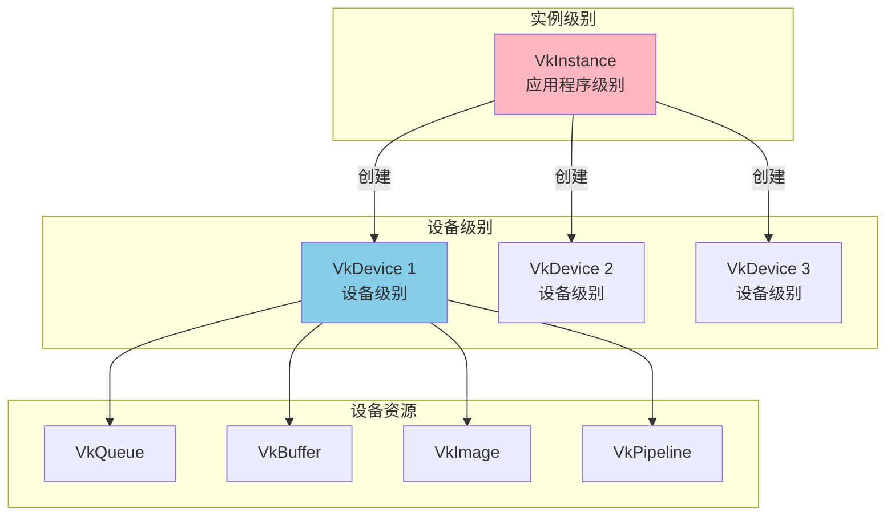

---

## 实际代码示例

### 完整的实例创建代码

```cpp
/**
 * @brief 创建 Vulkan 实例
 * 根据平台启用相应的表面扩展，并创建 Vulkan 实例
 * @return 创建结果（VK_SUCCESS 表示成功）
 */
VkResult VulkanExampleBase::createInstance()
{
    // 1. 准备基础扩展列表（包含平台特定的表面扩展）
    std::vector<const char*> instanceExtensions = { 
        VK_KHR_SURFACE_EXTENSION_NAME  // 基础表面扩展
    };

    // 2. 根据平台添加相应的表面扩展
#if defined(_WIN32)
    instanceExtensions.push_back(VK_KHR_WIN32_SURFACE_EXTENSION_NAME);
#elif defined(VK_USE_PLATFORM_ANDROID_KHR)
    instanceExtensions.push_back(VK_KHR_ANDROID_SURFACE_EXTENSION_NAME);
#elif defined(VK_USE_PLATFORM_XCB_KHR)
    instanceExtensions.push_back(VK_KHR_XCB_SURFACE_EXTENSION_NAME);
    // ... 其他平台
#endif

    // 3. 查询实例支持的扩展
    uint32_t extCount = 0;
    vkEnumerateInstanceExtensionProperties(nullptr, &extCount, nullptr);
    std::vector<VkExtensionProperties> extensions(extCount);
    if (extCount > 0) {
        vkEnumerateInstanceExtensionProperties(nullptr, &extCount, extensions.data());
        for (const auto& ext : extensions) {
            supportedInstanceExtensions.push_back(ext.extensionName);
        }
    }

    // 4. 添加应用程序请求的扩展
    for (const char* enabledExt : enabledInstanceExtensions) {
        if (std::find(supportedInstanceExtensions.begin(), 
                     supportedInstanceExtensions.end(), 
                     enabledExt) == supportedInstanceExtensions.end()) {
            std::cerr << "Enabled instance extension \"" << enabledExt 
                      << "\" is not present at instance level\n";
        }
        instanceExtensions.push_back(enabledExt);
    }

    // 5. 准备应用程序信息
    VkApplicationInfo appInfo{
        .sType = VK_STRUCTURE_TYPE_APPLICATION_INFO,
        .pApplicationName = name.c_str(),
        .pEngineName = name.c_str(),
        .apiVersion = apiVersion  // 例如: VK_API_VERSION_1_3
    };

    // 6. 准备实例创建信息
    VkInstanceCreateInfo instanceCreateInfo{
        .sType = VK_STRUCTURE_TYPE_INSTANCE_CREATE_INFO,
        .pApplicationInfo = &appInfo
    };

    // 7. 设置调试回调（如果启用验证）
    VkDebugUtilsMessengerCreateInfoEXT debugUtilsMessengerCI{};
    if (settings.validation) {
        vks::debug::setupDebugingMessengerCreateInfo(debugUtilsMessengerCI);
        debugUtilsMessengerCI.pNext = instanceCreateInfo.pNext;
        instanceCreateInfo.pNext = &debugUtilsMessengerCI;
    }

    // 8. 启用调试工具扩展（如果可用）
    if (settings.validation || 
        std::find(supportedInstanceExtensions.begin(), 
                 supportedInstanceExtensions.end(), 
                 VK_EXT_DEBUG_UTILS_EXTENSION_NAME) != supportedInstanceExtensions.end()) {
        instanceExtensions.push_back(VK_EXT_DEBUG_UTILS_EXTENSION_NAME);
    }

    // 9. 设置扩展
    if (!instanceExtensions.empty()) {
        instanceCreateInfo.enabledExtensionCount = 
            static_cast<uint32_t>(instanceExtensions.size());
        instanceCreateInfo.ppEnabledExtensionNames = instanceExtensions.data();
    }

    // 10. 启用验证层
    const char* validationLayerName = "VK_LAYER_KHRONOS_validation";
    if (settings.validation) {
        uint32_t instanceLayerCount;
        vkEnumerateInstanceLayerProperties(&instanceLayerCount, nullptr);
        std::vector<VkLayerProperties> instanceLayerProperties(instanceLayerCount);
        vkEnumerateInstanceLayerProperties(&instanceLayerCount, 
                                          instanceLayerProperties.data());
        
        bool validationLayerPresent = false;
        for (const auto& layer : instanceLayerProperties) {
            if (strcmp(layer.layerName, validationLayerName) == 0) {
                validationLayerPresent = true;
                break;
            }
        }
        
        if (validationLayerPresent) {
            instanceCreateInfo.ppEnabledLayerNames = &validationLayerName;
            instanceCreateInfo.enabledLayerCount = 1;
        } else {
            std::cerr << "Validation layer VK_LAYER_KHRONOS_validation "
                      << "not present, validation is disabled";
        }
    }

    // 11. 设置层设置（如果配置了）
    VkLayerSettingsCreateInfoEXT layerSettingsCreateInfo{
        .sType = VK_STRUCTURE_TYPE_LAYER_SETTINGS_CREATE_INFO_EXT
    };
    if (enabledLayerSettings.size() > 0) {
        layerSettingsCreateInfo.settingCount = 
            static_cast<uint32_t>(enabledLayerSettings.size());
        layerSettingsCreateInfo.pSettings = enabledLayerSettings.data();
        layerSettingsCreateInfo.pNext = instanceCreateInfo.pNext;
        instanceCreateInfo.pNext = &layerSettingsCreateInfo;
    }

    // 12. 创建实例
    VkResult result = vkCreateInstance(&instanceCreateInfo, nullptr, &instance);

    // 13. 设置调试工具（如果扩展可用）
    if (std::find(supportedInstanceExtensions.begin(), 
                 supportedInstanceExtensions.end(), 
                 VK_EXT_DEBUG_UTILS_EXTENSION_NAME) != supportedInstanceExtensions.end()) {
        vks::debugutils::setup(instance);
    }

    return result;
}
```

### 代码执行流程图

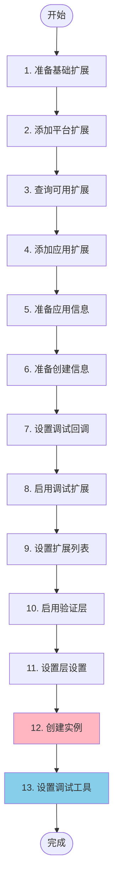

---

## 常见问题与最佳实践

### 常见错误与解决方案

```mermaid
graph TD
    subgraph "常见错误"
        Error1[扩展不存在<br/>VK_ERROR_EXTENSION_NOT_PRESENT]
        Error2[层不存在<br/>VK_ERROR_LAYER_NOT_PRESENT]
        Error3[版本不兼容<br/>VK_ERROR_INCOMPATIBLE_DRIVER]
        Error4[参数错误<br/>VK_ERROR_INVALID_VALUE]
    end
    
    subgraph "解决方案"
        Solution1[查询扩展支持<br/>检查扩展是否可用]
        Solution2[查询层支持<br/>检查层是否安装]
        Solution3[降低 API 版本<br/>使用兼容的版本]
        Solution4[检查参数<br/>验证结构体字段]
    end
    
    Error1 --> Solution1
    Error2 --> Solution2
    Error3 --> Solution3
    Error4 --> Solution4
    
    style Error1 fill:#FFB6C1
    style Solution1 fill:#90EE90
```

### 最佳实践

#### 1. 扩展查询模式

```mermaid
sequenceDiagram
    participant App as 应用程序
    participant Vulkan as Vulkan API
    
    Note over App,Vulkan: 正确的扩展查询方式
    
    App->>Vulkan: 第一次调用<br/>获取扩展数量
    Vulkan-->>App: 返回数量 count
    
    App->>App: 分配缓冲区<br/>vector<VkExtensionProperties>(count)
    
    App->>Vulkan: 第二次调用<br/>获取扩展属性
    Vulkan-->>App: 返回扩展列表
    
    App->>App: 检查需要的扩展<br/>是否在列表中
    
    alt 扩展存在
        App->>App: 添加到启用列表
    else 扩展不存在
        App->>App: 使用替代方案或报错
    end
```

#### 2. 验证层检查

```mermaid
flowchart TD
    Start([启用验证]) --> Query[查询可用层]
    Query --> Check{验证层存在?}
    Check -->|是| Enable[启用验证层]
    Check -->|否| Warn[输出警告]
    Enable --> Create[创建实例]
    Warn --> Create
    Create --> CheckResult{创建成功?}
    CheckResult -->|是| SetupDebug[设置调试工具]
    CheckResult -->|否| Error[处理错误]
    SetupDebug --> End([完成])
    Error --> End
    
    style Enable fill:#90EE90
    style Warn fill:#FFE4B5
```

### 最佳实践清单

| 实践 | 说明 | 重要性 |
|------|------|--------|
| **查询扩展支持** | 在启用扩展前查询是否支持 | ⭐⭐⭐⭐⭐ |
| **检查验证层** | 启用验证层前检查是否存在 | ⭐⭐⭐⭐ |
| **设置应用信息** | 提供准确的应用程序信息 | ⭐⭐⭐ |
| **错误处理** | 检查 `vkCreateInstance` 的返回值 | ⭐⭐⭐⭐⭐ |
| **平台特定扩展** | 根据平台启用正确的表面扩展 | ⭐⭐⭐⭐⭐ |
| **API 版本** | 使用合适的 Vulkan API 版本 | ⭐⭐⭐⭐ |
| **资源清理** | 在程序退出前销毁实例 | ⭐⭐⭐⭐⭐ |

### 性能考虑

```mermaid
graph LR
    subgraph "性能优化"
        Opt1[最小化扩展<br/>只启用必需的扩展]
        Opt2[禁用验证层<br/>发布版本禁用]
        Opt3[合理 API 版本<br/>使用最低兼容版本]
        Opt4[单例模式<br/>一个应用一个实例]
    end
    
    Opt1 --> Performance[更好的性能]
    Opt2 --> Performance
    Opt3 --> Performance
    Opt4 --> Performance
    
    style Performance fill:#90EE90
```

### 调试技巧

```mermaid
flowchart TD
    Start([调试实例问题]) --> EnableValidation[启用验证层]
    EnableValidation --> CheckMessages[检查验证消息]
    CheckMessages --> Analyze[分析错误信息]
    Analyze --> Fix[修复问题]
    Fix --> Test[测试修复]
    Test --> Success{问题解决?}
    Success -->|否| CheckMessages
    Success -->|是| End([完成])
    
    style EnableValidation fill:#87CEEB
    style Fix fill:#90EE90
```

---

## 总结

### VkInstance 核心要点

1. **第一个对象**: VkInstance 是 Vulkan 应用程序中第一个创建的对象
2. **应用程序级别**: 代表整个应用程序的 Vulkan 上下文
3. **设备发现**: 用于枚举和选择物理设备
4. **扩展入口**: 启用实例级别的扩展和验证层
5. **生命周期**: 在应用程序启动时创建，退出时销毁

### 创建 VkInstance 的关键步骤

1. ✅ **查询扩展**: 使用 `vkEnumerateInstanceExtensionProperties` 查询可用扩展
2. ✅ **查询层**: 使用 `vkEnumerateInstanceLayerProperties` 查询可用层
3. ✅ **准备信息**: 填充 `VkApplicationInfo` 和 `VkInstanceCreateInfo`
4. ✅ **启用扩展**: 根据平台和需求启用相应的扩展
5. ✅ **启用验证**: 开发时启用验证层进行调试
6. ✅ **创建实例**: 调用 `vkCreateInstance` 创建实例
7. ✅ **错误处理**: 检查返回值并处理错误
8. ✅ **设置调试**: 如果启用了调试扩展，设置调试工具

### 相关 API 速查

| API | 说明 |
|-----|------|
| `vkCreateInstance()` | 创建 Vulkan 实例 |
| `vkDestroyInstance()` | 销毁 Vulkan 实例 |
| `vkEnumerateInstanceExtensionProperties()` | 枚举实例扩展 |
| `vkEnumerateInstanceLayerProperties()` | 枚举实例层 |
| `vkEnumeratePhysicalDevices()` | 枚举物理设备 |
| `vkGetPhysicalDeviceProperties()` | 获取物理设备属性 |

---

*文档版本: 1.0*  
*最后更新: 2024*  
*基于 Vulkan 1.3 规范*


