# VkPhysicalDevice 详细分析文档

## 目录
1. [VkPhysicalDevice 概述](#vkphysicaldevice-概述)
2. [物理设备的作用与重要性](#物理设备的作用与重要性)
3. [物理设备的查询与枚举](#物理设备的查询与枚举)
4. [物理设备的选择策略](#物理设备的选择策略)
5. [物理设备属性 (Properties)](#物理设备属性-properties)
6. [物理设备功能 (Features)](#物理设备功能-features)
7. [物理设备内存属性 (Memory Properties)](#物理设备内存属性-memory-properties)
8. [队列族与队列](#队列族与队列)
9. [物理设备与逻辑设备的关系](#物理设备与逻辑设备的关系)
10. [实际代码示例](#实际代码示例)
11. [最佳实践](#最佳实践)

---

## VkPhysicalDevice 概述

### 什么是 VkPhysicalDevice？

**VkPhysicalDevice** 代表系统中的物理 GPU 硬件设备。它是 Vulkan 中用于表示实际硬件资源的句柄，用于查询硬件能力、属性和限制。

### VkPhysicalDevice 的核心特点

- **硬件抽象**: 代表实际的 GPU 硬件
- **只读查询**: 用于查询硬件信息，不能直接用于渲染
- **多个设备**: 系统中可能有多个物理设备
- **设备选择**: 应用程序需要选择合适的物理设备
- **逻辑设备基础**: 基于物理设备创建逻辑设备

### VkPhysicalDevice 在 Vulkan 架构中的位置

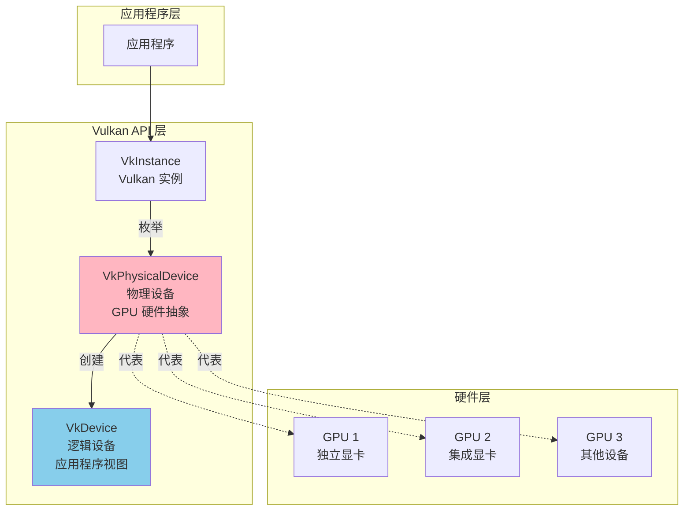
```mermaid
graph TB
    subgraph "应用程序层"
        App[应用程序]
    end
    
    subgraph "Vulkan API 层"
        Instance[VkInstance<br/>Vulkan 实例]
        PhysicalDevice[VkPhysicalDevice<br/>物理设备<br/>GPU 硬件抽象]
        LogicalDevice[VkDevice<br/>逻辑设备<br/>应用程序视图]
    end
    
    subgraph "硬件层"
        GPU1[GPU 1<br/>独立显卡]
        GPU2[GPU 2<br/>集成显卡]
        GPU3[GPU 3<br/>其他设备]
    end
    
    App --> Instance
    Instance -->|枚举| PhysicalDevice
    PhysicalDevice -->|创建| LogicalDevice
    PhysicalDevice -.->|代表| GPU1
    PhysicalDevice -.->|代表| GPU2
    PhysicalDevice -.->|代表| GPU3
    
    style PhysicalDevice fill:#FFB6C1
    style LogicalDevice fill:#87CEEB
```

---

## 物理设备的作用与重要性

### 物理设备的主要作用

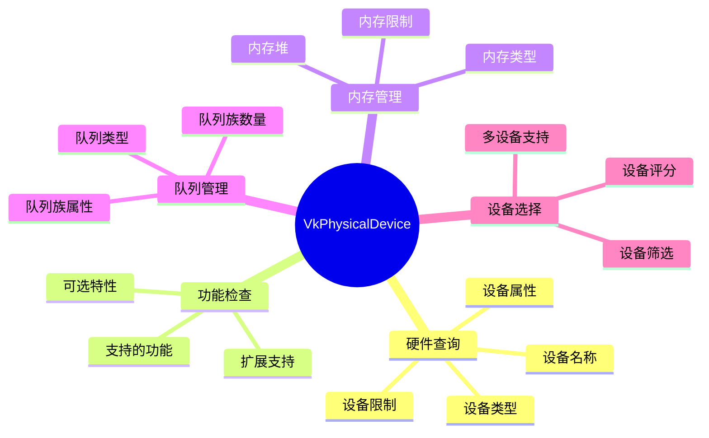
```mermaid
mindmap
  root((VkPhysicalDevice))
    硬件查询
      设备属性
      设备限制
      设备类型
      设备名称
    功能检查
      支持的功能
      可选特性
      扩展支持
    内存管理
      内存类型
      内存堆
      内存限制
    队列管理
      队列族数量
      队列族属性
      队列类型
    设备选择
      多设备支持
      设备评分
      设备筛选
```

### 物理设备 vs 逻辑设备

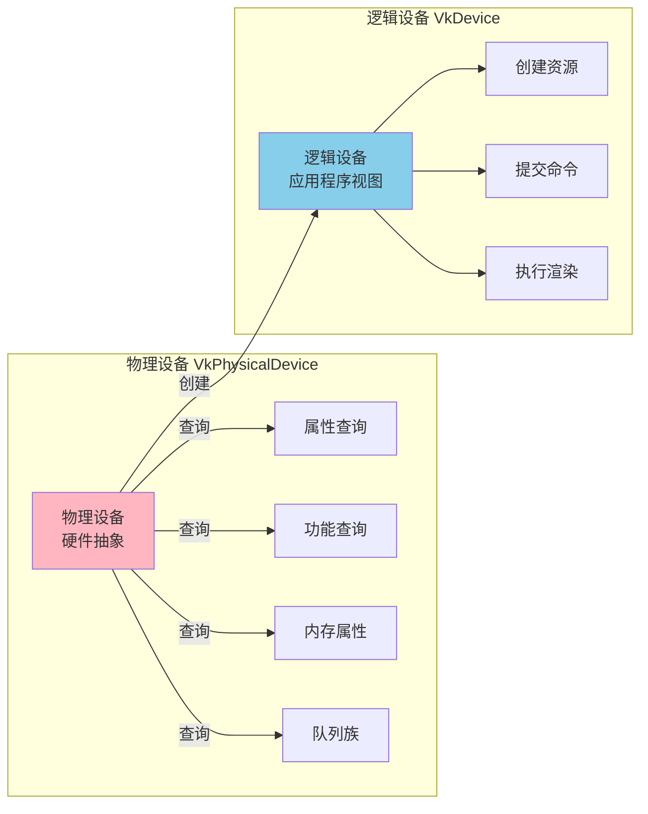
```mermaid
graph LR
    subgraph "物理设备 VkPhysicalDevice"
        PD[物理设备<br/>硬件抽象]
        PD_Props[属性查询]
        PD_Features[功能查询]
        PD_Memory[内存属性]
        PD_Queues[队列族]
    end
    
    subgraph "逻辑设备 VkDevice"
        LD[逻辑设备<br/>应用程序视图]
        LD_Create[创建资源]
        LD_Submit[提交命令]
        LD_Render[执行渲染]
    end
    
    PD -->|查询| PD_Props
    PD -->|查询| PD_Features
    PD -->|查询| PD_Memory
    PD -->|查询| PD_Queues
    
    PD -->|创建| LD
    LD --> LD_Create
    LD --> LD_Submit
    LD --> LD_Render
    
    style PD fill:#FFB6C1
    style LD fill:#87CEEB
```

### 对比表

| 特性 | VkPhysicalDevice | VkDevice |
|------|-----------------|----------|
| **类型** | 硬件抽象 | 逻辑设备 |
| **创建方式** | 枚举获得 | 通过 `vkCreateDevice` 创建 |
| **用途** | 查询硬件信息 | 执行渲染操作 |
| **生命周期** | 由系统管理 | 由应用程序管理 |
| **可修改性** | 只读 | 可创建资源 |
| **数量** | 系统中所有 GPU | 每个应用可创建多个 |

---

## 物理设备的查询与枚举

### 枚举物理设备的流程

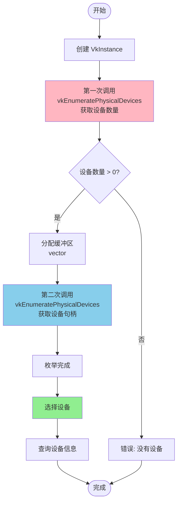
```mermaid
flowchart TD
    Start([开始]) --> CreateInstance[创建 VkInstance]
    CreateInstance --> FirstCall[第一次调用<br/>vkEnumeratePhysicalDevices<br/>获取设备数量]
    FirstCall --> CheckCount{设备数量 > 0?}
    CheckCount -->|否| Error[错误: 没有设备]
    CheckCount -->|是| Allocate[分配缓冲区<br/>vector<VkPhysicalDevice>]
    Allocate --> SecondCall[第二次调用<br/>vkEnumeratePhysicalDevices<br/>获取设备句柄]
    SecondCall --> Enumerate[枚举完成]
    Enumerate --> Select[选择设备]
    Select --> Query[查询设备信息]
    Query --> End([完成])
    Error --> End
    
    style FirstCall fill:#FFB6C1
    style SecondCall fill:#87CEEB
    style Select fill:#90EE90
```

### 枚举序列图

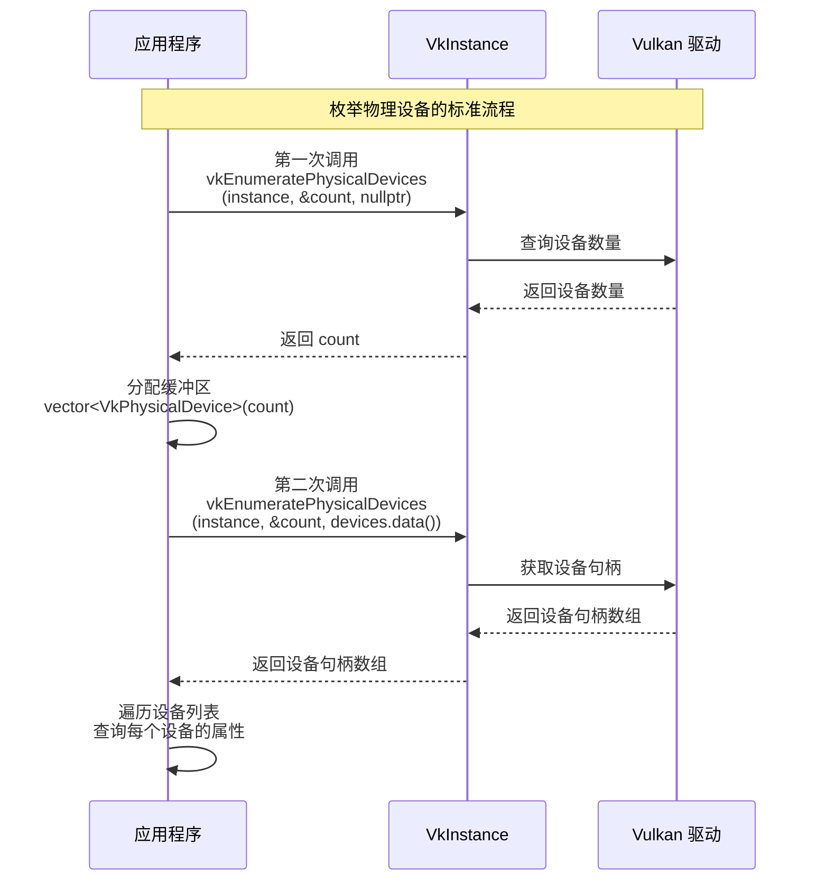
```mermaid
sequenceDiagram
    participant App as 应用程序
    participant Instance as VkInstance
    participant Driver as Vulkan 驱动
    
    Note over App,Driver: 枚举物理设备的标准流程
    
    App->>Instance: 第一次调用<br/>vkEnumeratePhysicalDevices<br/>(instance, &count, nullptr)
    Instance->>Driver: 查询设备数量
    Driver-->>Instance: 返回设备数量
    Instance-->>App: 返回 count
    
    App->>App: 分配缓冲区<br/>vector<VkPhysicalDevice>(count)
    
    App->>Instance: 第二次调用<br/>vkEnumeratePhysicalDevices<br/>(instance, &count, devices.data())
    Instance->>Driver: 获取设备句柄
    Driver-->>Instance: 返回设备句柄数组
    Instance-->>App: 返回设备句柄数组
    
    App->>App: 遍历设备列表<br/>查询每个设备的属性
```

### 枚举代码示例

```cpp
/**
 * @brief 枚举系统中的物理设备
 * @param instance Vulkan 实例
 * @return 物理设备列表
 */
std::vector<VkPhysicalDevice> enumeratePhysicalDevices(VkInstance instance)
{
    // 第一次调用：获取设备数量
    uint32_t deviceCount = 0;
    VkResult result = vkEnumeratePhysicalDevices(instance, &deviceCount, nullptr);
    
    if (result != VK_SUCCESS || deviceCount == 0) {
        std::cerr << "Failed to enumerate physical devices or no devices found\n";
        return {};
    }
    
    // 分配缓冲区
    std::vector<VkPhysicalDevice> physicalDevices(deviceCount);
    
    // 第二次调用：获取设备句柄
    result = vkEnumeratePhysicalDevices(instance, &deviceCount, physicalDevices.data());
    
    if (result != VK_SUCCESS) {
        std::cerr << "Failed to enumerate physical devices\n";
        return {};
    }
    
    return physicalDevices;
}
```

---

## 物理设备的选择策略

### 设备选择流程

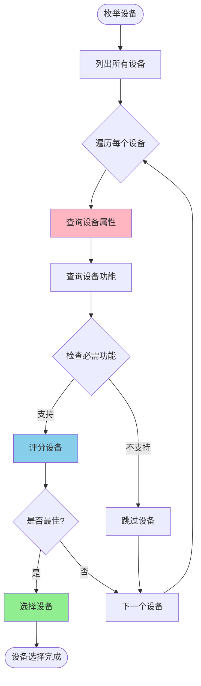
```mermaid
flowchart TD
    Start([枚举设备]) --> ListDevices[列出所有设备]
    ListDevices --> ForEach{遍历每个设备}
    ForEach --> QueryProps[查询设备属性]
    QueryProps --> QueryFeatures[查询设备功能]
    QueryFeatures --> CheckRequired{检查必需功能}
    CheckRequired -->|不支持| Skip[跳过设备]
    CheckRequired -->|支持| Score[评分设备]
    Score --> CheckBest{是否最佳?}
    CheckBest -->|是| Select[选择设备]
    CheckBest -->|否| Next[下一个设备]
    Skip --> Next
    Next --> ForEach
    Select --> End([设备选择完成])
    
    style QueryProps fill:#FFB6C1
    style Score fill:#87CEEB
    style Select fill:#90EE90
```

### 设备选择策略

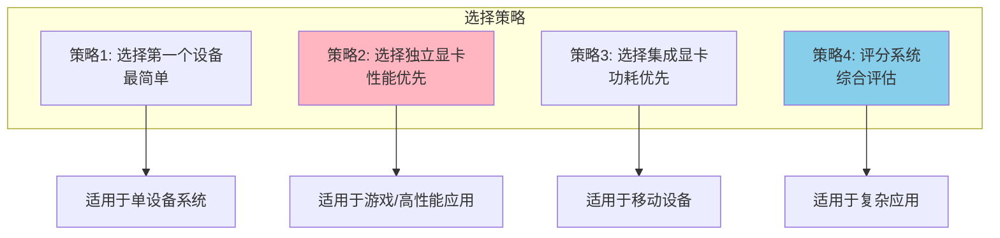
```mermaid
graph TD
    subgraph "选择策略"
        Strategy1[策略1: 选择第一个设备<br/>最简单]
        Strategy2[策略2: 选择独立显卡<br/>性能优先]
        Strategy3[策略3: 选择集成显卡<br/>功耗优先]
        Strategy4[策略4: 评分系统<br/>综合评估]
    end
    
    Strategy1 --> Use1[适用于单设备系统]
    Strategy2 --> Use2[适用于游戏/高性能应用]
    Strategy3 --> Use3[适用于移动设备]
    Strategy4 --> Use4[适用于复杂应用]
    
    style Strategy2 fill:#FFB6C1
    style Strategy4 fill:#87CEEB
```

### 设备评分示例

```cpp
/**
 * @brief 设备评分结构
 */
struct DeviceScore {
    int score = 0;
    VkPhysicalDevice device = VK_NULL_HANDLE;
    VkPhysicalDeviceProperties properties{};
    VkPhysicalDeviceFeatures features{};
};

/**
 * @brief 对物理设备进行评分
 * @param device 物理设备
 * @return 设备评分
 */
int rateDevice(VkPhysicalDevice device)
{
    int score = 0;
    
    VkPhysicalDeviceProperties properties;
    VkPhysicalDeviceFeatures features;
    vkGetPhysicalDeviceProperties(device, &properties);
    vkGetPhysicalDeviceFeatures(device, &features);
    
    // 设备类型评分
    switch (properties.deviceType) {
        case VK_PHYSICAL_DEVICE_TYPE_DISCRETE_GPU:
            score += 1000;  // 独立显卡最高分
            break;
        case VK_PHYSICAL_DEVICE_TYPE_INTEGRATED_GPU:
            score += 500;   // 集成显卡中等分
            break;
        case VK_PHYSICAL_DEVICE_TYPE_VIRTUAL_GPU:
            score += 100;   // 虚拟 GPU 低分
            break;
        case VK_PHYSICAL_DEVICE_TYPE_CPU:
            score += 10;    // CPU 最低分
            break;
        default:
            break;
    }
    
    // 几何着色器支持
    if (features.geometryShader) {
        score += 10;
    }
    
    // 曲面细分着色器支持
    if (features.tessellationShader) {
        score += 10;
    }
    
    // 最大图像尺寸
    score += properties.limits.maxImageDimension2D / 1000;
    
    return score;
}

/**
 * @brief 选择最佳物理设备
 * @param instance Vulkan 实例
 * @return 最佳物理设备
 */
VkPhysicalDevice selectBestPhysicalDevice(VkInstance instance)
{
    auto devices = enumeratePhysicalDevices(instance);
    
    if (devices.empty()) {
        return VK_NULL_HANDLE;
    }
    
    VkPhysicalDevice bestDevice = VK_NULL_HANDLE;
    int bestScore = 0;
    
    for (auto device : devices) {
        int score = rateDevice(device);
        if (score > bestScore) {
            bestScore = score;
            bestDevice = device;
        }
    }
    
    return bestDevice;
}
```

---

## 物理设备属性 (Properties)

### VkPhysicalDeviceProperties 结构

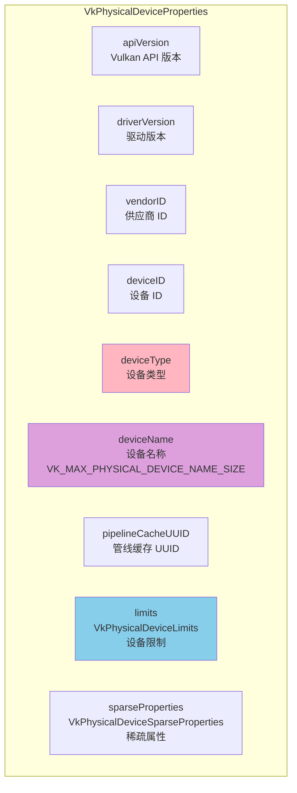
```mermaid
graph TD
    subgraph "VkPhysicalDeviceProperties"
        APIVersion[apiVersion<br/>Vulkan API 版本]
        DriverVersion[driverVersion<br/>驱动版本]
        VendorID[vendorID<br/>供应商 ID]
        DeviceID[deviceID<br/>设备 ID]
        DeviceType[deviceType<br/>设备类型]
        DeviceName[deviceName<br/>设备名称<br/>VK_MAX_PHYSICAL_DEVICE_NAME_SIZE]
        PipelineCacheUUID[pipelineCacheUUID<br/>管线缓存 UUID]
        Limits[limits<br/>VkPhysicalDeviceLimits<br/>设备限制]
        SparseProperties[sparseProperties<br/>VkPhysicalDeviceSparseProperties<br/>稀疏属性]
    end
    
    style DeviceType fill:#FFB6C1
    style Limits fill:#87CEEB
    style DeviceName fill:#DDA0DD
```

### 设备类型

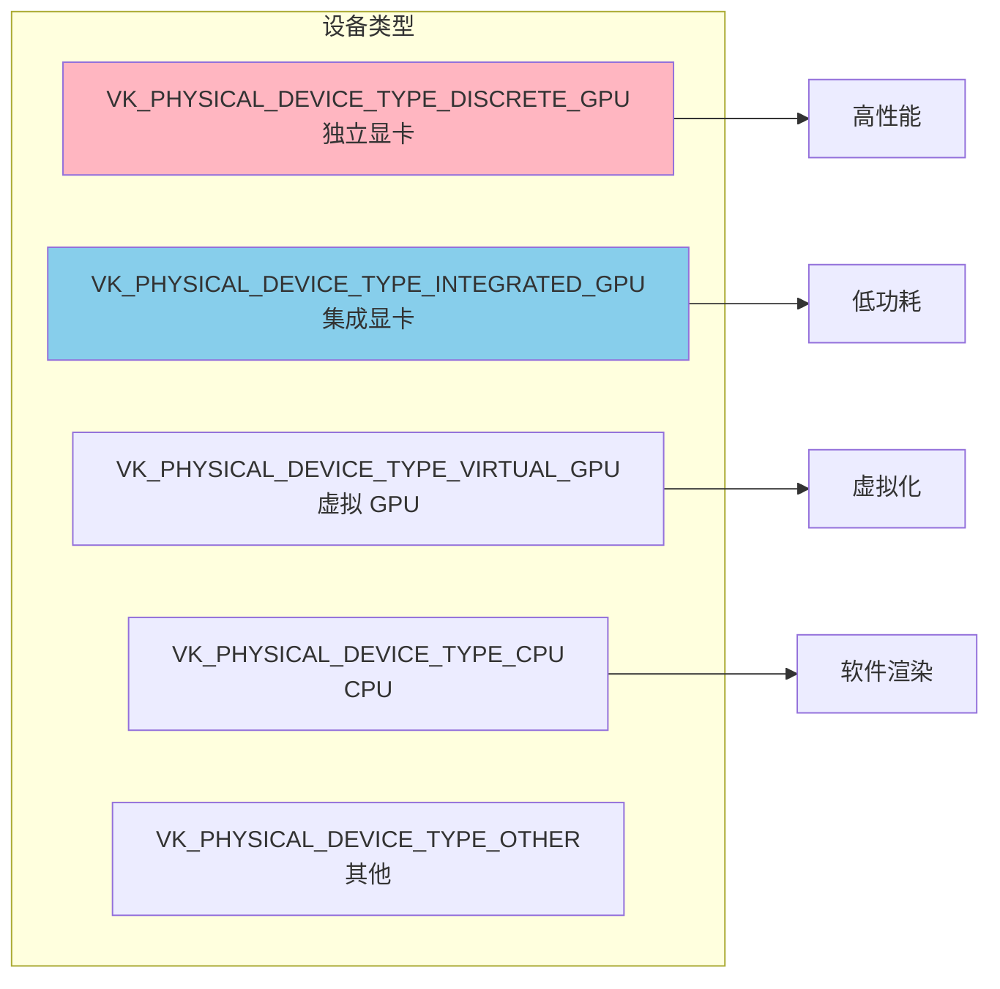
```mermaid
graph LR
    subgraph "设备类型"
        Discrete[VK_PHYSICAL_DEVICE_TYPE_DISCRETE_GPU<br/>独立显卡]
        Integrated[VK_PHYSICAL_DEVICE_TYPE_INTEGRATED_GPU<br/>集成显卡]
        Virtual[VK_PHYSICAL_DEVICE_TYPE_VIRTUAL_GPU<br/>虚拟 GPU]
        CPU[VK_PHYSICAL_DEVICE_TYPE_CPU<br/>CPU]
        Other[VK_PHYSICAL_DEVICE_TYPE_OTHER<br/>其他]
    end
    
    Discrete --> Use1[高性能]
    Integrated --> Use2[低功耗]
    Virtual --> Use3[虚拟化]
    CPU --> Use4[软件渲染]
    
    style Discrete fill:#FFB6C1
    style Integrated fill:#87CEEB
```

### 设备限制 (Limits)

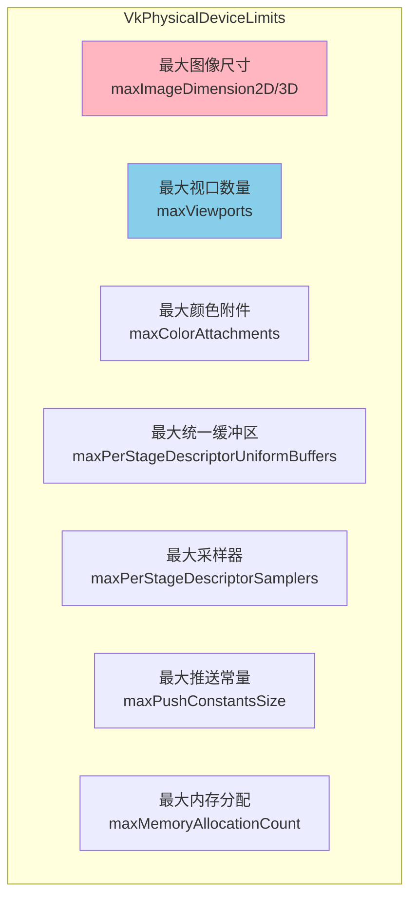
```mermaid
graph TD
    subgraph "VkPhysicalDeviceLimits"
        MaxImage[最大图像尺寸<br/>maxImageDimension2D/3D]
        MaxViewports[最大视口数量<br/>maxViewports]
        MaxColorAttachments[最大颜色附件<br/>maxColorAttachments]
        MaxUniformBuffers[最大统一缓冲区<br/>maxPerStageDescriptorUniformBuffers]
        MaxSamplers[最大采样器<br/>maxPerStageDescriptorSamplers]
        MaxPushConstants[最大推送常量<br/>maxPushConstantsSize]
        MaxMemoryAllocation[最大内存分配<br/>maxMemoryAllocationCount]
    end
    
    style MaxImage fill:#FFB6C1
    style MaxViewports fill:#87CEEB
```

### 查询设备属性代码示例

```cpp
/**
 * @brief 查询并打印物理设备属性
 * @param device 物理设备
 */
void printPhysicalDeviceProperties(VkPhysicalDevice device)
{
    VkPhysicalDeviceProperties properties;
    vkGetPhysicalDeviceProperties(device, &properties);
    
    std::cout << "=== Physical Device Properties ===" << std::endl;
    std::cout << "Device Name: " << properties.deviceName << std::endl;
    std::cout << "Device Type: " << physicalDeviceTypeString(properties.deviceType) << std::endl;
    std::cout << "API Version: " 
              << VK_VERSION_MAJOR(properties.apiVersion) << "."
              << VK_VERSION_MINOR(properties.apiVersion) << "."
              << VK_VERSION_PATCH(properties.apiVersion) << std::endl;
    std::cout << "Driver Version: " << properties.driverVersion << std::endl;
    std::cout << "Vendor ID: 0x" << std::hex << properties.vendorID << std::dec << std::endl;
    std::cout << "Device ID: 0x" << std::hex << properties.deviceID << std::dec << std::endl;
    
    std::cout << "\n=== Device Limits ===" << std::endl;
    std::cout << "Max Image Dimension 2D: " << properties.limits.maxImageDimension2D << std::endl;
    std::cout << "Max Image Dimension 3D: " << properties.limits.maxImageDimension3D << std::endl;
    std::cout << "Max Viewports: " << properties.limits.maxViewports << std::endl;
    std::cout << "Max Color Attachments: " << properties.limits.maxColorAttachments << std::endl;
    std::cout << "Max Push Constants Size: " << properties.limits.maxPushConstantsSize << " bytes" << std::endl;
}
```

---

## 物理设备功能 (Features)

### VkPhysicalDeviceFeatures 结构


```mermaid
graph TD
    subgraph "VkPhysicalDeviceFeatures"
        RobustBufferAccess[robustBufferAccess<br/>健壮缓冲区访问]
        FullDrawIndexUint32[fullDrawIndexUint32<br/>完整 32 位索引]
        ImageCubeArray[imageCubeArray<br/>立方体贴图数组]
        IndependentBlend[independentBlend<br/>独立混合]
        GeometryShader[geometryShader<br/>几何着色器]
        TessellationShader[tessellationShader<br/>曲面细分着色器]
        SampleRateShading[sampleRateShading<br/>采样率着色]
        DualSrcBlend[dualSrcBlend<br/>双源混合]
        LogicOp[logicOp<br/>逻辑操作]
        MultiDrawIndirect[multiDrawIndirect<br/>多重间接绘制]
        DrawIndirectFirstInstance[drawIndirectFirstInstance<br/>间接绘制首个实例]
        DepthClamp[depthClamp<br/>深度夹紧]
        DepthBiasClamp[depthBiasClamp<br/>深度偏移夹紧]
        FillModeNonSolid[fillModeNonSolid<br/>非实体填充模式]
        DepthBounds[depthBounds<br/>深度边界]
        WideLines[wideLines<br/>宽线]
        LargePoints[largePoints<br/>大点]
        AlphaToOne[alphaToOne<br/>Alpha 到一]
        MultiViewport[multiViewport<br/>多视口]
        SamplerAnisotropy[samplerAnisotropy<br/>采样器各向异性]
        TextureCompressionETC2[textureCompressionETC2<br/>ETC2 纹理压缩]
        TextureCompressionASTC_LDR[textureCompressionASTC_LDR<br/>ASTC 纹理压缩]
        TextureCompressionBC[textureCompressionBC<br/>BC 纹理压缩]
        OcclusionQueryPrecise[occlusionQueryPrecise<br/>精确遮挡查询]
        PipelineStatisticsQuery[pipelineStatisticsQuery<br/>管线统计查询]
        VertexPipelineStoresAndAtomics[vertexPipelineStoresAndAtomics<br/>顶点管线存储和原子操作]
        FragmentStoresAndAtomics[fragmentStoresAndAtomics<br/>片段存储和原子操作]
        ShaderTessellationAndGeometryPointSize[shaderTessellationAndGeometryPointSize<br/>着色器曲面细分和几何点大小]
        ShaderImageGatherExtended[shaderImageGatherExtended<br/>着色器图像聚集扩展]
        ShaderStorageImageExtendedFormats[shaderStorageImageExtendedFormats<br/>着色器存储图像扩展格式]
        ShaderStorageImageMultisample[shaderStorageImageMultisample<br/>着色器存储图像多重采样]
        ShaderStorageImageReadWithoutFormat[shaderStorageImageReadWithoutFormat<br/>无格式读取]
        ShaderStorageImageWriteWithoutFormat[shaderStorageImageWriteWithoutFormat<br/>无格式写入]
        ShaderUniformBufferArrayDynamicIndexing[shaderUniformBufferArrayDynamicIndexing<br/>统一缓冲区数组动态索引]
        ShaderSampledImageArrayDynamicIndexing[shaderSampledImageArrayDynamicIndexing<br/>采样图像数组动态索引]
        ShaderStorageBufferArrayDynamicIndexing[shaderStorageBufferArrayDynamicIndexing<br/>存储缓冲区数组动态索引]
        ShaderStorageImageArrayDynamicIndexing[shaderStorageImageArrayDynamicIndexing<br/>存储图像数组动态索引]
        ShaderClipDistance[shaderClipDistance<br/>着色器裁剪距离]
        ShaderCullDistance[shaderCullDistance<br/>着色器剔除距离]
        ShaderFloat64[shaderFloat64<br/>64 位浮点]
        ShaderInt64[shaderInt64<br/>64 位整数]
        ShaderInt16[shaderInt16<br/>16 位整数]
        ShaderResourceResidency[shaderResourceResidency<br/>着色器资源常驻]
        ShaderResourceMinLod[shaderResourceMinLod<br/>着色器资源最小 LOD]
        SparseBinding[sparseBinding<br/>稀疏绑定]
        SparseResidencyBuffer[sparseResidencyBuffer<br/>稀疏常驻缓冲区]
        SparseResidencyImage2D[sparseResidencyImage2D<br/>稀疏常驻 2D 图像]
        SparseResidencyImage3D[sparseResidencyImage3D<br/>稀疏常驻 3D 图像]
        SparseResidency2Samples[sparseResidency2Samples<br/>稀疏常驻 2 采样]
        SparseResidency4Samples[sparseResidency4Samples<br/>稀疏常驻 4 采样]
        SparseResidency8Samples[sparseResidency8Samples<br/>稀疏常驻 8 采样]
        SparseResidency16Samples[sparseResidency16Samples<br/>稀疏常驻 16 采样]
        SparseResidencyAliased[sparseResidencyAliased<br/>稀疏常驻别名]
        VariableMultisampleRate[variableMultisampleRate<br/>可变多重采样率]
        InheritedQueries[inheritedQueries<br/>继承查询]
    end
    
    style GeometryShader fill:#FFB6C1
    style TessellationShader fill:#87CEEB
    style SamplerAnisotropy fill:#DDA0DD
```

### 查询设备功能代码示例

```cpp
/**
 * @brief 查询并检查物理设备功能
 * @param device 物理设备
 * @return 设备功能结构
 */
VkPhysicalDeviceFeatures queryPhysicalDeviceFeatures(VkPhysicalDevice device)
{
    VkPhysicalDeviceFeatures features;
    vkGetPhysicalDeviceFeatures(device, &features);
    
    std::cout << "=== Physical Device Features ===" << std::endl;
    std::cout << "Geometry Shader: " << (features.geometryShader ? "Yes" : "No") << std::endl;
    std::cout << "Tessellation Shader: " << (features.tessellationShader ? "Yes" : "No") << std::endl;
    std::cout << "Sampler Anisotropy: " << (features.samplerAnisotropy ? "Yes" : "No") << std::endl;
    std::cout << "Multi Viewport: " << (features.multiViewport ? "Yes" : "No") << std::endl;
    std::cout << "Shader Float64: " << (features.shaderFloat64 ? "Yes" : "No") << std::endl;
    std::cout << "Shader Int64: " << (features.shaderInt64 ? "Yes" : "No") << std::endl;
    
    return features;
}

/**
 * @brief 检查设备是否支持必需功能
 * @param device 物理设备
 * @param requiredFeatures 必需功能列表
 * @return 是否支持所有必需功能
 */
bool checkRequiredFeatures(VkPhysicalDevice device, 
                           const VkPhysicalDeviceFeatures& requiredFeatures)
{
    VkPhysicalDeviceFeatures supportedFeatures;
    vkGetPhysicalDeviceFeatures(device, &supportedFeatures);
    
    // 检查几何着色器
    if (requiredFeatures.geometryShader && !supportedFeatures.geometryShader) {
        return false;
    }
    
    // 检查曲面细分着色器
    if (requiredFeatures.tessellationShader && !supportedFeatures.tessellationShader) {
        return false;
    }
    
    // 检查采样器各向异性
    if (requiredFeatures.samplerAnisotropy && !supportedFeatures.samplerAnisotropy) {
        return false;
    }
    
    return true;
}
```

---

## 物理设备内存属性 (Memory Properties)

### VkPhysicalDeviceMemoryProperties 结构

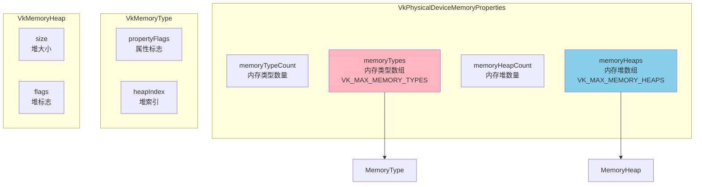
```mermaid
graph TD
    subgraph "VkPhysicalDeviceMemoryProperties"
        MemoryTypeCount[memoryTypeCount<br/>内存类型数量]
        MemoryTypes[memoryTypes<br/>内存类型数组<br/>VK_MAX_MEMORY_TYPES]
        MemoryHeapCount[memoryHeapCount<br/>内存堆数量]
        MemoryHeaps[memoryHeaps<br/>内存堆数组<br/>VK_MAX_MEMORY_HEAPS]
    end
    
    subgraph "VkMemoryType"
        PropertyFlags[propertyFlags<br/>属性标志]
        HeapIndex[heapIndex<br/>堆索引]
    end
    
    subgraph "VkMemoryHeap"
        Size[size<br/>堆大小]
        Flags[flags<br/>堆标志]
    end
    
    MemoryTypes --> MemoryType
    MemoryHeaps --> MemoryHeap
    
    style MemoryTypes fill:#FFB6C1
    style MemoryHeaps fill:#87CEEB
```

### 内存类型属性标志

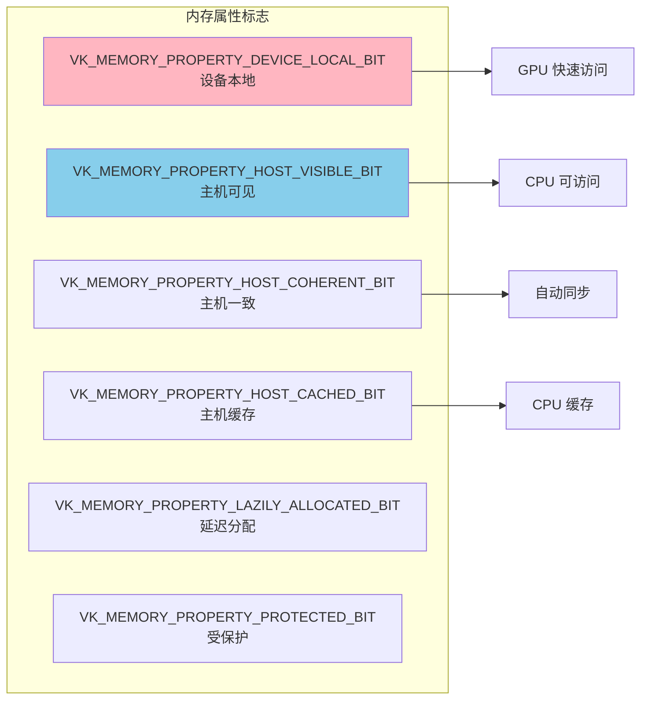
```mermaid
graph LR
    subgraph "内存属性标志"
        DeviceLocal[VK_MEMORY_PROPERTY_DEVICE_LOCAL_BIT<br/>设备本地]
        HostVisible[VK_MEMORY_PROPERTY_HOST_VISIBLE_BIT<br/>主机可见]
        HostCoherent[VK_MEMORY_PROPERTY_HOST_COHERENT_BIT<br/>主机一致]
        HostCached[VK_MEMORY_PROPERTY_HOST_CACHED_BIT<br/>主机缓存]
        LazilyAllocated[VK_MEMORY_PROPERTY_LAZILY_ALLOCATED_BIT<br/>延迟分配]
        Protected[VK_MEMORY_PROPERTY_PROTECTED_BIT<br/>受保护]
    end
    
    DeviceLocal --> Use1[GPU 快速访问]
    HostVisible --> Use2[CPU 可访问]
    HostCoherent --> Use3[自动同步]
    HostCached --> Use4[CPU 缓存]
    
    style DeviceLocal fill:#FFB6C1
    style HostVisible fill:#87CEEB
```

### 查询内存属性代码示例

```cpp
/**
 * @brief 查找合适的内存类型索引
 * @param device 物理设备
 * @param typeBits 内存类型位掩码
 * @param properties 请求的内存属性
 * @return 内存类型索引，失败返回 -1
 */
int findMemoryType(VkPhysicalDevice device, 
                   uint32_t typeBits, 
                   VkMemoryPropertyFlags properties)
{
    VkPhysicalDeviceMemoryProperties memProperties;
    vkGetPhysicalDeviceMemoryProperties(device, &memProperties);
    
    for (uint32_t i = 0; i < memProperties.memoryTypeCount; i++) {
        // 检查类型位是否设置
        if ((typeBits & (1 << i)) == 0) {
            continue;
        }
        
        // 检查属性是否匹配
        if ((memProperties.memoryTypes[i].propertyFlags & properties) == properties) {
            return static_cast<int>(i);
        }
    }
    
    return -1;  // 未找到合适的内存类型
}

/**
 * @brief 打印物理设备内存属性
 * @param device 物理设备
 */
void printMemoryProperties(VkPhysicalDevice device)
{
    VkPhysicalDeviceMemoryProperties memProperties;
    vkGetPhysicalDeviceMemoryProperties(device, &memProperties);
    
    std::cout << "=== Memory Heaps ===" << std::endl;
    for (uint32_t i = 0; i < memProperties.memoryHeapCount; i++) {
        std::cout << "Heap " << i << ": " 
                  << memProperties.memoryHeaps[i].size / (1024 * 1024) 
                  << " MB" << std::endl;
        if (memProperties.memoryHeaps[i].flags & VK_MEMORY_HEAP_DEVICE_LOCAL_BIT) {
            std::cout << "  Device Local" << std::endl;
        }
    }
    
    std::cout << "\n=== Memory Types ===" << std::endl;
    for (uint32_t i = 0; i < memProperties.memoryTypeCount; i++) {
        std::cout << "Type " << i << " (Heap " 
                  << memProperties.memoryTypes[i].heapIndex << "): ";
        
        VkMemoryPropertyFlags flags = memProperties.memoryTypes[i].propertyFlags;
        if (flags & VK_MEMORY_PROPERTY_DEVICE_LOCAL_BIT) {
            std::cout << "DEVICE_LOCAL ";
        }
        if (flags & VK_MEMORY_PROPERTY_HOST_VISIBLE_BIT) {
            std::cout << "HOST_VISIBLE ";
        }
        if (flags & VK_MEMORY_PROPERTY_HOST_COHERENT_BIT) {
            std::cout << "HOST_COHERENT ";
        }
        if (flags & VK_MEMORY_PROPERTY_HOST_CACHED_BIT) {
            std::cout << "HOST_CACHED ";
        }
        std::cout << std::endl;
    }
}
```

---

## 队列族与队列

### 队列族查询

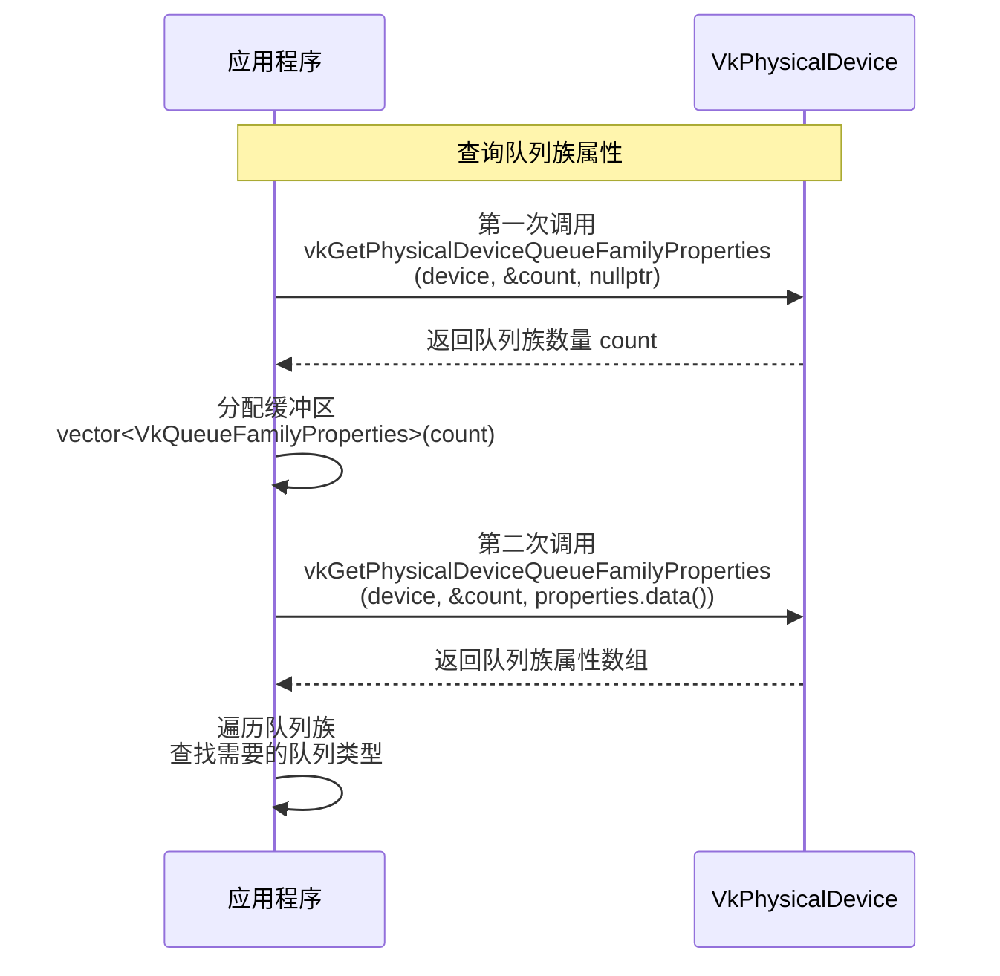
```mermaid
sequenceDiagram
    participant App as 应用程序
    participant PhysicalDevice as VkPhysicalDevice
    
    Note over App,PhysicalDevice: 查询队列族属性
    
    App->>PhysicalDevice: 第一次调用<br/>vkGetPhysicalDeviceQueueFamilyProperties<br/>(device, &count, nullptr)
    PhysicalDevice-->>App: 返回队列族数量 count
    
    App->>App: 分配缓冲区<br/>vector<VkQueueFamilyProperties>(count)
    
    App->>PhysicalDevice: 第二次调用<br/>vkGetPhysicalDeviceQueueFamilyProperties<br/>(device, &count, properties.data())
    PhysicalDevice-->>App: 返回队列族属性数组
    
    App->>App: 遍历队列族<br/>查找需要的队列类型
```

### 队列类型

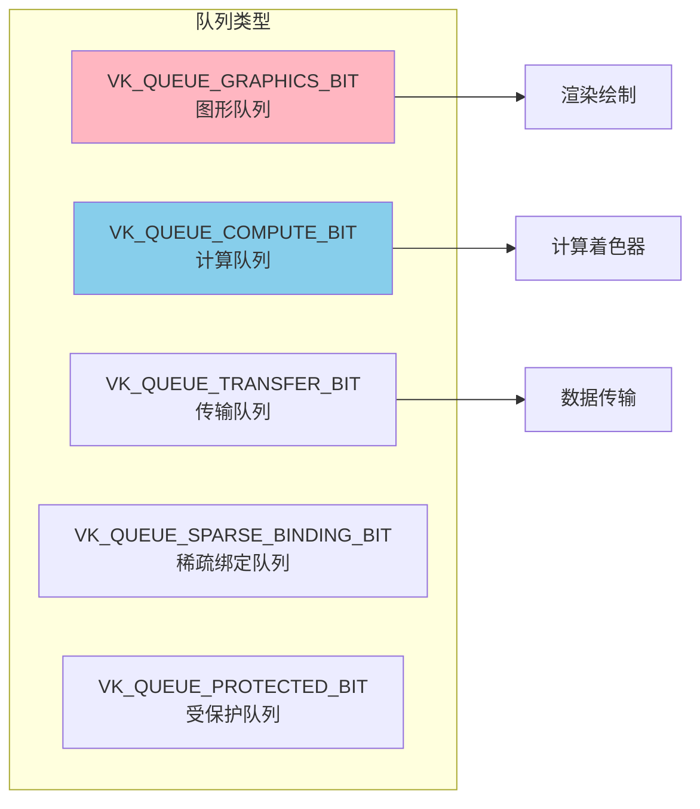
```mermaid
graph LR
    subgraph "队列类型"
        Graphics[VK_QUEUE_GRAPHICS_BIT<br/>图形队列]
        Compute[VK_QUEUE_COMPUTE_BIT<br/>计算队列]
        Transfer[VK_QUEUE_TRANSFER_BIT<br/>传输队列]
        SparseBinding[VK_QUEUE_SPARSE_BINDING_BIT<br/>稀疏绑定队列]
        Protected[VK_QUEUE_PROTECTED_BIT<br/>受保护队列]
    end
    
    Graphics --> Use1[渲染绘制]
    Compute --> Use2[计算着色器]
    Transfer --> Use3[数据传输]
    
    style Graphics fill:#FFB6C1
    style Compute fill:#87CEEB
```

### 查找队列族代码示例

```cpp
/**
 * @brief 查找队列族索引
 * @param device 物理设备
 * @param queueFlags 队列标志
 * @return 队列族索引，失败返回 -1
 */
int findQueueFamily(VkPhysicalDevice device, VkQueueFlags queueFlags)
{
    uint32_t queueFamilyCount = 0;
    vkGetPhysicalDeviceQueueFamilyProperties(device, &queueFamilyCount, nullptr);
    
    std::vector<VkQueueFamilyProperties> queueFamilies(queueFamilyCount);
    vkGetPhysicalDeviceQueueFamilyProperties(device, &queueFamilyCount, 
                                            queueFamilies.data());
    
    for (uint32_t i = 0; i < queueFamilyCount; i++) {
        if (queueFamilies[i].queueFlags & queueFlags) {
            return static_cast<int>(i);
        }
    }
    
    return -1;  // 未找到
}

/**
 * @brief 查找图形和呈现队列族
 * @param device 物理设备
 * @param surface 表面（用于检查呈现支持）
 * @param graphicsFamily 输出的图形队列族索引
 * @param presentFamily 输出的呈现队列族索引
 * @return 是否找到
 */
bool findQueueFamilies(VkPhysicalDevice device, 
                       VkSurfaceKHR surface,
                       uint32_t& graphicsFamily,
                       uint32_t& presentFamily)
{
    uint32_t queueFamilyCount = 0;
    vkGetPhysicalDeviceQueueFamilyProperties(device, &queueFamilyCount, nullptr);
    
    std::vector<VkQueueFamilyProperties> queueFamilies(queueFamilyCount);
    vkGetPhysicalDeviceQueueFamilyProperties(device, &queueFamilyCount, 
                                            queueFamilies.data());
    
    graphicsFamily = UINT32_MAX;
    presentFamily = UINT32_MAX;
    
    for (uint32_t i = 0; i < queueFamilyCount; i++) {
        // 查找图形队列
        if (queueFamilies[i].queueFlags & VK_QUEUE_GRAPHICS_BIT) {
            graphicsFamily = i;
        }
        
        // 查找呈现队列
        VkBool32 presentSupport = false;
        vkGetPhysicalDeviceSurfaceSupportKHR(device, i, surface, &presentSupport);
        if (presentSupport) {
            presentFamily = i;
        }
        
        // 如果都找到了，可以提前退出
        if (graphicsFamily != UINT32_MAX && presentFamily != UINT32_MAX) {
            break;
        }
    }
    
    return graphicsFamily != UINT32_MAX && presentFamily != UINT32_MAX;
}
```

---

## 物理设备与逻辑设备的关系

### 关系图

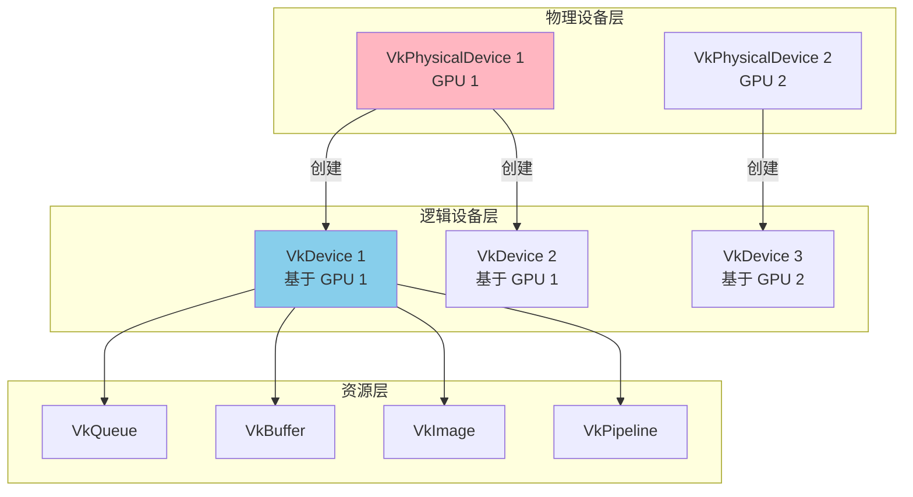
```mermaid
graph TB
    subgraph "物理设备层"
        PD1[VkPhysicalDevice 1<br/>GPU 1]
        PD2[VkPhysicalDevice 2<br/>GPU 2]
    end
    
    subgraph "逻辑设备层"
        LD1[VkDevice 1<br/>基于 GPU 1]
        LD2[VkDevice 2<br/>基于 GPU 1]
        LD3[VkDevice 3<br/>基于 GPU 2]
    end
    
    subgraph "资源层"
        Queue1[VkQueue]
        Buffer1[VkBuffer]
        Image1[VkImage]
        Pipeline1[VkPipeline]
    end
    
    PD1 -->|创建| LD1
    PD1 -->|创建| LD2
    PD2 -->|创建| LD3
    
    LD1 --> Queue1
    LD1 --> Buffer1
    LD1 --> Image1
    LD1 --> Pipeline1
    
    style PD1 fill:#FFB6C1
    style LD1 fill:#87CEEB
```

### 创建流程

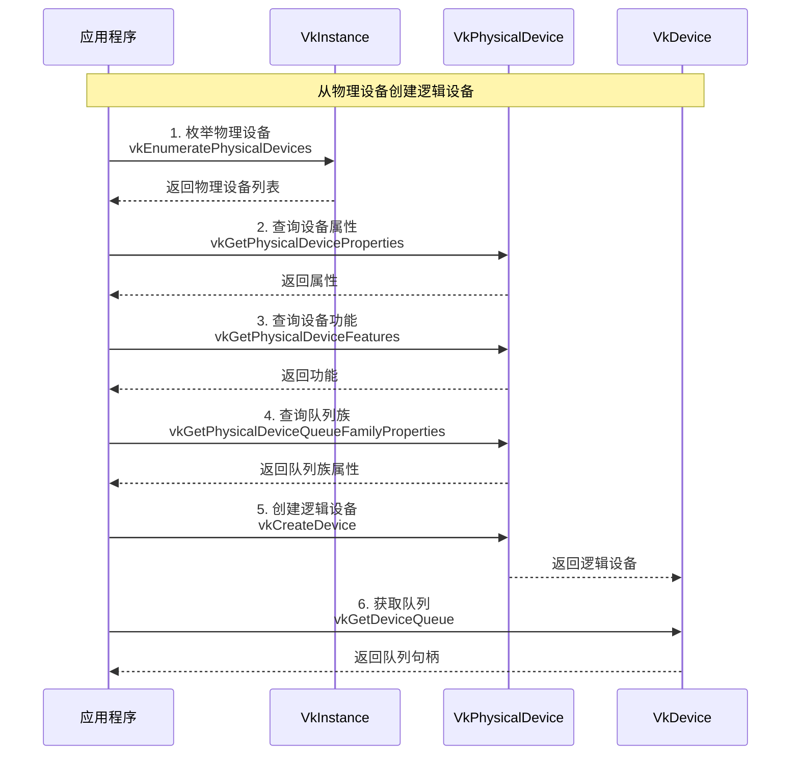
```mermaid
sequenceDiagram
    participant App as 应用程序
    participant Instance as VkInstance
    participant PhysicalDevice as VkPhysicalDevice
    participant LogicalDevice as VkDevice
    
    Note over App,LogicalDevice: 从物理设备创建逻辑设备
    
    App->>Instance: 1. 枚举物理设备<br/>vkEnumeratePhysicalDevices
    Instance-->>App: 返回物理设备列表
    
    App->>PhysicalDevice: 2. 查询设备属性<br/>vkGetPhysicalDeviceProperties
    PhysicalDevice-->>App: 返回属性
    
    App->>PhysicalDevice: 3. 查询设备功能<br/>vkGetPhysicalDeviceFeatures
    PhysicalDevice-->>App: 返回功能
    
    App->>PhysicalDevice: 4. 查询队列族<br/>vkGetPhysicalDeviceQueueFamilyProperties
    PhysicalDevice-->>App: 返回队列族属性
    
    App->>PhysicalDevice: 5. 创建逻辑设备<br/>vkCreateDevice
    PhysicalDevice-->>LogicalDevice: 返回逻辑设备
    
    App->>LogicalDevice: 6. 获取队列<br/>vkGetDeviceQueue
    LogicalDevice-->>App: 返回队列句柄
```

---

## 实际代码示例

### 完整的物理设备选择和使用流程

```cpp
/**
 * @brief 完整的物理设备初始化流程
 */
class PhysicalDeviceManager {
private:
    VkInstance instance;
    VkPhysicalDevice physicalDevice;
    VkPhysicalDeviceProperties properties;
    VkPhysicalDeviceFeatures features;
    VkPhysicalDeviceMemoryProperties memoryProperties;
    std::vector<VkQueueFamilyProperties> queueFamilyProperties;
    
public:
    /**
     * @brief 初始化物理设备管理器
     */
    bool initialize(VkInstance instance) {
        this->instance = instance;
        
        // 1. 枚举物理设备
        uint32_t deviceCount = 0;
        vkEnumeratePhysicalDevices(instance, &deviceCount, nullptr);
        if (deviceCount == 0) {
            std::cerr << "No physical devices found\n";
            return false;
        }
        
        std::vector<VkPhysicalDevice> devices(deviceCount);
        vkEnumeratePhysicalDevices(instance, &deviceCount, devices.data());
        
        // 2. 选择最佳设备
        physicalDevice = selectBestDevice(devices);
        if (physicalDevice == VK_NULL_HANDLE) {
            std::cerr << "Failed to select physical device\n";
            return false;
        }
        
        // 3. 查询设备信息
        vkGetPhysicalDeviceProperties(physicalDevice, &properties);
        vkGetPhysicalDeviceFeatures(physicalDevice, &features);
        vkGetPhysicalDeviceMemoryProperties(physicalDevice, &memoryProperties);
        
        // 4. 查询队列族
        uint32_t queueFamilyCount = 0;
        vkGetPhysicalDeviceQueueFamilyProperties(physicalDevice, &queueFamilyCount, nullptr);
        queueFamilyProperties.resize(queueFamilyCount);
        vkGetPhysicalDeviceQueueFamilyProperties(physicalDevice, &queueFamilyCount, 
                                                queueFamilyProperties.data());
        
        return true;
    }
    
    /**
     * @brief 选择最佳物理设备
     */
    VkPhysicalDevice selectBestDevice(const std::vector<VkPhysicalDevice>& devices) {
        VkPhysicalDevice bestDevice = VK_NULL_HANDLE;
        int bestScore = -1;
        
        for (auto device : devices) {
            int score = rateDevice(device);
            if (score > bestScore) {
                bestScore = score;
                bestDevice = device;
            }
        }
        
        return bestDevice;
    }
    
    /**
     * @brief 对设备进行评分
     */
    int rateDevice(VkPhysicalDevice device) {
        VkPhysicalDeviceProperties props;
        VkPhysicalDeviceFeatures feats;
        vkGetPhysicalDeviceProperties(device, &props);
        vkGetPhysicalDeviceFeatures(device, &feats);
        
        int score = 0;
        
        // 设备类型评分
        switch (props.deviceType) {
            case VK_PHYSICAL_DEVICE_TYPE_DISCRETE_GPU:
                score += 1000;
                break;
            case VK_PHYSICAL_DEVICE_TYPE_INTEGRATED_GPU:
                score += 500;
                break;
            default:
                break;
        }
        
        // 功能评分
        if (feats.geometryShader) score += 10;
        if (feats.tessellationShader) score += 10;
        if (feats.samplerAnisotropy) score += 10;
        
        return score;
    }
    
    // Getter 方法
    VkPhysicalDevice getPhysicalDevice() const { return physicalDevice; }
    const VkPhysicalDeviceProperties& getProperties() const { return properties; }
    const VkPhysicalDeviceFeatures& getFeatures() const { return features; }
    const VkPhysicalDeviceMemoryProperties& getMemoryProperties() const { 
        return memoryProperties; 
    }
    const std::vector<VkQueueFamilyProperties>& getQueueFamilyProperties() const {
        return queueFamilyProperties;
    }
};
```

---

## 最佳实践

### 物理设备使用最佳实践

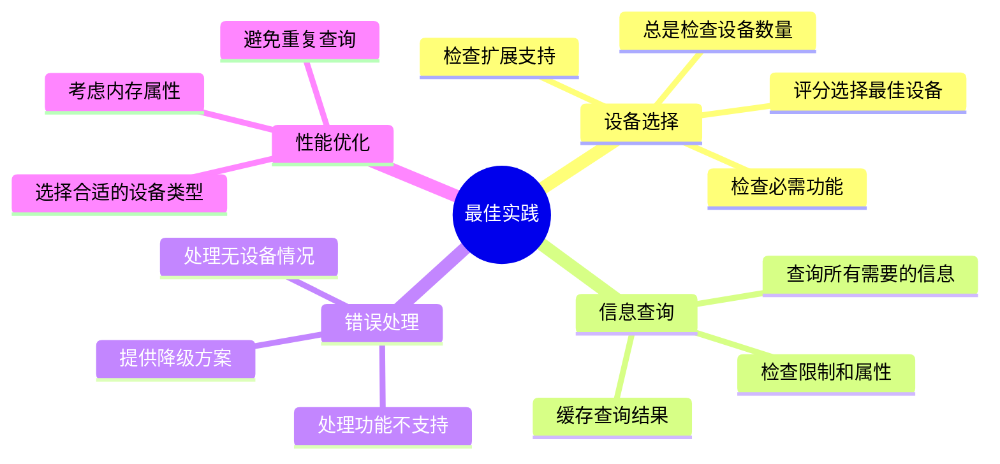
```mermaid
mindmap
  root((最佳实践))
    设备选择
      总是检查设备数量
      评分选择最佳设备
      检查必需功能
      检查扩展支持
    信息查询
      查询所有需要的信息
      缓存查询结果
      检查限制和属性
    错误处理
      处理无设备情况
      处理功能不支持
      提供降级方案
    性能优化
      避免重复查询
      选择合适的设备类型
      考虑内存属性
```

### 检查清单

| 实践 | 说明 | 重要性 |
|------|------|--------|
| **检查设备数量** | 枚举后检查是否有设备 | ⭐⭐⭐⭐⭐ |
| **查询所有信息** | 属性、功能、内存、队列族 | ⭐⭐⭐⭐⭐ |
| **检查必需功能** | 使用前检查功能支持 | ⭐⭐⭐⭐⭐ |
| **检查扩展支持** | 验证需要的扩展 | ⭐⭐⭐⭐ |
| **设备评分** | 选择最适合的设备 | ⭐⭐⭐⭐ |
| **错误处理** | 处理查询失败情况 | ⭐⭐⭐⭐⭐ |

### 常见错误与解决方案

| 错误 | 原因 | 解决方案 |
|------|------|---------|
| **没有设备** | 系统没有 Vulkan 支持的 GPU | 检查驱动安装，提供错误消息 |
| **功能不支持** | 请求的功能设备不支持 | 查询功能，提供降级方案 |
| **内存类型不匹配** | 请求的内存类型不存在 | 查询内存属性，选择合适类型 |
| **队列族不存在** | 需要的队列类型不存在 | 查询队列族，检查支持 |

---

## 总结

### VkPhysicalDevice 核心要点

1. **硬件抽象**: 代表实际的 GPU 硬件
2. **只读查询**: 用于查询硬件信息，不能直接使用
3. **多设备支持**: 系统中可能有多个物理设备
4. **设备选择**: 需要选择合适的物理设备
5. **逻辑设备基础**: 基于物理设备创建逻辑设备

### 物理设备查询流程总结

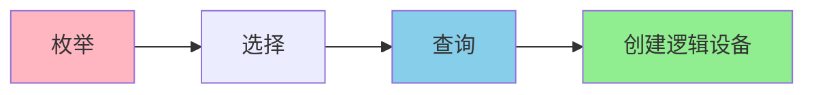
```mermaid
flowchart LR
    Enumerate[枚举] --> Select[选择] --> Query[查询] --> Create[创建逻辑设备]
    
    style Enumerate fill:#FFB6C1
    style Query fill:#87CEEB
    style Create fill:#90EE90
```

### 相关 API 速查

| API | 说明 |
|-----|------|
| `vkEnumeratePhysicalDevices()` | 枚举物理设备 |
| `vkGetPhysicalDeviceProperties()` | 获取设备属性 |
| `vkGetPhysicalDeviceFeatures()` | 获取设备功能 |
| `vkGetPhysicalDeviceMemoryProperties()` | 获取内存属性 |
| `vkGetPhysicalDeviceQueueFamilyProperties()` | 获取队列族属性 |
| `vkGetPhysicalDeviceProperties2()` | 获取设备属性2（扩展） |
| `vkGetPhysicalDeviceFeatures2()` | 获取设备功能2（扩展） |

---

*文档版本: 1.0*  
*最后更新: 2024*  
*基于 Vulkan 1.3 规范*


