# VkSurfaceKHR 详细分析文档

## 目录
1. [表面是什么？用生活例子理解](#表面是什么用生活例子理解)
2. [VkSurfaceKHR 概述](#vksurfacekhr-概述)
3. [表面对象的作用与重要性](#表面对象的作用与重要性)
4. [表面的创建与销毁](#表面的创建与销毁)
5. [不同平台的表面创建](#不同平台的表面创建)
6. [表面格式查询](#表面格式查询)
7. [表面能力查询](#表面能力查询)
8. [表面与交换链的关系](#表面与交换链的关系)
9. [表面与队列族的关系](#表面与队列族的关系)
10. [实际代码示例](#实际代码示例)
11. [最佳实践](#最佳实践)

---

## 表面是什么？用生活例子理解

### 🎨 最简单的理解：表面 = 画布

想象一下你要画画：

```
┌─────────────────────────────────┐
│  窗口（Window）                  │
│  ┌───────────────────────────┐  │
│  │  表面（Surface）           │  │ ← 这就是"表面"，一个可以画画的区域
│  │  ┌─────────────────────┐  │  │
│  │  │  交换链图像          │  │  │ ← 你画的画（渲染的图像）
│  │  │  (SwapChain Image)   │  │  │
│  │  └─────────────────────┘  │  │
│  └───────────────────────────┘  │
└─────────────────────────────────┘
```

**表面（Surface）就是窗口里那个可以显示图像的区域**，就像画布一样。

### 📺 更具体的例子：电视屏幕

想象你在看电视：

1. **窗口（Window）** = 电视机的外框和遥控器
2. **表面（Surface）** = 电视机的屏幕（可以显示画面的区域）
3. **交换链（SwapChain）** = 电视台播放的视频帧
4. **GPU渲染** = 电视台制作节目的过程

```
看电视的流程：
电视台制作节目 → 发送视频帧 → 电视机屏幕显示 → 你看到画面

Vulkan渲染的流程：
GPU渲染图像 → 交换链管理图像 → 表面显示图像 → 窗口显示给用户
```

### 🖼️ 实际代码中的对应关系

```cpp
// 1. 创建窗口（就像买一台电视机）
HWND hWnd = CreateWindow(...);  // Windows窗口

// 2. 创建表面（就像告诉Vulkan"这个屏幕可以显示画面"）
VkSurfaceKHR surface;
vkCreateWin32SurfaceKHR(instance, &createInfo, nullptr, &surface);
// 表面 = 把窗口和Vulkan连接起来

// 3. 创建交换链（就像准备播放的视频帧）
VkSwapchainKHR swapchain;
// 交换链基于表面创建，因为需要知道"显示到哪里"

// 4. 渲染并显示（就像播放节目）
// GPU渲染图像 → 呈现到表面 → 窗口显示
vkQueuePresentKHR(presentQueue, &presentInfo);
```

### 🎯 为什么需要"表面"？

**问题**：不同操作系统的窗口系统完全不同！
- Windows 用 `HWND`
- Linux X11 用 `xcb_window_t`
- Linux Wayland 用 `wl_surface`
- Android 用 `ANativeWindow`
- macOS 用 `NSView` 或 `CAMetalLayer`

**解决方案**：表面（Surface）提供统一接口！

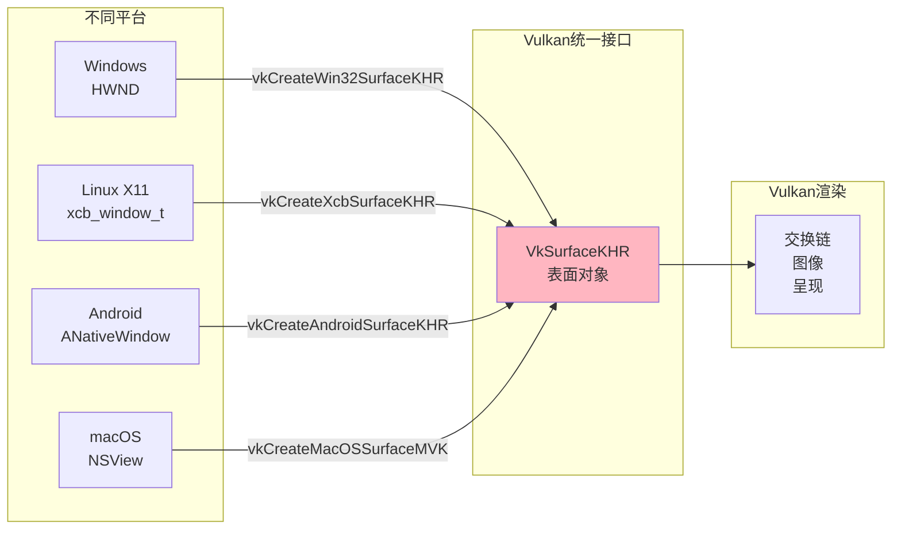

**表面就像一个"翻译器"**，把不同平台的窗口"翻译"成Vulkan能理解的统一格式。

### 🏠 完整的类比：装修房子

让我们用一个完整的例子：

```
🏠 你要装修房子（创建Vulkan应用）

1. 买房子 = 创建窗口（CreateWindow）
   └─ 你有了一个空房子

2. 告诉装修公司"这个房间要装修" = 创建表面（vkCreateSurfaceKHR）
   └─ 表面 = 告诉Vulkan"这个窗口可以显示内容"
   └─ 就像告诉装修公司"这个房间的墙可以刷漆"

3. 准备装修材料 = 创建交换链（vkCreateSwapchainKHR）
   └─ 交换链 = 准备多张"画布"（图像），可以轮流使用
   └─ 就像准备多桶油漆，可以轮流刷墙

4. 开始装修 = GPU渲染
   └─ 在"画布"上画画（渲染图像）

5. 把画挂到墙上 = 呈现到表面（vkQueuePresentKHR）
   └─ 把渲染好的图像显示到窗口上
   └─ 就像把画好的画挂到墙上，客人就能看到了
```

### 💡 关键理解点

1. **表面不是窗口本身**，而是窗口里"可以显示内容的那部分"
   - 窗口 = 整个窗口（包括标题栏、边框等）
   - 表面 = 窗口的客户区（实际显示内容的区域）

2. **表面是连接窗口和Vulkan的桥梁**
   ```
   窗口系统（Windows/Linux/macOS） ←→ 表面 ←→ Vulkan渲染系统
   ```

3. **表面必须基于窗口创建**
   - 你不能凭空创建一个表面
   - 必须先有窗口，然后告诉Vulkan"这个窗口可以显示Vulkan渲染的内容"

4. **一个窗口对应一个表面，一个表面可以创建多个交换链**
   ```
   窗口1 → 表面1 → 交换链1
   窗口2 → 表面2 → 交换链2
   ```

### 🎬 实际运行时的流程

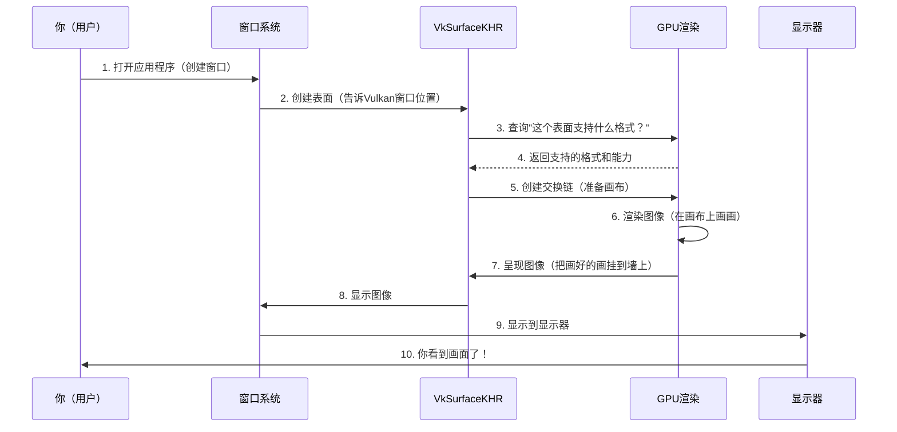

### 🖼️ 可视化理解：窗口 vs 表面 vs 交换链

```
┌─────────────────────────────────────────────────────────────┐
│  窗口（Window）                                              │
│  ┌───────────────────────────────────────────────────────┐ │
│  │  标题栏、边框等（窗口系统管理）                        │ │
│  ├───────────────────────────────────────────────────────┤ │
│  │                                                       │ │
│  │  ┌───────────────────────────────────────────────┐   │ │
│  │  │  表面（Surface）                                │   │ │
│  │  │  这是Vulkan可以"画"的区域                      │   │ │
│  │  │  ┌─────────────────────────────────────────┐ │   │ │
│  │  │  │  交换链图像1（当前显示）                  │ │   │ │
│  │  │  │  [你看到的画面]                           │ │   │ │
│  │  │  └─────────────────────────────────────────┘ │   │ │
│  │  │                                               │   │ │
│  │  │  交换链图像2（后台渲染中）                    │   │ │
│  │  │  交换链图像3（等待显示）                      │   │ │
│  │  └───────────────────────────────────────────────┘   │ │
│  │                                                       │ │
│  └───────────────────────────────────────────────────────┘ │
└─────────────────────────────────────────────────────────────┘
```

**关系说明**：
- **窗口** = 整个窗口（包括标题栏、边框）
- **表面** = 窗口的客户区（实际显示内容的区域，红色框内）
- **交换链** = 多张图像，轮流显示在表面上

### 🎮 游戏中的实际例子

想象你在玩一个3D游戏：

```
游戏窗口打开
    ↓
创建表面（告诉Vulkan"这个窗口可以显示3D画面"）
    ↓
创建交换链（准备3张图像：当前显示、后台渲染、等待显示）
    ↓
游戏循环：
    1. GPU渲染场景到"后台渲染"图像
    2. 把"后台渲染"图像呈现到表面
    3. 表面显示到窗口
    4. 你看到游戏画面
    5. 重复...
```

**表面在这里的作用**：
- 告诉GPU"把画面显示到这个窗口"
- 管理图像格式（比如用RGB还是BGR）
- 处理窗口大小变化（你调整窗口大小时，表面会通知Vulkan）

### ✅ 总结：表面就是什么？

**一句话总结**：表面（Surface）就是**窗口里那个可以显示Vulkan渲染内容的区域**，它是连接操作系统窗口和Vulkan渲染系统的桥梁。

**三个关键词**：
1. **显示区域** - 窗口中可以显示内容的部分
2. **桥梁** - 连接窗口系统和Vulkan
3. **统一接口** - 不同平台用同一个Vulkan API

**记住这个公式**：
```
窗口（Window） + 表面（Surface） = Vulkan可以显示内容的地方
```

---

## VkSurfaceKHR 概述

### 什么是 VkSurfaceKHR？

**VkSurfaceKHR** 是 Vulkan 中用于表示窗口系统表面的对象。它是 Vulkan 与操作系统窗口系统之间的桥梁，允许 Vulkan 将渲染结果呈现到窗口或显示器上。

### VkSurfaceKHR 的核心特点

- **窗口系统抽象**: 提供跨平台的窗口系统接口
- **呈现目标**: 作为渲染结果的最终呈现目标
- **平台特定**: 不同平台使用不同的创建函数
- **交换链基础**: 交换链必须基于表面创建
- **实例级别**: 表面对象在实例级别创建

### VkSurfaceKHR 在 Vulkan 架构中的位置

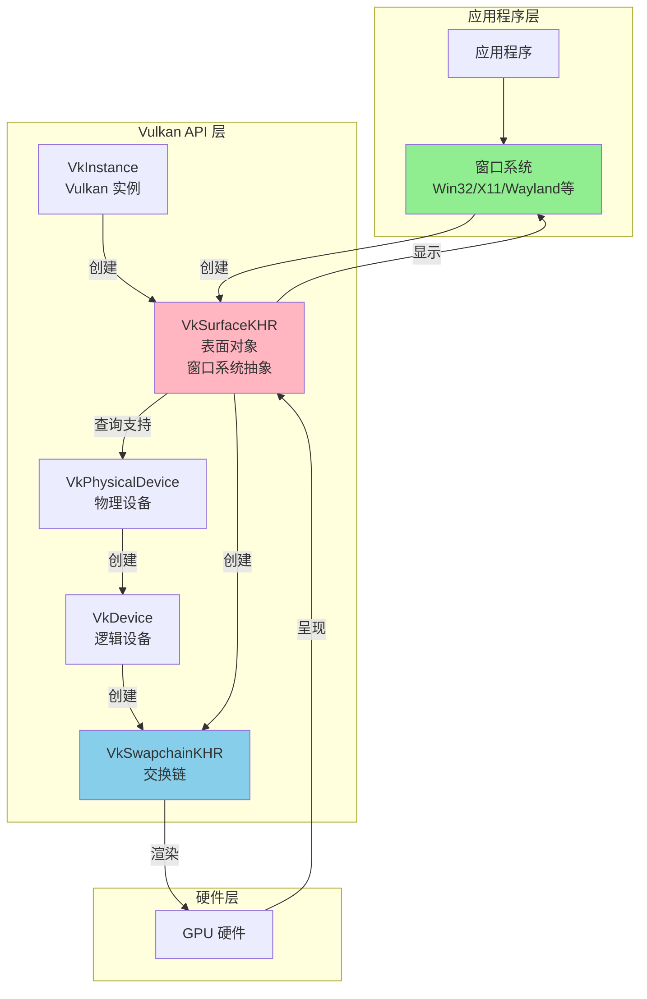

---

## 表面对象的作用与重要性

### 表面的主要作用

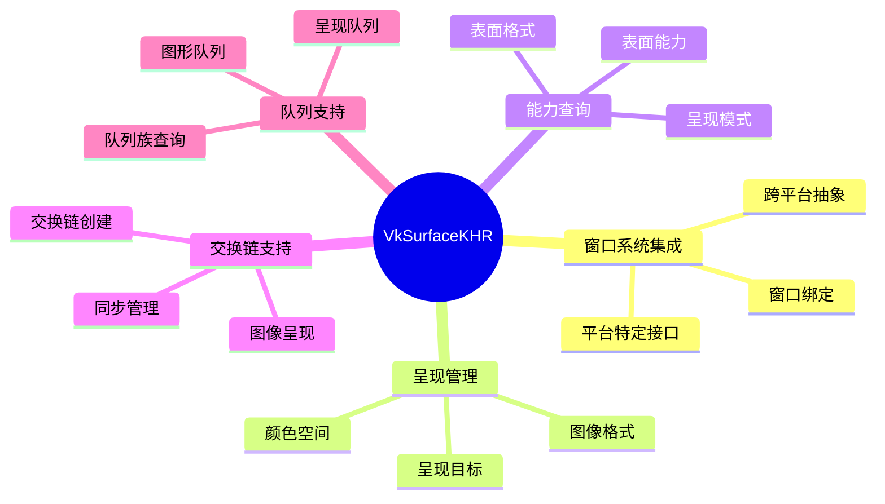

### 表面对象的关键特性

#### 1. 窗口系统抽象

表面对象将不同操作系统的窗口系统统一抽象为 Vulkan 接口，使得应用程序可以跨平台使用相同的 Vulkan API。

#### 2. 呈现目标

表面是渲染管线的最终输出目标，所有渲染的图像最终都会呈现到表面上。

#### 3. 格式协商

表面与物理设备协商支持的图像格式、颜色空间等属性，确保交换链可以正确创建。

### 表面对象生命周期

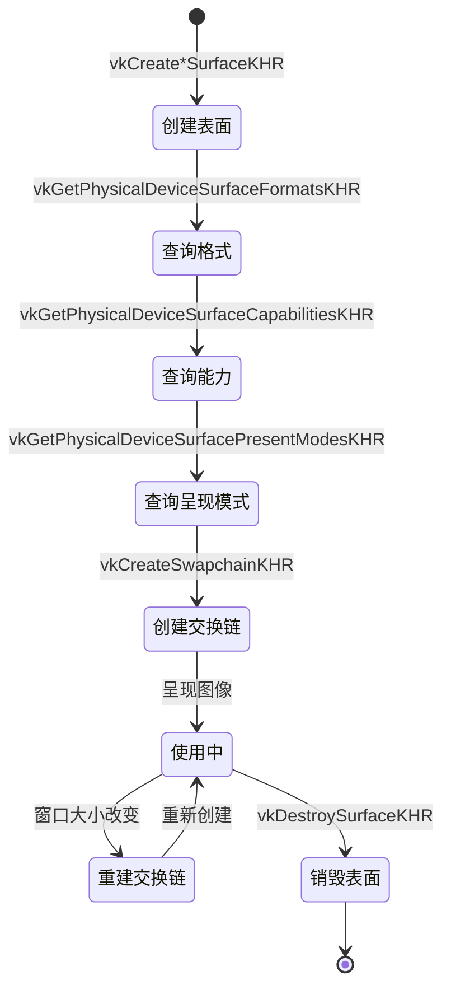

---

## 表面的创建与销毁

### 表面创建流程

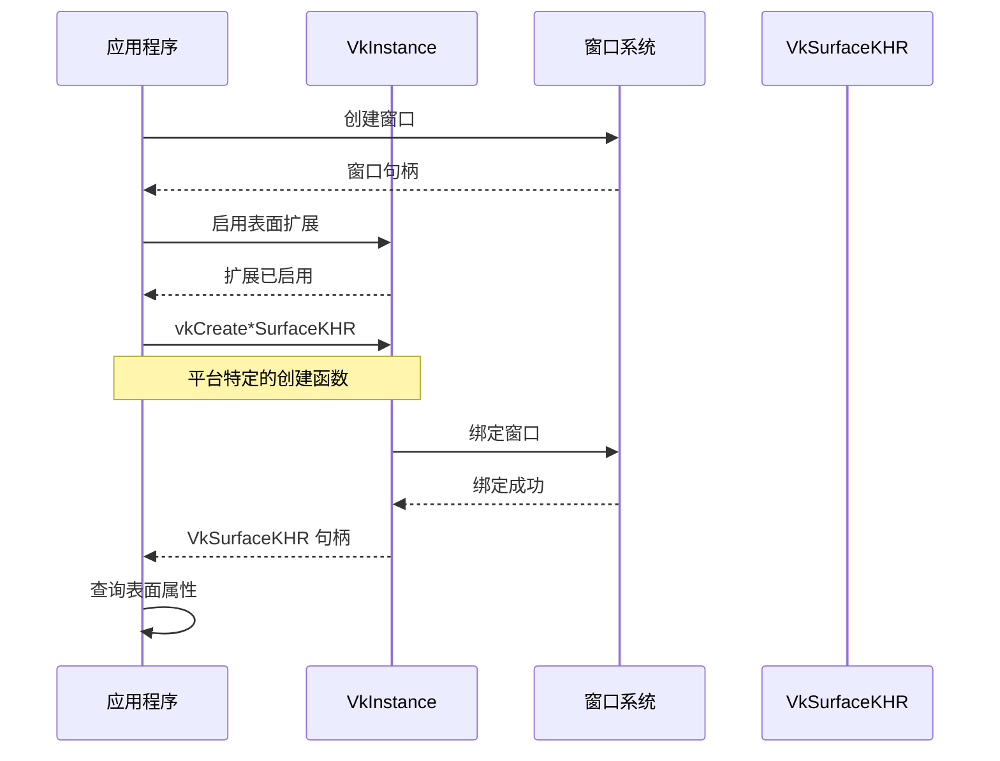

### 表面创建函数

不同平台使用不同的创建函数：

| 平台 | 创建函数 | 扩展名称 |
|------|---------|---------|
| Windows | `vkCreateWin32SurfaceKHR` | `VK_KHR_WIN32_SURFACE` |
| Linux (X11/XCB) | `vkCreateXcbSurfaceKHR` | `VK_KHR_XCB_SURFACE` |
| Linux (Wayland) | `vkCreateWaylandSurfaceKHR` | `VK_KHR_WAYLAND_SURFACE` |
| Android | `vkCreateAndroidSurfaceKHR` | `VK_KHR_ANDROID_SURFACE` |
| macOS/iOS (MoltenVK) | `vkCreateMacOSSurfaceMVK` / `vkCreateIOSSurfaceMVK` | `VK_MVK_MACOS_SURFACE` / `VK_MVK_IOS_SURFACE` |
| macOS (Metal) | `vkCreateMetalSurfaceEXT` | `VK_EXT_METAL_SURFACE` |
| Headless | `vkCreateHeadlessSurfaceEXT` | `VK_EXT_HEADLESS_SURFACE` |

### 表面销毁

表面对象使用 `vkDestroySurfaceKHR` 函数销毁：

```cpp
void vkDestroySurfaceKHR(
    VkInstance                                  instance,
    VkSurfaceKHR                                surface,
    const VkAllocationCallbacks*                pAllocator
);
```

**重要注意事项**：
- 必须在销毁交换链之后销毁表面
- 必须在销毁实例之前销毁表面
- 表面销毁后，所有基于该表面的交换链都将失效

---

## 不同平台的表面创建

### Windows 平台

```cpp
// Windows 平台表面创建
VkWin32SurfaceCreateInfoKHR surfaceCreateInfo{};
surfaceCreateInfo.sType = VK_STRUCTURE_TYPE_WIN32_SURFACE_CREATE_INFO_KHR;
surfaceCreateInfo.hinstance = hInstance;  // 窗口实例句柄
surfaceCreateInfo.hwnd = hWnd;            // 窗口句柄

VkSurfaceKHR surface;
VkResult result = vkCreateWin32SurfaceKHR(instance, &surfaceCreateInfo, nullptr, &surface);
```

**所需扩展**：
- `VK_KHR_SURFACE_EXTENSION_NAME`
- `VK_KHR_WIN32_SURFACE_EXTENSION_NAME`

### Linux XCB 平台

```cpp
// Linux XCB 平台表面创建
VkXcbSurfaceCreateInfoKHR surfaceCreateInfo{};
surfaceCreateInfo.sType = VK_STRUCTURE_TYPE_XCB_SURFACE_CREATE_INFO_KHR;
surfaceCreateInfo.connection = connection;  // XCB 连接
surfaceCreateInfo.window = window;           // XCB 窗口 ID

VkSurfaceKHR surface;
VkResult result = vkCreateXcbSurfaceKHR(instance, &surfaceCreateInfo, nullptr, &surface);
```

**所需扩展**：
- `VK_KHR_SURFACE_EXTENSION_NAME`
- `VK_KHR_XCB_SURFACE_EXTENSION_NAME`

### Linux Wayland 平台

```cpp
// Linux Wayland 平台表面创建
VkWaylandSurfaceCreateInfoKHR surfaceCreateInfo{};
surfaceCreateInfo.sType = VK_STRUCTURE_TYPE_WAYLAND_SURFACE_CREATE_INFO_KHR;
surfaceCreateInfo.display = display;  // Wayland 显示对象
surfaceCreateInfo.surface = surface;   // Wayland 表面对象

VkSurfaceKHR surface;
VkResult result = vkCreateWaylandSurfaceKHR(instance, &surfaceCreateInfo, nullptr, &surface);
```

**所需扩展**：
- `VK_KHR_SURFACE_EXTENSION_NAME`
- `VK_KHR_WAYLAND_SURFACE_EXTENSION_NAME`

### Android 平台

```cpp
// Android 平台表面创建
VkAndroidSurfaceCreateInfoKHR surfaceCreateInfo{};
surfaceCreateInfo.sType = VK_STRUCTURE_TYPE_ANDROID_SURFACE_CREATE_INFO_KHR;
surfaceCreateInfo.window = window;  // ANativeWindow 指针

VkSurfaceKHR surface;
VkResult result = vkCreateAndroidSurfaceKHR(instance, &surfaceCreateInfo, nullptr, &surface);
```

**所需扩展**：
- `VK_KHR_SURFACE_EXTENSION_NAME`
- `VK_KHR_ANDROID_SURFACE_EXTENSION_NAME`

### macOS/iOS 平台 (MoltenVK)

```cpp
// macOS 平台表面创建 (MoltenVK)
VkMacOSSurfaceCreateInfoMVK surfaceCreateInfo{};
surfaceCreateInfo.sType = VK_STRUCTURE_TYPE_MACOS_SURFACE_CREATE_INFO_MVK;
surfaceCreateInfo.pView = view;  // NSView 指针

VkSurfaceKHR surface;
VkResult result = vkCreateMacOSSurfaceMVK(instance, &surfaceCreateInfo, nullptr, &surface);
```

**所需扩展**：
- `VK_KHR_SURFACE_EXTENSION_NAME`
- `VK_MVK_MACOS_SURFACE_EXTENSION_NAME`

### macOS 平台 (Metal)

```cpp
// macOS 平台表面创建 (Metal)
VkMetalSurfaceCreateInfoEXT surfaceCreateInfo{};
surfaceCreateInfo.sType = VK_STRUCTURE_TYPE_METAL_SURFACE_CREATE_INFO_EXT;
surfaceCreateInfo.pLayer = metalLayer;  // CAMetalLayer 指针

VkSurfaceKHR surface;
VkResult result = vkCreateMetalSurfaceEXT(instance, &surfaceCreateInfo, nullptr, &surface);
```

**所需扩展**：
- `VK_KHR_SURFACE_EXTENSION_NAME`
- `VK_EXT_METAL_SURFACE_EXTENSION_NAME`

### 无头渲染 (Headless)

```cpp
// 无头表面创建（用于无窗口渲染）
VkHeadlessSurfaceCreateInfoEXT surfaceCreateInfo{};
surfaceCreateInfo.sType = VK_STRUCTURE_TYPE_HEADLESS_SURFACE_CREATE_INFO_EXT;

PFN_vkCreateHeadlessSurfaceEXT fpCreateHeadlessSurfaceEXT = 
    (PFN_vkCreateHeadlessSurfaceEXT)vkGetInstanceProcAddr(instance, "vkCreateHeadlessSurfaceEXT");

VkSurfaceKHR surface;
VkResult result = fpCreateHeadlessSurfaceEXT(instance, &surfaceCreateInfo, nullptr, &surface);
```

**所需扩展**：
- `VK_KHR_SURFACE_EXTENSION_NAME`
- `VK_EXT_HEADLESS_SURFACE_EXTENSION_NAME`

---

## 表面格式查询

### 表面格式概述

表面格式定义了交换链图像的颜色格式和颜色空间。不同的表面可能支持不同的格式组合。

### 查询表面格式

```cpp
// 第一次调用：获取格式数量
uint32_t formatCount;
vkGetPhysicalDeviceSurfaceFormatsKHR(physicalDevice, surface, &formatCount, nullptr);

// 第二次调用：获取所有格式
std::vector<VkSurfaceFormatKHR> surfaceFormats(formatCount);
vkGetPhysicalDeviceSurfaceFormatsKHR(physicalDevice, surface, &formatCount, surfaceFormats.data());
```

### VkSurfaceFormatKHR 结构

```cpp
typedef struct VkSurfaceFormatKHR {
    VkFormat           format;       // 图像格式（如 VK_FORMAT_B8G8R8A8_UNORM）
    VkColorSpaceKHR    colorSpace;   // 颜色空间（如 VK_COLOR_SPACE_SRGB_NONLINEAR_KHR）
} VkSurfaceFormatKHR;
```

### 格式选择策略

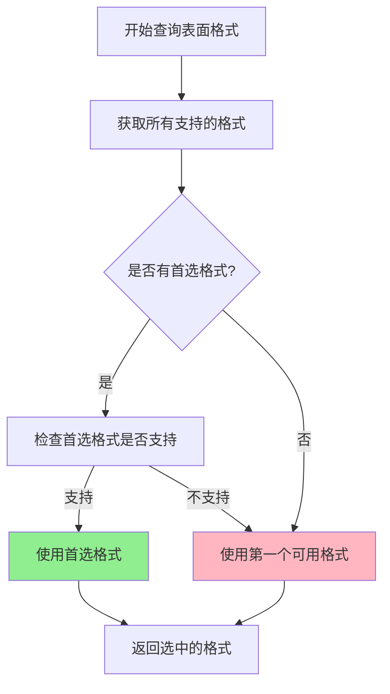

### 常用格式优先级

```cpp
// 首选格式列表（按优先级排序）
std::vector<VkFormat> preferredFormats = {
    VK_FORMAT_B8G8R8A8_UNORM,      // BGRA 8位未归一化（Windows 常用）
    VK_FORMAT_R8G8B8A8_UNORM,      // RGBA 8位未归一化（通用）
    VK_FORMAT_A8B8G8R8_UNORM_PACK32 // ABGR 8位未归一化打包
};

// 选择格式
VkSurfaceFormatKHR selectedFormat = surfaceFormats[0];  // 默认使用第一个
for (const auto& availableFormat : surfaceFormats) {
    if (std::find(preferredFormats.begin(), preferredFormats.end(), 
                  availableFormat.format) != preferredFormats.end()) {
        selectedFormat = availableFormat;
        break;
    }
}
```

### 颜色空间

常见的颜色空间包括：

- `VK_COLOR_SPACE_SRGB_NONLINEAR_KHR`: 标准 sRGB 非线性颜色空间（最常用）
- `VK_COLOR_SPACE_DISPLAY_P3_NONLINEAR_EXT`: Display P3 非线性颜色空间
- `VK_COLOR_SPACE_EXTENDED_SRGB_LINEAR_EXT`: 扩展 sRGB 线性颜色空间

---

## 表面能力查询

### 表面能力概述

表面能力描述了表面支持的各种属性和限制，包括：
- 最小/最大图像数量
- 当前表面尺寸
- 支持的变换
- 支持的复合 Alpha 模式
- 支持的用法标志

### 查询表面能力

```cpp
VkSurfaceCapabilitiesKHR surfaceCaps;
vkGetPhysicalDeviceSurfaceCapabilitiesKHR(physicalDevice, surface, &surfaceCaps);
```

### VkSurfaceCapabilitiesKHR 结构

```cpp
typedef struct VkSurfaceCapabilitiesKHR {
    uint32_t                         minImageCount;           // 最小图像数量
    uint32_t                         maxImageCount;           // 最大图像数量（0 表示无限制）
    VkExtent2D                       currentExtent;           // 当前表面尺寸
    VkExtent2D                       minImageExtent;          // 最小图像尺寸
    VkExtent2D                       maxImageExtent;          // 最大图像尺寸
    uint32_t                         maxImageArrayLayers;     // 最大图像数组层数
    VkSurfaceTransformFlagsKHR        supportedTransforms;    // 支持的变换
    VkSurfaceTransformFlagBitsKHR    currentTransform;       // 当前变换
    VkCompositeAlphaFlagsKHR         supportedCompositeAlpha; // 支持的复合 Alpha 模式
    VkImageUsageFlags                supportedUsageFlags;     // 支持的用法标志
} VkSurfaceCapabilitiesKHR;
```

### 表面能力的关键属性

#### 1. 图像数量范围

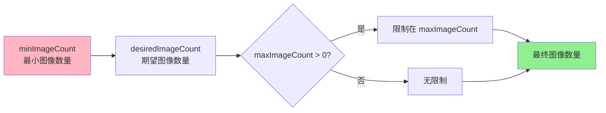

```cpp
// 确定交换链图像数量
uint32_t desiredImageCount = surfaceCaps.minImageCount + 1;  // 三重缓冲
if (surfaceCaps.maxImageCount > 0 && 
    desiredImageCount > surfaceCaps.maxImageCount) {
    desiredImageCount = surfaceCaps.maxImageCount;
}
```

#### 2. 表面尺寸

```cpp
VkExtent2D swapchainExtent;

// 如果 currentExtent.width == 0xFFFFFFFF，表示表面尺寸未定义
if (surfaceCaps.currentExtent.width == (uint32_t)-1) {
    // 使用请求的尺寸，但需要限制在 min/max 范围内
    swapchainExtent.width = std::clamp(
        width, 
        surfaceCaps.minImageExtent.width, 
        surfaceCaps.maxImageExtent.width
    );
    swapchainExtent.height = std::clamp(
        height, 
        surfaceCaps.minImageExtent.height, 
        surfaceCaps.maxImageExtent.height
    );
} else {
    // 表面尺寸已定义，必须使用该尺寸
    swapchainExtent = surfaceCaps.currentExtent;
}
```

#### 3. 表面变换

表面变换用于处理显示旋转（如设备旋转）：

```cpp
VkSurfaceTransformFlagsKHR preTransform;
if (surfaceCaps.supportedTransforms & VK_SURFACE_TRANSFORM_IDENTITY_BIT_KHR) {
    // 优先选择无旋转变换
    preTransform = VK_SURFACE_TRANSFORM_IDENTITY_BIT_KHR;
} else {
    // 否则使用当前变换
    preTransform = surfaceCaps.currentTransform;
}
```

#### 4. 复合 Alpha

复合 Alpha 用于窗口合成，控制窗口与背景的混合方式：

```cpp
VkCompositeAlphaFlagBitsKHR compositeAlpha = VK_COMPOSITE_ALPHA_OPAQUE_BIT_KHR;

// 优先级列表
std::vector<VkCompositeAlphaFlagBitsKHR> compositeAlphaFlags = {
    VK_COMPOSITE_ALPHA_OPAQUE_BIT_KHR,              // 不透明（首选）
    VK_COMPOSITE_ALPHA_PRE_MULTIPLIED_BIT_KHR,       // 预乘 Alpha
    VK_COMPOSITE_ALPHA_POST_MULTIPLIED_BIT_KHR,     // 后乘 Alpha
    VK_COMPOSITE_ALPHA_INHERIT_BIT_KHR              // 继承 Alpha
};

// 选择第一个支持的复合 Alpha 模式
for (const auto& flag : compositeAlphaFlags) {
    if (surfaceCaps.supportedCompositeAlpha & flag) {
        compositeAlpha = flag;
        break;
    }
}
```

---

## 表面与交换链的关系

### 表面与交换链的依赖关系

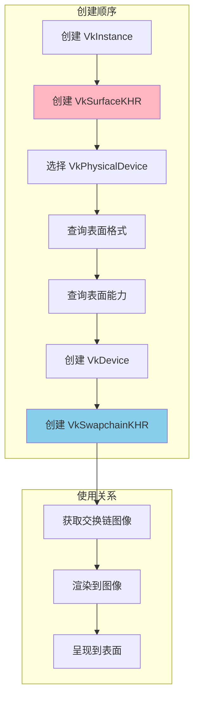

### 交换链创建需要表面信息

交换链创建时必须提供以下表面相关信息：

1. **表面句柄**: 交换链绑定到哪个表面
2. **表面格式**: 交换链图像的格式和颜色空间
3. **表面能力**: 图像数量、尺寸、变换等
4. **呈现模式**: 图像如何呈现到表面

### 交换链创建示例

```cpp
VkSwapchainCreateInfoKHR swapchainInfo{};
swapchainInfo.sType = VK_STRUCTURE_TYPE_SWAPCHAIN_CREATE_INFO_KHR;
swapchainInfo.surface = surface;                    // 表面句柄
swapchainInfo.minImageCount = desiredImageCount;    // 图像数量
swapchainInfo.imageFormat = surfaceFormat.format;   // 表面格式
swapchainInfo.imageColorSpace = surfaceFormat.colorSpace; // 颜色空间
swapchainInfo.imageExtent = swapchainExtent;         // 图像尺寸
swapchainInfo.imageArrayLayers = 1;                 // 图像数组层数
swapchainInfo.imageUsage = VK_IMAGE_USAGE_COLOR_ATTACHMENT_BIT;
swapchainInfo.preTransform = preTransform;          // 表面变换
swapchainInfo.compositeAlpha = compositeAlpha;      // 复合 Alpha
swapchainInfo.presentMode = presentMode;            // 呈现模式
swapchainInfo.clipped = VK_TRUE;                    // 裁剪

VkSwapchainKHR swapchain;
vkCreateSwapchainKHR(device, &swapchainInfo, nullptr, &swapchain);
```

---

## 表面与队列族的关系

### 队列族呈现支持查询

不是所有队列族都支持向表面呈现图像。需要查询每个队列族是否支持呈现：

```cpp
// 获取队列族数量
uint32_t queueFamilyCount;
vkGetPhysicalDeviceQueueFamilyProperties(physicalDevice, &queueFamilyCount, nullptr);

// 查询每个队列族是否支持呈现
std::vector<VkBool32> supportsPresent(queueFamilyCount);
for (uint32_t i = 0; i < queueFamilyCount; i++) {
    vkGetPhysicalDeviceSurfaceSupportKHR(
        physicalDevice, 
        i,           // 队列族索引
        surface, 
        &supportsPresent[i]
    );
}
```

### 队列族选择策略

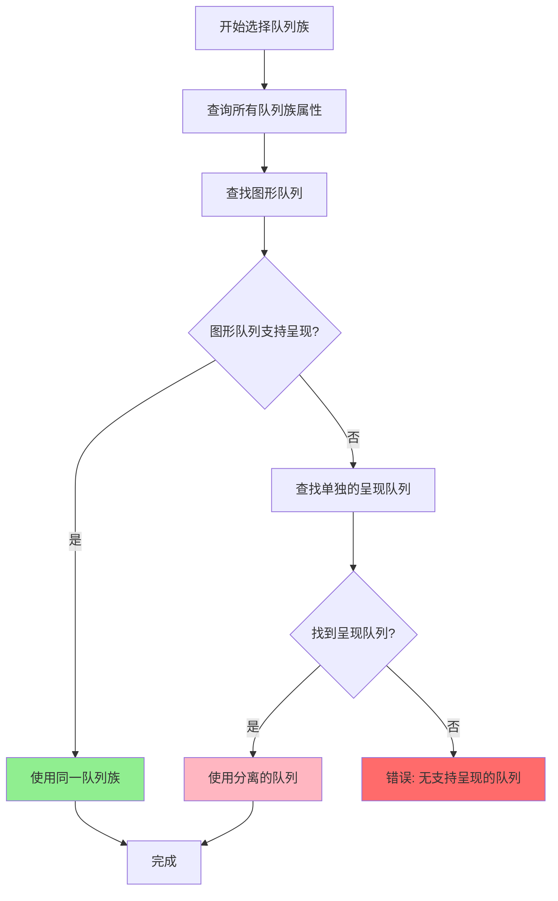

### 队列族选择代码示例

```cpp
// 查找同时支持图形和呈现的队列族
uint32_t graphicsQueueFamilyIndex = UINT32_MAX;
uint32_t presentQueueFamilyIndex = UINT32_MAX;

for (uint32_t i = 0; i < queueFamilyCount; i++) {
    // 检查是否支持图形操作
    if (queueProps[i].queueFlags & VK_QUEUE_GRAPHICS_BIT) {
        if (graphicsQueueFamilyIndex == UINT32_MAX) {
            graphicsQueueFamilyIndex = i;
        }
        // 如果同时支持呈现，优先选择
        if (supportsPresent[i] == VK_TRUE) {
            graphicsQueueFamilyIndex = i;
            presentQueueFamilyIndex = i;
            break;
        }
    }
}

// 如果没有同时支持两者的队列，查找单独的呈现队列
if (presentQueueFamilyIndex == UINT32_MAX) {
    for (uint32_t i = 0; i < queueFamilyCount; i++) {
        if (supportsPresent[i] == VK_TRUE) {
            presentQueueFamilyIndex = i;
            break;
        }
    }
}
```

---

## 实际代码示例

### 完整的表面创建和初始化流程

```cpp
class VulkanSurface {
private:
    VkInstance instance;
    VkSurfaceKHR surface;
    VkPhysicalDevice physicalDevice;
    
public:
    // Windows 平台表面创建
    void createSurfaceWin32(HINSTANCE hInstance, HWND hWnd) {
        VkWin32SurfaceCreateInfoKHR createInfo{};
        createInfo.sType = VK_STRUCTURE_TYPE_WIN32_SURFACE_CREATE_INFO_KHR;
        createInfo.hinstance = hInstance;
        createInfo.hwnd = hWnd;
        
        if (vkCreateWin32SurfaceKHR(instance, &createInfo, nullptr, &surface) != VK_SUCCESS) {
            throw std::runtime_error("failed to create window surface!");
        }
    }
    
    // 查询表面格式
    VkSurfaceFormatKHR selectSurfaceFormat() {
        uint32_t formatCount;
        vkGetPhysicalDeviceSurfaceFormatsKHR(physicalDevice, surface, &formatCount, nullptr);
        
        std::vector<VkSurfaceFormatKHR> formats(formatCount);
        vkGetPhysicalDeviceSurfaceFormatsKHR(physicalDevice, surface, &formatCount, formats.data());
        
        // 首选格式
        std::vector<VkFormat> preferredFormats = {
            VK_FORMAT_B8G8R8A8_UNORM,
            VK_FORMAT_R8G8B8A8_UNORM
        };
        
        // 查找首选格式
        for (const auto& format : formats) {
            if (std::find(preferredFormats.begin(), preferredFormats.end(), 
                         format.format) != preferredFormats.end()) {
                return format;
            }
        }
        
        // 返回第一个可用格式
        return formats[0];
    }
    
    // 查询表面能力
    VkSurfaceCapabilitiesKHR getSurfaceCapabilities() {
        VkSurfaceCapabilitiesKHR capabilities;
        vkGetPhysicalDeviceSurfaceCapabilitiesKHR(
            physicalDevice, surface, &capabilities
        );
        return capabilities;
    }
    
    // 查询呈现模式
    VkPresentModeKHR selectPresentMode(bool vsync) {
        uint32_t presentModeCount;
        vkGetPhysicalDeviceSurfacePresentModesKHR(
            physicalDevice, surface, &presentModeCount, nullptr
        );
        
        std::vector<VkPresentModeKHR> presentModes(presentModeCount);
        vkGetPhysicalDeviceSurfacePresentModesKHR(
            physicalDevice, surface, &presentModeCount, presentModes.data()
        );
        
        if (!vsync) {
            // 优先选择邮箱模式（最低延迟）
            for (const auto& mode : presentModes) {
                if (mode == VK_PRESENT_MODE_MAILBOX_KHR) {
                    return mode;
                }
            }
            // 其次选择立即模式
            for (const auto& mode : presentModes) {
                if (mode == VK_PRESENT_MODE_IMMEDIATE_KHR) {
                    return mode;
                }
            }
        }
        
        // 默认使用 FIFO 模式（垂直同步）
        return VK_PRESENT_MODE_FIFO_KHR;
    }
    
    // 查询队列族是否支持呈现
    bool isQueueFamilyPresentSupported(uint32_t queueFamilyIndex) {
        VkBool32 presentSupport = false;
        vkGetPhysicalDeviceSurfaceSupportKHR(
            physicalDevice, queueFamilyIndex, surface, &presentSupport
        );
        return presentSupport == VK_TRUE;
    }
    
    // 销毁表面
    void destroy() {
        if (surface != VK_NULL_HANDLE) {
            vkDestroySurfaceKHR(instance, surface, nullptr);
            surface = VK_NULL_HANDLE;
        }
    }
    
    VkSurfaceKHR getHandle() const { return surface; }
};
```

### 表面与交换链集成示例

```cpp
void createSwapChain(VkDevice device, VkSurfaceKHR surface, 
                     VkPhysicalDevice physicalDevice,
                     uint32_t width, uint32_t height) {
    // 1. 查询表面能力
    VkSurfaceCapabilitiesKHR capabilities;
    vkGetPhysicalDeviceSurfaceCapabilitiesKHR(
        physicalDevice, surface, &capabilities
    );
    
    // 2. 选择表面格式
    VkSurfaceFormatKHR surfaceFormat = selectSurfaceFormat(physicalDevice, surface);
    
    // 3. 选择呈现模式
    VkPresentModeKHR presentMode = selectPresentMode(physicalDevice, surface, false);
    
    // 4. 确定交换链图像数量
    uint32_t imageCount = capabilities.minImageCount + 1;
    if (capabilities.maxImageCount > 0 && imageCount > capabilities.maxImageCount) {
        imageCount = capabilities.maxImageCount;
    }
    
    // 5. 确定交换链尺寸
    VkExtent2D extent;
    if (capabilities.currentExtent.width != UINT32_MAX) {
        extent = capabilities.currentExtent;
    } else {
        extent.width = std::clamp(
            width,
            capabilities.minImageExtent.width,
            capabilities.maxImageExtent.width
        );
        extent.height = std::clamp(
            height,
            capabilities.minImageExtent.height,
            capabilities.maxImageExtent.height
        );
    }
    
    // 6. 创建交换链
    VkSwapchainCreateInfoKHR createInfo{};
    createInfo.sType = VK_STRUCTURE_TYPE_SWAPCHAIN_CREATE_INFO_KHR;
    createInfo.surface = surface;
    createInfo.minImageCount = imageCount;
    createInfo.imageFormat = surfaceFormat.format;
    createInfo.imageColorSpace = surfaceFormat.colorSpace;
    createInfo.imageExtent = extent;
    createInfo.imageArrayLayers = 1;
    createInfo.imageUsage = VK_IMAGE_USAGE_COLOR_ATTACHMENT_BIT;
    createInfo.preTransform = capabilities.currentTransform;
    createInfo.compositeAlpha = VK_COMPOSITE_ALPHA_OPAQUE_BIT_KHR;
    createInfo.presentMode = presentMode;
    createInfo.clipped = VK_TRUE;
    
    VkSwapchainKHR swapchain;
    if (vkCreateSwapchainKHR(device, &createInfo, nullptr, &swapchain) != VK_SUCCESS) {
        throw std::runtime_error("failed to create swap chain!");
    }
}
```

---

## 最佳实践

### 1. 表面创建时机

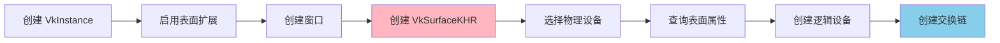

**最佳实践**：
- 在创建实例时启用所需的表面扩展
- 在创建窗口后立即创建表面
- 在创建逻辑设备之前查询表面属性，确保设备支持表面

### 2. 表面格式选择

**最佳实践**：
- 优先选择 `VK_FORMAT_B8G8R8A8_UNORM` 或 `VK_FORMAT_R8G8B8A8_UNORM`
- 使用 `VK_COLOR_SPACE_SRGB_NONLINEAR_KHR` 颜色空间（除非有特殊需求）
- 始终检查返回的格式列表，不要假设特定格式可用

### 3. 表面能力处理

**最佳实践**：
- 始终检查 `currentExtent` 是否为 `0xFFFFFFFF`，以确定是否需要手动设置尺寸
- 将图像数量限制在 `minImageCount` 和 `maxImageCount` 之间
- 优先选择 `VK_SURFACE_TRANSFORM_IDENTITY_BIT_KHR` 变换（如果支持）
- 优先选择 `VK_COMPOSITE_ALPHA_OPAQUE_BIT_KHR` 复合 Alpha（如果支持）

### 4. 呈现模式选择

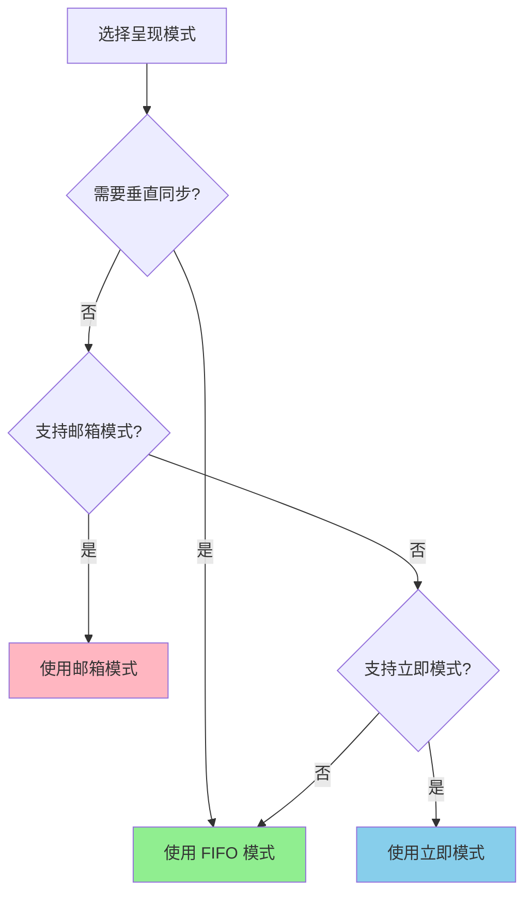

**最佳实践**：
- 对于需要垂直同步的应用（如游戏），使用 `VK_PRESENT_MODE_FIFO_KHR`
- 对于需要最低延迟的应用，优先使用 `VK_PRESENT_MODE_MAILBOX_KHR`
- 避免使用 `VK_PRESENT_MODE_IMMEDIATE_KHR`，除非确实需要（可能导致撕裂）

### 5. 队列族选择

**最佳实践**：
- 优先选择同时支持图形和呈现的队列族
- 如果必须使用分离的队列，确保正确处理同步
- 在创建逻辑设备时，为呈现队列族启用队列

### 6. 表面生命周期管理

**最佳实践**：
- 在销毁交换链之后销毁表面
- 在销毁实例之前销毁表面
- 窗口大小改变时，重建交换链而不是表面
- 使用 RAII 模式管理表面生命周期

### 7. 错误处理

**最佳实践**：
- 始终检查表面创建函数的返回值
- 在查询表面属性之前，确保表面已成功创建
- 处理表面不支持所需格式或能力的情况

### 8. 多平台支持

**最佳实践**：
- 使用条件编译处理不同平台的表面创建
- 在运行时检查扩展是否可用
- 提供清晰的错误消息，说明不支持的平台

### 9. 性能优化

**最佳实践**：
- 使用合适的图像数量（通常为 `minImageCount + 1` 实现三重缓冲）
- 选择合适的呈现模式以平衡延迟和撕裂
- 避免频繁重建交换链

### 10. 调试建议

**最佳实践**：
- 使用 Vulkan 验证层检查表面相关错误
- 打印表面支持的格式和能力，便于调试
- 验证队列族是否真正支持呈现

---

## 总结

VkSurfaceKHR 是 Vulkan 中连接窗口系统和渲染管线的重要桥梁。正确理解和使用表面对象对于创建功能完整的 Vulkan 应用程序至关重要。

### 关键要点

1. **表面是窗口系统的抽象**：提供跨平台的统一接口
2. **表面必须在实例级别创建**：在创建逻辑设备之前创建
3. **表面属性需要查询**：不能假设特定格式或能力可用
4. **表面与交换链紧密相关**：交换链必须基于表面创建
5. **队列族需要支持呈现**：不是所有队列族都支持向表面呈现

### 常见问题

**Q: 为什么需要查询表面格式？**  
A: 不同平台和硬件可能支持不同的图像格式，应用程序需要查询并选择合适的格式。

**Q: 什么时候需要重建交换链？**  
A: 当窗口大小改变、表面格式改变或呈现模式改变时，需要重建交换链。但表面对象本身不需要重建。

**Q: 可以同时使用多个表面吗？**  
A: 可以，但每个表面需要独立的交换链。这在多窗口应用中很有用。

**Q: 无头渲染需要表面吗？**  
A: 可以使用 `VK_EXT_HEADLESS_SURFACE` 扩展创建无头表面，用于无窗口渲染场景。

---

*文档版本: 1.0*  
*最后更新: 2025*

