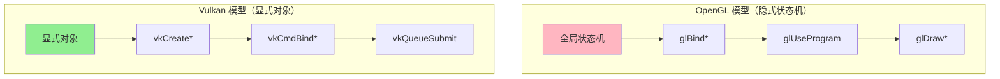
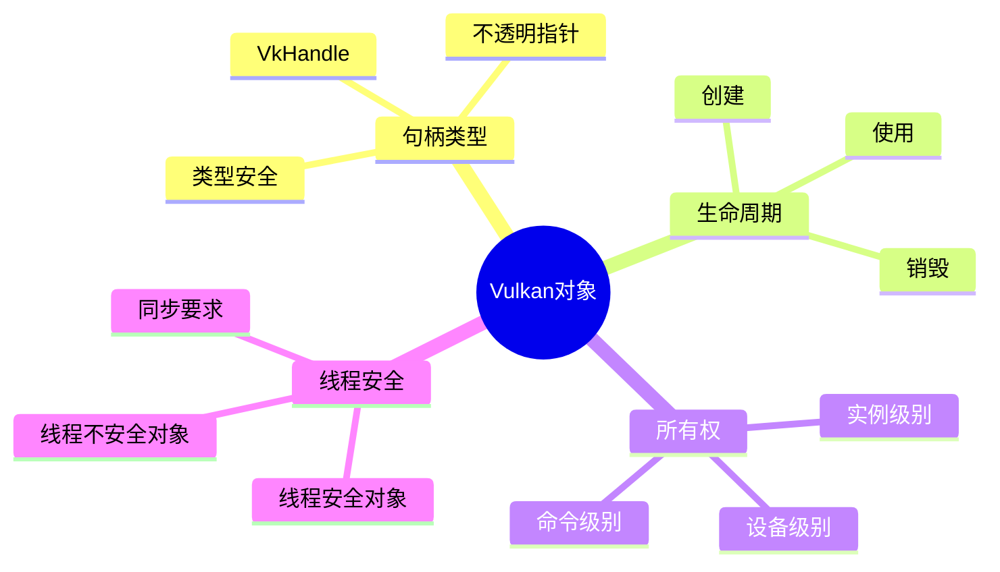
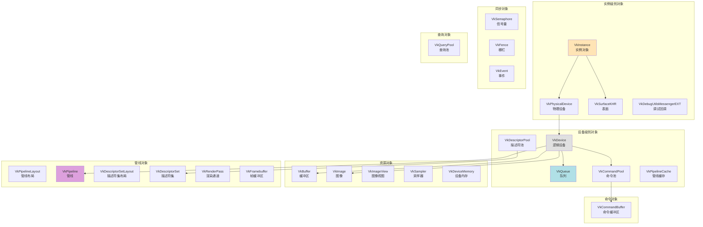
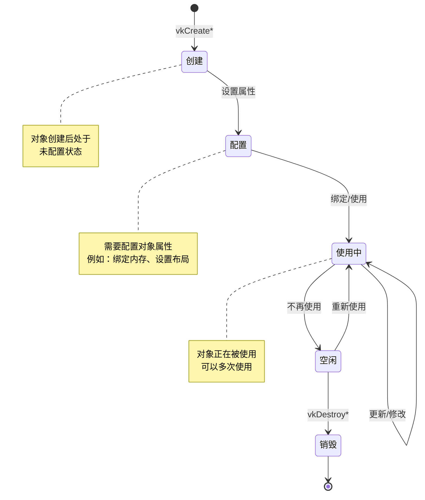
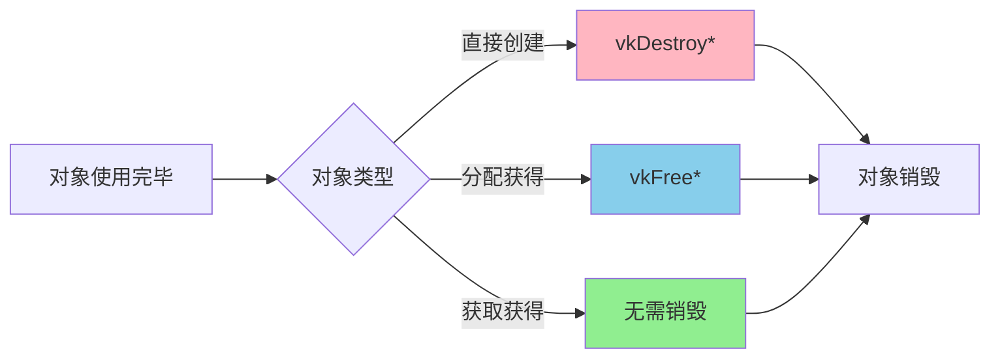
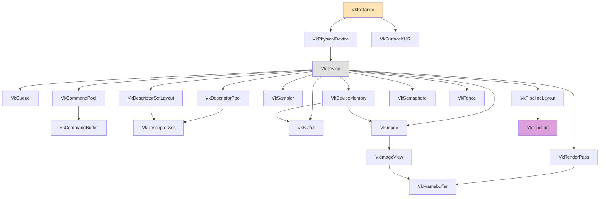
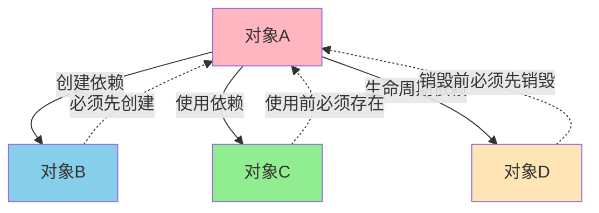
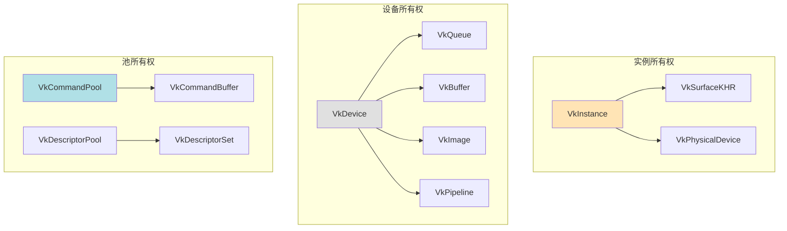
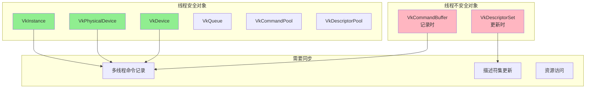
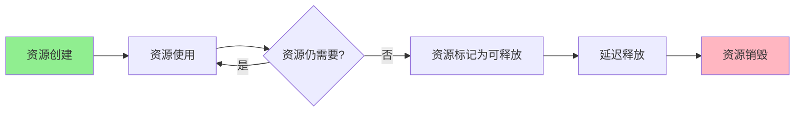

# Vulkan 对象模型与架构设计

## 目录
1. [对象模型概述](#对象模型概述)
2. [对象分类与层次结构](#对象分类与层次结构)
3. [对象生命周期管理](#对象生命周期管理)
4. [对象关系与依赖](#对象关系与依赖)
5. [对象所有权模型](#对象所有权模型)
6. [线程安全模型](#线程安全模型)
7. [架构设计原则](#架构设计原则)
8. [设计模式应用](#设计模式应用)
9. [资源管理策略](#资源管理策略)
10. [最佳实践](#最佳实践)

---

## 对象模型概述

### Vulkan 对象模型的核心特点

Vulkan 采用**显式对象模型**，所有资源都是显式创建和管理的对象。这与 OpenGL 的隐式状态机模型形成鲜明对比。



### 对象模型的设计目标

1. **显式控制**：开发者完全控制对象的创建、使用和销毁
2. **低开销**：最小化驱动开销，对象创建成本可预测
3. **多线程友好**：对象可以在多线程环境中安全使用
4. **类型安全**：强类型系统，减少错误
5. **可预测性**：对象行为可预测，便于优化

### 对象的基本属性



---

## 对象分类与层次结构

### 对象分类体系



### 对象层次结构详解

#### 1. 实例级别对象（Instance-Level Objects）

这些对象在实例级别创建，不依赖于特定设备：

```cpp
// 实例级别对象
VkInstance instance;                    // Vulkan 实例
VkPhysicalDevice physicalDevice;        // 物理设备（句柄，非创建）
VkSurfaceKHR surface;                   // 窗口表面
VkDebugUtilsMessengerEXT debugMessenger; // 调试回调
```

**特点**：
- 生命周期最长，通常在应用程序启动时创建
- 不绑定到特定设备
- 可以查询物理设备信息

#### 2. 设备级别对象（Device-Level Objects）

这些对象在设备级别创建，绑定到特定逻辑设备：

```cpp
// 设备级别对象
VkDevice device;                         // 逻辑设备
VkQueue queue;                          // 队列（从设备获取）
VkCommandPool commandPool;              // 命令池
VkDescriptorPool descriptorPool;       // 描述符池
VkPipelineCache pipelineCache;          // 管线缓存
```

**特点**：
- 绑定到特定设备
- 在设备销毁前必须销毁
- 可以在多线程中安全使用（某些对象除外）

#### 3. 资源对象（Resource Objects）

存储数据的对象：

```cpp
// 资源对象
VkBuffer buffer;                        // 缓冲区
VkImage image;                          // 图像
VkImageView imageView;                  // 图像视图
VkSampler sampler;                     // 采样器
VkDeviceMemory memory;                  // 设备内存
```

**特点**：
- 存储实际数据
- 需要绑定内存
- 生命周期独立管理

#### 4. 管线对象（Pipeline Objects）

定义渲染或计算行为的对象：

```cpp
// 管线对象
VkPipelineLayout pipelineLayout;       // 管线布局
VkPipeline pipeline;                   // 图形/计算管线
VkDescriptorSetLayout descriptorSetLayout; // 描述符集布局
VkDescriptorSet descriptorSet;        // 描述符集
VkRenderPass renderPass;               // 渲染通道
VkFramebuffer framebuffer;             // 帧缓冲区
```

**特点**：
- 定义渲染/计算行为
- 通常创建后很少修改
- 可以重用

#### 5. 命令对象（Command Objects）

用于记录和执行命令：

```cpp
// 命令对象
VkCommandBuffer commandBuffer;         // 命令缓冲区
```

**特点**：
- 从命令池分配
- 可以重置和重用
- 记录后提交到队列执行

#### 6. 同步对象（Synchronization Objects）

用于同步操作：

```cpp
// 同步对象
VkSemaphore semaphore;                 // 信号量
VkFence fence;                         // 栅栏
VkEvent event;                         // 事件
```

**特点**：
- 用于同步 GPU 操作
- 生命周期独立
- 线程安全

---

## 对象生命周期管理

### 生命周期阶段



### 对象创建模式

#### 1. 直接创建模式

```cpp
VkBuffer buffer;
VkBufferCreateInfo createInfo{};
createInfo.sType = VK_STRUCTURE_TYPE_BUFFER_CREATE_INFO;
createInfo.size = 1024;
createInfo.usage = VK_BUFFER_USAGE_VERTEX_BUFFER_BIT;
vkCreateBuffer(device, &createInfo, nullptr, &buffer);
```

#### 2. 分配模式

```cpp
VkCommandBuffer commandBuffer;
VkCommandBufferAllocateInfo allocInfo{};
allocInfo.sType = VK_STRUCTURE_TYPE_COMMAND_BUFFER_ALLOCATE_INFO;
allocInfo.commandPool = commandPool;
allocInfo.level = VK_COMMAND_BUFFER_LEVEL_PRIMARY;
allocInfo.commandBufferCount = 1;
vkAllocateCommandBuffers(device, &allocInfo, &commandBuffer);
```

#### 3. 获取模式

```cpp
VkQueue queue;
vkGetDeviceQueue(device, queueFamilyIndex, 0, &queue);
```

### 对象销毁模式



### 生命周期管理最佳实践

```cpp
class VulkanObjectManager {
private:
    VkDevice device;
    std::vector<VkBuffer> buffers;
    std::vector<VkImage> images;
    std::vector<VkPipeline> pipelines;
    
public:
    // RAII 模式：构造函数创建，析构函数销毁
    ~VulkanObjectManager() {
        cleanup();
    }
    
    void cleanup() {
        // 按依赖顺序销毁
        for (auto pipeline : pipelines) {
            vkDestroyPipeline(device, pipeline, nullptr);
        }
        
        for (auto image : images) {
            vkDestroyImage(device, image, nullptr);
        }
        
        for (auto buffer : buffers) {
            vkDestroyBuffer(device, buffer, nullptr);
        }
    }
};
```

---

## 对象关系与依赖

### 对象依赖图



### 依赖关系类型

#### 1. 创建依赖（Creation Dependency）

对象创建时需要其他对象：

```cpp
// 创建命令缓冲区需要命令池
VkCommandBufferAllocateInfo allocInfo{};
allocInfo.commandPool = commandPool;  // 依赖命令池
vkAllocateCommandBuffers(device, &allocInfo, &commandBuffer);
```

#### 2. 使用依赖（Usage Dependency）

对象使用时需要其他对象：

```cpp
// 使用管线时需要管线布局
vkCmdBindPipeline(commandBuffer, VK_PIPELINE_BIND_POINT_GRAPHICS, pipeline);
vkCmdBindDescriptorSets(commandBuffer, ..., pipelineLayout, ...);  // 依赖管线布局
```

#### 3. 生命周期依赖（Lifetime Dependency）

对象的生命周期依赖于其他对象：

```cpp
// 命令缓冲区的生命周期依赖于命令池
// 如果命令池被销毁，所有从它分配的命令缓冲区都失效
```

### 对象依赖规则



### 依赖管理示例

```cpp
class DependencyManager {
private:
    VkDevice device;
    VkCommandPool commandPool;
    std::vector<VkCommandBuffer> commandBuffers;
    
public:
    void create() {
        // 1. 先创建命令池
        VkCommandPoolCreateInfo poolInfo{};
        vkCreateCommandPool(device, &poolInfo, nullptr, &commandPool);
        
        // 2. 然后从命令池分配命令缓冲区
        VkCommandBufferAllocateInfo allocInfo{};
        allocInfo.commandPool = commandPool;
        vkAllocateCommandBuffers(device, &allocInfo, commandBuffers.data());
    }
    
    void destroy() {
        // 1. 先释放命令缓冲区
        vkFreeCommandBuffers(device, commandPool, 
                            commandBuffers.size(), commandBuffers.data());
        
        // 2. 然后销毁命令池
        vkDestroyCommandPool(device, commandPool, nullptr);
    }
};
```

---

## 对象所有权模型

### 所有权类型



### 所有权规则

1. **实例拥有**：表面、物理设备句柄
2. **设备拥有**：所有设备级别对象
3. **池拥有**：从池分配的对象
4. **无所有权**：队列（从设备获取，无需销毁）

### 所有权转移

```cpp
// 对象所有权示例
class ResourceOwner {
private:
    VkDevice device;           // 设备拥有资源
    VkBuffer buffer;           // 设备拥有缓冲区
    VkDeviceMemory memory;     // 设备拥有内存
    
public:
    void transferOwnership(VkBuffer& buf) {
        // 所有权转移：从临时对象转移到成员变量
        buffer = buf;
        buf = VK_NULL_HANDLE;  // 清空原句柄
    }
    
    ~ResourceOwner() {
        // 所有者负责销毁
        if (buffer != VK_NULL_HANDLE) {
            vkDestroyBuffer(device, buffer, nullptr);
        }
        if (memory != VK_NULL_HANDLE) {
            vkFreeMemory(device, memory, nullptr);
        }
    }
};
```

---

## 线程安全模型

### 线程安全分类



### 线程安全规则

#### 1. 线程安全操作

```cpp
// 以下操作是线程安全的：
// - 创建对象（不同线程创建不同对象）
vkCreateBuffer(device, &info, nullptr, &buffer1);  // 线程1
vkCreateBuffer(device, &info, nullptr, &buffer2);  // 线程2

// - 提交命令到队列（不同队列）
vkQueueSubmit(queue1, ...);  // 线程1
vkQueueSubmit(queue2, ...);  // 线程2

// - 查询操作
vkGetPhysicalDeviceProperties(physicalDevice, &props);
```

#### 2. 线程不安全操作

```cpp
// 以下操作不是线程安全的：
// - 记录命令缓冲区（同一命令缓冲区）
vkBeginCommandBuffer(cmdBuf, ...);  // 线程1
vkCmdDraw(cmdBuf, ...);              // 线程2 - 错误！

// - 更新描述符集（同一描述符集）
vkUpdateDescriptorSets(device, ..., &write, ...);  // 线程1
vkUpdateDescriptorSets(device, ..., &write, ...);  // 线程2 - 错误！
```

### 多线程命令记录

```cpp
class MultiThreadCommandRecorder {
private:
    VkDevice device;
    VkCommandPool commandPool;
    std::vector<VkCommandBuffer> commandBuffers;
    std::mutex poolMutex;
    
public:
    VkCommandBuffer allocateCommandBuffer() {
        std::lock_guard<std::mutex> lock(poolMutex);
        
        VkCommandBufferAllocateInfo allocInfo{};
        allocInfo.commandPool = commandPool;
        allocInfo.commandBufferCount = 1;
        
        VkCommandBuffer cmdBuf;
        vkAllocateCommandBuffers(device, &allocInfo, &cmdBuf);
        return cmdBuf;
    }
    
    void recordCommands(VkCommandBuffer cmdBuf) {
        // 每个线程使用独立的命令缓冲区
        vkBeginCommandBuffer(cmdBuf, ...);
        // 记录命令...
        vkEndCommandBuffer(cmdBuf);
    }
};
```

---

## 架构设计原则

### 1. 显式优于隐式

```cpp
// ❌ 隐式（OpenGL 风格）
glBindBuffer(GL_ARRAY_BUFFER, buffer);
glBufferData(GL_ARRAY_BUFFER, size, data, GL_STATIC_DRAW);
glDrawArrays(GL_TRIANGLES, 0, 3);

// ✅ 显式（Vulkan 风格）
vkCmdBindVertexBuffers(commandBuffer, 0, 1, &buffer, &offset);
vkCmdDraw(commandBuffer, 3, 1, 0, 0);
```

### 2. 状态对象化

```cpp
// Vulkan 将状态封装为对象
VkPipeline pipeline;  // 包含所有渲染状态
VkDescriptorSet descriptorSet;  // 包含所有资源绑定

// 使用时绑定对象
vkCmdBindPipeline(commandBuffer, VK_PIPELINE_BIND_POINT_GRAPHICS, pipeline);
vkCmdBindDescriptorSets(commandBuffer, ..., descriptorSet, ...);
```

### 3. 命令驱动

```cpp
// 所有操作通过命令缓冲区记录
vkBeginCommandBuffer(commandBuffer, ...);
vkCmdBindPipeline(commandBuffer, ...);
vkCmdDraw(commandBuffer, ...);
vkEndCommandBuffer(commandBuffer);

// 提交执行
vkQueueSubmit(queue, 1, &submitInfo, fence);
```

### 4. 多线程设计

```cpp
// 支持多线程命令记录
std::vector<std::thread> threads;
for (int i = 0; i < threadCount; i++) {
    threads.emplace_back([&, i]() {
        VkCommandBuffer cmdBuf = allocateCommandBuffer();
        recordCommands(cmdBuf, i);
    });
}
```

### 5. 资源池化

```cpp
// 使用对象池减少创建开销
class CommandBufferPool {
private:
    std::vector<VkCommandBuffer> pool;
    std::queue<VkCommandBuffer> available;
    
public:
    VkCommandBuffer acquire() {
        if (available.empty()) {
            allocateNew();
        }
        VkCommandBuffer cmdBuf = available.front();
        available.pop();
        return cmdBuf;
    }
    
    void release(VkCommandBuffer cmdBuf) {
        vkResetCommandBuffer(cmdBuf, 0);
        available.push(cmdBuf);
    }
};
```

---

## 设计模式应用

### 1. 工厂模式（Factory Pattern）

```cpp
class VulkanObjectFactory {
public:
    static VkBuffer createBuffer(
        VkDevice device,
        VkDeviceSize size,
        VkBufferUsageFlags usage
    ) {
        VkBufferCreateInfo createInfo{};
        createInfo.sType = VK_STRUCTURE_TYPE_BUFFER_CREATE_INFO;
        createInfo.size = size;
        createInfo.usage = usage;
        
        VkBuffer buffer;
        vkCreateBuffer(device, &createInfo, nullptr, &buffer);
        return buffer;
    }
    
    static VkImage createImage(
        VkDevice device,
        uint32_t width,
        uint32_t height,
        VkFormat format
    ) {
        VkImageCreateInfo createInfo{};
        createInfo.sType = VK_STRUCTURE_TYPE_IMAGE_CREATE_INFO;
        createInfo.extent = {width, height, 1};
        createInfo.format = format;
        
        VkImage image;
        vkCreateImage(device, &createInfo, nullptr, &image);
        return image;
    }
};
```

### 2. 单例模式（Singleton Pattern）

```cpp
class VulkanContext {
private:
    static VulkanContext* instance;
    VkInstance vkInstance;
    VkDevice device;
    
    VulkanContext() = default;
    
public:
    static VulkanContext* getInstance() {
        if (instance == nullptr) {
            instance = new VulkanContext();
        }
        return instance;
    }
    
    VkInstance getInstance() const { return vkInstance; }
    VkDevice getDevice() const { return device; }
};
```

### 3. RAII 模式（Resource Acquisition Is Initialization）

```cpp
class VulkanBuffer {
private:
    VkDevice device;
    VkBuffer buffer;
    VkDeviceMemory memory;
    
public:
    VulkanBuffer(VkDevice dev, VkDeviceSize size, VkBufferUsageFlags usage) 
        : device(dev), buffer(VK_NULL_HANDLE), memory(VK_NULL_HANDLE) {
        // 构造函数中创建资源
        createBuffer(size, usage);
        allocateMemory();
        bindMemory();
    }
    
    ~VulkanBuffer() {
        // 析构函数中自动清理
        if (buffer != VK_NULL_HANDLE) {
            vkDestroyBuffer(device, buffer, nullptr);
        }
        if (memory != VK_NULL_HANDLE) {
            vkFreeMemory(device, memory, nullptr);
        }
    }
    
    VkBuffer getHandle() const { return buffer; }
};
```

### 4. 建造者模式（Builder Pattern）

```cpp
class PipelineBuilder {
private:
    VkDevice device;
    VkPipelineShaderStageCreateInfo shaderStages[2];
    VkPipelineVertexInputStateCreateInfo vertexInput{};
    VkPipelineInputAssemblyStateCreateInfo inputAssembly{};
    // ... 其他状态
    
public:
    PipelineBuilder& setVertexShader(VkShaderModule shader) {
        shaderStages[0].stage = VK_SHADER_STAGE_VERTEX_BIT;
        shaderStages[0].module = shader;
        return *this;
    }
    
    PipelineBuilder& setFragmentShader(VkShaderModule shader) {
        shaderStages[1].stage = VK_SHADER_STAGE_FRAGMENT_BIT;
        shaderStages[1].module = shader;
        return *this;
    }
    
    VkPipeline build(VkPipelineLayout layout, VkRenderPass renderPass) {
        VkGraphicsPipelineCreateInfo createInfo{};
        createInfo.stageCount = 2;
        createInfo.pStages = shaderStages;
        createInfo.pVertexInputState = &vertexInput;
        createInfo.pInputAssemblyState = &inputAssembly;
        createInfo.layout = layout;
        createInfo.renderPass = renderPass;
        
        VkPipeline pipeline;
        vkCreateGraphicsPipelines(device, VK_NULL_HANDLE, 1, 
                                 &createInfo, nullptr, &pipeline);
        return pipeline;
    }
};

// 使用
VkPipeline pipeline = PipelineBuilder()
    .setVertexShader(vertShader)
    .setFragmentShader(fragShader)
    .build(layout, renderPass);
```

### 5. 对象池模式（Object Pool Pattern）

```cpp
template<typename T>
class ObjectPool {
private:
    VkDevice device;
    std::queue<T> available;
    std::vector<T> all;
    std::function<T()> createFunc;
    std::function<void(T)> destroyFunc;
    
public:
    T acquire() {
        if (available.empty()) {
            T obj = createFunc();
            all.push_back(obj);
            return obj;
        }
        T obj = available.front();
        available.pop();
        return obj;
    }
    
    void release(T obj) {
        available.push(obj);
    }
    
    void cleanup() {
        for (T obj : all) {
            destroyFunc(obj);
        }
    }
};

// 使用
ObjectPool<VkCommandBuffer> commandBufferPool(
    device,
    []() { /* 创建命令缓冲区 */ },
    [](VkCommandBuffer cmd) { /* 销毁命令缓冲区 */ }
);
```

---

## 资源管理策略

### 1. 资源生命周期管理



### 2. 引用计数管理

```cpp
template<typename T>
class RefCountedHandle {
private:
    T handle;
    std::atomic<int>* refCount;
    
public:
    RefCountedHandle(T h) : handle(h), refCount(new std::atomic<int>(1)) {}
    
    RefCountedHandle(const RefCountedHandle& other) 
        : handle(other.handle), refCount(other.refCount) {
        (*refCount)++;
    }
    
    ~RefCountedHandle() {
        if (--(*refCount) == 0) {
            destroy(handle);
            delete refCount;
        }
    }
};
```

### 3. 延迟销毁策略

```cpp
class ResourceManager {
private:
    VkDevice device;
    std::vector<VkBuffer> toDestroy;
    std::mutex destroyMutex;
    
public:
    void scheduleDestroy(VkBuffer buffer) {
        std::lock_guard<std::mutex> lock(destroyMutex);
        toDestroy.push_back(buffer);
    }
    
    void processDestroys() {
        std::lock_guard<std::mutex> lock(destroyMutex);
        vkDeviceWaitIdle(device);  // 确保资源不再使用
        
        for (auto buffer : toDestroy) {
            vkDestroyBuffer(device, buffer, nullptr);
        }
        toDestroy.clear();
    }
};
```

---

## 最佳实践

### 1. 对象创建顺序

```cpp
// ✅ 正确的创建顺序
void initialize() {
    // 1. 实例级别
    createInstance();
    createSurface();
    selectPhysicalDevice();
    
    // 2. 设备级别
    createDevice();
    getQueues();
    
    // 3. 资源级别
    createCommandPool();
    createDescriptorPool();
    createBuffers();
    createImages();
    
    // 4. 管线级别
    createPipelineLayout();
    createPipeline();
}
```

### 2. 对象销毁顺序

```cpp
// ✅ 正确的销毁顺序（与创建相反）
void cleanup() {
    // 1. 等待设备空闲
    vkDeviceWaitIdle(device);
    
    // 2. 销毁管线级别
    destroyPipeline();
    destroyPipelineLayout();
    
    // 3. 销毁资源级别
    destroyImages();
    destroyBuffers();
    destroyDescriptorPool();
    destroyCommandPool();
    
    // 4. 销毁设备级别
    destroyDevice();
    
    // 5. 销毁实例级别
    destroySurface();
    destroyInstance();
}
```

### 3. 错误处理

```cpp
// ✅ 使用宏简化错误检查
#define VK_CHECK_RESULT(f) \
    do { \
        VkResult res = (f); \
        if (res != VK_SUCCESS) { \
            throw std::runtime_error("Vulkan error: " + \
                std::to_string(res)); \
        } \
    } while(0)

// 使用
VK_CHECK_RESULT(vkCreateBuffer(device, &info, nullptr, &buffer));
```

### 4. 对象验证

```cpp
// ✅ 验证对象有效性
bool isValid(VkBuffer buffer) {
    return buffer != VK_NULL_HANDLE;
}

void useBuffer(VkBuffer buffer) {
    if (!isValid(buffer)) {
        throw std::runtime_error("Invalid buffer handle");
    }
    // 使用缓冲区...
}
```

### 5. 资源泄漏检测

```cpp
class ResourceTracker {
private:
    std::map<std::string, int> resourceCounts;
    
public:
    void trackCreate(const std::string& type) {
        resourceCounts[type]++;
    }
    
    void trackDestroy(const std::string& type) {
        resourceCounts[type]--;
    }
    
    void report() {
        for (const auto& [type, count] : resourceCounts) {
            if (count > 0) {
                std::cout << "Leak detected: " << type 
                         << " count: " << count << std::endl;
            }
        }
    }
};
```

---

## 总结

### 核心要点

1. **显式对象模型**：所有资源都是显式创建和管理的对象
2. **层次结构**：对象按实例级别、设备级别、资源级别组织
3. **生命周期管理**：遵循创建→使用→销毁的明确生命周期
4. **依赖关系**：理解对象之间的创建、使用和生命周期依赖
5. **线程安全**：某些对象线程安全，某些需要同步
6. **设计模式**：合理应用设计模式简化代码结构

### 架构设计原则

1. **显式优于隐式**：明确控制所有操作
2. **状态对象化**：将状态封装为可重用对象
3. **命令驱动**：通过命令缓冲区记录和执行操作
4. **多线程友好**：支持多线程命令记录
5. **资源池化**：使用对象池减少创建开销

### 实践建议

1. 使用 RAII 模式管理资源生命周期
2. 遵循正确的创建和销毁顺序
3. 实现完善的错误处理机制
4. 使用设计模式简化代码结构
5. 实现资源跟踪和泄漏检测

---

*文档版本: 1.0*  
*最后更新: 2025*

