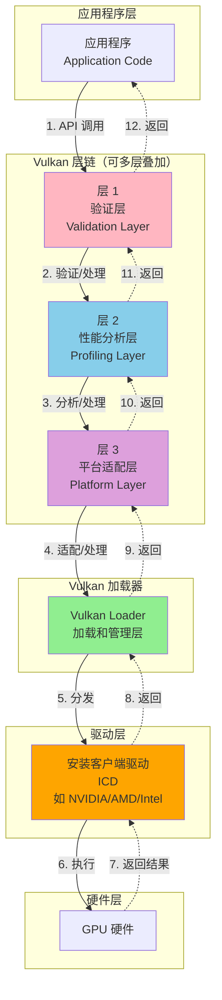
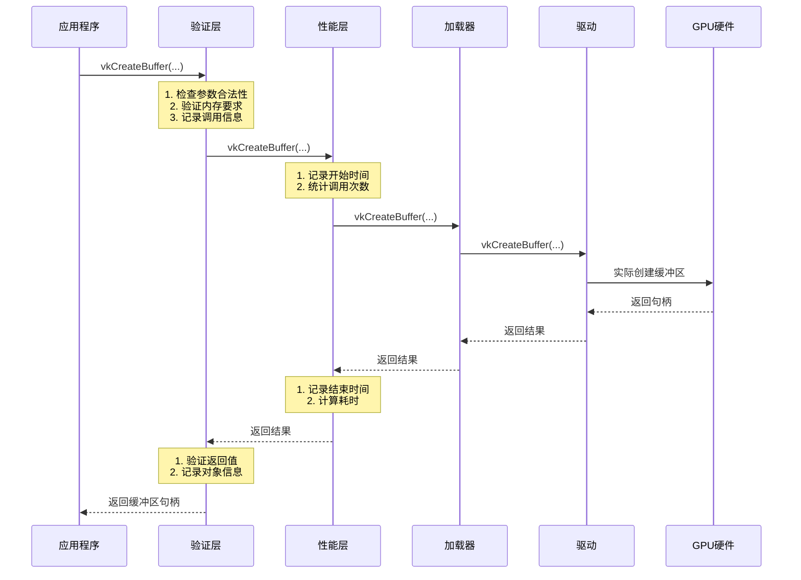
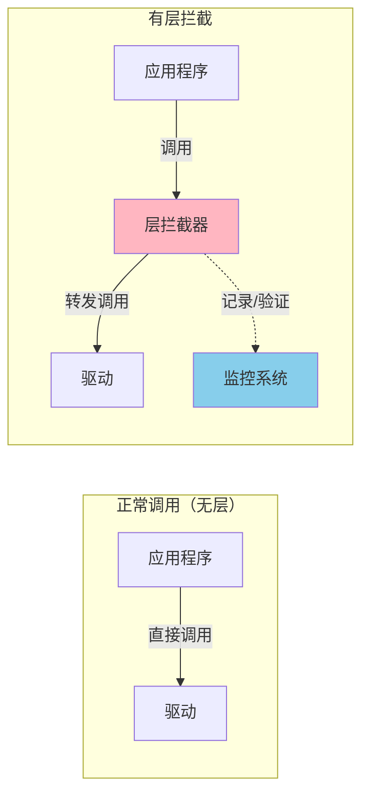
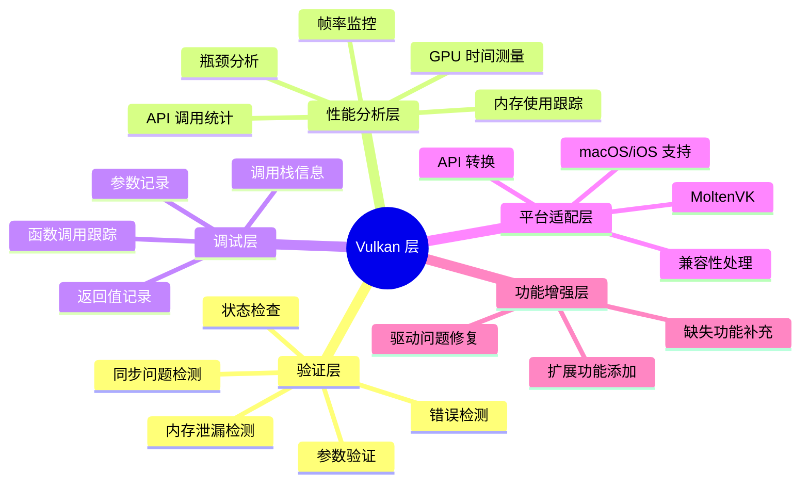
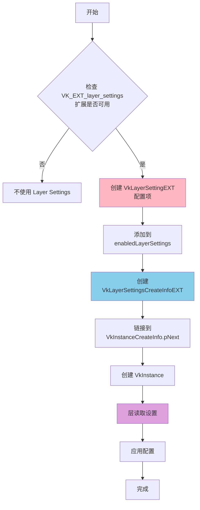
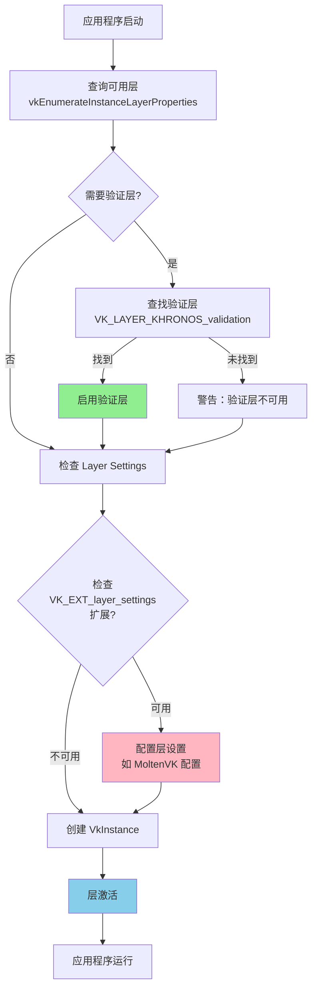
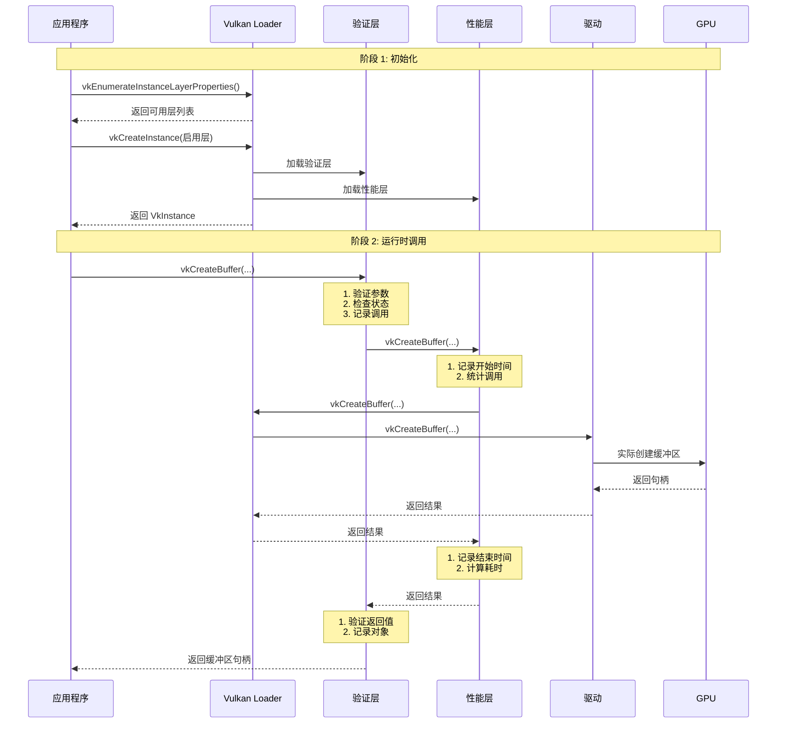
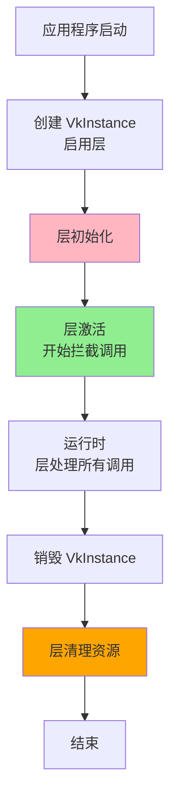
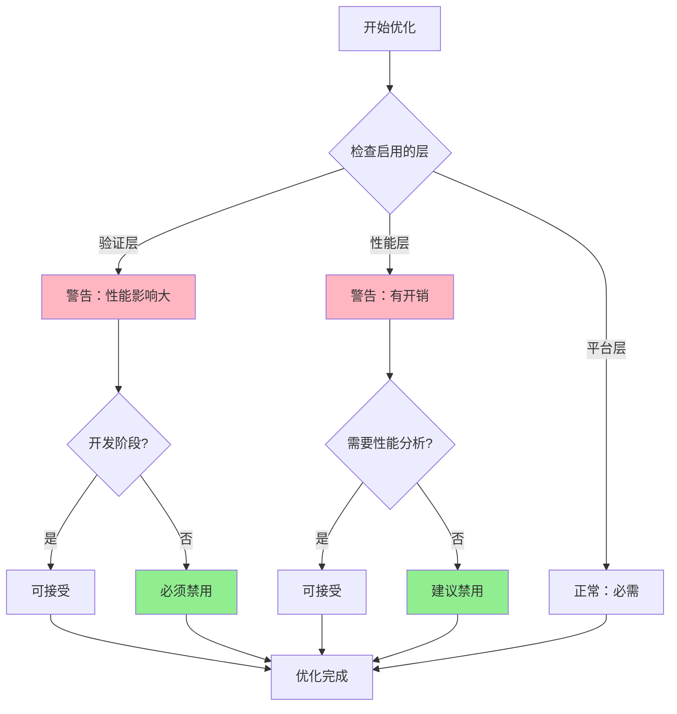
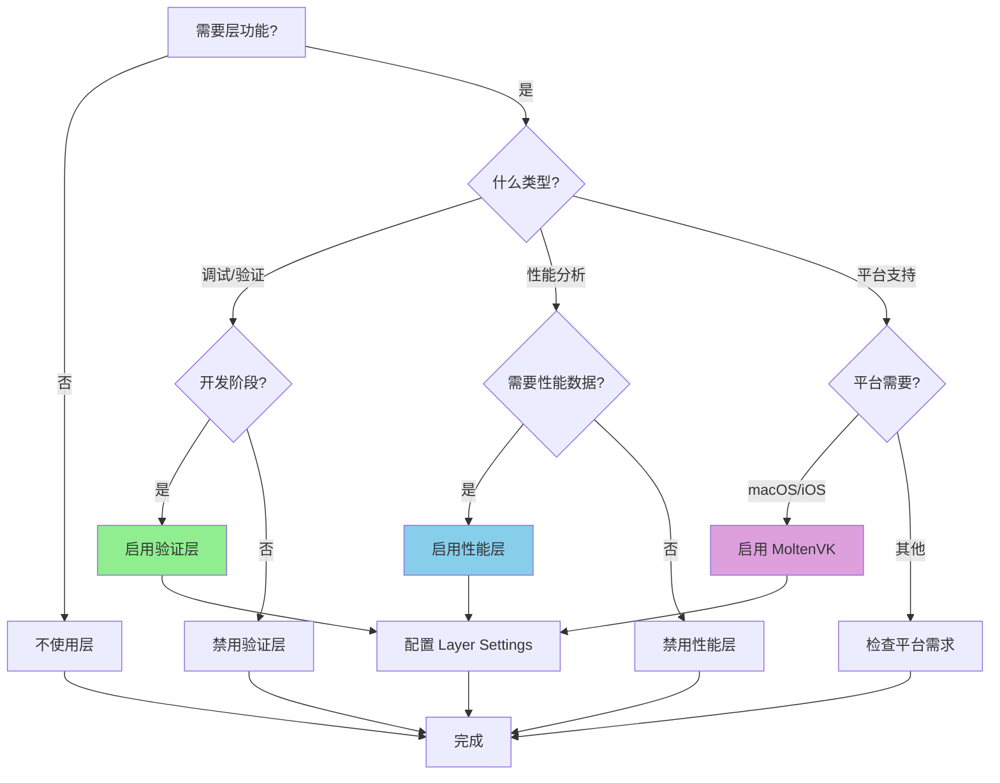

# Vulkan 层（Layer）完整详解

## 目录
1. [层（Layer）概述](#层layer概述)
2. [层的形象比喻](#层的形象比喻)
3. [层的架构与工作原理](#层的架构与工作原理)
4. [层的类型与分类](#层的类型与分类)
5. [层设置（Layer Settings）详解](#层设置layer-settings详解)
6. [层在工程中的实际应用](#层在工程中的实际应用)
7. [层的工作流程](#层的工作流程)
8. [常见层介绍](#常见层介绍)
9. [最佳实践与注意事项](#最佳实践与注意事项)

---

## 层（Layer）概述

### 什么是 Vulkan 层？

**Vulkan 层（Layer）**是插入在应用程序和 Vulkan 驱动程序之间的中间件系统。它可以在不修改应用程序代码的情况下，拦截、检查、修改或增强 Vulkan API 调用。

### 层的核心特点

- **透明性**：应用程序无需知道层的存在，API 调用会自动经过层
- **可组合性**：可以同时启用多个层，形成调用链
- **可配置性**：可以通过 Layer Settings 配置层的行为
- **可选性**：层的启用是可选的，不影响正常功能

---

## 层的形象比喻

### 比喻一：安检系统

想象你进入一个重要的建筑物：

```
┌─────────────────────────────────────────────────────────┐
│                    应用程序（你）                        │
│                  "我要创建缓冲区"                        │
└──────────────────────┬──────────────────────────────────┘
                       │
                       ▼
┌─────────────────────────────────────────────────────────┐
│              验证层（安检人员）                          │
│  ✓ 检查你的请求是否合法                                 │
│  ✓ 检查参数是否正确                                     │
│  ✓ 记录你的行为                                         │
│  ✓ 发现问题立即报告                                     │
└──────────────────────┬──────────────────────────────────┘
                       │
                       ▼
┌─────────────────────────────────────────────────────────┐
│              性能分析层（监控摄像头）                    │
│  ✓ 记录你的进入时间                                     │
│  ✓ 统计你的停留时间                                     │
│  ✓ 分析你的行为模式                                     │
└──────────────────────┬──────────────────────────────────┘
                       │
                       ▼
┌─────────────────────────────────────────────────────────┐
│              驱动层（实际执行者）                        │
│              真正创建缓冲区                              │
└─────────────────────────────────────────────────────────┘
```

### 比喻二：快递配送系统

```
┌─────────────────────────────────────────────────────────┐
│              应用程序（寄件人）                          │
│            "我要发送这个包裹"                            │
└──────────────────────┬──────────────────────────────────┘
                       │
                       ▼
┌─────────────────────────────────────────────────────────┐
│              验证层（包装检查员）                        │
│  ✓ 检查包裹是否符合规范                                 │
│  ✓ 检查地址是否正确                                     │
│  ✓ 检查物品是否违禁                                     │
└──────────────────────┬──────────────────────────────────┘
                       │
                       ▼
┌─────────────────────────────────────────────────────────┐
│              平台适配层（中转站）                        │
│  ✓ 根据目的地选择路线                                   │
│  ✓ 转换包装格式（如 MoltenVK 转换格式）                │
└──────────────────────┬──────────────────────────────────┘
                       │
                       ▼
┌─────────────────────────────────────────────────────────┐
│              驱动层（快递员）                            │
│              真正配送包裹                                │
└─────────────────────────────────────────────────────────┘
```

### 比喻三：餐厅服务系统

```
┌─────────────────────────────────────────────────────────┐
│              应用程序（顾客）                            │
│            "我要点一份牛排"                              │
└──────────────────────┬──────────────────────────────────┘
                       │
                       ▼
┌─────────────────────────────────────────────────────────┐
│              验证层（服务员）                            │
│  ✓ 检查订单是否合理（牛排要几分熟？）                   │
│  ✓ 检查是否有过敏食材                                   │
│  ✓ 记录订单信息                                         │
└──────────────────────┬──────────────────────────────────┘
                       │
                       ▼
┌─────────────────────────────────────────────────────────┐
│              性能分析层（计时器）                        │
│  ✓ 记录下单时间                                         │
│  ✓ 记录上菜时间                                         │
│  ✓ 计算服务效率                                         │
└──────────────────────┬──────────────────────────────────┘
                       │
                       ▼
┌─────────────────────────────────────────────────────────┐
│              驱动层（厨房）                              │
│              真正制作牛排                                │
└─────────────────────────────────────────────────────────┘
```

---

## 层的架构与工作原理

### 层的调用链架构



### 层的工作流程详解



### 层的拦截机制



---

## 层的类型与分类

### 层的功能分类



### 主要层类型详解

#### 1. 验证层（Validation Layer）

**作用**：检查应用程序对 Vulkan API 的使用是否符合规范

**功能**：
- ✓ 参数验证：检查函数参数是否合法
- ✓ 状态验证：检查对象状态是否正确
- ✓ 资源追踪：跟踪资源创建和销毁
- ✓ 同步验证：检查同步原语使用是否正确
- ✓ 内存验证：检测内存泄漏和越界访问

**形象比喻**：就像一位严格的老师，检查你的作业是否符合规范

```
┌─────────────────────────────────────────┐
│        应用程序调用 vkCreateBuffer      │
└──────────────────┬──────────────────────┘
                   │
                   ▼
┌─────────────────────────────────────────┐
│           验证层检查                     │
│  ✓ size 是否 > 0？                      │
│  ✓ usage 标志是否合法？                 │
│  ✓ 内存类型是否支持？                   │
│  ✓ 设备是否支持此操作？                 │
└──────────────────┬──────────────────────┘
                   │
         ┌─────────┴─────────┐
         │                   │
         ▼                   ▼
    ┌─────────┐        ┌─────────┐
    │  通过    │        │  失败    │
    │ 继续执行  │        │ 报告错误 │
    └─────────┘        └─────────┘
```

#### 2. 性能分析层（Profiling Layer）

**作用**：收集性能数据，帮助优化应用程序

**功能**：
- ✓ API 调用计数
- ✓ 函数执行时间统计
- ✓ GPU 使用率监控
- ✓ 内存分配统计
- ✓ 帧率分析

**形象比喻**：就像运动手环，记录你的运动数据

```
┌─────────────────────────────────────────┐
│        应用程序执行渲染循环              │
└──────────────────┬──────────────────────┘
                   │
                   ▼
┌─────────────────────────────────────────┐
│        性能分析层记录                    │
│  ⏱️ 开始时间：10:00:00.000               │
│  📊 调用次数：vkDrawIndexed(1000次)      │
│  💾 内存分配：256 MB                     │
│  ⏱️ 结束时间：10:00:00.016               │
│  📈 总耗时：16 ms                        │
└─────────────────────────────────────────┘
```

#### 3. 平台适配层（Platform Adaptation Layer）

**作用**：在不同平台上提供 Vulkan 支持

**典型例子**：MoltenVK（macOS/iOS）

**功能**：
- ✓ 将 Vulkan API 转换为 Metal API
- ✓ 处理平台特定的差异
- ✓ 提供兼容性支持

**形象比喻**：就像翻译官，将 Vulkan 语言翻译成 Metal 语言

```
┌─────────────────────────────────────────┐
│      Vulkan 应用程序（说 Vulkan 语）     │
│      "vkCreateBuffer(...)"              │
└──────────────────┬──────────────────────┘
                   │
                   ▼
┌─────────────────────────────────────────┐
│         MoltenVK 层（翻译官）            │
│      Vulkan → Metal 转换                 │
│      "vkCreateBuffer" →                 │
│      "newBufferWithLength:options:"     │
└──────────────────┬──────────────────────┘
                   │
                   ▼
┌─────────────────────────────────────────┐
│      Metal 驱动（说 Metal 语）           │
│      真正执行操作                        │
└─────────────────────────────────────────┘
```

---

## 层设置（Layer Settings）详解

### Layer Settings 的概念

**Layer Settings** 是 Vulkan 1.3.268 引入的 `VK_EXT_layer_settings` 扩展提供的机制，允许在创建 VkInstance 时直接配置层的行为，而不需要依赖外部配置文件。

### Layer Settings 的形象比喻

想象你要定制一辆汽车：

```
┌─────────────────────────────────────────┐
│         你（应用程序）                   │
│     "我要一辆车，配置如下："             │
│     - 引擎：V8                          │
│     - 颜色：红色                        │
│     - 座椅：真皮                        │
└──────────────────┬──────────────────────┘
                   │
                   ▼
┌─────────────────────────────────────────┐
│      Layer Settings（配置单）            │
│      ✓ 记录你的配置要求                  │
│      ✓ 传递给相应的层                    │
└──────────────────┬──────────────────────┘
                   │
                   ▼
┌─────────────────────────────────────────┐
│      层（工厂）                          │
│      ✓ 读取配置单                        │
│      ✓ 按照要求生产                      │
└─────────────────────────────────────────┘
```

### Layer Settings 的配置流程



### Layer Settings 的典型应用场景

#### 场景一：启用验证层的 printf 功能

```
┌─────────────────────────────────────────┐
│     应用程序配置                        │
│     Layer Setting:                      │
│     - Layer: Validation                 │
│     - Setting: enables                  │
│     - Value: DEBUG_PRINTF               │
└──────────────────┬──────────────────────┘
                   │
                   ▼
┌─────────────────────────────────────────┐
│     验证层读取配置                      │
│     "好的，我启用 printf 功能"          │
└──────────────────┬──────────────────────┘
                   │
                   ▼
┌─────────────────────────────────────────┐
│     着色器中的 printf 现在可以工作       │
│     debugPrintfEXT("值 = %d", value);   │
└─────────────────────────────────────────┘
```

#### 场景二：配置 MoltenVK 使用专用队列

```
┌─────────────────────────────────────────┐
│     应用程序配置                        │
│     Layer Setting:                      │
│     - Layer: MoltenVK                   │
│     - Setting: SPECIALIZED_QUEUE        │
│     - Value: true                       │
└──────────────────┬──────────────────────┘
                   │
                   ▼
┌─────────────────────────────────────────┐
│     MoltenVK 层读取配置                 │
│     "好的，我创建专用队列族"            │
└──────────────────┬──────────────────────┘
                   │
                   ▼
┌─────────────────────────────────────────┐
│     现在有独立的图形队列和计算队列       │
│     性能更好！                          │
└─────────────────────────────────────────┘
```

---

## 层在工程中的实际应用

### 工程中的层使用流程



### 工程中的层配置示例

#### 验证层的启用

```
应用程序
  │
  ├─→ 查询系统可用层
  │   vkEnumerateInstanceLayerProperties()
  │
  ├─→ 查找 "VK_LAYER_KHRONOS_validation"
  │
  ├─→ 找到？→ 启用验证层
  │   └─→ 添加到 ppEnabledLayerNames
  │
  └─→ 未找到？→ 输出警告
      └─→ 继续运行（无验证）
```

#### Layer Settings 的配置（MoltenVK 示例）

```
应用程序（macOS/iOS）
  │
  ├─→ 检查 VK_EXT_layer_settings 扩展
  │
  ├─→ 可用？
  │   │
  │   ├─→ 创建 VkLayerSettingEXT
  │   │   - pLayerName: "MoltenVK"
  │   │   - pSettingName: "MVK_CONFIG_SPECIALIZED_QUEUE_FAMILIES"
  │   │   - type: BOOL32
  │   │   - value: true
  │   │
  │   ├─→ 添加到 enabledLayerSettings
  │   │
  │   └─→ 链接到 VkInstanceCreateInfo.pNext
  │
  └─→ 创建 VkInstance
      └─→ MoltenVK 层读取配置并应用
```

---

## 层的工作流程

### 完整的层调用流程



### 层的生命周期管理



### 层的调用顺序

```
┌─────────────────────────────────────────────────────────┐
│              调用顺序（从上到下）                        │
├─────────────────────────────────────────────────────────┤
│  1. 应用程序调用 API                                    │
│     ↓                                                   │
│  2. 第一层（验证层）拦截                                │
│     - 验证参数                                          │
│     - 检查状态                                          │
│     ↓                                                   │
│  3. 第二层（性能层）拦截                                │
│     - 记录时间                                          │
│     - 统计调用                                          │
│     ↓                                                   │
│  4. 第三层（平台层）拦截                                │
│     - 转换 API                                          │
│     - 适配平台                                          │
│     ↓                                                   │
│  5. Vulkan Loader 分发                                 │
│     ↓                                                   │
│  6. 驱动执行                                            │
│     ↓                                                   │
│  7. GPU 硬件执行                                        │
│     ↓                                                   │
│  8. 结果返回（逆序经过各层）                            │
└─────────────────────────────────────────────────────────┘
```

---

## 常见层介绍

### 1. VK_LAYER_KHRONOS_validation（验证层）

**官方名称**：Khronos Validation Layer

**作用**：Vulkan 官方提供的标准验证层，用于检查 API 使用错误

**主要功能**：

```
┌─────────────────────────────────────────────────────────┐
│           验证层功能模块                                 │
├─────────────────────────────────────────────────────────┤
│  ✓ 参数验证                                             │
│    - 检查函数参数是否合法                                │
│    - 检查枚举值是否有效                                  │
│    - 检查指针是否有效                                    │
│                                                          │
│  ✓ 对象生命周期管理                                     │
│    - 跟踪对象创建和销毁                                  │
│    - 检测使用已销毁对象                                  │
│    - 检测对象泄漏                                        │
│                                                          │
│  ✓ 状态验证                                             │
│    - 检查命令缓冲区状态                                  │
│    - 检查管线状态                                        │
│    - 检查同步状态                                        │
│                                                          │
│  ✓ 内存验证                                             │
│    - 检测内存泄漏                                        │
│    - 检测越界访问                                        │
│    - 检测未初始化内存                                    │
│                                                          │
│  ✓ 同步验证                                             │
│    - 检查信号量使用                                      │
│    - 检查栅栏使用                                        │
│    - 检查事件使用                                        │
│                                                          │
│  ✓ 线程安全验证                                         │
│    - 检查多线程调用                                      │
│    - 检查对象所有权                                      │
└─────────────────────────────────────────────────────────┘
```

**使用场景**：
- 开发阶段：必须启用
- 调试阶段：必须启用
- 测试阶段：建议启用
- 发布版本：必须禁用（性能影响）

**性能影响**：
- 开发模式：可接受（帮助发现错误）
- 发布模式：不可接受（可能降低 50%+ 性能）

### 2. MoltenVK（平台适配层）

**官方名称**：MoltenVK

**作用**：在 macOS 和 iOS 上提供 Vulkan 支持，将 Vulkan API 转换为 Metal API

**工作原理**：

```
┌─────────────────────────────────────────────────────────┐
│      Vulkan API 调用                                    │
│      vkCreateBuffer(...)                               │
└──────────────────┬──────────────────────────────────────┘
                   │
                   ▼
┌─────────────────────────────────────────────────────────┐
│      MoltenVK 层转换                                     │
│      ┌──────────────────────────────────────┐           │
│      │ Vulkan 概念 → Metal 概念             │           │
│      │ Buffer → MTLBuffer                   │           │
│      │ Image → MTLTexture                   │           │
│      │ CommandBuffer → MTLCommandBuffer      │           │
│      │ Queue → MTLCommandQueue              │           │
│      └──────────────────────────────────────┘           │
└──────────────────┬──────────────────────────────────────┘
                   │
                   ▼
┌─────────────────────────────────────────────────────────┐
│      Metal API 调用                                      │
│      newBufferWithLength:options:                       │
└─────────────────────────────────────────────────────────┘
```

**配置选项**（通过 Layer Settings）：
- `MVK_CONFIG_SPECIALIZED_QUEUE_FAMILIES`：启用专用队列族
- `MVK_CONFIG_SYNCHRONOUS_QUEUE_SUBMITS`：同步队列提交
- `MVK_CONFIG_USE_METAL_ARGUMENT_BUFFERS`：使用 Metal 参数缓冲区

### 3. RenderDoc（调试层）

**官方名称**：RenderDoc Layer

**作用**：图形调试工具，可以捕获帧、检查渲染状态、分析性能

**主要功能**：
- 帧捕获：捕获完整的渲染帧
- 状态检查：检查所有渲染状态
- 资源查看：查看纹理、缓冲区等资源
- 性能分析：分析 GPU 性能

**使用方式**：
- 通过 RenderDoc 工具启用
- 或通过环境变量启用

### 4. VK_LAYER_LUNARG_monitor（性能监控层）

**作用**：监控 Vulkan 应用程序的性能指标

**功能**：
- API 调用计数
- 函数执行时间
- 内存使用统计
- 帧率监控

### 5. VK_LAYER_LUNARG_api_dump（API 转储层）

**作用**：记录所有 Vulkan API 调用及其参数

**功能**：
- 记录所有函数调用
- 记录函数参数
- 记录返回值
- 生成日志文件

**使用场景**：
- API 调用调试
- 问题复现
- 学习 Vulkan API

---

## 最佳实践与注意事项

### 开发阶段的最佳实践

```
┌─────────────────────────────────────────────────────────┐
│           开发阶段层使用策略                              │
├─────────────────────────────────────────────────────────┤
│  1. 始终启用验证层                                       │
│     ✓ 帮助发现错误                                       │
│     ✓ 提供详细错误信息                                   │
│     ✓ 检测资源泄漏                                       │
│                                                          │
│  2. 根据需要启用性能分析层                               │
│     ✓ 性能优化时启用                                     │
│     ✓ 瓶颈分析时启用                                     │
│                                                          │
│  3. 使用 Layer Settings 配置层                           │
│     ✓ 启用验证层的特定功能                               │
│     ✓ 配置平台层的行为                                   │
│                                                          │
│  4. 定期检查层输出                                       │
│     ✓ 查看验证层警告                                     │
│     ✓ 分析性能数据                                       │
└─────────────────────────────────────────────────────────┘
```

### 发布阶段的最佳实践

```
┌─────────────────────────────────────────────────────────┐
│           发布阶段层使用策略                              │
├─────────────────────────────────────────────────────────┤
│  1. 禁用所有验证层                                       │
│     ✗ 性能影响大                                        │
│     ✗ 用户不需要                                        │
│                                                          │
│  2. 禁用性能分析层                                       │
│     ✗ 性能开销                                          │
│                                                          │
│  3. 保留必要的平台适配层                                 │
│     ✓ MoltenVK（macOS/iOS 必需）                        │
│     ✓ 其他平台适配层                                     │
│                                                          │
│  4. 使用条件编译                                         │
│     ✓ #ifdef DEBUG 启用验证层                            │
│     ✓ #ifdef RELEASE 禁用验证层                          │
└─────────────────────────────────────────────────────────┘
```

### 常见错误与解决方案

#### 错误 1：验证层未找到

**问题**：
```
Validation layer VK_LAYER_KHRONOS_validation not present
```

**原因**：
- Vulkan SDK 未安装
- 验证层未正确安装
- 路径配置错误

**解决方案**：
1. 安装 Vulkan SDK
2. 检查环境变量配置
3. 验证层文件是否存在

#### 错误 2：层设置未生效

**问题**：Layer Settings 配置了但没有效果

**原因**：
- 未启用 `VK_EXT_layer_settings` 扩展
- 设置名称拼写错误
- 层名称不正确

**解决方案**：
1. 确保启用了扩展
2. 检查设置名称拼写
3. 验证层是否支持该设置

#### 错误 3：性能下降

**问题**：启用层后性能明显下降

**原因**：
- 验证层开销大
- 性能分析层开销
- 多层叠加导致开销累积

**解决方案**：
1. 发布版本禁用验证层
2. 仅启用必要的层
3. 使用条件编译控制

### 性能优化建议



### 层选择决策树



---

## 总结

### 层的核心价值

```
┌─────────────────────────────────────────────────────────┐
│           层的核心价值                                    │
├─────────────────────────────────────────────────────────┤
│  1. 开发辅助                                             │
│     ✓ 验证 API 使用                                      │
│     ✓ 发现错误和问题                                     │
│     ✓ 提供调试信息                                       │
│                                                          │
│  2. 性能分析                                             │
│     ✓ 收集性能数据                                       │
│     ✓ 识别性能瓶颈                                       │
│     ✓ 优化应用程序                                       │
│                                                          │
│  3. 平台兼容                                             │
│     ✓ 提供跨平台支持                                     │
│     ✓ 适配不同平台                                       │
│     ✓ 转换 API 调用                                      │
│                                                          │
│  4. 功能增强                                             │
│     ✓ 添加额外功能                                       │
│     ✓ 修复驱动问题                                       │
│     ✓ 提供扩展能力                                       │
└─────────────────────────────────────────────────────────┘
```

### 关键要点

1. **层是中间件**：插入在应用程序和驱动之间，透明地处理 API 调用
2. **可组合使用**：可以同时启用多个层，形成调用链
3. **可配置**：通过 Layer Settings 可以配置层的行为
4. **开发必需**：验证层在开发阶段是必需的
5. **发布禁用**：验证层在发布版本必须禁用
6. **平台适配**：某些平台（如 macOS）需要平台适配层

### 学习路径建议

```
┌─────────────────────────────────────────────────────────┐
│           学习路径                                        │
├─────────────────────────────────────────────────────────┤
│  阶段 1: 基础理解                                        │
│    → 理解层的概念和作用                                  │
│    → 了解层的类型                                        │
│                                                          │
│  阶段 2: 实践使用                                        │
│    → 启用验证层进行开发                                  │
│    → 学习 Layer Settings 配置                           │
│                                                          │
│  阶段 3: 深入理解                                        │
│    → 理解层的工作原理                                    │
│    → 学习如何选择和使用层                                │
│                                                          │
│  阶段 4: 优化实践                                        │
│    → 性能优化                                            │
│    → 最佳实践应用                                        │
└─────────────────────────────────────────────────────────┘
```

---

**文档版本**：1.0  
**最后更新**：2025年  
**参考来源**：Vulkan 官方规范、工程代码实践