# Vulkan 层架构设计

## 目录
1. [层概述](#层概述)
2. [层的架构设计](#层的架构设计)
3. [层的类型与分类](#层的类型与分类)
4. [层的加载机制](#层的加载机制)
5. [验证层详解](#验证层详解)
6. [层的配置与管理](#层的配置与管理)
7. [层的实现原理](#层的实现原理)
8. [层与扩展的关系](#层与扩展的关系)
9. [性能影响分析](#性能影响分析)
10. [最佳实践](#最佳实践)

---

## 层概述

### 什么是 Vulkan 层？

**Vulkan 层（Layers）**是插入在应用程序和 Vulkan 驱动程序之间的中间件，用于：
- **调试和验证**：检查 API 使用错误
- **性能分析**：监控和记录性能数据
- **API 拦截**：拦截和修改 API 调用
- **功能增强**：添加额外功能或修复驱动问题
- **兼容性**：提供向后兼容或平台适配

### 层的作用

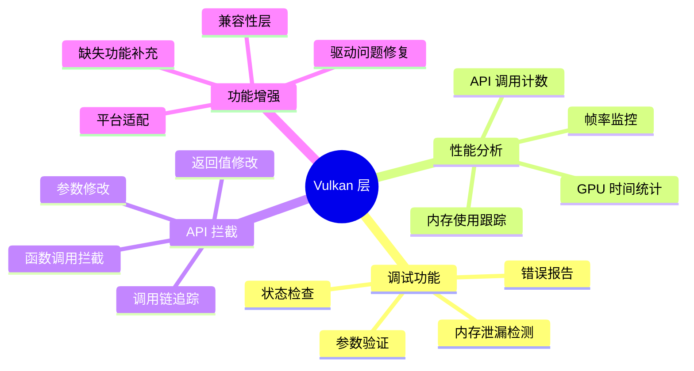

### 层在 Vulkan 架构中的位置

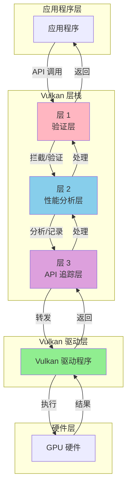

### 层与扩展的区别

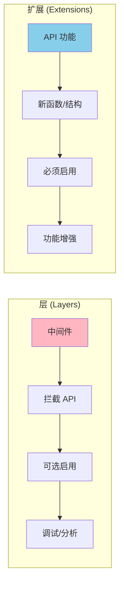

| 特性 | 层 (Layers) | 扩展 (Extensions) |
|------|------------|-------------------|
| **作用** | 中间件，拦截和验证 | API 功能，添加新特性 |
| **位置** | 应用程序和驱动之间 | API 的一部分 |
| **启用方式** | 可选，开发时启用 | 必须显式启用 |
| **性能影响** | 可能有较大影响 | 通常无影响 |
| **主要用途** | 调试、验证、分析 | 功能扩展 |

---

## 层的架构设计

### 整体架构

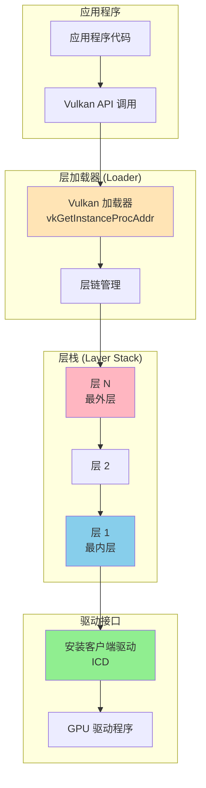

### 层链机制

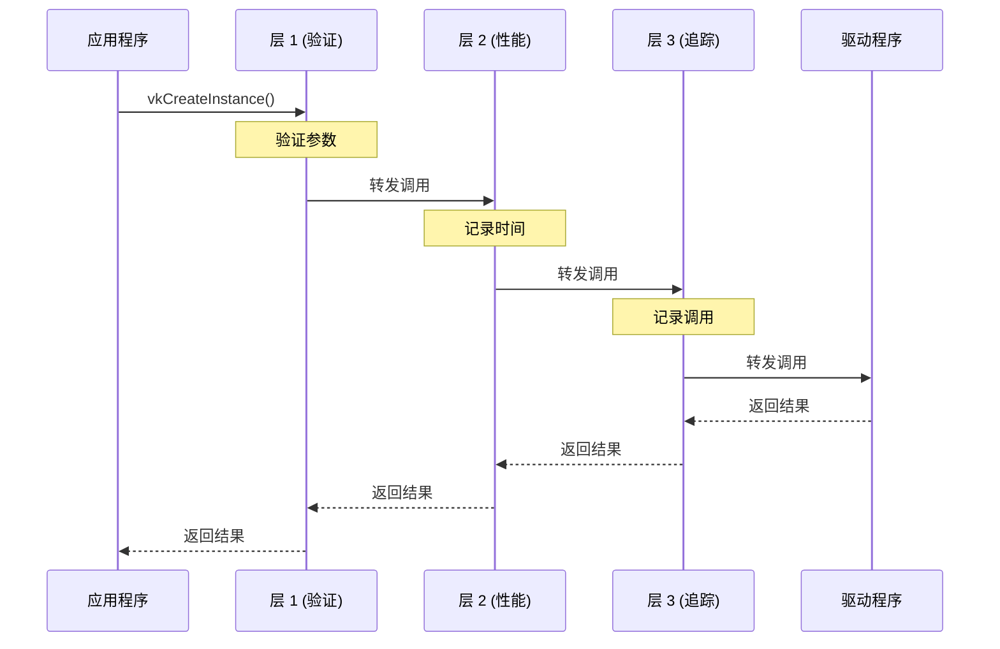

### 层的调用链

```cpp
// 层的调用链实现原理（简化示例）
typedef VkResult (VKAPI_PTR *PFN_vkCreateInstance)(
    const VkInstanceCreateInfo* pCreateInfo,
    const VkAllocationCallbacks* pAllocator,
    VkInstance* pInstance
);

// 层函数实现
VkResult VKAPI_CALL Layer_vkCreateInstance(
    const VkInstanceCreateInfo* pCreateInfo,
    const VkAllocationCallbacks* pAllocator,
    VkInstance* pInstance
) {
    // 1. 层的预处理
    validateCreateInstance(pCreateInfo);
    
    // 2. 调用下一层（或驱动）
    PFN_vkCreateInstance nextFunc = getNextFunction("vkCreateInstance");
    VkResult result = nextFunc(pCreateInfo, pAllocator, pInstance);
    
    // 3. 层的后处理
    if (result == VK_SUCCESS) {
        trackInstance(*pInstance);
    }
    
    return result;
}
```

---

## 层的类型与分类

### 按作用域分类

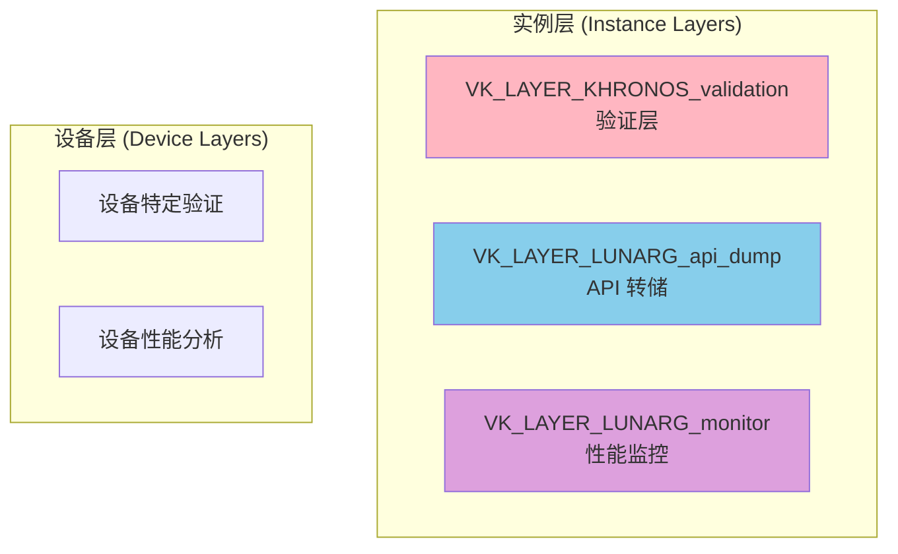

#### 1. 实例层 (Instance Layers)

在实例级别工作的层，影响所有设备：

```cpp
// 实例层在创建实例时启用
VkInstanceCreateInfo createInfo{};
createInfo.enabledLayerCount = 1;
const char* layers[] = {"VK_LAYER_KHRONOS_validation"};
createInfo.ppEnabledLayerNames = layers;
vkCreateInstance(&createInfo, nullptr, &instance);
```

**特点**：
- 在 `vkCreateInstance` 时启用
- 影响所有物理设备和逻辑设备
- 可以拦截实例级别的 API 调用

#### 2. 设备层 (Device Layers)

在设备级别工作的层，影响特定设备：

```cpp
// 设备层在创建设备时启用
VkDeviceCreateInfo deviceInfo{};
deviceInfo.enabledLayerCount = 1;
const char* deviceLayers[] = {"VK_LAYER_LUNARG_device_simulation"};
deviceInfo.ppEnabledLayerNames = deviceLayers;
vkCreateDevice(physicalDevice, &deviceInfo, nullptr, &device);
```

**注意**：现代 Vulkan 实现中，设备层已被弃用，所有层都在实例级别工作。

### 按功能分类

#### 1. 验证层 (Validation Layers)

用于检查 API 使用错误：

```cpp
const char* validationLayers[] = {
    "VK_LAYER_KHRONOS_validation"  // 现代统一验证层
};
```

**功能**：
- 参数验证
- 对象生命周期检查
- 内存泄漏检测
- 线程安全检查
- 性能警告

#### 2. 性能分析层 (Profiling Layers)

用于性能分析和监控：

```cpp
const char* profilingLayers[] = {
    "VK_LAYER_LUNARG_monitor",      // 性能监控
    "VK_LAYER_LUNARG_screenshot"    // 截图功能
};
```

**功能**：
- GPU 时间统计
- 帧率监控
- 内存使用跟踪
- API 调用计数

#### 3. API 追踪层 (API Tracing Layers)

用于记录 API 调用：

```cpp
const char* tracingLayers[] = {
    "VK_LAYER_LUNARG_api_dump",     // API 转储
    "VK_LAYER_LUNARG_vktrace"       // Vktrace 追踪
};
```

**功能**：
- 记录所有 API 调用
- 生成追踪文件
- 回放 API 调用序列

#### 4. 兼容性层 (Compatibility Layers)

提供兼容性或功能增强：

```cpp
const char* compatibilityLayers[] = {
    "VK_LAYER_LUNARG_device_simulation"  // 设备模拟
};
```

---

## 层的加载机制

### 层发现机制

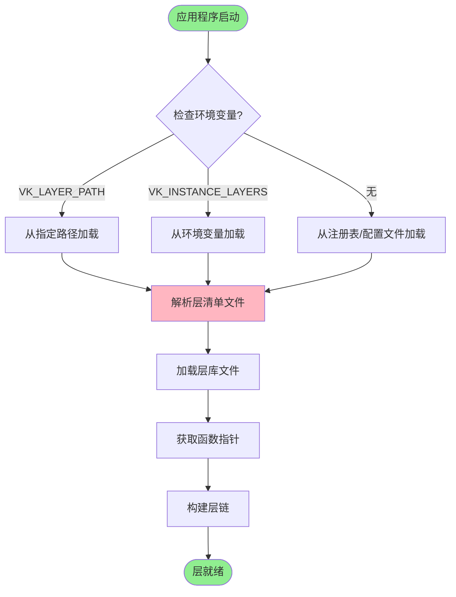

### 层清单文件 (Layer Manifest)

```json
{
    "file_format_version": "1.2.0",
    "layer": {
        "name": "VK_LAYER_KHRONOS_validation",
        "type": "GLOBAL",
        "library_path": ".\\VkLayer_khronos_validation.dll",
        "api_version": "1.3.0",
        "implementation_version": "1",
        "description": "Khronos Validation Layer",
        "functions": {
            "vkGetInstanceProcAddr": "ValidationLayer_vkGetInstanceProcAddr",
            "vkGetDeviceProcAddr": "ValidationLayer_vkGetDeviceProcAddr"
        },
        "enable_environment": {
            "VK_LAYER_KHRONOS_validation": "1"
        },
        "disable_environment": {
            "VK_LAYER_KHRONOS_validation": "0"
        }
    }
}
```

### 层加载代码

```cpp
// 1. 枚举可用层
uint32_t layerCount;
vkEnumerateInstanceLayerProperties(&layerCount, nullptr);

std::vector<VkLayerProperties> availableLayers(layerCount);
vkEnumerateInstanceLayerProperties(&layerCount, availableLayers.data());

// 2. 检查层是否可用
bool isLayerAvailable(const char* layerName) {
    for (const auto& layer : availableLayers) {
        if (strcmp(layer.layerName, layerName) == 0) {
            return true;
        }
    }
    return false;
}

// 3. 启用层
std::vector<const char*> enabledLayers;
if (isLayerAvailable("VK_LAYER_KHRONOS_validation")) {
    enabledLayers.push_back("VK_LAYER_KHRONOS_validation");
}

VkInstanceCreateInfo createInfo{};
createInfo.enabledLayerCount = enabledLayers.size();
createInfo.ppEnabledLayerNames = enabledLayers.data();
```

### 环境变量配置

#### Windows

```batch
REM 启用验证层
set VK_LAYER_KHRONOS_validation=1

REM 设置层路径
set VK_LAYER_PATH=C:\VulkanSDK\Bin
```

#### Linux

```bash
# 启用验证层
export VK_LAYER_KHRONOS_validation=1

# 设置层路径
export VK_LAYER_PATH=/usr/share/vulkan/explicit_layer.d
```

#### 配置文件方式

**Windows**: `%APPDATA%\Vulkan\config\vk_layer_settings.txt`

**Linux**: `~/.config/vulkan/settings.d/vk_layer_settings.txt`

```ini
# 验证层设置
khronos_validation.enable = true
khronos_validation.log_filename = validation.log
khronos_validation.debug_action = VK_DBG_LAYER_ACTION_LOG_MSG
```

---

## 验证层详解

### Khronos 验证层

现代 Vulkan 使用统一的 `VK_LAYER_KHRONOS_validation` 层，它整合了所有验证功能。

#### 验证层功能

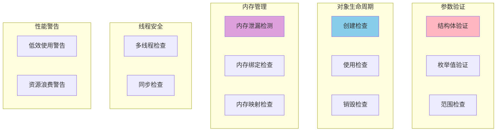

### 验证层配置

```cpp
// 验证层设置结构
VkValidationFeaturesEXT validationFeatures{};
validationFeatures.sType = VK_STRUCTURE_TYPE_VALIDATION_FEATURES_EXT;
validationFeatures.enabledValidationFeatureCount = 2;
VkValidationFeatureEnableEXT enabledFeatures[] = {
    VK_VALIDATION_FEATURE_ENABLE_GPU_ASSISTED_EXT,
    VK_VALIDATION_FEATURE_ENABLE_GPU_ASSISTED_RESERVE_BINDING_SLOT_EXT
};
validationFeatures.pEnabledValidationFeatures = enabledFeatures;

VkInstanceCreateInfo createInfo{};
createInfo.pNext = &validationFeatures;
```

### 调试回调设置

```cpp
VkDebugUtilsMessengerCreateInfoEXT debugCreateInfo{};
debugCreateInfo.sType = VK_STRUCTURE_TYPE_DEBUG_UTILS_MESSENGER_CREATE_INFO_EXT;
debugCreateInfo.messageSeverity = 
    VK_DEBUG_UTILS_MESSAGE_SEVERITY_VERBOSE_BIT_EXT |
    VK_DEBUG_UTILS_MESSAGE_SEVERITY_WARNING_BIT_EXT |
    VK_DEBUG_UTILS_MESSAGE_SEVERITY_ERROR_BIT_EXT;
debugCreateInfo.messageType = 
    VK_DEBUG_UTILS_MESSAGE_TYPE_GENERAL_BIT_EXT |
    VK_DEBUG_UTILS_MESSAGE_TYPE_VALIDATION_BIT_EXT |
    VK_DEBUG_UTILS_MESSAGE_TYPE_PERFORMANCE_BIT_EXT;
debugCreateInfo.pfnUserCallback = debugCallback;

VkInstanceCreateInfo createInfo{};
createInfo.pNext = &debugCreateInfo;
```

### 调试回调函数

```cpp
VKAPI_ATTR VkBool32 VKAPI_CALL debugCallback(
    VkDebugUtilsMessageSeverityFlagBitsEXT messageSeverity,
    VkDebugUtilsMessageTypeFlagsEXT messageType,
    const VkDebugUtilsMessengerCallbackDataEXT* pCallbackData,
    void* pUserData
) {
    // 过滤消息
    if (messageSeverity >= VK_DEBUG_UTILS_MESSAGE_SEVERITY_WARNING_BIT_EXT) {
        std::cerr << "Validation Layer: " << pCallbackData->pMessage << std::endl;
        
        // 可以在这里设置断点
        if (messageSeverity >= VK_DEBUG_UTILS_MESSAGE_SEVERITY_ERROR_BIT_EXT) {
            // 错误时中断
            // __debugbreak();
        }
    }
    
    return VK_FALSE;  // 返回 VK_TRUE 会中断调用
}
```

### 验证层消息类型

| 消息类型 | 说明 | 示例 |
|---------|------|------|
| **ERROR** | API 使用错误 | 无效句柄、参数错误 |
| **WARNING** | 潜在问题 | 性能问题、不推荐用法 |
| **INFO** | 信息性消息 | 对象创建、状态变化 |
| **VERBOSE** | 详细调试信息 | 所有 API 调用 |

---

## 层的配置与管理

### 层设置 API (VK_EXT_layer_settings)

Vulkan 1.3+ 提供了统一的层设置扩展：

```cpp
// 层设置结构
VkLayerSettingEXT layerSetting{};
layerSetting.pLayerName = "VK_LAYER_KHRONOS_validation";
layerSetting.pSettingName = "enables";
layerSetting.type = VK_LAYER_SETTING_TYPE_STRING_EXT;
layerSetting.valueCount = 1;
const char* settingValue = "VK_VALIDATION_FEATURE_ENABLE_GPU_ASSISTED_EXT";
layerSetting.pValues = &settingValue;

VkLayerSettingsCreateInfoEXT layerSettingsInfo{};
layerSettingsInfo.sType = VK_STRUCTURE_TYPE_LAYER_SETTINGS_CREATE_INFO_EXT;
layerSettingsInfo.settingCount = 1;
layerSettingsInfo.pSettings = &layerSetting;

VkInstanceCreateInfo createInfo{};
createInfo.pNext = &layerSettingsInfo;
```

### 常用验证层设置

```cpp
// 启用 GPU 辅助验证
VkLayerSettingEXT gpuAssisted{};
gpuAssisted.pLayerName = "VK_LAYER_KHRONOS_validation";
gpuAssisted.pSettingName = "enables";
gpuAssisted.type = VK_LAYER_SETTING_TYPE_STRING_EXT;
gpuAssisted.valueCount = 1;
const char* gpuAssistedValue = "VK_VALIDATION_FEATURE_ENABLE_GPU_ASSISTED_EXT";
gpuAssisted.pValues = &gpuAssistedValue;

// 设置调试动作
VkLayerSettingEXT debugAction{};
debugAction.pLayerName = "VK_LAYER_KHRONOS_validation";
debugAction.pSettingName = "debug_action";
debugAction.type = VK_LAYER_SETTING_TYPE_STRING_EXT;
debugAction.valueCount = 1;
const char* debugActionValue = "VK_DBG_LAYER_ACTION_LOG_MSG";
debugAction.pValues = &debugActionValue;
```

### 层管理器类

```cpp
class LayerManager {
private:
    std::vector<const char*> enabledLayers;
    std::vector<VkLayerSettingEXT> layerSettings;
    
public:
    // 检查层是否可用
    bool isLayerAvailable(const char* layerName) {
        uint32_t layerCount;
        vkEnumerateInstanceLayerProperties(&layerCount, nullptr);
        std::vector<VkLayerProperties> layers(layerCount);
        vkEnumerateInstanceLayerProperties(&layerCount, layers.data());
        
        for (const auto& layer : layers) {
            if (strcmp(layer.layerName, layerName) == 0) {
                return true;
            }
        }
        return false;
    }
    
    // 启用层
    void enableLayer(const char* layerName) {
        if (isLayerAvailable(layerName)) {
            enabledLayers.push_back(layerName);
        } else {
            std::cerr << "Layer not available: " << layerName << std::endl;
        }
    }
    
    // 配置层设置
    void configureLayerSetting(
        const char* layerName,
        const char* settingName,
        const char* value
    ) {
        VkLayerSettingEXT setting{};
        setting.pLayerName = layerName;
        setting.pSettingName = settingName;
        setting.type = VK_LAYER_SETTING_TYPE_STRING_EXT;
        setting.valueCount = 1;
        setting.pValues = &value;
        layerSettings.push_back(setting);
    }
    
    // 获取启用的层
    const std::vector<const char*>& getEnabledLayers() const {
        return enabledLayers;
    }
    
    // 获取层设置
    const std::vector<VkLayerSettingEXT>& getLayerSettings() const {
        return layerSettings;
    }
};

// 使用
LayerManager layerManager;
layerManager.enableLayer("VK_LAYER_KHRONOS_validation");
layerManager.configureLayerSetting(
    "VK_LAYER_KHRONOS_validation",
    "enables",
    "VK_VALIDATION_FEATURE_ENABLE_GPU_ASSISTED_EXT"
);

VkInstanceCreateInfo createInfo{};
createInfo.enabledLayerCount = layerManager.getEnabledLayers().size();
createInfo.ppEnabledLayerNames = layerManager.getEnabledLayers().data();
```

---

## 层的实现原理

### 层接口函数

每个层必须实现以下接口函数：

```cpp
// 1. 获取实例函数指针
PFN_vkGetInstanceProcAddr vkGetInstanceProcAddr;

// 2. 获取设备函数指针
PFN_vkGetDeviceProcAddr vkGetDeviceProcAddr;

// 3. 层创建/销毁钩子
PFN_vkCreateInstance vkCreateInstance;
PFN_vkDestroyInstance vkDestroyInstance;
PFN_vkCreateDevice vkCreateDevice;
PFN_vkDestroyDevice vkDestroyDevice;
```

### 层函数拦截机制

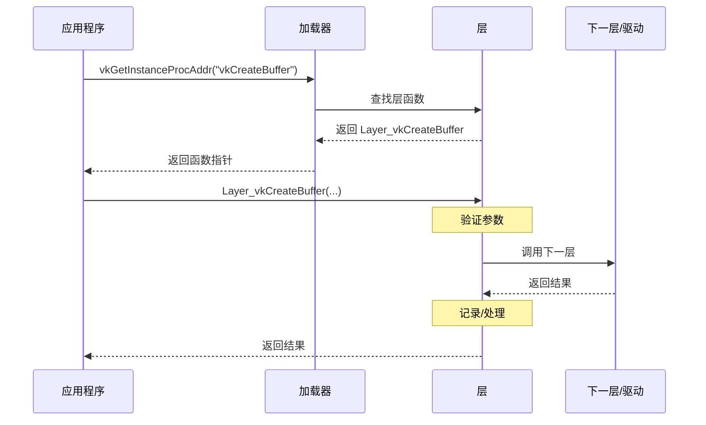

### 层实现示例

```cpp
// 层实现框架
#include <vulkan/vulkan.h>

// 获取下一层函数指针
PFN_vkCreateBuffer getNextCreateBuffer(VkDevice device) {
    // 从设备获取下一层函数
    return (PFN_vkCreateBuffer)vkGetDeviceProcAddr(device, "vkCreateBuffer");
}

// 层实现的 vkCreateBuffer
VkResult VKAPI_CALL Layer_vkCreateBuffer(
    VkDevice device,
    const VkBufferCreateInfo* pCreateInfo,
    const VkAllocationCallbacks* pAllocator,
    VkBuffer* pBuffer
) {
    // 1. 参数验证
    if (pCreateInfo == nullptr || pBuffer == nullptr) {
        return VK_ERROR_VALIDATION_FAILED_EXT;
    }
    
    // 2. 记录调用
    logApiCall("vkCreateBuffer", pCreateInfo);
    
    // 3. 调用下一层
    PFN_vkCreateBuffer nextFunc = getNextCreateBuffer(device);
    VkResult result = nextFunc(device, pCreateInfo, pAllocator, pBuffer);
    
    // 4. 后处理
    if (result == VK_SUCCESS) {
        trackBuffer(*pBuffer, pCreateInfo);
    }
    
    return result;
}

// 层注册函数
extern "C" VKAPI_ATTR PFN_vkGetInstanceProcAddr VKAPI_CALL
vkGetInstanceProcAddr(VkInstance instance, const char* pName) {
    if (strcmp(pName, "vkCreateBuffer") == 0) {
        return (PFN_vkGetInstanceProcAddr)Layer_vkCreateBuffer;
    }
    // 转发其他函数
    return getNextInstanceProcAddr(instance, pName);
}
```

---

## 层与扩展的关系

### 层可能需要的扩展

某些层需要特定的扩展才能工作：

```cpp
// 验证层需要调试工具扩展
std::vector<const char*> extensions = {
    VK_EXT_DEBUG_UTILS_EXTENSION_NAME,  // 调试工具扩展
    VK_EXT_DEBUG_REPORT_EXTENSION_NAME  // 调试报告扩展（旧版）
};

VkInstanceCreateInfo createInfo{};
createInfo.enabledExtensionCount = extensions.size();
createInfo.ppEnabledExtensionNames = extensions.data();
```

### 层设置扩展

```cpp
// 层设置扩展
if (isExtensionAvailable(VK_EXT_LAYER_SETTINGS_EXTENSION_NAME)) {
    extensions.push_back(VK_EXT_LAYER_SETTINGS_EXTENSION_NAME);
}
```

### 层与扩展的交互

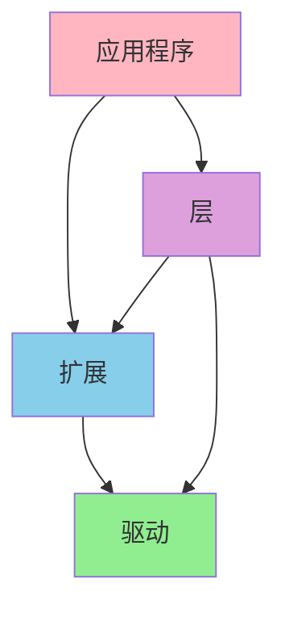

---

## 性能影响分析

### 层的性能开销

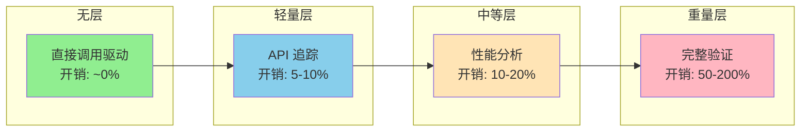

### 性能优化建议

1. **开发时启用验证层，发布时禁用**
2. **使用条件编译控制层启用**
3. **只启用必要的验证功能**
4. **使用 GPU 辅助验证减少 CPU 开销**

```cpp
#ifdef DEBUG
    // 开发版本：启用验证层
    enabledLayers.push_back("VK_LAYER_KHRONOS_validation");
#else
    // 发布版本：禁用所有层
#endif
```

---

## 最佳实践

### 1. 层的启用策略

```cpp
// ✅ 推荐：条件启用
void setupLayers(VkInstanceCreateInfo& createInfo) {
    std::vector<const char*> layers;
    
    #ifdef DEBUG
        // 开发版本启用验证层
        if (isLayerAvailable("VK_LAYER_KHRONOS_validation")) {
            layers.push_back("VK_LAYER_KHRONOS_validation");
        }
    #endif
    
    createInfo.enabledLayerCount = layers.size();
    createInfo.ppEnabledLayerNames = layers.data();
}
```

### 2. 层可用性检查

```cpp
// ✅ 总是检查层是否可用
bool checkLayersAvailable(const std::vector<const char*>& requiredLayers) {
    uint32_t layerCount;
    vkEnumerateInstanceLayerProperties(&layerCount, nullptr);
    std::vector<VkLayerProperties> availableLayers(layerCount);
    vkEnumerateInstanceLayerProperties(&layerCount, availableLayers.data());
    
    for (const char* required : requiredLayers) {
        bool found = false;
        for (const auto& available : availableLayers) {
            if (strcmp(available.layerName, required) == 0) {
                found = true;
                break;
            }
        }
        if (!found) {
            std::cerr << "Required layer not available: " << required << std::endl;
            return false;
        }
    }
    return true;
}
```

### 3. 调试回调配置

```cpp
// ✅ 配置合适的消息过滤
VkDebugUtilsMessengerCreateInfoEXT getDebugMessengerCreateInfo() {
    VkDebugUtilsMessengerCreateInfoEXT createInfo{};
    createInfo.sType = VK_STRUCTURE_TYPE_DEBUG_UTILS_MESSENGER_CREATE_INFO_EXT;
    
    // 只显示警告和错误（发布版本）
    #ifdef DEBUG
        createInfo.messageSeverity = 
            VK_DEBUG_UTILS_MESSAGE_SEVERITY_VERBOSE_BIT_EXT |
            VK_DEBUG_UTILS_MESSAGE_SEVERITY_INFO_BIT_EXT |
            VK_DEBUG_UTILS_MESSAGE_SEVERITY_WARNING_BIT_EXT |
            VK_DEBUG_UTILS_MESSAGE_SEVERITY_ERROR_BIT_EXT;
    #else
        createInfo.messageSeverity = 
            VK_DEBUG_UTILS_MESSAGE_SEVERITY_WARNING_BIT_EXT |
            VK_DEBUG_UTILS_MESSAGE_SEVERITY_ERROR_BIT_EXT;
    #endif
    
    createInfo.messageType = 
        VK_DEBUG_UTILS_MESSAGE_TYPE_GENERAL_BIT_EXT |
        VK_DEBUG_UTILS_MESSAGE_TYPE_VALIDATION_BIT_EXT |
        VK_DEBUG_UTILS_MESSAGE_TYPE_PERFORMANCE_BIT_EXT;
    
    createInfo.pfnUserCallback = debugCallback;
    return createInfo;
}
```

### 4. 层设置管理

```cpp
// ✅ 使用层设置 API 配置层
void configureValidationLayer(VkInstanceCreateInfo& createInfo) {
    VkLayerSettingEXT settings[] = {
        {
            .pLayerName = "VK_LAYER_KHRONOS_validation",
            .pSettingName = "enables",
            .type = VK_LAYER_SETTING_TYPE_STRING_EXT,
            .valueCount = 1,
            .pValues = "VK_VALIDATION_FEATURE_ENABLE_GPU_ASSISTED_EXT"
        }
    };
    
    VkLayerSettingsCreateInfoEXT layerSettingsInfo{};
    layerSettingsInfo.sType = VK_STRUCTURE_TYPE_LAYER_SETTINGS_CREATE_INFO_EXT;
    layerSettingsInfo.settingCount = 1;
    layerSettingsInfo.pSettings = settings;
    
    // 链接到创建信息
    layerSettingsInfo.pNext = createInfo.pNext;
    createInfo.pNext = &layerSettingsInfo;
}
```

### 5. 错误处理

```cpp
// ✅ 层启用失败时的处理
void enableLayersSafely(VkInstanceCreateInfo& createInfo) {
    std::vector<const char*> requestedLayers = {
        "VK_LAYER_KHRONOS_validation",
        "VK_LAYER_LUNARG_api_dump"
    };
    
    std::vector<const char*> enabledLayers;
    for (const char* layer : requestedLayers) {
        if (isLayerAvailable(layer)) {
            enabledLayers.push_back(layer);
        } else {
            std::cerr << "Warning: Layer not available: " << layer << std::endl;
        }
    }
    
    createInfo.enabledLayerCount = enabledLayers.size();
    createInfo.ppEnabledLayerNames = enabledLayers.data();
}
```

### 6. 性能考虑

```cpp
// ✅ 发布版本完全禁用层
#ifndef DEBUG
    // 发布版本：不启用任何层
    createInfo.enabledLayerCount = 0;
    createInfo.ppEnabledLayerNames = nullptr;
#else
    // 开发版本：启用验证层
    enableValidationLayers(createInfo);
#endif
```

---

## 总结

### 核心要点

1. **层的本质**：插入在应用程序和驱动之间的中间件
2. **层的作用**：调试、验证、性能分析、API 拦截
3. **层的类型**：实例层（现代）和设备层（已弃用）
4. **层链机制**：层按顺序调用，形成调用链
5. **性能影响**：验证层可能有显著性能开销

### 架构设计原则

1. **可选性**：层是可选的，不应影响核心功能
2. **可配置性**：层应该可以通过设置配置
3. **可组合性**：多个层可以同时启用
4. **透明性**：层不应该改变 API 语义

### 实践建议

1. **开发时启用验证层**，发布时禁用
2. **检查层可用性**，处理层不可用的情况
3. **配置合适的消息过滤**，避免信息过载
4. **使用条件编译**控制层的启用
5. **了解性能影响**，合理使用层

---

*文档版本: 1.0*  
*最后更新: 2025*

