# Vulkan 扩展详细分析文档

## 目录
1. [Vulkan 扩展概述](#vulkan-扩展概述)
2. [扩展的类型](#扩展的类型)
3. [扩展的命名规则](#扩展的命名规则)
4. [扩展的查询](#扩展的查询)
5. [扩展的启用](#扩展的启用)
6. [常见实例扩展](#常见实例扩展)
7. [常见设备扩展](#常见设备扩展)
8. [代码库中的主要扩展列表](#代码库中的主要扩展列表)
9. [扩展的使用流程](#扩展的使用流程)
10. [扩展函数指针](#扩展函数指针)
11. [扩展的最佳实践](#扩展的最佳实践)

---

## Vulkan 扩展概述

### 什么是 Vulkan 扩展？

**Vulkan 扩展**是 Vulkan API 的附加功能，用于：
- **添加新功能**: 在核心 Vulkan API 之外添加新特性
- **平台集成**: 与特定操作系统和窗口系统集成
- **硬件特性**: 访问特定硬件的特殊功能
- **向后兼容**: 在核心规范更新前提供新功能

### 扩展的作用

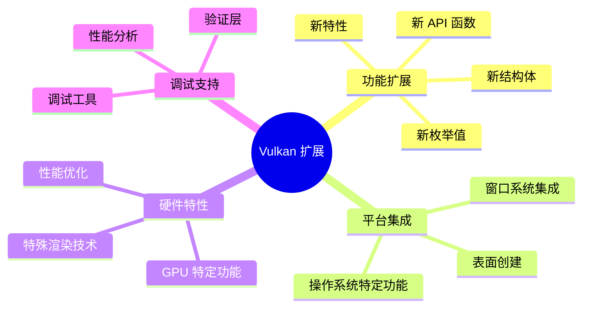
```mermaid
mindmap
  root((Vulkan 扩展))
    功能扩展
      新 API 函数
      新结构体
      新枚举值
      新特性
    平台集成
      窗口系统集成
      操作系统特定功能
      表面创建
    硬件特性
      GPU 特定功能
      性能优化
      特殊渲染技术
    调试支持
      验证层
      调试工具
      性能分析
```

### 扩展在 Vulkan 架构中的位置

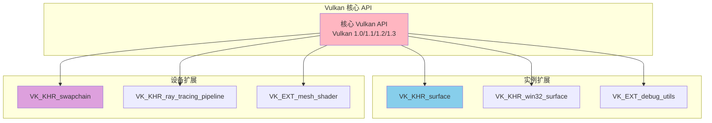
```mermaid
graph TB
    subgraph "Vulkan 核心 API"
        Core[核心 Vulkan API<br/>Vulkan 1.0/1.1/1.2/1.3]
    end
    
    subgraph "实例扩展"
        InstanceExt1[VK_KHR_surface]
        InstanceExt2[VK_KHR_win32_surface]
        InstanceExt3[VK_EXT_debug_utils]
    end
    
    subgraph "设备扩展"
        DeviceExt1[VK_KHR_swapchain]
        DeviceExt2[VK_KHR_ray_tracing_pipeline]
        DeviceExt3[VK_EXT_mesh_shader]
    end
    
    Core --> InstanceExt1
    Core --> InstanceExt2
    Core --> InstanceExt3
    Core --> DeviceExt1
    Core --> DeviceExt2
    Core --> DeviceExt3
    
    style Core fill:#FFB6C1
    style InstanceExt1 fill:#87CEEB
    style DeviceExt1 fill:#DDA0DD
```

### 为什么需要扩展？

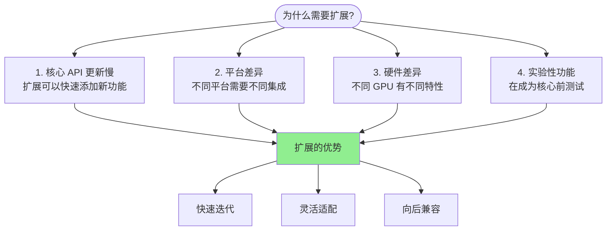
```mermaid
flowchart TD
    Start([为什么需要扩展?]) --> Reason1[1. 核心 API 更新慢<br/>扩展可以快速添加新功能]
    Start --> Reason2[2. 平台差异<br/>不同平台需要不同集成]
    Start --> Reason3[3. 硬件差异<br/>不同 GPU 有不同特性]
    Start --> Reason4[4. 实验性功能<br/>在成为核心前测试]
    
    Reason1 --> Benefit[扩展的优势]
    Reason2 --> Benefit
    Reason3 --> Benefit
    Reason4 --> Benefit
    
    Benefit --> Fast[快速迭代]
    Benefit --> Flexible[灵活适配]
    Benefit --> Compatible[向后兼容]
    
    style Benefit fill:#90EE90
```

---

## 扩展的类型

### 实例扩展 vs 设备扩展

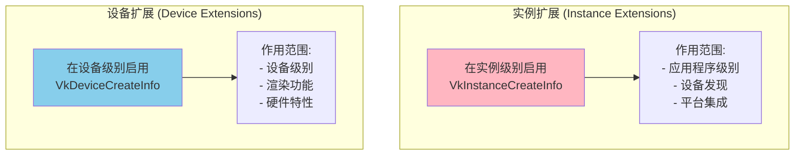
```mermaid
graph TB
    subgraph "实例扩展 (Instance Extensions)"
        InstanceExt[在实例级别启用<br/>VkInstanceCreateInfo]
        InstanceScope[作用范围:<br/>- 应用程序级别<br/>- 设备发现<br/>- 平台集成]
    end
    
    subgraph "设备扩展 (Device Extensions)"
        DeviceExt[在设备级别启用<br/>VkDeviceCreateInfo]
        DeviceScope[作用范围:<br/>- 设备级别<br/>- 渲染功能<br/>- 硬件特性]
    end
    
    InstanceExt --> InstanceScope
    DeviceExt --> DeviceScope
    
    style InstanceExt fill:#FFB6C1
    style DeviceExt fill:#87CEEB
```

### 扩展类型对比

| 特性 | 实例扩展 | 设备扩展 |
|------|---------|---------|
| **启用位置** | `VkInstanceCreateInfo` | `VkDeviceCreateInfo` |
| **查询位置** | `vkEnumerateInstanceExtensionProperties` | `vkEnumerateDeviceExtensionProperties` |
| **作用范围** | 应用程序级别 | 设备级别 |
| **主要用途** | 平台集成、设备发现 | 渲染功能、硬件特性 |
| **生命周期** | 与实例相同 | 与设备相同 |
| **示例** | `VK_KHR_surface`, `VK_EXT_debug_utils` | `VK_KHR_swapchain`, `VK_KHR_ray_tracing_pipeline` |

### 扩展类型决策树

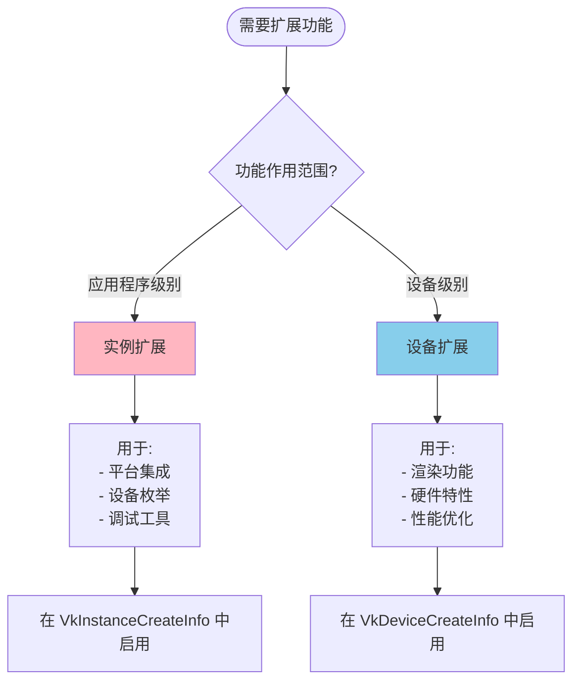
```mermaid
flowchart TD
    Start([需要扩展功能]) --> Check{功能作用范围?}
    
    Check -->|应用程序级别| Instance[实例扩展]
    Check -->|设备级别| Device[设备扩展]
    
    Instance --> InstanceUse[用于:<br/>- 平台集成<br/>- 设备枚举<br/>- 调试工具]
    
    Device --> DeviceUse[用于:<br/>- 渲染功能<br/>- 硬件特性<br/>- 性能优化]
    
    InstanceUse --> EnableInstance[在 VkInstanceCreateInfo 中启用]
    DeviceUse --> EnableDevice[在 VkDeviceCreateInfo 中启用]
    
    style Instance fill:#FFB6C1
    style Device fill:#87CEEB
```

---

## 扩展的命名规则

### 扩展名称格式

Vulkan 扩展名称遵循以下格式：
```
VK_<vendor>_<name>
```

### 命名组成部分

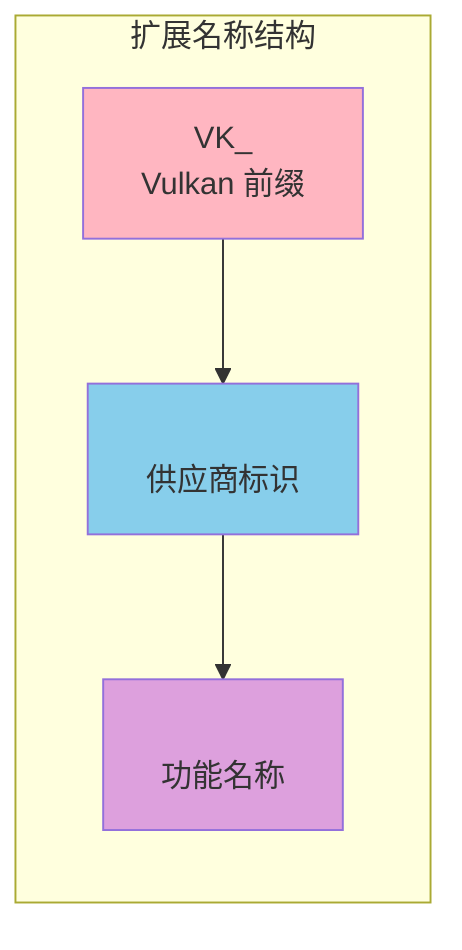
```mermaid
graph LR
    subgraph "扩展名称结构"
        VK[VK_<br/>Vulkan 前缀]
        Vendor[<vendor><br/>供应商标识]
        Name[<name><br/>功能名称]
    end
    
    VK --> Vendor
    Vendor --> Name
    
    style VK fill:#FFB6C1
    style Vendor fill:#87CEEB
    style Name fill:#DDA0DD
```

### 常见供应商标识

| 供应商标识 | 说明 | 示例 |
|-----------|------|------|
| **KHR** | Khronos Group (标准扩展) | `VK_KHR_swapchain` |
| **EXT** | 多供应商扩展 | `VK_EXT_debug_utils` |
| **NV** | NVIDIA | `VK_NV_ray_tracing` |
| **AMD** | AMD | `VK_AMD_rasterization_order` |
| **INTEL** | Intel | `VK_INTEL_shader_integer_functions2` |
| **MVK** | MoltenVK (macOS/iOS) | `VK_MVK_macos_surface` |

### 扩展名称示例

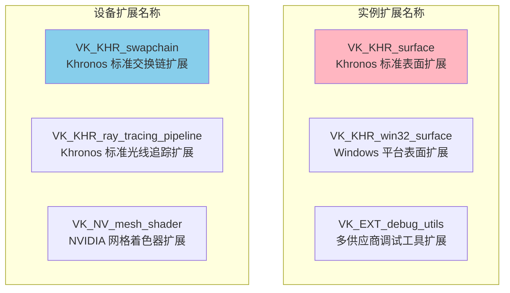
```mermaid
graph TD
    subgraph "实例扩展名称"
        Inst1[VK_KHR_surface<br/>Khronos 标准表面扩展]
        Inst2[VK_KHR_win32_surface<br/>Windows 平台表面扩展]
        Inst3[VK_EXT_debug_utils<br/>多供应商调试工具扩展]
    end
    
    subgraph "设备扩展名称"
        Dev1[VK_KHR_swapchain<br/>Khronos 标准交换链扩展]
        Dev2[VK_KHR_ray_tracing_pipeline<br/>Khronos 标准光线追踪扩展]
        Dev3[VK_NV_mesh_shader<br/>NVIDIA 网格着色器扩展]
    end
    
    style Inst1 fill:#FFB6C1
    style Dev1 fill:#87CEEB
```

---

## 扩展的查询

### 查询实例扩展

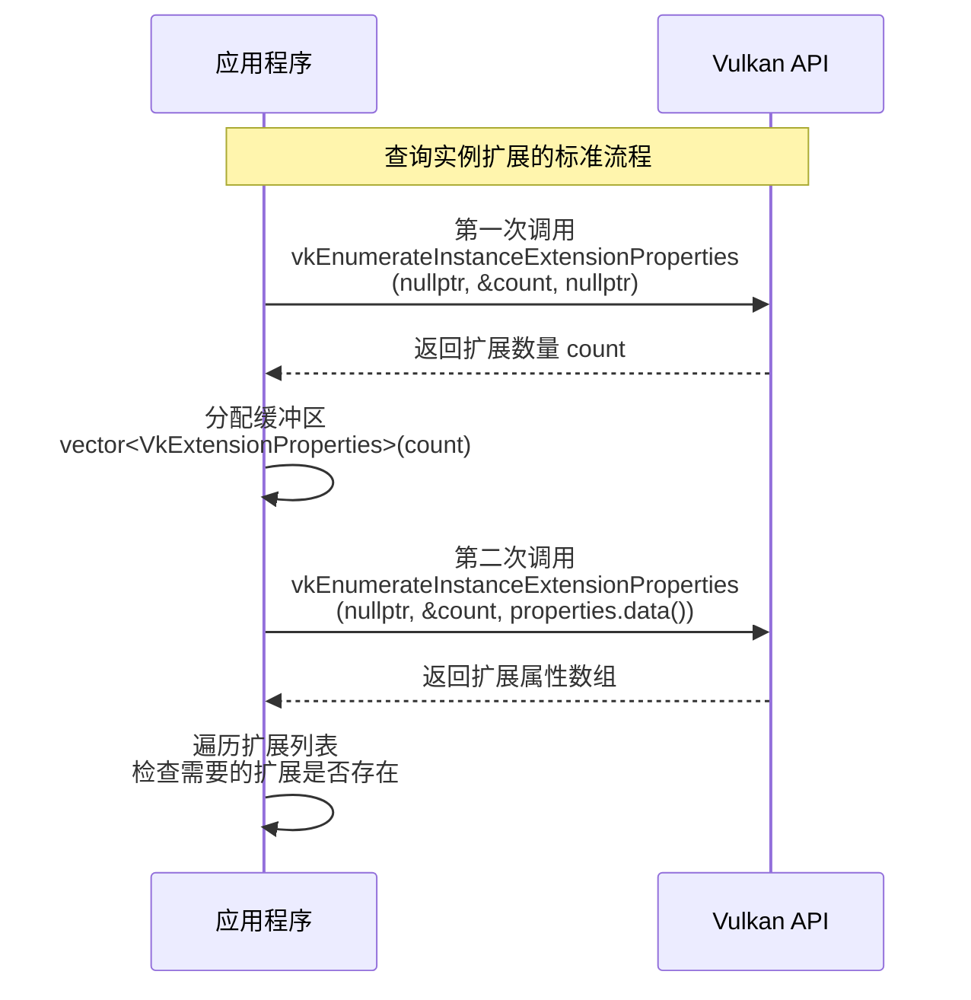
```mermaid
sequenceDiagram
    participant App as 应用程序
    participant Vulkan as Vulkan API
    
    Note over App,Vulkan: 查询实例扩展的标准流程
    
    App->>Vulkan: 第一次调用<br/>vkEnumerateInstanceExtensionProperties<br/>(nullptr, &count, nullptr)
    Vulkan-->>App: 返回扩展数量 count
    
    App->>App: 分配缓冲区<br/>vector<VkExtensionProperties>(count)
    
    App->>Vulkan: 第二次调用<br/>vkEnumerateInstanceExtensionProperties<br/>(nullptr, &count, properties.data())
    Vulkan-->>App: 返回扩展属性数组
    
    App->>App: 遍历扩展列表<br/>检查需要的扩展是否存在
```

### 查询设备扩展

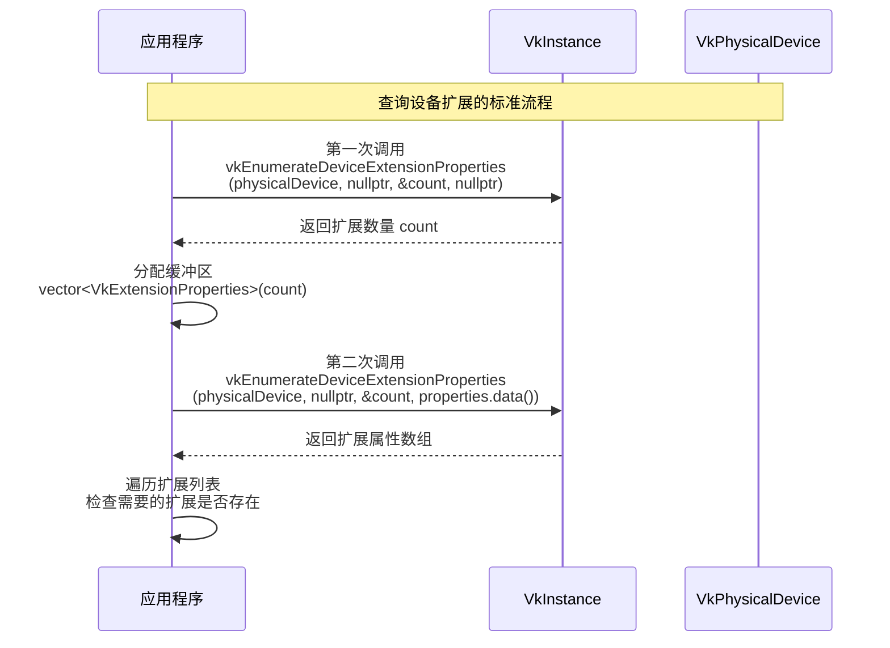
```mermaid
sequenceDiagram
    participant App as 应用程序
    participant Instance as VkInstance
    participant PhysicalDevice as VkPhysicalDevice
    
    Note over App,PhysicalDevice: 查询设备扩展的标准流程
    
    App->>Instance: 第一次调用<br/>vkEnumerateDeviceExtensionProperties<br/>(physicalDevice, nullptr, &count, nullptr)
    Instance-->>App: 返回扩展数量 count
    
    App->>App: 分配缓冲区<br/>vector<VkExtensionProperties>(count)
    
    App->>Instance: 第二次调用<br/>vkEnumerateDeviceExtensionProperties<br/>(physicalDevice, nullptr, &count, properties.data())
    Instance-->>App: 返回扩展属性数组
    
    App->>App: 遍历扩展列表<br/>检查需要的扩展是否存在
```

### VkExtensionProperties 结构

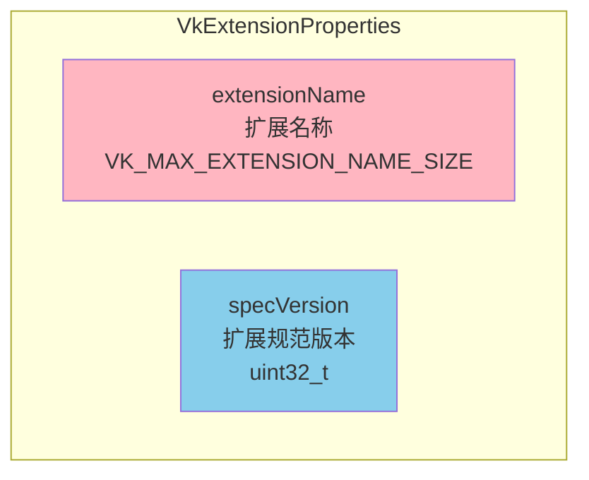
```mermaid
graph TD
    subgraph "VkExtensionProperties"
        ExtensionName[extensionName<br/>扩展名称<br/>VK_MAX_EXTENSION_NAME_SIZE]
        SpecVersion[specVersion<br/>扩展规范版本<br/>uint32_t]
    end
    
    style ExtensionName fill:#FFB6C1
    style SpecVersion fill:#87CEEB
```

### 查询扩展的代码示例

#### 查询实例扩展

```cpp
/**
 * @brief 查询实例支持的扩展
 * @return 支持的扩展名称列表
 */
std::vector<std::string> queryInstanceExtensions()
{
    std::vector<std::string> supportedExtensions;
    
    // 第一次调用：获取扩展数量
    uint32_t extCount = 0;
    vkEnumerateInstanceExtensionProperties(nullptr, &extCount, nullptr);
    
    if (extCount > 0) {
        // 分配缓冲区
        std::vector<VkExtensionProperties> extensions(extCount);
        
        // 第二次调用：获取扩展属性
        if (vkEnumerateInstanceExtensionProperties(
                nullptr, &extCount, extensions.data()) == VK_SUCCESS) {
            // 存储扩展名称
            for (const auto& ext : extensions) {
                supportedExtensions.push_back(ext.extensionName);
            }
        }
    }
    
    return supportedExtensions;
}
```

#### 查询设备扩展

```cpp
/**
 * @brief 查询物理设备支持的扩展
 * @param physicalDevice 物理设备句柄
 * @return 支持的扩展名称列表
 */
std::vector<std::string> queryDeviceExtensions(VkPhysicalDevice physicalDevice)
{
    std::vector<std::string> supportedExtensions;
    
    // 第一次调用：获取扩展数量
    uint32_t extCount = 0;
    vkEnumerateDeviceExtensionProperties(physicalDevice, nullptr, &extCount, nullptr);
    
    if (extCount > 0) {
        // 分配缓冲区
        std::vector<VkExtensionProperties> extensions(extCount);
        
        // 第二次调用：获取扩展属性
        if (vkEnumerateDeviceExtensionProperties(
                physicalDevice, nullptr, &extCount, extensions.data()) == VK_SUCCESS) {
            // 存储扩展名称
            for (const auto& ext : extensions) {
                supportedExtensions.push_back(ext.extensionName);
            }
        }
    }
    
    return supportedExtensions;
}
```

### 检查扩展是否支持

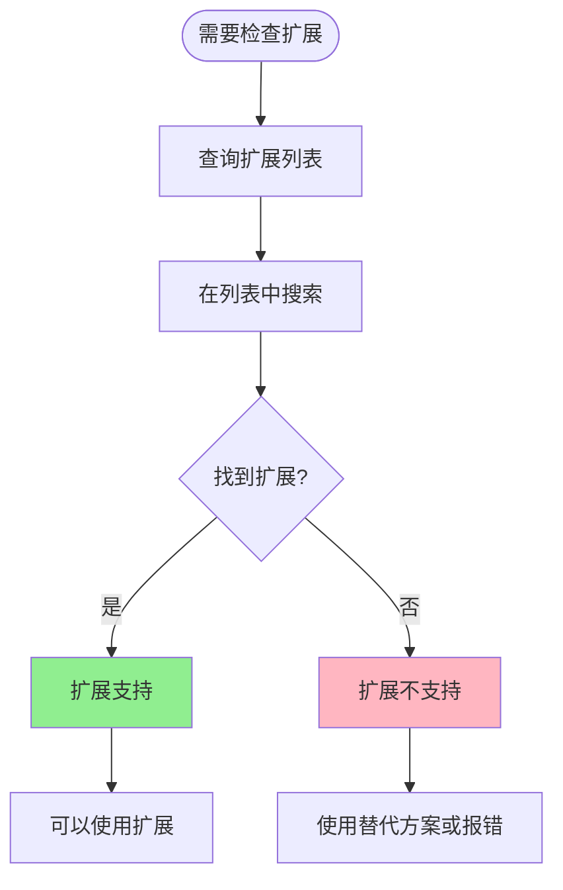
```mermaid
flowchart TD
    Start([需要检查扩展]) --> Query[查询扩展列表]
    Query --> Search[在列表中搜索]
    Search --> Found{找到扩展?}
    Found -->|是| Supported[扩展支持]
    Found -->|否| NotSupported[扩展不支持]
    Supported --> Use[可以使用扩展]
    NotSupported --> Alternative[使用替代方案或报错]
    
    style Supported fill:#90EE90
    style NotSupported fill:#FFB6C1
```

---

## 扩展的启用

### 启用实例扩展

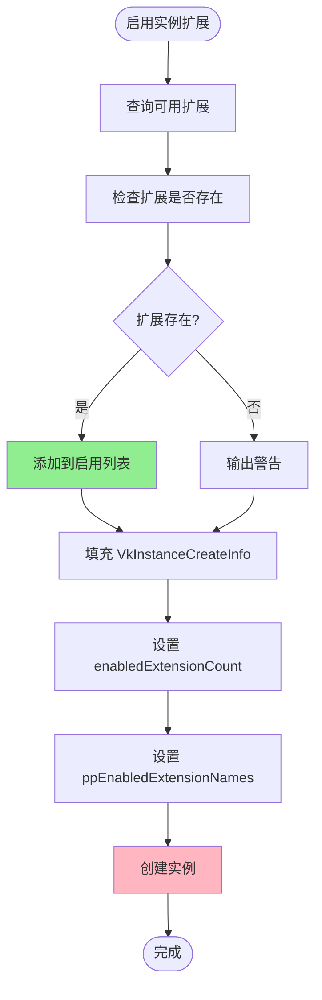
```mermaid
flowchart TD
    Start([启用实例扩展]) --> Query[查询可用扩展]
    Query --> Check[检查扩展是否存在]
    Check --> Exists{扩展存在?}
    Exists -->|是| AddToList[添加到启用列表]
    Exists -->|否| Warn[输出警告]
    AddToList --> FillCreateInfo[填充 VkInstanceCreateInfo]
    Warn --> FillCreateInfo
    FillCreateInfo --> SetCount[设置 enabledExtensionCount]
    SetCount --> SetNames[设置 ppEnabledExtensionNames]
    SetNames --> CreateInstance[创建实例]
    CreateInstance --> End([完成])
    
    style AddToList fill:#90EE90
    style CreateInstance fill:#FFB6C1
```

### 启用设备扩展

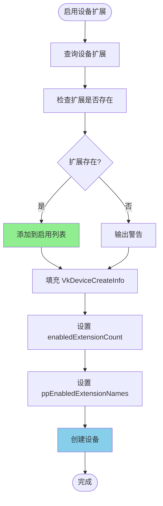
```mermaid
flowchart TD
    Start([启用设备扩展]) --> Query[查询设备扩展]
    Query --> Check[检查扩展是否存在]
    Check --> Exists{扩展存在?}
    Exists -->|是| AddToList[添加到启用列表]
    Exists -->|否| Warn[输出警告]
    AddToList --> FillCreateInfo[填充 VkDeviceCreateInfo]
    Warn --> FillCreateInfo
    FillCreateInfo --> SetCount[设置 enabledExtensionCount]
    SetCount --> SetNames[设置 ppEnabledExtensionNames]
    SetNames --> CreateDevice[创建设备]
    CreateDevice --> End([完成])
    
    style AddToList fill:#90EE90
    style CreateDevice fill:#87CEEB
```

### 启用扩展的代码示例

#### 启用实例扩展

```cpp
VkResult createInstanceWithExtensions()
{
    // 1. 查询支持的扩展
    uint32_t extCount = 0;
    vkEnumerateInstanceExtensionProperties(nullptr, &extCount, nullptr);
    std::vector<VkExtensionProperties> availableExtensions(extCount);
    vkEnumerateInstanceExtensionProperties(nullptr, &extCount, availableExtensions.data());
    
    // 2. 准备需要的扩展列表
    std::vector<const char*> requiredExtensions = {
        VK_KHR_SURFACE_EXTENSION_NAME,
        VK_KHR_WIN32_SURFACE_EXTENSION_NAME,  // Windows 平台
        VK_EXT_DEBUG_UTILS_EXTENSION_NAME      // 调试工具
    };
    
    // 3. 检查扩展是否支持
    std::vector<const char*> enabledExtensions;
    for (const char* ext : requiredExtensions) {
        bool found = false;
        for (const auto& available : availableExtensions) {
            if (strcmp(ext, available.extensionName) == 0) {
                found = true;
                break;
            }
        }
        if (found) {
            enabledExtensions.push_back(ext);
        } else {
            std::cerr << "Extension " << ext << " not supported\n";
        }
    }
    
    // 4. 填充实例创建信息
    VkInstanceCreateInfo createInfo{};
    createInfo.sType = VK_STRUCTURE_TYPE_INSTANCE_CREATE_INFO;
    createInfo.enabledExtensionCount = static_cast<uint32_t>(enabledExtensions.size());
    createInfo.ppEnabledExtensionNames = enabledExtensions.data();
    
    // 5. 创建实例
    VkInstance instance;
    return vkCreateInstance(&createInfo, nullptr, &instance);
}
```

#### 启用设备扩展

```cpp
VkResult createDeviceWithExtensions(VkPhysicalDevice physicalDevice)
{
    // 1. 查询设备支持的扩展
    uint32_t extCount = 0;
    vkEnumerateDeviceExtensionProperties(physicalDevice, nullptr, &extCount, nullptr);
    std::vector<VkExtensionProperties> availableExtensions(extCount);
    vkEnumerateDeviceExtensionProperties(
        physicalDevice, nullptr, &extCount, availableExtensions.data());
    
    // 2. 准备需要的扩展列表
    std::vector<const char*> requiredExtensions = {
        VK_KHR_SWAPCHAIN_EXTENSION_NAME
    };
    
    // 3. 检查扩展是否支持
    std::vector<const char*> enabledExtensions;
    for (const char* ext : requiredExtensions) {
        bool found = false;
        for (const auto& available : availableExtensions) {
            if (strcmp(ext, available.extensionName) == 0) {
                found = true;
                break;
            }
        }
        if (found) {
            enabledExtensions.push_back(ext);
        } else {
            std::cerr << "Device extension " << ext << " not supported\n";
        }
    }
    
    // 4. 填充设备创建信息
    VkDeviceCreateInfo createInfo{};
    createInfo.sType = VK_STRUCTURE_TYPE_DEVICE_CREATE_INFO;
    createInfo.enabledExtensionCount = static_cast<uint32_t>(enabledExtensions.size());
    createInfo.ppEnabledExtensionNames = enabledExtensions.data();
    
    // 5. 创建设备
    VkDevice device;
    return vkCreateDevice(physicalDevice, &createInfo, nullptr, &device);
}
```

---

## 常见实例扩展

### 平台集成扩展

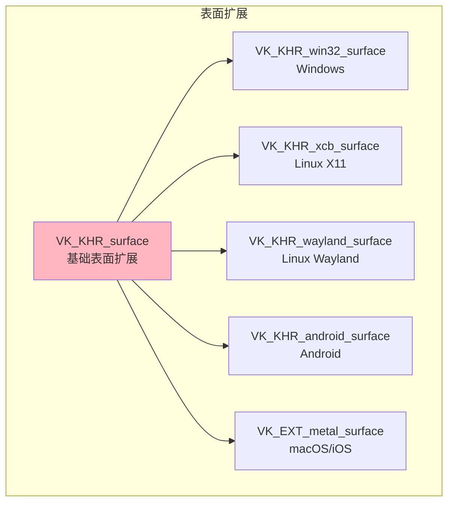
```mermaid
graph TB
    subgraph "表面扩展"
        Surface[VK_KHR_surface<br/>基础表面扩展]
        Win32[VK_KHR_win32_surface<br/>Windows]
        XCB[VK_KHR_xcb_surface<br/>Linux X11]
        Wayland[VK_KHR_wayland_surface<br/>Linux Wayland]
        Android[VK_KHR_android_surface<br/>Android]
        Metal[VK_EXT_metal_surface<br/>macOS/iOS]
    end
    
    Surface --> Win32
    Surface --> XCB
    Surface --> Wayland
    Surface --> Android
    Surface --> Metal
    
    style Surface fill:#FFB6C1
```

### 调试和验证扩展

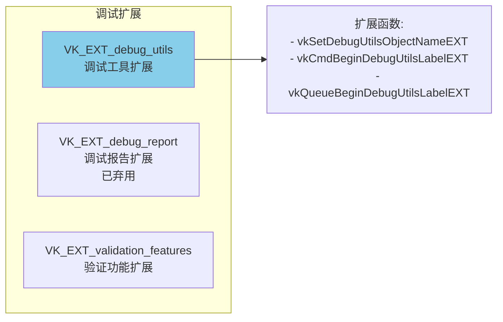
```mermaid
graph LR
    subgraph "调试扩展"
        DebugUtils[VK_EXT_debug_utils<br/>调试工具扩展]
        DebugReport[VK_EXT_debug_report<br/>调试报告扩展<br/>已弃用]
        ValidationFeatures[VK_EXT_validation_features<br/>验证功能扩展]
    end
    
    DebugUtils --> Functions[扩展函数:<br/>- vkSetDebugUtilsObjectNameEXT<br/>- vkCmdBeginDebugUtilsLabelEXT<br/>- vkQueueBeginDebugUtilsLabelEXT]
    
    style DebugUtils fill:#87CEEB
```

### 设备发现扩展

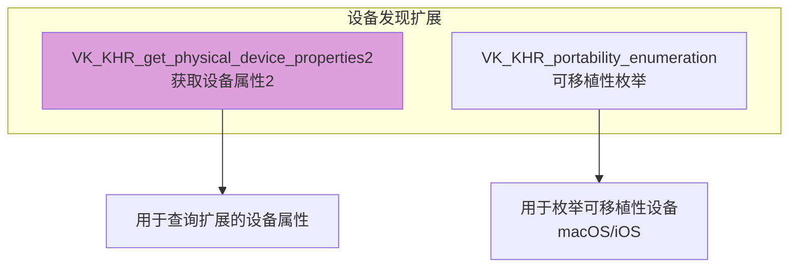
```mermaid
graph TD
    subgraph "设备发现扩展"
        GetProps2[VK_KHR_get_physical_device_properties2<br/>获取设备属性2]
        PortabilityEnum[VK_KHR_portability_enumeration<br/>可移植性枚举]
    end
    
    GetProps2 --> UseCase1[用于查询扩展的设备属性]
    PortabilityEnum --> UseCase2[用于枚举可移植性设备<br/>macOS/iOS]
    
    style GetProps2 fill:#DDA0DD
```

### 实例扩展分类表

| 类别 | 扩展名称 | 说明 | 必需性 |
|------|---------|------|--------|
| **表面** | `VK_KHR_surface` | 基础表面扩展 | ⭐⭐⭐⭐⭐ |
| **Windows** | `VK_KHR_win32_surface` | Windows 表面 | ⭐⭐⭐⭐⭐ |
| **Linux X11** | `VK_KHR_xcb_surface` | X11/XCB 表面 | ⭐⭐⭐⭐⭐ |
| **Linux Wayland** | `VK_KHR_wayland_surface` | Wayland 表面 | ⭐⭐⭐⭐ |
| **Android** | `VK_KHR_android_surface` | Android 表面 | ⭐⭐⭐⭐⭐ |
| **macOS/iOS** | `VK_EXT_metal_surface` | Metal 表面 | ⭐⭐⭐⭐⭐ |
| **调试** | `VK_EXT_debug_utils` | 调试工具 | ⭐⭐⭐ |
| **设备发现** | `VK_KHR_get_physical_device_properties2` | 设备属性2 | ⭐⭐⭐ |

---

## 常见设备扩展

### 渲染功能扩展

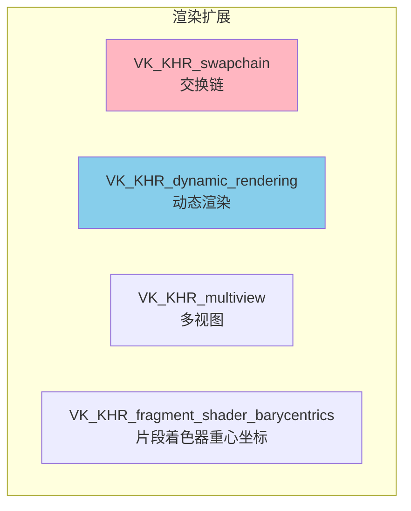
```mermaid
graph TB
    subgraph "渲染扩展"
        Swapchain[VK_KHR_swapchain<br/>交换链]
        DynamicRendering[VK_KHR_dynamic_rendering<br/>动态渲染]
        Multiview[VK_KHR_multiview<br/>多视图]
        FragmentShaderBarycentrics[VK_KHR_fragment_shader_barycentrics<br/>片段着色器重心坐标]
    end
    
    style Swapchain fill:#FFB6C1
    style DynamicRendering fill:#87CEEB
```

### 高级渲染扩展

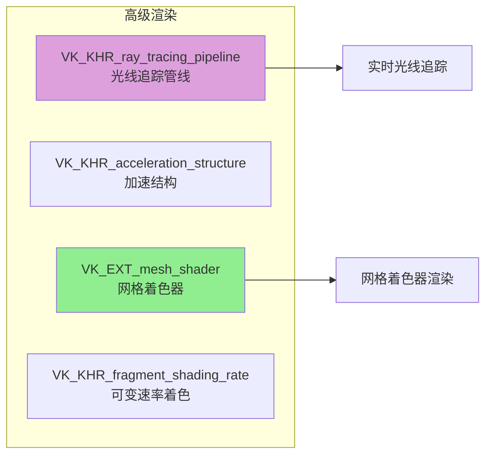
```mermaid
graph LR
    subgraph "高级渲染"
        RayTracing[VK_KHR_ray_tracing_pipeline<br/>光线追踪管线]
        AccelerationStructure[VK_KHR_acceleration_structure<br/>加速结构]
        MeshShader[VK_EXT_mesh_shader<br/>网格着色器]
        VariableRateShading[VK_KHR_fragment_shading_rate<br/>可变速率着色]
    end
    
    RayTracing --> RTUse[实时光线追踪]
    MeshShader --> MeshUse[网格着色器渲染]
    
    style RayTracing fill:#DDA0DD
    style MeshShader fill:#90EE90
```

### 性能优化扩展

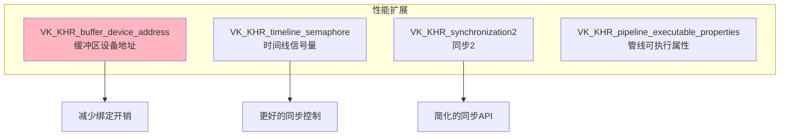
```mermaid
graph TD
    subgraph "性能扩展"
        BufferDeviceAddress[VK_KHR_buffer_device_address<br/>缓冲区设备地址]
        TimelineSemaphore[VK_KHR_timeline_semaphore<br/>时间线信号量]
        Synchronization2[VK_KHR_synchronization2<br/>同步2]
        PipelineExecutableProperties[VK_KHR_pipeline_executable_properties<br/>管线可执行属性]
    end
    
    BufferDeviceAddress --> Perf1[减少绑定开销]
    TimelineSemaphore --> Perf2[更好的同步控制]
    Synchronization2 --> Perf3[简化的同步API]
    
    style BufferDeviceAddress fill:#FFB6C1
```

### 设备扩展分类表

| 类别 | 扩展名称 | 说明 | Vulkan 版本 |
|------|---------|------|------------|
| **交换链** | `VK_KHR_swapchain` | 交换链支持 | 必需 |
| **动态渲染** | `VK_KHR_dynamic_rendering` | 动态渲染 (1.3核心) | 1.3+ |
| **光线追踪** | `VK_KHR_ray_tracing_pipeline` | 光线追踪管线 | 扩展 |
| **加速结构** | `VK_KHR_acceleration_structure` | 加速结构 | 扩展 |
| **网格着色器** | `VK_EXT_mesh_shader` | 网格着色器 | 扩展 |
| **缓冲区地址** | `VK_KHR_buffer_device_address` | 缓冲区设备地址 | 扩展 |
| **时间线信号量** | `VK_KHR_timeline_semaphore` | 时间线信号量 | 扩展 |
| **同步2** | `VK_KHR_synchronization2` | 同步2 (1.3核心) | 1.3+ |

---

## 扩展的使用流程

### 完整扩展使用流程

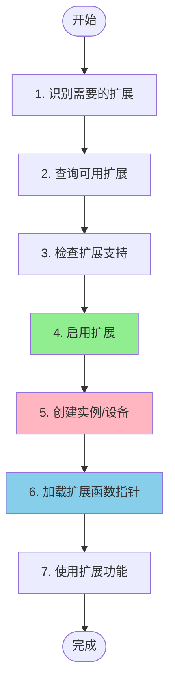
```mermaid
flowchart TD
    Start([开始]) --> Identify[1. 识别需要的扩展]
    Identify --> Query[2. 查询可用扩展]
    Query --> Check[3. 检查扩展支持]
    Check --> Enable[4. 启用扩展]
    Enable --> Create[5. 创建实例/设备]
    Create --> LoadFunctions[6. 加载扩展函数指针]
    LoadFunctions --> Use[7. 使用扩展功能]
    Use --> End([完成])
    
    style Enable fill:#90EE90
    style Create fill:#FFB6C1
    style LoadFunctions fill:#87CEEB
```

### 扩展使用示例：交换链扩展

```mermaid
sequenceDiagram
    participant App as 应用程序
    participant Instance as VkInstance
    participant PhysicalDevice as VkPhysicalDevice
    participant Device as VkDevice
    
    Note over App,Device: 使用交换链扩展的完整流程
    
    App->>Instance: 1. 查询设备扩展<br/>vkEnumerateDeviceExtensionProperties
    Instance-->>App: 返回扩展列表
    
    App->>App: 2. 检查 VK_KHR_swapchain 支持
    
    App->>Device: 3. 在设备创建时启用扩展<br/>VkDeviceCreateInfo
    
    App->>Instance: 4. 加载扩展函数<br/>vkGetInstanceProcAddr<br/>vkGetDeviceProcAddr
    
    App->>Device: 5. 使用扩展函数<br/>vkCreateSwapchainKHR<br/>vkAcquireNextImageKHR<br/>vkQueuePresentKHR
```

### 扩展使用示例：调试工具扩展

```mermaid
sequenceDiagram
    participant App as 应用程序
    participant Instance as VkInstance
    
    Note over App,Instance: 使用调试工具扩展的流程
    
    App->>Instance: 1. 查询实例扩展<br/>vkEnumerateInstanceExtensionProperties
    Instance-->>App: 返回扩展列表
    
    App->>App: 2. 检查 VK_EXT_debug_utils 支持
    
    App->>Instance: 3. 在实例创建时启用扩展
    
    App->>Instance: 4. 加载扩展函数<br/>vkGetInstanceProcAddr
    
    App->>Instance: 5. 使用扩展函数<br/>vkSetDebugUtilsObjectNameEXT<br/>vkCmdBeginDebugUtilsLabelEXT<br/>vkCmdEndDebugUtilsLabelEXT
```

---

## 扩展函数指针

### 为什么需要函数指针？

```mermaid
graph LR
    subgraph "核心函数"
        CoreFunc[核心 Vulkan 函数<br/>直接链接]
    end
    
    subgraph "扩展函数"
        ExtFunc[扩展函数<br/>需要运行时加载]
    end
    
    CoreFunc --> Direct[直接调用]
    ExtFunc --> Load[加载函数指针]
    Load --> Call[通过指针调用]
    
    style ExtFunc fill:#FFB6C1
    style Load fill:#87CEEB
```

### 加载扩展函数指针

```mermaid
flowchart TD
    Start([需要扩展函数]) --> CheckType{函数类型?}
    
    CheckType -->|实例函数| LoadInstance[使用 vkGetInstanceProcAddr<br/>需要 VkInstance]
    CheckType -->|设备函数| LoadDevice[使用 vkGetDeviceProcAddr<br/>需要 VkDevice]
    
    LoadInstance --> GetAddr[获取函数地址]
    LoadDevice --> GetAddr
    GetAddr --> CheckNull{地址有效?}
    CheckNull -->|是| Store[存储函数指针]
    CheckNull -->|否| Error[处理错误]
    Store --> Use[使用函数指针]
    Error --> End([失败])
    Use --> End
    
    style LoadInstance fill:#FFB6C1
    style LoadDevice fill:#87CEEB
    style Store fill:#90EE90
```

### 加载扩展函数的代码示例

```cpp
// 定义函数指针类型
typedef VkResult (VKAPI_PTR *PFN_vkCreateSwapchainKHR)(
    VkDevice device,
    const VkSwapchainCreateInfoKHR* pCreateInfo,
    const VkAllocationCallbacks* pAllocator,
    VkSwapchainKHR* pSwapchain);

// 加载函数指针
PFN_vkCreateSwapchainKHR vkCreateSwapchainKHR = nullptr;

void loadExtensionFunctions(VkDevice device)
{
    // 加载设备扩展函数
    vkCreateSwapchainKHR = reinterpret_cast<PFN_vkCreateSwapchainKHR>(
        vkGetDeviceProcAddr(device, "vkCreateSwapchainKHR"));
    
    if (vkCreateSwapchainKHR == nullptr) {
        std::cerr << "Failed to load vkCreateSwapchainKHR\n";
    }
}

// 使用扩展函数
void createSwapchain(VkDevice device)
{
    VkSwapchainCreateInfoKHR createInfo{};
    createInfo.sType = VK_STRUCTURE_TYPE_SWAPCHAIN_CREATE_INFO_KHR;
    // ... 设置其他字段
    
    VkSwapchainKHR swapchain;
    VkResult result = vkCreateSwapchainKHR(device, &createInfo, nullptr, &swapchain);
    // ...
}
```

### 函数指针加载模式

```mermaid
graph TD
    subgraph "加载模式"
        Pattern1[模式1: 手动加载<br/>每个函数单独加载]
        Pattern2[模式2: 宏定义<br/>定义宏简化加载]
        Pattern3[模式3: 函数包装<br/>包装函数处理空指针]
    end
    
    Pattern1 --> Use1[直接使用指针]
    Pattern2 --> Use2[通过宏调用]
    Pattern3 --> Use3[通过包装函数调用]
    
    style Pattern1 fill:#FFB6C1
    style Pattern2 fill:#87CEEB
    style Pattern3 fill:#DDA0DD
```

---

## 扩展的最佳实践

### 扩展使用最佳实践

```mermaid
mindmap
  root((最佳实践))
    查询扩展
      总是先查询
      检查支持情况
      处理不支持的情况
    启用扩展
      只启用需要的
      检查返回值
      处理错误情况
    使用扩展
      加载函数指针
      检查函数指针
      使用前验证
    错误处理
      优雅降级
      提供替代方案
      清晰的错误消息
```

### 扩展检查清单

```mermaid
flowchart TD
    Start([使用扩展]) --> Step1[1. 查询扩展支持]
    Step1 --> Step2[2. 检查扩展是否存在]
    Step2 --> Step3[3. 验证扩展版本]
    Step3 --> Step4[4. 启用扩展]
    Step4 --> Step5[5. 检查创建结果]
    Step5 --> Step6[6. 加载函数指针]
    Step6 --> Step7[7. 验证函数指针]
    Step7 --> Step8[8. 使用扩展功能]
    Step8 --> End([完成])
    
    Step2 -->|不存在| Fallback[使用替代方案]
    Step5 -->|失败| Fallback
    Step7 -->|无效| Fallback
    Fallback --> End
    
    style Step4 fill:#90EE90
    style Step6 fill:#87CEEB
    style Fallback fill:#FFE4B5
```

### 常见错误与解决方案

| 错误 | 原因 | 解决方案 |
|------|------|---------|
| **VK_ERROR_EXTENSION_NOT_PRESENT** | 扩展未启用或不存在 | 查询扩展支持，检查扩展名称 |
| **函数指针为 nullptr** | 扩展未启用或函数名错误 | 检查扩展是否启用，验证函数名 |
| **扩展版本不匹配** | 扩展版本过低 | 检查 `specVersion` 字段 |
| **平台不支持** | 平台特定的扩展在其他平台使用 | 使用条件编译，检查平台 |

### 性能考虑

```mermaid
graph LR
    subgraph "性能优化"
        Opt1[最小化扩展<br/>只启用必需的]
        Opt2[延迟加载<br/>需要时再加载函数]
        Opt3[缓存函数指针<br/>避免重复加载]
    end
    
    Opt1 --> Performance[更好的性能]
    Opt2 --> Performance
    Opt3 --> Performance
    
    style Performance fill:#90EE90
```

### 扩展使用建议

1. ✅ **总是查询扩展支持**: 在启用前查询扩展是否可用
2. ✅ **检查返回值**: 检查扩展启用和函数加载的返回值
3. ✅ **提供降级方案**: 如果扩展不可用，提供替代方案
4. ✅ **使用条件编译**: 平台特定的扩展使用条件编译
5. ✅ **文档化扩展依赖**: 清楚记录应用程序需要的扩展
6. ✅ **测试扩展支持**: 在不同硬件上测试扩展支持情况

---

## 代码库中的主要扩展列表

### 实例扩展完整列表

基于本代码库的实际使用情况，以下是所有使用的实例扩展：

```mermaid
graph TB
    subgraph "平台表面扩展"
        Surface[VK_KHR_surface<br/>基础表面扩展]
        Win32[VK_KHR_win32_surface<br/>Windows]
        Android[VK_KHR_android_surface<br/>Android]
        XCB[VK_KHR_xcb_surface<br/>Linux X11]
        Wayland[VK_KHR_wayland_surface<br/>Linux Wayland]
        Metal[VK_EXT_metal_surface<br/>macOS/iOS Metal]
        MVKIOS[VK_MVK_ios_surface<br/>iOS MoltenVK]
        MVKMacOS[VK_MVK_macos_surface<br/>macOS MoltenVK]
        Display[VK_KHR_display<br/>Direct2Display]
        DirectFB[VK_EXT_directfb_surface<br/>DirectFB]
        Headless[VK_EXT_headless_surface<br/>无头渲染]
        QNX[VK_QNX_screen_surface<br/>QNX]
    end
    
    subgraph "功能扩展"
        DebugUtils[VK_EXT_debug_utils<br/>调试工具]
        GetProps2[VK_KHR_get_physical_device_properties2<br/>设备属性2]
        PortabilityEnum[VK_KHR_portability_enumeration<br/>可移植性枚举]
        LayerSettings[VK_EXT_layer_settings<br/>层设置]
    end
    
    Surface --> Win32
    Surface --> Android
    Surface --> XCB
    Surface --> Wayland
    Surface --> Metal
    
    style Surface fill:#FFB6C1
    style DebugUtils fill:#87CEEB
    style GetProps2 fill:#DDA0DD
```

#### 实例扩展详细列表

| 扩展名称 | 类型 | 用途 | 使用位置 | 必需性 |
|---------|------|------|---------|--------|
| **VK_KHR_surface** | 实例 | 基础表面扩展，所有平台必需 | `vulkanexamplebase.cpp` | ⭐⭐⭐⭐⭐ |
| **VK_KHR_win32_surface** | 实例 | Windows 平台表面 | `vulkanexamplebase.cpp` | Windows ⭐⭐⭐⭐⭐ |
| **VK_KHR_android_surface** | 实例 | Android 平台表面 | `vulkanexamplebase.cpp` | Android ⭐⭐⭐⭐⭐ |
| **VK_KHR_xcb_surface** | 实例 | Linux X11/XCB 表面 | `vulkanexamplebase.cpp` | Linux X11 ⭐⭐⭐⭐⭐ |
| **VK_KHR_wayland_surface** | 实例 | Linux Wayland 表面 | `vulkanexamplebase.cpp` | Linux Wayland ⭐⭐⭐⭐ |
| **VK_EXT_metal_surface** | 实例 | macOS/iOS Metal 表面 | `vulkanexamplebase.cpp` | macOS/iOS ⭐⭐⭐⭐⭐ |
| **VK_MVK_ios_surface** | 实例 | iOS MoltenVK 表面 | `vulkanexamplebase.cpp` | iOS MoltenVK ⭐⭐⭐⭐ |
| **VK_MVK_macos_surface** | 实例 | macOS MoltenVK 表面 | `vulkanexamplebase.cpp` | macOS MoltenVK ⭐⭐⭐⭐ |
| **VK_KHR_display** | 实例 | Direct2Display 扩展 | `vulkanexamplebase.cpp` | Direct2Display ⭐⭐⭐ |
| **VK_EXT_directfb_surface** | 实例 | DirectFB 表面 | `vulkanexamplebase.cpp` | DirectFB ⭐⭐⭐ |
| **VK_EXT_headless_surface** | 实例 | 无头渲染表面 | `vulkanexamplebase.cpp` | 无头 ⭐⭐⭐ |
| **VK_QNX_screen_surface** | 实例 | QNX 屏幕表面 | `vulkanexamplebase.cpp` | QNX ⭐⭐⭐ |
| **VK_EXT_debug_utils** | 实例 | 调试工具扩展 | `vulkanexamplebase.cpp` | 调试 ⭐⭐⭐ |
| **VK_KHR_get_physical_device_properties2** | 实例 | 获取设备属性2 | 多个示例 | 查询扩展属性 ⭐⭐⭐⭐ |
| **VK_KHR_portability_enumeration** | 实例 | 可移植性枚举 | `vulkanexamplebase.cpp` | macOS/iOS ⭐⭐⭐ |
| **VK_EXT_layer_settings** | 实例 | 层设置扩展 | `vulkanexamplebase.cpp` | 层配置 ⭐⭐ |
| **VK_KHR_device_group_creation** | 实例 | 设备组创建 | `bufferdeviceaddress.cpp` | 设备组 ⭐⭐ |

### 设备扩展完整列表

基于本代码库的实际使用情况，以下是所有使用的设备扩展：

```mermaid
graph TB
    subgraph "基础渲染扩展"
        Swapchain[VK_KHR_swapchain<br/>交换链]
        DynamicRendering[VK_KHR_dynamic_rendering<br/>动态渲染]
        CreateRenderPass2[VK_KHR_create_renderpass2<br/>创建渲染通道2]
        Multiview[VK_KHR_multiview<br/>多视图]
        Maintenance1[VK_KHR_maintenance1<br/>维护1]
        Maintenance2[VK_KHR_maintenance2<br/>维护2]
        Maintenance3[VK_KHR_maintenance3<br/>维护3]
    end
    
    subgraph "高级渲染扩展"
        RayTracingPipeline[VK_KHR_ray_tracing_pipeline<br/>光线追踪管线]
        AccelerationStructure[VK_KHR_acceleration_structure<br/>加速结构]
        RayQuery[VK_KHR_ray_query<br/>光线查询]
        RayTracingPositionFetch[VK_KHR_ray_tracing_position_fetch<br/>位置获取]
        MeshShader[VK_EXT_mesh_shader<br/>网格着色器]
        FragmentShadingRate[VK_KHR_fragment_shading_rate<br/>可变速率着色]
        FragmentShaderBarycentrics[VK_KHR_fragment_shader_barycentrics<br/>片段着色器重心坐标]
    end
    
    subgraph "性能优化扩展"
        BufferDeviceAddress[VK_KHR_buffer_device_address<br/>缓冲区设备地址]
        TimelineSemaphore[VK_KHR_timeline_semaphore<br/>时间线信号量]
        Synchronization2[VK_KHR_synchronization2<br/>同步2]
        DeferredHostOperations[VK_KHR_deferred_host_operations<br/>延迟主机操作]
    end
    
    subgraph "着色器和管线扩展"
        SPIRV14[VK_KHR_spirv_1_4<br/>SPIR-V 1.4]
        ShaderFloatControls[VK_KHR_shader_float_controls<br/>着色器浮点控制]
        ShaderDrawParameters[VK_KHR_shader_draw_parameters<br/>着色器绘制参数]
        ShaderNonSemanticInfo[VK_KHR_shader_non_semantic_info<br/>着色器非语义信息]
        ShaderObject[VK_EXT_shader_object<br/>着色器对象]
    end
    
    subgraph "描述符和绑定扩展"
        PushDescriptor[VK_KHR_push_descriptor<br/>推送描述符]
        DescriptorIndexing[VK_EXT_descriptor_indexing<br/>描述符索引]
        DescriptorBuffer[VK_EXT_descriptor_buffer<br/>描述符缓冲区]
        InlineUniformBlock[VK_EXT_inline_uniform_block<br/>内联统一块]
    end
    
    subgraph "动态状态扩展"
        ExtendedDynamicState[VK_EXT_extended_dynamic_state<br/>扩展动态状态]
        ExtendedDynamicState2[VK_EXT_extended_dynamic_state2<br/>扩展动态状态2]
        ExtendedDynamicState3[VK_EXT_extended_dynamic_state3<br/>扩展动态状态3]
        VertexInputDynamicState[VK_EXT_vertex_input_dynamic_state<br/>顶点输入动态状态]
    end
    
    subgraph "特殊功能扩展"
        ConservativeRasterization[VK_EXT_conservative_rasterization<br/>保守光栅化]
        ConditionalRendering[VK_EXT_conditional_rendering<br/>条件渲染]
        HostImageCopy[VK_EXT_host_image_copy<br/>主机图像复制]
        FormatFeatureFlags2[VK_KHR_format_feature_flags2<br/>格式特性标志2]
        CopyCommands2[VK_KHR_copy_commands2<br/>复制命令2]
        GraphicsPipelineLibrary[VK_EXT_graphics_pipeline_library<br/>图形管线库]
        PipelineLibrary[VK_KHR_pipeline_library<br/>管线库]
        DepthStencilResolve[VK_KHR_depth_stencil_resolve<br/>深度模板解析]
        DeviceGroup[VK_KHR_device_group<br/>设备组]
        PortabilitySubset[VK_KHR_portability_subset<br/>可移植性子集]
    end
    
    style Swapchain fill:#FFB6C1
    style RayTracingPipeline fill:#87CEEB
    style BufferDeviceAddress fill:#DDA0DD
    style MeshShader fill:#90EE90
```

#### 设备扩展详细列表

##### 基础渲染扩展

| 扩展名称 | 用途 | 使用位置 | Vulkan 版本 |
|---------|------|---------|------------|
| **VK_KHR_swapchain** | 交换链支持，窗口渲染必需 | `VulkanDevice.cpp` | 必需 |
| **VK_KHR_dynamic_rendering** | 动态渲染，无需渲染通道 | `dynamicrendering.cpp` | 1.3核心 |
| **VK_KHR_create_renderpass2** | 创建渲染通道2 | `dynamicrenderingmultisampling.cpp` | 扩展 |
| **VK_KHR_multiview** | 多视图渲染 | `multiview.cpp` | 扩展 |
| **VK_KHR_maintenance1** | 维护更新1 | `negativeviewportheight.cpp` | 扩展 |
| **VK_KHR_maintenance2** | 维护更新2 | `dynamicrendering.cpp` | 扩展 |
| **VK_KHR_maintenance3** | 维护更新3 | `descriptorindexing.cpp` | 扩展 |

##### 光线追踪扩展

| 扩展名称 | 用途 | 使用位置 | 依赖关系 |
|---------|------|---------|---------|
| **VK_KHR_ray_tracing_pipeline** | 光线追踪管线 | `raytracingbasic.cpp` | 需要 SPIR-V 1.4 |
| **VK_KHR_acceleration_structure** | 加速结构 | `raytracingbasic.cpp` | 需要缓冲区设备地址 |
| **VK_KHR_ray_query** | 光线查询 | `rayquery.cpp` | 需要加速结构 |
| **VK_KHR_ray_tracing_position_fetch** | 位置获取 | `raytracingpositionfetch.cpp` | 需要光线追踪 |

##### 现代渲染扩展

| 扩展名称 | 用途 | 使用位置 | 说明 |
|---------|------|---------|------|
| **VK_EXT_mesh_shader** | 网格着色器 | `meshshader.cpp` | 现代 GPU 特性 |
| **VK_KHR_fragment_shading_rate** | 可变速率着色 | `variablerateshading.cpp` | 性能优化 |
| **VK_KHR_fragment_shader_barycentrics** | 片段着色器重心坐标 | `fragmentshaderbarycentrics.cpp` | 高级着色 |

##### 性能优化扩展

| 扩展名称 | 用途 | 使用位置 | 说明 |
|---------|------|---------|------|
| **VK_KHR_buffer_device_address** | 缓冲区设备地址 | `bufferdeviceaddress.cpp` | 减少绑定开销 |
| **VK_KHR_timeline_semaphore** | 时间线信号量 | `timelinesemaphore.cpp` | 更好的同步控制 |
| **VK_KHR_synchronization2** | 同步2 | `descriptorbuffer.cpp` | 简化的同步API |
| **VK_KHR_deferred_host_operations** | 延迟主机操作 | `raytracingbasic.cpp` | 异步操作支持 |

##### 着色器和管线扩展

| 扩展名称 | 用途 | 使用位置 | 说明 |
|---------|------|---------|------|
| **VK_KHR_spirv_1_4** | SPIR-V 1.4 支持 | `raytracingbasic.cpp` | 光线追踪需要 |
| **VK_KHR_shader_float_controls** | 着色器浮点控制 | `raytracingbasic.cpp` | SPIR-V 1.4 依赖 |
| **VK_KHR_shader_draw_parameters** | 着色器绘制参数 | `vulkanexamplebase.cpp` | Slang 着色器需要 |
| **VK_KHR_shader_non_semantic_info** | 着色器非语义信息 | `debugprintf.cpp` | 调试打印支持 |
| **VK_EXT_shader_object** | 着色器对象 | `shaderobjects.cpp` | 独立着色器对象 |

##### 描述符扩展

| 扩展名称 | 用途 | 使用位置 | 说明 |
|---------|------|---------|------|
| **VK_KHR_push_descriptor** | 推送描述符 | `pushdescriptors.cpp` | 减少描述符集创建 |
| **VK_EXT_descriptor_indexing** | 描述符索引 | `descriptorindexing.cpp` | 动态描述符索引 |
| **VK_EXT_descriptor_buffer** | 描述符缓冲区 | `descriptorbuffer.cpp` | 缓冲区中的描述符 |
| **VK_EXT_inline_uniform_block** | 内联统一块 | `inlineuniformblocks.cpp` | 内联统一数据 |

##### 动态状态扩展

| 扩展名称 | 用途 | 使用位置 | 说明 |
|---------|------|---------|------|
| **VK_EXT_extended_dynamic_state** | 扩展动态状态 | `dynamicstate.cpp` | 更多动态状态 |
| **VK_EXT_extended_dynamic_state2** | 扩展动态状态2 | `dynamicstate.cpp` | 更多动态状态 |
| **VK_EXT_extended_dynamic_state3** | 扩展动态状态3 | `dynamicstate.cpp` | 更多动态状态 |
| **VK_EXT_vertex_input_dynamic_state** | 顶点输入动态状态 | `dynamicstate.cpp` | 动态顶点输入 |

##### 特殊功能扩展

| 扩展名称 | 用途 | 使用位置 | 说明 |
|---------|------|---------|------|
| **VK_EXT_conservative_rasterization** | 保守光栅化 | `conservativeraster.cpp` | 保守光栅化模式 |
| **VK_EXT_conditional_rendering** | 条件渲染 | `conditionalrender.cpp` | 基于条件的渲染 |
| **VK_EXT_host_image_copy** | 主机图像复制 | `hostimagecopy.cpp` | CPU 图像复制 |
| **VK_KHR_format_feature_flags2** | 格式特性标志2 | `hostimagecopy.cpp` | 扩展格式特性 |
| **VK_KHR_copy_commands2** | 复制命令2 | `hostimagecopy.cpp` | 扩展复制命令 |
| **VK_EXT_graphics_pipeline_library** | 图形管线库 | `graphicspipelinelibrary.cpp` | 管线库支持 |
| **VK_KHR_pipeline_library** | 管线库 | `graphicspipelinelibrary.cpp` | 管线库基础 |
| **VK_KHR_depth_stencil_resolve** | 深度模板解析 | `dynamicrenderingmultisampling.cpp` | 多重采样解析 |
| **VK_KHR_device_group** | 设备组 | `bufferdeviceaddress.cpp` | 多设备支持 |
| **VK_KHR_portability_subset** | 可移植性子集 | `VulkanDevice.cpp` | macOS/iOS 可移植性 |

### 扩展依赖关系图

```mermaid
graph TD
    subgraph "光线追踪扩展依赖"
        RT[VK_KHR_ray_tracing_pipeline]
        AS[VK_KHR_acceleration_structure]
        BDA[VK_KHR_buffer_device_address]
        DHO[VK_KHR_deferred_host_operations]
        DI[VK_EXT_descriptor_indexing]
        SPIRV14[VK_KHR_spirv_1_4]
        SFC[VK_KHR_shader_float_controls]
        
        RT --> AS
        AS --> BDA
        AS --> DHO
        AS --> DI
        RT --> SPIRV14
        SPIRV14 --> SFC
    end
    
    subgraph "动态渲染扩展依赖"
        DR[VK_KHR_dynamic_rendering]
        CR2[VK_KHR_create_renderpass2]
        M2[VK_KHR_maintenance2]
        MV[VK_KHR_multiview]
        DSR[VK_KHR_depth_stencil_resolve]
        
        DR --> M2
        DR --> MV
        DR --> CR2
        DR --> DSR
    end
    
    subgraph "网格着色器扩展依赖"
        MS[VK_EXT_mesh_shader]
        MS_SPIRV[VK_KHR_spirv_1_4]
        MS_SFC[VK_KHR_shader_float_controls]
        
        MS --> MS_SPIRV
        MS_SPIRV --> MS_SFC
    end
    
    style RT fill:#FFB6C1
    style DR fill:#87CEEB
    style MS fill:#90EE90
```

### 扩展使用统计

基于代码库分析，扩展使用频率：

```mermaid
graph LR
    subgraph "最常用扩展"
        Swapchain[VK_KHR_swapchain<br/>100%]
        DebugUtils[VK_EXT_debug_utils<br/>90%]
        GetProps2[VK_KHR_get_physical_device_properties2<br/>60%]
    end
    
    subgraph "常用扩展"
        DynamicRendering[VK_KHR_dynamic_rendering<br/>30%]
        BufferDeviceAddress[VK_KHR_buffer_device_address<br/>25%]
        RayTracing[VK_KHR_ray_tracing_pipeline<br/>15%]
    end
    
    subgraph "特殊用途扩展"
        MeshShader[VK_EXT_mesh_shader<br/>5%]
        ShaderObject[VK_EXT_shader_object<br/>3%]
        HostImageCopy[VK_EXT_host_image_copy<br/>2%]
    end
    
    style Swapchain fill:#FFB6C1
    style DebugUtils fill:#87CEEB
    style GetProps2 fill:#DDA0DD
```

---

## 总结

### 扩展核心要点

1. **两种类型**: 实例扩展和设备扩展
2. **查询优先**: 使用前必须查询扩展支持
3. **函数指针**: 扩展函数需要运行时加载
4. **错误处理**: 必须处理扩展不可用的情况
5. **平台差异**: 不同平台支持不同的扩展

### 扩展使用流程总结

```mermaid
flowchart LR
    Query[查询] --> Check[检查] --> Enable[启用] --> Load[加载] --> Use[使用]
    
    style Query fill:#FFB6C1
    style Enable fill:#90EE90
    style Use fill:#87CEEB
```

### 相关 API 速查

| API | 说明 |
|-----|------|
| `vkEnumerateInstanceExtensionProperties()` | 枚举实例扩展 |
| `vkEnumerateDeviceExtensionProperties()` | 枚举设备扩展 |
| `vkGetInstanceProcAddr()` | 获取实例扩展函数地址 |
| `vkGetDeviceProcAddr()` | 获取设备扩展函数地址 |

### 扩展资源

- [Vulkan 扩展注册表](https://www.khronos.org/registry/vulkan/)
- [Vulkan 扩展规范](https://www.khronos.org/registry/vulkan/specs/)
- [Vulkan 扩展查询工具](https://vulkan.gpuinfo.org/)

---

*文档版本: 1.0*  
*最后更新: 2024*  
*基于 Vulkan 1.3 规范*

