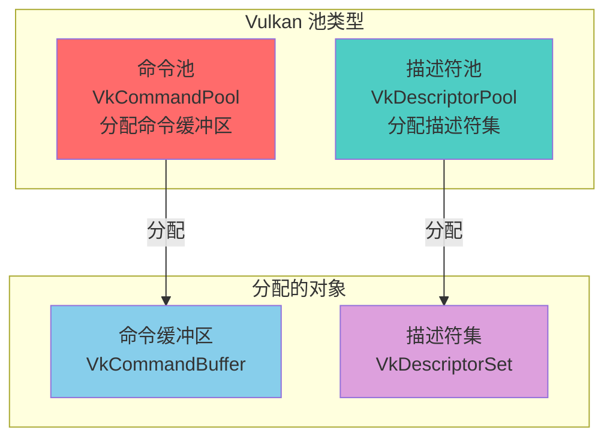
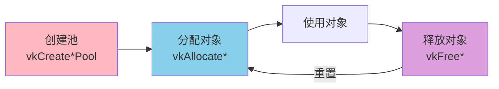
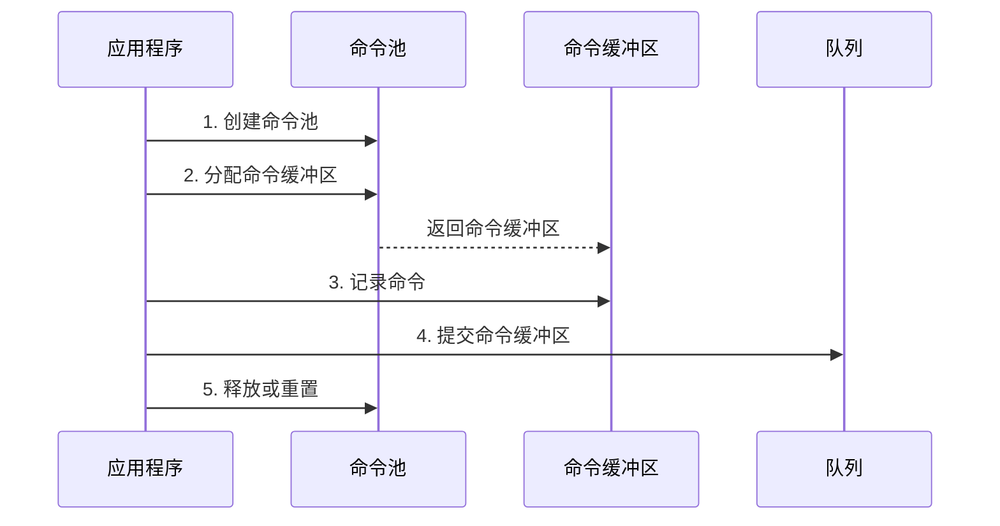
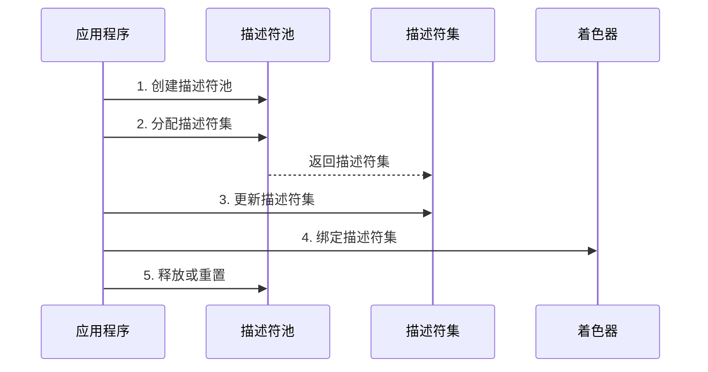
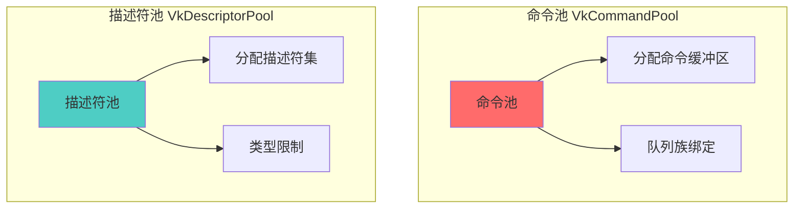
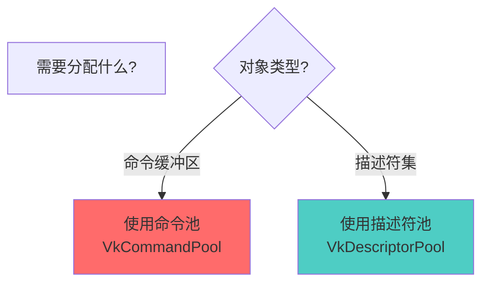
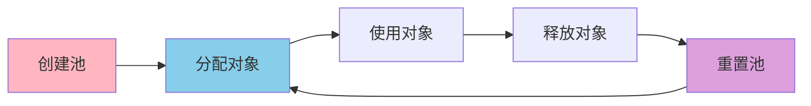

# Vulkan 池详细分析文档

## 目录
1. [Vulkan 中的池类型总览](#vulkan-中的池类型总览)
2. [池是什么？用生活例子理解](#池是什么用生活例子理解)
3. [命令池（Command Pool）](#命令池command-pool)
4. [描述符池（Descriptor Pool）](#描述符池descriptor-pool)
5. [池的对比与选择](#池的对比与选择)
6. [池的管理策略](#池的管理策略)
7. [实际代码示例](#实际代码示例)
8. [最佳实践](#最佳实践)

---

## Vulkan 中的池类型总览

### 池类型概述

在 Vulkan 中，**池（Pool）**是一种内存管理机制，用于高效地分配和管理特定类型的对象。Vulkan 提供了两种主要的池类型：



### 所有池类型列表

| 池类型 | 枚举/句柄 | 分配的对象 | 版本要求 | 主要用途 |
|--------|----------|-----------|---------|---------|
| **命令池** | `VkCommandPool` | `VkCommandBuffer` | Vulkan 1.0 | 分配命令缓冲区 |
| **描述符池** | `VkDescriptorPool` | `VkDescriptorSet` | Vulkan 1.0 | 分配描述符集 |

### 池的核心特点

- **池化分配**: 预先分配内存，提高分配效率
- **类型特定**: 每种池只能分配特定类型的对象
- **生命周期管理**: 池管理其分配对象的生命周期
- **重置支持**: 可以重置池以重用内存
- **性能优化**: 减少内存分配开销

---

## 池是什么？用生活例子理解

### 🏭 最简单的理解：池 = 资源仓库

想象你在管理一个工厂：

```
工厂（GPU）                仓库（池）              工具（分配的对象）
    │                            │                          │
    │  1. 创建仓库                │                          │
    │     （创建池）               │                          │
    │                            │                          │
    │  2. 从仓库领取工具          │                          │
    │     （分配对象）             │                          │
    │                            │                          │
    │  3. 使用工具                │                          │
    │     （使用对象）             │                          │
    │                            │                          │
    │  4. 归还工具到仓库          │                          │
    │     （释放对象）             │                          │
```

**池（Pool）就像资源仓库**：
- **创建池** = 准备一个仓库
- **分配对象** = 从仓库领取工具
- **使用对象** = 使用工具工作
- **释放对象** = 归还工具到仓库

### 📚 更具体的例子：图书馆管理系统

想象你在管理一个图书馆：

```
图书馆（GPU）              书架（池）              书籍（分配的对象）
    │                            │                          │
    │  1. 准备书架                │                          │
    │     （创建池）               │                          │
    │                            │                          │
    │  2. 从书架取书              │                          │
    │     （分配对象）             │                          │
    │                            │                          │
    │  3. 阅读书籍                │                          │
    │     （使用对象）             │                          │
    │                            │                          │
    │  4. 归还书籍到书架          │                          │
    │     （释放对象）             │                          │
```

### 🎮 游戏例子：道具背包

想象你在玩游戏，有道具背包：

```
角色（GPU）                背包（池）              道具（分配的对象）
    │                            │                          │
    │  1. 准备背包                │                          │
    │     （创建池）               │                          │
    │                            │                          │
    │  2. 从背包拿道具            │                          │
    │     （分配对象）             │                          │
    │                            │                          │
    │  3. 使用道具                │                          │
    │     （使用对象）             │                          │
    │                            │                          │
    │  4. 放回背包                │                          │
    │     （释放对象）             │                          │
```

### 💻 在Vulkan中的实际场景

#### 场景1：命令池和命令缓冲区

```cpp
// 1. 创建命令池（准备仓库）
VkCommandPoolCreateInfo poolInfo{};
poolInfo.queueFamilyIndex = graphicsQueueFamilyIndex;
VkCommandPool commandPool;
vkCreateCommandPool(device, &poolInfo, nullptr, &commandPool);

// 2. 从命令池分配命令缓冲区（从仓库领取工具）
VkCommandBufferAllocateInfo allocInfo{};
allocInfo.commandPool = commandPool;
allocInfo.level = VK_COMMAND_BUFFER_LEVEL_PRIMARY;
allocInfo.commandBufferCount = 1;
VkCommandBuffer commandBuffer;
vkAllocateCommandBuffers(device, &allocInfo, &commandBuffer);

// 3. 使用命令缓冲区（使用工具）
vkBeginCommandBuffer(commandBuffer, ...);
vkCmdDraw(commandBuffer, ...);
vkEndCommandBuffer(commandBuffer);

// 4. 释放命令缓冲区（归还工具）
vkFreeCommandBuffers(device, commandPool, 1, &commandBuffer);
```

#### 场景2：描述符池和描述符集

```cpp
// 1. 创建描述符池（准备仓库）
VkDescriptorPoolSize poolSize{};
poolSize.type = VK_DESCRIPTOR_TYPE_UNIFORM_BUFFER;
poolSize.descriptorCount = 10;
VkDescriptorPoolCreateInfo poolInfo{};
poolInfo.poolSizeCount = 1;
poolInfo.pPoolSizes = &poolSize;
poolInfo.maxSets = 10;
VkDescriptorPool descriptorPool;
vkCreateDescriptorPool(device, &poolInfo, nullptr, &descriptorPool);

// 2. 从描述符池分配描述符集（从仓库领取工具）
VkDescriptorSetAllocateInfo allocInfo{};
allocInfo.descriptorPool = descriptorPool;
allocInfo.descriptorSetCount = 1;
allocInfo.pSetLayouts = &descriptorSetLayout;
VkDescriptorSet descriptorSet;
vkAllocateDescriptorSets(device, &allocInfo, &descriptorSet);

// 3. 使用描述符集（使用工具）
vkUpdateDescriptorSets(device, ...);
vkCmdBindDescriptorSets(commandBuffer, ...);

// 4. 释放描述符集（归还工具）
vkFreeDescriptorSets(device, descriptorPool, 1, &descriptorSet);
```

### 🎯 池的关键概念



### ✅ 总结：池就是什么？

**一句话总结**：池（Pool）就是**对象的"资源仓库"**，用于高效地分配和管理特定类型的对象。

**三个关键词**：
1. **内存管理** - 池管理对象的内存分配
2. **类型特定** - 每种池只能分配特定类型的对象
3. **性能优化** - 池化分配提高效率

**记住这个公式**：
```
创建池 → 分配对象 → 使用对象 → 释放对象 → 重置池（可选）
```

**常见使用场景**：
- ✅ 命令缓冲区分配（命令池）
- ✅ 描述符集分配（描述符池）
- ✅ 批量对象管理
- ✅ 内存重用

---

## 命令池（Command Pool）

### 命令池概述

**VkCommandPool** 是用于分配命令缓冲区的池。它管理命令缓冲区的内存，并确保命令缓冲区只能提交到特定队列族的队列。

### 命令池的特点

- **队列族绑定**: 与特定队列族关联
- **命令缓冲区分配**: 从池中分配命令缓冲区
- **内存管理**: 管理命令缓冲区的内存
- **重置支持**: 可以重置池以重用内存
- **线程不安全**: 同一命令池不能多线程同时操作

### 命令池的创建

```cpp
VkCommandPoolCreateInfo poolInfo{};
poolInfo.sType = VK_STRUCTURE_TYPE_COMMAND_POOL_CREATE_INFO;
poolInfo.queueFamilyIndex = graphicsQueueFamilyIndex;  // 队列族索引
poolInfo.flags = VK_COMMAND_POOL_CREATE_RESET_COMMAND_BUFFER_BIT;  // 创建标志

VkCommandPool commandPool;
vkCreateCommandPool(device, &poolInfo, nullptr, &commandPool);
```

### 命令池的使用流程



### 命令池的创建标志

| 标志 | 说明 |
|------|------|
| `0` | 默认标志 |
| `VK_COMMAND_POOL_CREATE_TRANSIENT_BIT` | 命令缓冲区经常重置 |
| `VK_COMMAND_POOL_CREATE_RESET_COMMAND_BUFFER_BIT` | 允许单独重置命令缓冲区 |

### 命令池的重置

```cpp
// 重置命令池（释放所有命令缓冲区）
vkResetCommandPool(device, commandPool, 0);

// 现在可以重新分配命令缓冲区
vkAllocateCommandBuffers(device, &allocInfo, &commandBuffer);
```

### 命令池的销毁

```cpp
// 销毁命令池（会自动释放所有命令缓冲区）
vkDestroyCommandPool(device, commandPool, nullptr);
```

---

## 描述符池（Descriptor Pool）

### 描述符池概述

**VkDescriptorPool** 是用于分配描述符集的池。它管理描述符集的内存，并限制可以分配的描述符数量和类型。

### 描述符池的特点

- **类型限制**: 指定可以分配的描述符类型和数量
- **描述符集分配**: 从池中分配描述符集
- **内存管理**: 管理描述符集的内存
- **重置支持**: 可以重置池以重用内存
- **线程安全**: 可以从多个线程分配描述符集

### 描述符池的创建

```cpp
// 定义池大小
std::vector<VkDescriptorPoolSize> poolSizes;
poolSizes.push_back({
    VK_DESCRIPTOR_TYPE_UNIFORM_BUFFER,      // 类型
    10                                       // 数量
});
poolSizes.push_back({
    VK_DESCRIPTOR_TYPE_COMBINED_IMAGE_SAMPLER,
    10
});

// 创建描述符池
VkDescriptorPoolCreateInfo poolInfo{};
poolInfo.sType = VK_STRUCTURE_TYPE_DESCRIPTOR_POOL_CREATE_INFO;
poolInfo.poolSizeCount = static_cast<uint32_t>(poolSizes.size());
poolInfo.pPoolSizes = poolSizes.data();
poolInfo.maxSets = 10;  // 最多可以分配10个描述符集

VkDescriptorPool descriptorPool;
vkCreateDescriptorPool(device, &poolInfo, nullptr, &descriptorPool);
```

### 描述符池的使用流程



### 描述符池的创建标志

| 标志 | 说明 |
|------|------|
| `0` | 默认标志 |
| `VK_DESCRIPTOR_POOL_CREATE_FREE_DESCRIPTOR_SET_BIT` | 允许释放单个描述符集 |

### 描述符池的重置

```cpp
// 重置描述符池（释放所有描述符集）
vkResetDescriptorPool(device, descriptorPool, 0);

// 现在可以重新分配描述符集
vkAllocateDescriptorSets(device, &allocInfo, &descriptorSet);
```

### 描述符池的销毁

```cpp
// 销毁描述符池（会自动释放所有描述符集）
vkDestroyDescriptorPool(device, descriptorPool, nullptr);
```

---

## 池的对比与选择

### 命令池 vs 描述符池



### 对比表格

| 特性 | 命令池 | 描述符池 |
|------|--------|---------|
| **分配对象** | VkCommandBuffer | VkDescriptorSet |
| **绑定关系** | 队列族 | 无 |
| **线程安全** | 否 | 是 |
| **重置方式** | 池或单个缓冲区 | 池或单个描述符集 |
| **使用频率** | 每帧 | 初始化时 |
| **生命周期** | 短（每帧） | 长（整个应用） |

### 池的选择指南



---

## 池的管理策略

### 策略 1: 单池管理

```cpp
// 为整个应用创建一个命令池
VkCommandPool commandPool;
vkCreateCommandPool(device, &poolInfo, nullptr, &commandPool);

// 为整个应用创建一个描述符池
VkDescriptorPool descriptorPool;
vkCreateDescriptorPool(device, &poolInfo, nullptr, &descriptorPool);
```

**优点**:
- 简单易用
- 资源集中管理

**缺点**:
- 可能成为性能瓶颈
- 不适合多线程

### 策略 2: 多池管理

```cpp
// 为每个队列族创建命令池
std::unordered_map<uint32_t, VkCommandPool> commandPools;
for (uint32_t i = 0; i < queueFamilyCount; i++) {
    VkCommandPool pool;
    vkCreateCommandPool(device, &poolInfo, nullptr, &pool);
    commandPools[i] = pool;
}

// 为不同用途创建描述符池
VkDescriptorPool staticPool;  // 静态资源
VkDescriptorPool dynamicPool;  // 动态资源
```

**优点**:
- 更好的性能
- 支持多线程
- 资源隔离

**缺点**:
- 管理复杂
- 需要更多内存

### 策略 3: 每线程池管理

```cpp
// 每个线程创建自己的命令池
class ThreadCommandPool {
private:
    VkCommandPool commandPool;
    
public:
    void init(uint32_t queueFamilyIndex) {
        VkCommandPoolCreateInfo poolInfo{};
        poolInfo.queueFamilyIndex = queueFamilyIndex;
        vkCreateCommandPool(device, &poolInfo, nullptr, &commandPool);
    }
};
```

**优点**:
- 完全线程安全
- 无竞争条件

**缺点**:
- 需要更多内存
- 管理复杂

---

## 实际代码示例

### 示例 1: 命令池管理器

```cpp
class CommandPoolManager {
private:
    VkDevice device;
    std::unordered_map<uint32_t, VkCommandPool> pools;
    
public:
    void init(VkDevice dev) {
        device = dev;
    }
    
    VkCommandPool getPool(uint32_t queueFamilyIndex) {
        if (pools.find(queueFamilyIndex) == pools.end()) {
            VkCommandPoolCreateInfo poolInfo{};
            poolInfo.sType = VK_STRUCTURE_TYPE_COMMAND_POOL_CREATE_INFO;
            poolInfo.queueFamilyIndex = queueFamilyIndex;
            poolInfo.flags = VK_COMMAND_POOL_CREATE_RESET_COMMAND_BUFFER_BIT;
            
            VkCommandPool pool;
            vkCreateCommandPool(device, &poolInfo, nullptr, &pool);
            pools[queueFamilyIndex] = pool;
        }
        return pools[queueFamilyIndex];
    }
    
    void cleanup() {
        for (auto& [index, pool] : pools) {
            vkDestroyCommandPool(device, pool, nullptr);
        }
        pools.clear();
    }
};
```

### 示例 2: 描述符池管理器

```cpp
class DescriptorPoolManager {
private:
    VkDevice device;
    VkDescriptorPool descriptorPool;
    
public:
    void init(VkDevice dev) {
        device = dev;
        
        std::vector<VkDescriptorPoolSize> poolSizes = {
            {VK_DESCRIPTOR_TYPE_UNIFORM_BUFFER, 100},
            {VK_DESCRIPTOR_TYPE_COMBINED_IMAGE_SAMPLER, 100}
        };
        
        VkDescriptorPoolCreateInfo poolInfo{};
        poolInfo.sType = VK_STRUCTURE_TYPE_DESCRIPTOR_POOL_CREATE_INFO;
        poolInfo.poolSizeCount = static_cast<uint32_t>(poolSizes.size());
        poolInfo.pPoolSizes = poolSizes.data();
        poolInfo.maxSets = 100;
        
        vkCreateDescriptorPool(device, &poolInfo, nullptr, &descriptorPool);
    }
    
    VkDescriptorSet allocate(VkDescriptorSetLayout layout) {
        VkDescriptorSetAllocateInfo allocInfo{};
        allocInfo.sType = VK_STRUCTURE_TYPE_DESCRIPTOR_SET_ALLOCATE_INFO;
        allocInfo.descriptorPool = descriptorPool;
        allocInfo.descriptorSetCount = 1;
        allocInfo.pSetLayouts = &layout;
        
        VkDescriptorSet descriptorSet;
        vkAllocateDescriptorSets(device, &allocInfo, &descriptorSet);
        return descriptorSet;
    }
    
    void cleanup() {
        vkDestroyDescriptorPool(device, descriptorPool, nullptr);
    }
};
```

### 示例 3: 多帧并发池管理

```cpp
class FramePoolManager {
private:
    VkDevice device;
    VkCommandPool commandPool;
    VkDescriptorPool descriptorPool;
    std::vector<VkCommandBuffer> commandBuffers;
    std::vector<VkDescriptorSet> descriptorSets;
    uint32_t maxFramesInFlight;
    
public:
    void init(VkDevice dev, uint32_t queueFamilyIndex, uint32_t maxFrames) {
        device = dev;
        maxFramesInFlight = maxFrames;
        
        // 创建命令池
        VkCommandPoolCreateInfo cmdPoolInfo{};
        cmdPoolInfo.queueFamilyIndex = queueFamilyIndex;
        cmdPoolInfo.flags = VK_COMMAND_POOL_CREATE_RESET_COMMAND_BUFFER_BIT;
        vkCreateCommandPool(device, &cmdPoolInfo, nullptr, &commandPool);
        
        // 分配命令缓冲区
        commandBuffers.resize(maxFrames);
        VkCommandBufferAllocateInfo cmdAllocInfo{};
        cmdAllocInfo.commandPool = commandPool;
        cmdAllocInfo.level = VK_COMMAND_BUFFER_LEVEL_PRIMARY;
        cmdAllocInfo.commandBufferCount = maxFrames;
        vkAllocateCommandBuffers(device, &cmdAllocInfo, commandBuffers.data());
        
        // 创建描述符池
        std::vector<VkDescriptorPoolSize> poolSizes = {
            {VK_DESCRIPTOR_TYPE_UNIFORM_BUFFER, maxFrames}
        };
        VkDescriptorPoolCreateInfo descPoolInfo{};
        descPoolInfo.poolSizeCount = static_cast<uint32_t>(poolSizes.size());
        descPoolInfo.pPoolSizes = poolSizes.data();
        descPoolInfo.maxSets = maxFrames;
        vkCreateDescriptorPool(device, &descPoolInfo, nullptr, &descriptorPool);
    }
    
    VkCommandBuffer getCommandBuffer(uint32_t frameIndex) {
        return commandBuffers[frameIndex];
    }
    
    void cleanup() {
        vkDestroyCommandPool(device, commandPool, nullptr);
        vkDestroyDescriptorPool(device, descriptorPool, nullptr);
    }
};
```

---

## 最佳实践

### 1. 命令池管理

**DO**:
- ✅ 为每个队列族创建独立的命令池
- ✅ 使用 `RESET_COMMAND_BUFFER_BIT` 标志
- ✅ 重用命令缓冲区
- ✅ 在适当时机重置命令池

**DON'T**:
- ❌ 跨队列族使用命令池
- ❌ 频繁创建/销毁命令池
- ❌ 在多线程中共享命令池
- ❌ 忘记释放命令缓冲区

### 2. 描述符池管理

**DO**:
- ✅ 预先分配足够的描述符
- ✅ 使用 `FREE_DESCRIPTOR_SET_BIT` 标志（如果需要）
- ✅ 正确计算池大小
- ✅ 重用描述符池

**DON'T**:
- ❌ 分配过少导致失败
- ❌ 频繁创建/销毁池
- ❌ 忘记重置池
- ❌ 忽略描述符类型限制

### 3. 性能优化

```cpp
// ✅ 好的做法：批量分配
VkCommandBufferAllocateInfo allocInfo{};
allocInfo.commandBufferCount = 10;
vkAllocateCommandBuffers(device, &allocInfo, buffers.data());

// ❌ 不好的做法：逐个分配
for (int i = 0; i < 10; i++) {
    vkAllocateCommandBuffers(device, &allocInfo, &buffers[i]);
}
```

### 4. 多线程策略

```cpp
// ✅ 好的做法：每线程一个命令池
class ThreadCommandPool {
    VkCommandPool commandPool;  // 每个线程独立
};

// ❌ 不好的做法：多线程共享命令池
VkCommandPool sharedPool;  // 多线程共享（不安全）
```

### 5. 常见陷阱

| 陷阱 | 问题 | 解决方案 |
|------|------|----------|
| 忘记创建池 | 无法分配对象 | 在初始化时创建池 |
| 池大小不足 | 分配失败 | 预先计算足够的池大小 |
| 跨队列族使用 | 错误 | 为每个队列族创建独立池 |
| 多线程竞争 | 数据竞争 | 每线程使用独立池 |
| 忘记重置池 | 内存泄漏 | 在适当时机重置池 |

---

## 总结

### 池的关键要点

1. **两种池类型**: 命令池和描述符池
2. **池化分配**: 提高分配效率
3. **类型特定**: 每种池只能分配特定类型的对象
4. **生命周期管理**: 池管理其分配对象的生命周期
5. **重置支持**: 可以重置池以重用内存

### 池的使用流程



### 池类型总结

| 池类型 | 分配对象 | 主要用途 | 线程安全 |
|--------|---------|---------|---------|
| **命令池** | 命令缓冲区 | 记录GPU命令 | 否 |
| **描述符池** | 描述符集 | 绑定资源到着色器 | 是 |

### 进一步学习

- 深入了解命令缓冲区管理
- 学习描述符系统
- 研究多线程池管理
- 探索性能优化技巧
- 了解内存管理最佳实践

---

**文档版本**: 1.0  
**最后更新**: 2025  
**相关文档**: 
- [VkCommandPool 详细分析](./VkDevice/命令管理/VkCommandPool详细分析.md)
- [Vulkan 描述符和描述符集详细分析](./VkDevice/设备操作/Vulkan描述符和描述符集详细分析.md)
- [Vulkan 命令管理架构设计](./VkDevice/命令管理/Vulkan命令管理架构设计.md)


