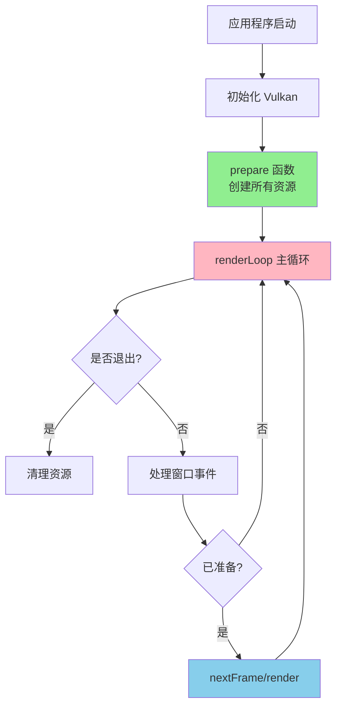
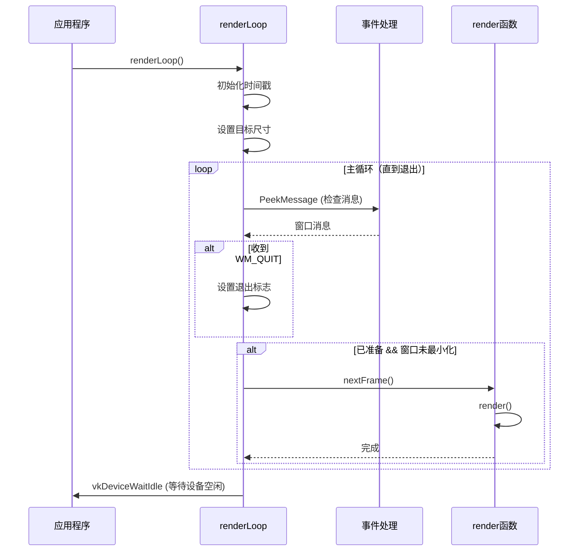
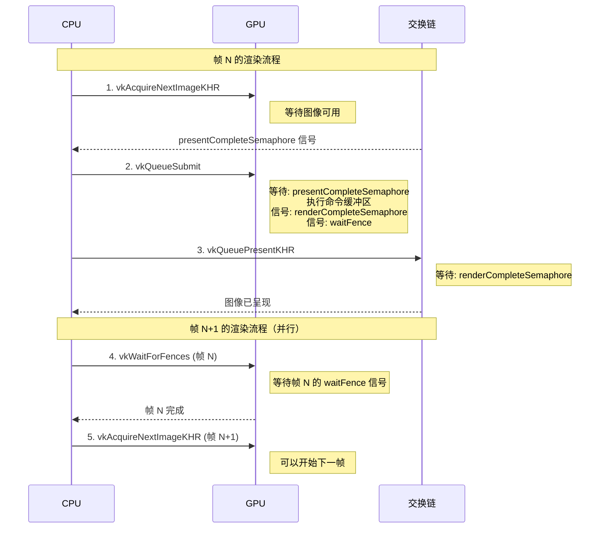
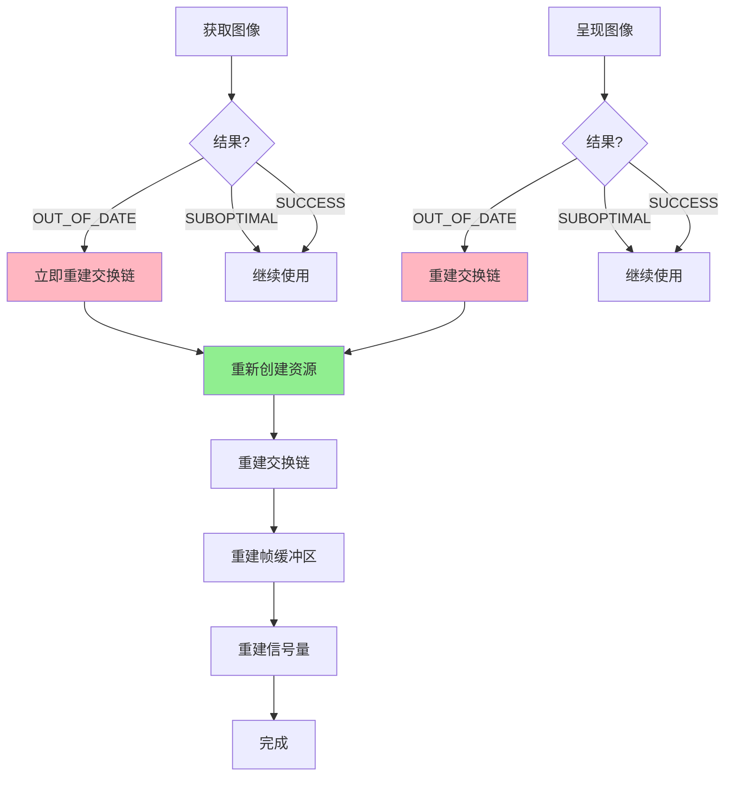

# Vulkan 渲染循环完整流程

根据 `vulkanexamplebase.cpp` 整理的完整渲染循环流程图

---

## 渲染循环整体架构



---

## 主渲染循环 (renderLoop)

### Windows 平台示例



---

## 单帧渲染流程 (triangle.cpp render 函数)

### 完整流程图（基于 triangle.cpp）

```mermaid
graph TB
    Start["开始渲染一帧<br/>render override"] --> CheckPrepared{prepared?}
    CheckPrepared -->|否| End["返回"]
    
    CheckPrepared -->|是| WaitFence["等待栅栏<br/>vkWaitForFences<br/>waitFences[currentFrame]"]
    WaitFence --> ResetFence["重置栅栏<br/>vkResetFences<br/>waitFences[currentFrame]"]
    
    ResetFence --> AcquireImage["获取交换链图像<br/>vkAcquireNextImageKHR<br/>等待: presentCompleteSemaphores[currentFrame]<br/>返回: imageIndex"]
    
    AcquireImage --> CheckAcquire{获取结果?}
    CheckAcquire -->|OUT_OF_DATE| Resize1["windowResize<br/>重建交换链"]
    CheckAcquire -->|SUBOPTIMAL| Continue1["继续"]
    CheckAcquire -->|SUCCESS| Continue1
    CheckAcquire -->|其他错误| Throw1["抛出异常"]
    
    Resize1 --> End
    Throw1 --> End
    
    Continue1 --> UpdateUniform["更新统一缓冲区<br/>memcpy shaderData<br/>projectionMatrix, viewMatrix, modelMatrix"]
    
    UpdateUniform --> ResetCmdBuf["重置命令缓冲区<br/>vkResetCommandBuffer<br/>commandBuffers[currentFrame]"]
    ResetCmdBuf --> BeginCmdBuf["开始记录命令<br/>vkBeginCommandBuffer<br/>VkCommandBufferBeginInfo"]
    
    BeginCmdBuf --> PrepareRenderPass["准备渲染通道信息<br/>VkRenderPassBeginInfo<br/>设置清除值 clearValues[2]<br/>设置 framebuffers[imageIndex]"]
    
    PrepareRenderPass --> BeginRenderPass["开始渲染通道<br/>vkCmdBeginRenderPass<br/>VK_SUBPASS_CONTENTS_INLINE"]
    
    BeginRenderPass --> SetViewport["设置视口<br/>vkCmdSetViewport<br/>width, height, minDepth, maxDepth"]
    SetViewport --> SetScissor["设置裁剪矩形<br/>vkCmdSetScissor<br/>extent, offset"]
    
    SetScissor --> BindDesc["绑定描述符集<br/>vkCmdBindDescriptorSets<br/>uniformBuffers[currentFrame].descriptorSet"]
    BindDesc --> BindPipeline["绑定管线<br/>vkCmdBindPipeline<br/>VK_PIPELINE_BIND_POINT_GRAPHICS"]
    BindPipeline --> BindVertex["绑定顶点缓冲区<br/>vkCmdBindVertexBuffers<br/>vertices.buffer"]
    BindVertex --> BindIndex["绑定索引缓冲区<br/>vkCmdBindIndexBuffer<br/>indices.buffer, VK_INDEX_TYPE_UINT32"]
    
    BindIndex --> Draw["绘制图元<br/>vkCmdDrawIndexed<br/>indices.count, 1, 0, 0, 0"]
    
    Draw --> EndRenderPass["结束渲染通道<br/>vkCmdEndRenderPass<br/>自动转换到 PRESENT_SRC_KHR"]
    
    EndRenderPass --> EndCmdBuf["结束记录命令<br/>vkEndCommandBuffer"]
    
    EndCmdBuf --> PrepareSubmit["准备提交信息<br/>VkSubmitInfo<br/>等待阶段: COLOR_ATTACHMENT_OUTPUT<br/>等待信号量: presentCompleteSemaphores[currentFrame]<br/>信号信号量: renderCompleteSemaphores[imageIndex]"]
    
    PrepareSubmit --> SubmitQueue["提交到队列<br/>vkQueueSubmit<br/>waitFences[currentFrame]"]
    
    SubmitQueue --> PreparePresent["准备呈现信息<br/>VkPresentInfoKHR<br/>等待信号量: renderCompleteSemaphores[imageIndex]"]
    
    PreparePresent --> Present["呈现图像<br/>vkQueuePresentKHR"]
    
    Present --> CheckPresent{呈现结果?}
    CheckPresent -->|OUT_OF_DATE| Resize2["windowResize"]
    CheckPresent -->|SUBOPTIMAL| Resize2
    CheckPresent -->|SUCCESS| UpdateFrame
    CheckPresent -->|其他错误| Throw2["抛出异常"]
    
    Resize2 --> End
    Throw2 --> End
    
    UpdateFrame --> UpdateCurrentFrame["currentFrame = <br/>currentFrame + 1 % MAX_CONCURRENT_FRAMES"]
    UpdateCurrentFrame --> End
    
    style WaitFence fill:#FFB6C1
    style AcquireImage fill:#87CEEB
    style SubmitQueue fill:#90EE90
    style Present fill:#DDA0DD
    style Draw fill:#FFA500
```



---

## 详细步骤说明

### 阶段 1: 同步准备

```
┌─────────────────────────────────────────────────────────┐
│  1. 等待栅栏 (vkWaitForFences)                         │
│     - 确保上一帧的命令缓冲区已完成执行                  │
│     - 防止重复使用正在执行的命令缓冲区                   │
│                                                          │
│  2. 重置栅栏 (vkResetFences)                           │
│     - 准备用于下一帧的同步                              │
└─────────────────────────────────────────────────────────┘
```

### 阶段 2: 获取渲染目标

```
┌─────────────────────────────────────────────────────────┐
│  3. 获取交换链图像 (vkAcquireNextImageKHR)             │
│     - 直接调用 vkAcquireNextImageKHR                    │
│     - 等待信号量: presentCompleteSemaphores[currentFrame]│
│     - 返回图像索引: imageIndex                          │
│     - 超时: UINT64_MAX (无限等待)                       │
│                                                          │
│  可能的结果:                                            │
│    ✓ SUCCESS: 成功获取                                 │
│    ✓ SUBOPTIMAL: 次优（可继续使用）                    │
│    ✗ OUT_OF_DATE: 过期（调用 windowResize 并返回）     │
│    ✗ 其他错误: 抛出异常                                 │
│                                                          │
│  注意: triangle.cpp 中没有 updateOverlay 调用          │
└─────────────────────────────────────────────────────────┘
```

### 阶段 3: 更新数据

```
┌─────────────────────────────────────────────────────────┐
│  4. 更新统一缓冲区 (Uniform Buffer)                    │
│     - 创建 ShaderData 结构                              │
│     - 设置 projectionMatrix = camera.matrices.perspective│
│     - 设置 viewMatrix = camera.matrices.view          │
│     - 设置 modelMatrix = glm::mat4(1.0f) (单位矩阵)    │
│     - 通过 memcpy 复制到映射内存                        │
│       uniformBuffers[currentFrame].mapped              │
│     - 注意: 使用主机一致性内存，写入对 GPU 立即可见      │
└─────────────────────────────────────────────────────────┘
```

### 阶段 4: 记录命令

```
┌─────────────────────────────────────────────────────────┐
│  5. 重置命令缓冲区                                      │
│     vkResetCommandBuffer(commandBuffers[currentFrame], 0)│
│                                                          │
│  6. 开始记录命令                                        │
│     vkBeginCommandBuffer                                 │
│     - VkCommandBufferBeginInfo                           │
│                                                          │
│  7. 准备渲染通道信息                                    │
│     VkRenderPassBeginInfo:                              │
│     - renderPass: renderPass                            │
│     - framebuffer: frameBuffers[imageIndex]              │
│     - renderArea: {0, 0, width, height}                  │
│     - clearValues[2]:                                    │
│       [0]: color = {0.0f, 0.0f, 0.2f, 1.0f} (深蓝色)    │
│       [1]: depthStencil = {1.0f, 0}                      │
│                                                          │
│  8. 开始渲染通道                                        │
│     vkCmdBeginRenderPass                                 │
│     - VK_SUBPASS_CONTENTS_INLINE (内联命令)             │
│                                                          │
│  9. 设置动态状态                                        │
│     vkCmdSetViewport:                                    │
│       width, height, minDepth=0.0, maxDepth=1.0        │
│     vkCmdSetScissor:                                     │
│       extent={width, height}, offset={0, 0}              │
│                                                          │
│  10. 绑定资源                                           │
│      vkCmdBindDescriptorSets:                            │
│        uniformBuffers[currentFrame].descriptorSet       │
│      vkCmdBindPipeline:                                 │
│        VK_PIPELINE_BIND_POINT_GRAPHICS, pipeline        │
│      vkCmdBindVertexBuffers:                            │
│        vertices.buffer, offset=0                        │
│      vkCmdBindIndexBuffer:                              │
│        indices.buffer, VK_INDEX_TYPE_UINT32            │
│                                                          │
│  11. 绘制图元                                           │
│      vkCmdDrawIndexed:                                  │
│        indexCount=indices.count                         │
│        instanceCount=1                                  │
│        firstIndex=0, vertexOffset=0, firstInstance=0    │
│                                                          │
│  12. 结束渲染通道                                       │
│      vkCmdEndRenderPass                                 │
│      - 自动添加图像布局转换屏障                          │
│      - 转换到 PRESENT_SRC_KHR 布局                      │
│                                                          │
│  13. 结束记录命令                                       │
│      vkEndCommandBuffer                                 │
│                                                          │
│  注意: triangle.cpp 中没有 drawUI 调用                  │
└─────────────────────────────────────────────────────────┘
```

### 阶段 5: 提交执行

```
┌─────────────────────────────────────────────────────────┐
│  14. 准备提交信息                                       │
│      VkSubmitInfo:                                      │
│      - pWaitDstStageMask:                               │
│        VK_PIPELINE_STAGE_COLOR_ATTACHMENT_OUTPUT_BIT    │
│      - pWaitSemaphores:                                 │
│        presentCompleteSemaphores[currentFrame]          │
│      - waitSemaphoreCount: 1                            │
│      - pCommandBuffers: &commandBuffer                  │
│      - commandBufferCount: 1                            │
│      - pSignalSemaphores:                               │
│        renderCompleteSemaphores[imageIndex]              │
│      - signalSemaphoreCount: 1                          │
│                                                          │
│  15. 提交到队列 (vkQueueSubmit)                         │
│      - queue: queue                                     │
│      - submitCount: 1                                    │
│      - fence: waitFences[currentFrame]                  │
│                                                          │
│  同步机制:                                               │
│  1. 等待 presentCompleteSemaphores[currentFrame] 信号  │
│     （确保交换链图像可用）                               │
│  2. 在 COLOR_ATTACHMENT_OUTPUT 阶段等待                 │
│  3. 执行命令缓冲区                                       │
│  4. 信号 renderCompleteSemaphores[imageIndex]          │
│     （渲染完成）                                         │
│  5. 信号 waitFences[currentFrame]                       │
│     （命令缓冲区执行完成）                               │
└─────────────────────────────────────────────────────────┘
```

### 阶段 6: 呈现图像

```
┌─────────────────────────────────────────────────────────┐
│  16. 准备呈现信息                                       │
│      VkPresentInfoKHR:                                  │
│      - waitSemaphoreCount: 1                            │
│      - pWaitSemaphores:                                 │
│        renderCompleteSemaphores[imageIndex]            │
│      - swapchainCount: 1                                 │
│      - pSwapchains: &swapChain.swapChain                 │
│      - pImageIndices: &imageIndex                        │
│                                                          │
│  17. 呈现图像 (vkQueuePresentKHR)                       │
│      - queue: queue                                      │
│                                                          │
│  同步机制:                                               │
│  - 等待 renderCompleteSemaphores[imageIndex] 信号       │
│    （确保渲染完成）                                      │
│  - 将图像呈现到窗口                                      │
│                                                          │
│  可能的结果:                                            │
│    ✓ SUCCESS: 成功呈现                                  │
│    ✓ SUBOPTIMAL: 次优（调用 windowResize）              │
│    ✗ OUT_OF_DATE: 过期（调用 windowResize）             │
│    ✗ 其他错误: 抛出异常                                  │
└─────────────────────────────────────────────────────────┘
```

### 阶段 7: 更新状态

```
┌─────────────────────────────────────────────────────────┐
│  18. 更新帧索引                                         │
│      currentFrame = (currentFrame + 1) %                │
│                        MAX_CONCURRENT_FRAMES            │
│      - 循环使用命令缓冲区                                │
│      - 实现帧重叠（CPU/GPU 并行）                        │
│      - 注意: triangle.cpp 使用 currentFrame             │
│        而不是 currentBuffer                             │
│                                                          │
│  注意: triangle.cpp 的 render() 函数中不包含:           │
│    - 更新计时器（在 nextFrame 中处理）                   │
│    - 更新相机（在 nextFrame 中处理）                     │
│    - 更新 FPS（在 nextFrame 中处理）                     │
└─────────────────────────────────────────────────────────┘
```

---

## 同步原语的使用

### 信号量和栅栏的作用



### 同步原语说明

| 同步原语 | 用途 | 使用位置 |
|---------|------|---------|
| **presentCompleteSemaphore** | 等待交换链图像可用 | vkAcquireNextImageKHR 后信号<br/>vkQueueSubmit 前等待 |
| **renderCompleteSemaphore** | 等待渲染完成 | vkQueueSubmit 后信号<br/>vkQueuePresentKHR 前等待 |
| **waitFence** | 等待命令缓冲区执行完成 | vkQueueSubmit 后信号<br/>下一帧 vkWaitForFences 等待 |

---

## 帧重叠机制 (Frame Overlap)

### MAX_CONCURRENT_FRAMES = 2 的示例

```
时间线:
┌─────────────────────────────────────────────────────────┐
│  CPU 时间线                                              │
├─────────────────────────────────────────────────────────┤
│  帧 0: [准备] [记录命令] [提交]                          │
│  帧 1:        [准备] [记录命令] [提交]                    │
│  帧 2:                 [准备] [记录命令] [提交]           │
│                                                          │
│  GPU 时间线                                              │
├─────────────────────────────────────────────────────────┤
│  帧 0: [执行命令缓冲区]                                  │
│  帧 1:        [执行命令缓冲区]                            │
│  帧 2:                 [执行命令缓冲区]                   │
│                                                          │
│  说明:                                                    │
│  - CPU 可以在 GPU 执行帧 N 时准备帧 N+1                  │
│  - 提高 CPU/GPU 并行度                                   │
│  - 需要 MAX_CONCURRENT_FRAMES 个命令缓冲区               │
└─────────────────────────────────────────────────────────┘
```

---

## 错误处理和窗口调整大小

### 交换链过期处理



---

## 关键函数调用顺序

### triangle.cpp 的完整函数调用链

```
renderLoop()
  │
  ├─→ nextFrame() 或 render()
  │     │
  │     └─→ render() override [triangle.cpp 实现]
  │           │
  │           ├─→ 检查 prepared
  │           │
  │           ├─→ vkWaitForFences(device, 1, 
  │           │                    &waitFences[currentFrame], 
  │           │                    VK_TRUE, UINT64_MAX)
  │           │
  │           ├─→ vkResetFences(device, 1, 
  │           │                  &waitFences[currentFrame])
  │           │
  │           ├─→ vkAcquireNextImageKHR(device, 
  │           │                          swapChain.swapChain, 
  │           │                          UINT64_MAX,
  │           │                          presentCompleteSemaphores[currentFrame],
  │           │                          VK_NULL_HANDLE, 
  │           │                          &imageIndex)
  │           │     ├─→ 如果 OUT_OF_DATE: windowResize() 并返回
  │           │     └─→ 如果其他错误: 抛出异常
  │           │
  │           ├─→ 更新统一缓冲区
  │           │     └─→ memcpy(uniformBuffers[currentFrame].mapped, 
  │           │                 &shaderData, 
  │           │                 sizeof(ShaderData))
  │           │
  │           ├─→ vkResetCommandBuffer(commandBuffers[currentFrame], 0)
  │           │
  │           ├─→ vkBeginCommandBuffer(commandBuffer, &cmdBufInfo)
  │           │
  │           ├─→ 准备 VkRenderPassBeginInfo
  │           │     └─→ 设置 clearValues[2], framebuffers[imageIndex]
  │           │
  │           ├─→ vkCmdBeginRenderPass(commandBuffer, 
  │           │                        &renderPassBeginInfo, 
  │           │                        VK_SUBPASS_CONTENTS_INLINE)
  │           │
  │           ├─→ vkCmdSetViewport(commandBuffer, 0, 1, &viewport)
  │           │
  │           ├─→ vkCmdSetScissor(commandBuffer, 0, 1, &scissor)
  │           │
  │           ├─→ vkCmdBindDescriptorSets(commandBuffer, 
  │           │                            VK_PIPELINE_BIND_POINT_GRAPHICS,
  │           │                            pipelineLayout, 0, 1, 
  │           │                            &uniformBuffers[currentFrame].descriptorSet, 
  │           │                            0, nullptr)
  │           │
  │           ├─→ vkCmdBindPipeline(commandBuffer, 
  │           │                      VK_PIPELINE_BIND_POINT_GRAPHICS, 
  │           │                      pipeline)
  │           │
  │           ├─→ vkCmdBindVertexBuffers(commandBuffer, 0, 1, 
  │           │                          &vertices.buffer, offsets)
  │           │
  │           ├─→ vkCmdBindIndexBuffer(commandBuffer, 
  │           │                         indices.buffer, 0, 
  │           │                         VK_INDEX_TYPE_UINT32)
  │           │
  │           ├─→ vkCmdDrawIndexed(commandBuffer, 
  │           │                     indices.count, 1, 0, 0, 0)
  │           │
  │           ├─→ vkCmdEndRenderPass(commandBuffer)
  │           │
  │           ├─→ vkEndCommandBuffer(commandBuffer)
  │           │
  │           ├─→ 准备 VkSubmitInfo
  │           │     └─→ 设置等待/信号信号量、命令缓冲区
  │           │
  │           ├─→ vkQueueSubmit(queue, 1, &submitInfo, 
  │           │                  waitFences[currentFrame])
  │           │
  │           ├─→ 准备 VkPresentInfoKHR
  │           │     └─→ 设置等待信号量、交换链、图像索引
  │           │
  │           ├─→ vkQueuePresentKHR(queue, &presentInfo)
  │           │     ├─→ 如果 OUT_OF_DATE 或 SUBOPTIMAL: windowResize()
  │           │     └─→ 如果其他错误: 抛出异常
  │           │
  │           └─→ currentFrame = (currentFrame + 1) % MAX_CONCURRENT_FRAMES
  │
  └─→ [循环直到退出]
```

### triangle.cpp 与基类的区别

```
基类版本 (VulkanExampleBase):
  render()
    ├─→ prepareFrame()
    │     ├─→ vkWaitForFences()
    │     ├─→ vkResetFences()
    │     ├─→ updateOverlay()  ← triangle.cpp 没有
    │     └─→ swapChain.acquireNextImage()
    │
    ├─→ [子类 render() 实现]
    │
    └─→ submitFrame()
          ├─→ vkQueueSubmit()
          └─→ vkQueuePresentKHR()

triangle.cpp 版本:
  render() override
    ├─→ 直接实现所有步骤
    ├─→ 没有 updateOverlay() 调用
    ├─→ 没有 drawUI() 调用
    ├─→ 直接使用 vkAcquireNextImageKHR
    ├─→ 直接使用 vkQueueSubmit
    └─→ 直接使用 vkQueuePresentKHR
```

---

## 性能优化要点

### 1. 帧重叠
- 使用多个命令缓冲区（MAX_CONCURRENT_FRAMES）
- CPU 和 GPU 并行工作

### 2. 同步优化
- 只在必要时等待栅栏
- 使用信号量进行细粒度同步

### 3. 命令缓冲区重用
- 重置而不是重新分配
- 减少内存分配开销

### 4. UI 更新优化
- 只在需要时更新 UI
- 批量更新 UI 数据

---

## 总结

### triangle.cpp render() 函数的核心步骤

1. **检查准备状态** - 如果未准备则返回
2. **同步等待** - vkWaitForFences 确保上一帧完成
3. **重置栅栏** - vkResetFences 准备新帧
4. **获取图像** - vkAcquireNextImageKHR 从交换链获取渲染目标
5. **更新数据** - memcpy 更新统一缓冲区（MVP 矩阵）
6. **重置命令缓冲区** - vkResetCommandBuffer
7. **开始记录** - vkBeginCommandBuffer
8. **准备渲染通道** - 设置清除值和帧缓冲区
9. **开始渲染通道** - vkCmdBeginRenderPass
10. **设置状态** - 视口、裁剪矩形
11. **绑定资源** - 描述符集、管线、顶点/索引缓冲区
12. **绘制图元** - vkCmdDrawIndexed
13. **结束渲染通道** - vkCmdEndRenderPass
14. **结束记录** - vkEndCommandBuffer
15. **提交执行** - vkQueueSubmit（带同步原语）
16. **呈现图像** - vkQueuePresentKHR
17. **更新帧索引** - currentFrame 循环递增

### 关键同步点

- **presentCompleteSemaphore**: 确保图像可用
- **renderCompleteSemaphore**: 确保渲染完成
- **waitFence**: 确保命令缓冲区完成

### 设计模式

- **帧重叠**: 多帧并行处理
- **命令缓冲区池**: 重用命令缓冲区
- **同步原语**: 细粒度同步控制

---

**文档版本**: 1.0  
**基于**: vulkanexamplebase.cpp  
**最后更新**: 2025年

