# Vulkan 窗口系统详细分析

## 目录
1. [窗口系统概述](#窗口系统概述)
2. [WSI（Window System Integration）介绍](#wsiwindow-system-integration介绍)
3. [窗口系统架构](#窗口系统架构)
4. [不同平台的窗口创建](#不同平台的窗口创建)
5. [表面（Surface）创建与管理](#表面surface创建与管理)
6. [交换链（Swapchain）创建与管理](#交换链swapchain创建与管理)
7. [窗口事件处理](#窗口事件处理)
8. [窗口大小调整与重建](#窗口大小调整与重建)
9. [全屏模式处理](#全屏模式处理)
10. [多窗口支持](#多窗口支持)
11. [窗口生命周期管理](#窗口生命周期管理)
12. [实际代码示例](#实际代码示例)
13. [最佳实践](#最佳实践)

---

## 窗口系统概述

### 什么是窗口系统？

窗口系统是操作系统提供的图形用户界面（GUI）框架，用于管理应用程序窗口的创建、显示和交互。在 Vulkan 中，窗口系统是连接 Vulkan 渲染结果与用户显示之间的桥梁。

### Vulkan 窗口系统的组成

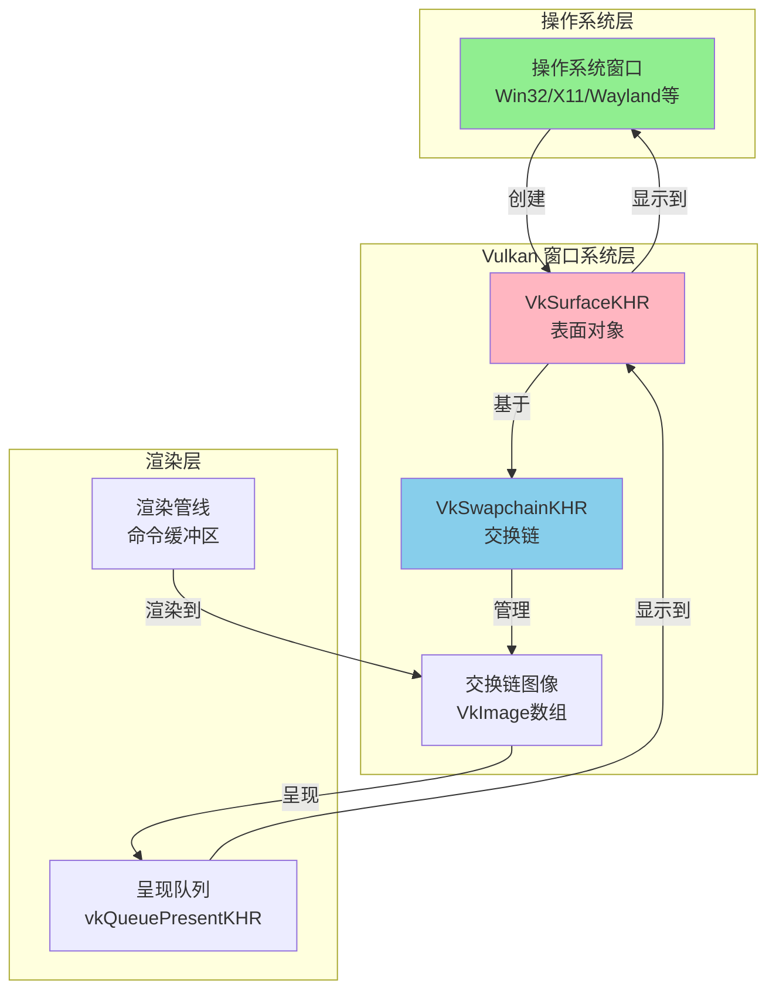

### 窗口系统的工作流程

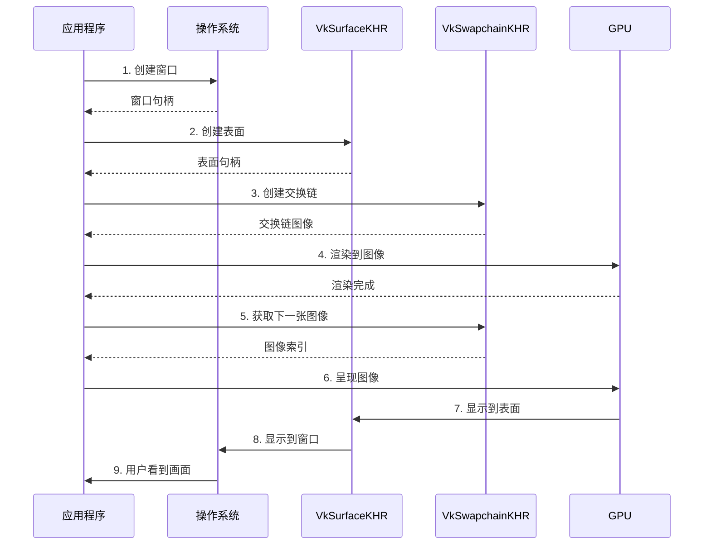

---

## WSI（Window System Integration）介绍

### 什么是 WSI？

**WSI（Window System Integration，窗口系统集成）**是 Vulkan 中用于将渲染结果呈现到操作系统窗口的一组扩展。WSI 提供了跨平台的统一接口，使得 Vulkan 应用程序可以在不同操作系统的窗口上显示渲染内容。

### WSI 的核心组件

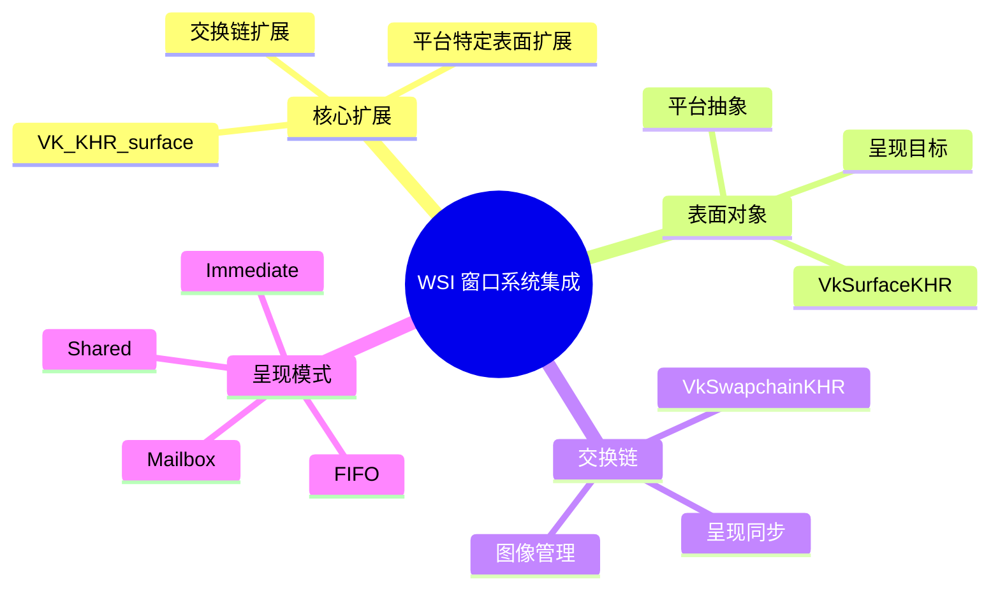

### WSI 扩展体系

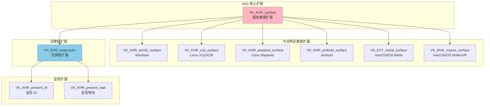

### WSI 扩展列表

| 扩展名称 | 类型 | 平台 | 说明 |
|---------|------|------|------|
| **VK_KHR_surface** | 实例扩展 | 所有平台 | 基础表面扩展，所有 WSI 的基础 |
| **VK_KHR_win32_surface** | 实例扩展 | Windows | Windows 平台表面 |
| **VK_KHR_xcb_surface** | 实例扩展 | Linux X11 | XCB 协议表面 |
| **VK_KHR_xlib_surface** | 实例扩展 | Linux X11 | Xlib 协议表面 |
| **VK_KHR_wayland_surface** | 实例扩展 | Linux Wayland | Wayland 协议表面 |
| **VK_KHR_android_surface** | 实例扩展 | Android | Android 平台表面 |
| **VK_EXT_metal_surface** | 实例扩展 | macOS/iOS | Metal 层表面 |
| **VK_MVK_macos_surface** | 实例扩展 | macOS | MoltenVK macOS 表面 |
| **VK_MVK_ios_surface** | 实例扩展 | iOS | MoltenVK iOS 表面 |
| **VK_KHR_swapchain** | 设备扩展 | 所有平台 | 交换链扩展 |
| **VK_KHR_present_id** | 设备扩展 | 所有平台 | 呈现 ID 扩展 |
| **VK_KHR_present_wait** | 设备扩展 | 所有平台 | 呈现等待扩展 |

### WSI 工作流程

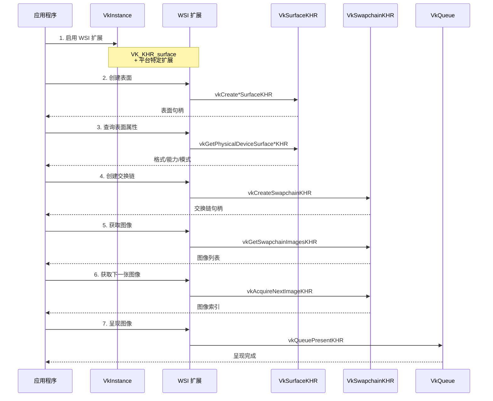

### WSI 扩展启用

#### 实例扩展启用

```cpp
// 1. 启用基础表面扩展
std::vector<const char*> instanceExtensions = {
    VK_KHR_SURFACE_EXTENSION_NAME  // 基础表面扩展
};

// 2. 根据平台启用特定扩展
#ifdef _WIN32
    instanceExtensions.push_back(VK_KHR_WIN32_SURFACE_EXTENSION_NAME);
#elif defined(VK_USE_PLATFORM_XCB_KHR)
    instanceExtensions.push_back(VK_KHR_XCB_SURFACE_EXTENSION_NAME);
#elif defined(VK_USE_PLATFORM_WAYLAND_KHR)
    instanceExtensions.push_back(VK_KHR_WAYLAND_SURFACE_EXTENSION_NAME);
#elif defined(VK_USE_PLATFORM_ANDROID_KHR)
    instanceExtensions.push_back(VK_KHR_ANDROID_SURFACE_EXTENSION_NAME);
#elif defined(VK_USE_PLATFORM_METAL_EXT)
    instanceExtensions.push_back(VK_EXT_METAL_SURFACE_EXTENSION_NAME);
#endif

// 3. 创建实例时启用扩展
VkInstanceCreateInfo createInfo{};
createInfo.enabledExtensionCount = instanceExtensions.size();
createInfo.ppEnabledExtensionNames = instanceExtensions.data();
vkCreateInstance(&createInfo, nullptr, &instance);
```

#### 设备扩展启用

```cpp
// 创建设备时启用交换链扩展
std::vector<const char*> deviceExtensions = {
    VK_KHR_SWAPCHAIN_EXTENSION_NAME  // 交换链扩展
};

VkDeviceCreateInfo deviceInfo{};
deviceInfo.enabledExtensionCount = deviceExtensions.size();
deviceInfo.ppEnabledExtensionNames = deviceExtensions.data();
vkCreateDevice(physicalDevice, &deviceInfo, nullptr, &device);
```

### WSI 函数指针获取

由于 WSI 扩展是可选扩展，某些函数需要通过 `vkGetInstanceProcAddr` 或 `vkGetDeviceProcAddr` 获取：

```cpp
// 获取实例级别 WSI 函数指针
PFN_vkCreateWin32SurfaceKHR vkCreateWin32SurfaceKHR = 
    (PFN_vkCreateWin32SurfaceKHR)vkGetInstanceProcAddr(
        instance, 
        "vkCreateWin32SurfaceKHR"
    );

// 获取设备级别 WSI 函数指针
PFN_vkCreateSwapchainKHR vkCreateSwapchainKHR = 
    (PFN_vkCreateSwapchainKHR)vkGetDeviceProcAddr(
        device, 
        "vkCreateSwapchainKHR"
    );

PFN_vkQueuePresentKHR vkQueuePresentKHR = 
    (PFN_vkQueuePresentKHR)vkGetDeviceProcAddr(
        device, 
        "vkQueuePresentKHR"
    );
```

### WSI 平台支持矩阵

| 平台 | 表面扩展 | 窗口系统 | 说明 |
|------|---------|---------|------|
| **Windows** | `VK_KHR_win32_surface` | Win32 API | 使用 `HWND` 和 `HINSTANCE` |
| **Linux X11** | `VK_KHR_xcb_surface` | XCB | 使用 `xcb_connection_t` 和 `xcb_window_t` |
| **Linux X11** | `VK_KHR_xlib_surface` | Xlib | 使用 `Display*` 和 `Window` |
| **Linux Wayland** | `VK_KHR_wayland_surface` | Wayland | 使用 `wl_display*` 和 `wl_surface*` |
| **Android** | `VK_KHR_android_surface` | Android NDK | 使用 `ANativeWindow*` |
| **macOS** | `VK_EXT_metal_surface` | Metal | 使用 `CAMetalLayer*` |
| **macOS** | `VK_MVK_macos_surface` | MoltenVK | 使用 `NSView*` |
| **iOS** | `VK_MVK_ios_surface` | MoltenVK | 使用 `UIView*` |

### WSI 与核心 Vulkan 的关系

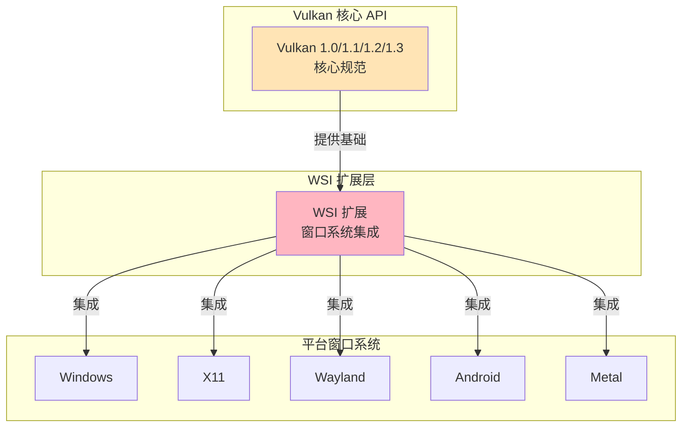

### WSI 的设计目标

1. **跨平台统一**：提供统一的 API 接口，隐藏平台差异
2. **可选性**：WSI 是扩展，不是核心 API 的一部分
3. **灵活性**：支持多种窗口系统和呈现模式
4. **性能**：最小化窗口系统集成的性能开销
5. **可扩展性**：易于添加新的平台支持

### WSI 使用检查清单

```cpp
class WSIManager {
public:
    // 检查 WSI 扩展是否可用
    bool checkWSIExtensions(VkInstance instance) {
        // 1. 检查基础表面扩展
        if (!isExtensionAvailable(instance, VK_KHR_SURFACE_EXTENSION_NAME)) {
            return false;
        }
        
        // 2. 检查平台特定扩展
        #ifdef _WIN32
            if (!isExtensionAvailable(instance, VK_KHR_WIN32_SURFACE_EXTENSION_NAME)) {
                return false;
            }
        #elif defined(VK_USE_PLATFORM_XCB_KHR)
            if (!isExtensionAvailable(instance, VK_KHR_XCB_SURFACE_EXTENSION_NAME)) {
                return false;
            }
        #endif
        
        return true;
    }
    
    // 检查交换链扩展
    bool checkSwapchainExtension(VkPhysicalDevice physicalDevice) {
        uint32_t extensionCount;
        vkEnumerateDeviceExtensionProperties(
            physicalDevice, 
            nullptr, 
            &extensionCount, 
            nullptr
        );
        
        std::vector<VkExtensionProperties> extensions(extensionCount);
        vkEnumerateDeviceExtensionProperties(
            physicalDevice, 
            nullptr, 
            &extensionCount, 
            extensions.data()
        );
        
        for (const auto& ext : extensions) {
            if (strcmp(ext.extensionName, VK_KHR_SWAPCHAIN_EXTENSION_NAME) == 0) {
                return true;
            }
        }
        return false;
    }
    
private:
    bool isExtensionAvailable(VkInstance instance, const char* extensionName) {
        uint32_t extensionCount;
        vkEnumerateInstanceExtensionProperties(nullptr, &extensionCount, nullptr);
        std::vector<VkExtensionProperties> extensions(extensionCount);
        vkEnumerateInstanceExtensionProperties(nullptr, &extensionCount, extensions.data());
        
        for (const auto& ext : extensions) {
            if (strcmp(ext.extensionName, extensionName) == 0) {
                return true;
            }
        }
        return false;
    }
};
```

### WSI 最佳实践

1. **总是检查扩展可用性**：在启用扩展前检查是否支持
2. **使用条件编译**：根据平台启用相应的扩展
3. **获取函数指针**：对于扩展函数，使用 `vkGetInstanceProcAddr` 获取
4. **处理扩展不可用**：提供清晰的错误消息和回退方案
5. **版本兼容性**：注意不同 Vulkan 版本的 WSI 支持

---

## 窗口系统架构

### 三层架构模型

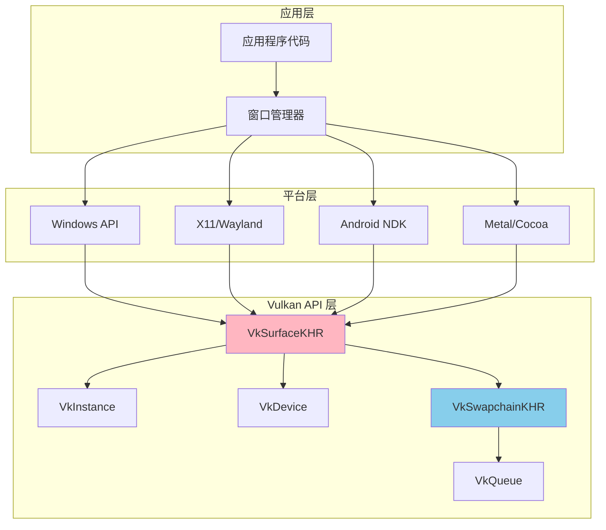

### 对象依赖关系

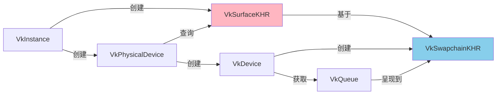

---

## 不同平台的窗口创建

### Windows 平台

#### 窗口创建流程

```cpp
// 1. 注册窗口类
WNDCLASSEX wc = {};
wc.cbSize = sizeof(WNDCLASSEX);
wc.style = CS_HREDRAW | CS_VREDRAW;
wc.lpfnWndProc = WndProc;  // 窗口过程函数
wc.hInstance = hInstance;
wc.hCursor = LoadCursor(NULL, IDC_ARROW);
wc.lpszClassName = "VulkanWindowClass";
RegisterClassEx(&wc);

// 2. 创建窗口
HWND hWnd = CreateWindowEx(
    0,                              // 扩展样式
    "VulkanWindowClass",            // 窗口类名
    "Vulkan Application",           // 窗口标题
    WS_OVERLAPPEDWINDOW,            // 窗口样式
    CW_USEDEFAULT, CW_USEDEFAULT,   // 位置
    1280, 720,                      // 大小
    NULL, NULL,                     // 父窗口和菜单
    hInstance,                      // 实例句柄
    NULL                            // 额外数据
);

// 3. 显示窗口
ShowWindow(hWnd, SW_SHOW);
UpdateWindow(hWnd);
```

#### 窗口过程函数

```cpp
LRESULT CALLBACK WndProc(HWND hWnd, UINT uMsg, WPARAM wParam, LPARAM lParam)
{
    switch (uMsg) {
        case WM_SIZE:
            // 处理窗口大小改变
            if (wParam != SIZE_MINIMIZED) {
                // 重建交换链
                recreateSwapchain();
            }
            return 0;
            
        case WM_DESTROY:
            // 窗口销毁，退出程序
            PostQuitMessage(0);
            return 0;
            
        case WM_KEYDOWN:
            // 处理键盘输入
            if (wParam == VK_ESCAPE) {
                PostQuitMessage(0);
            }
            return 0;
    }
    return DefWindowProc(hWnd, uMsg, wParam, lParam);
}
```

#### 消息循环

```cpp
MSG msg = {};
while (msg.message != WM_QUIT) {
    if (PeekMessage(&msg, NULL, 0, 0, PM_REMOVE)) {
        TranslateMessage(&msg);
        DispatchMessage(&msg);
    } else {
        // 没有消息时进行渲染
        renderFrame();
    }
}
```

### Linux X11/XCB 平台

#### XCB 窗口创建

```cpp
#include <xcb/xcb.h>

// 1. 连接到 X 服务器
xcb_connection_t* connection = xcb_connect(NULL, NULL);
xcb_screen_t* screen = xcb_setup_roots_iterator(
    xcb_get_setup(connection)
).data;

// 2. 创建窗口
xcb_window_t window = xcb_generate_id(connection);
uint32_t value_mask = XCB_CW_BACK_PIXEL | XCB_CW_EVENT_MASK;
uint32_t value_list[] = {
    screen->black_pixel,
    XCB_EVENT_MASK_EXPOSURE | XCB_EVENT_MASK_KEY_PRESS | 
    XCB_EVENT_MASK_STRUCTURE_NOTIFY
};

xcb_create_window(
    connection,
    XCB_COPY_FROM_PARENT,
    window,
    screen->root,
    0, 0,                    // 位置
    1280, 720,              // 大小
    0,                       // 边框宽度
    XCB_WINDOW_CLASS_INPUT_OUTPUT,
    screen->root_visual,
    value_mask,
    value_list
);

// 3. 设置窗口标题
xcb_change_property(
    connection,
    XCB_PROP_MODE_REPLACE,
    window,
    XCB_ATOM_WM_NAME,
    XCB_ATOM_STRING,
    8,
    strlen("Vulkan Application"),
    "Vulkan Application"
);

// 4. 映射窗口
xcb_map_window(connection, window);
xcb_flush(connection);
```

#### XCB 事件循环

```cpp
xcb_generic_event_t* event;
while ((event = xcb_wait_for_event(connection))) {
    switch (event->response_type & ~0x80) {
        case XCB_EXPOSE:
            // 窗口暴露，需要重绘
            renderFrame();
            break;
            
        case XCB_CONFIGURE_NOTIFY: {
            xcb_configure_notify_event_t* configure_event = 
                (xcb_configure_notify_event_t*)event;
            // 窗口大小改变
            if (configure_event->width != width || 
                configure_event->height != height) {
                width = configure_event->width;
                height = configure_event->height;
                recreateSwapchain();
            }
            break;
        }
        
        case XCB_KEY_PRESS: {
            xcb_key_press_event_t* key_event = 
                (xcb_key_press_event_t*)event;
            if (key_event->detail == 9) {  // Escape key
                running = false;
            }
            break;
        }
    }
    free(event);
}
```

### Linux Wayland 平台

#### Wayland 窗口创建

```cpp
#include <wayland-client.h>

// 1. 连接到 Wayland 显示服务器
wl_display* display = wl_display_connect(NULL);
wl_registry* registry = wl_display_get_registry(display);

// 2. 绑定全局对象
wl_registry_listener registry_listener = {
    .global = registry_global,
    .global_remove = registry_global_remove
};
wl_registry_add_listener(registry, &registry_listener, NULL);
wl_display_roundtrip(display);

// 3. 创建表面
wl_surface* surface = wl_compositor_create_surface(compositor);

// 4. 创建窗口
wl_shell_surface* shell_surface = 
    wl_shell_get_shell_surface(shell, surface);
wl_shell_surface_set_toplevel(shell_surface);
wl_shell_surface_set_title(shell_surface, "Vulkan Application");
```

### Android 平台

#### Android 窗口创建

```cpp
#include <android/native_window.h>

// Android 窗口由系统管理，通过 ANativeWindow 访问
// 在 Android 应用中，窗口通常由 Activity 提供

// 1. 获取窗口（在 onNativeWindowCreated 回调中）
void onNativeWindowCreated(ANativeWindow* window) {
    // 保存窗口引用
    nativeWindow = window;
    
    // 获取窗口尺寸
    int32_t width = ANativeWindow_getWidth(window);
    int32_t height = ANativeWindow_getHeight(window);
    
    // 创建表面
    createSurface(window);
}

// 2. 处理窗口大小改变（在 onNativeWindowResized 回调中）
void onNativeWindowResized(ANativeWindow* window) {
    int32_t width = ANativeWindow_getWidth(window);
    int32_t height = ANativeWindow_getHeight(window);
    recreateSwapchain(width, height);
}

// 3. 处理窗口销毁（在 onNativeWindowDestroyed 回调中）
void onNativeWindowDestroyed(ANativeWindow* window) {
    cleanupSwapchain();
    nativeWindow = nullptr;
}
```

### macOS/iOS 平台

#### macOS Cocoa 窗口创建

```objc
// Objective-C 代码
#import <Cocoa/Cocoa.h>

// 1. 创建应用程序
NSApplication* app = [NSApplication sharedApplication];

// 2. 创建窗口
NSWindow* window = [[NSWindow alloc] 
    initWithContentRect:NSMakeRect(0, 0, 1280, 720)
    styleMask:NSWindowStyleMaskTitled | 
              NSWindowStyleMaskClosable |
              NSWindowStyleMaskMiniaturizable |
              NSWindowStyleMaskResizable
    backing:NSBackingStoreBuffered
    defer:NO];

[window setTitle:@"Vulkan Application"];
[window center];
[window makeKeyAndOrderFront:nil];

// 3. 获取视图（用于创建表面）
NSView* view = [window contentView];
```

#### Metal 层创建（macOS）

```objc
// 创建 CAMetalLayer
CAMetalLayer* metalLayer = [CAMetalLayer layer];
metalLayer.frame = view.bounds;
metalLayer.device = mtlDevice;  // Metal 设备
[view setLayer:metalLayer];
[view setWantsLayer:YES];
```

---

## 表面（Surface）创建与管理

### 表面是什么？

表面（Surface）是 Vulkan 中连接操作系统窗口和 Vulkan 渲染系统的抽象对象。它提供了跨平台的统一接口，使得 Vulkan 可以将渲染结果呈现到不同操作系统的窗口上。

### 表面创建流程

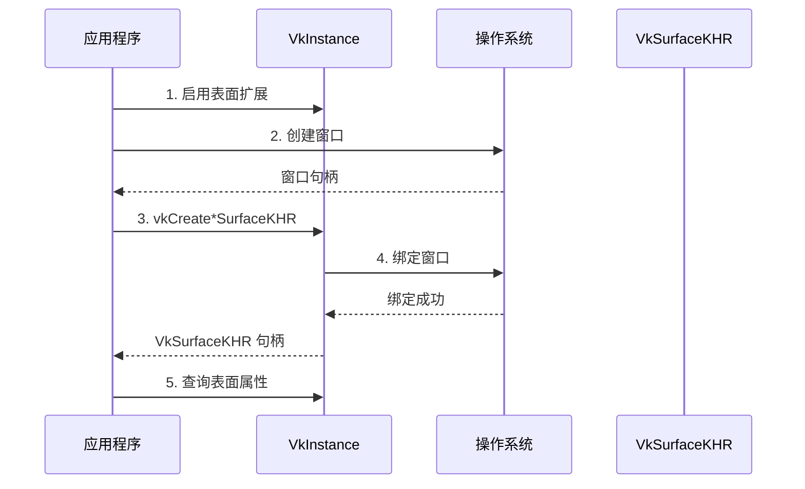

### Windows 表面创建

```cpp
VkWin32SurfaceCreateInfoKHR surfaceInfo{};
surfaceInfo.sType = VK_STRUCTURE_TYPE_WIN32_SURFACE_CREATE_INFO_KHR;
surfaceInfo.hinstance = hInstance;  // 窗口实例句柄
surfaceInfo.hwnd = hWnd;            // 窗口句柄

VkSurfaceKHR surface;
VkResult result = vkCreateWin32SurfaceKHR(
    instance, 
    &surfaceInfo, 
    nullptr, 
    &surface
);

if (result != VK_SUCCESS) {
    throw std::runtime_error("Failed to create Win32 surface!");
}
```

### Linux XCB 表面创建

```cpp
VkXcbSurfaceCreateInfoKHR surfaceInfo{};
surfaceInfo.sType = VK_STRUCTURE_TYPE_XCB_SURFACE_CREATE_INFO_KHR;
surfaceInfo.connection = connection;  // XCB 连接
surfaceInfo.window = window;          // XCB 窗口 ID

VkSurfaceKHR surface;
VkResult result = vkCreateXcbSurfaceKHR(
    instance, 
    &surfaceInfo, 
    nullptr, 
    &surface
);
```

### Linux Wayland 表面创建

```cpp
VkWaylandSurfaceCreateInfoKHR surfaceInfo{};
surfaceInfo.sType = VK_STRUCTURE_TYPE_WAYLAND_SURFACE_CREATE_INFO_KHR;
surfaceInfo.display = display;  // Wayland 显示对象
surfaceInfo.surface = surface; // Wayland 表面对象

VkSurfaceKHR surface;
VkResult result = vkCreateWaylandSurfaceKHR(
    instance, 
    &surfaceInfo, 
    nullptr, 
    &surface
);
```

### Android 表面创建

```cpp
VkAndroidSurfaceCreateInfoKHR surfaceInfo{};
surfaceInfo.sType = VK_STRUCTURE_TYPE_ANDROID_SURFACE_CREATE_INFO_KHR;
surfaceInfo.window = window;  // ANativeWindow 指针

VkSurfaceKHR surface;
VkResult result = vkCreateAndroidSurfaceKHR(
    instance, 
    &surfaceInfo, 
    nullptr, 
    &surface
);
```

### macOS/iOS 表面创建

#### MoltenVK 方式

```cpp
// macOS
VkMacOSSurfaceCreateInfoMVK surfaceInfo{};
surfaceInfo.sType = VK_STRUCTURE_TYPE_MACOS_SURFACE_CREATE_INFO_MVK;
surfaceInfo.pView = view;  // NSView 指针

VkSurfaceKHR surface;
VkResult result = vkCreateMacOSSurfaceMVK(
    instance, 
    &surfaceInfo, 
    nullptr, 
    &surface
);
```

#### Metal 方式

```cpp
VkMetalSurfaceCreateInfoEXT surfaceInfo{};
surfaceInfo.sType = VK_STRUCTURE_TYPE_METAL_SURFACE_CREATE_INFO_EXT;
surfaceInfo.pLayer = metalLayer;  // CAMetalLayer 指针

VkSurfaceKHR surface;
VkResult result = vkCreateMetalSurfaceEXT(
    instance, 
    &surfaceInfo, 
    nullptr, 
    &surface
);
```

### 表面查询

#### 查询队列族是否支持呈现

```cpp
// 获取队列族数量
uint32_t queueFamilyCount;
vkGetPhysicalDeviceQueueFamilyProperties(
    physicalDevice, 
    &queueFamilyCount, 
    nullptr
);

// 查询每个队列族是否支持呈现
std::vector<VkBool32> supportsPresent(queueFamilyCount);
for (uint32_t i = 0; i < queueFamilyCount; i++) {
    vkGetPhysicalDeviceSurfaceSupportKHR(
        physicalDevice, 
        i, 
        surface, 
        &supportsPresent[i]
    );
}

// 查找同时支持图形和呈现的队列族
uint32_t graphicsQueueFamilyIndex = UINT32_MAX;
uint32_t presentQueueFamilyIndex = UINT32_MAX;

for (uint32_t i = 0; i < queueFamilyCount; i++) {
    if (queueProps[i].queueFlags & VK_QUEUE_GRAPHICS_BIT) {
        if (graphicsQueueFamilyIndex == UINT32_MAX) {
            graphicsQueueFamilyIndex = i;
        }
        if (supportsPresent[i] == VK_TRUE) {
            graphicsQueueFamilyIndex = i;
            presentQueueFamilyIndex = i;
            break;
        }
    }
}
```

#### 查询表面格式

```cpp
// 第一次调用：获取格式数量
uint32_t formatCount;
vkGetPhysicalDeviceSurfaceFormatsKHR(
    physicalDevice, 
    surface, 
    &formatCount, 
    nullptr
);

// 第二次调用：获取所有格式
std::vector<VkSurfaceFormatKHR> formats(formatCount);
vkGetPhysicalDeviceSurfaceFormatsKHR(
    physicalDevice, 
    surface, 
    &formatCount, 
    formats.data()
);

// 选择格式（优先选择 BGRA8 或 RGBA8）
VkSurfaceFormatKHR selectedFormat = formats[0];
for (const auto& format : formats) {
    if (format.format == VK_FORMAT_B8G8R8A8_UNORM ||
        format.format == VK_FORMAT_R8G8B8A8_UNORM) {
        selectedFormat = format;
        break;
    }
}
```

#### 查询表面能力

```cpp
VkSurfaceCapabilitiesKHR capabilities;
vkGetPhysicalDeviceSurfaceCapabilitiesKHR(
    physicalDevice, 
    surface, 
    &capabilities
);

// 关键信息：
// - capabilities.minImageCount: 最小图像数量
// - capabilities.maxImageCount: 最大图像数量（0 表示无限制）
// - capabilities.currentExtent: 当前表面尺寸
// - capabilities.minImageExtent: 最小图像尺寸
// - capabilities.maxImageExtent: 最大图像尺寸
// - capabilities.supportedTransforms: 支持的变换
// - capabilities.currentTransform: 当前变换
// - capabilities.supportedCompositeAlpha: 支持的复合 Alpha 模式
```

#### 查询呈现模式

```cpp
// 第一次调用：获取呈现模式数量
uint32_t presentModeCount;
vkGetPhysicalDeviceSurfacePresentModesKHR(
    physicalDevice, 
    surface, 
    &presentModeCount, 
    nullptr
);

// 第二次调用：获取所有呈现模式
std::vector<VkPresentModeKHR> presentModes(presentModeCount);
vkGetPhysicalDeviceSurfacePresentModesKHR(
    physicalDevice, 
    surface, 
    &presentModeCount, 
    presentModes.data()
);

// 选择呈现模式
VkPresentModeKHR selectedMode = VK_PRESENT_MODE_FIFO_KHR;  // 默认（垂直同步）
for (const auto& mode : presentModes) {
    if (mode == VK_PRESENT_MODE_MAILBOX_KHR) {
        selectedMode = mode;  // 优先选择邮箱模式（最低延迟）
        break;
    }
}
```

### 表面销毁

```cpp
void destroySurface() {
    if (surface != VK_NULL_HANDLE) {
        vkDestroySurfaceKHR(instance, surface, nullptr);
        surface = VK_NULL_HANDLE;
    }
}
```

**重要**：必须在销毁交换链之后、销毁实例之前销毁表面。

---

## 交换链（Swapchain）创建与管理

### 交换链是什么？

交换链（Swapchain）是一组图像（通常是 2-3 张），用于实现双缓冲或三缓冲渲染。它管理渲染图像的获取、呈现和同步。

### 交换链创建流程

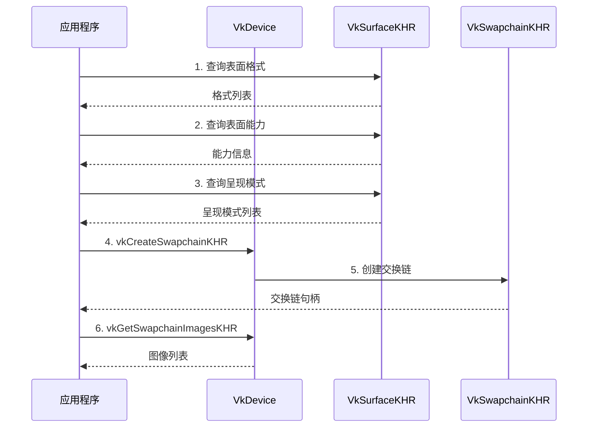

### 交换链创建代码

```cpp
void createSwapchain(uint32_t width, uint32_t height) {
    // 1. 查询表面能力
    VkSurfaceCapabilitiesKHR capabilities;
    vkGetPhysicalDeviceSurfaceCapabilitiesKHR(
        physicalDevice, 
        surface, 
        &capabilities
    );
    
    // 2. 选择表面格式
    VkSurfaceFormatKHR surfaceFormat = selectSurfaceFormat();
    
    // 3. 选择呈现模式
    VkPresentModeKHR presentMode = selectPresentMode();
    
    // 4. 确定交换链图像数量
    uint32_t imageCount = capabilities.minImageCount + 1;
    if (capabilities.maxImageCount > 0 && 
        imageCount > capabilities.maxImageCount) {
        imageCount = capabilities.maxImageCount;
    }
    
    // 5. 确定交换链尺寸
    VkExtent2D extent;
    if (capabilities.currentExtent.width != UINT32_MAX) {
        extent = capabilities.currentExtent;
    } else {
        extent.width = std::clamp(
            width,
            capabilities.minImageExtent.width,
            capabilities.maxImageExtent.width
        );
        extent.height = std::clamp(
            height,
            capabilities.minImageExtent.height,
            capabilities.maxImageExtent.height
        );
    }
    
    // 6. 选择表面变换
    VkSurfaceTransformFlagBitsKHR preTransform = 
        capabilities.currentTransform;
    if (capabilities.supportedTransforms & 
        VK_SURFACE_TRANSFORM_IDENTITY_BIT_KHR) {
        preTransform = VK_SURFACE_TRANSFORM_IDENTITY_BIT_KHR;
    }
    
    // 7. 选择复合 Alpha
    VkCompositeAlphaFlagBitsKHR compositeAlpha = 
        VK_COMPOSITE_ALPHA_OPAQUE_BIT_KHR;
    if (capabilities.supportedCompositeAlpha & 
        VK_COMPOSITE_ALPHA_PRE_MULTIPLIED_BIT_KHR) {
        compositeAlpha = VK_COMPOSITE_ALPHA_PRE_MULTIPLIED_BIT_KHR;
    }
    
    // 8. 创建交换链
    VkSwapchainCreateInfoKHR createInfo{};
    createInfo.sType = VK_STRUCTURE_TYPE_SWAPCHAIN_CREATE_INFO_KHR;
    createInfo.surface = surface;
    createInfo.minImageCount = imageCount;
    createInfo.imageFormat = surfaceFormat.format;
    createInfo.imageColorSpace = surfaceFormat.colorSpace;
    createInfo.imageExtent = extent;
    createInfo.imageArrayLayers = 1;
    createInfo.imageUsage = VK_IMAGE_USAGE_COLOR_ATTACHMENT_BIT;
    createInfo.preTransform = preTransform;
    createInfo.compositeAlpha = compositeAlpha;
    createInfo.presentMode = presentMode;
    createInfo.clipped = VK_TRUE;
    createInfo.oldSwapchain = VK_NULL_HANDLE;
    
    VkResult result = vkCreateSwapchainKHR(
        device, 
        &createInfo, 
        nullptr, 
        &swapchain
    );
    
    if (result != VK_SUCCESS) {
        throw std::runtime_error("Failed to create swapchain!");
    }
    
    // 9. 获取交换链图像
    vkGetSwapchainImagesKHR(device, swapchain, &imageCount, nullptr);
    swapchainImages.resize(imageCount);
    vkGetSwapchainImagesKHR(
        device, 
        swapchain, 
        &imageCount, 
        swapchainImages.data()
    );
    
    // 10. 创建图像视图
    swapchainImageViews.resize(swapchainImages.size());
    for (size_t i = 0; i < swapchainImages.size(); i++) {
        VkImageViewCreateInfo viewInfo{};
        viewInfo.sType = VK_STRUCTURE_TYPE_IMAGE_VIEW_CREATE_INFO;
        viewInfo.image = swapchainImages[i];
        viewInfo.viewType = VK_IMAGE_VIEW_TYPE_2D;
        viewInfo.format = surfaceFormat.format;
        viewInfo.components.r = VK_COMPONENT_SWIZZLE_IDENTITY;
        viewInfo.components.g = VK_COMPONENT_SWIZZLE_IDENTITY;
        viewInfo.components.b = VK_COMPONENT_SWIZZLE_IDENTITY;
        viewInfo.components.a = VK_COMPONENT_SWIZZLE_IDENTITY;
        viewInfo.subresourceRange.aspectMask = VK_IMAGE_ASPECT_COLOR_BIT;
        viewInfo.subresourceRange.baseMipLevel = 0;
        viewInfo.subresourceRange.levelCount = 1;
        viewInfo.subresourceRange.baseArrayLayer = 0;
        viewInfo.subresourceRange.layerCount = 1;
        
        vkCreateImageView(
            device, 
            &viewInfo, 
            nullptr, 
            &swapchainImageViews[i]
        );
    }
}
```

### 获取下一张图像

```cpp
VkResult acquireNextImage(
    VkSemaphore semaphore, 
    uint32_t& imageIndex
) {
    return vkAcquireNextImageKHR(
        device,
        swapchain,
        UINT64_MAX,  // 超时时间（无限等待）
        semaphore,   // 信号量（图像可用时触发）
        VK_NULL_HANDLE,  // 栅栏（可选）
        &imageIndex
    );
}
```

### 呈现图像

```cpp
VkResult presentImage(
    VkQueue presentQueue,
    uint32_t imageIndex,
    VkSemaphore waitSemaphore
) {
    VkPresentInfoKHR presentInfo{};
    presentInfo.sType = VK_STRUCTURE_TYPE_PRESENT_INFO_KHR;
    presentInfo.waitSemaphoreCount = 1;
    presentInfo.pWaitSemaphores = &waitSemaphore;
    presentInfo.swapchainCount = 1;
    presentInfo.pSwapchains = &swapchain;
    presentInfo.pImageIndices = &imageIndex;
    
    return vkQueuePresentKHR(presentQueue, &presentInfo);
}
```

### 交换链重建

当窗口大小改变或交换链不再兼容时，需要重建交换链：

```cpp
void recreateSwapchain(uint32_t width, uint32_t height) {
    // 1. 等待设备空闲
    vkDeviceWaitIdle(device);
    
    // 2. 清理旧的交换链资源
    cleanupSwapchain();
    
    // 3. 重新创建交换链
    createSwapchain(width, height);
    
    // 4. 重新创建帧缓冲区
    createFramebuffers();
}
```

### 交换链销毁

```cpp
void cleanupSwapchain() {
    // 销毁图像视图
    for (auto imageView : swapchainImageViews) {
        vkDestroyImageView(device, imageView, nullptr);
    }
    swapchainImageViews.clear();
    
    // 销毁交换链
    if (swapchain != VK_NULL_HANDLE) {
        vkDestroySwapchainKHR(device, swapchain, nullptr);
        swapchain = VK_NULL_HANDLE;
    }
}
```

---

## 窗口事件处理

### Windows 事件处理

```cpp
LRESULT CALLBACK WndProc(
    HWND hWnd, 
    UINT uMsg, 
    WPARAM wParam, 
    LPARAM lParam
) {
    switch (uMsg) {
        case WM_SIZE: {
            uint32_t width = LOWORD(lParam);
            uint32_t height = HIWORD(lParam);
            if (width > 0 && height > 0) {
                framebufferResized = true;
            }
            return 0;
        }
        
        case WM_KEYDOWN:
            if (wParam == VK_ESCAPE) {
                PostQuitMessage(0);
            }
            return 0;
            
        case WM_DESTROY:
            PostQuitMessage(0);
            return 0;
    }
    return DefWindowProc(hWnd, uMsg, wParam, lParam);
}
```

### XCB 事件处理

```cpp
void handleXcbEvents() {
    xcb_generic_event_t* event;
    while ((event = xcb_poll_for_event(connection))) {
        switch (event->response_type & ~0x80) {
            case XCB_CONFIGURE_NOTIFY: {
                xcb_configure_notify_event_t* configure_event = 
                    (xcb_configure_notify_event_t*)event;
                if (configure_event->width != width || 
                    configure_event->height != height) {
                    width = configure_event->width;
                    height = configure_event->height;
                    framebufferResized = true;
                }
                break;
            }
            
            case XCB_KEY_PRESS: {
                xcb_key_press_event_t* key_event = 
                    (xcb_key_press_event_t*)event;
                if (key_event->detail == 9) {  // Escape
                    running = false;
                }
                break;
            }
        }
        free(event);
    }
}
```

### Wayland 事件处理

```cpp
void handleWaylandEvents() {
    wl_display_dispatch_pending(display);
    
    // Wayland 使用回调机制处理事件
    // 需要在创建表面时设置回调
}
```

---

## 窗口大小调整与重建

### 检测窗口大小改变

```cpp
bool framebufferResized = false;

// 在窗口事件处理中设置标志
void onWindowResize(uint32_t newWidth, uint32_t newHeight) {
    framebufferResized = true;
    width = newWidth;
    height = newHeight;
}
```

### 重建交换链

```cpp
void recreateSwapchain() {
    // 等待设备空闲
    vkDeviceWaitIdle(device);
    
    // 清理旧资源
    cleanupSwapchain();
    cleanupFramebuffers();
    
    // 重新创建交换链
    createSwapchain(width, height);
    
    // 重新创建帧缓冲区
    createFramebuffers();
    
    framebufferResized = false;
}
```

### 在渲染循环中处理

```cpp
void renderLoop() {
    while (!shouldClose) {
        // 处理窗口事件
        pollEvents();
        
        // 检查是否需要重建交换链
        if (framebufferResized) {
            recreateSwapchain();
            continue;
        }
        
        // 渲染帧
        renderFrame();
    }
}
```

### 处理交换链错误

```cpp
VkResult result = vkAcquireNextImageKHR(
    device, 
    swapchain, 
    UINT64_MAX, 
    imageAvailableSemaphore, 
    VK_NULL_HANDLE, 
    &imageIndex
);

if (result == VK_ERROR_OUT_OF_DATE_KHR) {
    // 交换链与表面不兼容，需要重建
    recreateSwapchain();
    return;
} else if (result != VK_SUCCESS && 
           result != VK_SUBOPTIMAL_KHR) {
    throw std::runtime_error("Failed to acquire swapchain image!");
}

// 呈现后检查
result = vkQueuePresentKHR(presentQueue, &presentInfo);
if (result == VK_ERROR_OUT_OF_DATE_KHR || 
    result == VK_SUBOPTIMAL_KHR || 
    framebufferResized) {
    framebufferResized = false;
    recreateSwapchain();
}
```

---

## 全屏模式处理

### Windows 全屏模式

```cpp
void setFullscreen(bool fullscreen) {
    if (fullscreen) {
        // 获取当前显示模式
        DEVMODE dmScreenSettings = {};
        dmScreenSettings.dmSize = sizeof(dmScreenSettings);
        EnumDisplaySettings(NULL, ENUM_CURRENT_SETTINGS, &dmScreenSettings);
        
        // 更改显示设置
        ChangeDisplaySettings(&dmScreenSettings, CDS_FULLSCREEN);
        
        // 设置窗口样式
        SetWindowLongPtr(hWnd, GWL_STYLE, 
            WS_POPUP | WS_CLIPSIBLINGS | WS_CLIPCHILDREN);
        SetWindowPos(hWnd, HWND_TOP, 0, 0, 
            dmScreenSettings.dmPelsWidth, 
            dmScreenSettings.dmPelsHeight, 
            SWP_SHOWWINDOW);
    } else {
        // 恢复窗口模式
        ChangeDisplaySettings(NULL, 0);
        SetWindowLongPtr(hWnd, GWL_STYLE, 
            WS_OVERLAPPEDWINDOW | WS_CLIPSIBLINGS | WS_CLIPCHILDREN);
        SetWindowPos(hWnd, HWND_TOP, 100, 100, 
            width, height, SWP_SHOWWINDOW);
    }
    
    // 重建交换链
    recreateSwapchain();
}
```

### XCB 全屏模式

```cpp
void setFullscreen(bool fullscreen) {
    xcb_atom_t wmState = getAtom("_NET_WM_STATE");
    xcb_atom_t wmStateFullscreen = getAtom("_NET_WM_STATE_FULLSCREEN");
    
    xcb_client_message_event_t event = {};
    event.response_type = XCB_CLIENT_MESSAGE;
    event.window = window;
    event.type = wmState;
    event.format = 32;
    event.data.data32[0] = fullscreen ? 1 : 0;
    event.data.data32[1] = wmStateFullscreen;
    event.data.data32[2] = 0;
    
    xcb_send_event(connection, 0, window, 
        XCB_EVENT_MASK_SUBSTRUCTURE_REDIRECT, 
        (const char*)&event);
    xcb_flush(connection);
}
```

---

## 多窗口支持

### 多窗口架构

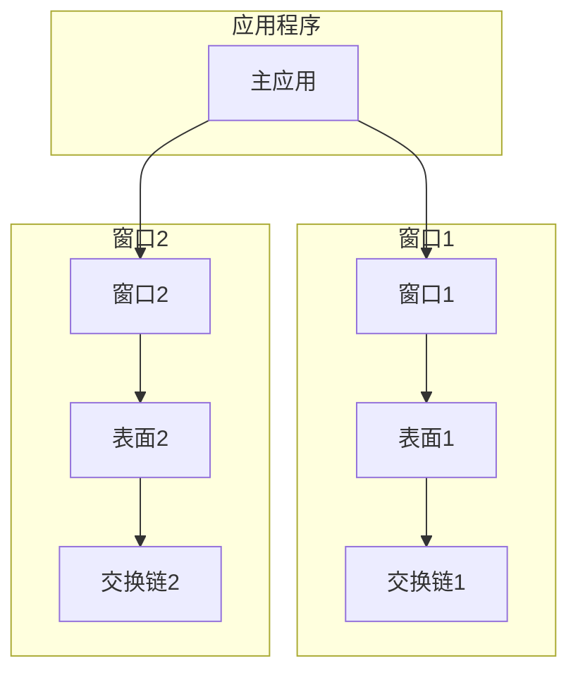

### 多窗口实现

```cpp
class Window {
public:
    VkSurfaceKHR surface;
    VkSwapchainKHR swapchain;
    std::vector<VkImage> images;
    uint32_t width, height;
    
    void createSurface(VkInstance instance);
    void createSwapchain(VkDevice device, VkPhysicalDevice physicalDevice);
    void cleanup();
};

class Application {
private:
    std::vector<Window> windows;
    
public:
    void createWindow(uint32_t width, uint32_t height);
    void renderAllWindows();
    void cleanup();
};
```

---

## 窗口生命周期管理

### 完整的生命周期

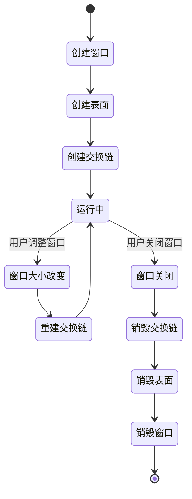

### 清理顺序

```cpp
void cleanup() {
    // 1. 等待设备空闲
    vkDeviceWaitIdle(device);
    
    // 2. 清理交换链
    cleanupSwapchain();
    
    // 3. 清理其他资源（管线、描述符等）
    cleanupResources();
    
    // 4. 销毁设备
    vkDestroyDevice(device, nullptr);
    
    // 5. 销毁表面
    vkDestroySurfaceKHR(instance, surface, nullptr);
    
    // 6. 销毁实例
    vkDestroyInstance(instance, nullptr);
    
    // 7. 销毁窗口（平台特定）
    destroyWindow();
}
```

---

## 实际代码示例

### 完整的窗口系统封装类

```cpp
class VulkanWindow {
private:
    VkInstance instance;
    VkDevice device;
    VkPhysicalDevice physicalDevice;
    VkSurfaceKHR surface;
    VkSwapchainKHR swapchain;
    
    std::vector<VkImage> swapchainImages;
    std::vector<VkImageView> swapchainImageViews;
    VkFormat swapchainImageFormat;
    VkExtent2D swapchainExtent;
    
    uint32_t width, height;
    bool framebufferResized = false;
    
    // 平台特定的窗口句柄
#ifdef _WIN32
    HWND hWnd;
    HINSTANCE hInstance;
#endif
    
public:
    void initWindow(uint32_t w, uint32_t h, const char* title);
    void createSurface();
    void createSwapchain();
    void recreateSwapchain();
    void cleanup();
    
    bool shouldClose();
    void pollEvents();
    VkResult acquireNextImage(VkSemaphore semaphore, uint32_t& imageIndex);
    VkResult presentImage(VkQueue queue, uint32_t imageIndex, VkSemaphore waitSemaphore);
    
    VkExtent2D getExtent() const { return swapchainExtent; }
    VkFormat getFormat() const { return swapchainImageFormat; }
    std::vector<VkImageView> getImageViews() const { return swapchainImageViews; }
};
```

---

## 最佳实践

### 1. 窗口创建时机

- ✅ 在创建 Vulkan 实例之前创建窗口
- ✅ 在创建逻辑设备之前创建表面
- ✅ 在创建交换链之前查询表面属性

### 2. 交换链管理

- ✅ 使用三重缓冲（`minImageCount + 1`）
- ✅ 优先选择邮箱呈现模式（最低延迟）
- ✅ 正确处理 `VK_ERROR_OUT_OF_DATE_KHR` 错误
- ✅ 在窗口大小改变时重建交换链

### 3. 同步处理

- ✅ 使用信号量同步图像获取
- ✅ 使用信号量同步图像呈现
- ✅ 在重建交换链前等待设备空闲

### 4. 错误处理

- ✅ 检查所有 Vulkan API 调用的返回值
- ✅ 处理交换链不兼容的情况
- ✅ 提供清晰的错误消息

### 5. 性能优化

- ✅ 避免频繁重建交换链
- ✅ 使用合适的图像数量
- ✅ 选择合适的呈现模式

### 6. 跨平台支持

- ✅ 使用条件编译处理不同平台
- ✅ 在运行时检查扩展支持
- ✅ 提供平台特定的窗口创建代码

---

## 总结

Vulkan 窗口系统是连接应用程序和显示设备的关键组件。正确理解和使用窗口系统对于创建功能完整的 Vulkan 应用程序至关重要。

### 关键要点

1. **窗口系统分层**：操作系统窗口 → Vulkan 表面 → 交换链 → 渲染
2. **平台特定性**：不同平台使用不同的窗口创建 API
3. **表面抽象**：VkSurfaceKHR 提供跨平台的统一接口
4. **交换链管理**：需要正确处理窗口大小改变和交换链重建
5. **同步机制**：使用信号量同步图像获取和呈现

### 常见问题

**Q: 什么时候需要重建交换链？**  
A: 当窗口大小改变、表面格式改变或呈现模式改变时。

**Q: 可以同时使用多个窗口吗？**  
A: 可以，每个窗口需要独立的表面和交换链。

**Q: 如何处理窗口最小化？**  
A: 在窗口最小化时暂停渲染，避免不必要的资源消耗。

**Q: 全屏模式如何实现？**  
A: 使用平台特定的 API 设置全屏模式，然后重建交换链。

---

*文档版本: 1.0*  
*最后更新: 2025*

