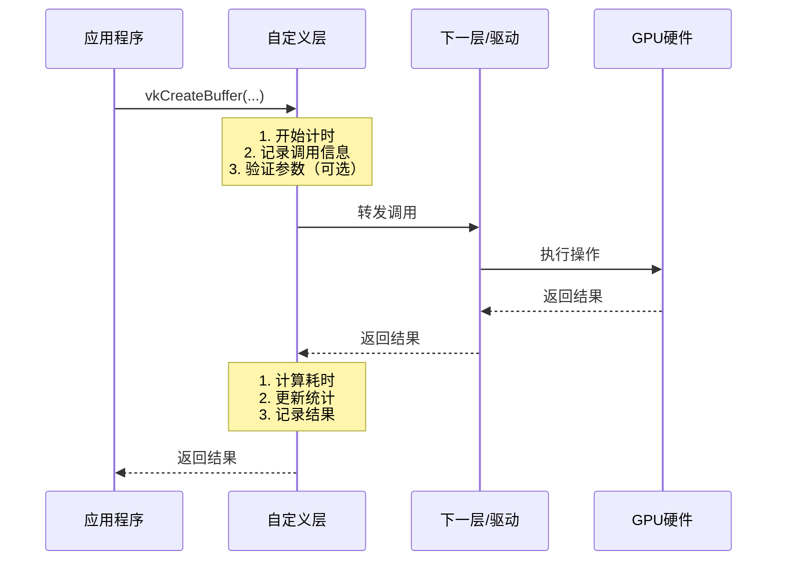

# 自定义 Vulkan 层详细示例

## 示例：API 调用统计层

这个例子展示如何创建一个自定义层，用于统计 Vulkan API 调用的次数和执行时间。

---

## 1. 层的结构定义

```cpp
// MyStatsLayer.h

#pragma once

#include "vulkan/vulkan.h"
#include <unordered_map>
#include <string>
#include <chrono>
#include <mutex>

// 函数调用统计信息
struct FunctionStats {
    uint64_t callCount = 0;           // 调用次数
    uint64_t totalTimeNs = 0;         // 总耗时（纳秒）
    uint64_t minTimeNs = UINT64_MAX;  // 最小耗时
    uint64_t maxTimeNs = 0;           // 最大耗时
};

// 自定义层数据结构
struct MyStatsLayer {
    // 下一层的函数指针（指向真正的驱动或下一层）
    PFN_vkCreateBuffer next_vkCreateBuffer = nullptr;
    PFN_vkCreateImage next_vkCreateImage = nullptr;
    PFN_vkCmdDrawIndexed next_vkCmdDrawIndexed = nullptr;
    PFN_vkQueueSubmit next_vkQueueSubmit = nullptr;
    
    // 统计信息（线程安全）
    std::mutex statsMutex;
    std::unordered_map<std::string, FunctionStats> functionStats;
    
    // 是否启用统计
    bool enabled = true;
};

// 全局层实例
extern MyStatsLayer* g_layer;
```

---

## 2. 层的初始化实现

```cpp
// MyStatsLayer.cpp

#include "MyStatsLayer.h"
#include <iostream>
#include <fstream>

MyStatsLayer* g_layer = nullptr;

// 获取函数执行时间（辅助函数）
class Timer {
    std::chrono::high_resolution_clock::time_point start;
public:
    Timer() : start(std::chrono::high_resolution_clock::now()) {}
    
    uint64_t elapsed() {
        auto end = std::chrono::high_resolution_clock::now();
        return std::chrono::duration_cast<std::chrono::nanoseconds>(
            end - start).count();
    }
};

// 初始化层
extern "C" VkResult VKAPI_CALL MyStatsLayer_vkCreateInstance(
    const VkInstanceCreateInfo* pCreateInfo,
    const VkAllocationCallbacks* pAllocator,
    VkInstance* pInstance)
{
    // 创建层实例
    g_layer = new MyStatsLayer();
    
    // 获取下一层的函数指针
    // 这里简化处理，实际应该通过 Vulkan Loader 获取
    // ...
    
    // 调用真正的 vkCreateInstance
    // 实际实现中需要通过 Vulkan Loader 获取函数指针
    // 这里只是示例结构
    
    std::cout << "[MyStatsLayer] 层已初始化\n";
    
    return VK_SUCCESS;
}
```

---

## 3. 函数拦截实现

### 3.1 拦截 vkCreateBuffer

```cpp
// 拦截 vkCreateBuffer 并统计
extern "C" VkResult VKAPI_CALL MyStatsLayer_vkCreateBuffer(
    VkDevice device,
    const VkBufferCreateInfo* pCreateInfo,
    const VkAllocationCallbacks* pAllocator,
    VkBuffer* pBuffer)
{
    if (!g_layer || !g_layer->enabled) {
        // 如果层未启用，直接转发
        return g_layer->next_vkCreateBuffer(
            device, pCreateInfo, pAllocator, pBuffer);
    }
    
    // 开始计时
    Timer timer;
    
    // 记录调用信息
    std::cout << "[MyStatsLayer] vkCreateBuffer 调用: "
              << "size=" << pCreateInfo->size 
              << ", usage=" << pCreateInfo->usage << "\n";
    
    // 调用真正的函数
    VkResult result = g_layer->next_vkCreateBuffer(
        device, pCreateInfo, pAllocator, pBuffer);
    
    // 计算耗时
    uint64_t elapsed = timer.elapsed();
    
    // 更新统计信息
    {
        std::lock_guard<std::mutex> lock(g_layer->statsMutex);
        FunctionStats& stats = g_layer->functionStats["vkCreateBuffer"];
        stats.callCount++;
        stats.totalTimeNs += elapsed;
        stats.minTimeNs = std::min(stats.minTimeNs, elapsed);
        stats.maxTimeNs = std::max(stats.maxTimeNs, elapsed);
    }
    
    return result;
}
```

### 3.2 拦截 vkCreateImage

```cpp
// 拦截 vkCreateImage 并统计
extern "C" VkResult VKAPI_CALL MyStatsLayer_vkCreateImage(
    VkDevice device,
    const VkImageCreateInfo* pCreateInfo,
    const VkAllocationCallbacks* pAllocator,
    VkImage* pImage)
{
    if (!g_layer || !g_layer->enabled) {
        return g_layer->next_vkCreateImage(
            device, pCreateInfo, pAllocator, pImage);
    }
    
    Timer timer;
    
    std::cout << "[MyStatsLayer] vkCreateImage 调用: "
              << "width=" << pCreateInfo->extent.width
              << ", height=" << pCreateInfo->extent.height
              << ", format=" << pCreateInfo->format << "\n";
    
    VkResult result = g_layer->next_vkCreateImage(
        device, pCreateInfo, pAllocator, pImage);
    
    uint64_t elapsed = timer.elapsed();
    
    {
        std::lock_guard<std::mutex> lock(g_layer->statsMutex);
        FunctionStats& stats = g_layer->functionStats["vkCreateImage"];
        stats.callCount++;
        stats.totalTimeNs += elapsed;
        stats.minTimeNs = std::min(stats.minTimeNs, elapsed);
        stats.maxTimeNs = std::max(stats.maxTimeNs, elapsed);
    }
    
    return result;
}
```

### 3.3 拦截 vkCmdDrawIndexed（高频调用）

```cpp
// 拦截绘制调用（高频函数，只统计不打印）
extern "C" void VKAPI_CALL MyStatsLayer_vkCmdDrawIndexed(
    VkCommandBuffer commandBuffer,
    uint32_t indexCount,
    uint32_t instanceCount,
    uint32_t firstIndex,
    int32_t vertexOffset,
    uint32_t firstInstance)
{
    if (!g_layer || !g_layer->enabled) {
        g_layer->next_vkCmdDrawIndexed(
            commandBuffer, indexCount, instanceCount,
            firstIndex, vertexOffset, firstInstance);
        return;
    }
    
    Timer timer;
    
    // 调用真正的函数
    g_layer->next_vkCmdDrawIndexed(
        commandBuffer, indexCount, instanceCount,
        firstIndex, vertexOffset, firstInstance);
    
    uint64_t elapsed = timer.elapsed();
    
    // 只统计，不打印（因为调用太频繁）
    {
        std::lock_guard<std::mutex> lock(g_layer->statsMutex);
        FunctionStats& stats = g_layer->functionStats["vkCmdDrawIndexed"];
        stats.callCount++;
        stats.totalTimeNs += elapsed;
        stats.minTimeNs = std::min(stats.minTimeNs, elapsed);
        stats.maxTimeNs = std::max(stats.maxTimeNs, elapsed);
    }
}
```

---

## 4. 统计报告功能

```cpp
// 输出统计报告
void PrintStatsReport() {
    if (!g_layer) return;
    
    std::lock_guard<std::mutex> lock(g_layer->statsMutex);
    
    std::cout << "\n========== API 调用统计报告 ==========\n";
    std::cout << "函数名称\t\t调用次数\t总耗时(ms)\t平均耗时(μs)\t最小(μs)\t最大(μs)\n";
    std::cout << "--------------------------------------------------------\n";
    
    for (const auto& pair : g_layer->functionStats) {
        const std::string& funcName = pair.first;
        const FunctionStats& stats = pair.second;
        
        if (stats.callCount == 0) continue;
        
        double totalMs = stats.totalTimeNs / 1000000.0;
        double avgUs = (stats.totalTimeNs / stats.callCount) / 1000.0;
        double minUs = stats.minTimeNs / 1000.0;
        double maxUs = stats.maxTimeNs / 1000.0;
        
        printf("%-20s\t%llu\t\t%.2f\t\t%.2f\t\t%.2f\t%.2f\n",
               funcName.c_str(),
               stats.callCount,
               totalMs,
               avgUs,
               minUs,
               maxUs);
    }
    
    std::cout << "========================================\n\n";
}

// 保存统计报告到文件
void SaveStatsToFile(const std::string& filename) {
    if (!g_layer) return;
    
    std::ofstream file(filename);
    if (!file.is_open()) {
        std::cerr << "无法打开文件: " << filename << "\n";
        return;
    }
    
    std::lock_guard<std::mutex> lock(g_layer->statsMutex);
    
    file << "API 调用统计报告\n";
    file << "==================\n\n";
    
    for (const auto& pair : g_layer->functionStats) {
        const std::string& funcName = pair.first;
        const FunctionStats& stats = pair.second;
        
        if (stats.callCount == 0) continue;
        
        file << "函数: " << funcName << "\n";
        file << "  调用次数: " << stats.callCount << "\n";
        file << "  总耗时: " << (stats.totalTimeNs / 1000000.0) << " ms\n";
        file << "  平均耗时: " << (stats.totalTimeNs / stats.callCount / 1000.0) << " μs\n";
        file << "  最小耗时: " << (stats.minTimeNs / 1000.0) << " μs\n";
        file << "  最大耗时: " << (stats.maxTimeNs / 1000.0) << " μs\n";
        file << "\n";
    }
    
    file.close();
    std::cout << "统计报告已保存到: " << filename << "\n";
}
```

---

## 5. 层的注册文件（JSON）

### Windows/Linux 层注册文件

```json
// VkLayer_MyStatsLayer.json

{
    "file_format_version": "1.0.0",
    "layer": {
        "name": "VK_LAYER_MY_STATS_LAYER",
        "type": "GLOBAL",
        "library_path": "./MyStatsLayer.dll",  // Windows
        // "library_path": "./libMyStatsLayer.so",  // Linux
        "api_version": "1.3.0",
        "implementation_version": "1",
        "description": "自定义 API 调用统计层",
        "functions": {
            "vkGetInstanceProcAddr": "MyStatsLayer_vkGetInstanceProcAddr",
            "vkGetDeviceProcAddr": "MyStatsLayer_vkGetDeviceProcAddr"
        },
        "enable_environment": {
            "VK_LAYER_MY_STATS_LAYER_ENABLE": "1"
        },
        "disable_environment": {
            "VK_LAYER_MY_STATS_LAYER_DISABLE": "1"
        }
    }
}
```

---

## 6. 层的入口点实现

```cpp
// 层的入口点：获取函数指针
extern "C" PFN_vkVoidFunction VKAPI_CALL MyStatsLayer_vkGetInstanceProcAddr(
    VkInstance instance,
    const char* pName)
{
    // 拦截我们关心的函数
    if (strcmp(pName, "vkCreateBuffer") == 0) {
        return (PFN_vkVoidFunction)MyStatsLayer_vkCreateBuffer;
    }
    if (strcmp(pName, "vkCreateImage") == 0) {
        return (PFN_vkVoidFunction)MyStatsLayer_vkCreateImage;
    }
    if (strcmp(pName, "vkCmdDrawIndexed") == 0) {
        return (PFN_vkVoidFunction)MyStatsLayer_vkCmdDrawIndexed;
    }
    
    // 其他函数转发到下一层
    if (g_layer && instance != VK_NULL_HANDLE) {
        // 获取下一层的函数指针
        // 实际实现需要通过 Vulkan Loader
        // ...
    }
    
    return nullptr;
}

extern "C" PFN_vkVoidFunction VKAPI_CALL MyStatsLayer_vkGetDeviceProcAddr(
    VkDevice device,
    const char* pName)
{
    // 设备级别的函数拦截
    if (strcmp(pName, "vkCreateBuffer") == 0) {
        return (PFN_vkVoidFunction)MyStatsLayer_vkCreateBuffer;
    }
    if (strcmp(pName, "vkCreateImage") == 0) {
        return (PFN_vkVoidFunction)MyStatsLayer_vkCreateImage;
    }
    if (strcmp(pName, "vkCmdDrawIndexed") == 0) {
        return (PFN_vkVoidFunction)MyStatsLayer_vkCmdDrawIndexed;
    }
    
    return nullptr;
}
```

---

## 7. 在应用程序中使用

```cpp
// main.cpp - 使用自定义层

#include "vulkan/vulkan.h"
#include <iostream>
#include <vector>

int main() {
    // 1. 查询可用层
    uint32_t layerCount = 0;
    vkEnumerateInstanceLayerProperties(&layerCount, nullptr);
    std::vector<VkLayerProperties> layers(layerCount);
    vkEnumerateInstanceLayerProperties(&layerCount, layers.data());
    
    // 2. 检查我们的自定义层是否存在
    bool foundStatsLayer = false;
    for (const auto& layer : layers) {
        if (strcmp(layer.layerName, "VK_LAYER_MY_STATS_LAYER") == 0) {
            foundStatsLayer = true;
            std::cout << "找到自定义统计层！\n";
            break;
        }
    }
    
    if (!foundStatsLayer) {
        std::cerr << "警告：未找到自定义统计层\n";
    }
    
    // 3. 创建实例时启用层
    VkInstanceCreateInfo createInfo{};
    createInfo.sType = VK_STRUCTURE_TYPE_INSTANCE_CREATE_INFO;
    
    const char* layerNames[] = {
        "VK_LAYER_MY_STATS_LAYER"  // 启用我们的自定义层
    };
    
    if (foundStatsLayer) {
        createInfo.enabledLayerCount = 1;
        createInfo.ppEnabledLayerNames = layerNames;
    }
    
    VkInstance instance;
    VkResult result = vkCreateInstance(&createInfo, nullptr, &instance);
    
    if (result != VK_SUCCESS) {
        std::cerr << "创建实例失败\n";
        return -1;
    }
    
    // 4. 正常使用 Vulkan API
    // 所有调用都会被层拦截和统计
    
    // ... 你的 Vulkan 代码 ...
    
    // 5. 程序结束时输出统计报告
    PrintStatsReport();
    SaveStatsToFile("api_stats.txt");
    
    // 6. 清理
    vkDestroyInstance(instance, nullptr);
    
    return 0;
}
```

---

## 8. 实际运行效果

### 运行时输出：

```
[MyStatsLayer] 层已初始化
[MyStatsLayer] vkCreateBuffer 调用: size=1024, usage=1
[MyStatsLayer] vkCreateImage 调用: width=1920, height=1080, format=50
[MyStatsLayer] vkCreateBuffer 调用: size=2048, usage=2
... (更多调用)

========== API 调用统计报告 ==========
函数名称		调用次数	总耗时(ms)	平均耗时(μs)	最小(μs)	最大(μs)
--------------------------------------------------------
vkCreateBuffer		15		2.34		156.00		120.00	200.00
vkCreateImage		8		1.89		236.25		180.00	320.00
vkCmdDrawIndexed	10000	45.67		4.57		3.20	8.50
========================================
```

### 保存的文件内容：

```
API 调用统计报告
==================

函数: vkCreateBuffer
  调用次数: 15
  总耗时: 2.34 ms
  平均耗时: 156.00 μs
  最小耗时: 120.00 μs
  最大耗时: 200.00 μs

函数: vkCreateImage
  调用次数: 8
  总耗时: 1.89 ms
  平均耗时: 236.25 μs
  最小耗时: 180.00 μs
  最大耗时: 320.00 μs

函数: vkCmdDrawIndexed
  调用次数: 10000
  总耗时: 45.67 ms
  平均耗时: 4.57 μs
  最小耗时: 3.20 μs
  最大耗时: 8.50 μs
```

---

## 9. 编译和部署

### 编译步骤：

```bash
# 1. 编译层库
g++ -shared -fPIC MyStatsLayer.cpp -o libMyStatsLayer.so -lvulkan

# 2. 将 JSON 文件放到正确位置
# Linux: ~/.local/share/vulkan/implicit_layer.d/
# Windows: 注册表或环境变量指定路径

# 3. 编译应用程序
g++ main.cpp -o myapp -lvulkan
```

---

## 10. 这个例子的价值

### 实际应用场景：

1. **性能分析**
   - 知道哪些 API 调用最耗时
   - 识别性能瓶颈
   - 优化方向明确

2. **调试辅助**
   - 记录所有 API 调用
   - 可以回放调用序列
   - 发现问题调用

3. **自动化测试**
   - 统计测试中的 API 使用
   - 验证性能要求
   - 生成测试报告

---

## 总结

这个例子展示了：

1. ✅ **如何拦截 Vulkan API 调用**
2. ✅ **如何统计调用信息**
3. ✅ **如何转发调用到驱动**
4. ✅ **如何注册和使用自定义层**
5. ✅ **实际的应用价值**

**关键点**：
- 层可以拦截任何 Vulkan 函数
- 可以在调用前后添加自己的逻辑
- 必须正确转发调用到下一层或驱动
- 需要处理线程安全

---

## 11. 获取下一层函数指针的详细实现

### 11.1 通过 Vulkan Loader 获取函数指针

```cpp
// 获取下一层的函数指针（关键实现）
PFN_vkCreateBuffer GetNext_vkCreateBuffer(VkDevice device) {
    // 方法1：通过 vkGetDeviceProcAddr 获取
    // 这会自动获取下一层的函数指针
    PFN_vkCreateBuffer func = (PFN_vkCreateBuffer)
        vkGetDeviceProcAddr(device, "vkCreateBuffer");
    
    // 如果获取失败，尝试通过实例获取
    if (!func) {
        // 需要先获取实例
        // ...
    }
    
    return func;
}

// 更完整的实现：使用 Vulkan Layer SDK
#include "vulkan/vk_layer.h"

// 获取下一层的实例函数
PFN_vkCreateInstance GetNext_vkCreateInstance() {
    // 通过 Vulkan Loader 的机制获取
    // 这需要调用 Vulkan Loader 提供的函数
    return (PFN_vkCreateInstance)
        vkGetInstanceProcAddr(VK_NULL_HANDLE, "vkCreateInstance");
}
```

### 11.2 使用 Vulkan Layer SDK 的标准方式

```cpp
// 使用 Vulkan Layer SDK 提供的标准机制
#include "vulkan/vk_layer_dispatch_table.h"

// 在层初始化时获取 dispatch table
void InitLayerDispatchTable(VkInstance instance) {
    // Vulkan Layer SDK 提供了标准方式来获取下一层的函数指针
    // 这确保了与 Vulkan Loader 的正确交互
    
    // 获取实例级别的 dispatch table
    instance_dispatch_table = new VkLayerInstanceDispatchTable;
    layer_init_instance_dispatch_table(
        instance, instance_dispatch_table, vkGetInstanceProcAddr);
    
    // 获取设备级别的 dispatch table
    device_dispatch_table = new VkLayerDispatchTable;
    layer_init_device_dispatch_table(
        device, device_dispatch_table, vkGetDeviceProcAddr);
}
```

---

## 12. 层的完整工作流程

### 12.1 层的加载和初始化流程

```
┌─────────────────────────────────────────────────────────┐
│           层的完整生命周期                                │
├─────────────────────────────────────────────────────────┤
│  1. 应用程序启动                                         │
│     ↓                                                    │
│  2. 查询可用层                                           │
│     vkEnumerateInstanceLayerProperties()                 │
│     ↓                                                    │
│  3. 创建 VkInstance 时指定层                            │
│     ppEnabledLayerNames = ["VK_LAYER_MY_STATS_LAYER"]    │
│     ↓                                                    │
│  4. Vulkan Loader 加载层库                               │
│     - 加载 .dll / .so 文件                               │
│     - 调用层的初始化函数                                  │
│     ↓                                                    │
│  5. 层初始化                                             │
│     - 创建层数据结构                                      │
│     - 获取下一层函数指针                                  │
│     - 设置回调函数                                        │
│     ↓                                                    │
│  6. 层激活                                               │
│     - 开始拦截 API 调用                                  │
│     - 处理所有经过的调用                                  │
│     ↓                                                    │
│  7. 运行时拦截                                           │
│     - 应用程序调用 API                                    │
│     - 层拦截并处理                                        │
│     - 转发到下一层/驱动                                   │
│     ↓                                                    │
│  8. 应用程序结束                                         │
│     ↓                                                    │
│  9. 层清理                                               │
│     - 输出统计报告                                        │
│     - 释放资源                                            │
│     - 销毁层实例                                          │
└─────────────────────────────────────────────────────────┘
```

### 12.2 函数调用的拦截流程



---

## 13. 更高级的层功能示例

### 13.1 参数验证和修改

```cpp
// 示例：自动修复常见错误
VkResult MyStatsLayer_vkCreateBuffer(
    VkDevice device,
    const VkBufferCreateInfo* pCreateInfo,
    const VkAllocationCallbacks* pAllocator,
    VkBuffer* pBuffer)
{
    // 检查并修复常见错误
    VkBufferCreateInfo fixedInfo = *pCreateInfo;
    
    // 错误1：size 为 0
    if (fixedInfo.size == 0) {
        std::cerr << "[MyStatsLayer] 警告：size 为 0，自动修复为 1\n";
        fixedInfo.size = 1;  // 自动修复
    }
    
    // 错误2：usage 标志为空
    if (fixedInfo.usage == 0) {
        std::cerr << "[MyStatsLayer] 警告：usage 为空，自动设置为默认值\n";
        fixedInfo.usage = VK_BUFFER_USAGE_VERTEX_BUFFER_BIT;
    }
    
    // 使用修复后的参数调用
    return g_layer->next_vkCreateBuffer(
        device, &fixedInfo, pAllocator, pBuffer);
}
```

### 13.2 调用回放功能

```cpp
// 记录所有调用以便回放
struct CallRecord {
    std::string functionName;
    std::vector<uint8_t> parameters;  // 序列化的参数
    VkResult result;
    uint64_t timestamp;
};

std::vector<CallRecord> callHistory;

// 记录调用
void RecordCall(const std::string& funcName, 
                const void* params, 
                size_t paramSize,
                VkResult result)
{
    CallRecord record;
    record.functionName = funcName;
    record.parameters.assign(
        (uint8_t*)params, 
        (uint8_t*)params + paramSize);
    record.result = result;
    record.timestamp = GetCurrentTime();
    
    callHistory.push_back(record);
}

// 回放调用
void ReplayCalls() {
    for (const auto& record : callHistory) {
        std::cout << "回放: " << record.functionName << "\n";
        // 反序列化参数并重新调用
        // ...
    }
}
```

### 13.3 性能瓶颈自动检测

```cpp
// 自动检测性能瓶颈
void CheckPerformanceBottleneck(
    const std::string& funcName,
    uint64_t elapsedNs)
{
    // 定义阈值
    const uint64_t SLOW_THRESHOLD_NS = 1000000;  // 1ms
    
    if (elapsedNs > SLOW_THRESHOLD_NS) {
        std::cerr << "[MyStatsLayer] ⚠️ 性能警告: " 
                  << funcName 
                  << " 耗时 " 
                  << (elapsedNs / 1000.0) 
                  << " μs (超过阈值)\n";
        
        // 可以触发回调或记录到文件
        OnPerformanceWarning(funcName, elapsedNs);
    }
}

// 在函数拦截中使用
VkResult MyStatsLayer_vkCreateBuffer(...) {
    Timer timer;
    VkResult result = g_layer->next_vkCreateBuffer(...);
    uint64_t elapsed = timer.elapsed();
    
    // 检查性能
    CheckPerformanceBottleneck("vkCreateBuffer", elapsed);
    
    return result;
}
```

---

## 14. 多层叠加的使用

### 14.1 多个层同时工作

```
应用程序
  ↓
层1：验证层（检查错误）
  ↓
层2：统计层（统计调用）
  ↓
层3：性能层（性能分析）
  ↓
驱动
```

### 14.2 层的调用顺序

```cpp
// 在创建实例时指定多个层
const char* layerNames[] = {
    "VK_LAYER_KHRONOS_validation",  // 第一层：验证
    "VK_LAYER_MY_STATS_LAYER",      // 第二层：统计
    "VK_LAYER_LUNARG_monitor"       // 第三层：监控
};

VkInstanceCreateInfo createInfo{};
createInfo.enabledLayerCount = 3;
createInfo.ppEnabledLayerNames = layerNames;
```

**调用顺序**：
1. 应用程序调用 API
2. 验证层先处理（检查错误）
3. 统计层处理（记录调用）
4. 监控层处理（性能监控）
5. 驱动执行
6. 结果按相反顺序返回

---

## 15. 注意事项和最佳实践

### 15.1 线程安全

```cpp
// ✅ 正确：使用互斥锁保护共享数据
{
    std::lock_guard<std::mutex> lock(g_layer->statsMutex);
    g_layer->functionStats["vkCreateBuffer"].callCount++;
}

// ❌ 错误：直接访问共享数据（多线程不安全）
g_layer->functionStats["vkCreateBuffer"].callCount++;  // 危险！
```

### 15.2 性能考虑

```cpp
// ✅ 正确：高频函数只做必要操作
void MyStatsLayer_vkCmdDrawIndexed(...) {
    // 只统计，不打印（因为调用太频繁）
    UpdateStatsOnly("vkCmdDrawIndexed");
    g_layer->next_vkCmdDrawIndexed(...);
}

// ❌ 错误：高频函数做太多操作
void MyStatsLayer_vkCmdDrawIndexed(...) {
    std::cout << "调用 vkCmdDrawIndexed\n";  // 太慢！
    SaveToFile(...);  // 更慢！
    g_layer->next_vkCmdDrawIndexed(...);
}
```

### 15.3 错误处理

```cpp
// ✅ 正确：处理下一层调用失败的情况
VkResult MyStatsLayer_vkCreateBuffer(...) {
    VkResult result = g_layer->next_vkCreateBuffer(...);
    
    if (result != VK_SUCCESS) {
        // 记录错误，但不阻止调用
        LogError("vkCreateBuffer 失败: %d", result);
    }
    
    return result;  // 返回原始结果
}
```

### 15.4 内存管理

```cpp
// ✅ 正确：在层销毁时清理资源
void DestroyLayer() {
    if (g_layer) {
        // 输出最终报告
        PrintStatsReport();
        
        // 清理资源
        g_layer->functionStats.clear();
        
        // 删除层实例
        delete g_layer;
        g_layer = nullptr;
    }
}
```

---

## 16. 实际应用场景扩展

### 场景1：游戏引擎的调试层

```cpp
// 游戏引擎特定的层
struct GameEngineLayer {
    // 记录引擎特定的信息
    struct RenderCall {
        std::string meshName;
        std::string materialName;
        uint32_t triangleCount;
    };
    
    std::vector<RenderCall> renderCalls;
    
    // 拦截绘制调用，记录引擎信息
    void OnDrawCall(const RenderCall& call) {
        renderCalls.push_back(call);
        
        // 检查性能
        if (call.triangleCount > 100000) {
            Warn("高多边形数: %s (%d triangles)", 
                 call.meshName.c_str(), 
                 call.triangleCount);
        }
    }
};
```

### 场景2：自动化测试框架

```cpp
// 测试框架层
struct TestFrameworkLayer {
    // 记录所有 API 调用
    std::vector<APICall> callSequence;
    
    // 验证调用顺序
    bool ValidateCallSequence() {
        // 检查调用是否符合预期
        // 例如：必须先创建设备，才能创建缓冲区
        // ...
    }
    
    // 生成测试报告
    void GenerateTestReport() {
        // 统计测试覆盖率
        // 检查是否有未测试的 API
        // ...
    }
};
```

### 场景3：驱动兼容性层

```cpp
// 修复特定驱动的 bug
VkResult CompatibilityLayer_vkCreateImage(...) {
    // 检测驱动版本
    VkPhysicalDeviceProperties props;
    vkGetPhysicalDeviceProperties(physicalDevice, &props);
    
    // 特定驱动的 bug 修复
    if (props.vendorID == 0x10DE) {  // NVIDIA
        // NVIDIA 驱动的特定修复
        if (pCreateInfo->format == VK_FORMAT_R8G8B8A8_UNORM) {
            // 应用修复
            // ...
        }
    }
    
    return next_vkCreateImage(...);
}
```

---

## 17. 调试自定义层

### 17.1 层的调试技巧

```cpp
// 添加调试输出
#define LAYER_DEBUG 1

#if LAYER_DEBUG
    #define LAYER_LOG(msg) std::cout << "[Layer] " << msg << "\n"
#else
    #define LAYER_LOG(msg)
#endif

// 使用
LAYER_LOG("vkCreateBuffer 被调用");
```

### 17.2 验证层是否正确工作

```cpp
// 检查层是否被加载
bool IsLayerLoaded() {
    uint32_t count = 0;
    vkEnumerateInstanceLayerProperties(&count, nullptr);
    
    std::vector<VkLayerProperties> layers(count);
    vkEnumerateInstanceLayerProperties(&count, layers.data());
    
    for (const auto& layer : layers) {
        if (strcmp(layer.layerName, "VK_LAYER_MY_STATS_LAYER") == 0) {
            return true;
        }
    }
    return false;
}
```

---

## 18. 总结

### 自定义层的核心要点

1. **函数拦截**
   - 通过 `vkGetInstanceProcAddr` 和 `vkGetDeviceProcAddr` 拦截函数
   - 必须正确转发到下一层

2. **数据管理**
   - 使用线程安全的数据结构
   - 正确管理生命周期

3. **性能考虑**
   - 高频函数要轻量级
   - 避免不必要的开销

4. **错误处理**
   - 正确处理下一层调用失败
   - 不改变原始行为

5. **注册和部署**
   - 正确配置 JSON 文件
   - 确保库文件路径正确

### 自定义层的价值

- ✅ **特定需求**：满足项目特定的调试和分析需求
- ✅ **灵活扩展**：可以添加任何功能
- ✅ **深度集成**：与应用程序深度集成
- ✅ **性能分析**：精确的性能数据收集
- ✅ **问题诊断**：快速定位问题

**记住**：自定义层是强大的工具，但也要注意性能影响和正确性。在开发阶段使用，发布时禁用或移除。