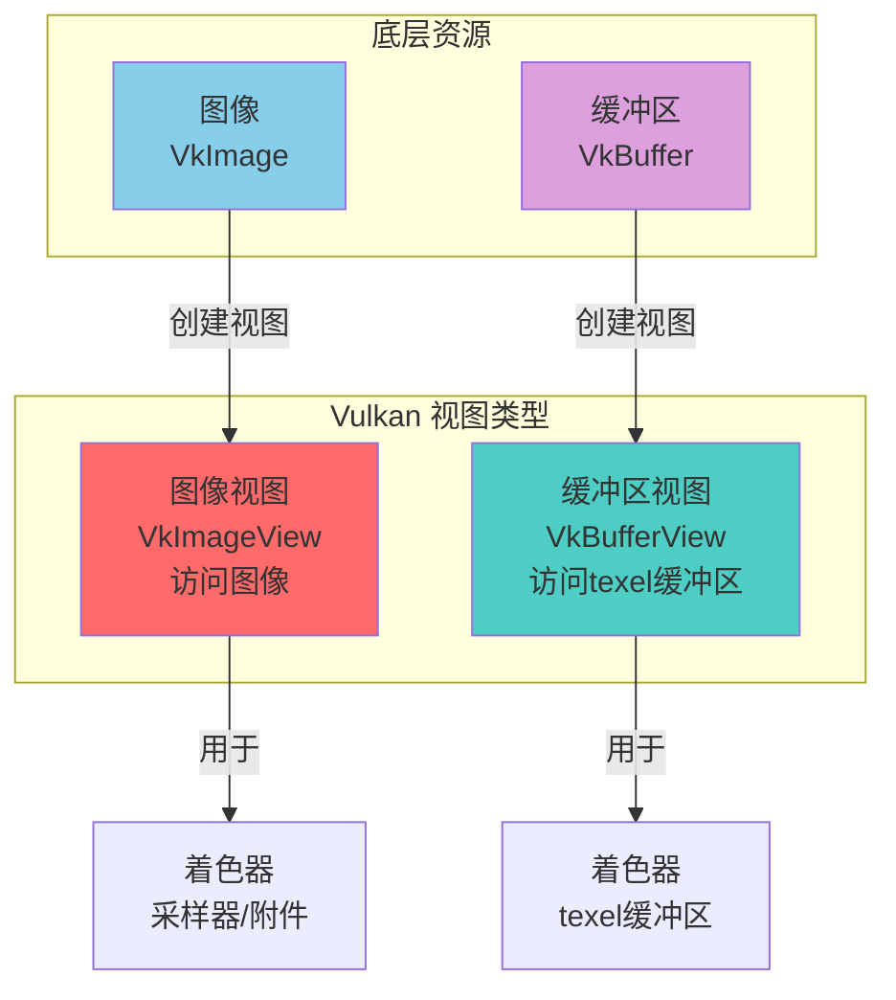
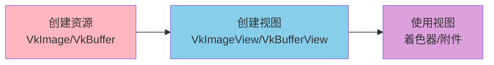
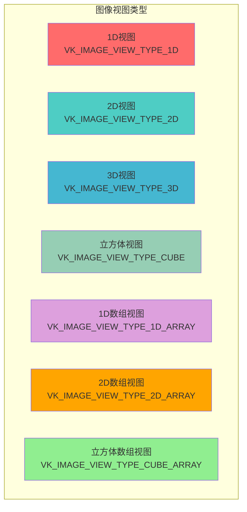
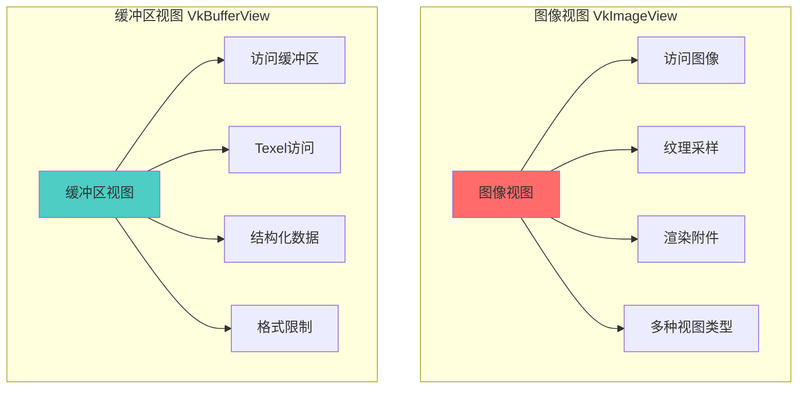
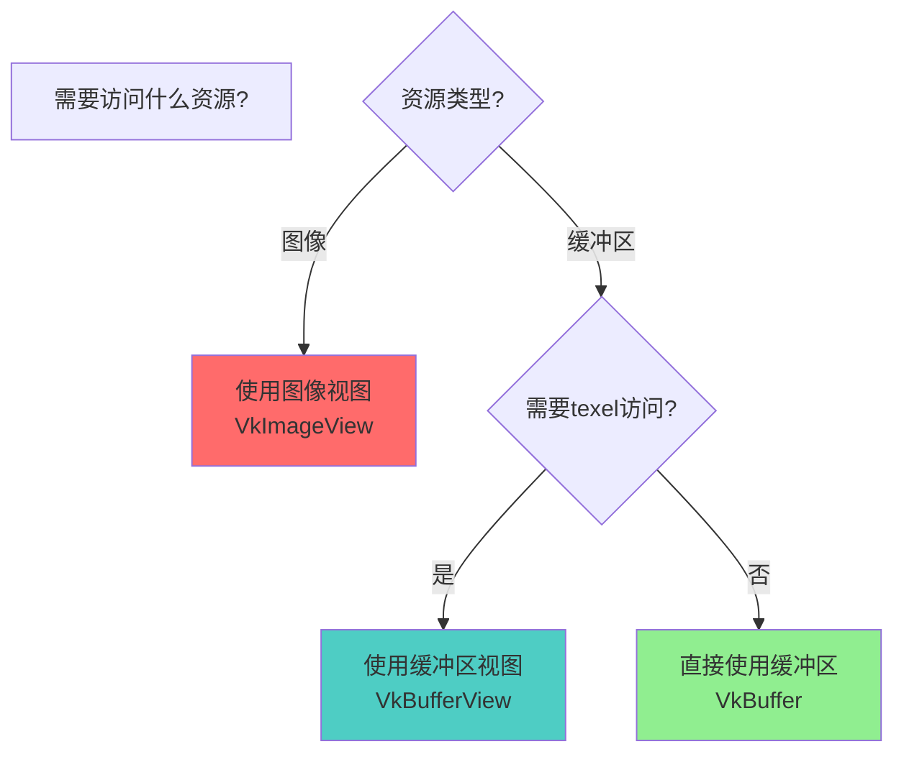
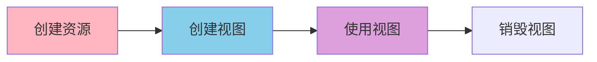

# Vulkan 视图详细分析文档

## 目录
1. [Vulkan 中的视图类型总览](#vulkan-中的视图类型总览)
2. [视图是什么？用生活例子理解](#视图是什么用生活例子理解)
3. [图像视图（ImageView）](#图像视图imageview)
4. [缓冲区视图（BufferView）](#缓冲区视图bufferview)
5. [视图的对比与选择](#视图的对比与选择)
6. [视图的使用场景](#视图的使用场景)
7. [实际代码示例](#实际代码示例)
8. [最佳实践](#最佳实践)

---

## Vulkan 中的视图类型总览

### 视图类型概述

在 Vulkan 中，**视图（View）**是用于访问资源的对象。视图定义了如何解释和访问底层资源（图像或缓冲区）的数据。Vulkan 提供了两种主要的视图类型：



### 所有视图类型列表

| 视图类型 | 枚举/句柄 | 访问的资源 | 版本要求 | 主要用途 |
|--------|----------|-----------|---------|---------|
| **图像视图** | `VkImageView` | `VkImage` | Vulkan 1.0 | 纹理采样、附件 |
| **缓冲区视图** | `VkBufferView` | `VkBuffer` | Vulkan 1.0 | Texel缓冲区访问 |

### 视图的核心特点

- **资源抽象**: 视图是对资源的抽象，定义如何访问资源
- **多视图支持**: 一个资源可以创建多个视图
- **访问控制**: 视图定义访问的范围和方式
- **格式转换**: 视图可以指定不同的格式（图像视图）
- **子资源范围**: 视图可以访问资源的子集

---

## 视图是什么？用生活例子理解

### 🪟 最简单的理解：视图 = 窗户

想象你在看一栋房子：

```
房子（资源）                窗户（视图）              看到的内容
    │                            │                        │
    │  1. 房子有很多房间          │                        │
    │     （图像有很多Mip级别）   │                        │
    │                            │                        │
    │  2. 打开一扇窗户            │                        │
    │     （创建视图）             │                        │
    │                            │                        │
    │  3. 通过窗户看房间          │                        │
    │     （通过视图访问资源）     │                        │
    │                            │                        │
    │  4. 可以打开多扇窗户        │                        │
    │     （一个资源多个视图）     │                        │
```

**视图（View）就像窗户**：
- **资源** = 房子（图像/缓冲区）
- **视图** = 窗户（定义如何看房子）
- **访问** = 通过窗户看房间（通过视图访问资源）

### 📷 更具体的例子：相机取景器

想象你在拍照：

```
场景（资源）                取景器（视图）              拍摄内容
    │                            │                        │
    │  1. 场景很大                │                        │
    │     （图像很大）             │                        │
    │                            │                        │
    │  2. 调整取景器              │                        │
    │     （创建视图）             │                        │
    │     选择范围                │                        │
    │     选择角度                │                        │
    │                            │                        │
    │  3. 通过取景器拍摄          │                        │
    │     （通过视图访问）         │                        │
```

### 🎨 画布例子：不同的画框

想象你在看一幅画：

```
画作（资源）                画框（视图）              展示内容
    │                            │                        │
    │  1. 画作很大                │                        │
    │     （图像很大）             │                        │
    │                            │                        │
    │  2. 选择画框                │                        │
    │     （创建视图）             │                        │
    │     选择区域                │                        │
    │     选择格式                │                        │
    │                            │                        │
    │  3. 通过画框展示            │                        │
    │     （通过视图访问）         │                        │
```

### 💻 在Vulkan中的实际场景

#### 场景1：图像视图

```cpp
// 1. 创建图像（房子）
VkImage image;
vkCreateImage(...);

// 2. 创建图像视图（窗户）
VkImageViewCreateInfo viewInfo{};
viewInfo.image = image;  // 指向图像
viewInfo.viewType = VK_IMAGE_VIEW_TYPE_2D;  // 2D视图
viewInfo.format = VK_FORMAT_R8G8B8A8_UNORM;  // 格式
viewInfo.subresourceRange.aspectMask = VK_IMAGE_ASPECT_COLOR_BIT;  // 颜色方面
viewInfo.subresourceRange.baseMipLevel = 0;  // 从Mip级别0开始
viewInfo.subresourceRange.levelCount = 1;  // 1个Mip级别

VkImageView imageView;
vkCreateImageView(device, &viewInfo, nullptr, &imageView);

// 3. 使用视图（通过窗户看房间）
// 在着色器中采样纹理
// layout(set = 0, binding = 1) uniform sampler2D texSampler;
```

**为什么需要视图？**
- 图像不能直接使用，需要视图来访问
- 视图定义如何解释图像数据
- 一个图像可以创建多个视图

### 🎯 视图的关键概念



### ✅ 总结：视图就是什么？

**一句话总结**：视图（View）就是**资源的"访问窗口"**，定义如何访问和解释资源数据。

**三个关键词**：
1. **资源抽象** - 视图是对资源的抽象
2. **访问控制** - 视图定义访问的范围和方式
3. **多视图支持** - 一个资源可以创建多个视图

**记住这个公式**：
```
创建资源 → 创建视图 → 使用视图 → 销毁视图
```

**常见使用场景**：
- ✅ 纹理采样（图像视图）
- ✅ 渲染附件（图像视图）
- ✅ Texel缓冲区访问（缓冲区视图）
- ✅ 多格式访问（一个图像多个视图）

---

## 图像视图（ImageView）

### 图像视图概述

**VkImageView** 是图像的视图，定义了如何访问图像数据。一个图像可以创建多个视图，每个视图可以有不同的格式、Mip级别范围、数组层范围等。

### 图像视图的特点

- **资源抽象**: 定义如何访问图像
- **格式指定**: 可以指定视图格式（可能与图像格式不同）
- **子资源范围**: 可以访问图像的特定Mip级别和数组层
- **视图类型**: 支持1D、2D、3D、立方体等多种视图类型
- **分量重排**: 可以重排颜色分量（Swizzle）

### 图像视图的创建

```cpp
VkImageViewCreateInfo viewInfo{};
viewInfo.sType = VK_STRUCTURE_TYPE_IMAGE_VIEW_CREATE_INFO;
viewInfo.image = image;                                    // 图像对象
viewInfo.viewType = VK_IMAGE_VIEW_TYPE_2D;                 // 视图类型
viewInfo.format = VK_FORMAT_R8G8B8A8_UNORM;               // 格式
viewInfo.components.r = VK_COMPONENT_SWIZZLE_IDENTITY;   // 分量重排
viewInfo.components.g = VK_COMPONENT_SWIZZLE_IDENTITY;
viewInfo.components.b = VK_COMPONENT_SWIZZLE_IDENTITY;
viewInfo.components.a = VK_COMPONENT_SWIZZLE_IDENTITY;
viewInfo.subresourceRange.aspectMask = VK_IMAGE_ASPECT_COLOR_BIT;  // 颜色方面
viewInfo.subresourceRange.baseMipLevel = 0;               // 起始Mip级别
viewInfo.subresourceRange.levelCount = 1;                  // Mip级别数
viewInfo.subresourceRange.baseArrayLayer = 0;             // 起始数组层
viewInfo.subresourceRange.layerCount = 1;                 // 数组层数

VkImageView imageView;
vkCreateImageView(device, &viewInfo, nullptr, &imageView);
```

### 图像视图类型



### 图像视图类型详细说明

| 视图类型 | 枚举值 | 说明 | 使用场景 |
|---------|--------|------|---------|
| **1D视图** | `VK_IMAGE_VIEW_TYPE_1D` | 一维图像视图 | 1D纹理 |
| **2D视图** | `VK_IMAGE_VIEW_TYPE_2D` | 二维图像视图 | 2D纹理（最常用） |
| **3D视图** | `VK_IMAGE_VIEW_TYPE_3D` | 三维图像视图 | 3D纹理、体积纹理 |
| **立方体视图** | `VK_IMAGE_VIEW_TYPE_CUBE` | 立方体贴图视图 | 环境贴图、天空盒 |
| **1D数组视图** | `VK_IMAGE_VIEW_TYPE_1D_ARRAY` | 一维数组视图 | 1D纹理数组 |
| **2D数组视图** | `VK_IMAGE_VIEW_TYPE_2D_ARRAY` | 二维数组视图 | 2D纹理数组 |
| **立方体数组视图** | `VK_IMAGE_VIEW_TYPE_CUBE_ARRAY` | 立方体数组视图 | 立方体贴图数组 |

### 图像方面（Aspect）

图像方面指定视图访问图像的哪些部分：

| 方面 | 枚举值 | 说明 | 使用场景 |
|------|--------|------|---------|
| **颜色方面** | `VK_IMAGE_ASPECT_COLOR_BIT` | 颜色数据 | 颜色纹理、颜色附件 |
| **深度方面** | `VK_IMAGE_ASPECT_DEPTH_BIT` | 深度数据 | 深度缓冲 |
| **模板方面** | `VK_IMAGE_ASPECT_STENCIL_BIT` | 模板数据 | 模板缓冲 |
| **深度模板** | `VK_IMAGE_ASPECT_DEPTH_BIT \| VK_IMAGE_ASPECT_STENCIL_BIT` | 深度和模板 | 深度模板缓冲 |

### 分量重排（Component Swizzle）

分量重排允许重新映射颜色分量：

```cpp
viewInfo.components.r = VK_COMPONENT_SWIZZLE_R;  // R -> R
viewInfo.components.g = VK_COMPONENT_SWIZZLE_G;  // G -> G
viewInfo.components.b = VK_COMPONENT_SWIZZLE_B;  // B -> B
viewInfo.components.a = VK_COMPONENT_SWIZZLE_A;  // A -> A

// 或者重排
viewInfo.components.r = VK_COMPONENT_SWIZZLE_B;  // R -> B
viewInfo.components.g = VK_COMPONENT_SWIZZLE_G;  // G -> G
viewInfo.components.b = VK_COMPONENT_SWIZZLE_R;  // B -> R
viewInfo.components.a = VK_COMPONENT_SWIZZLE_ONE;  // A -> 1.0
```

### 子资源范围（Subresource Range）

子资源范围定义视图访问图像的哪些部分：

```cpp
viewInfo.subresourceRange.aspectMask = VK_IMAGE_ASPECT_COLOR_BIT;  // 方面
viewInfo.subresourceRange.baseMipLevel = 0;  // 起始Mip级别
viewInfo.subresourceRange.levelCount = 4;   // Mip级别数（4个级别）
viewInfo.subresourceRange.baseArrayLayer = 0;  // 起始数组层
viewInfo.subresourceRange.layerCount = 6;   // 数组层数（6个层，用于立方体贴图）
```

---

## 缓冲区视图（BufferView）

### 缓冲区视图概述

**VkBufferView** 是缓冲区的视图，用于将缓冲区作为texel缓冲区访问。它允许着色器以类似纹理的方式访问缓冲区数据。

### 缓冲区视图的特点

- **Texel访问**: 允许以texel方式访问缓冲区
- **格式指定**: 必须指定格式
- **范围限制**: 可以访问缓冲区的特定范围
- **着色器访问**: 在着色器中作为texel缓冲区使用

### 缓冲区视图的创建

```cpp
VkBufferViewCreateInfo viewInfo{};
viewInfo.sType = VK_STRUCTURE_TYPE_BUFFER_VIEW_CREATE_INFO;
viewInfo.buffer = buffer;                    // 缓冲区对象
viewInfo.format = VK_FORMAT_R32G32B32A32_SFLOAT;  // 格式
viewInfo.offset = 0;                         // 偏移量
viewInfo.range = VK_WHOLE_SIZE;              // 范围（整个缓冲区）

VkBufferView bufferView;
vkCreateBufferView(device, &viewInfo, nullptr, &bufferView);
```

### 缓冲区视图的使用场景

**场景1: Texel缓冲区访问**

```glsl
// 着色器中
layout(set = 0, binding = 0) uniform samplerBuffer texelBuffer;

void main() {
    vec4 color = texelFetch(texelBuffer, index);
}
```

**场景2: 结构化数据访问**

```cpp
// 将结构化数据作为texel缓冲区访问
struct Vertex {
    float x, y, z;
    float r, g, b;
};

// 创建缓冲区视图
VkBufferViewCreateInfo viewInfo{};
viewInfo.buffer = vertexBuffer;
viewInfo.format = VK_FORMAT_R32G32B32A32_SFLOAT;  // 每4个float一组
viewInfo.offset = 0;
viewInfo.range = VK_WHOLE_SIZE;
vkCreateBufferView(device, &viewInfo, nullptr, &bufferView);
```

### 缓冲区视图的限制

- **格式要求**: 缓冲区必须使用兼容的格式
- **使用标志**: 缓冲区必须具有 `VK_BUFFER_USAGE_UNIFORM_TEXEL_BUFFER_BIT` 或 `VK_BUFFER_USAGE_STORAGE_TEXEL_BUFFER_BIT`
- **对齐要求**: 缓冲区数据必须满足格式对齐要求

---

## 视图的对比与选择

### 图像视图 vs 缓冲区视图



### 对比表格

| 特性 | 图像视图 | 缓冲区视图 |
|------|---------|-----------|
| **访问资源** | VkImage | VkBuffer |
| **主要用途** | 纹理采样、附件 | Texel缓冲区访问 |
| **视图类型** | 7种（1D/2D/3D/立方体/数组） | 无类型 |
| **格式转换** | 支持 | 不支持 |
| **分量重排** | 支持 | 不支持 |
| **子资源范围** | 支持（Mip/层） | 支持（偏移/范围） |
| **使用频率** | 非常高 | 较低 |

### 视图选择指南



---

## 视图的使用场景

### 场景 1: 纹理采样

```cpp
// 创建纹理图像视图
VkImageViewCreateInfo viewInfo{};
viewInfo.image = textureImage;
viewInfo.viewType = VK_IMAGE_VIEW_TYPE_2D;
viewInfo.format = VK_FORMAT_R8G8B8A8_UNORM;
viewInfo.subresourceRange.aspectMask = VK_IMAGE_ASPECT_COLOR_BIT;
viewInfo.subresourceRange.levelCount = mipLevels;
vkCreateImageView(device, &viewInfo, nullptr, &textureView);

// 在描述符集中使用
VkDescriptorImageInfo imageInfo{};
imageInfo.imageView = textureView;
imageInfo.sampler = textureSampler;
imageInfo.imageLayout = VK_IMAGE_LAYOUT_SHADER_READ_ONLY_OPTIMAL;
```

### 场景 2: 渲染附件

```cpp
// 创建颜色附件视图
VkImageViewCreateInfo colorViewInfo{};
colorViewInfo.image = colorImage;
colorViewInfo.viewType = VK_IMAGE_VIEW_TYPE_2D;
colorViewInfo.format = swapChainFormat;
colorViewInfo.subresourceRange.aspectMask = VK_IMAGE_ASPECT_COLOR_BIT;
VkImageView colorView;
vkCreateImageView(device, &colorViewInfo, nullptr, &colorView);

// 创建深度附件视图
VkImageViewCreateInfo depthViewInfo{};
depthViewInfo.image = depthImage;
depthViewInfo.viewType = VK_IMAGE_VIEW_TYPE_2D;
depthViewInfo.format = depthFormat;
depthViewInfo.subresourceRange.aspectMask = VK_IMAGE_ASPECT_DEPTH_BIT;
VkImageView depthView;
vkCreateImageView(device, &depthViewInfo, nullptr, &depthView);

// 在帧缓冲区中使用
VkImageView attachments[] = {colorView, depthView};
VkFramebufferCreateInfo framebufferInfo{};
framebufferInfo.pAttachments = attachments;
framebufferInfo.attachmentCount = 2;
```

### 场景 3: 立方体贴图

```cpp
// 创建立方体贴图视图
VkImageViewCreateInfo cubeViewInfo{};
cubeViewInfo.image = cubeImage;
cubeViewInfo.viewType = VK_IMAGE_VIEW_TYPE_CUBE;
cubeViewInfo.format = VK_FORMAT_R8G8B8A8_UNORM;
cubeViewInfo.subresourceRange.aspectMask = VK_IMAGE_ASPECT_COLOR_BIT;
cubeViewInfo.subresourceRange.layerCount = 6;  // 6个面
VkImageView cubeView;
vkCreateImageView(device, &cubeViewInfo, nullptr, &cubeView);
```

### 场景 4: 多Mip级别视图

```cpp
// 创建完整Mip链视图
VkImageViewCreateInfo fullViewInfo{};
fullViewInfo.subresourceRange.levelCount = mipLevels;  // 所有Mip级别

// 创建单个Mip级别视图
VkImageViewCreateInfo singleMipViewInfo{};
singleMipViewInfo.subresourceRange.baseMipLevel = 2;  // 从Mip级别2开始
singleMipViewInfo.subresourceRange.levelCount = 1;    // 只有1个级别
```

---

## 实际代码示例

### 示例 1: 完整的纹理视图创建

```cpp
class TextureView {
private:
    VkDevice device;
    VkImage image;
    VkImageView view;
    
public:
    void create(VkDevice dev, VkImage img, VkFormat format, uint32_t mipLevels) {
        device = dev;
        image = img;
        
        VkImageViewCreateInfo viewInfo{};
        viewInfo.sType = VK_STRUCTURE_TYPE_IMAGE_VIEW_CREATE_INFO;
        viewInfo.image = image;
        viewInfo.viewType = VK_IMAGE_VIEW_TYPE_2D;
        viewInfo.format = format;
        viewInfo.components = {
            VK_COMPONENT_SWIZZLE_IDENTITY,
            VK_COMPONENT_SWIZZLE_IDENTITY,
            VK_COMPONENT_SWIZZLE_IDENTITY,
            VK_COMPONENT_SWIZZLE_IDENTITY
        };
        viewInfo.subresourceRange.aspectMask = VK_IMAGE_ASPECT_COLOR_BIT;
        viewInfo.subresourceRange.baseMipLevel = 0;
        viewInfo.subresourceRange.levelCount = mipLevels;
        viewInfo.subresourceRange.baseArrayLayer = 0;
        viewInfo.subresourceRange.layerCount = 1;
        
        vkCreateImageView(device, &viewInfo, nullptr, &view);
    }
    
    void destroy() {
        vkDestroyImageView(device, view, nullptr);
    }
    
    VkImageView getView() const { return view; }
};
```

### 示例 2: 深度模板视图

```cpp
VkImageView createDepthStencilView(
    VkDevice device,
    VkImage depthImage,
    VkFormat depthFormat
) {
    VkImageViewCreateInfo viewInfo{};
    viewInfo.sType = VK_STRUCTURE_TYPE_IMAGE_VIEW_CREATE_INFO;
    viewInfo.image = depthImage;
    viewInfo.viewType = VK_IMAGE_VIEW_TYPE_2D;
    viewInfo.format = depthFormat;
    viewInfo.subresourceRange.aspectMask = 
        VK_IMAGE_ASPECT_DEPTH_BIT | VK_IMAGE_ASPECT_STENCIL_BIT;
    viewInfo.subresourceRange.baseMipLevel = 0;
    viewInfo.subresourceRange.levelCount = 1;
    viewInfo.subresourceRange.baseArrayLayer = 0;
    viewInfo.subresourceRange.layerCount = 1;
    
    VkImageView depthView;
    vkCreateImageView(device, &viewInfo, nullptr, &depthView);
    return depthView;
}
```

### 示例 3: 立方体贴图视图

```cpp
VkImageView createCubemapView(
    VkDevice device,
    VkImage cubeImage,
    VkFormat format
) {
    VkImageViewCreateInfo viewInfo{};
    viewInfo.sType = VK_STRUCTURE_TYPE_IMAGE_VIEW_CREATE_INFO;
    viewInfo.image = cubeImage;
    viewInfo.viewType = VK_IMAGE_VIEW_TYPE_CUBE;
    viewInfo.format = format;
    viewInfo.subresourceRange.aspectMask = VK_IMAGE_ASPECT_COLOR_BIT;
    viewInfo.subresourceRange.baseMipLevel = 0;
    viewInfo.subresourceRange.levelCount = 1;
    viewInfo.subresourceRange.baseArrayLayer = 0;
    viewInfo.subresourceRange.layerCount = 6;  // 6个面
    
    VkImageView cubeView;
    vkCreateImageView(device, &viewInfo, nullptr, &cubeView);
    return cubeView;
}
```

### 示例 4: 缓冲区视图

```cpp
VkBufferView createBufferView(
    VkDevice device,
    VkBuffer buffer,
    VkFormat format,
    VkDeviceSize offset,
    VkDeviceSize range
) {
    VkBufferViewCreateInfo viewInfo{};
    viewInfo.sType = VK_STRUCTURE_TYPE_BUFFER_VIEW_CREATE_INFO;
    viewInfo.buffer = buffer;
    viewInfo.format = format;
    viewInfo.offset = offset;
    viewInfo.range = range;
    
    VkBufferView bufferView;
    vkCreateBufferView(device, &viewInfo, nullptr, &bufferView);
    return bufferView;
}
```

---

## 最佳实践

### 1. 图像视图管理

**DO**:
- ✅ 为每个使用场景创建合适的视图
- ✅ 正确设置子资源范围
- ✅ 使用正确的视图类型
- ✅ 及时销毁视图

**DON'T**:
- ❌ 忘记创建视图
- ❌ 使用错误的视图类型
- ❌ 忽略子资源范围
- ❌ 忘记销毁视图

### 2. 视图类型选择

**DO**:
- ✅ 根据图像类型选择视图类型
- ✅ 2D纹理使用2D视图
- ✅ 立方体贴图使用立方体视图
- ✅ 纹理数组使用数组视图

**DON'T**:
- ❌ 使用不匹配的视图类型
- ❌ 忽略图像的实际类型
- ❌ 混淆视图类型

### 3. 子资源范围

**DO**:
- ✅ 正确设置Mip级别范围
- ✅ 正确设置数组层范围
- ✅ 使用 `VK_REMAINING_MIP_LEVELS` 和 `VK_REMAINING_ARRAY_LAYERS`

**DON'T**:
- ❌ 超出图像的实际范围
- ❌ 忽略Mip级别
- ❌ 忽略数组层

### 4. 性能优化

```cpp
// ✅ 好的做法：重用视图
VkImageView textureView;  // 创建一次，多次使用

// ❌ 不好的做法：频繁创建/销毁视图
for (int i = 0; i < 1000; i++) {
    VkImageView view;
    vkCreateImageView(device, &viewInfo, nullptr, &view);
    // 使用...
    vkDestroyImageView(device, view, nullptr);
}
```

### 5. 常见陷阱

| 陷阱 | 问题 | 解决方案 |
|------|------|----------|
| 忘记创建视图 | 无法使用图像 | 在使用前创建视图 |
| 错误的视图类型 | 运行时错误 | 匹配图像类型 |
| 错误的子资源范围 | 访问错误 | 正确设置范围 |
| 忘记销毁视图 | 内存泄漏 | 在适当时机销毁视图 |
| 格式不匹配 | 访问错误 | 使用兼容的格式 |

---

## 总结

### 视图关键要点

1. **两种视图类型**: 图像视图和缓冲区视图
2. **资源抽象**: 视图定义如何访问资源
3. **多视图支持**: 一个资源可以创建多个视图
4. **访问控制**: 视图定义访问的范围和方式
5. **格式转换**: 图像视图支持格式转换

### 视图使用流程



### 视图类型总结

| 视图类型 | 访问资源 | 主要用途 | 视图类型数量 |
|---------|---------|---------|------------|
| **图像视图** | 图像 | 纹理采样、附件 | 7种 |
| **缓冲区视图** | 缓冲区 | Texel缓冲区访问 | 无类型 |

### 进一步学习

- 深入了解图像管理
- 学习缓冲区管理
- 研究描述符系统
- 探索性能优化技巧
- 了解资源访问最佳实践

---

**文档版本**: 1.0  
**最后更新**: 2025  
**相关文档**: 
- [VkImage 详细分析](./VkDevice/资源创建/VkImage详细分析.md)
- [VkBuffer 详细分析](./VkDevice/内存管理/VkBuffer详细分析.md)
- [Vulkan 描述符和描述符集详细分析](./VkDevice/设备操作/Vulkan描述符和描述符集详细分析.md)


