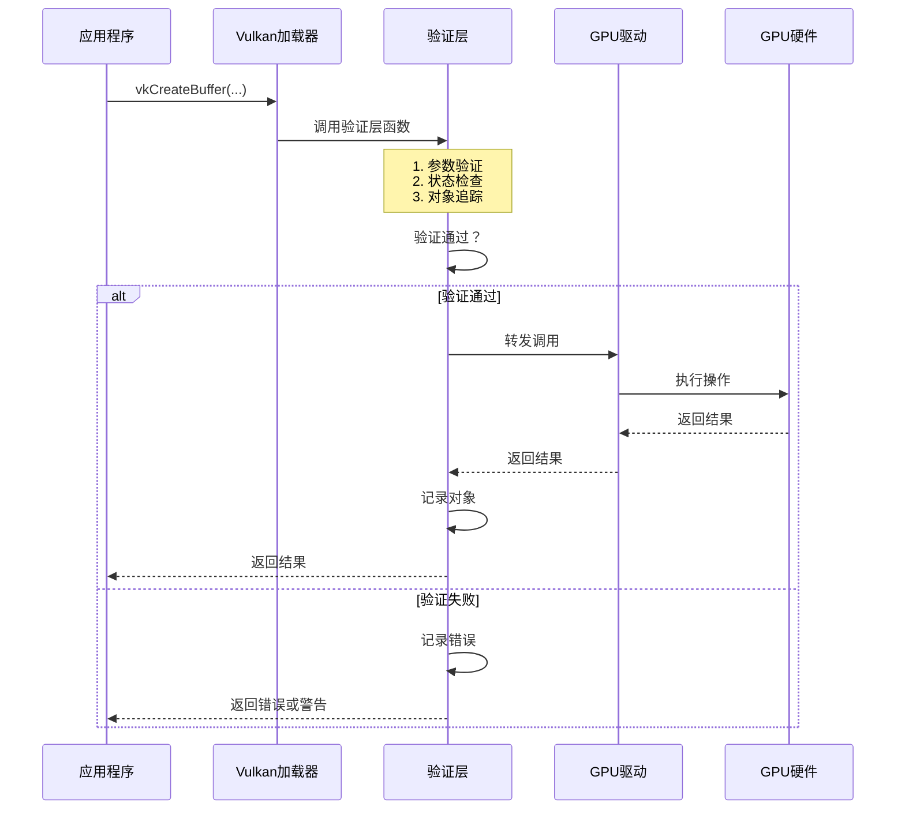

# Vulkan 验证层详细分析

## 目录
1. [验证层概述](#验证层概述)
2. [验证层的工作原理](#验证层的工作原理)
3. [验证层的来源与安装](#验证层的来源与安装)
4. [验证层的启用与配置](#验证层的启用与配置)
5. [开发者使用指南](#开发者使用指南)
6. [验证层的功能详解](#验证层的功能详解)
7. [验证层消息处理](#验证层消息处理)
8. [验证层设置与调优](#验证层设置与调优)
9. [验证层的性能影响](#验证层的性能影响)
10. [常见验证错误与解决方案](#常见验证错误与解决方案)
11. [最佳实践](#最佳实践)

---

## 验证层概述

### 什么是验证层？

**验证层（Validation Layers）**是 Vulkan 中用于调试和验证 API 使用的中间件。它插入在应用程序和 Vulkan 驱动之间，拦截、检查和验证所有的 Vulkan API 调用，帮助开发者发现错误、资源泄漏和性能问题。

### 验证层的本质


### 验证层的核心特点

1. **中间件性质**：插入在应用和驱动之间，不直接执行 GPU 操作
2. **可选启用**：开发时启用，发布时禁用
3. **详细检查**：检查参数、状态、生命周期、同步等
4. **性能开销**：有显著的性能影响（50-200%），仅用于开发
5. **官方支持**：由 Khronos Group 官方提供和维护

### 验证层与驱动的区别

| 特性 | 验证层 | GPU 驱动 |
|------|--------|----------|
| **提供者** | Khronos Group | GPU 厂商（NVIDIA/AMD/Intel） |
| **作用** | 调试和验证 | 实际执行渲染命令 |
| **位置** | Vulkan SDK | 系统驱动 |
| **可选性** | 可选（开发时启用） | 必需（必须安装） |
| **性能影响** | 较大（50-200%开销） | 最小（优化过的） |
| **功能** | 检查错误 | 执行 GPU 操作 |

---

## 验证层的工作原理

### 函数拦截机制

验证层通过函数指针拦截实现：



### 验证层的调用链

```cpp
// 伪代码：验证层如何拦截函数调用

// 1. 应用程序调用
vkCreateBuffer(device, &createInfo, nullptr, &buffer);

// 2. 实际上调用的是验证层的包装函数
VkResult ValidationLayer_vkCreateBuffer(
    VkDevice device,
    const VkBufferCreateInfo* pCreateInfo,
    const VkAllocationCallbacks* pAllocator,
    VkBuffer* pBuffer
) {
    // ========== 验证层的检查 ==========
    
    // 检查1：参数有效性
    if (pCreateInfo == nullptr) {
        logError("vkCreateBuffer: pCreateInfo is NULL");
        return VK_ERROR_VALIDATION_FAILED_EXT;
    }
    
    if (pCreateInfo->size == 0) {
        logError("vkCreateInfo: size cannot be 0");
        return VK_ERROR_VALIDATION_FAILED_EXT;
    }
    
    if ((pCreateInfo->usage & VK_BUFFER_USAGE_FLAG_BITS_MAX_ENUM) != 0) {
        logError("vkCreateBuffer: invalid usage flags");
        return VK_ERROR_VALIDATION_FAILED_EXT;
    }
    
    // 检查2：设备有效性
    if (!isValidDevice(device)) {
        logError("vkCreateBuffer: device is invalid or destroyed");
        return VK_ERROR_VALIDATION_FAILED_EXT;
    }
    
    // 检查3：对象状态
    if (device->isLost()) {
        logError("vkCreateBuffer: device is lost");
        return VK_ERROR_DEVICE_LOST;
    }
    
    // ========== 调用真正的驱动函数 ==========
    PFN_vkCreateBuffer real_vkCreateBuffer = getNextFunction("vkCreateBuffer");
    VkResult result = real_vkCreateBuffer(device, pCreateInfo, pAllocator, pBuffer);
    
    // ========== 后处理 ==========
    if (result == VK_SUCCESS) {
        // 记录对象创建
        trackObject(*pBuffer, VK_OBJECT_TYPE_BUFFER, device);
        logInfo("vkCreateBuffer: buffer created successfully");
    } else {
        logError("vkCreateBuffer: failed with result %d", result);
    }
    
    return result;
}
```

### 验证层的加载顺序


---

## 验证层的来源与安装

### 验证层的提供者

**VK_LAYER_KHRONOS_validation** 是 Khronos Group（Vulkan 标准制定组织）官方提供的统一验证层。

- **来源**：Khronos Group 官方
- **维护**：Khronos 和开源社区
- **位置**：Vulkan SDK 中
- **功能**：整合了所有验证功能

### 验证层的安装位置

#### Windows

```
C:\VulkanSDK\<version>\
├── Bin\
│   └── VkLayer_khronos_validation.dll  # 验证层库文件
└── Config\
    └── vulkan_layer_settings.txt        # 验证层配置文件
```

#### Linux

```
/usr/share/vulkan/
├── explicit_layer.d/
│   └── VkLayer_khronos_validation.json  # 层清单文件
└── implicit_layer.d/
    └── VkLayer_khronos_validation.json
```

#### 验证层清单文件

```json
{
    "file_format_version": "1.2.0",
    "layer": {
        "name": "VK_LAYER_KHRONOS_validation",
        "type": "GLOBAL",
        "library_path": ".\\VkLayer_khronos_validation.dll",
        "api_version": "1.3.0",
        "implementation_version": "1",
        "description": "Khronos Validation Layer",
        "functions": {
            "vkGetInstanceProcAddr": "ValidationLayer_vkGetInstanceProcAddr",
            "vkGetDeviceProcAddr": "ValidationLayer_vkGetDeviceProcAddr"
        },
        "enable_environment": {
            "VK_LAYER_KHRONOS_validation": "1"
        },
        "disable_environment": {
            "VK_LAYER_KHRONOS_validation": "0"
        }
    }
}
```

### 历史验证层（已整合）

现代 Vulkan 使用统一的 `VK_LAYER_KHRONOS_validation`，它整合了以下历史验证层：

| 历史层名称 | 功能 | 状态 |
|-----------|------|------|
| `VK_LAYER_LUNARG_core_validation` | 核心验证 | 已整合 |
| `VK_LAYER_LUNARG_parameter_validation` | 参数验证 | 已整合 |
| `VK_LAYER_LUNARG_object_tracker` | 对象追踪 | 已整合 |
| `VK_LAYER_GOOGLE_threading` | 线程检查 | 已整合 |
| `VK_LAYER_GOOGLE_unique_handles` | 句柄唯一性 | 已整合 |

---

## 验证层的启用与配置

### 检查验证层是否可用

```cpp
bool isValidationLayerAvailable() {
    uint32_t layerCount;
    vkEnumerateInstanceLayerProperties(&layerCount, nullptr);
    
    std::vector<VkLayerProperties> availableLayers(layerCount);
    vkEnumerateInstanceLayerProperties(&layerCount, availableLayers.data());
    
    const char* validationLayerName = "VK_LAYER_KHRONOS_validation";
    for (const auto& layer : availableLayers) {
        if (strcmp(layer.layerName, validationLayerName) == 0) {
            return true;
        }
    }
    return false;
}
```

### 启用验证层

#### 方法1：代码中启用

```cpp
VkInstanceCreateInfo createInfo{};
createInfo.sType = VK_STRUCTURE_TYPE_INSTANCE_CREATE_INFO;

// 启用验证层
const char* validationLayerName = "VK_LAYER_KHRONOS_validation";
if (isValidationLayerAvailable()) {
    createInfo.enabledLayerCount = 1;
    createInfo.ppEnabledLayerNames = &validationLayerName;
} else {
    std::cerr << "Validation layer not available!" << std::endl;
    createInfo.enabledLayerCount = 0;
}

vkCreateInstance(&createInfo, nullptr, &instance);
```

#### 方法2：环境变量启用

**Windows:**
```batch
set VK_LAYER_KHRONOS_validation=1
```

**Linux:**
```bash
export VK_LAYER_KHRONOS_validation=1
```

#### 方法3：配置文件启用

**Windows:** `%APPDATA%\Vulkan\config\vk_layer_settings.txt`

**Linux:** `~/.config/vulkan/settings.d/vk_layer_settings.txt`

```ini
# 启用验证层
khronos_validation.enable = true
```

### 代码库中的实现

在 `base/vulkanexamplebase.cpp` 中的实现：

```cpp
// 第 157-178 行
const char* validationLayerName = "VK_LAYER_KHRONOS_validation";
if (settings.validation) {
    // 检查层是否可用
    uint32_t instanceLayerCount;
    vkEnumerateInstanceLayerProperties(&instanceLayerCount, nullptr);
    std::vector<VkLayerProperties> instanceLayerProperties(instanceLayerCount);
    vkEnumerateInstanceLayerProperties(&instanceLayerCount, instanceLayerProperties.data());
    
    bool validationLayerPresent = false;
    for (VkLayerProperties& layer : instanceLayerProperties) {
        if (strcmp(layer.layerName, validationLayerName) == 0) {
            validationLayerPresent = true;
            break;
        }
    }
    
    if (validationLayerPresent) {
        instanceCreateInfo.ppEnabledLayerNames = &validationLayerName;
        instanceCreateInfo.enabledLayerCount = 1;
    } else {
        std::cerr << "Validation layer VK_LAYER_KHRONOS_validation not present, validation is disabled";
    }
}
```

### 命令行参数启用

```cpp
// 在 vulkanexamplebase.cpp 中
commandLineParser.add("validation", { "-v", "--validation" }, 0, "Enable validation layers");

if (commandLineParser.isSet("validation")) {
    settings.validation = true;
}

// 使用：
// ./app --validation
// 或
// ./app -v
```

---

## 开发者使用指南

### 快速开始：启用验证层

#### 步骤1：检查验证层是否可用

```cpp
#include <vulkan/vulkan.h>
#include <vector>
#include <iostream>

bool checkValidationLayerSupport() {
    uint32_t layerCount;
    vkEnumerateInstanceLayerProperties(&layerCount, nullptr);
    
    std::vector<VkLayerProperties> availableLayers(layerCount);
    vkEnumerateInstanceLayerProperties(&layerCount, availableLayers.data());
    
    const char* layerName = "VK_LAYER_KHRONOS_validation";
    for (const auto& layer : availableLayers) {
        if (strcmp(layer.layerName, layerName) == 0) {
            std::cout << "Validation layer found!" << std::endl;
            return true;
        }
    }
    
    std::cerr << "Validation layer not found!" << std::endl;
    return false;
}
```

#### 步骤2：在代码中启用验证层

```cpp
VkInstanceCreateInfo createInfo{};
createInfo.sType = VK_STRUCTURE_TYPE_INSTANCE_CREATE_INFO;

// 启用验证层
const char* validationLayers[] = { "VK_LAYER_KHRONOS_validation" };
if (checkValidationLayerSupport()) {
    createInfo.enabledLayerCount = 1;
    createInfo.ppEnabledLayerNames = validationLayers;
} else {
    createInfo.enabledLayerCount = 0;
    std::cerr << "Warning: Validation layer not available, continuing without validation" << std::endl;
}

VkInstance instance;
VkResult result = vkCreateInstance(&createInfo, nullptr, &instance);
```

#### 步骤3：设置调试回调（接收验证消息）

```cpp
VKAPI_ATTR VkBool32 VKAPI_CALL debugCallback(
    VkDebugUtilsMessageSeverityFlagBitsEXT messageSeverity,
    VkDebugUtilsMessageTypeFlagsEXT messageType,
    const VkDebugUtilsMessengerCallbackDataEXT* pCallbackData,
    void* pUserData
) {
    // 输出验证消息
    if (messageSeverity >= VK_DEBUG_UTILS_MESSAGE_SEVERITY_WARNING_BIT_EXT) {
        std::cerr << "Validation: " << pCallbackData->pMessage << std::endl;
    }
    
    return VK_FALSE;
}

// 设置调试回调
VkDebugUtilsMessengerCreateInfoEXT debugCreateInfo{};
debugCreateInfo.sType = VK_STRUCTURE_TYPE_DEBUG_UTILS_MESSENGER_CREATE_INFO_EXT;
debugCreateInfo.messageSeverity = 
    VK_DEBUG_UTILS_MESSAGE_SEVERITY_WARNING_BIT_EXT |
    VK_DEBUG_UTILS_MESSAGE_SEVERITY_ERROR_BIT_EXT;
debugCreateInfo.messageType = 
    VK_DEBUG_UTILS_MESSAGE_TYPE_GENERAL_BIT_EXT |
    VK_DEBUG_UTILS_MESSAGE_TYPE_VALIDATION_BIT_EXT |
    VK_DEBUG_UTILS_MESSAGE_TYPE_PERFORMANCE_BIT_EXT;
debugCreateInfo.pfnUserCallback = debugCallback;

VkInstanceCreateInfo createInfo{};
createInfo.pNext = &debugCreateInfo;  // 链接调试回调
```

### 使用代码库中的实现

在 `base/vulkanexamplebase.cpp` 中已经实现了验证层的启用：

#### 方法1：通过命令行参数启用

```bash
# 运行示例时启用验证层
./triangle --validation
# 或
./triangle -v
```

#### 方法2：在代码中设置

```cpp
// 在 vulkanexamplebase.cpp 中
settings.validation = true;  // 启用验证层
```

#### 方法3：编译时强制启用

```cpp
// 在代码中定义
#define FORCE_VALIDATION

// 或在 CMakeLists.txt 中
add_definitions(-DFORCE_VALIDATION)
```

### 日常开发工作流程

#### 典型的开发流程


#### 实际使用示例

**场景1：开发新功能**

```cpp
// 1. 编写代码
void createVertexBuffer() {
    VkBufferCreateInfo createInfo{};
    createInfo.sType = VK_STRUCTURE_TYPE_BUFFER_CREATE_INFO;
    createInfo.size = 0;  // ❌ 忘记设置大小
    createInfo.usage = VK_BUFFER_USAGE_VERTEX_BUFFER_BIT;
    
    vkCreateBuffer(device, &createInfo, nullptr, &buffer);
}

// 2. 运行程序（启用验证层）
// 验证层输出：
// ERROR: vkCreateBuffer: required parameter createInfo.size has an invalid value (0)

// 3. 查看错误，修复代码
createInfo.size = sizeof(vertices);  // ✅ 修复

// 4. 重新运行，验证层不再报错
```

**场景2：调试资源泄漏**

```cpp
// 1. 运行程序一段时间后退出
// 2. 验证层在程序退出时输出：
// WARNING: Object 0x12345678 of type VkBuffer was not destroyed
// WARNING: Object 0x87654321 of type VkImage was not destroyed

// 3. 查找未销毁的对象，添加清理代码
void cleanup() {
    vkDestroyBuffer(device, buffer, nullptr);  // ✅ 添加
    vkDestroyImage(device, image, nullptr);    // ✅ 添加
}
```

**场景3：检查同步错误**

```cpp
// 1. 代码中有同步问题
VkFence fence;
vkQueueSubmit(queue, 1, &submitInfo, fence);
vkWaitForFences(device, 1, &fence, VK_TRUE, UINT64_MAX);
vkQueueSubmit(queue, 1, &submitInfo, fence);  // ❌ 没有重置栅栏

// 2. 验证层输出：
// ERROR: vkQueueSubmit: fence 0x12345678 must be reset before use

// 3. 修复代码
vkResetFences(device, 1, &fence);  // ✅ 添加重置
vkQueueSubmit(queue, 1, &submitInfo, fence);
```

### 如何查看验证消息

#### 方法1：控制台输出（默认）

验证消息会直接输出到控制台（stderr）：

```bash
# Windows
triangle.exe --validation

# Linux
./triangle --validation

# 输出示例：
Validation: ERROR: vkCreateBuffer: required parameter createInfo.size has an invalid value (0)
```

#### 方法2：输出到文件

```cpp
// 设置日志文件
std::ofstream logFile("validation.log");

VKAPI_ATTR VkBool32 VKAPI_CALL debugCallback(...) {
    logFile << pCallbackData->pMessage << std::endl;
    logFile.flush();
    return VK_FALSE;
}
```

#### 方法3：使用命令行参数

```bash
# 代码库中支持将验证消息输出到文件
./triangle --validation --validationlogfile
# 验证消息会保存到 validation_output.txt
```

#### 方法4：在调试器中查看

```cpp
VKAPI_ATTR VkBool32 VKAPI_CALL debugCallback(...) {
    if (messageSeverity >= VK_DEBUG_UTILS_MESSAGE_SEVERITY_ERROR_BIT_EXT) {
        // 在错误时中断，方便调试
        #ifdef _WIN32
            __debugbreak();
        #elif defined(__linux__)
            __builtin_trap();
        #endif
    }
    return VK_FALSE;
}
```

### 验证消息的解读

#### 消息格式

```
[消息级别] [消息类型]: [函数名]: [错误描述]
    Objects: [对象数量]
        [对象索引] [对象句柄], type: [对象类型], name: [对象名称]
    Location: [函数地址] ([函数名])
```

#### 实际消息示例

**错误消息：**
```
ERROR: [Validation] vkCreateBuffer: required parameter createInfo.size has an invalid value (0)
    Objects: 1
        [0] 0x0000012345678900, type: 6, name: NULL
    Location: 0x7ff8a1b2c3d4 (vkCreateBuffer)
```

**解读**：
- `ERROR`: 错误级别，必须修复
- `[Validation]`: 验证类型消息
- `vkCreateBuffer`: 出错的函数
- `createInfo.size has an invalid value (0)`: 具体错误原因
- `Objects: 1`: 涉及1个对象
- `0x0000012345678900`: 对象句柄（虽然创建失败，但验证层仍会记录）
- `type: 6`: 对象类型（6 = VK_OBJECT_TYPE_BUFFER）

**警告消息：**
```
WARNING: [Performance] vkQueueSubmit: Queue submission with command buffer that has been recorded multiple times
    Objects: 1
        [0] 0x0000087654321000, type: 3, name: NULL
    Location: 0x7ff8a1b2c5e6 (vkQueueSubmit)
```

**解读**：
- `WARNING`: 警告级别，建议修复
- `[Performance]`: 性能相关消息
- 可能影响性能，但不影响功能

### 开发时的最佳实践

#### 1. 始终在开发时启用验证层

```cpp
// 使用条件编译
#ifdef DEBUG
    const char* validationLayers[] = { "VK_LAYER_KHRONOS_validation" };
    createInfo.enabledLayerCount = 1;
    createInfo.ppEnabledLayerNames = validationLayers;
#else
    createInfo.enabledLayerCount = 0;  // 发布版本禁用
#endif
```

#### 2. 修复所有错误，不要忽略

```cpp
// ❌ 错误做法：忽略验证层错误
// "程序能运行就行，验证层的错误不用管"

// ✅ 正确做法：修复所有错误
// 验证层的每个错误都可能导致：
// - 未定义行为
// - 崩溃
// - 性能问题
// - 跨平台兼容性问题
```

#### 3. 关注警告信息

```cpp
// 警告虽然不会导致程序崩溃，但可能表示：
// - 性能问题
// - 不推荐的用法
// - 潜在的bug
// 应该尽量修复警告
```

#### 4. 使用合适的消息过滤

```cpp
// 开发初期：显示所有消息
debugCreateInfo.messageSeverity = 
    VK_DEBUG_UTILS_MESSAGE_SEVERITY_VERBOSE_BIT_EXT |
    VK_DEBUG_UTILS_MESSAGE_SEVERITY_INFO_BIT_EXT |
    VK_DEBUG_UTILS_MESSAGE_SEVERITY_WARNING_BIT_EXT |
    VK_DEBUG_UTILS_MESSAGE_SEVERITY_ERROR_BIT_EXT;

// 开发后期：只显示警告和错误（减少信息过载）
debugCreateInfo.messageSeverity = 
    VK_DEBUG_UTILS_MESSAGE_SEVERITY_WARNING_BIT_EXT |
    VK_DEBUG_UTILS_MESSAGE_SEVERITY_ERROR_BIT_EXT;
```

### 实际开发场景

#### 场景1：创建新对象时

```cpp
// 开发流程：
// 1. 编写创建代码
VkBufferCreateInfo createInfo{};
// ... 设置参数

// 2. 调用创建函数
vkCreateBuffer(device, &createInfo, nullptr, &buffer);

// 3. 如果验证层报错，立即修复
// 常见错误：
// - 参数未设置
// - 参数值无效
// - 对象依赖错误

// 4. 验证层通过后，继续开发
```

#### 场景2：使用对象时

```cpp
// 开发流程：
// 1. 使用对象
vkBindBufferMemory(device, buffer, memory, 0);

// 2. 验证层检查：
// - 对象是否有效
// - 对象是否已销毁
// - 对象状态是否正确
// - 参数是否正确

// 3. 如果有错误，修复后继续
```

#### 场景3：清理资源时

```cpp
// 开发流程：
// 1. 编写清理代码
void cleanup() {
    vkDestroyBuffer(device, buffer, nullptr);
    vkDestroyImage(device, image, nullptr);
    // ...
}

// 2. 程序退出时，验证层检查：
// - 所有对象是否都已销毁
// - 是否有资源泄漏

// 3. 如果有泄漏警告，添加清理代码
```

### 调试技巧

#### 技巧1：错误时中断

```cpp
VKAPI_ATTR VkBool32 VKAPI_CALL debugCallback(...) {
    if (messageSeverity >= VK_DEBUG_UTILS_MESSAGE_SEVERITY_ERROR_BIT_EXT) {
        // 在 Visual Studio 中，这会触发断点
        #ifdef _WIN32
            __debugbreak();
        #endif
        
        // 输出调用栈信息
        std::cerr << "Error occurred! Check call stack." << std::endl;
    }
    return VK_FALSE;
}
```

#### 技巧2：过滤特定消息

```cpp
VKAPI_ATTR VkBool32 VKAPI_CALL debugCallback(...) {
    // 忽略某些已知的警告
    std::string message = pCallbackData->pMessage;
    if (message.find("known warning") != std::string::npos) {
        return VK_FALSE;  // 忽略
    }
    
    // 只关注特定错误
    if (message.find("vkCreateBuffer") != std::string::npos) {
        std::cerr << "Buffer creation error: " << message << std::endl;
    }
    
    return VK_FALSE;
}
```

#### 技巧3：统计错误数量

```cpp
struct ValidationStats {
    int errorCount = 0;
    int warningCount = 0;
} stats;

VKAPI_ATTR VkBool32 VKAPI_CALL debugCallback(...) {
    if (messageSeverity >= VK_DEBUG_UTILS_MESSAGE_SEVERITY_ERROR_BIT_EXT) {
        stats.errorCount++;
    } else if (messageSeverity >= VK_DEBUG_UTILS_MESSAGE_SEVERITY_WARNING_BIT_EXT) {
        stats.warningCount++;
    }
    
    // 程序退出时输出统计
    return VK_FALSE;
}
```

### 与 IDE 集成

#### Visual Studio

```cpp
// 在调试配置中启用验证层
// 1. 项目属性 -> 调试 -> 命令参数
//    添加：--validation

// 2. 或使用环境变量
//    项目属性 -> 调试 -> 环境
//    添加：VK_LAYER_KHRONOS_validation=1

// 3. 验证消息会显示在"输出"窗口
```

#### Visual Studio Code

```json
// .vscode/launch.json
{
    "configurations": [
        {
            "name": "Debug with Validation",
            "type": "cppdbg",
            "request": "launch",
            "program": "${workspaceFolder}/build/triangle",
            "args": ["--validation"],
            "environment": [
                {
                    "name": "VK_LAYER_KHRONOS_validation",
                    "value": "1"
                }
            ]
        }
    ]
}
```

### 常见使用模式

#### 模式1：最小化启用（推荐）

```cpp
// 只启用验证层，使用默认设置
const char* validationLayers[] = { "VK_LAYER_KHRONOS_validation" };
createInfo.enabledLayerCount = 1;
createInfo.ppEnabledLayerNames = validationLayers;

// 简单的调试回调
VKAPI_ATTR VkBool32 VKAPI_CALL debugCallback(...) {
    if (messageSeverity >= VK_DEBUG_UTILS_MESSAGE_SEVERITY_WARNING_BIT_EXT) {
        std::cerr << pCallbackData->pMessage << std::endl;
    }
    return VK_FALSE;
}
```

#### 模式2：完整配置

```cpp
// 启用验证层 + 配置验证功能
VkValidationFeaturesEXT validationFeatures{};
validationFeatures.enabledValidationFeatureCount = 1;
VkValidationFeatureEnableEXT features[] = {
    VK_VALIDATION_FEATURE_ENABLE_GPU_ASSISTED_EXT
};
validationFeatures.pEnabledValidationFeatures = features;

VkInstanceCreateInfo createInfo{};
createInfo.pNext = &validationFeatures;
```

#### 模式3：条件启用

```cpp
// 根据编译配置启用
bool enableValidation = false;

#ifdef DEBUG
    enableValidation = true;
#endif

// 或通过命令行参数
if (argc > 1 && strcmp(argv[1], "--validation") == 0) {
    enableValidation = true;
}

if (enableValidation && checkValidationLayerSupport()) {
    createInfo.enabledLayerCount = 1;
    createInfo.ppEnabledLayerNames = validationLayers;
}
```

### 开发检查清单

在开发 Vulkan 应用时，使用验证层检查以下内容：

- [ ] **对象创建**：所有创建的对象都成功创建
- [ ] **参数设置**：所有必需参数都已正确设置
- [ ] **对象使用**：使用对象前确保对象有效
- [ ] **资源清理**：所有对象都已正确销毁
- [ ] **同步正确**：信号量、栅栏使用正确
- [ ] **内存管理**：内存正确绑定和映射
- [ ] **状态管理**：命令缓冲区状态正确
- [ ] **线程安全**：多线程使用正确

### 验证层使用示例（完整代码）

```cpp
#include <vulkan/vulkan.h>
#include <iostream>
#include <vector>

// 调试回调函数
VKAPI_ATTR VkBool32 VKAPI_CALL debugCallback(
    VkDebugUtilsMessageSeverityFlagBitsEXT messageSeverity,
    VkDebugUtilsMessageTypeFlagsEXT messageType,
    const VkDebugUtilsMessengerCallbackDataEXT* pCallbackData,
    void* pUserData
) {
    // 只显示警告和错误
    if (messageSeverity >= VK_DEBUG_UTILS_MESSAGE_SEVERITY_WARNING_BIT_EXT) {
        std::cerr << "Validation: " << pCallbackData->pMessage << std::endl;
    }
    return VK_FALSE;
}

// 检查验证层支持
bool checkValidationLayerSupport() {
    uint32_t layerCount;
    vkEnumerateInstanceLayerProperties(&layerCount, nullptr);
    
    std::vector<VkLayerProperties> availableLayers(layerCount);
    vkEnumerateInstanceLayerProperties(&layerCount, availableLayers.data());
    
    const char* layerName = "VK_LAYER_KHRONOS_validation";
    for (const auto& layer : availableLayers) {
        if (strcmp(layer.layerName, layerName) == 0) {
            return true;
        }
    }
    return false;
}

int main() {
    // 设置调试回调
    VkDebugUtilsMessengerCreateInfoEXT debugCreateInfo{};
    debugCreateInfo.sType = VK_STRUCTURE_TYPE_DEBUG_UTILS_MESSENGER_CREATE_INFO_EXT;
    debugCreateInfo.messageSeverity = 
        VK_DEBUG_UTILS_MESSAGE_SEVERITY_WARNING_BIT_EXT |
        VK_DEBUG_UTILS_MESSAGE_SEVERITY_ERROR_BIT_EXT;
    debugCreateInfo.messageType = 
        VK_DEBUG_UTILS_MESSAGE_TYPE_GENERAL_BIT_EXT |
        VK_DEBUG_UTILS_MESSAGE_TYPE_VALIDATION_BIT_EXT |
        VK_DEBUG_UTILS_MESSAGE_TYPE_PERFORMANCE_BIT_EXT;
    debugCreateInfo.pfnUserCallback = debugCallback;
    
    // 创建实例
    VkInstanceCreateInfo createInfo{};
    createInfo.sType = VK_STRUCTURE_TYPE_INSTANCE_CREATE_INFO;
    createInfo.pNext = &debugCreateInfo;
    
    // 启用验证层
    const char* validationLayers[] = { "VK_LAYER_KHRONOS_validation" };
    if (checkValidationLayerSupport()) {
        createInfo.enabledLayerCount = 1;
        createInfo.ppEnabledLayerNames = validationLayers;
        std::cout << "Validation layer enabled" << std::endl;
    } else {
        createInfo.enabledLayerCount = 0;
        std::cerr << "Warning: Validation layer not available" << std::endl;
    }
    
    VkInstance instance;
    VkResult result = vkCreateInstance(&createInfo, nullptr, &instance);
    
    if (result != VK_SUCCESS) {
        std::cerr << "Failed to create instance!" << std::endl;
        return -1;
    }
    
    // 你的 Vulkan 代码...
    
    // 清理
    vkDestroyInstance(instance, nullptr);
    return 0;
}
```

---

## 验证层的功能详解

### 1. 参数验证

验证层检查所有函数参数的有效性：

```cpp
// 示例1：无效的结构体类型
VkBufferCreateInfo createInfo{};
createInfo.sType = VK_STRUCTURE_TYPE_IMAGE_CREATE_INFO;  // ❌ 错误！
// 验证层输出：
// ERROR: vkCreateBuffer: required parameter createInfo.sType has an invalid value

// 示例2：无效的参数值
createInfo.size = 0;  // ❌ 错误！
// 验证层输出：
// ERROR: vkCreateBuffer: required parameter createInfo.size has an invalid value (0)

// 示例3：未设置的必需标志
createInfo.usage = 0;  // ❌ 错误！
// 验证层输出：
// ERROR: vkCreateBuffer: required parameter createInfo.usage has an invalid value (0)
```

**检查项**：
- 结构体的 `sType` 是否正确
- 必需参数是否提供
- 参数值是否在有效范围内
- 枚举值是否合法
- 指针是否为 NULL（如果必需）

### 2. 对象生命周期检查

验证层追踪所有对象的创建和销毁：

```cpp
// 场景1：使用已销毁的对象
VkBuffer buffer;
vkCreateBuffer(device, &createInfo, nullptr, &buffer);
vkDestroyBuffer(device, buffer, nullptr);
vkBindBufferMemory(device, buffer, memory, 0);  // ❌ 错误！
// 验证层输出：
// ERROR: vkBindBufferMemory: object 0x12345678 has been destroyed

// 场景2：对象创建顺序错误
VkDevice device;
vkCreateDevice(physicalDevice, &deviceInfo, nullptr, &device);
// 但 physicalDevice 还没有从 instance 枚举获取
// ❌ 验证层会检查对象之间的依赖关系

// 场景3：资源泄漏检测
// 程序退出时，验证层会报告所有未销毁的对象
// WARNING: Object 0x12345678 of type VkBuffer was not destroyed
```

**检查项**：
- 使用已销毁的对象
- 对象创建顺序是否正确
- 资源是否泄漏（未销毁的对象）
- 对象之间的依赖关系
- 对象的所有权

### 3. 状态验证

验证层检查对象使用时的状态：

```cpp
// 场景1：命令缓冲区状态错误
VkCommandBuffer cmdBuf;
vkBeginCommandBuffer(cmdBuf, &beginInfo);
vkEndCommandBuffer(cmdBuf);
vkCmdDraw(cmdBuf, 3, 1, 0, 0);  // ❌ 错误！
// 验证层输出：
// ERROR: vkCmdDraw: command buffer 0x12345678 is not in recording state

// 场景2：渲染通道状态
vkCmdBeginRenderPass(cmdBuf, &renderPassBegin, VK_SUBPASS_CONTENTS_INLINE);
vkCmdEndRenderPass(cmdBuf);
// 在渲染通道外使用某些命令可能被警告

// 场景3：管线绑定错误
vkCmdDraw(cmdBuf, ...);  // ❌ 错误！没有绑定管线
// 验证层输出：
// ERROR: vkCmdDraw: no pipeline bound
```

**检查项**：
- 命令缓冲区的记录状态
- 渲染通道的开始/结束状态
- 对象是否已正确初始化
- 状态转换是否合法
- 命令的上下文是否正确

### 4. 内存管理检查

验证层检测内存相关错误：

```cpp
// 场景1：内存绑定错误
VkBuffer buffer;
VkDeviceMemory memory;
vkCreateBuffer(device, &createInfo, nullptr, &buffer);
vkAllocateMemory(device, &allocInfo, nullptr, &memory);
vkCmdDraw(...);  // ❌ 错误！缓冲区还没有绑定内存
// 验证层输出：
// ERROR: vkCmdDraw: buffer 0x12345678 is not bound to memory

// 场景2：内存映射错误
VkDeviceMemory memory;
vkAllocateMemory(device, &allocInfo, nullptr, &memory);
void* data = vkMapMemory(device, memory, 0, size, 0);
// 使用 data...
vkUnmapMemory(device, memory);
// 继续使用 data...  // ⚠️ 验证层可能警告

// 场景3：内存对齐
VkMemoryRequirements memReqs;
vkGetBufferMemoryRequirements(device, buffer, &memReqs);
VkDeviceSize offset = 1;  // ❌ 错误！offset 必须对齐
vkBindBufferMemory(device, buffer, memory, offset);
// 验证层输出：
// ERROR: vkBindBufferMemory: offset (1) is not aligned to memoryRequirements.alignment
```

**检查项**：
- 内存是否已绑定到资源
- 内存映射/取消映射是否正确
- 内存对齐要求
- 内存类型是否匹配
- 内存使用范围

### 5. 同步检查

验证层检测同步原语使用错误：

```cpp
// 场景1：信号量使用错误
VkSemaphore semaphore;
vkCreateSemaphore(device, &createInfo, nullptr, &semaphore);
VkSubmitInfo submitInfo{};
submitInfo.waitSemaphoreCount = 1;
submitInfo.pWaitSemaphores = &semaphore;
// 但没有设置对应的 waitStageMask
// ⚠️ 验证层会警告

// 场景2：栅栏重置
VkFence fence;
vkCreateFence(device, &createInfo, nullptr, &fence);
vkQueueSubmit(queue, 1, &submitInfo, fence);
vkWaitForFences(device, 1, &fence, VK_TRUE, UINT64_MAX);
vkQueueSubmit(queue, 1, &submitInfo, fence);  // ❌ 错误！
// 验证层输出：
// ERROR: vkQueueSubmit: fence 0x12345678 must be reset before use

// 场景3：内存屏障使用
vkCmdPipelineBarrier(cmdBuf, ...);
// 但源阶段和目标阶段设置错误
// ❌ 验证层会检查屏障的合理性
```

**检查项**：
- 信号量的等待/发出是否正确配对
- 栅栏是否在使用前重置
- 内存屏障的设置是否合理
- 同步原语的生命周期
- 队列操作的同步

### 6. 线程安全检查

验证层检测多线程使用问题：

```cpp
// 场景1：命令缓冲区并发记录
VkCommandBuffer cmdBuf;
// 线程1
vkBeginCommandBuffer(cmdBuf, &beginInfo);
vkCmdDraw(cmdBuf, ...);
// 线程2（同时）
vkCmdDraw(cmdBuf, ...);  // ❌ 错误！
// 验证层输出：
// ERROR: vkCmdDraw: command buffer 0x12345678 is being recorded by another thread

// 场景2：描述符集并发更新
VkDescriptorSet descriptorSet;
// 线程1
vkUpdateDescriptorSets(device, 1, &write, 0, nullptr);
// 线程2（同时）
vkUpdateDescriptorSets(device, 1, &write, 0, nullptr);  // ⚠️ 可能警告
```

**检查项**：
- 命令缓冲区的并发访问
- 描述符集的并发更新
- 对象的线程安全性
- 多线程命令记录的正确性

### 7. 性能警告

验证层提示可能的性能问题：

```cpp
// 场景1：频繁重建交换链
void renderLoop() {
    while (running) {
        recreateSwapchain();  // ⚠️ 警告！
        renderFrame();
    }
}
// 验证层输出：
// WARNING: vkCreateSwapchainKHR: swapchain recreated too frequently, may impact performance

// 场景2：不必要的状态切换
vkCmdBindPipeline(cmdBuf, VK_PIPELINE_BIND_POINT_GRAPHICS, pipeline1);
vkCmdDraw(cmdBuf, ...);
vkCmdBindPipeline(cmdBuf, VK_PIPELINE_BIND_POINT_GRAPHICS, pipeline1);  // 重复绑定
// ⚠️ 验证层可能提示：重复绑定相同的管线

// 场景3：低效的内存使用
VkBufferCreateInfo createInfo{};
createInfo.usage = VK_BUFFER_USAGE_VERTEX_BUFFER_BIT;
// 但频繁更新数据，应该使用 VK_BUFFER_USAGE_DYNAMIC_STORAGE_BIT
// ⚠️ 验证层可能建议更合适的使用标志
```

**检查项**：
- 频繁的资源创建/销毁
- 不必要的状态切换
- 低效的内存使用模式
- 可能的性能瓶颈
- 资源使用建议

### 8. 图像布局检查

验证层检测图像布局转换错误：

```cpp
// 场景1：布局转换错误
VkImage image;
vkCreateImage(device, &createInfo, nullptr, &image);
// 直接用作附件，但没有转换布局
vkCmdBeginRenderPass(cmdBuf, &renderPassBegin, ...);
// ❌ 验证层输出：
// ERROR: vkCmdBeginRenderPass: image 0x12345678 has incorrect layout

// 场景2：布局转换缺失
VkImageMemoryBarrier barrier{};
barrier.oldLayout = VK_IMAGE_LAYOUT_UNDEFINED;
barrier.newLayout = VK_IMAGE_LAYOUT_TRANSFER_DST_OPTIMAL;
// 但缺少必要的内存屏障
// ❌ 验证层会检查布局转换的完整性
```

**检查项**：
- 图像布局是否正确
- 布局转换是否完整
- 布局转换的时机
- 布局与用途的匹配

---

## 验证层消息处理

### 调试回调设置

验证层通过调试回调输出消息：

```cpp
VKAPI_ATTR VkBool32 VKAPI_CALL debugCallback(
    VkDebugUtilsMessageSeverityFlagBitsEXT messageSeverity,
    VkDebugUtilsMessageTypeFlagsEXT messageType,
    const VkDebugUtilsMessengerCallbackDataEXT* pCallbackData,
    void* pUserData
) {
    // 过滤消息级别
    if (messageSeverity >= VK_DEBUG_UTILS_MESSAGE_SEVERITY_WARNING_BIT_EXT) {
        std::cerr << "Validation Layer: " << pCallbackData->pMessage << std::endl;
        
        // 错误时中断（可选）
        if (messageSeverity >= VK_DEBUG_UTILS_MESSAGE_SEVERITY_ERROR_BIT_EXT) {
            // 在调试器中设置断点
            // __debugbreak();
        }
    }
    
    return VK_FALSE;  // 返回 VK_TRUE 会中断调用
}

// 设置调试回调
VkDebugUtilsMessengerCreateInfoEXT debugCreateInfo{};
debugCreateInfo.sType = VK_STRUCTURE_TYPE_DEBUG_UTILS_MESSENGER_CREATE_INFO_EXT;
debugCreateInfo.messageSeverity = 
    VK_DEBUG_UTILS_MESSAGE_SEVERITY_VERBOSE_BIT_EXT |
    VK_DEBUG_UTILS_MESSAGE_SEVERITY_INFO_BIT_EXT |
    VK_DEBUG_UTILS_MESSAGE_SEVERITY_WARNING_BIT_EXT |
    VK_DEBUG_UTILS_MESSAGE_SEVERITY_ERROR_BIT_EXT;
debugCreateInfo.messageType = 
    VK_DEBUG_UTILS_MESSAGE_TYPE_GENERAL_BIT_EXT |
    VK_DEBUG_UTILS_MESSAGE_TYPE_VALIDATION_BIT_EXT |
    VK_DEBUG_UTILS_MESSAGE_TYPE_PERFORMANCE_BIT_EXT;
debugCreateInfo.pfnUserCallback = debugCallback;

VkInstanceCreateInfo createInfo{};
createInfo.pNext = &debugCreateInfo;
```

### 消息级别

| 级别 | 标志 | 说明 | 示例 |
|------|------|------|------|
| **VERBOSE** | `VK_DEBUG_UTILS_MESSAGE_SEVERITY_VERBOSE_BIT_EXT` | 详细调试信息 | 所有 API 调用 |
| **INFO** | `VK_DEBUG_UTILS_MESSAGE_SEVERITY_INFO_BIT_EXT` | 信息性消息 | 对象创建成功 |
| **WARNING** | `VK_DEBUG_UTILS_MESSAGE_SEVERITY_WARNING_BIT_EXT` | 警告消息 | 性能问题、不推荐用法 |
| **ERROR** | `VK_DEBUG_UTILS_MESSAGE_SEVERITY_ERROR_BIT_EXT` | 错误消息 | API 使用错误 |

### 消息类型

| 类型 | 标志 | 说明 |
|------|------|------|
| **GENERAL** | `VK_DEBUG_UTILS_MESSAGE_TYPE_GENERAL_BIT_EXT` | 一般消息 |
| **VALIDATION** | `VK_DEBUG_UTILS_MESSAGE_TYPE_VALIDATION_BIT_EXT` | 验证错误 |
| **PERFORMANCE** | `VK_DEBUG_UTILS_MESSAGE_TYPE_PERFORMANCE_BIT_EXT` | 性能警告 |

### 消息输出示例

```
ERROR: [Validation] vkCreateBuffer: required parameter createInfo.size has an invalid value (0)
    Objects: 1
        [0] 0x12345678, type: 6, name: NULL
    Location: 0x7ff8a1b2c3d4 (vkCreateBuffer)

WARNING: [Performance] vkQueueSubmit: Queue submission with command buffer that has been recorded multiple times
    Objects: 1
        [0] 0x87654321, type: 3, name: NULL
    Location: 0x7ff8a1b2c5e6 (vkQueueSubmit)

INFO: [General] vkCreateDevice: Device created successfully
    Device: 0xabcdef12
    Physical Device: 0xfedcba98
```

### 代码库中的实现

在 `base/VulkanDebug.cpp` 中的实现：

```cpp
VkResult VulkanDebug::setupDebugging(VkInstance instance) {
    VkDebugUtilsMessengerCreateInfoEXT debugUtilsMessengerCI{};
    debugUtilsMessengerCI.sType = VK_STRUCTURE_TYPE_DEBUG_UTILS_MESSENGER_CREATE_INFO_EXT;
    debugUtilsMessengerCI.messageSeverity = 
        VK_DEBUG_UTILS_MESSAGE_SEVERITY_WARNING_BIT_EXT |
        VK_DEBUG_UTILS_MESSAGE_SEVERITY_ERROR_BIT_EXT;
    debugUtilsMessengerCI.messageType = 
        VK_DEBUG_UTILS_MESSAGE_TYPE_GENERAL_BIT_EXT |
        VK_DEBUG_UTILS_MESSAGE_TYPE_VALIDATION_BIT_EXT |
        VK_DEBUG_UTILS_MESSAGE_TYPE_PERFORMANCE_BIT_EXT;
    debugUtilsMessengerCI.pfnUserCallback = debugUtilsMessengerCallback;
    
    return vkCreateDebugUtilsMessengerEXT(instance, &debugUtilsMessengerCI, nullptr, &debugUtilsMessenger);
}
```

---

## 验证层设置与调优

### 层设置 API (VK_EXT_layer_settings)

Vulkan 1.3+ 提供了统一的层设置扩展：

```cpp
// 启用 GPU 辅助验证
VkLayerSettingEXT gpuAssisted{};
gpuAssisted.pLayerName = "VK_LAYER_KHRONOS_validation";
gpuAssisted.pSettingName = "enables";
gpuAssisted.type = VK_LAYER_SETTING_TYPE_STRING_EXT;
gpuAssisted.valueCount = 1;
const char* gpuAssistedValue = "VK_VALIDATION_FEATURE_ENABLE_GPU_ASSISTED_EXT";
gpuAssisted.pValues = &gpuAssistedValue;

VkLayerSettingsCreateInfoEXT layerSettingsInfo{};
layerSettingsInfo.sType = VK_STRUCTURE_TYPE_LAYER_SETTINGS_CREATE_INFO_EXT;
layerSettingsInfo.settingCount = 1;
layerSettingsInfo.pSettings = &gpuAssisted;

VkInstanceCreateInfo createInfo{};
createInfo.pNext = &layerSettingsInfo;
```

### 常用验证层设置

```cpp
// 1. 启用 GPU 辅助验证（在着色器中检查）
VkLayerSettingEXT setting1{};
setting1.pLayerName = "VK_LAYER_KHRONOS_validation";
setting1.pSettingName = "enables";
setting1.type = VK_LAYER_SETTING_TYPE_STRING_EXT;
setting1.valueCount = 1;
const char* value1 = "VK_VALIDATION_FEATURE_ENABLE_GPU_ASSISTED_EXT";
setting1.pValues = &value1;

// 2. 设置调试动作
VkLayerSettingEXT setting2{};
setting2.pLayerName = "VK_LAYER_KHRONOS_validation";
setting2.pSettingName = "debug_action";
setting2.type = VK_LAYER_SETTING_TYPE_STRING_EXT;
setting2.valueCount = 1;
const char* value2 = "VK_DBG_LAYER_ACTION_LOG_MSG";
setting2.pValues = &value2;

// 3. 设置日志文件
VkLayerSettingEXT setting3{};
setting3.pLayerName = "VK_LAYER_KHRONOS_validation";
setting3.pSettingName = "log_filename";
setting3.type = VK_LAYER_SETTING_TYPE_STRING_EXT;
setting3.valueCount = 1;
const char* value3 = "validation.log";
setting3.pValues = &value3;
```

### 配置文件方式

**Windows:** `%APPDATA%\Vulkan\config\vk_layer_settings.txt`

**Linux:** `~/.config/vulkan/settings.d/vk_layer_settings.txt`

```ini
# 验证层设置文件
khronos_validation.enable = true
khronos_validation.debug_action = VK_DBG_LAYER_ACTION_LOG_MSG
khronos_validation.log_filename = validation.log
khronos_validation.report_flags = error | warn | perf
khronos_validation.duplicate_message_limit = 10
```

### 验证功能启用

```cpp
VkValidationFeaturesEXT validationFeatures{};
validationFeatures.sType = VK_STRUCTURE_TYPE_VALIDATION_FEATURES_EXT;
validationFeatures.enabledValidationFeatureCount = 2;
VkValidationFeatureEnableEXT enabledFeatures[] = {
    VK_VALIDATION_FEATURE_ENABLE_GPU_ASSISTED_EXT,
    VK_VALIDATION_FEATURE_ENABLE_GPU_ASSISTED_RESERVE_BINDING_SLOT_EXT
};
validationFeatures.pEnabledValidationFeatures = enabledFeatures;

VkInstanceCreateInfo createInfo{};
createInfo.pNext = &validationFeatures;
```

---

## 验证层的性能影响

### 性能开销分析


### 性能影响因素

1. **参数验证**：每次 API 调用都检查参数（+10-20%）
2. **对象追踪**：维护对象表，检查生命周期（+20-50%）
3. **状态检查**：检查对象状态和上下文（+10-30%）
4. **内存检查**：检查内存绑定和使用（+10-40%）
5. **消息输出**：格式化并输出消息（+5-10%）

### 性能优化建议

1. **开发时启用，发布时禁用**
   ```cpp
   #ifdef DEBUG
       // 启用验证层
       enabledLayers.push_back("VK_LAYER_KHRONOS_validation");
   #else
       // 发布版本：禁用所有层
       createInfo.enabledLayerCount = 0;
   #endif
   ```

2. **只启用必要的验证功能**
   ```cpp
   // 只启用错误检查，禁用性能警告
   debugCreateInfo.messageSeverity = 
       VK_DEBUG_UTILS_MESSAGE_SEVERITY_WARNING_BIT_EXT |
       VK_DEBUG_UTILS_MESSAGE_SEVERITY_ERROR_BIT_EXT;
   ```

3. **使用 GPU 辅助验证减少 CPU 开销**
   ```cpp
   // GPU 辅助验证在 GPU 上执行部分检查
   validationFeatures.pEnabledValidationFeatures = {
       VK_VALIDATION_FEATURE_ENABLE_GPU_ASSISTED_EXT
   };
   ```

---

## 常见验证错误与解决方案

### 错误1：使用已销毁的对象

**错误信息**：
```
ERROR: vkBindBufferMemory: object 0x12345678 has been destroyed
```

**原因**：在对象销毁后继续使用

**解决方案**：
```cpp
// ❌ 错误
vkDestroyBuffer(device, buffer, nullptr);
vkBindBufferMemory(device, buffer, memory, 0);

// ✅ 正确
vkBindBufferMemory(device, buffer, memory, 0);
vkDestroyBuffer(device, buffer, nullptr);
```

### 错误2：命令缓冲区状态错误

**错误信息**：
```
ERROR: vkCmdDraw: command buffer 0x12345678 is not in recording state
```

**原因**：在命令缓冲区结束记录后继续记录命令

**解决方案**：
```cpp
// ❌ 错误
vkEndCommandBuffer(cmdBuf);
vkCmdDraw(cmdBuf, ...);

// ✅ 正确
vkBeginCommandBuffer(cmdBuf, &beginInfo);
vkCmdDraw(cmdBuf, ...);
vkEndCommandBuffer(cmdBuf);
```

### 错误3：内存未绑定

**错误信息**：
```
ERROR: vkCmdDraw: buffer 0x12345678 is not bound to memory
```

**原因**：使用未绑定内存的缓冲区

**解决方案**：
```cpp
// ✅ 正确顺序
vkCreateBuffer(device, &createInfo, nullptr, &buffer);
vkAllocateMemory(device, &allocInfo, nullptr, &memory);
vkBindBufferMemory(device, buffer, memory, 0);
// 现在可以使用缓冲区
```

### 错误4：栅栏未重置

**错误信息**：
```
ERROR: vkQueueSubmit: fence 0x12345678 must be reset before use
```

**原因**：栅栏在使用前没有重置

**解决方案**：
```cpp
// ✅ 正确
vkWaitForFences(device, 1, &fence, VK_TRUE, UINT64_MAX);
vkResetFences(device, 1, &fence);  // 重置栅栏
vkQueueSubmit(queue, 1, &submitInfo, fence);
```

### 错误5：图像布局错误

**错误信息**：
```
ERROR: vkCmdBeginRenderPass: image 0x12345678 has incorrect layout
```

**原因**：图像布局不正确

**解决方案**：
```cpp
// ✅ 正确：转换布局
VkImageMemoryBarrier barrier{};
barrier.oldLayout = VK_IMAGE_LAYOUT_UNDEFINED;
barrier.newLayout = VK_IMAGE_LAYOUT_COLOR_ATTACHMENT_OPTIMAL;
vkCmdPipelineBarrier(cmdBuf, ..., &barrier, ...);
vkCmdBeginRenderPass(cmdBuf, ...);
```

---

## 最佳实践

### 1. 开发/发布版本分离

```cpp
#ifdef DEBUG
    // 开发版本：启用验证层
    const char* validationLayer = "VK_LAYER_KHRONOS_validation";
    createInfo.enabledLayerCount = 1;
    createInfo.ppEnabledLayerNames = &validationLayer;
#else
    // 发布版本：禁用所有层
    createInfo.enabledLayerCount = 0;
    createInfo.ppEnabledLayerNames = nullptr;
#endif
```

### 2. 消息过滤

```cpp
// 只显示警告和错误（减少信息过载）
debugCreateInfo.messageSeverity = 
    VK_DEBUG_UTILS_MESSAGE_SEVERITY_WARNING_BIT_EXT |
    VK_DEBUG_UTILS_MESSAGE_SEVERITY_ERROR_BIT_EXT;
```

### 3. 错误时中断

```cpp
VKAPI_ATTR VkBool32 VKAPI_CALL debugCallback(...) {
    if (messageSeverity >= VK_DEBUG_UTILS_MESSAGE_SEVERITY_ERROR_BIT_EXT) {
        // 在调试器中设置断点
        #ifdef _WIN32
            __debugbreak();
        #elif defined(__linux__)
            __builtin_trap();
        #endif
    }
    return VK_FALSE;
}
```

### 4. 日志文件输出

```cpp
// 将验证消息输出到文件
std::ofstream logFile("validation.log");
VKAPI_ATTR VkBool32 VKAPI_CALL debugCallback(...) {
    logFile << pCallbackData->pMessage << std::endl;
    return VK_FALSE;
}
```

### 5. 条件编译控制

```cpp
// 使用编译时标志强制启用验证
#if defined(FORCE_VALIDATION)
    settings.validation = true;
#endif
```

### 6. 验证层可用性检查

```cpp
// 总是检查验证层是否可用
bool checkValidationLayerSupport() {
    uint32_t layerCount;
    vkEnumerateInstanceLayerProperties(&layerCount, nullptr);
    
    std::vector<VkLayerProperties> availableLayers(layerCount);
    vkEnumerateInstanceLayerProperties(&layerCount, availableLayers.data());
    
    const char* layerName = "VK_LAYER_KHRONOS_validation";
    for (const auto& layer : availableLayers) {
        if (strcmp(layer.layerName, layerName) == 0) {
            return true;
        }
    }
    return false;
}
```

---

## 总结

### 核心要点

1. **验证层是中间件**：插入在应用程序和驱动之间，不直接执行 GPU 操作
2. **官方提供**：由 Khronos Group 官方提供和维护
3. **开发工具**：仅用于开发阶段，发布时必须禁用
4. **全面检查**：检查参数、状态、生命周期、同步等各个方面
5. **性能开销**：有显著的性能影响，不应在发布版本中使用

### 使用建议

1. **开发时启用**：帮助发现错误和问题
2. **发布时禁用**：避免性能开销
3. **合理配置**：只启用必要的验证功能
4. **及时修复**：修复验证层报告的所有错误
5. **理解消息**：理解验证层消息的含义，不要忽略警告

验证层是 Vulkan 开发中不可或缺的调试工具，正确使用可以大大提高开发效率和代码质量。

---

*文档版本: 1.0*  
*最后更新: 2025*

