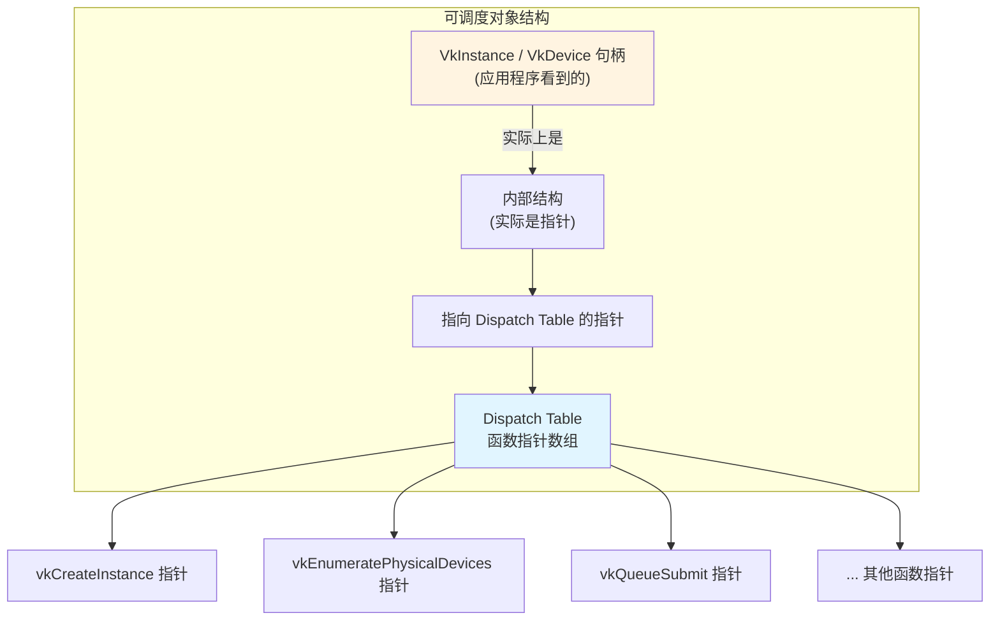
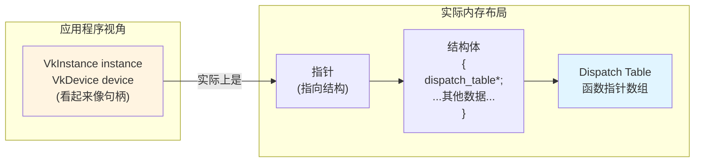
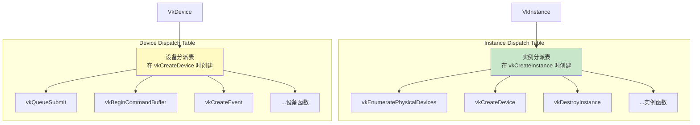
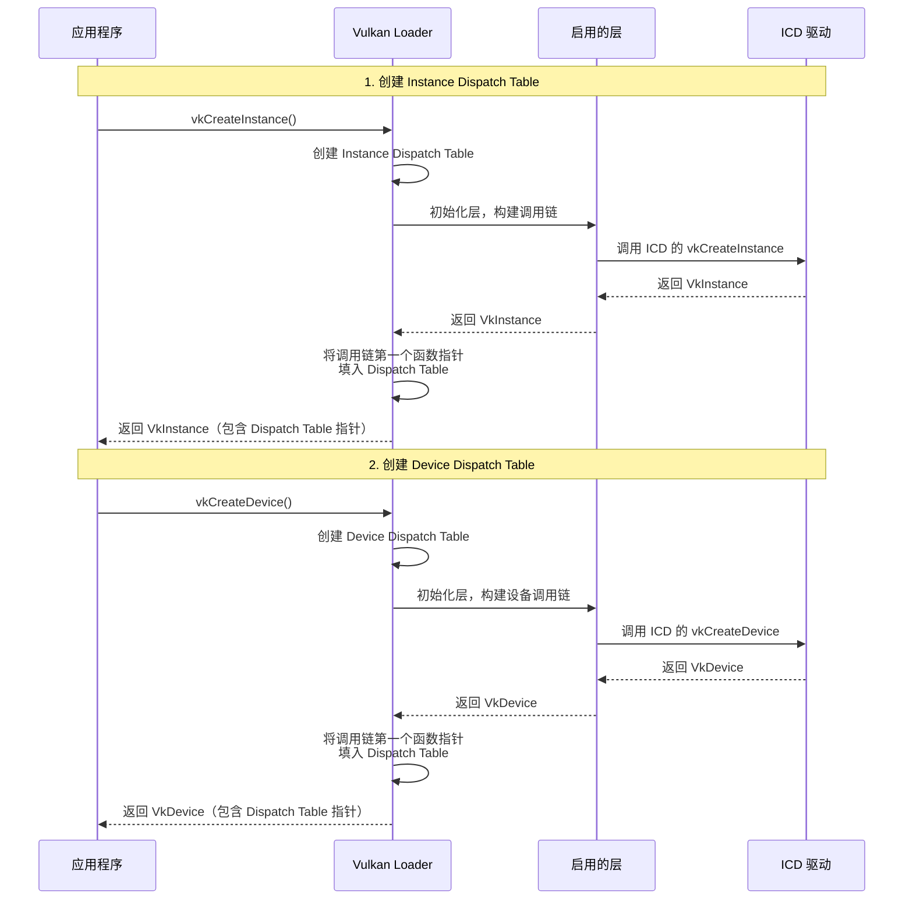
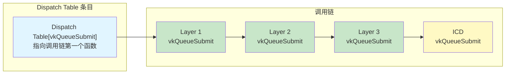
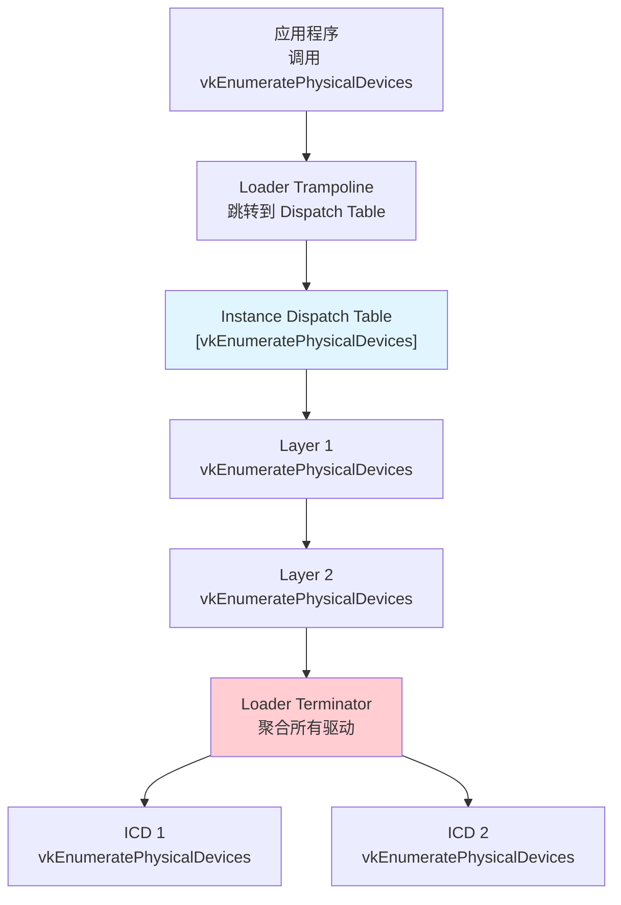
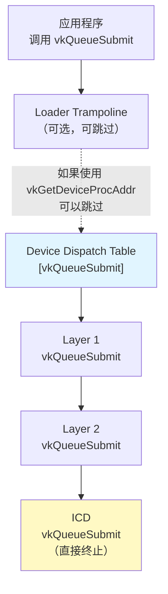
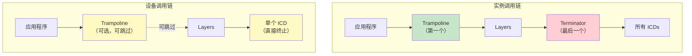
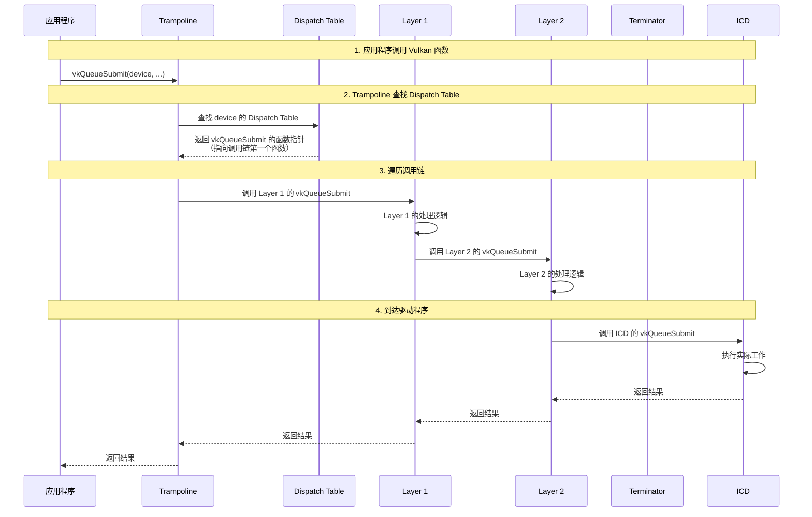
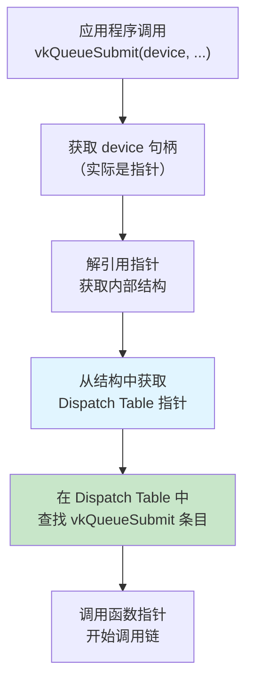

# Dispatch Tables 详解

根据 Vulkan 官方文档 `LoaderInterfaceArchitecture.md` 的说明

## 目录

- [什么是 Dispatch Tables](#什么是-dispatch-tables)
- [可调度对象（Dispatchable Objects）](#可调度对象dispatchable-objects)
- [Dispatch Tables 的类型](#dispatch-tables-的类型)
- [Dispatch Tables 的创建时机](#dispatch-tables-的创建时机)
- [Dispatch Tables 与调用链的关系](#dispatch-tables-与调用链的关系)
- [Trampoline 和 Terminator 函数](#trampoline-和-terminator-函数)
- [工作流程详解](#工作流程详解)
- [性能优化建议](#性能优化建议)

---

## 什么是 Dispatch Tables

### 官方定义

根据 `LoaderInterfaceArchitecture.md` 第 347-356 行：

> **Dispatch Table** 是一个函数指针数组（包括核心函数和可能的扩展函数），用于在调用链中步进到下一个实体。实体可以是加载器、层或驱动程序。

### 核心概念



**关键点：**
- Dispatch Table 是**函数指针数组**
- 每个可调度对象（VkInstance、VkDevice 等）都包含一个指向 Dispatch Table 的指针
- Dispatch Table 中的每个条目指向调用链中的第一个函数

---

## 可调度对象（Dispatchable Objects）

### 定义

根据 Vulkan 规范第 3.3 节（Object Model）：

> 可调度对象是 Vulkan 中用于控制特定操作作用域的对象模型。要执行操作的对象始终是 Vulkan 调用的第一个参数，并且是一个可调度对象。

### 内部结构



**官方说明（第 353-354 行）：**
> 在底层，可调度对象句柄是指向结构的指针，该结构又包含指向由加载器维护的 dispatch table 的指针。

### 可调度对象示例

- `VkInstance`
- `VkPhysicalDevice`
- `VkDevice`
- `VkQueue`
- `VkCommandBuffer`
- 等等...

---

## Dispatch Tables 的类型

根据官方文档第 358-362 行，加载器维护两种类型的 Dispatch Tables：

### 1. Instance Dispatch Table（实例分派表）

**创建时机：** 在调用 `vkCreateInstance` 时在加载器中创建

**作用范围：** 用于所有实例级函数

**包含的函数：**
- `vkEnumerateInstanceExtensionProperties`
- `vkEnumeratePhysicalDevices`
- `vkCreateInstance`
- `vkDestroyInstance`
- 所有实例扩展函数

### 2. Device Dispatch Table（设备分派表）

**创建时机：** 在调用 `vkCreateDevice` 时在加载器中创建

**作用范围：** 用于所有设备级函数

**包含的函数：**
- `vkQueueSubmit`
- `vkBeginCommandBuffer`
- `vkCreateEvent`
- 所有设备扩展函数



---

## Dispatch Tables 的创建时机

### 创建流程



### 关键步骤（第 364-370 行）

1. **应用程序和系统可以指定要包含的可选层**
2. **加载器初始化指定的层，为每个 Vulkan 函数创建调用链**
3. **Dispatch Table 的每个条目指向该调用链的第一个元素**
4. **加载器为每个创建的 `VkInstance` 构建实例调用链**
5. **加载器为每个创建的 `VkDevice` 构建设备调用链**

---

## Dispatch Tables 与调用链的关系

### 调用链结构



**官方说明（第 366-368 行）：**
> 加载器将初始化指定的层，为每个 Vulkan 函数创建调用链，并且 Dispatch Table 的每个条目将指向该调用链的第一个元素。

### 实例调用链示例



### 设备调用链示例



---

## Trampoline 和 Terminator 函数

### Trampoline Function（跳板函数）

**定义（第 1348-1356 行）：**
> 跳板函数是实例或设备调用链中由加载器拥有的第一个函数，它使用适当的 Dispatch Table 处理设置和正确的调用链遍历。

**特点：**
- 是调用链中的**第一个函数**
- 由加载器拥有
- 是**小的、简单的函数**，跳转到 Dispatch Table 中适当的条目
- 对于设备函数，**可以实际跳过**（如果使用 `vkGetDeviceProcAddr`）

**工作方式（第 372-375 行）：**
```
应用程序调用 Vulkan 函数
  ↓
首先到达加载器中的 *trampoline* 函数
  ↓
Trampoline 函数跳转到 Dispatch Table 中适当的条目
  ↓
开始调用链遍历
```

### Terminator Function（终止函数）

**定义（第 1337-1345 行）：**
> 终止函数是实例调用链中驱动程序上方由加载器拥有的最后一个函数。此函数在实例调用链中是必需的，因为所有实例功能必须与所有能够接收调用的驱动程序通信。

**特点：**
- 是实例调用链中的**最后一个函数**（在驱动程序之前）
- 由加载器拥有
- **仅用于实例调用链**
- 必须聚合信息到**所有可用驱动程序**

**工作方式（第 376-378 行）：**
```
所有启用的层处理完函数调用
  ↓
调用加载器的 *terminator* 函数
  ↓
Terminator 将信息聚合到所有可用驱动程序
  ↓
调用每个驱动程序的相应函数
```

### 对比图



---

## 工作流程详解

### 完整调用流程



### Dispatch Table 查找过程



---

## 性能优化建议

### 官方建议（第 114-158 行）

为了获得最佳性能，应用程序应该：

1. **为每个 Vulkan API 入口点设置自己的 Dispatch Table**
2. **使用 `vkGetInstanceProcAddr` 查询实例级函数**
3. **使用 `vkGetDeviceProcAddr` 查询设备级函数**

### 为什么这样做？

#### 使用 vkGetInstanceProcAddr 查询设备函数


**问题：** 每次调用都要经过 Loader Trampoline，增加开销

#### 使用 vkGetDeviceProcAddr 查询设备函数


**优势：** 绕过 Loader Trampoline，直接调用调用链

#### 无层时的最优情况


**官方说明（第 155-158 行）：**
> 注意，如果没有启用层，应用程序函数指针**直接指向驱动程序**。对于许多函数调用，每次调用中缺少间接寻址会累积成可观的性能节省。

### 性能对比

| 查询方式 | 调用路径 | 性能 |
|---------|---------|------|
| 直接链接到 Loader | App → Trampoline → Layers → ICD | 中等 |
| vkGetInstanceProcAddr | App → Trampoline → Layers → ICD | 中等 |
| vkGetDeviceProcAddr（有层） | App → Layers → ICD | 较好 |
| vkGetDeviceProcAddr（无层） | App → ICD | **最优** |

### 特殊情况

**注意（第 160-170 行）：**
> 有一些设备函数仍然需要加载器使用 *trampoline* 和 *terminator* 拦截它们。这样的函数很少，但它们通常是加载器用自己的数据包装的函数。在这些情况下，即使设备调用链也会继续看起来像实例调用链。

**示例：** `vkCreateSwapchainKHR`
- 需要 Loader 将 KHR_surface 对象转换为驱动程序特定的 KHR_surface 对象
- 因此即使使用 `vkGetDeviceProcAddr`，仍需要经过 Loader

---

## 总结

### Dispatch Tables 的核心作用

1. **函数路由**：将 Vulkan 函数调用路由到正确的调用链
2. **调用链管理**：每个条目指向调用链的第一个函数
3. **性能优化**：通过直接函数指针调用，减少间接寻址开销
4. **层集成**：支持在调用链中插入多个层

### 关键要点

- **两种类型**：Instance Dispatch Table 和 Device Dispatch Table
- **创建时机**：分别在 `vkCreateInstance` 和 `vkCreateDevice` 时创建
- **内部结构**：可调度对象句柄是指向包含 Dispatch Table 指针的结构
- **调用流程**：应用程序 → Trampoline → Dispatch Table → 调用链 → 驱动程序
- **性能优化**：使用 `vkGetDeviceProcAddr` 可以绕过 Loader Trampoline

### 官方文档参考

- `LoaderInterfaceArchitecture.md` 第 347-410 行：Dispatch Tables and Call Chains
- `LoaderInterfaceArchitecture.md` 第 114-177 行：Best Application Performance Setup
- `LoaderInterfaceArchitecture.md` 第 1206-1212 行：Dispatch Table 术语定义
- `LoaderInterfaceArchitecture.md` 第 1347-1356 行：Trampoline Function 定义
- `LoaderInterfaceArchitecture.md` 第 1337-1345 行：Terminator Function 定义

---

## 参考

- [Vulkan 规范第 3.3 节：Object Model](https://www.khronos.org/registry/vulkan/specs/1.3/html/vkspec.html#fundamentals-objectmodel)
- [LoaderInterfaceArchitecture.md](LoaderInterfaceArchitecture.md)
- [LoaderApplicationInterface.md](LoaderApplicationInterface.md)

