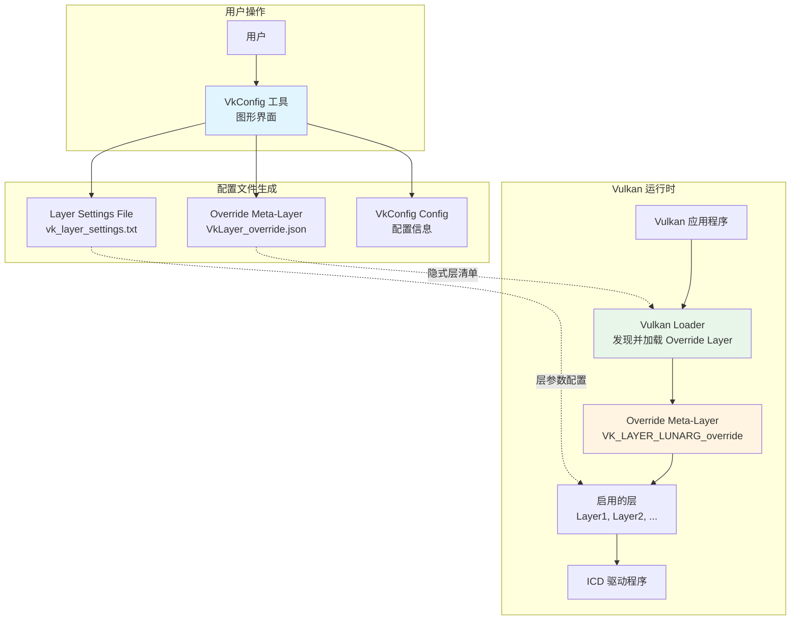
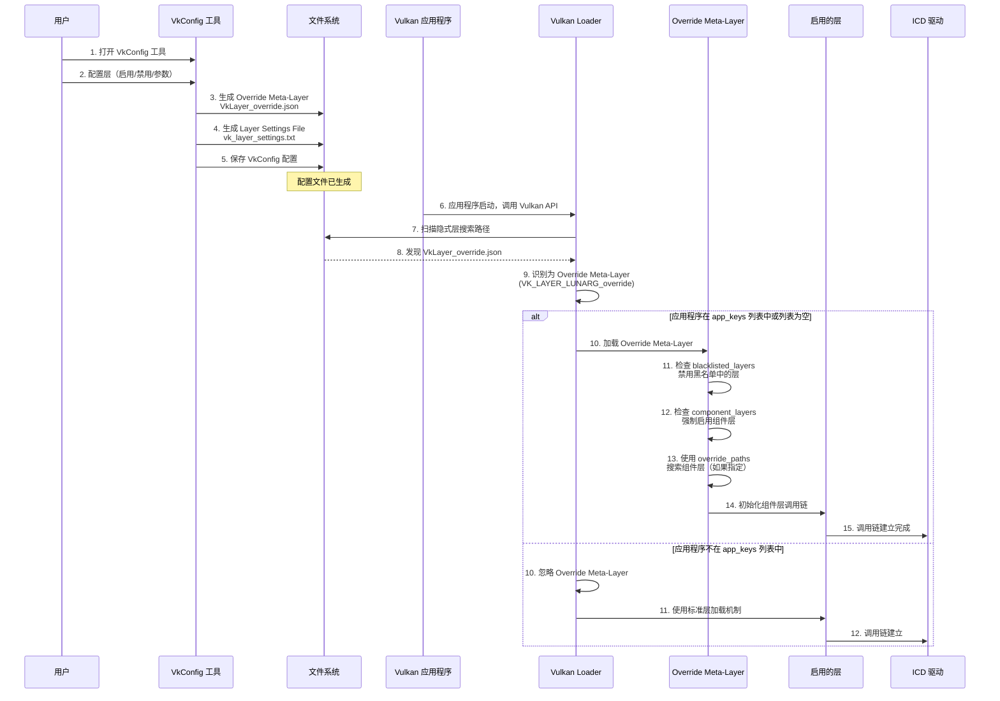
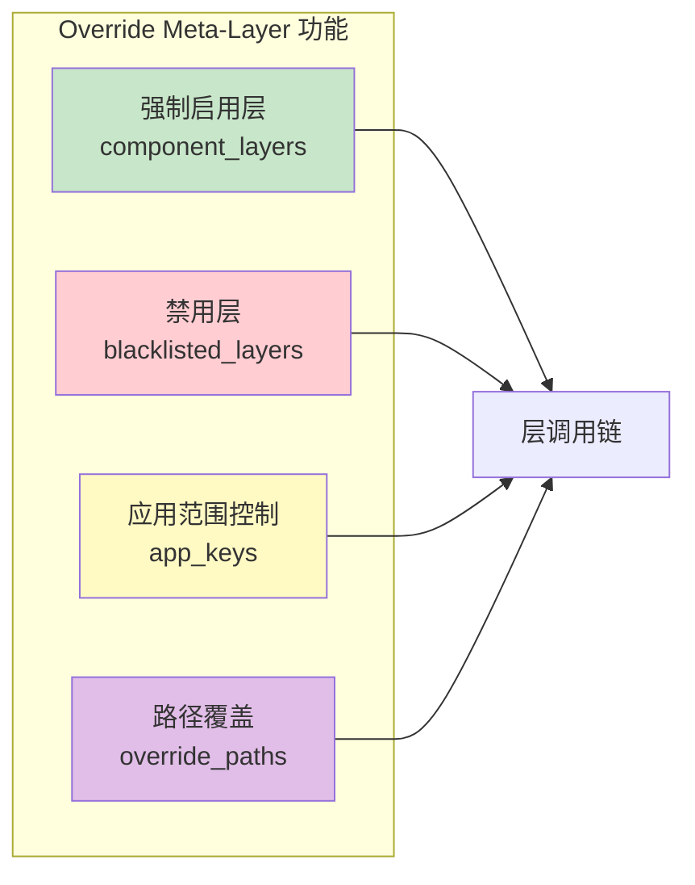
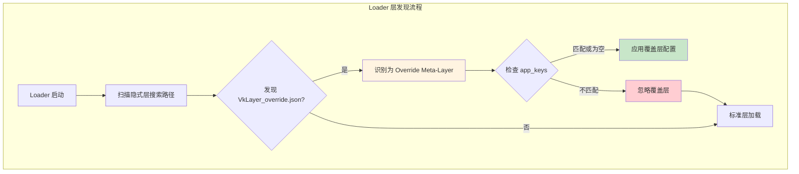
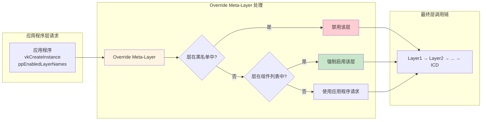
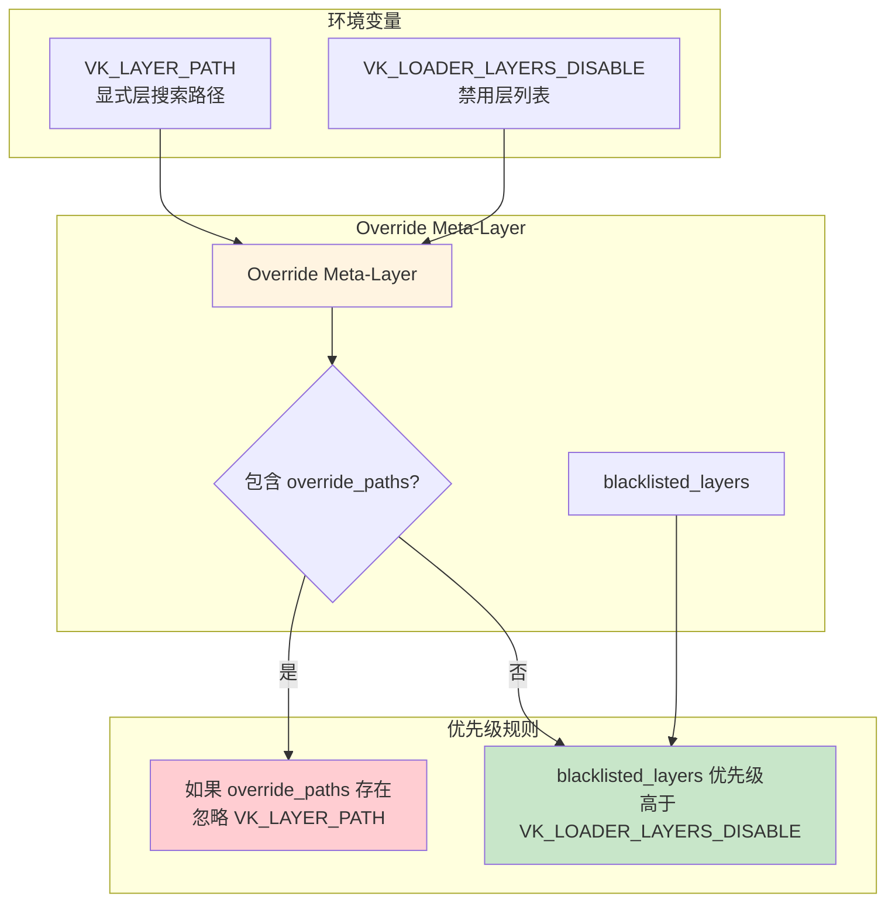
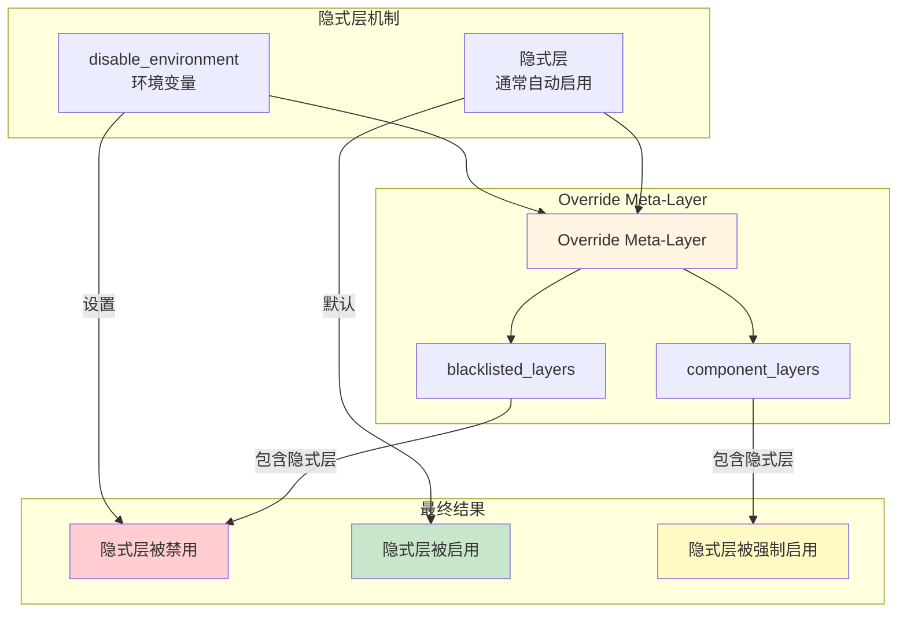

# VkConfig 工作机制详解

## 目录

- [概述](#概述)
- [VkConfig 是什么](#vkconfig-是什么)
- [核心组件](#核心组件)
- [工作流程](#工作流程)
- [Override Meta-Layer 详解](#override-meta-layer-详解)
- [与其他组件的交互](#与其他组件的交互)
- [配置示例](#配置示例)

---

## 概述

VkConfig 是 LunarG 开发的 Vulkan 配置工具，用于在不修改应用程序代码的情况下，统一管理 Vulkan 层的启用、禁用和配置。它通过生成特殊的配置文件（Override Meta-Layer）来影响 Vulkan Loader 的行为。

---

## VkConfig 是什么

### 定义

VkConfig 是一个图形化工具，允许用户：
- 查找系统中可用的 Vulkan 层
- 启用或禁用特定的层
- 配置层的参数和行为
- 为特定应用程序或全局设置层配置

### 获取方式

- 通过安装 [Vulkan SDK](https://vulkan.lunarg.com/)
- 从 [LunarG VulkanTools GitHub 仓库](https://github.com/LunarG/VulkanTools) 构建源码

---

## 核心组件

VkConfig 生成三个核心输出文件：

### 1. Vulkan Override Layer（覆盖元层）

**位置：**
- **Linux**: `$USER/.local/share/vulkan/implicit_layer.d/VkLayer_override.json`
- **Windows**: `%HOME%\AppData\Local\LunarG\vkconfig\override\VkLayerOverride.json`

**作用：** 这是 VkConfig 的核心机制，通过隐式元层控制层的加载。

### 2. Vulkan Layer Settings File（层设置文件）

**位置：**
- **Linux**: `$USER/.local/share/vulkan/settings.d/vk_layer_settings.txt`
- **Windows**: `(registry) HKEY_CURRENT_USER\Software\Khronos\Vulkan\LoaderSettings`

**作用：** 指定每个启用层的特定行为和参数。

### 3. VkConfig Configuration Settings（配置设置）

**位置：**
- **Linux**: `$USER/.local/share/vulkan/settings.d/vk_layer_settings.txt`
- **Windows**: `(registry) HKEY_CURRENT_USER\Software\LunarG\vkconfig`

**作用：** 存储 VkConfig 工具自身的配置信息。

---

## 工作流程

### 整体架构图



### 详细工作流程



---

## Override Meta-Layer 详解

### 什么是 Override Meta-Layer

Override Meta-Layer 是一种特殊的隐式元层，当 Loader 发现名为 `VK_LAYER_LUNARG_override` 的隐式元层时，会将其作为覆盖层使用。

### 核心功能



### 配置项说明

#### 1. `component_layers`（组件层列表）

**作用：** 指定要强制启用的层列表

**特点：**
- 这些层会被强制加载，即使应用程序没有请求
- 所有组件层必须存在于系统中
- 所有组件层必须与元层具有相同或更新的 Vulkan API 版本

**示例：**
```json
{
  "component_layers": [
    "VK_LAYER_KHRONOS_validation",
    "VK_LAYER_LUNARG_api_dump"
  ]
}
```

#### 2. `blacklisted_layers`（黑名单）

**作用：** 指定要禁用的层列表

**特点：**
- 即使应用程序显式请求，这些层也不会被加载
- 可以禁用隐式层和显式层
- 优先级最高，可以覆盖应用程序的层请求

**示例：**
```json
{
  "blacklisted_layers": [
    "VK_LAYER_LUNARG_wrap_objects",
    "VK_LAYER_RENDERDOC_Capture"
  ]
}
```

#### 3. `app_keys`（应用程序键）

**作用：** 指定覆盖层应用到的应用程序路径列表

**行为：**
- **如果列表为空或不存在**：覆盖层全局应用，影响所有应用程序
- **如果列表有内容**：覆盖层只应用于列表中的应用程序
- **如果应用程序不在列表中**：覆盖层不应用，使用标准层加载机制

**示例：**
```json
{
  "app_keys": [
    "C:\\Games\\MyGame\\MyGame.exe",
    "/usr/bin/myapp"
  ]
}
```

#### 4. `override_paths`（覆盖路径）

**作用：** 指定用于搜索组件层的路径列表

**行为：**
- 如果存在，Loader **仅**使用这些路径搜索组件层
- **忽略**默认的显式和隐式层搜索位置
- **忽略**环境变量（如 `VK_LAYER_PATH`）设置的路径
- 如果任何组件层不在提供的覆盖路径中，元层被禁用

**重要：** 如果覆盖层存在且包含 `override_paths`，`VK_LAYER_PATH` 的路径在搜索显式层时被忽略。

**示例：**
```json
{
  "override_paths": [
    "C:\\CustomLayers",
    "/home/user/custom_layers"
  ]
}
```

### Override Meta-Layer 清单文件示例

```json
{
  "file_format_version": "1.1.1",
  "layer": {
    "name": "VK_LAYER_LUNARG_override",
    "type": "GLOBAL",
    "api_version": "1.3.0",
    "implementation_version": "1",
    "description": "VkConfig Override Meta-Layer",
    "component_layers": [
      "VK_LAYER_KHRONOS_validation",
      "VK_LAYER_LUNARG_api_dump"
    ],
    "blacklisted_layers": [
      "VK_LAYER_LUNARG_wrap_objects"
    ],
    "app_keys": [
      "C:\\Games\\MyGame\\MyGame.exe"
    ],
    "override_paths": [
      "C:\\CustomLayers"
    ]
  }
}
```

---

## 与其他组件的交互

### 1. 与 Vulkan Loader 的交互



### 2. 与应用程序的交互



### 3. 与环境变量的交互



### 4. 与隐式层的交互



---

## 配置示例

### 示例 1：全局启用验证层

**场景：** 为所有应用程序全局启用验证层

**VkConfig 配置：**
- 启用：`VK_LAYER_KHRONOS_validation`
- 应用范围：全局（不设置 `app_keys`）

**生成的 Override Meta-Layer：**
```json
{
  "file_format_version": "1.1.1",
  "layer": {
    "name": "VK_LAYER_LUNARG_override",
    "type": "GLOBAL",
    "api_version": "1.3.0",
    "implementation_version": "1",
    "description": "VkConfig Override Meta-Layer",
    "component_layers": [
      "VK_LAYER_KHRONOS_validation"
    ]
  }
}
```

**工作流程：**
```
应用程序启动
  ↓
Loader 发现 Override Meta-Layer
  ↓
app_keys 为空 → 全局应用
  ↓
强制启用 VK_LAYER_KHRONOS_validation
  ↓
构建调用链：App → Loader → Validation Layer → ICD
```

### 示例 2：为特定应用程序禁用层

**场景：** 为特定游戏禁用某个层，但其他应用程序不受影响

**VkConfig 配置：**
- 禁用：`VK_LAYER_RENDERDOC_Capture`
- 应用范围：`C:\Games\MyGame\MyGame.exe`

**生成的 Override Meta-Layer：**
```json
{
  "file_format_version": "1.1.1",
  "layer": {
    "name": "VK_LAYER_LUNARG_override",
    "type": "GLOBAL",
    "api_version": "1.3.0",
    "implementation_version": "1",
    "description": "VkConfig Override Meta-Layer",
    "blacklisted_layers": [
      "VK_LAYER_RENDERDOC_Capture"
    ],
    "app_keys": [
      "C:\\Games\\MyGame\\MyGame.exe"
    ]
  }
}
```

**工作流程：**
```
MyGame.exe 启动
  ↓
Loader 发现 Override Meta-Layer
  ↓
检查 app_keys → 匹配
  ↓
应用 blacklisted_layers → 禁用 RenderDoc 层
  ↓
即使应用程序请求，RenderDoc 层也不会加载

其他应用程序启动
  ↓
Loader 发现 Override Meta-Layer
  ↓
检查 app_keys → 不匹配
  ↓
忽略 Override Meta-Layer
  ↓
使用标准层加载机制
```

### 示例 3：使用自定义层路径

**场景：** 使用自定义路径中的层，忽略系统默认路径

**VkConfig 配置：**
- 启用：自定义层 `VK_LAYER_CUSTOM_MyLayer`
- 自定义路径：`C:\CustomLayers`
- 应用范围：全局

**生成的 Override Meta-Layer：**
```json
{
  "file_format_version": "1.1.1",
  "layer": {
    "name": "VK_LAYER_LUNARG_override",
    "type": "GLOBAL",
    "api_version": "1.3.0",
    "implementation_version": "1",
    "description": "VkConfig Override Meta-Layer",
    "component_layers": [
      "VK_LAYER_CUSTOM_MyLayer"
    ],
    "override_paths": [
      "C:\\CustomLayers"
    ]
  }
}
```

**工作流程：**
```
应用程序启动
  ↓
Loader 发现 Override Meta-Layer
  ↓
检查 override_paths → 存在
  ↓
仅在 C:\CustomLayers 中搜索组件层
  ↓
忽略 VK_LAYER_PATH 环境变量
  ↓
忽略默认层搜索路径
  ↓
如果 VK_LAYER_CUSTOM_MyLayer 在 C:\CustomLayers 中找到
  → 启用该层
否则
  → 元层被禁用
```

---

## 关键要点总结

### 1. Override Meta-Layer 的优先级

```
Override Meta-Layer 的 blacklisted_layers
  > 应用程序的 ppEnabledLayerNames
  > 环境变量 VK_LOADER_LAYERS_DISABLE
  > 隐式层的自动启用
```

### 2. 路径搜索优先级

```
如果 Override Meta-Layer 包含 override_paths：
  仅使用 override_paths 中的路径
  忽略 VK_LAYER_PATH
  忽略默认搜索路径

如果 Override Meta-Layer 不包含 override_paths：
  使用标准搜索路径（环境变量 + 默认路径）
```

### 3. 应用范围控制

```
app_keys 为空或不存在：
  → 全局应用，影响所有应用程序

app_keys 有内容：
  → 仅应用于列表中的应用程序
  → 其他应用程序不受影响
```

### 4. 生命周期

- Override Meta-Layer 通常在 VkConfig 工具运行时可用
- 当 VkConfig 关闭时，覆盖层可能被移除或禁用
- 配置文件是持久化的，即使 VkConfig 关闭也会生效

---

## 参考文档

- [LoaderInterfaceArchitecture.md](LoaderInterfaceArchitecture.md) - VkConfig 概述
- [LoaderLayerInterface.md](LoaderLayerInterface.md) - Override Meta-Layer 详细说明
- [VkConfig GitHub 文档](https://github.com/LunarG/VulkanTools/blob/main/vkconfig/README.md) - 官方工具文档

---

## 总结

VkConfig 通过 Override Meta-Layer 机制实现了对 Vulkan 层的集中管理：

1. **生成机制**：VkConfig 工具生成隐式元层清单文件
2. **发现机制**：Vulkan Loader 自动发现并识别 Override Meta-Layer
3. **应用机制**：根据 `app_keys` 决定是否应用覆盖层
4. **控制机制**：通过 `component_layers` 和 `blacklisted_layers` 控制层的启用/禁用
5. **路径机制**：通过 `override_paths` 完全控制层的搜索路径

这使得开发者可以在不修改应用程序代码的情况下，通过 VkConfig 工具统一管理 Vulkan 层的启用和配置，为调试、性能分析和开发提供了强大的支持。

