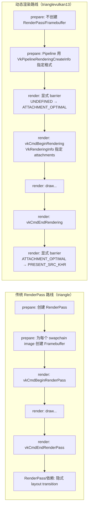
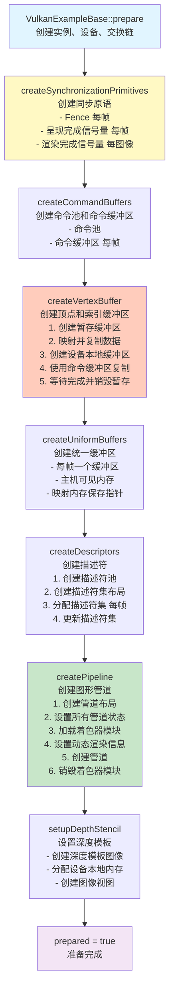
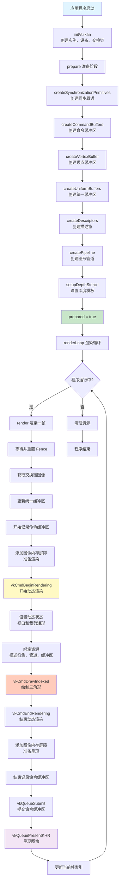

```mermaid
flowchart TD
    Start[render 函数开始] --> WaitFence[等待并重置 Fence<br/>vkWaitForFences<br/>vkResetFences]
    WaitFence --> AcquireImage[获取交换链图像<br/>vkAcquireNextImageKHR<br/>等待呈现完成信号量]
    AcquireImage --> UpdateUBO[更新统一缓冲区<br/>准备着色器数据<br/>memcpy 到映射内存]
    UpdateUBO --> BeginCmd[开始记录命令缓冲区<br/>vkResetCommandBuffer<br/>vkBeginCommandBuffer]
    BeginCmd --> Barrier1[添加图像内存屏障<br/>准备渲染<br/>UNDEFINED → ATTACHMENT_OPTIMAL]
    Barrier1 --> BeginRender[vkCmdBeginRendering<br/>开始动态渲染<br/>设置颜色和深度附件]
    BeginRender --> SetViewport[设置动态状态<br/>vkCmdSetViewport<br/>vkCmdSetScissor]
    SetViewport --> BindRes[绑定资源<br/>vkCmdBindDescriptorSets<br/>vkCmdBindPipeline<br/>vkCmdBindVertexBuffers<br/>vkCmdBindIndexBuffer]
    BindRes --> Draw[vkCmdDrawIndexed<br/>绘制索引三角形<br/>索引数: 3, 实例数: 1]
    Draw --> EndRender[vkCmdEndRendering<br/>结束动态渲染]
    EndRender --> Barrier2[添加图像内存屏障<br/>准备呈现<br/>ATTACHMENT_OPTIMAL → PRESENT_SRC_KHR]
    Barrier2 --> EndCmd[结束记录命令缓冲区<br/>vkEndCommandBuffer]
    EndCmd --> Submit[vkQueueSubmit<br/>提交命令缓冲区到队列<br/>等待: 呈现完成信号量<br/>信号: 渲染完成信号量<br/>等待栅栏: Fence]
    Submit --> Present[vkQueuePresentKHR<br/>呈现图像到交换链<br/>等待: 渲染完成信号量]
    Present --> UpdateFrame[更新当前帧索引<br/>currentFrame = currentFrame + 1 % MAX_FRAMES]
    UpdateFrame --> Loop{继续循环?}
    Loop -->|是| WaitFence
    Loop -->|否| End[结束]
    
    style Start fill:#e1f5ff
    style BeginRender fill:#fff9c4
    style Draw fill:#ffccbc
    style Present fill:#f3e5f5
    style End fill:#c8e6c9
```

# TriangleVulkan13 案例完整流程文档

## 一、案例概述

`trianglevulkan13` 是使用 **Vulkan 1.3** API 渲染基础索引三角形的示例。与传统的 `triangle` 案例相比，它使用了 Vulkan 1.3 的新特性：

- **动态渲染（Dynamic Rendering）**：不需要预先创建 RenderPass 和 Framebuffer
- **同步2（Synchronization2）**：更灵活的同步机制
- **简化的 API**：减少了样板代码

## 二、与 Triangle 案例的主要区别

| 特性 | Triangle | TriangleVulkan13 |
|------|----------|------------------|
| Vulkan 版本 | 1.0+ | 1.3 |
| RenderPass | 需要创建 | 不需要（使用动态渲染） |
| Framebuffer | 需要创建 | 不需要（使用动态渲染） |
| 渲染开始 | `vkCmdBeginRenderPass` | `vkCmdBeginRendering` |
| 渲染结束 | `vkCmdEndRenderPass` | `vkCmdEndRendering` |
| 图像布局转换 | 由 RenderPass 自动处理 | 需要手动添加内存屏障 |

## 二点五、动态渲染（Vulkan 1.3）到底“改了流程的哪几步”

如果你把 Vulkan 渲染理解成“**准备阶段 build 一套渲染描述（RenderPass/Framebuffer）+ 每帧按这套描述去画**”，那么动态渲染做的事情就是：

- **删掉 RenderPass/Framebuffer 这套“提前固化的描述”**
- 改成在每帧录制命令时，使用 `vkCmdBeginRendering` 传入 `VkRenderingInfo`，**当场声明本次渲染要用的附件**（颜色/深度/模板）
- 因为没有 RenderPass 提供的隐式布局转换，所以你需要在命令缓冲区里**显式写 barrier**，把图像从一个 layout 转到另一个 layout

### 2.5.1 一张对照图：传统 RenderPass vs 动态渲染



### 2.5.2 准备阶段（prepare）里，动态渲染少了什么、多了什么？

- **少了（传统路线才需要）**
  - **RenderPass**：提前描述附件、load/store、subpass、依赖、final layout 等
  - **Framebuffer**：把 swapchain image view + depth view 组装成一套 attachment 集合（每个 swapchain image 一套）

- **多了（动态渲染路线需要额外注意）**
  - **Pipeline 创建时要声明附件格式**：使用 `VkPipelineRenderingCreateInfo`（pNext）告诉管线它将要输出到什么格式的 color/depth（这是动态渲染下“管线与附件格式匹配”的关键）
  - **render() 里要写显式 barrier**：渲染前/呈现前做 layout transition（本示例用 `vks::tools::insertImageMemoryBarrier`）

### 2.5.3 每帧渲染（render）里，最关键的变化是什么？

**变化点 1：开始渲染的入口不同**

- 传统：`vkCmdBeginRenderPass(...)`（RenderPass + Framebuffer 决定了本次渲染的附件集合）
- 动态：`vkCmdBeginRendering(commandBuffer, &renderingInfo)`，并在 `renderingInfo` 里**直接给出**：
  - `colorAttachment.imageView`（当前 swapchain imageView）
  - `colorAttachment.loadOp/storeOp/clearValue`
  - `depthStencilAttachment.imageView`（深度视图）

**变化点 2：layout transition 从“隐式”变“显式”（最容易卡住）**

- 传统路线里，你在 RenderPass 里写 `initialLayout/finalLayout` + subpass dependency，驱动会在 renderpass 边界隐式完成很多转换
- 动态渲染没有 RenderPass 边界，所以你必须在命令缓冲区里显式写 barrier：
  - **渲染前**：swapchain image / depth image → `ATTACHMENT_OPTIMAL`
  - **渲染后呈现前**：swapchain image → `PRESENT_SRC_KHR`

> 小提示：你看到 `trianglevulkan13` 的 `render()` 一开始就插入两次 barrier（颜色/深度），结束渲染后又插一次 barrier（颜色转 present），这就是动态渲染“流程变化”的核心体现。

### 2.5.4 你可以用这套“心智模型”理解动态渲染

- **RenderPass 路线**：把“渲染的契约”提前固化成对象（RenderPass/Framebuffer），每帧只引用它
- **动态渲染路线**：把“渲染的契约”变成每帧命令缓冲区里的一段描述（`VkRenderingInfo`），同时你要自己负责关键的 layout transition

## 三、完整流程

### 3.1 初始化阶段（prepare）

#### Mermaid 流程图



#### 文本流程图

```
┌─────────────────────────────────────────────────────────────┐
│                    VulkanExampleBase::prepare()              │
│  - 创建 Vulkan 实例                                          │
│  - 选择物理设备                                              │
│  - 创建设备和队列                                            │
│  - 创建交换链                                                │
└─────────────────────────────────────────────────────────────┘
                        │
                        ▼
┌─────────────────────────────────────────────────────────────┐
│              createSynchronizationPrimitives()               │
│  - 创建每帧的 Fence（等待栅栏）                              │
│  - 创建呈现完成信号量（每帧）                                │
│  - 创建渲染完成信号量（每个交换链图像）                       │
└─────────────────────────────────────────────────────────────┘
                        │
                        ▼
┌─────────────────────────────────────────────────────────────┐
│                    createCommandBuffers()                    │
│  - 创建命令池                                                │
│  - 为每帧分配命令缓冲区                                       │
└─────────────────────────────────────────────────────────────┘
                        │
                        ▼
┌─────────────────────────────────────────────────────────────┐
│                     createVertexBuffer()                     │
│  1. 创建暂存缓冲区（主机可见）                               │
│     - 映射内存                                               │
│     - 复制顶点和索引数据                                     │
│  2. 创建设备本地缓冲区                                       │
│     - 顶点缓冲区                                             │
│     - 索引缓冲区                                             │
│  3. 使用命令缓冲区复制数据                                   │
│     - 记录复制命令                                           │
│     - 提交到队列                                             │
│     - 等待完成                                                │
│  4. 销毁暂存缓冲区                                            │
└─────────────────────────────────────────────────────────────┘
                        │
                        ▼
┌─────────────────────────────────────────────────────────────┐
│                   createUniformBuffers()                      │
│  - 为每帧创建统一缓冲区                                       │
│  - 分配主机可见内存                                           │
│  - 映射内存（保存指针用于后续更新）                          │
└─────────────────────────────────────────────────────────────┘
                        │
                        ▼
┌─────────────────────────────────────────────────────────────┐
│                      createDescriptors()                      │
│  1. 创建描述符池                                             │
│  2. 创建描述符集布局                                         │
│  3. 为每帧分配描述符集                                       │
│  4. 更新描述符集（绑定统一缓冲区）                           │
└─────────────────────────────────────────────────────────────┘
                        │
                        ▼
┌─────────────────────────────────────────────────────────────┐
│                      createPipeline()                        │
│  1. 创建管道布局                                             │
│  2. 设置管道状态：                                           │
│     - 输入装配状态（三角形列表）                             │
│     - 光栅化状态                                             │
│     - 颜色混合状态                                           │
│     - 视口状态（动态）                                       │
│     - 深度模板状态                                           │
│     - 多重采样状态                                           │
│     - 顶点输入状态                                           │
│  3. 加载着色器模块                                           │
│     - 顶点着色器                                             │
│     - 片段着色器                                             │
│  4. 设置动态渲染信息（Vulkan 1.3）                          │
│     - 颜色附件格式                                           │
│     - 深度附件格式                                           │
│  5. 创建图形管道                                             │
│  6. 销毁着色器模块                                           │
└─────────────────────────────────────────────────────────────┘
                        │
                        ▼
┌─────────────────────────────────────────────────────────────┐
│                    setupDepthStencil()                       │
│  - 创建深度模板图像                                           │
│  - 分配设备本地内存                                           │
│  - 创建图像视图                                               │
└─────────────────────────────────────────────────────────────┘
                        │
                        ▼
┌─────────────────────────────────────────────────────────────┐
│                    prepared = true                           │
│                    准备完成，可以开始渲染                     │
└─────────────────────────────────────────────────────────────┘
```

### 3.2 渲染循环（render）

#### Mermaid 流程图



#### 文本流程图

```
┌─────────────────────────────────────────────────────────────┐
│                         render()                             │
│                     每帧调用一次                             │
└─────────────────────────────────────────────────────────────┘
                        │
                        ▼
┌─────────────────────────────────────────────────────────────┐
│              等待并重置 Fence                                │
│  vkWaitForFences() - 等待上一帧完成                         │
│  vkResetFences() - 重置栅栏                                 │
└─────────────────────────────────────────────────────────────┘
                        │
                        ▼
┌─────────────────────────────────────────────────────────────┐
│              获取交换链图像                                  │
│  vkAcquireNextImageKHR()                                    │
│  - 等待呈现完成信号量                                        │
│  - 返回图像索引                                              │
└─────────────────────────────────────────────────────────────┘
                        │
                        ▼
┌─────────────────────────────────────────────────────────────┐
│              更新统一缓冲区                                  │
│  - 准备着色器数据（投影、视图、模型矩阵）                    │
│  - memcpy 复制到映射内存                                     │
│  - 主机一致性内存，GPU 立即可见                              │
└─────────────────────────────────────────────────────────────┘
                        │
                        ▼
┌─────────────────────────────────────────────────────────────┐
│              开始记录命令缓冲区                              │
│  vkResetCommandBuffer() - 重置                               │
│  vkBeginCommandBuffer() - 开始记录                           │
└─────────────────────────────────────────────────────────────┘
                        │
                        ▼
┌─────────────────────────────────────────────────────────────┐
│          添加图像内存屏障（准备渲染）                        │
│  1. 颜色图像：UNDEFINED → ATTACHMENT_OPTIMAL                │
│  2. 深度图像：UNDEFINED → ATTACHMENT_OPTIMAL                │
└─────────────────────────────────────────────────────────────┘
                        │
                        ▼
┌─────────────────────────────────────────────────────────────┐
│              开始动态渲染                                    │
│  vkCmdBeginRendering()                                       │
│  - 设置颜色附件信息                                          │
│  - 设置深度模板附件信息                                      │
│  - 设置渲染区域                                              │
└─────────────────────────────────────────────────────────────┘
                        │
                        ▼
┌─────────────────────────────────────────────────────────────┐
│              设置动态状态                                    │
│  vkCmdSetViewport() - 设置视口                              │
│  vkCmdSetScissor() - 设置裁剪矩形                           │
└─────────────────────────────────────────────────────────────┘
                        │
                        ▼
┌─────────────────────────────────────────────────────────────┐
│              绑定资源                                        │
│  vkCmdBindDescriptorSets() - 绑定描述符集                   │
│  vkCmdBindPipeline() - 绑定管道                              │
│  vkCmdBindVertexBuffers() - 绑定顶点缓冲区                  │
│  vkCmdBindIndexBuffer() - 绑定索引缓冲区                    │
└─────────────────────────────────────────────────────────────┘
                        │
                        ▼
┌─────────────────────────────────────────────────────────────┐
│              绘制三角形                                      │
│  vkCmdDrawIndexed()                                          │
│  - 索引数量：3                                               │
│  - 实例数量：1                                               │
└─────────────────────────────────────────────────────────────┘
                        │
                        ▼
┌─────────────────────────────────────────────────────────────┐
│              结束动态渲染                                    │
│  vkCmdEndRendering()                                         │
└─────────────────────────────────────────────────────────────┘
                        │
                        ▼
┌─────────────────────────────────────────────────────────────┐
│          添加图像内存屏障（准备呈现）                        │
│  颜色图像：ATTACHMENT_OPTIMAL → PRESENT_SRC_KHR             │
└─────────────────────────────────────────────────────────────┘
                        │
                        ▼
┌─────────────────────────────────────────────────────────────┐
│              结束记录命令缓冲区                              │
│  vkEndCommandBuffer()                                        │
└─────────────────────────────────────────────────────────────┘
                        │
                        ▼
┌─────────────────────────────────────────────────────────────┐
│              提交命令缓冲区到队列                            │
│  vkQueueSubmit()                                              │
│  - 等待：呈现完成信号量                                      │
│  - 信号：渲染完成信号量                                      │
│  - 等待栅栏：当前帧的 Fence                                  │
└─────────────────────────────────────────────────────────────┘
                        │
                        ▼
┌─────────────────────────────────────────────────────────────┐
│              呈现图像到交换链                                │
│  vkQueuePresentKHR()                                         │
│  - 等待：渲染完成信号量                                      │
│  - 显示图像到屏幕                                            │
└─────────────────────────────────────────────────────────────┘
                        │
                        ▼
┌─────────────────────────────────────────────────────────────┐
│              更新当前帧索引                                  │
│  currentFrame = (currentFrame + 1) % MAX_CONCURRENT_FRAMES   │
└─────────────────────────────────────────────────────────────┘
                        │
                        └──────────────┐
                                       │
                                       ▼
                            ┌──────────────────────┐
                            │   继续下一帧循环     │
                            └──────────────────────┘
```

## 四、关键代码片段说明

### 4.1 启用 Vulkan 1.3 特性

```cpp
VulkanExample() : VulkanExampleBase()
{
    apiVersion = VK_API_VERSION_1_3;  // 设置 API 版本为 1.3
    enabledFeatures.dynamicRendering = VK_TRUE;  // 启用动态渲染
    enabledFeatures.synchronization2 = VK_TRUE;  // 启用同步2
    deviceCreatepNextChain = &enabledFeatures;  // 添加到设备创建链
}
```

### 4.2 动态渲染管道创建

```cpp
// 设置动态渲染信息（替代 RenderPass）
VkPipelineRenderingCreateInfoKHR pipelineRenderingCI{};
pipelineRenderingCI.colorAttachmentCount = 1;
pipelineRenderingCI.pColorAttachmentFormats = &swapChain.colorFormat;
pipelineRenderingCI.depthAttachmentFormat = depthFormat;
pipelineRenderingCI.stencilAttachmentFormat = depthFormat;

pipelineCI.pNext = &pipelineRenderingCI;  // 添加到管道创建信息
```

### 4.3 动态渲染开始

```cpp
// 设置颜色附件
VkRenderingAttachmentInfo colorAttachment{};
colorAttachment.imageView = swapChain.imageViews[imageIndex];
colorAttachment.imageLayout = VK_IMAGE_LAYOUT_COLOR_ATTACHMENT_OPTIMAL;
colorAttachment.loadOp = VK_ATTACHMENT_LOAD_OP_CLEAR;
colorAttachment.storeOp = VK_ATTACHMENT_STORE_OP_STORE;
colorAttachment.clearValue.color = { 0.0f, 0.0f, 0.2f, 0.0f };

// 设置深度模板附件
VkRenderingAttachmentInfo depthStencilAttachment{};
depthStencilAttachment.imageView = depthStencil.view;
depthStencilAttachment.imageLayout = VK_IMAGE_LAYOUT_DEPTH_STENCIL_ATTACHMENT_OPTIMAL;
depthStencilAttachment.loadOp = VK_ATTACHMENT_LOAD_OP_CLEAR;
depthStencilAttachment.storeOp = VK_ATTACHMENT_STORE_OP_DONT_CARE;
depthStencilAttachment.clearValue.depthStencil = { 1.0f, 0 };

// 开始动态渲染
VkRenderingInfo renderingInfo{};
renderingInfo.renderArea = { 0, 0, width, height };
renderingInfo.layerCount = 1;
renderingInfo.colorAttachmentCount = 1;
renderingInfo.pColorAttachments = &colorAttachment;
renderingInfo.pDepthAttachment = &depthStencilAttachment;
renderingInfo.pStencilAttachment = &depthStencilAttachment;

vkCmdBeginRendering(commandBuffer, &renderingInfo);
```

### 4.4 图像布局转换（手动屏障）

```cpp
// 准备渲染：转换到附件最优布局
vks::tools::insertImageMemoryBarrier(
    commandBuffer, 
    swapChain.images[imageIndex],
    0, 
    VK_ACCESS_COLOR_ATTACHMENT_WRITE_BIT,
    VK_IMAGE_LAYOUT_UNDEFINED,
    VK_IMAGE_LAYOUT_ATTACHMENT_OPTIMAL,
    VK_PIPELINE_STAGE_COLOR_ATTACHMENT_OUTPUT_BIT,
    VK_PIPELINE_STAGE_COLOR_ATTACHMENT_OUTPUT_BIT,
    VkImageSubresourceRange{ VK_IMAGE_ASPECT_COLOR_BIT, 0, 1, 0, 1 }
);

// 准备呈现：转换到呈现源布局
vks::tools::insertImageMemoryBarrier(
    commandBuffer,
    swapChain.images[imageIndex],
    VK_ACCESS_COLOR_ATTACHMENT_WRITE_BIT,
    0,
    VK_IMAGE_LAYOUT_ATTACHMENT_OPTIMAL,
    VK_IMAGE_LAYOUT_PRESENT_SRC_KHR,
    VK_PIPELINE_STAGE_COLOR_ATTACHMENT_OUTPUT_BIT,
    VK_PIPELINE_STAGE_2_NONE,
    VkImageSubresourceRange{ VK_IMAGE_ASPECT_COLOR_BIT, 0, 1, 0, 1 }
);
```

## 五、流程图总览

### 5.1 Mermaid 流程图（支持图形化显示）



### 5.2 文本流程图

```
┌─────────────────────────────────────────────────────────────────┐
│                        应用程序启动                               │
└─────────────────────────────────────────────────────────────────┘
                              │
                              ▼
┌─────────────────────────────────────────────────────────────────┐
│                    initVulkan()                                  │
│  - 创建实例、设备、交换链                                        │
└─────────────────────────────────────────────────────────────────┘
                              │
                              ▼
┌─────────────────────────────────────────────────────────────────┐
│                    prepare()                                     │
│  ┌──────────────────────────────────────────────────────────┐  │
│  │  createSynchronizationPrimitives()                       │  │
│  │  createCommandBuffers()                                   │  │
│  │  createVertexBuffer()                                     │  │
│  │  createUniformBuffers()                                   │  │
│  │  createDescriptors()                                       │  │
│  │  createPipeline()                                         │  │
│  │  setupDepthStencil()                                      │  │
│  └──────────────────────────────────────────────────────────┘  │
└─────────────────────────────────────────────────────────────────┘
                              │
                              ▼
┌─────────────────────────────────────────────────────────────────┐
│                    renderLoop()                                  │
│  ┌──────────────────────────────────────────────────────────┐  │
│  │  while (running) {                                         │  │
│  │      render()  ←──────────────────────────────────────┐   │  │
│  │      │                                                 │   │  │
│  │      │  1. 等待 Fence                                 │   │  │
│  │      │  2. 获取交换链图像                             │   │  │
│  │      │  3. 更新统一缓冲区                             │   │  │
│  │      │  4. 记录命令缓冲区                             │   │  │
│  │      │     - 图像屏障（准备）                         │   │  │
│  │      │     - 开始动态渲染                             │   │  │
│  │      │     - 设置状态和绑定资源                       │   │  │
│  │      │     - 绘制                                     │   │  │
│  │      │     - 结束动态渲染                             │   │  │
│  │      │     - 图像屏障（呈现）                         │   │  │
│  │      │  5. 提交命令缓冲区                             │   │  │
│  │      │  6. 呈现图像                                   │   │  │
│  │      │  7. 更新帧索引                                 │   │  │
│  │      └─────────────────────────────────────────────────┘   │  │
│  │  }                                                          │  │
│  └──────────────────────────────────────────────────────────┘  │
└─────────────────────────────────────────────────────────────────┘
                              │
                              ▼
┌─────────────────────────────────────────────────────────────────┐
│                    清理资源                                      │
│  - 销毁管道、缓冲区、描述符等                                   │
└─────────────────────────────────────────────────────────────────┘
```

## 六、关键概念说明

### 6.1 动态渲染（Dynamic Rendering）

动态渲染是 Vulkan 1.3 引入的特性，允许在不需要预先创建 RenderPass 和 Framebuffer 的情况下进行渲染。主要优势：

- **简化代码**：不需要创建和管理 RenderPass/Framebuffer
- **更灵活**：可以在运行时动态指定附件
- **减少开销**：减少了对象创建和管理成本

### 6.2 同步机制

- **Fence**：用于 CPU 等待 GPU 完成命令缓冲区执行
- **Semaphore**：用于 GPU 内部不同操作之间的同步
  - `presentCompleteSemaphore`：等待图像可用于渲染
  - `renderCompleteSemaphore`：等待渲染完成

### 6.3 帧重叠（Frame Overlap）

使用 `MAX_CONCURRENT_FRAMES = 2` 实现帧重叠：
- 允许 CPU 在 GPU 渲染第 N 帧时准备第 N+1 帧
- 提高 GPU 和 CPU 的利用率
- 需要为每帧创建独立的资源（命令缓冲区、统一缓冲区、描述符集等）

## 七、总结

`trianglevulkan13` 案例展示了如何使用 Vulkan 1.3 的新特性来简化渲染流程。通过使用动态渲染，代码更加简洁，同时保持了 Vulkan 的性能优势。主要步骤包括：

1. **初始化**：创建所有必要的 Vulkan 资源
2. **准备**：设置同步原语、缓冲区、描述符和管道
3. **渲染**：每帧执行渲染循环
4. **清理**：释放所有资源

这个案例是学习 Vulkan 1.3 动态渲染的绝佳起点。

